# 金融服务Schema思维导图

## 📑 目录

- [金融服务Schema思维导图](#金融服务schema思维导图)
  - [📑 目录](#-目录)
  - [1. 思维导图概述](#1-思维导图概述)
    - [1.1 导图结构](#11-导图结构)
    - [1.2 核心概念](#12-核心概念)
    - [1.3 关联主题](#13-关联主题)
  - [2. 完整思维导图](#2-完整思维导图)
  - [3. 主要分支详解](#3-主要分支详解)
    - [3.1 支付系统](#31-支付系统)
    - [3.2 银行核心](#32-银行核心)
    - [3.3 证券交易](#33-证券交易)
    - [3.4 保险系统](#34-保险系统)
    - [3.5 监管合规](#35-监管合规)
  - [4. Mermaid可视化](#4-mermaid可视化)
    - [4.1 思维导图Mermaid图](#41-思维导图mermaid图)
    - [4.2 关联主题图](#42-关联主题图)

---

## 1. 思维导图概述

本文档以思维导图的形式展示金融服务Schema
的知识体系结构，帮助理解各个子领域之间的关系。

### 1.1 导图结构

思维导图分为以下主要分支：

1. **支付系统**: 移动支付, 跨境支付, 数字货币...
2. **银行核心**: 核心 banking, 信贷系统, 风控系统...
3. **证券交易**: 股票交易, 期货交易, 衍生品...
4. **保险系统**: 寿险系统, 财险系统, 精算模型...
5. **监管合规**: 反洗钱AML, KYC客户识别, 巴塞尔协议...

### 1.2 核心概念

金融服务Schema的核心概念包括：

- **Schema定义**: 领域特定的数据结构和语义规范
- **标准化**: 遵循行业标准和最佳实践
- **互操作性**: 不同系统之间的数据交换能力
- **可扩展性**: 支持业务增长和变化的能力

### 1.3 关联主题

本主题与以下主题有关联：

- **26_Enterprise_Finance**: 企业财务Schema
- **32_Security_Compliance**: 安全合规Schema
- **07_Logistics_Supply_Chain**: 物流供应链Schema

---

## 2. 完整思维导图

```text
金融服务Schema
│

├─ 1. 支付系统
│   ├─ 移动支付
│   ├─ 跨境支付
│   ├─ 数字货币
│   ├─ 支付网关

├─ 2. 银行核心
│   ├─ 核心 banking
│   ├─ 信贷系统
│   ├─ 风控系统
│   ├─ 清算结算

├─ 3. 证券交易
│   ├─ 股票交易
│   ├─ 期货交易
│   ├─ 衍生品
│   ├─ 算法交易

├─ 4. 保险系统
│   ├─ 寿险系统
│   ├─ 财险系统
│   ├─ 精算模型
│   ├─ 理赔处理

├─ 5. 监管合规
│   ├─ 反洗钱AML
│   ├─ KYC客户识别
│   ├─ 巴塞尔协议
│   ├─ MiFID II
│
└─ 标准体系
    ├─ 国际标准
    │   ├─ ISO系列标准
    │   └─ IEC系列标准
    ├─ 行业标准
    │   ├─ 行业协会标准
    │   └─ 事实标准
    └─ 技术规范
        ├─ API规范
        ├─ 数据格式
        └─ 协议规范

├─ 技术架构
    │
    ├─ 数据层
    │   ├─ 数据模型
    │   ├─ 存储方案
    │   └─ 数据治理
    │
    ├─ 服务层
    │   ├─ 业务服务
    │   ├─ 集成服务
    │   └─ 公共服务
    │
    ├─ 应用层
    │   ├─ 业务应用
    │   ├─ 移动应用
    │   └─ 分析应用
    │
    └─ 接入层
        ├─ API网关
        ├─ 消息总线
        └─ 文件交换

├─ 集成模式
    │
    ├─ 系统间集成
    │   ├─ ESB总线
    │   ├─ API集成
    │   └─ 消息队列
    │
    ├─ 数据集成
    │   ├─ ETL流程
    │   ├─ 数据同步
    │   └─ 主数据管理
    │
    └─ 流程集成
        ├─ BPM编排
        ├─ 事件驱动
        └─ 微服务编排

├─ 安全体系
    │
    ├─ 身份认证
    │   ├─ 单点登录
    │   ├─ 多因素认证
    │   └─ 零信任架构
    │
    ├─ 访问控制
    │   ├─ 基于角色RBAC
    │   ├─ 基于属性ABAC
    │   └─ 最小权限原则
    │
    ├─ 数据安全
    │   ├─ 加密存储
    │   ├─ 传输加密
    │   └─ 数据脱敏
    │
    └─ 合规审计
        ├─ 日志记录
        ├─ 合规检查
        └─ 风险评估

└─ 实施方法
    │
    ├─ 方法论
    │   ├─ 敏捷开发
    │   ├─ DevOps
    │   └─ 领域驱动设计
    │
    ├─ 工具链
    │   ├─ 建模工具
    │   ├─ 开发框架
    │   └─ 测试工具
    │
    └─ 最佳实践
        ├─ 设计模式
        ├─ 代码规范
        └─ 运维规范
```

---

## 3. 主要分支详解

### 3.1 支付系统

```text
支付系统
    ├─ 移动支付
    ├─ 跨境支付
    ├─ 数字货币
    ├─ 支付网关
```

### 3.2 银行核心

```text
银行核心
    ├─ 核心 banking
    ├─ 信贷系统
    ├─ 风控系统
    ├─ 清算结算
```

### 3.3 证券交易

```text
证券交易
    ├─ 股票交易
    ├─ 期货交易
    ├─ 衍生品
    ├─ 算法交易
```

### 3.4 保险系统

```text
保险系统
    ├─ 寿险系统
    ├─ 财险系统
    ├─ 精算模型
    ├─ 理赔处理
```

### 3.5 监管合规

```text
监管合规
    ├─ 反洗钱AML
    ├─ KYC客户识别
    ├─ 巴塞尔协议
    ├─ MiFID II
```


---

## 4. Mermaid可视化

### 4.1 思维导图Mermaid图

```mermaid
mindmap
  root((金融服务Schema))
      支付系统
        移动支付
        跨境支付
        数字货币
      银行核心
        核心 banking
        信贷系统
        风控系统
      证券交易
        股票交易
        期货交易
        衍生品
      保险系统
        寿险系统
        财险系统
        精算模型
      监管合规
        反洗钱AML
        KYC客户识别
        巴塞尔协议

    标准体系
      国际标准
      行业标准
      技术规范
    技术架构
      数据层
      服务层
      应用层
    安全体系
      身份认证
      访问控制
      数据安全
    关联主题
      26 Enterprise Finance
      32 Security Compliance
      07 Logistics Supply Chain

```



### 4.2 关联主题图

```mermaid
graph LR
    A[金融服务Schema] --> B[核心技术]
    A --> C[应用领域]
    A --> D[标准规范]

    A -.-> E[26 Enterprise Finance]
    A -.-> F[32 Security Compliance]
    A -.-> G[07 Logistics Supply Chain]

    style A fill:#e1f5ff,stroke:#01579b,stroke-width:2px
```



---

**参考文档**：

- `../README.md` - 主题总览
- `Knowledge_Matrix.md` - 多维知识矩阵

**创建时间**：2026-02-16
**最后更新**：2026-02-16
