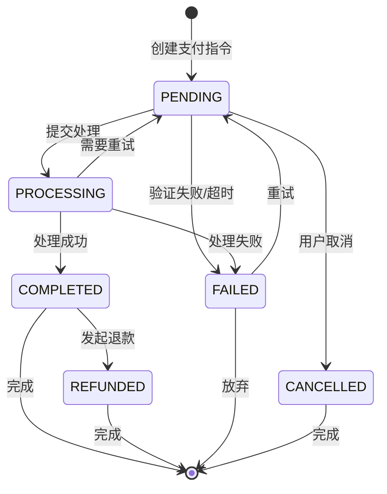
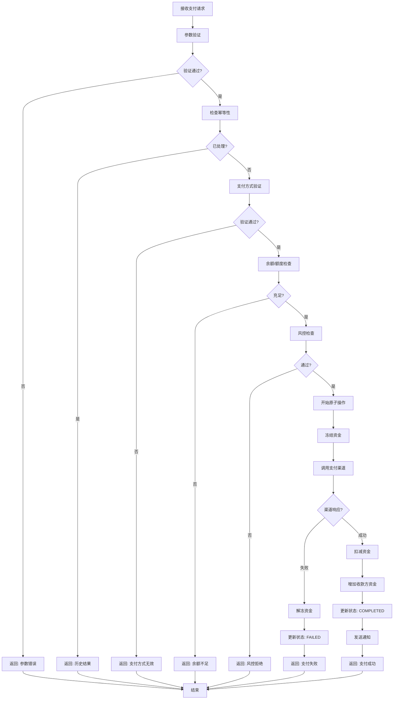
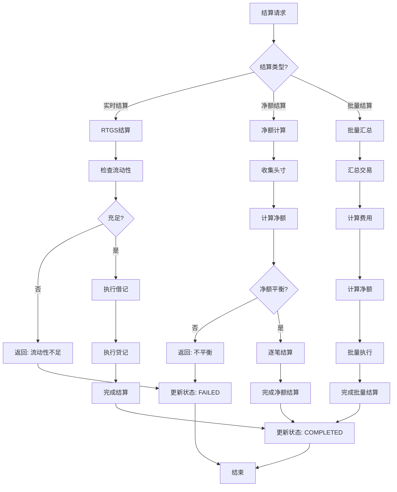
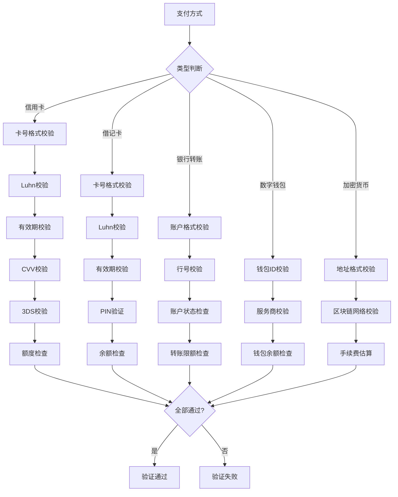
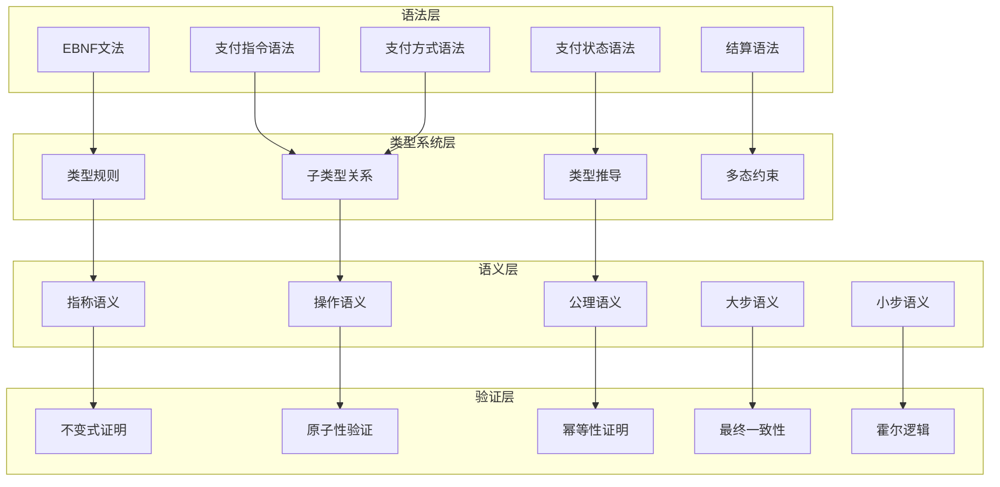
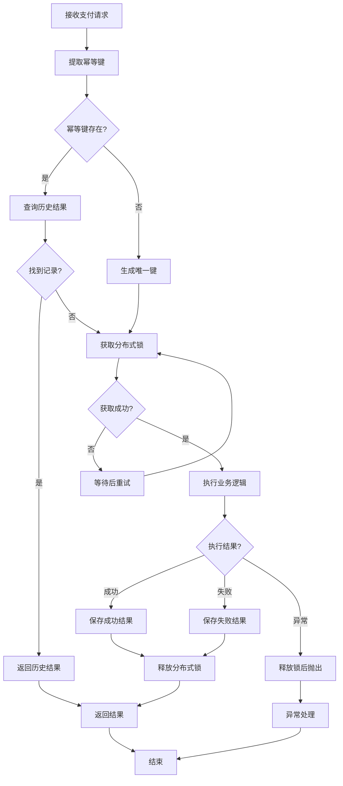
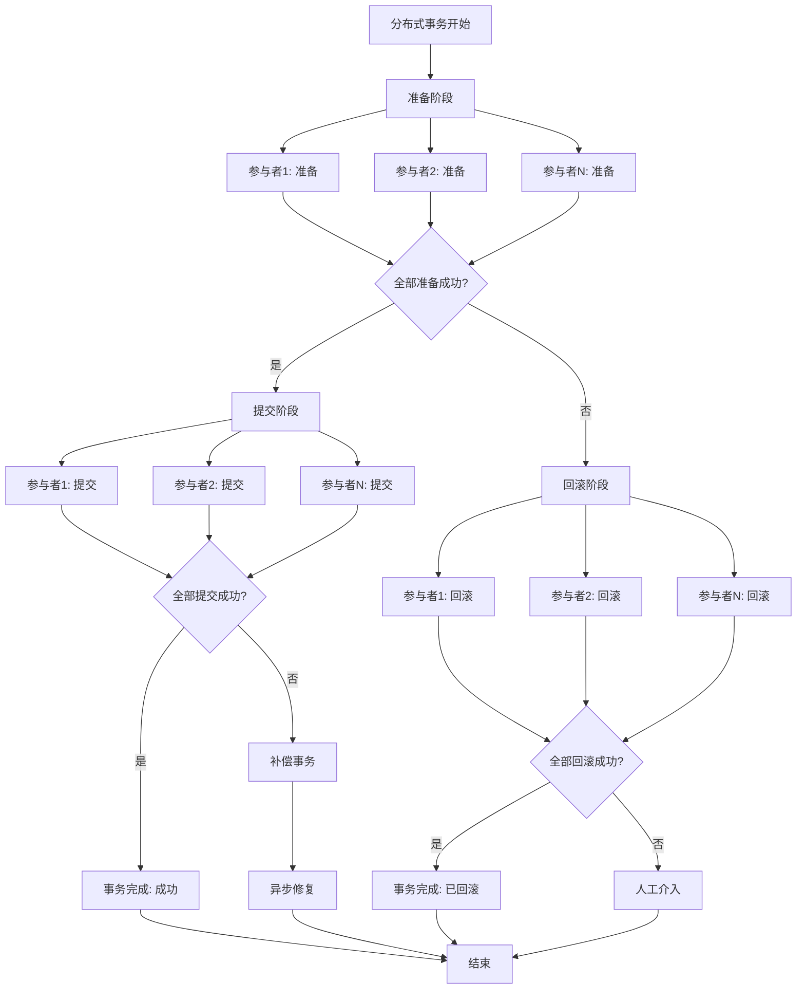

# 支付系统Schema形式语法与语义分析视图

**版本**: v1.0
**创建日期**: 2026-02-15
**标准**: PCI DSS v4.0, ISO 20022:2023, ISO 8583, EMV

---

## 📑 目录

- [支付系统Schema形式语法与语义分析视图](#支付系统schema形式语法与语义分析视图)
  - [📑 目录](#-目录)
  - [1. 形式文法定义](#1-形式文法定义)
    - [1.1 EBNF文法](#11-ebnf文法)
      - [1.1.1 支付指令文法](#111-支付指令文法)
      - [1.1.2 支付方式文法](#112-支付方式文法)
      - [1.1.3 支付状态文法](#113-支付状态文法)
      - [1.1.4 结算文法](#114-结算文法)
    - [1.2 语法规则](#12-语法规则)
      - [1.2.1 支付指令校验规则](#121-支付指令校验规则)
      - [1.2.2 支付方式校验规则](#122-支付方式校验规则)
      - [1.2.3 支付状态转换规则](#123-支付状态转换规则)
      - [1.2.4 结算校验规则](#124-结算校验规则)
  - [2. 形式语义定义](#2-形式语义定义)
    - [2.1 指称语义 (Denotational Semantics)](#21-指称语义-denotational-semantics)
      - [2.1.1 语义域定义](#211-语义域定义)
      - [2.1.2 支付指令语义](#212-支付指令语义)
      - [2.1.3 支付方式语义](#213-支付方式语义)
      - [2.1.4 结算语义](#214-结算语义)
    - [2.2 操作语义 (Operational Semantics)](#22-操作语义-operational-semantics)
      - [2.2.1 大步语义 (Big-Step Semantics)](#221-大步语义-big-step-semantics)
      - [2.2.2 小步语义 (Small-Step Semantics)](#222-小步语义-small-step-semantics)
      - [2.2.3 结算状态机语义](#223-结算状态机语义)
    - [2.3 公理语义 (Axiomatic Semantics)](#23-公理语义-axiomatic-semantics)
      - [2.3.1 Hoare三元组](#231-hoare三元组)
      - [2.3.2 支付操作推理规则](#232-支付操作推理规则)
      - [2.3.3 支付原子性霍尔三元组](#233-支付原子性霍尔三元组)
      - [2.3.4 幂等性公理](#234-幂等性公理)
      - [2.3.5 最终一致性公理](#235-最终一致性公理)
      - [2.3.6 不变式证明](#236-不变式证明)
  - [3. 类型系统](#3-类型系统)
    - [3.1 类型规则](#31-类型规则)
    - [3.2 类型运算规则](#32-类型运算规则)
    - [3.3 子类型关系](#33-子类型关系)
    - [3.4 多态与类型约束](#34-多态与类型约束)
  - [4. 语义等价性](#4-语义等价性)
    - [4.1 程序等价定义](#41-程序等价定义)
    - [4.2 等价变换规则](#42-等价变换规则)
    - [4.3 支付方式等价](#43-支付方式等价)
  - [5. Mermaid可视化](#5-mermaid可视化)
    - [5.1 支付状态机流程](#51-支付状态机流程)
    - [5.2 支付处理语义流程](#52-支付处理语义流程)
    - [5.3 结算处理流程](#53-结算处理流程)
    - [5.4 支付方式验证流程](#54-支付方式验证流程)
    - [5.5 形式语义层级图](#55-形式语义层级图)
    - [5.6 幂等性保证流程](#56-幂等性保证流程)
    - [5.7 最终一致性保障流程](#57-最终一致性保障流程)

---

## 1. 形式文法定义

### 1.1 EBNF文法

#### 1.1.1 支付指令文法

```ebnf
(* 支付系统核心实体 - 支付指令定义 *)

PaymentInstruction ::= SinglePayment | BatchPayment | RecurringPayment

(* 单笔支付指令 *)
SinglePayment ::= '{'
    '"instruction_id"' ':' InstructionId ','
    '"payment_type"' ':' '"SINGLE"' ','
    '"amount"' ':' MonetaryAmount ','
    '"currency"' ':' CurrencyCode ','
    '"payer"' ':' PaymentParty ','
    '"payee"' ':' PaymentParty ','
    '"payment_method"' ':' PaymentMethod ','
    '"status"' ':' PaymentStatus ','
    '"created_at"' ':' Timestamp ','
    ['"description"' ':' String(140)]
    ['"expiry_time"' ':' Timestamp]
    ['"priority"' ':' PaymentPriority]
'}'

(* 批量支付指令 *)
BatchPayment ::= '{'
    '"batch_id"' ':' BatchId ','
    '"payment_type"' ':' '"BATCH"' ','
    '"batch_name"' ':' String(100) ','
    '"total_amount"' ':' MonetaryAmount ','
    '"currency"' ':' CurrencyCode ','
    '"instruction_count"' ':' Integer ','
    '"instructions"' ':' '[' SinglePaymentList ']' ','
    '"payer"' ':' PaymentParty ','
    '"batch_status"' ':' PaymentStatus ','
    '"settlement_mode"' ':' SettlementMode ','
    '"created_at"' ':' Timestamp ','
    ['"scheduled_time"' ':' Timestamp]
'}'

(* 定期支付指令 *)
RecurringPayment ::= '{'
    '"recurring_id"' ':' InstructionId ','
    '"payment_type"' ':' '"RECURRING"' ','
    '"template_payment"' ':' SinglePayment ','
    '"recurrence_rule"' ':' RecurrenceRule ','
    '"start_date"' ':' Date ','
    ['"end_date"' ':' Date?]
    ['"max_occurrences"' ':' Integer]
    '"execution_count"' ':' Integer ','
    '"next_execution_date"' ':' Date? ','
    '"recurring_status"' ':' RecurringStatus ','
    '"created_at"' ':' Timestamp
'}'

(* 支付参与方 *)
PaymentParty ::= '{'
    '"party_type"' ':' PartyType ','
    '"party_id"' ':' PartyId ','
    '"account_info"' ':' AccountInfo ','
    ['"contact_info"' ':' ContactInfo]
'}'

AccountInfo ::= '{'
    '"account_number"' ':' AccountNumber ','
    '"account_type"' ':' AccountType ','
    '"bank_code"' ':' BankCode?
'}'

(* 重复规则 *)
RecurrenceRule ::= '{'
    '"frequency"' ':' Frequency ','
    '"interval"' ':' Integer ','
    ['"day_of_week"' ':' DayOfWeek]
    ['"day_of_month"' ':' DayOfMonth]
    ['"month_of_year"' ':' MonthOfYear]
'}'

(* 标识符格式 *)
InstructionId ::= '[A-Z]{3}[0-9]{4}[0-9]{10}[A-Z0-9]{8}'  (* 机构(3)+日期(4)+序号(10)+随机(8) *)
BatchId ::= 'B[A-Z0-9]{3}[0-9]{8}[0-9]{6}'
PartyId ::= '[A-Z0-9]{20}'
AccountNumber ::= '[0-9]{10,30}'
BankCode ::= '[A-Z]{6}[0-9A-Z]{0,3}'  (* SWIFT BIC或国内行号 *)

(* 枚举值 *)
PaymentPriority ::= 'URGENT' | 'HIGH' | 'NORMAL' | 'LOW'
PartyType ::= 'INDIVIDUAL' | 'CORPORATE' | 'MERCHANT' | 'FINANCIAL_INSTITUTION'
AccountType ::= 'CHECKING' | 'SAVINGS' | 'CREDIT_CARD' | 'DIGITAL_WALLET' | 'CRYPTO_WALLET'
Frequency ::= 'DAILY' | 'WEEKLY' | 'MONTHLY' | 'QUARTERLY' | 'YEARLY'
RecurringStatus ::= 'ACTIVE' | 'PAUSED' | 'CANCELLED' | 'COMPLETED' | 'EXPIRED'
DayOfWeek ::= '1' | '2' | '3' | '4' | '5' | '6' | '7'
DayOfMonth ::= '[1-9]|[12][0-9]|3[01]'
MonthOfYear ::= '[1-9]|1[012]'
Integer ::= '[0-9]+'
```

#### 1.1.2 支付方式文法

```ebnf
(* 支付方式定义 *)

PaymentMethod ::= CreditCard | DebitCard | BankTransfer | DigitalWallet | Cryptocurrency

(* 信用卡支付 *)
CreditCard ::= '{'
    '"method_type"' ':' '"CREDIT_CARD"' ','
    '"card_info"' ':' CardInfo ','
    '"card_scheme"' ':' CardScheme ','
    '"authorization_type"' ':' AuthType ','
    ['"installment_plan"' ':' InstallmentPlan]
    ['"3ds_enabled"' ':' Boolean]
'}'

CardInfo ::= '{'
    '"card_number"' ':' CardNumber ','
    '"card_holder"' ':' String(100) ','
    '"expiry_month"' ':' Month ','
    '"expiry_year"' ':' Year ','
    ['"cvv"' ':' CVV]
    ['"token"' ':' CardToken]
'}'

(* 借记卡支付 *)
DebitCard ::= '{'
    '"method_type"' ':' '"DEBIT_CARD"' ','
    '"card_info"' ':' CardInfo ','
    '"card_scheme"' ':' CardScheme ','
    '"pin_verified"' ':' Boolean ','
    '"debit_network"' ':' DebitNetwork
'}'

(* 银行转账 *)
BankTransfer ::= '{'
    '"method_type"' ':' '"BANK_TRANSFER"' ','
    '"transfer_type"' ':' TransferType ','
    '"source_account"' ':' AccountInfo ','
    '"destination_account"' ':' AccountInfo ','
    ['"reference_number"' ':' String(35)]
    ['"value_date"' ':' Date]
    ['"settlement_priority"' ':' SettlementPriority]
'}'

(* 数字钱包 *)
DigitalWallet ::= '{'
    '"method_type"' ':' '"DIGITAL_WALLET"' ','
    '"wallet_provider"' ':' WalletProvider ','
    '"wallet_id"' ':' WalletId ','
    '"wallet_account"' ':' String(50)? ','
    ['"qr_code_data"' ':' String(500)]
    ['"in_app_payment"' ':' Boolean]
'}'

(* 加密货币支付 *)
Cryptocurrency ::= '{'
    '"method_type"' ':' '"CRYPTOCURRENCY"' ','
    '"crypto_type"' ':' CryptoType ','
    '"blockchain_network"' ':' BlockchainNetwork ','
    '"wallet_address"' ':' WalletAddress ','
    '"destination_address"' ':' WalletAddress ','
    ['"transaction_fee"' ':' MonetaryAmount]
    ['"confirmation_required"' ':' Integer]
'}'

(* 分期付款计划 *)
InstallmentPlan ::= '{'
    '"installment_count"' ':' Integer ','
    '"installment_amount"' ':' MonetaryAmount ','
    '"first_payment_amount"' ':' MonetaryAmount ','
    '"interest_rate"' ':' InterestRate ','
    '"total_interest"' ':' MonetaryAmount
'}'

(* 格式定义 *)
CardNumber ::= '[0-9]{13,19}'
CardToken ::= '[A-Za-z0-9_-]{32,64}'
CVV ::= '[0-9]{3,4}'
Month ::= '0[1-9]|1[012]'
Year ::= '[0-9]{4}'
WalletId ::= '[A-Za-z0-9_-]{10,50}'
WalletAddress ::= '[A-Za-z0-9]{25,100}'
Boolean ::= 'true' | 'false'

(* 枚举值 *)
CardScheme ::= 'VISA' | 'MASTERCARD' | 'AMEX' | 'JCB' | 'UNIONPAY' | 'DISCOVER'
AuthType ::= 'PRE_AUTHORIZATION' | 'FINAL_AUTHORIZATION' | 'ESTIMATED_AUTHORIZATION'
DebitNetwork ::= 'PIN_DEBIT' | 'SIGNATURE_DEBIT' | 'ONLINE_DEBIT'
TransferType ::= 'ACH' | 'WIRE' | 'SEPA' | 'SWIFT' | 'RTGS' | 'BOOK_TRANSFER'
SettlementPriority ::= 'STANDARD' | 'SAME_DAY' | 'URGENT' | 'PRIORITY'
WalletProvider ::= 'ALIPAY' | 'WECHAT_PAY' | 'PAYPAL' | 'APPLE_PAY' | 'GOOGLE_PAY' | 'SAMSUNG_PAY'
CryptoType ::= 'BTC' | 'ETH' | 'USDT' | 'USDC' | 'BNB' | 'XRP' | 'OTHER'
BlockchainNetwork ::= 'BITCOIN' | 'ETHEREUM' | 'BSC' | 'POLYGON' | 'TRON' | 'SOLANA'
```

#### 1.1.3 支付状态文法

```ebnf
(* 支付状态定义 *)

PaymentStatus ::= PendingStatus | ProcessingStatus | CompletedStatus | FailedStatus | RefundedStatus

(* 待处理状态 *)
PendingStatus ::= '{'
    '"status"' ':' '"PENDING"' ','
    '"sub_status"' ':' PendingSubStatus ','
    '"created_at"' ':' Timestamp ','
    '"timeout_at"' ':' Timestamp? ','
    '"status_reason"' ':' String(140)?
'}'

PendingSubStatus ::= 'INITIATED' | 'WAITING_CONFIRMATION' | 'WAITING_3DS' | 'PENDING_RISK_CHECK'

(* 处理中状态 *)
ProcessingStatus ::= '{'
    '"status"' ':' '"PROCESSING"' ','
    '"sub_status"' ':' ProcessingSubStatus ','
    '"started_at"' ':' Timestamp ','
    ['"processor_reference"' ':' String(50)]
    ['"processing_stage"' ':' ProcessingStage]
'}'

ProcessingSubStatus ::= 'AUTHORIZING' | 'CLEARING' | 'SETTLING' | 'CONFIRMING'
ProcessingStage ::= 'GATEWAY' | 'ACQUIRER' | 'SCHEME' | 'ISSUER' | 'SETTLEMENT'

(* 已完成状态 *)
CompletedStatus ::= '{'
    '"status"' ':' '"COMPLETED"' ','
    '"completion_time"' ':' Timestamp ','
    '"settlement_id"' ':' String(35)? ','
    '"receipt_number"' ':' String(50) ','
    '"final_amount"' ':' MonetaryAmount ','
    '"fee_amount"' ':' MonetaryAmount
'}'

(* 失败状态 *)
FailedStatus ::= '{'
    '"status"' ':' '"FAILED"' ','
    '"failure_time"' ':' Timestamp ','
    '"failure_stage"' ':' ProcessingStage ','
    '"error_code"' ':' ErrorCode ','
    '"error_message"' ':' String(255) ','
    '"recoverable"' ':' Boolean ','
    ['"retry_count"' ':' Integer]
    ['"max_retries"' ':' Integer]
'}'

(* 已退款状态 *)
RefundedStatus ::= '{'
    '"status"' ':' '"REFUNDED"' ','
    '"original_payment"' ':' InstructionId ','
    '"refund_type"' ':' RefundType ','
    '"refund_amount"' ':' MonetaryAmount ','
    '"refund_time"' ':' Timestamp ','
    '"refund_reason"' ':' String(140) ','
    '"refund_transaction_id"' ':' String(35)
'}'

(* 退款类型 *)
RefundType ::= 'FULL' | 'PARTIAL' | 'REVERSAL'

(* 错误代码 *)
ErrorCode ::=
    'INSUFFICIENT_FUNDS' |
    'CARD_EXPIRED' |
    'CARD_DECLINED' |
    'INVALID_CARD' |
    'AUTHENTICATION_FAILED' |
    'TIMEOUT' |
    'SYSTEM_ERROR' |
    'RISK_REJECTED' |
    'CURRENCY_NOT_SUPPORTED' |
    'LIMIT_EXCEEDED'

(* 金额表示 *)
MonetaryAmount ::= '[+-]?[0-9]{1,18}(\.[0-9]{2})?'
CurrencyCode ::= '[A-Z]{3}'  (* ISO 4217 *)
Timestamp ::= ISO8601DateTime
Date ::= '[0-9]{4}-[0-9]{2}-[0-9]{2}'
InterestRate ::= '[0-9]{1,2}(\.[0-9]{4})?'
```

#### 1.1.4 结算文法

```ebnf
(* 结算定义 *)

Settlement ::= RealTimeSettlement | NetSettlement | BatchSettlement

(* 实时结算 *)
RealTimeSettlement ::= '{'
    '"settlement_type"' ':' '"REAL_TIME"' ','
    '"settlement_id"' ':' SettlementId ','
    '"settlement_time"' ':' Timestamp ','
    '"payment_instruction"' ':' InstructionId ','
    '"settlement_amount"' ':' MonetaryAmount ','
    '"currency"' ':' CurrencyCode ','
    '"settlement_status"' ':' SettlementStatus ','
    '"parties"' ':' SettlementParties ','
    '"liquidity_source"' ':' LiquiditySource ','
    ['"settlement_account"' ':' AccountNumber]
    ['"settlement_fee"' ':' MonetaryAmount]
'}'

(* 净额结算 *)
NetSettlement ::= '{'
    '"settlement_type"' ':' '"NET_SETTLEMENT"' ','
    '"settlement_id"' ':' SettlementId ','
    '"settlement_date"' ':' Date ','
    '"settlement_cycle"' ':' SettlementCycle ','
    '"netting_window_start"' ':' Timestamp ','
    '"netting_window_end"' ':' Timestamp ','
    '"participant_settlements"' ':' '[' ParticipantSettlementList ']' ','
    '"total_debit"' ':' MonetaryAmount ','
    '"total_credit"' ':' MonetaryAmount ','
    '"net_position"' ':' MonetaryAmount ','
    '"settlement_status"' ':' SettlementStatus
'}'

ParticipantSettlement ::= '{'
    '"participant_id"' ':' PartyId ','
    '"debit_amount"' ':' MonetaryAmount ','
    '"credit_amount"' ':' MonetaryAmount ','
    '"net_amount"' ':' MonetaryAmount ','
    '"settlement_account"' ':' AccountNumber ','
    '"participant_status"' ':' ParticipantStatus
'}'

(* 批量结算 *)
BatchSettlement ::= '{'
    '"settlement_type"' ':' '"BATCH_SETTLEMENT"' ','
    '"batch_settlement_id"' ':' SettlementId ','
    '"settlement_date"' ':' Date ','
    '"batch_type"' ':' BatchType ','
    '"payment_batch_id"' ':' BatchId ','
    '"included_payments"' ':' '[' InstructionIdList ']' ','
    '"total_amount"' ':' MonetaryAmount ','
    '"currency"' ':' CurrencyCode ','
    '"fee_summary"' ':' FeeSummary ','
    '"net_settlement_amount"' ':' MonetaryAmount ','
    '"settlement_status"' ':' SettlementStatus ','
    '"scheduled_time"' ':' Timestamp ','
    ['"actual_settlement_time"' ':' Timestamp]
'}'

(* 结算参与方 *)
SettlementParties ::= '{'
    '"payer_settlement_agent"' ':' PartyId ','
    '"payee_settlement_agent"' ':' PartyId ','
    ['"intermediary_agent"' ':' PartyId]
'}'

(* 费用汇总 *)
FeeSummary ::= '{'
    '"interchange_fee"' ':' MonetaryAmount ','
    '"scheme_fee"' ':' MonetaryAmount ','
    '"processing_fee"' ':' MonetaryAmount ','
    '"other_fees"' ':' MonetaryAmount ','
    '"total_fees"' ':' MonetaryAmount
'}'

(* 标识符和枚举 *)
SettlementId ::= 'S[A-Z]{2}[0-9]{8}[0-9]{8}'
SettlementCycle ::= 'INTRADAY' | 'END_OF_DAY' | 'T+1' | 'T+2' | 'CUSTOM'
SettlementStatus ::= 'PENDING' | 'IN_PROGRESS' | 'COMPLETED' | 'FAILED' | 'RECONCILED'
ParticipantStatus ::= 'PENDING' | 'CONFIRMED' | 'SETTLED' | 'FAILED'
BatchType ::= 'MERCHANT_BATCH' | 'PAYOUT_BATCH' | 'REFUND_BATCH'
LiquiditySource ::= 'CENTRAL_BANK' | 'COMMERCIAL_BANK' | 'NOSTRO_ACCOUNT' | 'RESERVE_ACCOUNT'
```

### 1.2 语法规则

#### 1.2.1 支付指令校验规则

```
约束1: 支付指令ID格式有效性
  ∀pi ∈ PaymentInstruction :
    instruction_id(pi) ∈ [A-Z]{3}[0-9]{4}[0-9]{10}[A-Z0-9]{8}

约束2: 金额有效性
  ∀pi ∈ PaymentInstruction :
    amount(pi) > 0 ∧ amount(pi) ≤ MAX_PAYMENT_AMOUNT

约束3: 币种有效性
  ∀pi ∈ PaymentInstruction :
    currency(pi) ∈ ISO_4217_Codes

约束4: 支付参与方有效性
  ∀pi ∈ PaymentInstruction :
    payer(pi) ≠ ⊥ ∧ payee(pi) ≠ ⊥ ∧
    payer_id(pi) ≠ payee_id(pi)

约束5: 时间戳有效性
  ∀pi ∈ PaymentInstruction :
    created_at(pi) ≤ current_timestamp() ∧
    (expiry_time(pi) ≠ ⊥ → expiry_time(pi) > created_at(pi))

约束6: 批量支付约束
  ∀bp ∈ BatchPayment :
    instruction_count(bp) = length(instructions(bp)) ∧
    total_amount(bp) = Σ amount(i) for i ∈ instructions(bp)
```

#### 1.2.2 支付方式校验规则

```
约束7: 卡号格式校验 (Luhn算法)
  ∀cc ∈ CreditCard ∪ DebitCard :
    let digits = extract_digits(card_number(cc)) in
    luhn_check(digits) = true

约束8: 卡片有效期校验
  ∀cc ∈ CreditCard ∪ DebitCard :
    let exp = expiry_year(cc) * 12 + expiry_month(cc) in
    let now = current_year() * 12 + current_month() in
    exp > now

约束9: 加密钱包地址格式
  ∀crypto ∈ Cryptocurrency :
    valid_wallet_address(wallet_address(crypto), crypto_type(crypto)) = true

约束10: 转账账户有效性
  ∀bt ∈ BankTransfer :
    valid_account(source_account(bt)) = true ∧
    valid_account(destination_account(bt)) = true

约束11: 数字钱包约束
  ∀dw ∈ DigitalWallet :
    wallet_id(dw) ≠ ⊥ ∧ wallet_provider(dw) ∈ SupportedProviders
```

#### 1.2.3 支付状态转换规则

```
约束12: 状态转换有效性
  ∀pi ∈ PaymentInstruction :
    let valid_transitions = {
      PENDING → {PROCESSING, FAILED, CANCELLED},
      PROCESSING → {COMPLETED, FAILED, PENDING},
      COMPLETED → {REFUNDED},
      FAILED → {PENDING},  (* 可重试 *)
      REFUNDED → {}
    } in
    ∀transition : current_status → new_status ∈ valid_transitions

约束13: 状态时间戳一致性
  ∀ps ∈ PaymentStatus :
    status(ps) = COMPLETED ⇒ completion_time(ps) ≠ ⊥ ∧
    status(ps) = FAILED ⇒ failure_time(ps) ≠ ⊥

约束14: 退款状态约束
  ∀rs ∈ RefundedStatus :
    refund_amount(rs) ≤ original_payment_amount(original_payment(rs))
```

#### 1.2.4 结算校验规则

```
约束15: 结算金额非负性
  ∀s ∈ Settlement :
    settlement_amount(s) ≥ 0

约束16: 净额结算平衡
  ∀ns ∈ NetSettlement :
    total_debit(ns) ≥ 0 ∧ total_credit(ns) ≥ 0 ∧
    net_position(ns) = total_credit(ns) - total_debit(ns)

约束17: 批量结算一致性
  ∀bs ∈ BatchSettlement :
    net_settlement_amount(bs) = total_amount(bs) - total_fees(fee_summary(bs))

约束18: 结算时间有效性
  ∀s ∈ Settlement :
    settlement_time(s) ≤ current_timestamp()
```

---

## 2. 形式语义定义

### 2.1 指称语义 (Denotational Semantics)

#### 2.1.1 语义域定义

```
D[PaymentSystem] : Environment → State → State

State = PaymentState × SettlementState × ReconciliationState × RiskState

PaymentState = InstructionId → PaymentValue
PaymentValue = {
  payment_type: PaymentType,
  amount: Money,
  currency: Currency,
  payer: PartyInfo,
  payee: PartyInfo,
  payment_method: PaymentMethodInfo,
  status: PaymentStatus,
  created_at: Timestamp,
  updated_at: Timestamp,
  metadata: Metadata
}

SettlementState = SettlementId → SettlementValue
SettlementValue = {
  settlement_type: SettlementType,
  settlement_amount: Money,
  currency: Currency,
  participants: ParticipantList,
  status: SettlementStatus,
  settlement_time: Timestamp,
  fees: FeeStructure
}

ReconciliationState = ReconciliationId → ReconciliationValue

RiskState = TransactionId → RiskAssessment

Money = Decimal(18,2)  (* 有界货币值 *)
Currency = ISO_4217_Codes  (* ISO 4217 *)
Timestamp = ℕ  (* Unix时间戳 *)
PaymentType = {SINGLE, BATCH, RECURRING}
SettlementType = {REAL_TIME, NET_SETTLEMENT, BATCH_SETTLEMENT}
```

#### 2.1.2 支付指令语义

```
(* 支付金额语义 *)
E[payment.amount] env sto =
  let pmt = lookup_payment(sto, env.instruction_id) in
  pmt.amount

(* 支付状态查询 *)
E[payment.status] env sto =
  let pmt = lookup_payment(sto, env.instruction_id) in
  pmt.status

(* 支付执行语义 *)
S[execute_payment(payment)] env sto =
  let pmt = lookup_payment(sto, payment.instruction_id) in
  let payer_acc = lookup_account(sto, pmt.payer.account) in
  let payee_acc = lookup_account(sto, pmt.payee.account) in

  if pmt.status ≠ PENDING
  then error "Payment not in pending state"
  else if payer_acc.available_balance < pmt.amount
  then error "Insufficient funds"
  else
    let sto' = sto[payment ↦ pmt[status ↦ PROCESSING]] in
    let sto'' = process_authorization(sto', pmt) in
    sto''

(* 状态转换语义 *)
S[update_status(payment, new_status)] env sto =
  let pmt = lookup_payment(sto, payment.instruction_id) in
  if valid_state_transition(pmt.status, new_status)
  then sto[payment ↦ pmt[status ↦ new_status, updated_at ↦ now()]]
  else error "Invalid state transition"
```

#### 2.1.3 支付方式语义

```
(* 信用卡授权语义 *)
E[authorize_credit_card(cc, amount)] env sto =
  let card = lookup_card(sto, cc.card_info.token) in
  if card.status ≠ ACTIVE
  then ERROR_CARD_NOT_ACTIVE
  else if card.available_credit < amount
  then ERROR_INSUFFICIENT_CREDIT
  else if card_expired(card)
  then ERROR_CARD_EXPIRED
  else
    AUTH_SUCCESS with {
      authorization_code: generate_auth_code(),
      authorized_amount: amount,
      authorization_time: now()
    }

(* 银行转账语义 *)
E[execute_bank_transfer(bt)] env sto =
  let src = lookup_account(sto, bt.source_account) in
  let dst = lookup_account(sto, bt.destination_account) in

  if bt.transfer_type = RTGS
  then execute_rtgs_transfer(src, dst, bt.amount)
  else if bt.transfer_type = ACH
  then enqueue_ach_transfer(src, dst, bt.amount)
  else execute_standard_transfer(src, dst, bt.amount)

(* 数字钱包支付语义 *)
E[process_wallet_payment(dw)] env sto =
  let wallet = lookup_wallet(sto, dw.wallet_id) in
  if wallet.balance ≥ payment_amount
  then {
    wallet.balance := wallet.balance - payment_amount,
    status := SUCCESS,
    transaction_id: generate_tx_id()
  }
  else ERROR_INSUFFICIENT_WALLET_BALANCE

(* 加密货币支付语义 *)
E[process_crypto_payment(crypto)] env sto =
  let tx = build_blockchain_transaction(crypto) in
  let fee = estimate_transaction_fee(crypto.blockchain_network) in
  {
    transaction_hash: submit_to_network(tx),
    estimated_confirmation_time: estimate_confirmation(crypto.blockchain_network),
    required_confirmations: crypto.confirmation_required,
    status: PENDING_CONFIRMATION
  }
```

#### 2.1.4 结算语义

```
(* 实时结算语义 *)
S[execute_realtime_settlement(s)] env sto =
  let payment = lookup_payment(sto, s.payment_instruction) in
  let settlement_account = lookup_settlement_account(sto, s.liquidity_source) in

  atomic {
    if settlement_account.available_funds ≥ s.settlement_amount
    then
      let sto' = debit_settlement_account(sto, settlement_account, s.settlement_amount) in
      let sto'' = credit_participant_accounts(sto', s.parties, s.settlement_amount) in
      sto''[settlement ↦ s[status ↦ COMPLETED, settlement_time ↦ now()]]
    else error "Insufficient settlement funds"
  }

(* 净额结算语义 *)
S[execute_net_settlement(ns)] env sto =
  let participants = ns.participant_settlements in
  let net_position = calculate_net_position(participants) in

  if net_position = 0  (* 净额平衡 *)
  then
    foreach ps ∈ participants:
      if ps.net_amount > 0
      then credit_participant(ps.participant_id, ps.net_amount)
      else if ps.net_amount < 0
      then debit_participant(ps.participant_id, |ps.net_amount|)
  else error "Net settlement not balanced"

(* 批量结算语义 *)
S[execute_batch_settlement(bs)] env sto =
  let payments = lookup_payments(sto, bs.included_payments) in
  let total = Σ p.amount for p ∈ payments where p.status = COMPLETED in
  let fees = calculate_fees(total, bs.batch_type) in
  let net_amount = total - fees in

  sto[settlement ↦ bs[
    total_amount ↦ total,
    fee_summary ↦ fees,
    net_settlement_amount ↦ net_amount,
    status ↦ COMPLETED
  ]]
```

### 2.2 操作语义 (Operational Semantics)

#### 2.2.1 大步语义 (Big-Step Semantics)

```
配置: ⟨Expression, State⟩ ⇓ Value
      ⟨Statement, State⟩ ⇓ State'

(* 支付状态查询 *)
⟨payment.status, σ⟩ ⇓ σ(payment).status                          (E-PaymentStatus)

(* 支付金额查询 *)
⟨payment.amount, σ⟩ ⇓ σ(payment).amount                          (E-PaymentAmount)

(* 支付方式验证 *)
⟨validate_method(pm), σ⟩ ⇓ true                                   (E-MethodValid)
  where valid_payment_method(pm, σ)

⟨validate_method(pm), σ⟩ ⇓ false                                  (E-MethodInvalid)
  where ¬valid_payment_method(pm, σ)

(* 余额检查 *)
⟨check_balance(payer, amt), σ⟩ ⇓ true                            (E-BalanceSufficient)
  where σ(payer.account).available_balance ≥ amt

⟨check_balance(payer, amt), σ⟩ ⇓ false                           (E-BalanceInsufficient)
  where σ(payer.account).available_balance < amt

(* 授权请求 *)
⟨request_authorization(pmt), σ⟩ ⇓ AUTH_SUCCESS                   (S-AuthSuccess)
────────────────────────────────────────────────────────────
⟨validate_method(pmt.payment_method), σ⟩ ⇓ true
⟨check_balance(pmt.payer, pmt.amount), σ⟩ ⇓ true

⟨request_authorization(pmt), σ⟩ ⇓ AUTH_FAILED                    (S-AuthFailed)
────────────────────────────────────────────────────────────
⟨validate_method(pmt.payment_method), σ⟩ ⇓ false ∨
⟨check_balance(pmt.payer, pmt.amount), σ⟩ ⇓ false

(* 支付执行 - 原子性 *)
⟨execute_payment(pmt), σ⟩ ⇓ σ''                                  (S-PaymentSuccess)
────────────────────────────────────────────────────────────
⟨request_authorization(pmt), σ⟩ ⇓ AUTH_SUCCESS
⟨debit(pmt.payer.account, pmt.amount), σ⟩ ⇓ σ'
⟨credit(pmt.payee.account, pmt.amount), σ'⟩ ⇓ σ''
σ''(pmt).status = COMPLETED

⟨execute_payment(pmt), σ⟩ ⇓ σ[pmt.status ↦ FAILED]              (S-PaymentFail)
────────────────────────────────────────────────────────────
⟨request_authorization(pmt), σ⟩ ⇓ AUTH_FAILED
```

#### 2.2.2 小步语义 (Small-Step Semantics)

```
配置: ⟨Statement, State⟩ → ⟨Statement', State'⟩
      或 ⟨Statement, State⟩ → State'  (终止)

(* 支付状态转换 *)
⟨payment.status := PENDING, σ⟩ → σ[payment.status ↦ PENDING]    (S-SetPending)

⟨payment.status := PROCESSING, σ⟩ → σ[payment.status ↦ PROCESSING]  (S-SetProcessing)
  where σ(payment).status = PENDING

⟨payment.status := COMPLETED, σ⟩ → σ[payment.status ↦ COMPLETED]  (S-SetCompleted)
  where σ(payment).status = PROCESSING ∧ payment_cleared(payment, σ)

⟨payment.status := FAILED, σ⟩ → σ[payment.status ↦ FAILED]      (S-SetFailed)
  where σ(payment).status ∈ {PENDING, PROCESSING}

(* 支付处理步骤 *)
⟨process_payment(pmt), σ⟩ → ⟨validate(pmt) ; authorize(pmt) ; settle(pmt), σ⟩  (S-ProcessStart)

⟨validate(pmt), σ⟩ → σ                                           (S-ValidateOk)
  where valid_payment_method(pmt.payment_method, σ) ∧
        payer_account_active(pmt.payer, σ)

⟨validate(pmt), σ⟩ → error                                       (S-ValidateFail)
  where ¬valid_payment_method(pmt.payment_method, σ)

(* 授权步骤 *)
⟨authorize(pmt), σ⟩ → σ[authorization ↦ auth_success]           (S-AuthorizeSuccess)
  where sufficient_funds(pmt, σ) ∧ valid_card(pmt, σ)

⟨authorize(pmt), σ⟩ → error                                      (S-AuthorizeFail)
  where ¬sufficient_funds(pmt, σ)

(* 结算步骤 *)
⟨settle(pmt), σ⟩ → σ[pmt.status ↦ COMPLETED]                    (S-SettleSuccess)
  where settlement_cleared(pmt, σ)

(* 顺序执行 *)
⟨skip ; s, σ⟩ → ⟨s, σ⟩                                           (S-Seq-Skip)

⟨s1 ; s2, σ⟩ → ⟨s1' ; s2, σ'⟩                                    (S-Seq-Step)
  when ⟨s1, σ⟩ → ⟨s1', σ'⟩

⟨s1 ; s2, σ⟩ → ⟨s2, σ'⟩                                          (S-Seq-Done)
  when ⟨s1, σ⟩ → σ'

(* 条件执行 *)
⟨IF check_balance(payer, amt) THEN proceed ELSE reject, σ⟩ → ⟨proceed, σ⟩  (S-IfTrue)
  when σ(payer.account).available_balance ≥ amt

⟨IF check_balance(payer, amt) THEN proceed ELSE reject, σ⟩ → ⟨reject, σ⟩   (S-IfFalse)
  when σ(payer.account).available_balance < amt
```

#### 2.2.3 结算状态机语义

```
(* 实时结算状态转移 *)
⟨rt_settle.status, σ⟩ → ⟨PENDING, σ⟩                             (RT-Init)

⟨initiate_realtime_settlement(s), σ⟩ → ⟨IN_PROGRESS, σ[s.initiated_at ↦ now()]⟩  (RT-Start)

⟨verify_liquidity(s), σ⟩ → ⟨LIQUIDITY_VERIFIED, σ⟩               (RT-LiquidityOk)
  when σ(s.liquidity_source).available_funds ≥ s.settlement_amount

⟨execute_debits(s), σ⟩ → ⟨DEBITS_EXECUTED, σ'⟩                   (RT-DebitsDone)

⟨execute_credits(s), σ⟩ → ⟨COMPLETED, σ''[s.completed_at ↦ now()]⟩  (RT-Complete)

(* 净额结算状态转移 *)
⟨net_settle.status, σ⟩ → ⟨NETTING_IN_PROGRESS, σ⟩                (NS-Start)

⟨collect_positions(ns), σ⟩ → ⟨POSITIONS_COLLECTED, σ⟩            (NS-Positions)

⟨calculate_netting(ns), σ⟩ → ⟨NETTING_CALCULATED, σ'⟩            (NS-Calculated)
  where σ'(ns.net_position) = Σ ps.net_amount for ps ∈ ns.participants

⟨verify_net_balance(ns), σ⟩ → ⟨BALANCE_VERIFIED, σ⟩              (NS-BalanceOk)
  when ns.net_position = 0

⟨execute_net_settlement(ns), σ⟩ → ⟨COMPLETED, σ''⟩               (NS-Complete)
```

### 2.3 公理语义 (Axiomatic Semantics)

#### 2.3.1 Hoare三元组

```
{P} S {Q}

含义: 如果前置条件P在执行语句S前成立，
      且S终止，
      则后置条件Q在S执行后成立。
```

#### 2.3.2 支付操作推理规则

```
(* 支付金额不变式 *)
{payment.amount = A ∧ payment.currency = C ∧ payment.status = PENDING}
  any_readonly_operation(payment)
{payment.amount = A ∧ payment.currency = C ∧ payment.status = PENDING}

(* 支付执行公理 *)
{payer.balance = B ∧ B ≥ A ∧ A > 0 ∧ payment.status = PENDING}
  execute_payment(payment)
{payer.balance = B - A ∧ payee.balance = B' + A ∧ payment.status = COMPLETED}
  (Axiom-PaymentExecute)

(* 支付失败公理 *)
{payer.balance = B ∧ (B < A ∨ ¬valid_method(payment.method))}
  execute_payment(payment)
{payer.balance = B ∧ payment.status = FAILED}
  (Axiom-PaymentFail)

(* 状态转换公理 *)
{payment.status = S_old ∧ valid_transition(S_old, S_new)}
  update_status(payment, S_new)
{payment.status = S_new}
  (Axiom-StatusChange)

(* 退款公理 *)
{payment.status = COMPLETED ∧ payment.amount = A ∧ refund_amount ≤ A}
  refund_payment(payment, refund_amount)
{payment.refunded_amount = refund_amount ∧ payment.status = REFUNDED}
  (Axiom-Refund)
```

#### 2.3.3 支付原子性霍尔三元组

```
(* 支付原子性规则 *)
{P}
  execute_payment(payment)
{Q}
────────────────────────────────────────────────────────────  (Rule-PaymentAtomic)
{P}
  atomic { debit(payer, amount) ; credit(payee, amount) ; update_status(COMPLETED) }
{Q}

(* 资金守恒规则 *)
{Σ accounts.balance = TOTAL}
  execute_payment(payment)
{Σ accounts.balance = TOTAL}  (* 资金总量不变 *)
  (Rule-MoneyConservation)

(* 借贷平衡规则 *)
{true}
  execute_payment(payment)
{debit_amount = credit_amount}
  (Rule-DebitCreditBalance)
```

#### 2.3.4 幂等性公理

```
(* 支付幂等性公理 *)
{payment.status = COMPLETED}
  execute_payment(payment)  (* 重复执行 *)
{payment.status = COMPLETED ∧ no_state_change}
  (Axiom-Idempotent-Payment)

(* 授权幂等性公理 *)
{authorization.status = AUTH_SUCCESS}
  request_authorization(payment)
{authorization.status = AUTH_SUCCESS ∧ same_auth_code}
  (Axiom-Idempotent-Auth)

(* 结算幂等性公理 *)
{settlement.status = COMPLETED}
  execute_settlement(settlement)
{settlement.status = COMPLETED ∧ no_double_spending}
  (Axiom-Idempotent-Settlement)

(* 幂等键约束 *)
∀ p1, p2 ∈ PaymentInstruction :
  p1.idempotency_key = p2.idempotency_key ∧
  p1.status = COMPLETED ∧
  execute_payment(p2)
  → p2.status = COMPLETED ∧ p2.transaction_id = p1.transaction_id
```

#### 2.3.5 最终一致性公理

```
(* 最终一致性定义 *)
定义: 系统满足最终一致性当且仅当:
∀ payment, t1, t2 :
  t2 > t1 + CONSISTENCY_TIMEOUT ⇒
  eventual_state(payment, t2) = committed_state(payment)

(* 分布式事务公理 *)
{payment.status = PROCESSING ∧ participant_states = PREPARED}
  commit_distributed_transaction(payment)
{∀ participants : state = COMMITTED}
  (Axiom-DistributedCommit)

{payment.status = PROCESSING ∧ ∃ participant : state = FAILED}
  rollback_distributed_transaction(payment)
{∀ participants : state = ROLLED_BACK}
  (Axiom-DistributedRollback)

(* 读取一致性公理 *)
{payment.status = COMPLETED at time t}
  query_payment_status(payment) at time t + Δt
{status = COMPLETED}
  (Axiom-ReadConsistency)
  where Δt < consistency_timeout
```

#### 2.3.6 不变式证明

```
不变式 I: ∀ account :
  account.balance ≥ 0 ∧
  account.frozen_amount ≥ 0 ∧
  account.frozen_amount ≤ account.balance ∧
  account.available_balance = account.balance - account.frozen_amount

不变式 II: ∀ payment :
  payment.status = COMPLETED ⇒
    payment.completion_time ≠ ⊥ ∧
    payment.settlement_id ≠ ⊥

不变式 III: ∀ settlement :
  settlement.status = COMPLETED ⇒
    Σ debits = Σ credits ∧
    net_position = 0

证明:

1. 不变式I - 账户余额不变式

   初始状态:
   开户时 balance = 0, frozen_amount = 0
   ⇒ I 成立

   保持性:

   情况1: execute_payment(p) 成功
     - 借记 payer: payer.balance' = payer.balance - p.amount
     - 贷记 payee: payee.balance' = payee.balance + p.amount
     - 两者 balance' ≥ 0 (由前置条件保证)
     - frozen_amount 不变
     - available_balance 相应更新

   情况2: freeze(account, A)
     - balance 不变
     - frozen_amount' = frozen_amount + A
     - 前置条件保证 A ≤ available_balance
     - 因此 frozen_amount' ≤ balance
     - available_balance' = balance - frozen_amount' ≥ 0

   情况3: unfreeze(account, A)
     - balance 不变
     - frozen_amount' = frozen_amount - A ≥ 0 (由前置条件保证)
     - available_balance' = balance - frozen_amount' ≤ balance

2. 不变式II - 支付完成不变式

   由操作语义规则 (S-SetCompleted):
   status 变为 COMPLETED 时，completion_time 必须设置为 now()
   且 settlement_id 必须非空

   因此 I 是不变式 ∎

3. 不变式III - 结算平衡不变式

   由净额结算语义 (S-execute_net_settlement):
   只有当 net_position = 0 时结算才能成功完成
   且 Σ debits = Σ credits 是后置条件

   因此 I 是不变式 ∎
```

---

## 3. 类型系统

### 3.1 类型规则

```
(* 基础类型 *)
Γ ⊢ m : Money          if m ∈ Decimal(18,2) ∧ m ≥ 0           (T-Money)

Γ ⊢ c : Currency       if c ∈ ISO_4217_Codes                    (T-Currency)

Γ ⊢ t : Timestamp      if t ≥ 0                                 (T-Timestamp)

Γ ⊢ s : PaymentStatus  if s ∈ {PENDING, PROCESSING, COMPLETED, FAILED, REFUNDED}  (T-PaymentStatus)

Γ ⊢ r : InterestRate   if 0 ≤ r ≤ 100                           (T-InterestRate)

Γ ⊢ f : FeeRate        if 0 ≤ f ≤ 1                             (T-FeeRate)

(* 支付指令类型 *)
Γ ⊢ pi : SinglePayment    if pi.payment_type = SINGLE            (T-SinglePayment)

Γ ⊢ pi : BatchPayment     if pi.payment_type = BATCH             (T-BatchPayment)

Γ ⊢ pi : RecurringPayment if pi.payment_type = RECURRING         (T-RecurringPayment)

Γ ⊢ pi : PaymentInstruction if pi ∈ SinglePayment ∪ BatchPayment ∪ RecurringPayment  (T-PaymentInstruction)

(* 支付方式类型 *)
Γ ⊢ pm : CreditCard      if pm.method_type = CREDIT_CARD         (T-CreditCard)

Γ ⊢ pm : DebitCard       if pm.method_type = DEBIT_CARD          (T-DebitCard)

Γ ⊢ pm : BankTransfer    if pm.method_type = BANK_TRANSFER       (T-BankTransfer)

Γ ⊢ pm : DigitalWallet   if pm.method_type = DIGITAL_WALLET      (T-DigitalWallet)

Γ ⊢ pm : Cryptocurrency  if pm.method_type = CRYPTOCURRENCY      (T-Cryptocurrency)

Γ ⊢ pm : PaymentMethod   if pm ∈ CreditCard ∪ DebitCard ∪ BankTransfer ∪ DigitalWallet ∪ Cryptocurrency  (T-PaymentMethod)

(* 结算类型 *)
Γ ⊢ s : RealTimeSettlement if s.settlement_type = REAL_TIME     (T-RTSettlement)

Γ ⊢ s : NetSettlement      if s.settlement_type = NET_SETTLEMENT  (T-NetSettlement)

Γ ⊢ s : BatchSettlement    if s.settlement_type = BATCH_SETTLEMENT (T-BatchSettlement)

Γ ⊢ s : Settlement         if s ∈ RealTimeSettlement ∪ NetSettlement ∪ BatchSettlement  (T-Settlement)
```

### 3.2 类型运算规则

```
(* 金额运算 *)
Γ ⊢ m1 : Money  Γ ⊢ m2 : Money                           (T-MoneyAdd)
────────────────────────────────────────
Γ ⊢ m1 + m2 : Money

Γ ⊢ m1 : Money  Γ ⊢ m2 : Money  m1 ≥ m2                  (T-MoneySub)
────────────────────────────────────────
Γ ⊢ m1 - m2 : Money

Γ ⊢ m : Money  Γ ⊢ r : FeeRate  0 ≤ r ≤ 1                (T-MoneyMulRate)
────────────────────────────────────────
Γ ⊢ m * r : Money

(* 币种一致性 *)
Γ ⊢ m1 : Money(c)  Γ ⊢ m2 : Money(c)                     (T-SameCurrency)
────────────────────────────────────────
Γ ⊢ m1 + m2 : Money(c)

Γ ⊢ m1 : Money(c1)  Γ ⊢ m2 : Money(c2)  c1 ≠ c2          (T-CurrencyConv)
────────────────────────────────────────
Γ ⊢ convert(m1, c2) + m2 : Money(c2)

(* 支付执行 *)
Γ ⊢ pi : PaymentInstruction  Γ ⊢ pm : PaymentMethod      (T-PaymentWithMethod)
────────────────────────────────────────
Γ ⊢ create_payment(pm, pi) : PaymentInstruction

(* 余额检查 *)
Γ ⊢ payer : PaymentParty  Γ ⊢ amt : Money                (T-BalanceCheck)
────────────────────────────────────────
Γ ⊢ check_balance(payer, amt) : Boolean

(* 支付处理 *)
Γ ⊢ pi : PaymentInstruction                              (T-ProcessPayment)
────────────────────────────────────────
Γ ⊢ process_payment(pi) : PaymentResult

Γ ⊢ pi : PaymentInstruction  Γ ⊢ pi.status : PENDING     (T-ExecutePayment)
────────────────────────────────────────
Γ ⊢ execute_payment(pi) : PaymentInstruction

(* 结算执行 *)
Γ ⊢ s : Settlement                                       (T-ExecuteSettlement)
────────────────────────────────────────
Γ ⊢ execute_settlement(s) : SettlementResult
```

### 3.3 子类型关系

```
(* 支付指令类型层次 *)
PaymentInstruction
├── SinglePayment
│   ├── OnlinePayment
│   ├── POSPayment
│   └── QRCodePayment
├── BatchPayment
│   ├── PayrollBatch
│   ├── SupplierBatch
│   └── RefundBatch
└── RecurringPayment
    ├── SubscriptionPayment
    ├── InstallmentPayment
    └── ScheduledPayment

子类型规则:
OnlinePayment ≤ SinglePayment ≤ PaymentInstruction
PayrollBatch ≤ BatchPayment ≤ PaymentInstruction
SubscriptionPayment ≤ RecurringPayment ≤ PaymentInstruction

(* 支付方式类型层次 *)
PaymentMethod
├── CardPayment
│   ├── CreditCard
│   │   ├── CreditCard3DS
│   │   └── CreditCardNon3DS
│   └── DebitCard
│       ├── PINDebit
│       └── SignatureDebit
├── BankTransfer
│   ├── ACHTransfer
│   ├── WireTransfer
│   └── SEPATransfer
├── DigitalWallet
│   ├── MobileWallet
│   │   ├── ApplePay
│   │   ├── GooglePay
│   │   └── SamsungPay
│   └── OnlineWallet
│       ├── PayPal
│       ├── Alipay
│       └── WeChatPay
└── Cryptocurrency
    ├── BitcoinPayment
    ├── EthereumPayment
    └── StablecoinPayment

子类型规则:
CreditCard3DS ≤ CreditCard ≤ CardPayment ≤ PaymentMethod
Alipay ≤ OnlineWallet ≤ DigitalWallet ≤ PaymentMethod
BitcoinPayment ≤ Cryptocurrency ≤ PaymentMethod

(* 结算类型层次 *)
Settlement
├── RealTimeSettlement
│   ├── RTGSSettlement
│   └── InstantSettlement
├── NetSettlement
│   ├── EndOfDayNetting
│   └── IntradayNetting
└── BatchSettlement
    ├── MerchantBatchSettlement
    └── PayoutBatchSettlement

子类型规则:
RTGSSettlement ≤ RealTimeSettlement ≤ Settlement
EndOfDayNetting ≤ NetSettlement ≤ Settlement

(* 支付状态类型层次 *)
PaymentStatus
├── PendingStatus
│   ├── InitiatedStatus
│   └── WaitingConfirmationStatus
├── ProcessingStatus
├── CompletedStatus
├── FailedStatus
│   ├── RecoverableFailedStatus
│   └── NonRecoverableFailedStatus
└── RefundedStatus
    ├── FullRefundStatus
│   └── PartialRefundStatus

子类型规则:
InitiatedStatus ≤ PendingStatus ≤ PaymentStatus
FullRefundStatus ≤ RefundedStatus ≤ PaymentStatus
```

### 3.4 多态与类型约束

```
(* 通用支付处理 *)
∀π ≤ PaymentInstruction. Γ ⊢ process : π → PaymentResult

(* 通用结算执行 *)
∀σ ≤ Settlement. Γ ⊢ settle : σ → SettlementResult

(* 金额约束 *)
Γ ⊢ m : Money  where 0 ≤ m ≤ MAX_PAYMENT_AMOUNT

(* 费率约束 *)
Γ ⊢ r : FeeRate  where 0 ≤ r ≤ MAX_FEE_RATE

(* 时间约束 *)
Γ ⊢ t : Timestamp  where t ≥ 0

(* 支付ID约束 *)
Γ ⊢ id : InstructionId  where valid_id_format(id) = true

(* 币种转换约束 *)
Γ ⊢ convert(m, c1, c2) : Money(c2)
  where m : Money(c1) ∧ c1 ≠ c2 ∧ supported_currency_pair(c1, c2)
```

---

## 4. 语义等价性

### 4.1 程序等价定义

```
定义: 两个支付操作O1和O2语义等价 (O1 ≡ O2) 当且仅当:
∀σ, σ' : ⟨O1, σ⟩ ⇓ σ' ⟺ ⟨O2, σ⟩ ⇓ σ'

定义: 两个支付序列P1和P2效果等价 (P1 ≈ P2) 当且仅当:
∀σ : final_state(⟨P1, σ⟩) = final_state(⟨P2, σ⟩)
```

### 4.2 等价变换规则

```
(* 支付批处理等价 *)
process_batch([p1, p2, ..., pn])
≡
atomic { process_payment(p1) ; process_payment(p2) ; ... ; process_payment(pn) }

(* 状态检查等价 *)
check_payment_status(payment)
≡
CASE payment.status
  WHEN PENDING THEN check_pending_details(payment)
  WHEN PROCESSING THEN check_processing_details(payment)
  WHEN COMPLETED THEN check_completion_details(payment)
  WHEN FAILED THEN check_failure_details(payment)
  WHEN REFUNDED THEN check_refund_details(payment)
END

(* 支付重试等价 *)
retry_payment(payment, max_retries)
≡
REPEAT
  execute_payment(payment)
UNTIL payment.status ≠ FAILED OR retry_count ≥ max_retries

(* 结算方式等价 (在特定条件下) *)
realtime_settle(payment)
≡
batch_settle([payment])  (* 当batch_size=1且立即执行时 *)

(* 退款序列等价 *)
refund(payment, partial_amount) ; refund(remaining_payment, remaining_amount)
≡
refund(payment, full_amount)  (* 当 partial_amount + remaining_amount = full_amount *)

(* 幂等操作等价 *)
execute_payment(payment) ; execute_payment(payment) with same idempotency_key
≡
execute_payment(payment)  (* 第二次执行无效果 *)

(* 并发支付等价性 *)
atomic { payment1 } || atomic { payment2 } ≡ atomic { payment1 ; payment2 } ∨ atomic { payment2 ; payment1 }
(假设无冲突账户)
```

### 4.3 支付方式等价

```
(* 卡支付等价 (在支持网络相同情况下) *)
credit_card_payment(card_info)
≡
debit_card_payment(card_info)  (* 当使用相同卡网络和处理流程时 *)

(* 数字钱包等价 *)
mobile_wallet_payment(wallet)
≡
online_wallet_payment(wallet)  (* 当底层账户相同时 *)

(* 转账方式等价 (在到账时间要求相同时) *)
wire_transfer(account, urgent)
≡
rtgs_transfer(account)  (* 当urgent=true且金额超过阈值时 *)
```

---

## 5. Mermaid可视化

### 5.1 支付状态机流程



### 5.2 支付处理语义流程



### 5.3 结算处理流程



### 5.4 支付方式验证流程



### 5.5 形式语义层级图



### 5.6 幂等性保证流程



### 5.7 最终一致性保障流程



---

**参考文档**:

- `02_Formal_Definition.md` - 形式化定义
- `03_Standards.md` - 标准对标
- `04_Transformation.md` - 转换体系
- `05_Case_Studies.md` - 实践案例
- PCI DSS v4.0 标准文档
- ISO 20022:2023 支付标准
- ISO 8583 交易消息标准
- EMV 芯片卡支付规范

**维护者**: DSL Schema研究团队
**标准**: PCI DSS v4.0, ISO 20022:2023, ISO 8583, EMV
