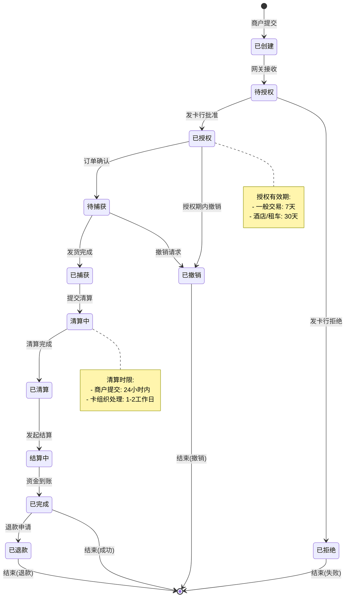
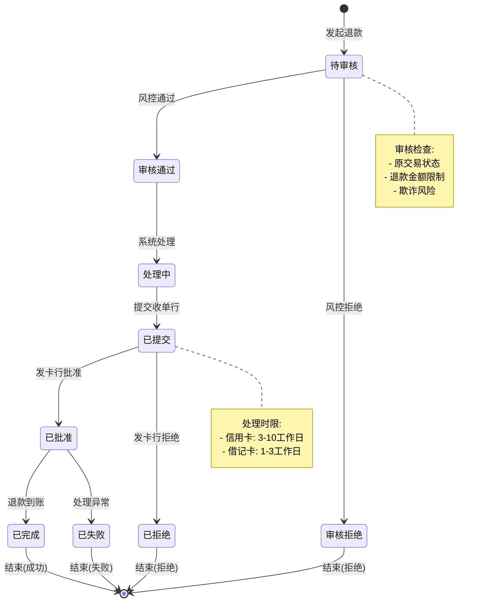
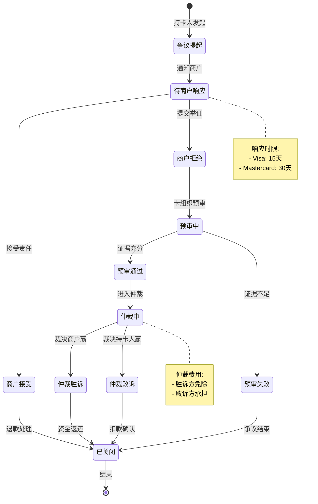
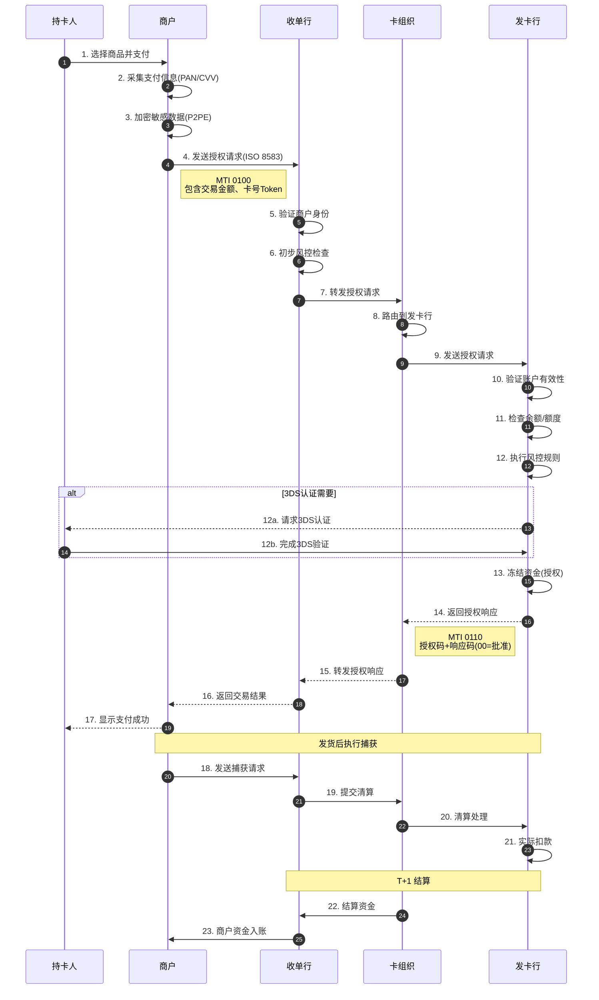
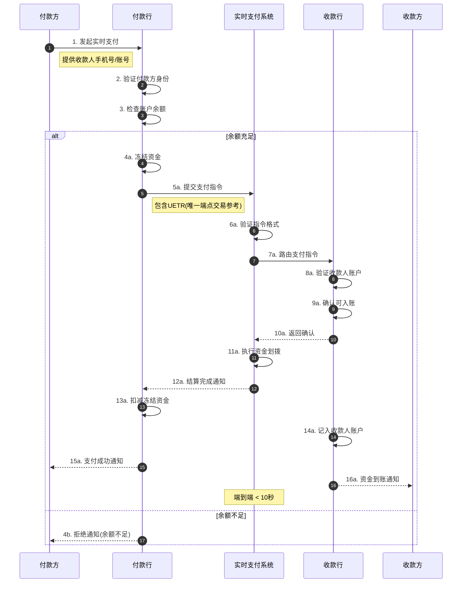
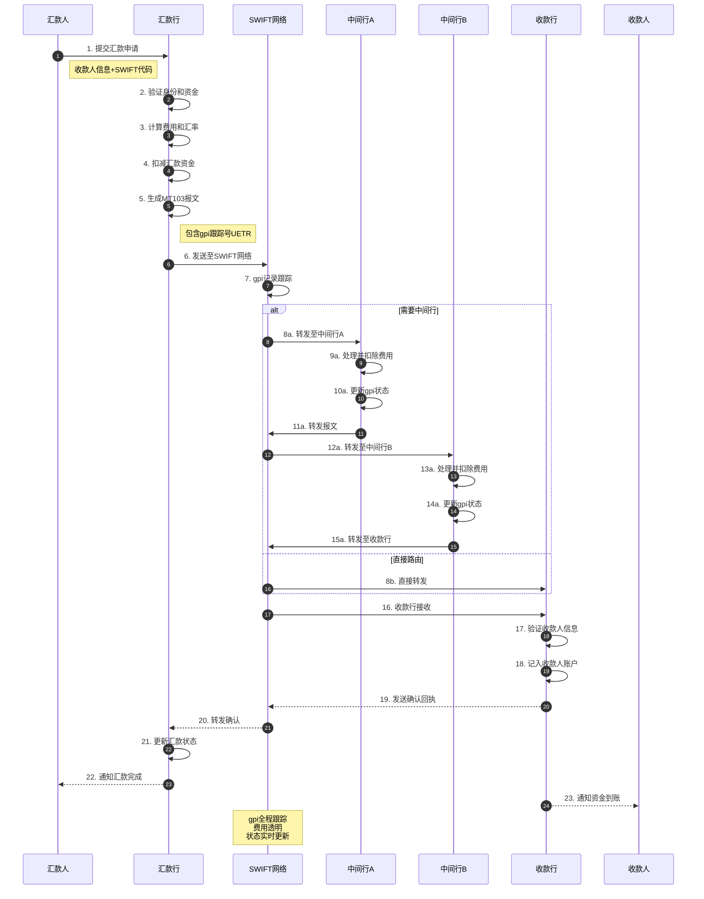
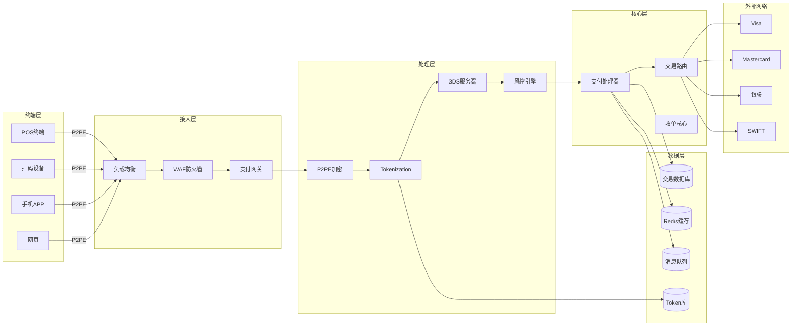
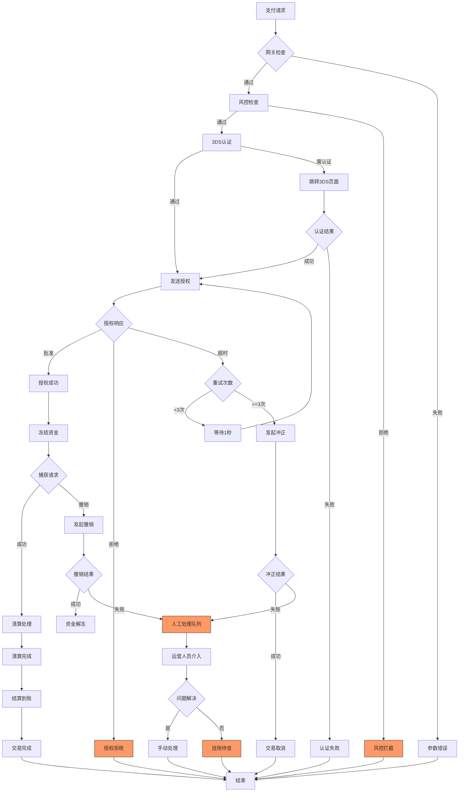
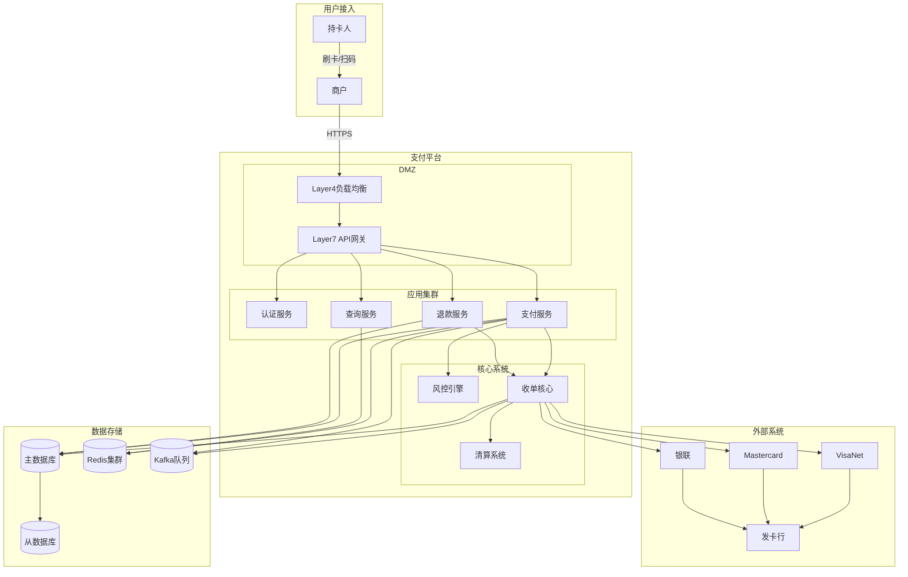

# Payment Schema动态动作分析视图

**版本**: v1.0
**创建日期**: 2026-02-15
**标准**: PCI DSS 4.0, ISO 8583:2023, EMV, SWIFT gpi

---

## 📑 目录

- [Payment Schema动态动作分析视图](#payment-schema动态动作分析视图)
  - [📑 目录](#-目录)
  - [1. 动态动作分析概述](#1-动态动作分析概述)
  - [2. 状态机形式化](#2-状态机形式化)
    - [2.1 支付交易状态机](#21-支付交易状态机)
    - [2.2 退款状态机](#22-退款状态机)
    - [2.3 争议/Chargeback状态机](#23-争议chargeback状态机)
  - [3. 时序交互分析](#3-时序交互分析)
    - [3.1 卡支付四方模式流程](#31-卡支付四方模式流程)
    - [3.2 实时支付流程](#32-实时支付流程)
    - [3.3 跨境支付流程 (含SWIFT gpi)](#33-跨境支付流程-含swift-gpi)
  - [4. 数据流分析](#4-数据流分析)
    - [4.1 支付数据流动路径](#41-支付数据流动路径)
    - [4.2 支付报文生命周期](#42-支付报文生命周期)
    - [4.3 敏感数据保护流](#43-敏感数据保护流)
  - [5. 实时性分析](#5-实时性分析)
    - [5.1 SLA要求定义](#51-sla要求定义)
    - [5.2 延迟分析模型](#52-延迟分析模型)
    - [5.3 吞吐量计算与容量规划](#53-吞吐量计算与容量规划)
  - [6. 异常处理机制](#6-异常处理机制)
    - [6.1 支付失败处理](#61-支付失败处理)
    - [6.2 超时处理机制](#62-超时处理机制)
    - [6.3 冲正机制设计](#63-冲正机制设计)
    - [6.4 异常处理决策矩阵](#64-异常处理决策矩阵)
  - [7. Mermaid动态视图](#7-mermaid动态视图)
    - [7.1 支付交易状态机图](#71-支付交易状态机图)
    - [7.2 退款状态机图](#72-退款状态机图)
    - [7.3 争议/Chargeback状态机图](#73-争议chargeback状态机图)
    - [7.4 卡支付四方模式时序图](#74-卡支付四方模式时序图)
    - [7.5 实时支付流程时序图](#75-实时支付流程时序图)
    - [7.6 跨境支付(SWIFT gpi)时序图](#76-跨境支付swift-gpi时序图)
    - [7.7 支付数据流图](#77-支付数据流图)
    - [7.8 异常处理流程图](#78-异常处理流程图)
    - [7.9 支付系统架构部署图](#79-支付系统架构部署图)

---

## 1. 动态动作分析概述

支付系统动态动作分析关注支付交易在运行时的行为特征，包括：

- **状态转换**: 支付交易、退款、争议在不同状态间的迁移
- **时序交互**: 四方模式（持卡人、商户、收单行、发卡行）的消息传递
- **数据流动**: 支付指令在网关、处理器、卡组织间的传递路径
- **实时性能**: 授权响应时间、清算延迟、结算周期的SLA保障
- **异常恢复**: 支付失败、超时、冲正和退款的处理机制

---

## 2. 状态机形式化

### 2.1 支付交易状态机

```
支付交易状态集合: PT = {已创建, 待授权, 已授权, 待捕获, 已捕获, 清算中, 已清算, 结算中, 已完成, 已撤销, 已退款}

状态转换流程:
1. 支付创建阶段
   已创建 → 待授权      (商户提交支付请求)

2. 授权阶段
   待授权 → 已授权      (发卡行批准交易)
   待授权 → 已拒绝      (发卡行拒绝交易)

3. 捕获阶段
   已授权 → 待捕获      (商户准备发货/服务)
   待捕获 → 已捕获      (商户确认交付)
   已授权 → 已撤销      (授权有效期内撤销)

4. 清算阶段
   已捕获 → 清算中      (提交卡组织清算)
   清算中 → 已清算      (卡组织清算完成)

5. 结算阶段
   已清算 → 结算中      (资金划拨处理)
   结算中 → 已完成      (商户收到资金)

6. 退款处理
   已完成 → 已退款      (发起退款请求)

状态不变式:
∀交易: 授权金额 ≥ 捕获金额 ≥ 清算金额
∀交易: 状态(交易) ∈ PT
```

**支付交易状态转换矩阵:**

| 当前状态 | 提交授权 | 授权批准 | 授权拒绝 | 发起捕获 | 清算提交 | 资金结算 | 撤销请求 | 退款请求 |
|---------|---------|---------|---------|---------|---------|---------|---------|---------|
| **已创建** | 待授权 | - | - | - | - | - | - | - |
| **待授权** | - | 已授权 | 已拒绝 | - | - | - | - | - |
| **已授权** | - | - | - | 待捕获 | - | - | 已撤销 | - |
| **待捕获** | - | - | - | 已捕获 | - | - | 已撤销 | - |
| **已捕获** | - | - | - | - | 清算中 | - | - | - |
| **清算中** | - | - | - | - | - | 已清算 | - | - |
| **已清算** | - | - | - | - | - | 已完成 | - | - |
| **已完成** | - | - | - | - | - | - | - | 已退款 |

**状态转换条件与时间限制:**

| 转换 | 触发条件 | 执行动作 | 时间限制 |
|-----|---------|---------|---------|
| 已创建→待授权 | 商户提交支付 | 风控检查、3D验证 | < 3s |
| 待授权→已授权 | 发卡行返回授权码 | 冻结持卡人额度 | < 5s |
| 待授权→已拒绝 | 发卡行拒绝 | 记录拒绝码 | < 5s |
| 已授权→待捕获 | 商户确认订单 | 准备发货 | 7天内 |
| 待捕获→已捕获 | 发货完成 | 锁定交易金额 | < 1s |
| 已捕获→清算中 | 提交卡组织 | 生成清算文件 | 24小时内 |
| 清算中→已清算 | 卡组织确认 | 更新清算状态 | 1-2工作日 |
| 已清算→已完成 | 结算到账 | 商户资金入账 | T+1至T+3 |

### 2.2 退款状态机

```
退款状态集合: R = {待审核, 审核通过, 审核拒绝, 处理中, 已提交, 已批准, 已拒绝, 已完成, 已失败}

状态转换规则:

待审核 → 审核通过    (退款申请通过风控审核)
待审核 → 审核拒绝    (退款申请未通过审核)

审核通过 → 处理中    (系统处理退款)
处理中 → 已提交      (向收单行提交退款请求)

已提交 → 已批准      (发卡行批准退款)
已提交 → 已拒绝      (发卡行拒绝退款)

已批准 → 已完成      (退款资金到账)
已批准 → 已失败      (退款处理异常)

退款类型:
- 全额退款: 退款金额 = 原交易金额
- 部分退款: 退款金额 < 原交易金额
- 多次部分退款: 累计退款 ≤ 原交易金额
```

**退款处理规则:**

| 退款类型 | 时效要求 | 金额限制 | 处理周期 |
|---------|---------|---------|---------|
| 当日撤销(Void) | 授权有效期内 | 全额 | 实时 |
| 全额退款 | 交易完成后180天 | 全额 | 3-10工作日 |
| 部分退款 | 交易完成后180天 | ≤ 原金额 | 3-10工作日 |
| 多次部分退款 | 交易完成后180天 | 累计≤原金额 | 每次3-10工作日 |

### 2.3 争议/Chargeback状态机

```
争议状态集合: D = {争议提起, 待商户响应, 商户接受, 商户拒绝, 预审中, 预审通过, 预审失败, 仲裁中, 仲裁胜诉, 仲裁败诉, 已关闭}

Chargeback流程 (发卡行发起):

阶段1: 争议提起
┌─────────┐   ┌─────────┐   ┌─────────┐
│ 持卡人  │ → │ 发卡行  │ → │ 提起争议 │
└─────────┘   └─────────┘   └─────────┘
                                   │
                                   ▼
┌─────────┐   ┌─────────┐   ┌─────────┐
│ 卡组织  │ ← │ 转发争议 │ ← │ 争议提起 │
└─────────┘   └─────────┘   └─────────┘

阶段2: 商户响应
┌─────────┐   ┌─────────┐   ┌─────────┐
│ 收单行  │ → │ 通知商户│ → │ 待响应  │
└─────────┘   └─────────┘   └─────────┘
                                   │
                    ┌──────────────┴──────────────┐
                    ▼                              ▼
              ┌─────────┐                   ┌─────────┐
              │商户接受 │                   │商户拒绝 │
              │(退款)   │                   │(举证)   │
              └─────────┘                   └─────────┘

阶段3: 争议裁决
┌─────────┐   ┌─────────┐   ┌─────────┐
│ 卡组织  │ → │ 预审    │ → │ 预审结果 │
└─────────┘   └─────────┘   └─────────┘
                                   │
                    ┌──────────────┴──────────────┐
                    ▼                              ▼
              ┌─────────┐                   ┌─────────┐
              │预审通过 │                   │预审失败 │
              │(进入仲裁)│                  │(争议结束)│
              └─────────┘                   └─────────┘

阶段4: 最终结果
┌─────────┐   ┌─────────┐   ┌─────────┐
│ 卡组织  │ → │ 仲裁    │ → │ 仲裁结果 │
└─────────┘   └─────────┘   └─────────┘
                                   │
                    ┌──────────────┴──────────────┐
                    ▼                              ▼
              ┌─────────┐                   ┌─────────┐
              │仲裁胜诉 │                   │仲裁败诉 │
              │(商户赢) │                   │(持卡人赢)│
              └─────────┘                   └─────────┘

Chargeback原因码 (Visa/Mastercard):
- 4837: 欺诈交易 (No Cardholder Authorization)
- 4853: 商品/服务与描述不符
- 4854: 商品/服务未收到
- 4855: 商品/服务已取消
- 4860: 重复处理
- 4863: 退单请求被无视
```

**争议处理时限:**

| 阶段 | 时限要求 | 责任方 | 逾期后果 |
|-----|---------|-------|---------|
| 持卡人发起 | 交易后120天 | 持卡人 | 失去争议权 |
| 发卡行提交 | 争议提起后10天 | 发卡行 | 争议失效 |
| 商户响应 | 收到通知后15-30天 | 商户 | 自动败诉 |
| 预审裁决 | 收到举证后30-45天 | 卡组织 | - |
| 仲裁裁决 | 预审后60-90天 | 卡组织 | - |

---

## 3. 时序交互分析

### 3.1 卡支付四方模式流程

```
四方模式参与方:
- 持卡人 (Cardholder)
- 商户 (Merchant)
- 收单行 (Acquirer)
- 卡组织 (Card Scheme: Visa/Mastercard/银联等)
- 发卡行 (Issuer)

交易流程时序:

T0: 持卡人选择商品，提交支付
T1 = T0 + Δt1: 商户收集支付信息(PAN、CVV、有效期)
T2 = T1 + Δt2: 商户向收单行发送授权请求
T3 = T2 + Δt3: 收单行验证商户身份，格式化交易
T4 = T3 + Δt4: 收单行通过卡组织网络转发请求
T5 = T4 + Δt5: 卡组织路由到发卡行
T6 = T5 + Δt6: 发卡行验证持卡人账户
     - 账户有效性检查
     - 余额/额度检查
     - 风控规则检查
     - 3D Secure验证(如启用)
T7 = T6 + Δt7: 发卡行返回授权响应(批准/拒绝+授权码)
T8 = T7 + Δt8: 卡组织转发响应到收单行
T9 = T8 + Δt9: 收单行转发响应到商户
T10 = T9 + Δt10: 商户显示支付结果给持卡人

授权响应时间要求: T10 - T0 < 3s (99.9%的交易)
```

**授权请求/响应报文:**

```
授权请求 (ISO 8583 MTI 0100):
- 卡号 (DE2): 主账号
- 处理码 (DE3): 交易类型
- 交易金额 (DE4): 金额+币种
- 交易时间 (DE7): 传输日期时间
- 系统跟踪号 (DE11): 唯一标识
- 本地交易时间 (DE12): HHMMSS
- 本地交易日期 (DE13): MMDD
- 有效期 (DE14): YYMM
- 商户类型 (DE18): MCC代码
- 收单行ID (DE32): 识别收单行
- 发卡行ID (DE33): 识别发卡行
- 检索参考号 (DE37): 交易唯一标识
- 授权码响应 (DE38): 发卡行返回
- 响应码 (DE39): 00=批准, 其他=拒绝原因
- 终端ID (DE41): 识别终端
- 商户ID (DE42): 识别商户
- 持卡人姓名 (DE43): 持卡人信息
- 验证数据 (DE48): CVV验证结果
- 交易货币 (DE49): 交易币种
- PIN数据 (DE52): 加密PIN
- 安全信息 (DE53): 安全控制信息
- 3D安全数据 (DE55): EMV/3DS数据
- 网络管理码 (DE70): 网络信息
- 原始数据 (DE90): 原始交易数据
- 替换金额 (DE95): 清算金额
- 安全哈希 (DE128): MAC值
```

### 3.2 实时支付流程

```
实时支付 (Real-Time Payment) 特征:
- 24/7 全天候可用
- 即时资金到账
- 低成本
- 确认回执

参与方:
- 付款方 (Payer)
- 付款行 (Payer Bank)
- 实时支付系统 (RTP Network)
- 收款行 (Payee Bank)
- 收款方 (Payee)

时序流程:

阶段1: 支付请求
T0: 付款方发起实时支付请求
T1: 付款行验证付款方账户和余额
T2: 付款行向RTP系统提交支付指令

阶段2: 实时处理
T3: RTP系统验证支付指令格式
T4: RTP系统路由到收款行
T5: 收款行验证收款方账户
T6: 收款行确认可入账

阶段3: 即时结算
T7: 收款行返回确认给RTP系统
T8: RTP系统执行资金划拨(央行账户)
T9: RTP系统通知付款行完成
T10: 收款行记入收款方账户

阶段4: 确认通知
T11: 付款行通知付款方支付成功
T12: 收款行通知收款方资金到账

总延迟: T12 - T0 < 10s (目标 < 3s)

实时支付系统示例:
- 中国: 网上支付跨行清算系统(IBPS)
- 美国: The Clearing House RTP
- 欧洲: SCT Inst (SEPA Instant)
- 英国: Faster Payments
- 印度: UPI
```

### 3.3 跨境支付流程 (含SWIFT gpi)

```
跨境支付参与方:
- 汇款人 (Remitter)
- 汇款行 (Remitting Bank)
- 中间行A (Intermediary Bank A)
- 中间行B (Intermediary Bank B)
- 收款行 (Beneficiary Bank)
- 收款人 (Beneficiary)
- SWIFT gpi系统 (全球支付创新)

SWIFT gpi 特点:
- 端到端跟踪
- 费用透明
- 快速到账
- 状态确认

跨境支付时序流程:

阶段1: 汇款发起
T0: 汇款人提交跨境汇款申请
     - 收款人姓名、账号
     - 收款行SWIFT代码
     - 汇款金额、币种
     - 费用承担方式
T1: 汇款行验证汇款人身份和资金
T2: 汇款行计算费用和汇率
T3: 汇款行扣减汇款人资金

阶段2: 报文发送 (SWIFT MT103)
T4: 汇款行生成MT103报文
     - 汇款人和收款人信息
     - 汇款金额和币种
     - 费用信息
     - gpi跟踪编号 (UETR)
T5: 报文发送至SWIFT网络
T6: SWIFT gpi记录并跟踪报文

阶段3: 中间行处理
T7: 中间行A接收报文
     - 检查账户和路由
     - 扣除手续费
     - 更新gpi状态
T8: 中间行A转发报文
T9: 中间行B接收并处理
T10: 中间行B转发至收款行

阶段4: 收款入账
T11: 收款行接收报文
T12: 收款行验证收款人信息
T13: 收款行记入收款人账户
T14: 收款行发送确认回执

阶段5: 状态更新
T15: SWIFT gpi更新最终状态
T16: 汇款行接收确认通知
T17: 汇款行通知汇款人完成

SWIFT gpi 跟踪点:
1. 报文已发送 (In Progress)
2. 中间行已接收 (In Progress)
3. 中间行已转发 (In Progress)
4. 收款行已接收 (In Progress)
5. 资金已入账 (Settled)
6. 费用已扣除 (Fees Deducted)

处理时间:
- 传统跨境支付: 2-5个工作日
- SWIFT gpi优先支付: 几小时至1个工作日
- 特定走廊(gpi Instant): 30分钟内

费用透明:
- OUR: 汇款人承担所有费用
- SHA: 双方分担费用
- BEN: 收款人承担所有费用
```

---

## 4. 数据流分析

### 4.1 支付数据流动路径

```
支付数据生命周期:

1. 采集阶段
   ┌─────────────────────────────────────────┐
   │ 支付终端层: POS/扫码/网银/手机APP        │
   │   - 支付信息采集                         │
   │   - 敏感数据加密(P2PE)                   │
   │   - 初步验证                            │
   └─────────────────────────────────────────┘
                    │
                    ▼ (TLS/P2PE)
2. 接入阶段
   ┌─────────────────────────────────────────┐
   │ 支付网关层: Payment Gateway             │
   │   - 报文解析与验证                       │
   │   - 3D Secure认证                       │
   │   - 初步风控检查                         │
   │   - 敏感数据脱敏(Tokenization)          │
   └─────────────────────────────────────────┘
                    │
                    ▼ (ISO 8583/JSON)
3. 路由阶段
   ┌─────────────────────────────────────────┐
   │ 支付处理器: Payment Processor           │
   │   - 交易路由选择                         │
   │   - 卡组织适配                          │
   │   - 费率计算                            │
   └─────────────────────────────────────────┘
                    │
                    ▼ (卡组织网络)
4. 授权阶段
   ┌─────────────────────────────────────────┐
   │ 卡组织网络: Visa/Mastercard/银联         │
   │   - 交易路由                            │
   │   - 交换费计算                          │
   │   - 授权转发                            │
   └─────────────────────────────────────────┘
                    │
                    ▼ (银行核心)
5. 银行处理
   ┌─────────────────────────────────────────┐
   │ 发卡行系统: Issuer System               │
   │   - 账户验证                            │
   │   - 余额检查                            │
   │   - 风控规则                            │
   │   - 授权决策                            │
   └─────────────────────────────────────────┘
                    │
                    ▼ (返回路径)
6. 响应阶段
   ┌─────────────────────────────────────────┐
   │ 响应回传: 原路返回响应                   │
   │   - 授权码传递                          │
   │   - 结果通知                            │
   │   - 凭证生成                            │
   └─────────────────────────────────────────┘
```

### 4.2 支付报文生命周期

```
支付报文处理流程:

原始报文:
┌─────────────────────────────────────────────────────────────┐
│ 敏感数据:                                                    │
│   PAN: 4111-1111-1111-1111                                  │
│   CVV: 123                                                  │
│   Expiry: 12/28                                             │
│   PIN: 加密的PIN块                                          │
└─────────────────────────────────────────────────────────────┘
                    │
                    ▼ Tokenization
脱敏处理:
┌─────────────────────────────────────────────────────────────┐
│ Token替换:                                                   │
│   Token: 4123-****-****-5678                                │
│   CVV: *** (不存储)                                         │
│   其他数据保持不变                                           │
└─────────────────────────────────────────────────────────────┘
                    │
                    ▼ 加密传输
网络传输:
┌─────────────────────────────────────────────────────────────┐
│ TLS加密:                                                     │
│   - AES-256-GCM加密                                         │
│   - 证书验证                                                │
│   - 完美前向保密                                            │
└─────────────────────────────────────────────────────────────┘
                    │
                    ▼ 解密处理
业务处理:
┌─────────────────────────────────────────────────────────────┐
│ 结构化数据:                                                  │
│   - 转换为内部格式                                          │
│   - 字段验证                                                │
│   - 业务规则检查                                            │
└─────────────────────────────────────────────────────────────┘
                    │
                    ▼ 响应封装
响应生成:
┌─────────────────────────────────────────────────────────────┐
│ 响应报文:                                                    │
│   - 响应码 (00=成功)                                        │
│   - 授权码                                                  │
│   - 参考号                                                  │
│   - 时间戳                                                  │
└─────────────────────────────────────────────────────────────┘
```

### 4.3 敏感数据保护流

```
PCI DSS数据保护要求:

数据分类:
┌─────────────────┬────────────────────────────────────────┐
│ CHD (持卡人数据) │ 需要保护的核心数据                      │
├─────────────────┼────────────────────────────────────────┤
│ 主要账户号(PAN)  │ 必须加密存储，显示时脱敏                │
│ 持卡人姓名       │ 可存储，需访问控制                      │
│ 有效期          │ 可存储，需访问控制                      │
│ 服务代码        │ 可存储，需访问控制                      │
└─────────────────┴────────────────────────────────────────┘

┌─────────────────┬────────────────────────────────────────┐
│ SAD (敏感认证数据)│ 禁止存储(授权后必须删除)                │
├─────────────────┼────────────────────────────────────────┤
│ CVV/CVC          │ 绝对禁止存储                            │
│ PIN/PIN块        │ 绝对禁止存储                            │
│ 磁条数据         │ 绝对禁止存储                            │
│ 芯片数据         │ 绝对禁止存储                            │
└─────────────────┴────────────────────────────────────────┘

数据流保护点:
1. 采集点 (POI - Point of Interaction)
   - P2PE加密
   - 安全PIN输入设备
   - 防篡改保护

2. 传输过程
   - TLS 1.3加密
   - 证书固定
   - 双向认证

3. 存储保护
   - AES-256加密
   - Tokenization
   - 密钥管理(HSM)

4. 访问控制
   - 最小权限原则
   - 多因素认证
   - 操作审计
```

---

## 5. 实时性分析

### 5.1 SLA要求定义

```
支付系统服务等级协议 (SLA):

交易类型          │ 响应时间   │ 可用性    │ 吞吐量    │ 错误率    │ 一致性
─────────────────┼───────────┼──────────┼──────────┼──────────┼─────────
授权请求          │ < 3s      │ 99.99%   │ 20,000 TPS│ < 0.1%   │ 强一致
3D Secure认证     │ < 5s      │ 99.95%   │ 10,000 TPS│ < 0.5%   │ 强一致
交易捕获          │ < 1s      │ 99.99%   │ 15,000 TPS│ < 0.01%  │ 强一致
退款处理          │ < 3s      │ 99.95%   │ 5,000 TPS │ < 0.1%   │ 强一致
交易查询          │ < 200ms   │ 99.99%   │ 50,000 QPS│ < 0.01%  │ 最终一致
清算文件处理      │ < 1小时   │ 99.9%    │ 100万笔/批次│ < 0.1% │ 强一致
实时支付          │ < 10s     │ 99.99%   │ 10,000 TPS│ < 0.01%  │ 强一致
Token生成         │ < 100ms   │ 99.99%   │ 50,000 TPS│ < 0.01%  │ 强一致

业务时段要求:
- 日常时段 (00:00-24:00): 核心服务7×24可用
- 高峰时段 (10:00-12:00, 18:00-22:00): 扩容至2倍容量
- 清算窗口 (02:00-04:00): 批处理任务，查询服务降级
- 维护窗口 (周日02:00-06:00): 计划内维护，部分服务受限
```

### 5.2 延迟分析模型

```
授权交易延迟分解:

总延迟 = T_终端 + T_网络 + T_网关 + T_处理器 + T_卡组织 + T_发卡行

详细分解:

1. 终端处理 (T_终端): 50-200ms
   - 用户输入: 可变
   - 读卡/扫码: 100-300ms
   - 终端加密: 50-100ms

2. 网络传输 (T_网络): 20-100ms
   - 终端到网关: 10-50ms
   - 网关到处理器: 5-20ms
   - 处理器到卡组织: 10-30ms

3. 网关处理 (T_网关): 30-100ms
   - 报文解析: 5-10ms
   - 3DS检查: 10-30ms
   - Token转换: 10-20ms
   - 初步风控: 5-40ms

4. 处理器处理 (T_处理器): 20-80ms
   - 商户验证: 5-10ms
   - 路由选择: 5-10ms
   - 报文转换: 5-20ms
   - 费率计算: 5-10ms

5. 卡组织网络 (T_卡组织): 50-150ms
   - 报文路由: 20-50ms
   - 交换费计算: 5-10ms
   - 授权转发: 20-80ms

6. 发卡行处理 (T_发卡行): 100-500ms
   - 账户查询: 10-30ms
   - 余额检查: 10-20ms
   - 风控规则: 50-300ms
   - 授权决策: 10-20ms
   - 额度冻结: 10-30ms

总延迟范围: 270ms - 1130ms
目标P99: < 3s
目标P95: < 2s
目标P50: < 1s
```

### 5.3 吞吐量计算与容量规划

```
系统容量规划模型:

峰值TPS计算:
TPS_peak = (日交易笔数 × 峰值系数) / (峰值持续秒数)

假设参数:
- 日交易笔数: 50,000,000 笔
- 峰值系数: 2.5 (峰值是平均的2.5倍)
- 峰值持续时间: 3小时 (10,800秒)

计算:
TPS_avg = 50,000,000 / 86,400 ≈ 579 TPS
TPS_peak = (50,000,000 × 2.5) / 10,800 ≈ 11,574 TPS

设计容量 (考虑5倍冗余):
TPS_design = 11,574 × 5 ≈ 57,870 TPS

资源需求估算:

应用服务器:
- 单机处理能力: 1,000 TPS
- 所需实例: 57,870 / 1,000 ≈ 60 台
- 冗余配置: 60 × 1.5 = 90 台

数据库:
- 连接池: 57,870 × 2 = 115,740 连接
- 主库: 1 台 (高性能)
- 从库: 8 台 (读分离)
- 连接池中间件: PgBouncer/ProxySQL

缓存 (Redis):
- 热数据: 10% 的交易
- 平均数据大小: 5KB
- 缓存容量: 5,000,000 × 5KB = 25GB
- 集群配置: 8主8从

消息队列:
- 峰值消息: 57,870 条/秒
- 队列分区: 64 partitions
- 副本因子: 3
- 保留时间: 7天

网络带宽:
- 平均报文大小: 2KB
- 入站带宽: 57,870 × 2KB × 8 = 926 Mbps
- 出站带宽: 926 Mbps × 2 = 1.85 Gbps
- 总带宽需求: 2.5 Gbps (含冗余)

存储:
- 日数据量: 50,000,000 × 2KB = 100GB
- 年数据量: 100GB × 365 = 36.5TB
- 压缩后: 36.5TB × 0.3 = 11TB/年
- 保留策略: 热数据30天，温数据1年，冷数据7年
```

---

## 6. 异常处理机制

### 6.1 支付失败处理

```
支付失败分类与处理:

失败类型          │ 错误码    │ 原因              │ 自动处理           │ 用户提示
─────────────────┼──────────┼──────────────────┼───────────────────┼─────────────────
余额不足          │ 51       │ 可用额度不足       │ 直接拒绝           │ "余额不足"
过期卡            │ 54       │ 卡片已过期         │ 直接拒绝           │ "卡片已过期"
密码错误          │ 55       │ PIN验证失败        │ 拒绝，记录尝试次数  │ "密码错误"
限制交易          │ 57       │ 交易类型受限       │ 直接拒绝           │ "交易受限"
安全风险          │ 59       │  suspected fraud   │ 拒绝，触发风控      │ "交易被拒绝"
联系发卡行        │ 01       │ 需人工审核         │ 拒绝               │ "请联系发卡行"
系统错误          │ 96       │ 发卡行系统故障     │ 重试1次            │ "请稍后重试"
超时              │ 68/91    │ 响应超时           │ 重试2次            │ "网络繁忙"

重试策略:
- 可重试错误: 网络超时、系统错误、限流拒绝
- 重试间隔: 1s, 3s, 5s (指数退避)
- 最大重试: 3次
- 幂等性保障: 使用交易ID去重
```

### 6.2 超时处理机制

```
超时层级设计:

Level 1: 用户界面超时 (30s)
- 用户等待容忍上限
- 显示"处理中"状态
- 提供"查询状态"按钮
- 超时后提示"请查询交易结果"

Level 2: 终端超时 (15s)
- POS/终端等待响应上限
- 超时后提示"连接失败"
- 支持重新发起交易

Level 3: 网关超时 (10s)
- API Gateway等待后端响应
- 超时返回504错误
- 触发熔断保护
- 记录超时日志

Level 4: 处理器超时 (8s)
- 支付处理器等待卡组织
- 超时后标记"待确认"
- 发起交易状态查询
- 异步处理后续流程

Level 5: 发卡行超时 (6s)
- 等待发卡行授权响应
- 超时后返回"联系发卡行"
- 卡组织记录异常交易

超时处理策略:
1. 快速失败: 立即返回错误，不等待
2. 异步处理: 转后台处理，稍后通知
3. 状态查询: 提供交易状态查询接口
4. 冲正机制: 对不确定交易发起冲正
```

### 6.3 冲正机制设计

```
冲正 (Reversal) 机制:

触发条件:
- 授权成功但响应超时
- 授权成功后交易取消
- 重复提交检测
- 系统异常中断

冲正流程:

场景1: 授权超时冲正
┌─────────┐    ┌─────────┐    ┌─────────┐    ┌─────────┐
│ 商户    │ →  │ 收单行  │ →  │ 卡组织  │ →  │ 发卡行  │
└─────────┘    └─────────┘    └─────────┘    └─────────┘
     │              │              │              │
     │ 授权请求     │              │              │
     │─────────────>│              │              │
     │              │ 授权请求     │              │
     │              │─────────────>│              │
     │              │              │ 授权请求     │
     │              │              │─────────────>│
     │              │              │  超时        │
     │              │              │<─X───────────│
     │              │  超时        │              │
     │  超时        │<─X───────────│              │
     │<─X───────────│              │              │
     │              │              │              │
     │ 冲正请求     │              │              │
     │─────────────>│              │              │
     │              │ 冲正请求     │              │
     │              │─────────────>│              │
     │              │              │ 冲正请求     │
     │              │              │─────────────>│
     │              │              │ 冲正确认     │
     │              │              │<─────────────│
     │              │ 冲正确认     │              │
     │ 冲正确认     │<─────────────│              │
     │<─────────────│              │              │

场景2: 日终对账冲正
- 对账发现不平
- 自动发起冲正请求
- 补平差额

冲正时限:
- 当日冲正: 交易发生后24小时内
- 隔日冲正: 需人工审核
- 批量冲正: 对账差异批量处理

冲正报文 (ISO 8583 MTI 0400):
- 原交易信息
- 冲正原因码
- 新授权码(如需要)
```

### 6.4 异常处理决策矩阵

```
异常场景分类与处理:

异常类型          │ 检测方式       │ 自动处理           │ 人工介入      │ 通知方式       │ SLA
─────────────────┼───────────────┼───────────────────┼──────────────┼───────────────┼─────────
网络超时          │ 连接超时      │ 重试3次            │ 超过3次       │ 日志+告警      │ 5分钟
卡组织超时        │ 响应超时      │ 状态查询+冲正      │ 冲正失败      │ 紧急告警       │ 15分钟
发卡行拒绝        │ 返回码        │ 直接拒绝           │ 无需介入      │ 客户端提示     │ 实时
重复交易          │ 幂等检查      │ 返回原结果         │ 无需介入      │ 日志记录       │ 实时
3DS认证失败       │ 返回码        │ 提示重新认证       │ 多次失败      │ 客户端提示     │ 实时
风控拦截          │ 规则引擎      │ 拒绝+记录          │ 可疑交易审核  │ 风控通知       │ 实时
欺诈交易          │ 模型检测      │ 拦截+标记          │ 欺诈调查      │ 紧急告警       │ 1小时
系统故障          │ 健康检查      │ 服务降级           │ 故障恢复      │ 全员告警       │ 30分钟
数据不一致        │ 对账检测      │ 自动调平           │ 无法调平      │ 每日对账报告   │ 24小时
```

---

## 7. Mermaid动态视图

### 7.1 支付交易状态机图



### 7.2 退款状态机图



### 7.3 争议/Chargeback状态机图



### 7.4 卡支付四方模式时序图



### 7.5 实时支付流程时序图



### 7.6 跨境支付(SWIFT gpi)时序图



### 7.7 支付数据流图



### 7.8 异常处理流程图



### 7.9 支付系统架构部署图



---

**参考文档**:

- `01_Overview.md` - 支付系统概述
- `02_Formal_Definition.md` - 形式化定义
- `04_Transformation.md` - 模型转换
- `05_Case_Studies.md` - 案例研究
- PCI DSS 4.0 标准
- ISO 8583:2023 标准
- EMV Specifications
- SWIFT gpi 标准

**维护者**: DSL Schema研究团队
