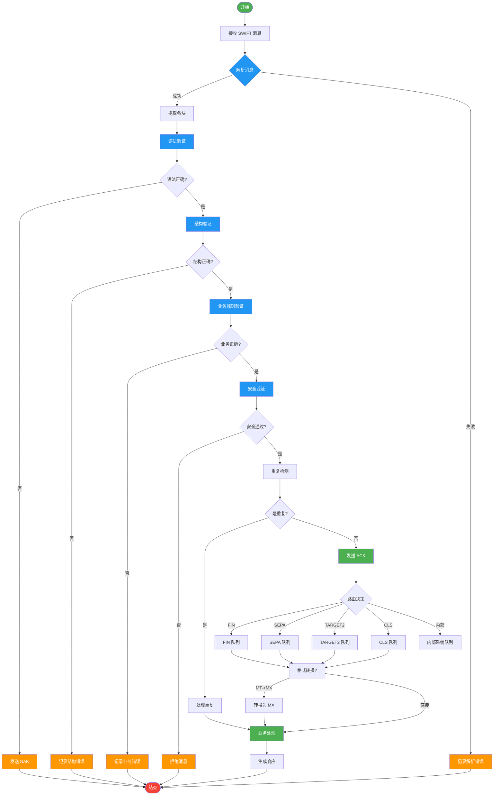

# SWIFT Schema 形式语法与语义分析视图

**版本**: v1.0
**创建日期**: 2026-02-15
**标准**: SWIFT MT/MX Message Standards, ISO 15022, ISO 20022

---

## 目录

- [SWIFT Schema 形式语法与语义分析视图](#swift-schema-形式语法与语义分析视图)
  - [目录](#目录)
  - [1. 形式文法定义 (EBNF)](#1-形式文法定义-ebnf)
    - [1.1 SWIFT 消息顶层结构](#11-swift-消息顶层结构)
    - [1.2 MT 消息文法](#12-mt-消息文法)
    - [1.3 MX 消息文法 (ISO 20022)](#13-mx-消息文法-iso-20022)
    - [1.4 字段定义文法](#14-字段定义文法)
  - [2. 类型系统](#2-类型系统)
    - [2.1 基本数据类型](#21-基本数据类型)
    - [2.2 金额字段类型](#22-金额字段类型)
    - [2.3 日期时间类型](#23-日期时间类型)
    - [2.4 BIC/IBAN 类型](#24-biciban-类型)
  - [3. 操作语义](#3-操作语义)
    - [3.1 SWIFT 消息解析操作](#31-swift-消息解析操作)
    - [3.2 SWIFT 消息验证操作](#32-swift-消息验证操作)
    - [3.3 SWIFT 消息路由](#33-swift-消息路由)
  - [4. 指称语义](#4-指称语义)
    - [4.1 SWIFT 网络语义域](#41-swift-网络语义域)
    - [4.2 语义解释函数](#42-语义解释函数)
    - [4.3 MT/MX 消息表示语义](#43-mtmx-消息表示语义)
  - [5. 公理语义](#5-公理语义)
    - [5.1 消息完整性公理](#51-消息完整性公理)
    - [5.2 不可否认性公理](#52-不可否认性公理)
    - [5.3 序列号连续性公理](#53-序列号连续性公理)
    - [5.4 业务规则公理](#54-业务规则公理)
  - [6. Mermaid 可视化](#6-mermaid-可视化)
    - [6.1 SWIFT MT 消息结构](#61-swift-mt-消息结构)
    - [6.2 SWIFT 消息处理流程](#62-swift-消息处理流程)

---

## 1. 形式文法定义 (EBNF)

### 1.1 SWIFT 消息顶层结构

```ebnf
(* SWIFT 消息顶层结构 *)
SWIFTMessage ::= BasicHeader ApplicationHeader UserHeader? Text Trailer

(* 基础头块 Block 1 *)
BasicHeader ::= '{1:' ApplicationId ServiceId
                LogicalTerminalAddress SessionNumber SequenceNumber '}'

ApplicationId ::= 'F' | 'A' | 'L' | 'S'
                (* F: 金融应用, A: 通用应用, L: 日志应用, S: 系统应用 *)

ServiceId ::= Digit Digit
              (* 01: FIN/GPA, 21: ACK/NAK *)

LogicalTerminalAddress ::= UpperCaseLetter{4}  (* 银行代码 *)
                           UpperCaseLetter{2}  (* 国家代码 *)
                           Alphanumeric{2}     (* 位置代码 *)
                           Alphanumeric{1}     (* 逻辑终端 *)
                           Alphanumeric{3}     (* 分支代码 *)

SessionNumber ::= Digit{4}
SequenceNumber ::= Digit{6}

(* 应用头块 Block 2 - 输入/输出 *)
ApplicationHeader ::= InputHeader | OutputHeader

InputHeader ::= '{2:I' MessageType
                ReceiverAddress
                MessagePriority
                DeliveryMonitoring?
                ObsolescencePeriod? '}'

OutputHeader ::= '{2:O' MessageType
                 InputTime
                 MessageInputReference
                 OutputDate
                 OutputTime
                 MessagePriority '}'

MessageType ::= Digit{3}
                (* 103: 单笔客户汇款, 202: 金融机构转账, 950: 对账单 *)

ReceiverAddress ::= LogicalTerminalAddress
MessagePriority ::= 'S' | 'N' | 'U'
                    (* S: 系统, N: 正常, U: 紧急 *)

DeliveryMonitoring ::= '1' | '2' | '3'
ObsolescencePeriod ::= Digit{3}

InputTime ::= Hour Minute
MessageInputReference ::= Date LogicalTerminalAddress SessionNumber SequenceNumber
OutputDate ::= Year Month Day
OutputTime ::= Hour Minute

(* 用户头块 Block 3 - 可选 *)
UserHeader ::= '{3:' UserField+ '}'

UserField ::= '{113:' BankingPriority '}'
            | '{108:' MessageUserReference '}'
            | '{119:' ValidationFlag '}'
            | '{423:' CancellationFlag '}'
            | '{106:' MessageInputReference '}'

BankingPriority ::= '0001' | '0002' | '0003'
MessageUserReference ::= Alphanumeric{1,16}
ValidationFlag ::= 'STP' | 'REMIT'
CancellationFlag ::= 'Y' | 'N'

(* 文本块 Block 4 *)
Text ::= '{4:' CRLF Field+ '-}' CRLF

Field ::= ':' FieldTag ':' FieldContent CRLF

FieldTag ::= Digit{2} Letter?
             (* 如: 20, 23B, 32A, 50A, 59, 71A 等 *)

FieldContent ::= PrintableChar+

(* 尾块 Block 5 *)
Trailer ::= '{5:' TrailerField+ '}'

TrailerField ::= '{CHK:' Checksum '}'
               | '{TNG:' TrainingMode '}'
               | '{PDE:' PossibleDuplicateEmission '}'
               | '{PDM:' PossibleDuplicateMessage '}'
               | '{MRF:' MessageReference '}'
               | '{SYS:' SystemOriginatedMessage '}'

Checksum ::= HexDigit{4}
TrainingMode ::= '0' | '1'
PossibleDuplicateEmission ::= Time LogicalTerminalAddress SessionNumber SequenceNumber
PossibleDuplicateMessage ::= Time LogicalTerminalAddress SessionNumber SequenceNumber
MessageReference ::= Alphanumeric{1,16}
SystemOriginatedMessage ::= '0' | '1'
```

### 1.2 MT 消息文法

```ebnf
(* ===== MT103 - 单笔客户汇款 ===== *)
MT103 ::= BasicHeader ApplicationHeader UserHeader? MT103Body Trailer

MT103Body ::= '{4:' CRLF
                Field20
                Field13C*
                Field23B
                Field23E*
                Field26T?
                Field32A
                Field33B?
                Field36?
                Field50A | Field50F | Field50K
                Field51A?
                Field52A? | Field52D?
                Field53A? | Field53B? | Field53D?
                Field54A? | Field54B? | Field54D?
                Field55A? | Field55B? | Field55D?
                Field56A? | Field56C? | Field56D?
                Field57A? | Field57B? | Field57C? | Field57D?
                Field59? | Field59A? | Field59F?
                Field70?
                Field71A
                Field71F*
                Field71G?
                Field72?
                Field77B?
              '-}' CRLF

(* 字段定义 *)
Field20 ::= ':20:' SenderReference CRLF
SenderReference ::= Alphanumeric{1,16}

Field23B ::= ':23B:' BankOperationCode CRLF
BankOperationCode ::= 'CRED' | 'CRTS' | 'SPAY' | 'SSTD'

Field32A ::= ':32A:' ValueDate CurrencyCode Amount CRLF
ValueDate ::= Year Month Day
CurrencyCode ::= UpperCaseLetter{3}
Amount ::= Digit{1,15} [',' Digit{0,2}]

Field50A ::= ':50A:' OrderingCustomerA CRLF
OrderingCustomerA ::= Account? CRLF PartyIdentifier

Field50F ::= ':50F:' OrderingCustomerF CRLF
OrderingCustomerF ::= PartyName CRLF PartyAddress*

Field50K ::= ':50K:' OrderingCustomerK CRLF
OrderingCustomerK ::= Account? CRLF PartyName{1,4} PartyAddress*

Field59 ::= ':59:' Beneficiary CRLF
Beneficiary ::= Account? CRLF PartyName{1,4} PartyAddress*

Field59A ::= ':59A:' BeneficiaryA CRLF
BeneficiaryA ::= Account? CRLF PartyIdentifier

Field71A ::= ':71A:' DetailsOfCharges CRLF
DetailsOfCharges ::= 'BEN' | 'OUR' | 'SHA'

(* ===== MT202 - 金融机构转账 ===== *)
MT202 ::= BasicHeader ApplicationHeader UserHeader? MT202Body Trailer

MT202Body ::= '{4:' CRLF
                Field20
                Field21
                Field13C*
                Field32A
                Field52A? | Field52D?
                Field53A? | Field53B? | Field53D?
                Field54A? | Field54B? | Field54D?
                Field56A? | Field56C? | Field56D?
                Field57A? | Field57B? | Field57C? | Field57D?
                Field58A? | Field58D?
                Field72?
              '-}' CRLF

Field21 ::= ':21:' RelatedReference CRLF
RelatedReference ::= Alphanumeric{1,16}

Field58A ::= ':58A:' BeneficiaryInstitutionA CRLF
BeneficiaryInstitutionA ::= Account? CRLF PartyIdentifier

(* ===== MT950 - 对账单 ===== *)
MT950 ::= BasicHeader ApplicationHeader UserHeader? MT950Body Trailer

MT950Body ::= '{4:' CRLF
                Field20
                Field25
                Field28C
                Field60F | Field60M
                StatementLine*
                Field62F | Field62M
                Field64?
                Field65*
              '-}' CRLF

Field25 ::= ':25:' AccountIdentification CRLF
AccountIdentification ::= Account

Field28C ::= ':28C:' StatementNumber PageNumber CRLF
StatementNumber ::= Digit{1,5}
PageNumber ::= Digit{1,5}

Field60F ::= ':60F:' DebitCredit OpeningDate CurrencyCode Amount CRLF
Field60M ::= ':60M:' DebitCredit OpeningDate CurrencyCode Amount CRLF

StatementLine ::= ':61:' ValueDate EntryDate DebitCredit Amount
                  TransactionTypeIdentification
                  ReferenceForTheAccountOwner
                  ReferenceOfTheAccountServicingInstitution?
                  SupplementaryDetails? CRLF

Field62F ::= ':62F:' DebitCredit ClosingDate CurrencyCode Amount CRLF
Field62M ::= ':62M:' DebitCredit ClosingDate CurrencyCode Amount CRLF

Field64 ::= ':64:' ClosingAvailableBalance CRLF
ClosingAvailableBalance ::= DebitCredit ClosingDate CurrencyCode Amount

Field65 ::= ':65:' ForwardAvailableBalance CRLF
ForwardAvailableBalance ::= DebitCredit ForwardDate CurrencyCode Amount
```

### 1.3 MX 消息文法 (ISO 20022)

```ebnf
(* ===== MX 消息 - pacs.008 客户贷记转账 ===== *)
pacs008 ::= '<?xml version="1.0" encoding="UTF-8"?>'
            '<Document xmlns="urn:iso:std:iso:20022:tech:xsd:pacs.008.001.08"
                       xmlns:xsi="http://www.w3.org/2001/XMLSchema-instance">'
              CustomerCreditTransferV08
            '</Document>'

CustomerCreditTransferV08 ::= '<FIToFICstmrCdtTrf>'
                                GroupHeader83
                                CreditTransferTransaction39+
                                SupplementaryData?
                              '</FIToFICstmrCdtTrf>'

GroupHeader83 ::= '<GrpHdr>'
                    MessageIdentification7
                    CreationDateTime
                    NumberOfTransactions
                    SettlementInformation
                    PaymentTypeInformation?
                    InstructingAgent?
                    InstructedAgent?
                  '</GrpHdr>'

CreditTransferTransaction39 ::= '<CdtTrfTxInf>'
                                  PaymentIdentification6
                                  PaymentTypeInformation?
                                  Amount
                                  ChargeBearer?
                                  UltimateDebtor?
                                  InitiatingParty?
                                  Debtor
                                  DebtorAccount?
                                  DebtorAgent
                                  CreditorAgent?
                                  Creditor
                                  CreditorAccount?
                                  UltimateCreditor?
                                  Purpose?
                                  RemittanceInformation?
                                '</CdtTrfTxInf>'

(* ===== MX 消息 - pain.001 客户支付发起 ===== *)
pain001 ::= '<?xml version="1.0" encoding="UTF-8"?>'
            '<Document xmlns="urn:iso:std:iso:20022:tech:xsd:pain.001.001.09">'
              CustomerCreditTransferInitiationV09
            '</Document>'

CustomerCreditTransferInitiationV09 ::= '<CstmrCdtTrfInitn>'
                                          GroupHeader83
                                          PaymentInstruction30+
                                        '</CstmrCdtTrfInitn>'

PaymentInstruction30 ::= '<PmtInf>'
                           PaymentInformationIdentification
                           PaymentMethod
                           RequestedExecutionDate
                           Debtor
                           DebtorAccount
                           ChargeBearer?
                           CreditTransferTransactionInformation+
                         '</PmtInf>'

(* ===== MX 消息 - camt.053 银行对账单 ===== *)
camt053 ::= '<?xml version="1.0" encoding="UTF-8"?>'
            '<Document xmlns="urn:iso:std:iso:20022:tech:xsd:camt.053.001.08">'
              BankToCustomerStatementV08
            '</Document>'

BankToCustomerStatementV08 ::= '<BkToCstmrStmt>'
                                 GroupHeader77
                                 Statement+
                               '</BkToCstmrStmt>'

Statement ::= '<Stmt>'
                Identification
                CreationDateTime
                FromToDate
                Account
                Balance+
                Entry*
              '</Stmt>'

Entry ::= '<Ntry>'
            Amount
            CreditDebitIndicator
            Status
            BookingDate
            ValueDate
            AccountServicerReference
            EntryDetails?
          '</Ntry>'
```

### 1.4 字段定义文法

```ebnf
(* ===== 通用字段组件 ===== *)

(* 参与方标识 *)
PartyIdentifier ::= BIC | BEI | LEI | GenericIdentification

BIC ::= UpperCaseOrDigit{4} UpperCaseOrDigit{2} UpperCaseOrDigit{2}
        (UpperCaseOrDigit{3})?

BEI ::= UpperCaseOrDigit{4} UpperCaseOrDigit{2} UpperCaseOrDigit{2}
        (UpperCaseOrDigit{3})?

LEI ::= UpperCaseOrDigit{20}

GenericIdentification ::= '//' IdentificationCode

(* 账户标识 *)
Account ::= '/' AccountNumber
AccountNumber ::= Alphanumeric{1,34}

IBAN ::= UpperCaseLetter{2} Digit{2} Alphanumeric{1,30}

BBAN ::= Alphanumeric{1,30}

UPIC ::= Digit{8,17}

(* 地址 *)
PartyAddress ::= StreetAddress TownName CountryCode

StreetAddress ::= PrintableChar{1,35}
TownName ::= PrintableChar{1,35}
CountryCode ::= UpperCaseLetter{2}

(* 日期时间 *)
Date ::= Year Month Day
Year ::= Digit{2} | Digit{4}
Month ::= Digit{2}
Day ::= Digit{2}

Time ::= Hour Minute
Hour ::= Digit{2}
Minute ::= Digit{2}

DateTime ::= Date 'T' Time

(* 金额 *)
Amount ::= Sign? Digit+ [DecimalSeparator Digit+]
Sign ::= 'N' | '-'
DecimalSeparator ::= ',' | '.'

(* 交易类型 *)
TransactionType ::= SWIFTCode | ProprietaryCode
SWIFTCode ::= UpperCaseLetter{4}
ProprietaryCode ::= '/' Code

(* 借贷标识 *)
DebitCredit ::= 'D' | 'C' | 'RC' | 'RD'

(* 参考号 *)
Reference ::= Alphanumeric{1,16}

(* 补充细节 *)
SupplementaryDetails ::= '//' PrintableChar{1,34}

(* ===== 字符集定义 ===== *)
Digit ::= '0' | '1' | '2' | '3' | '4' | '5' | '6' | '7' | '8' | '9'
UpperCaseLetter ::= 'A' | 'B' | ... | 'Z'
LowerCaseLetter ::= 'a' | 'b' | ... | 'z'
Letter ::= UpperCaseLetter | LowerCaseLetter
Alphanumeric ::= Letter | Digit
UpperCaseOrDigit ::= UpperCaseLetter | Digit
HexDigit ::= Digit | 'A' | 'B' | 'C' | 'D' | 'E' | 'F'
PrintableChar ::= Alphanumeric | Space | SpecialChar
SpecialChar ::= '.' | ',' | '-' | '/' | '(' | ')' | '+' | ':' |
                '?' | ''' | ' ' | '&' | '=' | '!' | '%' | '*' |
                '<' | '>' | ';' | '{' | '}' | '\"' | '#' | '@' | '_'
CRLF ::= CarriageReturn LineFeed
CarriageReturn ::= 0x0D
LineFeed ::= 0x0A
```


---

## 2. 类型系统

### 2.1 基本数据类型

```haskell
-- SWIFT 数据类型层次结构
data SWIFTDataType
  = MTMessageType MTMessageDef
  | MXMessageType MXMessageDef
  | FieldType FieldDef
  | BasicType BasicConstraint
  | CompositeType CompositeConstraint

data BasicConstraint
  = TextConstraint TextType
  | NumericConstraint NumericType
  | TemporalConstraint TemporalType
  | IdentifierConstraint IdentifierType
  | CodeConstraint CodeType

data TextType
  = AlphaType { minLength :: Int, maxLength :: Int }
  | AlphaNumericType { minLength :: Int, maxLength :: Int }
  | PrintableType { minLength :: Int, maxLength :: Int }
  | SWIFTTextType { swiftPattern :: Regex }

data NumericType
  = IntegerType { digits :: Int }
  | DecimalType { totalDigits :: Int, fractionDigits :: Int }
  | AmountType { precision :: Int, scale :: Int }
  | RateType { precision :: Int }

data TemporalType
  = DateType { dateFormat :: DateFormat }
  | TimeType { timeFormat :: TimeFormat }
  | DateTimeType { dateTimeFormat :: DateTimeFormat }

data DateFormat
  = YYMMDD
  | YYYYMMDD
  | MMDD

data TimeFormat
  = HHMM
  | HHMMSS

data DateTimeFormat
  = ISO8601DateTime
  | SWIFTDateTime

data IdentifierType
  = BICType
  | BEIType
  | LEIType
  | IBANType
  | BBANType
  | UPICType
  | AccountType

data CodeType
  = EnumeratedCode [String]
  | PatternCode Regex
  | ExternalCodeSet String

data CompositeConstraint
  = PartyType PartyStructure
  | AmountCurrencyType AmountStructure
  | AddressType AddressStructure
  | TransactionType TransactionStructure

data PartyStructure = PartyStructure
  { partyIdentifier :: Maybe IdentifierType
  , partyName :: Maybe TextType
  , partyAddress :: Maybe AddressStructure
  , partyAccount :: Maybe IdentifierType
  }

data AmountStructure = AmountStructure
  { amountValue :: NumericType
  , amountCurrency :: CodeType
  , amountSign :: Maybe SignType
  }

data SignType = Positive | Negative | EitherSign
```

### 2.2 金额字段类型

```haskell
-- SWIFT 金额类型定义
data SWIFTAmount
  = MTAmount MTAmountDef
  | MXAmount MXAmountDef

data MTAmountDef = MTAmountDef
  { amtValue :: Decimal
  , amtCurrency :: Maybe CurrencyCode
  , amtFormat :: MTAmountFormat
  , amtSign :: Maybe AmountSign
  }

data MTAmountFormat
  = AmountFormat15
  | AmountFormat15Comma2
  | AmountFormat15Dot2
  | AmountFormatWithN

data AmountSign = Positive | Negative

data MXAmountDef = MXAmountDef
  { mxAmtValue :: Decimal
  , mxAmtCurrency :: CurrencyCode
  , mxAmtKind :: MXAmountKind
  }

data MXAmountKind
  = ActiveCurrencyAndAmount
  | ActiveOrHistoricCurrencyAndAmount
  | ImpliedCurrencyAmount

-- 金额验证约束
validateMTAmount :: MTAmountDef -> [ValidationError]
validateMTAmount amt =
  let value = amtValue amt
      format = amtFormat amt
  in catMaybes
       [ validateAmountRange value format
       , validateDecimalPlaces value format
       , validateCurrencyPresence amt
       ]

validateAmountRange :: Decimal -> MTAmountFormat -> Maybe ValidationError
validateAmountRange value format =
  let maxValue = case format of
        AmountFormat15 -> 10^15 - 1
        AmountFormat15Comma2 -> 10^15 - 1
        AmountFormat15Dot2 -> 10^15 - 1
        AmountFormatWithN -> 10^15 - 1
  in if abs value > maxValue
     then Just $ ValidationError
            { errorCode = "AMOUNT_TOO_LARGE"
            , errorMessage = "Amount exceeds maximum allowed value"
            , severity = Error
            }
     else Nothing

validateDecimalPlaces :: Decimal -> MTAmountFormat -> Maybe ValidationError
validateDecimalPlaces value format =
  let maxFractionDigits = case format of
        AmountFormat15 -> 0
        AmountFormat15Comma2 -> 2
        AmountFormat15Dot2 -> 2
        AmountFormatWithN -> 2
      actualFractionDigits = countFractionDigits value
  in if actualFractionDigits > maxFractionDigits
     then Just $ ValidationError
            { errorCode = "TOO_MANY_DECIMALS"
            , errorMessage = "Amount has too many decimal places"
            , severity = Error
            }
     else Nothing

-- XML Schema 金额类型映射
amountTypeMapping :: Map SWIFTAmountType XSDType
amountTypeMapping = fromList
  [ (MTAmountType, "xs:decimal")
  , (MXActiveCurrency, "ActiveCurrencyAndAmount")
  , (MXHistoricCurrency, "ActiveOrHistoricCurrencyAndAmount")
  ]
```

### 2.3 日期时间类型

```haskell
-- SWIFT 日期时间类型
data SWIFTDateTime
  = MTDateTime MTDateTimeDef
  | MXDateTime MXDateTimeDef

data MTDateTimeDef
  = ShortDate Year2 Month Day
  | LongDate Year4 Month Day
  | ShortDateTime Year2 Month Day Hour Minute
  | LongDateTime Year4 Month Day Hour Minute Second
  | TimeOnly Hour Minute
  | TimeWithSeconds Hour Minute Second

data MXDateTimeDef
  = ISODate Date
  | ISODateTime UTCTime
  | ISODateTimeOffset ZonedTime
  | DatePeriod Date Date
  | DateTimePeriod UTCTime UTCTime

-- 日期验证
validateSWIFTDate :: SWIFTDateTime -> Maybe ValidationError
validateSWIFTDate dt = case dt of
  MTDateTime (ShortDate y m d) -> validateDate (2000 + y) m d
  MTDateTime (LongDate y m d) -> validateDate y m d
  MXDateTime (ISODate date) -> validateISODate date
  MXDateTime (ISODateTime utcTime) -> validateUTCTime utcTime
  _ -> Nothing

validateDate :: Year -> Month -> Day -> Maybe ValidationError
validateDate year month day =
  let isValidYear = year >= 1900 && year <= 2099
      isValidMonth = month >= 1 && month <= 12
      daysInMonth = [31, 28 + if isLeapYear year then 1 else 0,
                     31, 30, 31, 30, 31, 31, 30, 31, 30, 31]
      isValidDay = day >= 1 && day <= (daysInMonth !! (month - 1))
  in if not (isValidYear && isValidMonth && isValidDay)
     then Just $ ValidationError
            { errorCode = "INVALID_DATE"
            , errorMessage = "Invalid date value"
            , severity = Error
            }
     else Nothing

isLeapYear :: Year -> Bool
isLeapYear year =
  (year `mod` 4 == 0 && year `mod` 100 /= 0) || (year `mod` 400 == 0)

-- 日期范围验证
validateValueDate :: Date -> Date -> Maybe ValidationError
validateValueDate valueDate processingDate =
  let maxBackDate = addDays (-180) processingDate
      maxForwardDate = addDays 365 processingDate
  in if valueDate < maxBackDate || valueDate > maxForwardDate
     then Just $ ValidationError
            { errorCode = "VALUE_DATE_OUT_OF_RANGE"
            , errorMessage = "Value date is too far in the past or future"
            , severity = Warning
            }
     else Nothing
```

### 2.4 BIC/IBAN 类型

```haskell
-- BIC (Bank Identifier Code) 类型
data BIC = BIC
  { bicInstitutionCode :: String
  , bicCountryCode :: String
  , bicLocationCode :: String
  , bicBranchCode :: Maybe String
  }

data BICType = BIC8 | BIC11

validateBIC :: String -> Either ValidationError BIC
validateBIC bicString =
  let normalized = filter isAlphaNum bicString
      lengthValid = length normalized `elem` [8, 11]
      institution = take 4 normalized
      country = take 2 (drop 4 normalized)
      location = take 2 (drop 6 normalized)
      branch = if length normalized == 11
               then Just (drop 8 normalized)
               else Nothing
  in if not lengthValid
     then Left $ ValidationError
            { errorCode = "INVALID_BIC_LENGTH"
            , errorMessage = "BIC must be 8 or 11 characters"
            , severity = Error
            }
     else if not (all isUpper institution)
     then Left $ ValidationError
            { errorCode = "INVALID_BIC_INSTITUTION"
            , errorMessage = "BIC institution code must be uppercase letters"
            , severity = Error
            }
     else if not (isValidCountryCode country)
     then Left $ ValidationError
            { errorCode = "INVALID_BIC_COUNTRY"
            , errorMessage = "Invalid country code in BIC"
            , severity = Error
            }
     else Right $ BIC institution country location branch

-- IBAN (International Bank Account Number) 类型
data IBAN = IBAN
  { ibanCountryCode :: String
  , ibanCheckDigits :: String
  , ibanBBAN :: String
  }

validateIBAN :: String -> Either ValidationError IBAN
validateIBAN ibanString =
  let normalized = filter isAlphaNum (map toUpper ibanString)
      minLength = 5
      maxLength = 34
  in if length normalized < minLength || length normalized > maxLength
     then Left $ ValidationError
            { errorCode = "INVALID_IBAN_LENGTH"
            , errorMessage = "IBAN length must be between 5 and 34 characters"
            , severity = Error
            }
     else let country = take 2 normalized
              checkDigits = take 2 (drop 2 normalized)
              bban = drop 4 normalized
          in if not (isValidCountryCode country)
             then Left $ ValidationError
                    { errorCode = "INVALID_IBAN_COUNTRY"
                    , errorMessage = "Invalid country code in IBAN"
                    , severity = Error
                    }
             else if not (all isDigit checkDigits)
             then Left $ ValidationError
                    { errorCode = "INVALID_IBAN_CHECK_DIGITS"
                    , errorMessage = "IBAN check digits must be numeric"
                    , severity = Error
                    }
             else if not (validateIBANChecksum normalized)
             then Left $ ValidationError
                    { errorCode = "INVALID_IBAN_CHECKSUM"
                    , errorMessage = "IBAN failed MOD-97-10 check"
                    , severity = Error
                    }
             else Right $ IBAN country checkDigits bban

-- IBAN MOD-97-10 校验算法
validateIBANChecksum :: String -> Bool
validateIBANChecksum iban =
  let rearranged = drop 4 iban ++ take 4 iban
      numeric = concatMap convertCharToDigits rearranged
      checksum = read numeric :: Integer
  in checksum `mod` 97 == 1

convertCharToDigits :: Char -> String
convertCharToDigits c
  | isDigit c = [c]
  | isUpper c = show (ord c - ord 'A' + 10)
  | otherwise = ""

-- LEI (Legal Entity Identifier) 类型
data LEI = LEI
  { leiCode :: String
  }

validateLEI :: String -> Either ValidationError LEI
validateLEI leiString =
  let normalized = filter isAlphaNum (map toUpper leiString)
  in if length normalized /= 20
     then Left $ ValidationError
            { errorCode = "INVALID_LEI_LENGTH"
            , errorMessage = "LEI must be exactly 20 characters"
            , severity = Error
            }
     else if not (all isAlphaNum normalized)
     then Left $ ValidationError
            { errorCode = "INVALID_LEI_FORMAT"
            , errorMessage = "LEI must be alphanumeric"
            , severity = Error
            }
     else Right $ LEI normalized

-- 类型映射到 XSD
typeToXSD :: IdentifierType -> XSDType
typeToXSD BICType = "BICFIDec2014Identifier"
typeToXSD IBANType = "IBAN2007Identifier"
typeToXSD LEIType = "LEIIdentifier"
typeToXSD BBANType = "Max30Text"
typeToXSD UPICType = "Max17NumericText"
```


---

## 3. 操作语义

### 3.1 SWIFT 消息解析操作

```haskell
-- SWIFT 消息解析状态
data ParseState = ParseState
  { inputText :: String
  , currentPosition :: Int
  , currentBlock :: Maybe BlockType
  , parsedBlocks :: Map BlockType String
  , parseErrors :: [ParseError]
  , context :: ParseContext
  }

data BlockType
  = Block1
  | Block2
  | Block3
  | Block4
  | Block5

data ParseContext = ParseContext
  { messageDirection :: Direction
  , messageType :: Maybe String
  , expectedBlocks :: [BlockType]
  }

data Direction = Input | Output

-- 解析操作类型
newtype Parser a = Parser (ParseState -> Either [ParseError] (a, ParseState))

-- 基础解析操作
parseSWIFTMessage :: Parser SWIFTMessage
parseSWIFTMessage = do
  block1 <- parseBlock1
  block2 <- parseBlock2
  block3 <- optional parseBlock3
  block4 <- parseBlock4
  block5 <- parseBlock5
  return $ SWIFTMessage block1 block2 block3 block4 block5

-- 解析 Block 1 - 基础头
parseBlock1 :: Parser BasicHeader
parseBlock1 = do
  expectString "{1:"
  appId <- parseApplicationId
  serviceId <- parseServiceId
  ltAddress <- parseLogicalTerminalAddress
  sessionNum <- parseSessionNumber
  sequenceNum <- parseSequenceNumber
  expectString "}"
  return $ BasicHeader appId serviceId ltAddress sessionNum sequenceNum

parseApplicationId :: Parser ApplicationId
parseApplicationId = satisfyChar $ \c -> c `elem` "FALS"

parseServiceId :: Parser String
parseServiceId = count 2 digit

parseLogicalTerminalAddress :: Parser String
parseLogicalTerminalAddress = count 12 alphanumeric

parseSessionNumber :: Parser String
parseSessionNumber = count 4 digit

parseSequenceNumber :: Parser String
parseSequenceNumber = count 6 digit

-- 解析 Block 2 - 应用头
parseBlock2 :: Parser ApplicationHeader
parseBlock2 = do
  expectString "{2:"
  direction <- parseDirection
  case direction of
    'I' -> parseInputHeader
    'O' -> parseOutputHeader
    _ -> parserError $ "Invalid direction: " ++ [direction]

parseDirection :: Parser Char
parseDirection = satisfyChar $ \c -> c `elem` "IO"

parseInputHeader :: Parser ApplicationHeader
parseInputHeader = do
  msgType <- parseMessageType
  receiver <- parseLogicalTerminalAddress
  priority <- parsePriority
  monitoring <- optional parseDeliveryMonitoring
  obsPeriod <- optional parseObsolescencePeriod
  expectString "}"
  return $ InputHeader msgType receiver priority monitoring obsPeriod

parseOutputHeader :: Parser ApplicationHeader
parseOutputHeader = do
  msgType <- parseMessageType
  inputTime <- parseTime
  mir <- parseMessageInputReference
  outputDate <- parseDate
  outputTime <- parseTime
  priority <- parsePriority
  expectString "}"
  return $ OutputHeader msgType inputTime mir outputDate outputTime priority

parseMessageType :: Parser String
parseMessageType = count 3 digit

parsePriority :: Parser Priority
parsePriority = satisfyChar $ \c -> c `elem` "SNU"

-- 解析 Block 4 - 文本（字段解析）
parseBlock4 :: Parser [Field]
parseBlock4 = do
  expectString "{4:"
  expectCRLF
  fields <- many parseField
  expectString "-}"
  expectCRLF
  return fields

parseField :: Parser Field
parseField = do
  expectString ":"
  tag <- parseFieldTag
  expectString ":"
  content <- parseFieldContent
  expectCRLF
  return $ Field tag content

parseFieldTag :: Parser String
parseFieldTag = do
  digits <- count 2 digit
  letter <- optional $ satisfyChar isUpper
  return $ digits ++ maybeToList letter

parseFieldContent :: Parser String
parseFieldContent = manyTill anyChar (lookAhead $ try (expectString "\r\n:") <|> try (expectString "\r\n-}"))

-- MT103 特定字段解析
parseMT103 :: [Field] -> Either [ParseError] MT103Message
parseMT103 fields = do
  f20 <- requireField "20" fields
  f23b <- requireField "23B" fields
  f32a <- parseField32A =<< requireField "32A" fields
  f50 <- parseField50 =<< requireOneOfFields ["50A", "50F", "50K"] fields
  f59 <- parseField59 =<< requireOneOfFields ["59", "59A", "59F"] fields
  f71a <- parseField71A =<< requireField "71A" fields
  return $ MT103Message f20 f23b f32a f50 f59 f71a

parseField32A :: String -> Either ParseError Field32A
parseField32A content =
  let date = take 6 content
      currency = take 3 (drop 6 content)
      amountStr = drop 9 content
  in case parseAmount amountStr of
       Right amount -> Right $ Field32A date currency amount
       Left err -> Left err

parseField50 :: String -> Either ParseError Field50
parseField50 content =
  if head content == '/'
  then parseField50A content
  else parseField50K content

parseField71A :: String -> Either ParseError DetailsOfCharges
parseField71A content = case content of
  "BEN" -> Right BEN
  "OUR" -> Right OUR
  "SHA" -> Right SHA
  _ -> Left $ ParseError "Invalid details of charges code"

-- MX 消息解析
parseMXMessage :: XMLDocument -> Either [ParseError] MXMessage
parseMXMessage doc = do
  root <- requireRootElement "Document" doc
  xmlns <- requireAttribute "xmlns" root
  let msgType = detectMessageType xmlns
  case msgType of
    "pacs.008" -> parsePacs008 root
    "pain.001" -> parsePain001 root
    "camt.053" -> parseCamt053 root
    _ -> Left [ParseError $ "Unknown message type: " ++ msgType]

parsePacs008 :: XMLElement -> Either [ParseError] Pacs008Message
parsePacs008 root = do
  fitoFICdtTrf <- requireChildElement "FIToFICstmrCdtTrf" root
  grpHdr <- parseGroupHeader =<< requireChildElement "GrpHdr" fitoFICdtTrf
  cdtTrfTxInf <- parseCreditTransferTransactions
                   =<< requireChildElements "CdtTrfTxInf" fitoFICdtTrf
  return $ Pacs008Message grpHdr cdtTrfTxInf

parseGroupHeader :: XMLElement -> Either [ParseError] GroupHeader
parseGroupHeader elem = do
  msgId <- requireChildElementText "MsgId" elem
  creDtTm <- parseISODateTime =<< requireChildElementText "CreDtTm" elem
  nbOfTxs <- read <$> requireChildElementText "NbOfTxs" elem
  ctrlSum <- read <$> requireChildElementText "CtrlSum" elem
  return $ GroupHeader msgId creDtTm nbOfTxs ctrlSum
```

### 3.2 SWIFT 消息验证操作

```haskell
-- 验证状态
data ValidationState = ValidationState
  { message :: SWIFTMessage
  , validationRules :: [ValidationRule]
  , pendingValidations :: [ValidationRule]
  , validationResults :: [ValidationResult]
  , isValid :: Bool
  }

data ValidationRule = ValidationRule
  { ruleId :: String
  , ruleName :: String
  , ruleType :: RuleType
  , ruleCheck :: SWIFTMessage -> [ValidationResult]
  }

data RuleType
  = SyntaxRule
  | StructureRule
  | BusinessRule
  | NetworkRule
  | SecurityRule

data ValidationResult
  = ValidationPassed String
  | ValidationFailed String ErrorSeverity String
  | ValidationWarning String String

data ErrorSeverity = Fatal | Error | Warning | Info

-- 核心验证操作
validateSWIFTMessage :: SWIFTMessage -> [ValidationRule] -> ValidationReport
validateSWIFTMessage msg rules =
  let results = concatMap (\r -> ruleCheck r msg) rules
      hasFatal = any isFatal results
      hasError = any isError results
  in ValidationReport
       { reportResults = results
       , reportIsValid = not (hasFatal || hasError)
       , reportSummary = summarizeResults results
       }

-- 语法验证规则
syntaxValidationRules :: [ValidationRule]
syntaxValidationRules =
  [ block1SyntaxRule
  , block2SyntaxRule
  , block4SyntaxRule
  , block5SyntaxRule
  , fieldTagSyntaxRule
  , characterSetRule
  ]

block1SyntaxRule :: ValidationRule
block1SyntaxRule = ValidationRule
  { ruleId = "SYN001"
  , ruleName = "Block 1 Syntax"
  , ruleType = SyntaxRule
  , ruleCheck = \msg ->
      let bh = basicHeader msg
      in catMaybes
           [ validateApplicationId (appId bh)
           , validateServiceId (serviceId bh)
           , validateLTAddress (ltAddress bh)
           , validateSessionNumber (sessionNumber bh)
           , validateSequenceNumber (sequenceNumber bh)
           ]
  }

validateApplicationId :: ApplicationId -> Maybe ValidationResult
validateApplicationId appId =
  if appId `elem` [F, A, L, S]
  then Nothing
  else Just $ ValidationFailed "SYN001-1" Error
         "Invalid application ID in Block 1"

block4SyntaxRule :: ValidationRule
block4SyntaxRule = ValidationRule
  { ruleId = "SYN004"
  , ruleName = "Block 4 Field Syntax"
  , ruleType = SyntaxRule
  , ruleCheck = \msg ->
      let fields = textBlock msg
          results = map validateFieldSyntax fields
      in results
  }

validateFieldSyntax :: Field -> Maybe ValidationResult
validateFieldSyntax (Field tag content) =
  let tagValid = validateFieldTag tag
      contentValid = validateFieldContent tag content
  in case (tagValid, contentValid) of
       (Nothing, Nothing) -> Nothing
       (Just err, _) -> Just $ ValidationFailed "SYN004-1" Error err
       (_, Just err) -> Just $ ValidationFailed "SYN004-2" Error err

-- 结构验证规则
structureValidationRules :: String -> [ValidationRule]
structureValidationRules msgType =
  case msgType of
    "103" -> mt103StructureRules
    "202" -> mt202StructureRules
    "950" -> mt950StructureRules
    _ -> [genericStructureRule]

mt103StructureRules :: [ValidationRule]
mt103StructureRules =
  [ requiredFieldRule "20"
  , requiredFieldRule "23B"
  , requiredFieldRule "32A"
  , requiredOneOfRule ["50A", "50F", "50K"]
  , requiredOneOfRule ["59", "59A", "59F"]
  , requiredFieldRule "71A"
  , mutuallyExclusiveRule ["36"] ["33B"]
  , conditionalRule "33B" "36"
  ]

requiredFieldRule :: String -> ValidationRule
requiredFieldRule tag = ValidationRule
  { ruleId = "STR" ++ tag
  , ruleName = "Required Field " ++ tag
  , ruleType = StructureRule
  , ruleCheck = \msg ->
      let fields = textBlock msg
      in if any (\f -> fieldTag f == tag) fields
         then [ValidationPassed $ "Field " ++ tag ++ " present"]
         else [ValidationFailed ("STR" ++ tag ++ "-1") Fatal
                $ "Required field " ++ tag ++ " is missing"]
  }

-- 业务验证规则
businessValidationRules :: [ValidationRule]
businessValidationRules =
  [ amountSignRule
  , dateRangeRule
  , currencyCodeRule
  , bicValidationRule
  , ibanValidationRule
  , sepaAmountLimitRule
  ]

amountSignRule :: ValidationRule
amountSignRule = ValidationRule
  { ruleId = "BUS001"
  , ruleName = "Amount Sign Validation"
  , ruleType = BusinessRule
  , ruleCheck = \msg ->
      let amounts = extractAmounts msg
      in map validateAmountSign amounts
  }

validateAmountSign :: AmountField -> ValidationResult
validateAmountSign amt =
  if amountValue amt < 0 && fieldFormat amt /= AmountWithN
  then ValidationFailed "BUS001-1" Error
         "Negative amount without proper formatting"
  else ValidationPassed "Amount sign valid"

dateRangeRule :: ValidationRule
dateRangeRule = ValidationRule
  { ruleId = "BUS002"
  , ruleName = "Date Range Validation"
  , ruleType = BusinessRule
  , ruleCheck = \msg ->
      let dates = extractDates msg
          currentDate = getCurrentDate()
      in map (validateDateRange currentDate) dates
  }

validateDateRange :: Date -> DateField -> ValidationResult
validateDateRange current (DateField value fieldType) =
  let maxPast = addDays (-365) current
      maxFuture = addDays 365 current
  in if value < maxPast
     then ValidationWarning "BUS002-1"
          "Date is more than 1 year in the past"
     else if value > maxFuture
     then ValidationWarning "BUS002-2"
          "Date is more than 1 year in the future"
     else ValidationPassed "Date in valid range"

currencyCodeRule :: ValidationRule
currencyCodeRule = ValidationRule
  { ruleId = "BUS003"
  , ruleName = "Currency Code Validation"
  , ruleType = BusinessRule
  , ruleCheck = \msg ->
      let currencies = extractCurrencyCodes msg
      in map validateCurrencyCode currencies
  }

validateCurrencyCode :: String -> ValidationResult
validateCurrencyCode code =
  if code `elem` iso4217CurrencyCodes
  then ValidationPassed $ "Valid currency code: " ++ code
  else ValidationFailed "BUS003-1" Error
         $ "Invalid currency code: " ++ code

bicValidationRule :: ValidationRule
bicValidationRule = ValidationRule
  { ruleId = "BUS004"
  , ruleName = "BIC Validation"
  , ruleType = BusinessRule
  , ruleCheck = \msg ->
      let bics = extractBICs msg
      in map validateBICPresence bics
  }

validateBICPresence :: String -> ValidationResult
validateBICPresence bic =
  case validateBIC bic of
    Right _ -> ValidationPassed $ "Valid BIC: " ++ bic
    Left err -> ValidationFailed "BUS004-1" Warning
                  $ "BIC validation warning: " ++ show err

-- 验证状态转换
stepValidation :: ValidationState -> ValidationState
stepValidation state =
  case pendingValidations state of
    [] -> state { isValid = allPassed (validationResults state) }
    (rule:rest) ->
      let results = ruleCheck rule (message state)
          newResults = validationResults state ++ results
          newState = state
            { pendingValidations = rest
            , validationResults = newResults
            , isValid = not (any isFatal results) && isValid state
            }
      in newState

runValidation :: ValidationState -> ValidationState
runValidation state =
  if null (pendingValidations state)
  then state
  else runValidation (stepValidation state)
```

### 3.3 SWIFT 消息路由

```haskell
-- SWIFT 路由上下文
data RoutingContext = RoutingContext
  { senderBIC :: BIC
  , receiverBIC :: BIC
  , messageType :: String
  , messagePriority :: Priority
  , messageDirection :: Direction
  , networkService :: NetworkService
  , processingDate :: Date
  }

data NetworkService
  = FIN
  | InterAct
  | FileAct
  | WebAccess

data RoutingDecision
  = RouteToSWIFTNetwork
  | RouteToSEPAProcessor
  | RouteToTarget2
  | RouteToCLS
  | RouteToCorrespondent BIC
  | RouteToInternalSystem String
  | TransformAndRoute Transformation RoutingDecision
  | RejectWithNACK NACKReason
  | QueueForRetry RetryPolicy

data Transformation
  = MTToMXConversion
  | MXToMTConversion
  | CharacterSetConversion Encoding Encoding
  | FormatNormalization

data NACKReason
  = InvalidSyntax
  | InvalidReceiver
  | InvalidSender
  | ServiceUnavailable
  | AuthenticationFailed
  | AuthorizationFailed

data RetryPolicy = RetryPolicy
  { maxRetries :: Int
  , retryInterval :: Int
  , backoffStrategy :: BackoffStrategy
  }

data BackoffStrategy = FixedDelay | LinearBackoff | ExponentialBackoff

-- 路由规则 DSL
data RoutingRule = RoutingRule
  { rulePattern :: MessagePattern
  , ruleAction :: RoutingAction
  , rulePriority :: Int
  , ruleConditions :: [RoutingCondition]
  }

data MessagePattern = MessagePattern
  { patternMsgType :: Maybe String
  , patternSenderBIC :: Maybe String
  , patternReceiverBIC :: Maybe String
  , patternCurrency :: Maybe String
  , patternAmountRange :: Maybe (Decimal, Decimal)
  , patternPriority :: Maybe Priority
  }

data RoutingAction
  = DirectRoute Endpoint
  | ConditionalRoute [(RoutingCondition, Endpoint)] Endpoint
  | TransformRoute Transformation RoutingAction
  | ParallelRoute [RoutingAction]

data RoutingCondition
  = AmountCondition (Decimal -> Bool)
  | TimeCondition (TimeOfDay -> Bool)
  | CurrencyCondition (String -> Bool)
  | BICCondition (String -> Bool)

data Endpoint
  = SWIFTNetworkEndpoint
  | SEPAEndpoint
  | TARGET2Endpoint
  | CLSEndpoint
  | InternalEndpoint String
  | CorrespondentEndpoint BIC

-- 路由操作语义
routeSWIFTMessage :: SWIFTMessage -> RoutingTable -> RoutingContext -> RoutingDecision
routeSWIFTMessage msg table context =
  let matchingRules = filter (matchesPattern msg context) (routingRules table)
      sortedRules = sortBy (comparing (negate . rulePriority)) matchingRules
  in case sortedRules of
       [] -> RejectWithNACK InvalidReceiver
       (r:_) -> applyRoutingAction (ruleAction r) msg context

matchesPattern :: SWIFTMessage -> RoutingContext -> RoutingRule -> Bool
matchesPattern msg ctx rule =
  let pattern = rulePattern rule
      conditions = ruleConditions rule
  in matchMessagePattern msg ctx pattern && all (checkCondition msg ctx) conditions

matchMessagePattern :: SWIFTMessage -> RoutingContext -> MessagePattern -> Bool
matchMessagePattern msg ctx pattern =
  maybe True (== messageType ctx) (patternMsgType pattern) &&
  maybe True (\s -> senderBIC ctx == s) (patternSenderBIC pattern) &&
  maybe True (\r -> receiverBIC ctx == r) (patternReceiverBIC pattern)

checkCondition :: SWIFTMessage -> RoutingContext -> RoutingCondition -> Bool
checkCondition msg ctx condition = case condition of
  AmountCondition pred -> maybe False pred (extractMessageAmount msg)
  TimeCondition pred -> pred (getCurrentTime())
  CurrencyCondition pred -> maybe False pred (extractMessageCurrency msg)
  BICCondition pred -> pred (show $ receiverBIC ctx)

applyRoutingAction :: RoutingAction -> SWIFTMessage -> RoutingContext -> RoutingDecision
applyRoutingAction action msg ctx = case action of
  DirectRoute endpoint -> endpointToDecision endpoint
  ConditionalRoute branches defaultEndpoint ->
    case find (\(cond, _) -> checkCondition msg ctx cond) branches of
      Just (_, endpoint) -> endpointToDecision endpoint
      Nothing -> endpointToDecision defaultEndpoint
  TransformRoute transform nextAction ->
    TransformAndRoute transform (applyRoutingAction nextAction msg ctx)
  ParallelRoute actions ->
    foldl combineDecisions (RejectWithNACK InvalidSyntax)
      (map (\a -> applyRoutingAction a msg ctx) actions)

endpointToDecision :: Endpoint -> RoutingDecision
endpointToDecision SWIFTNetworkEndpoint = RouteToSWIFTNetwork
endpointToDecision SEPAEndpoint = RouteToSEPAProcessor
endpointToDecision TARGET2Endpoint = RouteToTarget2
endpointToDecision CLSEndpoint = RouteToCLS
endpointToDecision (InternalEndpoint sys) = RouteToInternalSystem sys
endpointToDecision (CorrespondentEndpoint bic) = RouteToCorrespondent bic

-- 具体路由规则
finMessageRouting :: [RoutingRule]
finMessageRouting =
  [ RoutingRule
      { rulePattern = MessagePattern (Just "103") Nothing Nothing Nothing Nothing Nothing
      , ruleAction = ConditionalRoute
          [ (CurrencyCondition (== "EUR"), SEPAEndpoint)
          , (AmountCondition (> 1000000), TARGET2Endpoint)
          ] SWIFTNetworkEndpoint
      , rulePriority = 100
      , ruleConditions = []
      }
  , RoutingRule
      { rulePattern = MessagePattern (Just "202") Nothing Nothing Nothing Nothing Nothing
      , ruleAction = DirectRoute SWIFTNetworkEndpoint
      , rulePriority = 90
      , ruleConditions = []
      }
  , RoutingRule
      { rulePattern = MessagePattern (Just "950") Nothing Nothing Nothing Nothing Nothing
      , ruleAction = DirectRoute (InternalEndpoint "StatementProcessor")
      , rulePriority = 80
      , ruleConditions = []
      }
  , RoutingRule
      { rulePattern = MessagePattern Nothing Nothing Nothing (Just "EUR") Nothing Nothing
      , ruleAction = TransformRoute MXToMTConversion (DirectRoute SEPAEndpoint)
      , rulePriority = 70
      , ruleConditions = [CurrencyCondition (== "EUR")]
      }
  ]

-- 路由状态转换
routeStep :: RoutingState -> RoutingState
routeStep state =
  case messageQueue state of
    [] -> state
    (msg:rest) ->
      let ctx = buildRoutingContext msg
          decision = routeSWIFTMessage msg (routingTable state) ctx
          (newState, outgoing) = applyDecision state msg decision
      in newState
           { messageQueue = rest
           , outgoingQueue = outgoingQueue newState ++ [outgoing]
           }

buildRoutingContext :: SWIFTMessage -> RoutingContext
buildRoutingContext msg = RoutingContext
  { senderBIC = parseBIC $ senderLT $ basicHeader msg
  , receiverBIC = parseBIC $ receiverLT $ applicationHeader msg
  , messageType = getMessageType msg
  , messagePriority = getPriority $ applicationHeader msg
  , messageDirection = getDirection $ applicationHeader msg
  , networkService = FIN
  , processingDate = getCurrentDate()
  }
```


---

## 4. 指称语义

### 4.1 SWIFT 网络语义域

```
-- SWIFT 网络语义域定义

Domain D = (M, P, A, T, V, N)

其中:
  M: 消息语义空间 (Message Semantic Space)
  P: 参与方语义空间 (Party Semantic Space)
  A: 账户语义空间 (Account Semantic Space)
  T: 时间语义空间 (Temporal Semantic Space)
  V: 值语义空间 (Value Semantic Space)
  N: 网络语义空间 (Network Semantic Space)

消息语义空间 M:
  M = MTMessage | MXMessage

  MTMessage = BasicHeader x ApplicationHeader x UserHeader? x
              TextBlock x Trailer

  BasicHeader = ApplicationId x ServiceId x LTAddress x
                SessionNumber x SequenceNumber

  ApplicationHeader = InputHeader | OutputHeader

  InputHeader = MessageType x ReceiverLT x Priority x
                DeliveryMonitoring? x ObsolescencePeriod?

  OutputHeader = MessageType x InputTime x MIR x OutputDate x
                 OutputTime x Priority

  TextBlock = [Field]

  Field = FieldTag x FieldContent x FieldFormat

  Trailer = Checksum x [TrailerField]

MXMessage = Document x BusinessHeader

  BusinessHeader = From x To x BusinessMessageId x
                   MessageDefinitionId x CreationDateTime x
                   CopyDuplicate? x Priority? x Signature?

  Document = MessageDefinition

参与方语义空间 P:
  P = FinancialInstitution | Corporate | Individual

  FinancialInstitution = BIC x LEI? x Name x Address? x
                         ClearingSystemMemberId?

  Corporate = LEI? x Name x Address x Account?

  Individual = Name x Address x Account?

账户语义空间 A:
  A = AccountId x AccountType? x Currency? x AccountHolder

  AccountId = IBAN | BBAN | UPIC | GenericAccountId

  IBAN = CountryCode x CheckDigits x BBAN

时间语义空间 T:
  T = Timestamp x Timezone x BusinessDate

  Timestamp = Date x Time

  Date = Year x Month x Day

  Time = Hour x Minute x Second?

  BusinessDate = Date x BusinessDayFlag

值语义空间 V:
  V = MonetaryAmount | Quantity | Rate | Price

  MonetaryAmount = Decimal x CurrencyCode x ValueDate?

  Quantity = Decimal x UnitOfMeasure

  Rate = Decimal x RateType x BaseCurrency x TermCurrency

网络语义空间 N:
  N = NetworkEndpoint x Session x Sequence x DeliveryStatus

  NetworkEndpoint = BIC x TerminalId

  Session = SessionNumber x SessionStartTime x SessionEndTime

  Sequence = SequenceNumber x ContinuityFlag

  DeliveryStatus = Delivered | Pending | Rejected | Queued
```

### 4.2 语义解释函数

```haskell
-- 语义解释函数: 语法结构 -> 语义域

-- 顶层解释函数
[[_]] :: SWIFTMessage -> D

-- MT 消息解释
[[MTMessage bh ah uh txt tr]] =
  ( [[bh]]_header
  , [[ah]]_appHeader
  , fmap [[]]_userHeader uh
  , [[txt]]_text
  , [[tr]]_trailer
  )

-- 基础头解释
[[BasicHeader appId serviceId ltAddr sessNum seqNum]]_header =
  BasicHeaderSemantics
    { application = [[appId]]_appId
    , service = [[serviceId]]_service
    , logicalTerminal = [[ltAddr]]_lt
    , session = [[sessNum]]_session
    , sequence = [[seqNum]]_sequence
    }

[[ApplicationId 'F']]_appId = FinancialApplication
[[ApplicationId 'A']]_appId = GeneralApplication
[[ApplicationId 'L']]_appId = LoginApplication
[[ApplicationId 'S']]_appId = SystemApplication

-- 应用头解释（输入）
[[InputHeader msgType receiver priority mon obs]]_appHeader =
  InputHeaderSemantics
    { messageType = [[msgType]]_msgType
    , receiver = [[receiver]]_party
    , priority = [[priority]]_priority
    , deliveryMonitoring = fmap [[]]_monitoring mon
    , obsolescence = fmap [[]]_obsPeriod obs
    }

[[Priority 'S']]_priority = SystemPriority
[[Priority 'N']]_priority = NormalPriority
[[Priority 'U']]_priority = UrgentPriority

-- 字段解释
[[Field tag content]]_field =
  FieldSemantics
    { fieldTag = tag
    , fieldValue = parseFieldValue tag content
    , fieldFormat = determineFieldFormat tag
    }

parseFieldValue :: String -> String -> FieldValue
parseFieldValue "20" content = SenderReferenceValue content
parseFieldValue "32A" content =
  let date = take 6 content
      currency = take 3 (drop 6 content)
      amount = drop 9 content
  in DateAmountCurrencyValue
       { valueDate = [[date]]_date
       , currency = [[currency]]_currency
       , amount = [[amount]]_amount
       }
parseFieldValue "50A" content =
  let (account, partyId) = parsePartyIdentifier content
  in PartyIdentifierValue account ([[partyId]]_party)
parseFieldValue "59" content =
  let (account, nameLines) = parseBeneficiary content
  in BeneficiaryValue account nameLines
parseFieldValue "71A" content =
  case content of
    "BEN" -> ChargesBorneByBeneficiary
    "OUR" -> ChargesBorneByOrderingCustomer
    "SHA" -> ChargesShared
parseFieldValue _ content = GenericFieldValue content

-- 金额解释
[[Amount value]]_amount =
  MoneySemantics
    { amountValue = parseDecimal value
    , currency = Nothing
    }

[[Amount currency value]]_amountWithCurrency =
  MoneySemantics
    { amountValue = parseDecimal value
    , currency = Just ([[currency]]_currency)
    }

-- 货币代码解释（ISO 4217）
[[CurrencyCode code]]_currency =
  CurrencySemantics
    { currencyCode = code
    , currencyName = lookupCurrencyName code
    , currencyNumericCode = lookupNumericCode code
    , minorUnits = lookupMinorUnits code
    }

-- 日期解释
[[Date yyyymmdd]]_date =
  DateSemantics
    { year = read (take 4 yyyymmdd) :: Int
    , month = read (take 2 (drop 4 yyyymmdd)) :: Int
    , day = read (drop 6 yyyymmdd) :: Int
    , isBusinessDay = checkBusinessDay yyyymmdd
    }

[[ShortDate yymmdd]]_date =
  let year = 2000 + read (take 2 yymmdd) :: Int
      month = read (take 2 (drop 2 yymmdd)) :: Int
      day = read (drop 4 yymmdd) :: Int
  in DateSemantics year month day (checkBusinessDay yymmdd)

-- 参与方解释
[[PartyIdentifier bic]]_party =
  PartySemantics
    { partyBIC = Just ([[bic]]_bic)
    , partyName = Nothing
    , partyAddress = Nothing
    , partyAccount = Nothing
    }

[[Party nameLines addressLines]]_party =
  PartySemantics
    { partyBIC = Nothing
    , partyName = Just (unlines nameLines)
    , partyAddress = if null addressLines then Nothing else Just (unlines addressLines)
    , partyAccount = Nothing
    }

-- BIC 解释
[[BIC code]]_bic =
  BICSemantics
    { bicInstitutionCode = take 4 code
    , bicCountryCode = take 2 (drop 4 code)
    , bicLocationCode = take 2 (drop 6 code)
    , bicBranchCode = if length code == 11 then Just (drop 8 code) else Nothing
    , bicIsLive = (drop 6 code !! 1) `notElem` ['0', '1']
    }

-- IBAN 解释
[[IBAN code]]_iban =
  IBANSemantics
    { ibanCountryCode = take 2 code
    , ibanCheckDigits = take 2 (drop 2 code)
    , ibanBBAN = drop 4 code
    , ibanIsValid = mod97Check code
    }

-- MX 消息解释
[[MXMessage header document]] =
  ( [[header]]_businessHeader
  , [[document]]_document
  )

[[BusinessHeader from to msgId msgDefId creDt cpyDplct prty sgntr]]_businessHeader =
  BusinessHeaderSemantics
    { fromParty = [[from]]_party
    , toParty = [[to]]_party
    , businessMessageId = msgId
    , messageDefinitionId = [[msgDefId]]_msgDefId
    , creationDateTime = [[creDt]]_dateTime
    , copyDuplicate = fmap [[]]_copyDup cpyDplct
    , priority = fmap [[]]_mxPriority prty
    , signature = fmap [[]]_signature sgntr
    }

[[MessageDefinitionIdentifier area type variant version]]_msgDefId =
  MessageDefinitionSemantics
    { businessArea = area
    , messageType = type
    , variant = variant
    , version = version
    }

-- 网络语义解释
[[SessionNumber num]]_session =
  SessionSemantics
    { sessionNumber = read num :: Int
    , sessionTimestamp = deriveSessionTimestamp num
    }

[[SequenceNumber num]]_sequence =
  SequenceSemantics
    { sequenceNumber = read num :: Int
    , isContinuous = True
    }

[[Trailer checksum fields]]_trailer =
  TrailerSemantics
    { trailerChecksum = checksum
    , trailerFields = map [[]]_trailerField fields
    , isValid = validateChecksum checksum
    }
```

### 4.3 MT/MX 消息表示语义

```
-- MT 消息到语义域的映射

MT Message                          Semantic Domain
-----------------------------------------------------------------
{1:F01BANKUS33AXXX1234567890}      BasicHeader
  F                                 application: FinancialApplication
  01                                service: GP_FIN
  BANKUS33AXXX                      logicalTerminal:
                                      institution: "BANK"
                                      country: "US"
                                      location: "33"
                                      terminal: "A"
                                      branch: "XXX"
  1234                              session: SessionNumber 1234
  567890                            sequence: SequenceNumber 567890

{2:I103BANKDEFFXXXXN}               InputHeader
  103                               messageType: MT103
  BANKDEFFXXXX                      receiver:
                                      BICSemantics "BANKDEFFXXXX"
  N                                 priority: NormalPriority

{4:                                TextBlock
:20:REFERENCE123                    FieldSemantics
                                    tag: "20"
                                    value: SenderReferenceValue "REFERENCE123"

:32A:240215USD100000,               FieldSemantics
                                    tag: "32A"
                                    value: DateAmountCurrencyValue
                                      valueDate: 2024-02-15
                                      currency: USD
                                      amount: 100000.00

:50A:/1234567890                    FieldSemantics
BANKUS33                            tag: "50A"
                                    value: PartyIdentifierValue
                                      account: "1234567890"
                                      party: BICSemantics "BANKUS33"

:59:/9876543210                     FieldSemantics
BENEFICIARY NAME                    tag: "59"
BENEFICIARY ADDRESS                 value: BeneficiaryValue
                                      account: "9876543210"
                                      nameLines: ["BENEFICIARY NAME"]

:71A:SHA                            FieldSemantics
-}                                  tag: "71A"
                                    value: ChargesShared

{5:{CHK:ABCD1234}}                  Trailer
                                    checksum: "ABCD1234"
                                    isValid: True


-- MX 消息 (pacs.008) 到语义域的映射

XML Document                        Semantic Domain
-----------------------------------------------------------------
<AppHdr>                            BusinessHeaderSemantics
  <To>                              toParty:
    <OrgId>                           PartySemantics
      <Id>                              identification:
        <OrgId>                             OrganisationId
          <Othr>                              id: "LEI123..."
            <Id>LEI123...</Id>
          </Othr>
        </OrgId>
      </Id>
    </OrgId>
  </To>
  <BizMsgIdr>MSG001</BizMsgIdr>     businessMessageId: "MSG001"
  <MsgDefIdr>                       messageDefinitionId:
    pacs.008.001.08                   MessageDefinitionSemantics
                                      businessArea: "pacs"
                                      messageType: "008"
                                      variant: "001"
                                      version: "08"
  </MsgDefIdr>
  <CreDt>2026-02-15T10:30:00Z</CreDt>
                                    creationDateTime:
                                      2026-02-15 10:30:00 UTC
</AppHdr>

<Document>                          DocumentSemantics
  <FIToFICstmrCdtTrf>               FIToFICustomerCreditTransfer
    <GrpHdr>                        groupHeader: GroupHeaderSemantics
      <MsgId>PAY001</MsgId>           messageId: "PAY001"
      <CreDtTm>2026-02-15T10:30:00</CreDtTm>
                                      creationDateTime: 2026-02-15 10:30:00
      <NbOfTxs>1</NbOfTxs>            numberOfTransactions: 1
      <CtrlSum>100000.00</CtrlSum>    controlSum: 100000.00
      <InitgPty>                      initiatingParty: PartySemantics
        <Nm>INITIATING PARTY</Nm>       name: "INITIATING PARTY"
      </InitgPty>
    </GrpHdr>
    <CdtTrfTxInf>                   creditTransferTransaction: [...]
      <PmtId>                         paymentIdentification:
        <EndToEndId>E2E001</EndToEndId> endToEndId: "E2E001"
      </PmtId>
      <Amt>                           amount: MoneySemantics
        <InstdAmt Ccy="USD">            amountValue: 100000.00
          100000.00                       currency: USD
        </InstdAmt>
      </Amt>
      <Dbtr>                          debtor: PartySemantics
        <Nm>DEBTOR NAME</Nm>            name: "DEBTOR NAME"
      </Dbtr>
      <DbtrAcct>                      debtorAccount: AccountSemantics
        <Id>                            accountId: IBANSemantics
          <IBAN>US123456789012345678</IBAN>
                                        ibanCountryCode: "US"
                                        ibanCheckDigits: "12"
                                        ibanBBAN: "3456789012345678"
        </Id>
      </DbtrAcct>
      <CdtrAgt>                       creditorAgent:
        <FinInstnId>                    FinancialInstitutionSemantics
          <BICFI>BANKDEFFXXX</BICFI>      bic: BICSemantics "BANKDEFFXXX"
        </FinInstnId>
      </CdtrAgt>
      <Cdtr>                          creditor: PartySemantics
        <Nm>CREDITOR NAME</Nm>          name: "CREDITOR NAME"
      </Cdtr>
      <CdtrAcct>                      creditorAccount: AccountSemantics
        <Id>
          <IBAN>DE987654321098765432</IBAN>
                                        IBANSemantics "DE987654321098765432"
        </Id>
      </CdtrAcct>
    </CdtTrfTxInf>
  </FIToFICstmrCdtTrf>
</Document>


-- MT/MX 语义等价映射

MT103 <-> pacs.008 语义映射:
-----------------------------------------------------------------
MT103 Field                     pacs.008 Element
:20: (Sender's Reference)       <GrpHdr><MsgId>
:23B: (Bank Operation Code)     <PmtTpInf><SvcLvl>
:32A: (Value Date/Currency/     <IntrBkSttlmDt>, <IntrBkSttlmAmt>
       Interbank Settled Amount)
:33B: (Currency/Instructed      <InstdAmt>
       Amount)
:50A/K/F: (Ordering Customer)   <Dbtr>
:52A/D: (Ordering Institution)  <DbtrAgt>
:53A/B/D: (Sender's Correspondent) <IntrmyAgt1>
:54A/B/D: (Receiver's Correspondent) <IntrmyAgt2>
:56A/C/D: (Intermediary)        <IntrmyAgt3>
:57A/C/D: (Account With         <CdtrAgt>
         Institution)
:59/A/F: (Beneficiary)          <Cdtr>
:70: (Remittance Information)   <RmtInf>
:71A: (Details of Charges)      <ChrgBr>
:71F: (Sender's Charges)        <ChrgsInf>
:71G: (Receiver's Charges)      <ChrgsInf>
:72: (Sender to Receiver        <InstrForCdtrAgt>
     Information)
:77B: (Regulatory Reporting)    <RgltryRptg>
```


---

## 5. 公理语义

### 5.1 消息完整性公理

```
-- 公理 1: 校验和完整性
forall m in SWIFTMessage:
  let tr = trailer m
      computed = computeChecksum (textBlock m)
  in checksum tr = computed

-- 公理 2: 消息长度约束
forall m in SWIFTMessage:
  length (serialize m) <= 10000

-- 公理 3: 必填字段完整性
forall m in MT103:
  hasField "20" m and hasField "23B" m and hasField "32A" m and
  (hasField "50A" m or hasField "50F" m or hasField "50K" m) and
  (hasField "59" m or hasField "59A" m or hasField "59F" m) and
  hasField "71A" m

-- 公理 4: 字段格式完整性
forall f in Field:
  let tag = fieldTag f
      content = fieldContent f
      format = getFieldFormat tag
  in matchesFormat content format

-- 公理 5: 字符集完整性
forall f in Field:
  all (\c -> c in swiftXCharacterSet) (fieldContent f)

-- 公理 6: 块顺序完整性
forall m in SWIFTMessage:
  blockOrder m = [Block1, Block2, Block3?, Block4, Block5]

-- 公理 7: 应用头与消息类型一致性
forall m in SWIFTMessage:
  let msgType = messageType (applicationHeader m)
      bodyType = detectMessageType (textBlock m)
  in msgType = bodyType

-- 公理 8: 会话-序列连续性（会话级别）
forall m1, m2 in SWIFTMessage:
  sameSession m1 m2 and sequenceNumber m2 = sequenceNumber m1 + 1
  implies continuous m1 m2
```

### 5.2 不可否认性公理

```
-- 公理 9: 消息来源不可否认
forall m in SWIFTMessage:
  let sender = extractSender m
      signature = extractSignature m
      messageHash = hash (body m)
  in verifySignature signature sender messageHash = True

-- 公理 10: 消息接收不可否认
forall m in SWIFTMessage:
  delivered m implies exists ack in ACKMessage:
    references ack m and
    timestamp ack >= timestamp m

-- 公理 11: 消息发送时间不可否认
forall m in SWIFTMessage:
  let creDt = creationDateTime m
      networkTime = networkTimestamp m
  in |creDt - networkTime| <= tolerance

-- 公理 12: 序列号不可否认
forall m in SWIFTMessage:
  sequenceNumber m in issuedSequenceNumbers (session m)

-- 公理 13: 发起方身份不可否认
forall m in MTMessage:
  let lt = logicalTerminal (basicHeader m)
      sender = extractOrderingCustomer m
  in registered lt and authorized sender lt

-- 公理 14: SWIFT 网络背书
forall m in SWIFTMessage:
  processedBySWIFT m implies
    exists stamp in SWIFTNetworkStamp:
      attached stamp m and
      verifySWIFTStamp stamp m = True

-- 公理 15: 审计追踪完整性
forall m in SWIFTMessage:
  auditTrail m != empty and
  ordered (auditTrail m) (by timestamp)

-- 公理 16: 复制检测
forall m1, m2 in SWIFTMessage:
  duplicate m1 m2 implies
    flaggedAsDuplicate m2 and
    references m2 m1
```

### 5.3 序列号连续性公理

```
-- 公理 17: 会话内序列号单调递增
forall s in Session, m1, m2 in Messages(s):
  timestamp m1 < timestamp m2
  implies sequenceNumber m1 < sequenceNumber m2

-- 公理 18: 序列号连续性（无缺失）
forall s in Session, m1, m2 in Messages(s):
  sequenceNumber m2 = sequenceNumber m1 + 1
  implies not exists m3 in Messages(s):
      sequenceNumber m1 < sequenceNumber m3 < sequenceNumber m2

-- 公理 19: 序列号唯一性
forall s in Session, m1, m2 in Messages(s):
  m1 != m2 implies sequenceNumber m1 != sequenceNumber m2

-- 公理 20: 会话重启后序列号重置
forall s1, s2 in Session:
  sessionNumber s2 = sessionNumber s1 + 1
  implies sequenceNumber (firstMessage s2) = 1

-- 公理 21: 序列号范围约束
forall m in SWIFTMessage:
  1 <= sequenceNumber m <= 999999

-- 公理 22: 间隙检测与恢复
forall s in Session:
  let gaps = findSequenceGaps s
  in gaps != empty implies initiateGapRecovery s gaps

-- 公理 23: 请求重发序列的连续性
forall r in RequestToRepeat:
  let start = startSequence r
      end = endSequence r
  in forall n in [start, end]:
       exists m in Messages:
         sequenceNumber m = n

-- 公理 24: 会话结束时的序列号记录
forall s in Session:
  ended s implies recorded (lastSequenceNumber s)
```

### 5.4 业务规则公理

```
-- 公理 25: 金额正定性
forall m in PaymentMessage:
  amount m > 0

-- 公理 26: 货币代码有效性
forall m in PaymentMessage:
  currency m in ISO4217

-- 公理 27: 值日约束
forall m in PaymentMessage:
  valueDate m >= bookingDate m

-- 公理 28: SEPA 金额限制
forall m in SEPAPayment:
  amount m <= 999999999.99

-- 公理 29: 费用承担规则
forall m in MT103:
  detailsOfCharges m in {BEN, OUR, SHA}

-- 公理 30: 债务人与债权人不同
forall m in PaymentMessage:
  debtor m != creditor m

-- 公理 31: BIC 格式有效性
forall bic in BICReferences:
  length bic in {8, 11} and
  validateBICFormat bic = True

-- 公理 32: IBAN 校验
forall iban in IBANReferences:
  mod97 iban = 1

-- 公理 33: 参考号唯一性（端到端）
forall m1, m2 in PaymentMessage:
  m1 != m2 implies endToEndId m1 != endToEndId m2

-- 公理 34: 时间戳顺序
forall m in SWIFTMessage, ack in ACKMessage:
  references ack m implies timestamp ack > timestamp m

-- 公理 35: 回复期限
forall m in SWIFTMessage:
  let timeout = obsolescencePeriod m
  in timeout != empty implies replyReceived m within timeout

-- 公理 36: 培训模式识别
forall m in SWIFTMessage:
  trainingMode m implies not processedInProduction m

-- 公理 37: 优先级路由
forall m in SWIFTMessage:
  priority m = Urgent implies expeditedProcessing m

-- 公理 38: 重复消息处理
forall m1, m2 in SWIFTMessage:
  duplicate m1 m2 implies
    if possibleDuplicateIndicator m2
    then validateBeforeProcessing m2
    else reject m2

-- 公理 39: 撤销消息有效性
forall rvsl in ReversalMessage, orig in OriginalMessage:
  references rvsl orig implies
    status orig in {Pending, Accepted} and
    timestamp rvsl > timestamp orig

-- 公理 40: 查询-回复配对
forall query in QueryMessage:
  exists reply in ReplyMessage:
    references reply query
```

---

## 6. Mermaid 可视化

### 6.1 SWIFT MT 消息结构

```mermaid
graph TD
    subgraph SWIFTMessage["SWIFT MT 消息结构"]
        B1[Block 1 基础头]
        B2[Block 2 应用头]
        B3[Block 3 用户头]
        B4[Block 4 文本]
        B5[Block 5 尾块]
    end

    subgraph BasicHeader["Block 1 - 基础头结构"]
        B1 --> APP[应用标识 F/A/L/S]
        B1 --> SVC[服务标识 01/21]
        B1 --> LT[逻辑终端地址]
        B1 --> SESS[会话号码 4位]
        B1 --> SEQ[序列号码 6位]
    end

    subgraph AppHeader["Block 2 - 应用头结构"]
        B2 --> DIR[方向 I/O]
        B2 --> MT[消息类型 MTxxx]
        B2 --> REC[接收方地址]
        B2 --> PRI[优先级 S/N/U]
        B2 --> MON[监控标记]
    end

    subgraph UserHeader["Block 3 - 用户头结构"]
        B3 --> MUR[消息用户参考 113]
        B3 --> BP[银行业务优先级 108]
        B3 --> VAL[验证标记 119]
        B3 --> CAN[撤销标记 423]
    end

    subgraph TextBlock["Block 4 - 文本块结构"]
        B4 --> F20[20: 发报行参考]
        B4 --> F23[23B: 银行操作代码]
        B4 --> F32[32A: 起息日/币种/金额]
        B4 --> F50[50A/K/F: 汇款人]
        B4 --> F59[59/A/F: 受益人]
        B4 --> F71[71A: 费用细则]
    end

    subgraph Trailer["Block 5 - 尾块结构"]
        B5 --> CHK[CHK: 校验和]
        B5 --> PDE[PDE: 可能重复发送]
        B5 --> PDM[PDM: 可能重复消息]
        B5 --> TNG[TNG: 培训模式]
    end

    style SWIFTMessage fill:#e3f2fd
    style BasicHeader fill:#fff8e1
    style AppHeader fill:#f3e5f5
    style UserHeader fill:#e8f5e9
    style TextBlock fill:#fce4ec
    style Trailer fill:#ffebee
```



### 6.2 SWIFT 消息处理流程



---

**参考文档**：

- `01_Overview.md` - SWIFT Schema 概述
- `02_Formal_Definition.md` - 形式化定义
- `03_Standards.md` - 标准对标
- `04_Transformation.md` - 转换体系
- `05_Case_Studies.md` - 实践案例

**相关标准**：

- SWIFT MT Message Standards (Category 1-9)
- SWIFT MX Message Standards (ISO 20022)
- ISO 15022 - 证券报文标准
- ISO 20022-1:2013 - 元模型和目录
- ISO 20022-2:2013 - 建模指南
- ISO 4217 - 货币代码
- ISO 13616 - IBAN 注册
- ISO 17442 - LEI 编码

**创建时间**：2026-02-15
**维护者**：DSL Schema 研究团队
