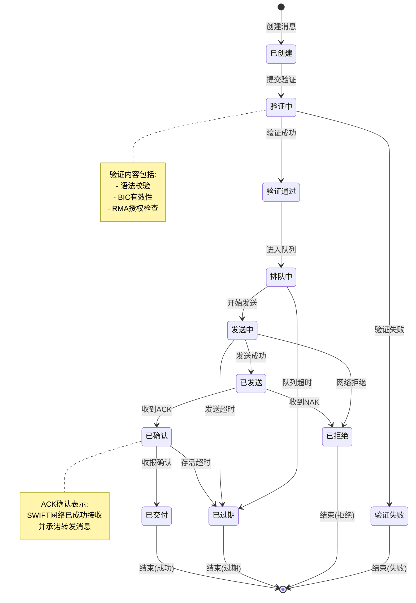
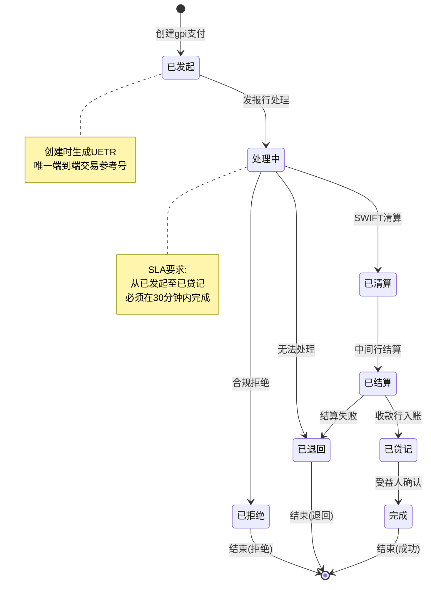
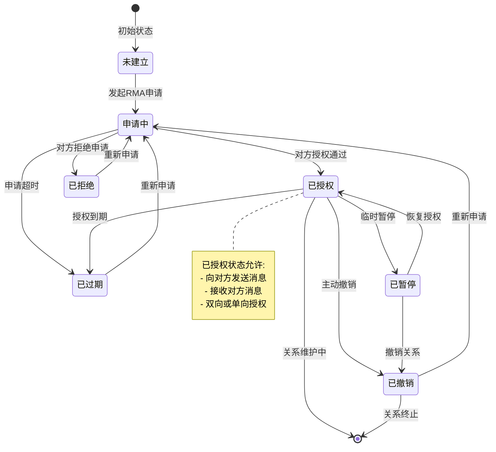
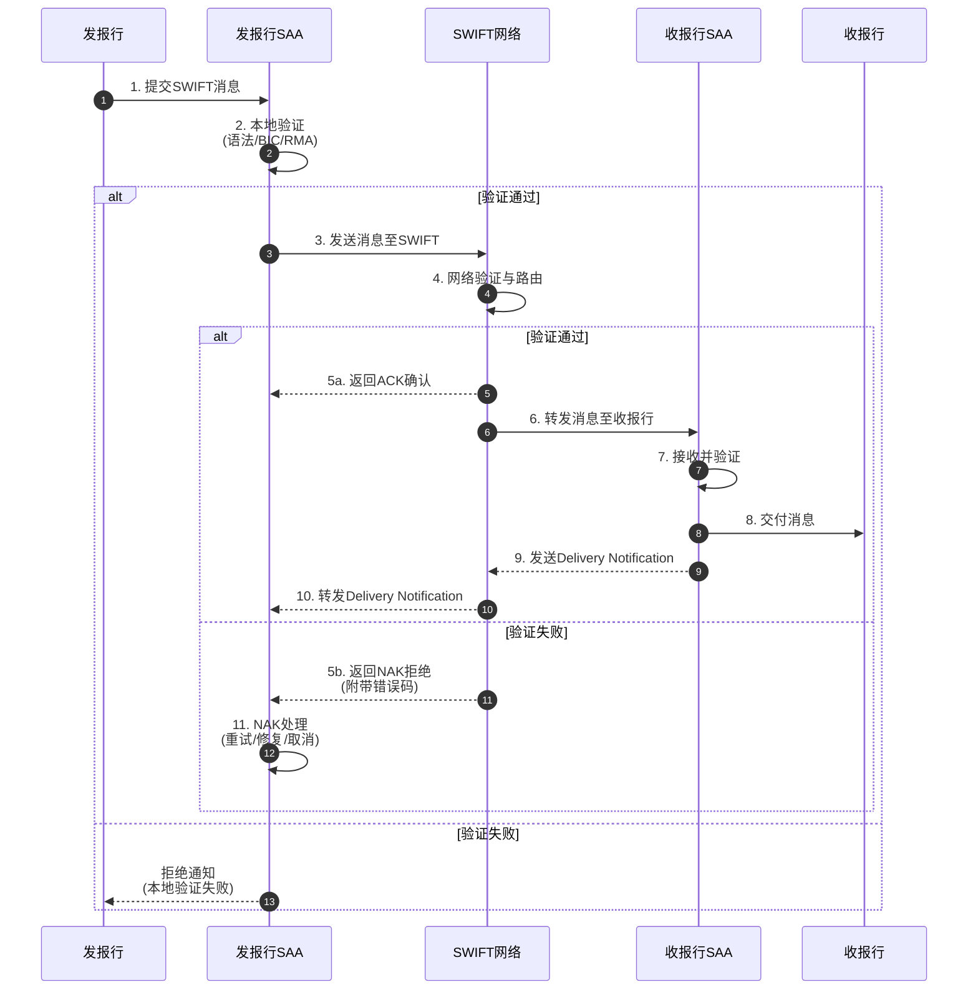
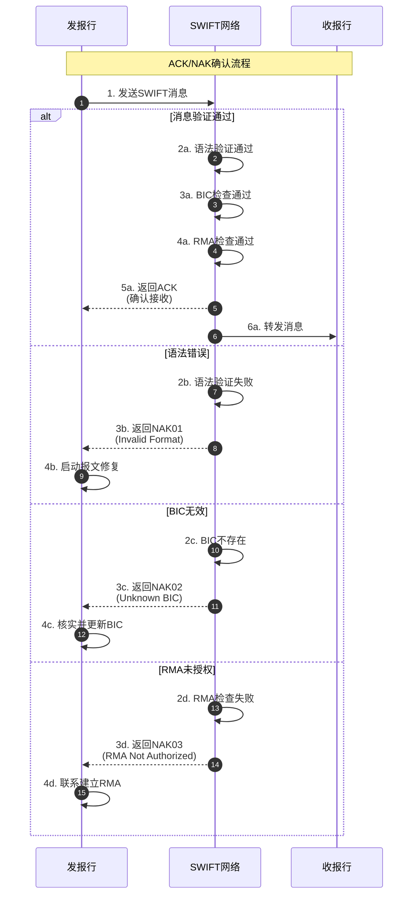
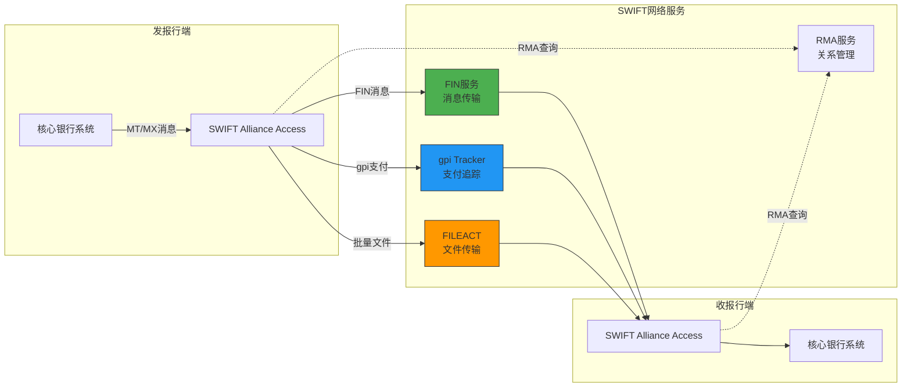
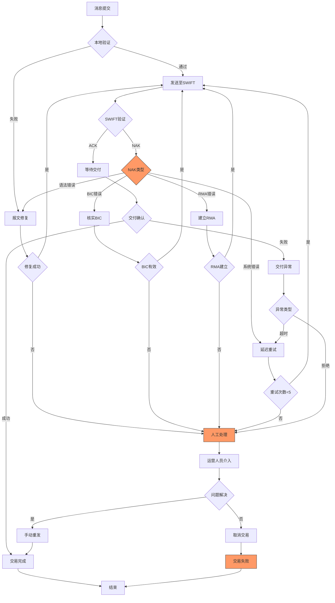

# SWIFT Schema动态动作分析视图

**版本**: v1.0
**创建日期**: 2026-02-15
**标准**: SWIFT MT/MX, SWIFT gpi, ISO 20022

---

## 📑 目录

- [SWIFT Schema动态动作分析视图](#swift-schema动态动作分析视图)
  - [📑 目录](#-目录)
  - [1. 动态动作分析概述](#1-动态动作分析概述)
  - [2. 状态机形式化](#2-状态机形式化)
    - [2.1 SWIFT消息生命周期状态机](#21-swift消息生命周期状态机)
    - [2.2 gpi支付追踪状态机](#22-gpi支付追踪状态机)
    - [2.3 RMA关系管理状态机](#23-rma关系管理状态机)
  - [3. 时序交互分析](#3-时序交互分析)
    - [3.1 SWIFT消息传输流程](#31-swift消息传输流程)
    - [3.2 SWIFT gpi端到端追踪流程](#32-swift-gpi端到端追踪流程)
    - [3.3 报文确认(ACK/NAK)流程](#33-报文确认acknak流程)
  - [4. 数据流分析](#4-数据流分析)
    - [4.1 FIN/GPI/FILE传输的数据流](#41-fingpifile传输的数据流)
    - [4.2 报文数据流动路径](#42-报文数据流动路径)
    - [4.3 信息熵变化分析](#43-信息熵变化分析)
  - [5. 实时性分析](#5-实时性分析)
    - [5.1 SWIFT网络SLA要求](#51-swift网络sla要求)
    - [5.2 gpi SLA (30分钟内确认)](#52-gpi-sla-30分钟内确认)
    - [5.3 延迟分析模型](#53-延迟分析模型)
    - [5.4 吞吐量计算](#54-吞吐量计算)
  - [6. 异常处理机制](#6-异常处理机制)
    - [6.1 NAK处理机制](#61-nak处理机制)
    - [6.2 报文修复机制](#62-报文修复机制)
    - [6.3 STP失败处理](#63-stp失败处理)
    - [6.4 异常处理决策矩阵](#64-异常处理决策矩阵)
  - [7. Mermaid动态视图](#7-mermaid动态视图)
    - [7.1 SWIFT消息生命周期状态机图](#71-swift消息生命周期状态机图)
    - [7.2 gpi支付追踪状态机图](#72-gpi支付追踪状态机图)
    - [7.3 RMA关系管理状态机图](#73-rma关系管理状态机图)
    - [7.4 SWIFT消息传输流程时序图](#74-swift消息传输流程时序图)
    - [7.5 SWIFT gpi端到端追踪流程时序图](#75-swift-gpi端到端追踪流程时序图)
    - [7.6 报文确认(ACK/NAK)流程时序图](#76-报文确认acknak流程时序图)
    - [7.7 FIN/GPI/FILE数据流图](#77-fingpifile数据流图)
    - [7.8 异常处理流程图](#78-异常处理流程图)

---

## 1. 动态动作分析概述

SWIFT网络动态动作分析关注金融消息在全球银行间通信网络中的运行时行为特征，包括：

- **状态转换**: SWIFT消息在生命周期中的状态迁移（创建→验证→排队→发送→确认→交付）
- **时序交互**: 发报行、SWIFT网络、收报行之间的消息传递顺序和因果关系
- **数据流动**: 消息数据在FIN、GPI、FILE服务中的传输路径
- **实时性能**: 满足SWIFT SLA和gpi SLA要求的延迟和吞吐量保障
- **异常恢复**: NAK处理、报文修复、STP失败恢复机制

---

## 2. 状态机形式化

### 2.1 SWIFT消息生命周期状态机

```
状态集合: S = {已创建, 验证中, 验证通过, 验证失败, 排队中, 发送中, 已发送, 已确认, 已交付, 已拒绝, 已过期}

状态转换流程:

1. 消息创建阶段
   已创建 → 验证中  (消息提交至本地接口)

2. 消息验证阶段
   验证中 → 验证通过  (语法校验通过、RMA检查通过、BIC有效)
   验证中 → 验证失败  (语法错误、BIC无效、RMA关系不存在)

3. 消息排队阶段
   验证通过 → 排队中  (进入发送队列等待)
   排队中 → 发送中    (轮到该消息发送)

4. 消息发送阶段
   发送中 → 已发送    (消息成功发送至SWIFT网络)
   发送中 → 已拒绝    (网络拒绝、会话中断)

5. 消息确认阶段
   已发送 → 已确认    (收到SWIFT ACK确认)
   已发送 → 已拒绝    (收到SWIFT NAK拒绝)

6. 消息交付阶段
   已确认 → 已交付    (收报行成功接收)
   已确认 → 已过期    (超过最大存活时间)

状态不变式:
∀消息: 状态(消息) ∈ S
∀消息: 已交付 → 曾经过已确认
∀消息: 已拒绝 → 未经过已交付
```

**消息生命周期状态转换矩阵:**

| 当前状态 | 提交验证 | 验证通过 | 验证失败 | 进入队列 | 发送成功 | 收到ACK | 收到NAK | 收报确认 | 超时过期 |
|---------|---------|---------|---------|---------|---------|---------|---------|---------|---------|
| **已创建** | 验证中 | - | - | - | - | - | - | - | - |
| **验证中** | - | 验证通过 | 验证失败 | - | - | - | - | - | - |
| **验证通过** | - | - | - | 排队中 | - | - | - | - | - |
| **验证失败** | - | - | - | - | - | - | - | - | - |
| **排队中** | - | - | - | - | 发送中 | - | - | - | 已过期 |
| **发送中** | - | - | - | - | - | 已确认 | 已拒绝 | - | 已过期 |
| **已确认** | - | - | - | - | - | - | - | 已交付 | 已过期 |
| **已交付** | - | - | - | - | - | - | - | - | - |
| **已拒绝** | - | - | - | - | - | - | - | - | - |
| **已过期** | - | - | - | - | - | - | - | - | - |

### 2.2 gpi支付追踪状态机

```
gpi支付状态集合: G = {已发起, 处理中, 已清算, 已结算, 已贷记, 已拒绝, 已退回, 追踪中, 完成}

gpi端到端追踪状态转换:

已发起 → 处理中      (发报行接受并处理)
处理中 → 已清算      (支付通过SWIFT网络清算)
已清算 → 已结算      (中间行完成结算)
已结算 → 已贷记      (收款行记入受益人账户)
已贷记 → 完成        (受益人确认收款)

异常路径:
处理中 → 已拒绝      (中间行拒绝处理)
处理中 → 已退回      (支付无法完成，退回发报行)
已清算 → 已退回      (结算失败，退回处理)

状态追踪规则:
- 每个状态变更必须生成gpi Tracker更新
- 状态变更时间戳精度要求: 毫秒级
- gpi Tracker必须在30分钟内更新状态
- 最终状态(完成/已拒绝/已退回)后不再变更
```

**gpi支付状态转换条件:**

| 转换 | 触发条件 | 执行动作 | SLA要求 |
|-----|---------|---------|---------|
| 已发起→处理中 | 报文解析成功 | 生成UETR，启动追踪 | < 1s |
| 处理中→已清算 | SWIFT网络确认 | 更新Tracker状态 | < 30s |
| 已清算→已结算 | 中间行确认 | 记录结算时间戳 | < 30min |
| 已结算→已贷记 | 收款行确认 | 更新贷记信息 | < 30min |
| 已贷记→完成 | 受益人确认 | 关闭追踪记录 | < 24h |
| 处理中→已拒绝 | 合规/风控拒绝 | 记录拒绝原因 | < 30min |
| 处理中→已退回 | 无法完成支付 | 启动退回流程 | < 2h |

### 2.3 RMA关系管理状态机

```
RMA (Relationship Management Application) 状态集合: R = {未建立, 申请中, 已授权, 已撤销, 已过期, 已拒绝, 已暂停}

RMA关系建立流程:

未建立 → 申请中      (B机构向A机构发起RMA申请)
申请中 → 已授权      (A机构授权B机构的访问)
申请中 → 已拒绝      (A机构拒绝B机构的申请)
已授权 → 已撤销      (A或B机构主动撤销关系)
已授权 → 已过期      (超过授权有效期)
已过期 → 申请中      (重新发起授权申请)
已授权 → 已暂停      (临时暂停关系)
已暂停 → 已授权      (恢复授权关系)

RMA授权类型:
- 双向授权: A→B 且 B→A (双方可互相收发消息)
- 单向授权: A→B 或 B→A (仅一方可向对方发消息)
- 无授权: 无法收发消息

状态不变式:
∀(A,B): RMA(A,B) = 已授权 ↔ BIC(A) 可发送消息至 BIC(B)
∀(A,B): RMA(A,B) ≠ 已授权 → 消息发送被拒绝
```

**RMA状态转换矩阵:**

| 当前状态 | 发起申请 | 授权通过 | 拒绝申请 | 主动撤销 | 超时过期 | 临时暂停 | 恢复授权 | 重新申请 |
|---------|---------|---------|---------|---------|---------|---------|---------|---------|
| **未建立** | 申请中 | - | - | - | - | - | - | - |
| **申请中** | - | 已授权 | 已拒绝 | - | 已过期 | - | - | - |
| **已授权** | - | - | - | 已撤销 | 已过期 | 已暂停 | - | - |
| **已撤销** | - | - | - | - | - | - | - | 申请中 |
| **已过期** | - | - | - | - | - | - | - | 申请中 |
| **已拒绝** | - | - | - | - | - | - | - | 申请中 |
| **已暂停** | - | - | - | 已撤销 | - | - | 已授权 | - |

---

## 3. 时序交互分析

### 3.1 SWIFT消息传输流程

```
参与方:
- 发报行 (Sending Bank)
- SWIFT网络接口 (SAA/SWIFT Alliance Access)
- SWIFT核心网络 (SWIFT Network)
- 收报行接口 (Receiving Bank Interface)
- 收报行 (Receiving Bank)

时序流程:

T0: 发报行创建SWIFT消息
T1 = T0 + Δt1: 本地验证（语法、BIC、RMA检查）
T2 = T1 + Δt2: 消息排队等待发送
T3 = T2 + Δt3: 消息发送至SWIFT网络
T4 = T3 + Δt4: SWIFT网络验证和路由
T5 = T4 + Δt5: SWIFT网络发送ACK/NAK
T6 = T5 + Δt6: 消息转发至收报行
T7 = T6 + Δt7: 收报行接收并验证
T8 = T7 + Δt8: 收报行发送 delivery confirmation
T9 = T8 + Δt9: SWIFT网络转发 delivery confirmation

总延迟: T_total = ΣΔti (i=1 to 9)
典型值: 500ms - 2s (取决于网络条件)
```

### 3.2 SWIFT gpi端到端追踪流程

```
gpi追踪参与方:
- 发报行 (Ordering Bank)
- 中间行1 (Intermediary Bank 1)
- 中间行2 (Intermediary Bank 2)
- 收款行 (Beneficiary Bank)
- gpi Tracker (中央追踪服务)
- 受益人 (Beneficiary)

gpi追踪时序:

阶段1: 支付发起
- 发报行创建gpi支付消息（携带UETR）
- 发报行向gpi Tracker注册支付
- Tracker记录初始状态: "已发起"

阶段2: 支付处理
- 中间行1接收并处理支付
- 中间行1更新Tracker状态: "处理中"
- 中间行1转发至中间行2
- 中间行2接收并更新Tracker: "已清算"

阶段3: 支付结算
- 收款行接收支付
- 收款行更新Tracker: "已结算"
- 收款行记入受益人账户
- 收款行更新Tracker: "已贷记"

阶段4: 支付完成
- 受益人确认收款
- gpi Tracker最终状态: "完成"
- 发送支付确认通知给发报行

端到端SLA要求:
- 从"已发起"到"已贷记": ≤ 30分钟
- Tracker状态更新延迟: ≤ 1秒
- 异常状态通知延迟: ≤ 30秒
```

### 3.3 报文确认(ACK/NAK)流程

```
ACK (Acknowledgment): 报文成功接收确认
NAK (Negative Acknowledgment): 报文接收拒绝

ACK/NAK流程时序:

发报行发送 → SWIFT网络接收 → SWIFT验证 → ACK/NAK返回

ACK场景:
1. 语法验证通过
2. BIC代码有效
3. RMA关系存在
4. 消息路由成功

NAK场景及错误码:
- NAK01: 语法错误（Invalid Message Format）
- NAK02: BIC不存在（Unknown BIC）
- NAK03: RMA未授权（RMA Not Authorized）
- NAK04: 会话限制（Session Limit Exceeded）
- NAK05: 网络拥塞（Network Congestion）
- NAK06: 系统故障（System Failure）

时序要求:
- ACK/NAK必须在消息接收后100ms内返回
- 超时未收到ACK视为NAK处理
- NAK必须附带明确的错误原因代码
```

---

## 4. 数据流分析

### 4.1 FIN/GPI/FILE传输的数据流

```
SWIFT服务数据流分类:

1. FIN (Financial Messages) 数据流
   ┌─────────────────────────────────────────────────────────┐
   │ FIN消息生命周期:                                         │
   │   发报行SAA → SWIFT网络FIN服务 → 收报行SAA              │
   │                                                         │
   │ 数据特征:                                               │
   │   - 消息格式: MT/MX报文                                 │
   │   - 实时传输: 点对点消息传递                            │
   │   - 确认机制: ACK/NAK + Delivery Notification           │
   │   - 优先级: 普通/紧急/特急                              │
   └─────────────────────────────────────────────────────────┘

2. gpi (Global Payments Innovation) 数据流
   ┌─────────────────────────────────────────────────────────┐
   │ gpi支付追踪数据流:                                       │
   │   参与行 → gpi Tracker API → Tracker Database           │
   │   参与行 ← Tracker 状态更新 ← Tracker Database          │
   │                                                         │
   │ 数据特征:                                               │
   │   - UETR (Unique End-to-end Transaction Reference)      │
   │   - ISO 20022格式 (pacs.008, pacs.009, camt.056)        │
   │   - 实时状态更新                                        │
   │   - 透明费用信息                                        │
   └─────────────────────────────────────────────────────────┘

3. FILEACT (File Transfer) 数据流
   ┌─────────────────────────────────────────────────────────┐
   │ 文件传输生命周期:                                        │
   │   发送方SAA → SWIFT网络FILE服务 → 接收方SAA             │
   │                                                         │
   │ 数据特征:                                               │
   │   - 批量数据传输                                        │
   │   - 文件完整性校验 (MD5/SHA256)                         │
   │   - 断点续传支持                                        │
   │   - 定时/触发传输                                       │
   └─────────────────────────────────────────────────────────┘
```

### 4.2 报文数据流动路径

```
MT103报文数据生命周期:

生成阶段:
┌─────────────────────────────────────────────────────────────┐
│ 应用层封装:                                                  │
│   Basic Header: 应用标识 + 服务标识 + 逻辑终端地址           │
│   Application Header: 消息类型(MT103) + 优先级 + 接收BIC     │
│   User Header: 用户参考 + 服务类型标识                       │
│   Text Block: 交易详情(20-59-71A字段)                        │
│   Trailer: MAC + PAC + CHK                                   │
└─────────────────────────────────────────────────────────────┘
                    │
                    ▼ (加密传输)
传输阶段:
┌─────────────────────────────────────────────────────────────┐
│ SWIFT网络层处理:                                             │
│   - PKI证书验证                                              │
│   - 消息路由决策                                             │
│   - RMA关系检查                                              │
│   - 反洗钱/制裁名单筛查                                      │
└─────────────────────────────────────────────────────────────┘
                    │
                    ▼ (解密处理)
接收阶段:
┌─────────────────────────────────────────────────────────────┐
│ 收报行解析层处理:                                            │
│   - 报文完整性校验 (CHK验证)                                 │
│   - 数字签名验证 (MAC验证)                                   │
│   - 业务数据提取                                             │
│   - 重复交易检测                                             │
│   - 路由至核心银行系统                                       │
└─────────────────────────────────────────────────────────────┘
```

### 4.3 信息熵变化分析

```
SWIFT消息在系统中的熵变:

原始交易数据:    H ≈ 256 bits (敏感金融信息)
     │
     │ SWIFT网络加密 (PKI)
     ▼
加密报文:        H ≈ 512 bits (高强度加密)
     │
     │ SWIFT网络路由
     ▼
路由决策数据:    H ≈ 32 bits (BIC + 消息类型)
     │
     │ 收报行解密
     ▼
业务数据:        H ≈ 128 bits (结构化报文字段)
     │
     │ 业务验证
     ▼
验证结果:        H ≈ 8 bits (通过/拒绝代码)
     │
     │ 核心银行处理
     ▼
账户更新:        H ≈ 64 bits (余额/交易记录)

信息保护机制:
1. 端到端加密: PKI证书体系
2. 消息完整性: MAC/CHK校验
3. 访问控制: RMA授权机制
4. 审计追踪: 完整操作日志
5. 数据脱敏: 敏感字段保护
```

---

## 5. 实时性分析

### 5.1 SWIFT网络SLA要求

```
SWIFT网络服务等级协议 (SLA) 指标:

服务类型        │ 消息传输时间  │ 可用性    │ 吞吐量        │ 错误率
────────────────┼─────────────┼──────────┼──────────────┼─────────
FIN普通消息     │ < 30s       │ 99.99%   │ 50M+ 消息/天  │ < 0.001%
FIN紧急消息     │ < 10s       │ 99.99%   │ 50M+ 消息/天  │ < 0.001%
FIN特急消息     │ < 5s        │ 99.99%   │ 50M+ 消息/天  │ < 0.001%
gpi支付         │ < 30min(端到端)│ 99.95%  │ 10M+ 支付/天  │ < 0.01%
FILEACT传输     │ < 1h        │ 99.9%    │ 10TB+/天      │ < 0.1%
API调用         │ < 1s        │ 99.9%    │ 1000+ TPS     │ < 0.1%

业务时段要求:
- 工作日 00:00-24:00 UTC: 全球24x7服务
- 维护窗口: 周日 02:00-06:00 UTC (部分服务受限)
- 高流量时段: 08:00-18:00 UTC (欧洲/美洲交易时段)
```

### 5.2 gpi SLA (30分钟内确认)

```
gpi服务等级协议详解:

核心SLA要求:
┌─────────────────────────────────────────────────────────────┐
│ 从发报行发送到收款行确认贷记: 必须在30分钟内完成              │
│                                                             │
│ 测量点:                                                     │
│   T1: 发报行发送gpi支付消息的时间戳                          │
│   T2: 收款行确认受益人账户贷记的时间戳                       │
│   SLA要求: T2 - T1 ≤ 30分钟                                 │
│                                                             │
│ 状态追踪要求:                                               │
│   - 每个中间状态变更必须在1秒内更新至gpi Tracker            │
│   - 参与行必须支持7x24小时处理                              │
│   - 费用信息必须透明披露                                    │
└─────────────────────────────────────────────────────────────┘

gpi SLA违规场景:
- 中间行延迟处理导致超时
- 收款行未及时确认贷记
- 系统故障导致状态更新延迟
- 合规审查导致支付滞留

违规处理:
- 自动记录SLA违规事件
- 通知发报行和收款行
- 启动根因分析
- 影响参与行gpi评级

性能指标:
- gpi支付30分钟内完成率: > 95%
- Tracker状态更新延迟: < 1秒 (99.9%)
- 费用透明度: 100%
- 端到端可追溯性: 100%
```

### 5.3 延迟分析模型

```
SWIFT消息处理延迟分解:

总延迟 = 本地处理延迟 + 网络传输延迟 + SWIFT处理延迟 + 收报处理延迟

本地处理延迟 (T_local):
- 报文生成: 5-20ms
- 语法验证: 10-30ms
- BIC/RMA检查: 5-15ms
- 本地排队: 1-50ms (取决于负载)
- 小计: 21-115ms

网络传输延迟 (T_network):
- 发报行到SWIFT: 20-100ms (取决于地理位置)
- SWIFT内部路由: 10-50ms
- SWIFT到收报行: 20-100ms
- 小计: 50-250ms

SWIFT处理延迟 (T_swift):
- 消息验证: 5-20ms
- 路由决策: 5-15ms
- 合规筛查: 20-100ms
- ACK/NAK生成: 5-10ms
- 小计: 35-145ms

收报处理延迟 (T_receive):
- 消息接收: 5-15ms
- 完整性校验: 10-25ms
- 业务路由: 5-15ms
- 小计: 20-55ms

端到端总延迟范围: 126-565ms (普通消息)
高优先级消息优化后: < 200ms
```

### 5.4 吞吐量计算

```
SWIFT网络容量规划:

峰值消息量计算:
Msgs_peak = (日峰值消息数 × 峰值系数) / (峰值持续秒数)

假设:
- 日峰值消息数: 50,000,000 条
- 峰值系数: 1.8 (峰值是平均的1.8倍)
- 峰值持续: 4小时 (14,400秒)

计算:
Msgs_avg = 50,000,000 / 86,400 ≈ 579 条/秒
Msgs_peak = (50,000,000 × 1.8) / 14,400 ≈ 6,250 条/秒

网络设计容量:
- 常规处理能力: 10,000 条/秒
- 峰值处理能力: 30,000 条/秒
- 消息队列容量: 5,000,000 条

gpi支付容量:
- gpi支付占比: ~20% 的总消息量
- gpi日处理能力: 10,000,000+ 笔
- gpi峰值TPS: 2,000+ 笔/秒

FILEACT文件传输:
- 日传输量: 10TB+
- 单文件最大: 100MB
- 并发传输: 1,000+ 文件
```

---

## 6. 异常处理机制

### 6.1 NAK处理机制

```
NAK (Negative Acknowledgment) 处理流程:

NAK错误分类:
┌─────────────────────────────────────────────────────────────┐
│ 语法错误类 (NAK01):                                          │
│   - 错误码: NAK01-INVALID_FORMAT                            │
│   - 处理: 本地修复后重新发送                                │
│   - 重试: 最多3次                                           │
│                                                             │
│ BIC错误类 (NAK02):                                          │
│   - 错误码: NAK02-UNKNOWN_BIC                               │
│   - 处理: 核实收报行BIC，更新后重发                         │
│   - 重试: 需人工确认后重试                                  │
│                                                             │
│ RMA错误类 (NAK03):                                          │
│   - 错误码: NAK03-RMA_NOT_AUTHORIZED                        │
│   - 处理: 联系收报行建立RMA关系                             │
│   - 重试: RMA建立后重发                                     │
│                                                             │
│ 系统错误类 (NAK04-06):                                      │
│   - 错误码: NAK04/05/06                                     │
│   - 处理: 延迟后自动重试                                    │
│   - 重试: 指数退避算法，最多5次                             │
└─────────────────────────────────────────────────────────────┘

NAK处理策略:
1. 自动重试: 系统错误类NAK自动重试
2. 人工介入: 语法/BIC/RMA错误需人工处理
3. 消息修复: 修改后重新发送
4. 取消发送: 无法修复时取消并通知业务

重试时间间隔:
- 第1次: 立即重试
- 第2次: 30秒后
- 第3次: 2分钟后
- 第4次: 10分钟后
- 第5次: 30分钟后
```

### 6.2 报文修复机制

```
SWIFT报文修复流程:

修复场景:
- 语法错误: 字段格式不符合规范
- 缺失字段: 必填字段未填写
- 无效内容: 字段内容不合法
- 校验失败: MAC/CHK验证失败

修复流程:
┌─────────────────────────────────────────────────────────────┐
│ 1. 错误识别                                                  │
│    - 解析NAK错误代码                                        │
│    - 定位错误字段位置                                       │
│    - 记录原始错误信息                                       │
│                                                             │
│ 2. 修复决策                                                  │
│    - 自动修复: 格式标准化、默认值填充                       │
│    - 人工修复: 业务信息错误需人工确认                       │
│    - 无法修复: 标记为失败，通知业务                         │
│                                                             │
│ 3. 修复执行                                                  │
│    - 应用修复规则                                           │
│    - 重新计算校验值                                         │
│    - 生成修复后报文                                         │
│                                                             │
│ 4. 重新验证                                                  │
│    - 本地语法验证                                           │
│    - 业务规则检查                                           │
│    - 重新提交发送                                           │
└─────────────────────────────────────────────────────────────┘

常见修复规则:
- 日期格式: 统一转换为YYMMDD格式
- 金额格式: 去除分隔符，保留小数点
- BIC补全: 8位BIC补充分支代码XXX
- 必填字段: 使用默认值或业务参考值
```

### 6.3 STP失败处理

```
STP (Straight Through Processing) 失败处理:

STP失败分类:
┌─────────────────────────────────────────────────────────────┐
│ 1. 数据质量失败                                              │
│    - 受益人信息不完整                                       │
│    - 账户号码格式错误                                       │
│    - 货币代码无效                                           │
│    处理: 返回发报行要求补充信息                             │
│                                                             │
│ 2. 合规审查失败                                              │
│    - 制裁名单匹配                                           │
│    - 反洗钱预警                                             │
│    - 汇率异常                                               │
│    处理: 转人工审查，暂停处理                               │
│                                                             │
│ 3. 技术失败                                                  │
│    - 系统连接中断                                           │
│    - 数据库故障                                             │
│    - 消息队列溢出                                           │
│    处理: 自动重试，失败转人工                               │
│                                                             │
│ 4. 业务规则失败                                              │
│    - 限额超限                                               │
│    - 重复交易                                               │
│    - 账户状态异常                                           │
│    处理: 根据规则自动处理或人工干预                         │
└─────────────────────────────────────────────────────────────┘

STP成功率目标:
- 境内支付: > 98%
- 跨境支付: > 95%
- gpi支付: > 97%

STP失败恢复流程:
1. 失败检测 (< 1秒)
2. 失败分类 (< 5秒)
3. 自动处理 (< 30秒)
4. 人工队列 (< 2小时处理)
5. 重新提交 (修复后自动重试)
```

### 6.4 异常处理决策矩阵

```
SWIFT异常场景分类与处理:

异常类型        │ 检测方式       │ 自动处理       │ 人工介入      │ 通知方式
────────────────┼───────────────┼───────────────┼──────────────┼──────────
网络超时        │ 连接超时      │ 重试3次        │ 超过3次       │ SWIFT告警
会话中断        │ 心跳检测      │ 自动重连       │ 重连失败      │ 系统告警
NAK接收         │ ACK/NAK监控   │ 按类型处理     │ 需修复NAK    │ 业务通知
报文损坏        │ 校验和验证    │ 请求重发       │ 多次损坏      │ 技术告警
gpi SLA违规     │ Tracker监控   │ 记录违规       │ 根因分析      │ 管理报告
RMA过期         │ 定时检查      │ 提醒通知       │ 重新授权      │ 邮件通知
制裁命中        │ 筛查系统      │ 暂停处理       │ 合规审查      │ 紧急通知
重复报文        │ 消息ID检查    │ 去重处理       │ 异常重复      │ 日志记录
系统故障        │ 健康检查      │ 切换备机       │ 故障恢复      │ 全员告警
```

---

## 7. Mermaid动态视图

### 7.1 SWIFT消息生命周期状态机图



### 7.2 gpi支付追踪状态机图



### 7.3 RMA关系管理状态机图



### 7.4 SWIFT消息传输流程时序图



### 7.5 SWIFT gpi端到端追踪流程时序图

```mermaid
sequenceDiagram
    autonumber
    participant OB as 发报行
    participant T as gpi Tracker
    participant IB1 as 中间行1
    participant IB2 as 中间行2
    participant BB as 收款行
    participant B as 受益人

    Note over OB,B: gpi支付端到端追踪

    OB->>OB: 1. 创建gpi支付消息<br/>(携带UETR)
    OB->>T: 2. 注册支付至Tracker
    T-->>OB: 3. 确认注册

    OB->>IB1: 4. 发送支付消息
    IB1->>T: 5. 更新状态: 处理中
    IB1->>IB2: 6. 转发支付

    IB2->>T: 7. 更新状态: 已清算
    IB2->>BB: 8. 转发支付

    BB->>T: 9. 更新状态: 已结算
    BB->>BB: 10. 记入受益人账户
    BB->>T: 11. 更新状态: 已贷记

    B->>BB: 12. 确认收款
    BB->>T: 13. 更新状态: 完成

    T-->>OB: 14. 推送最终状态通知

    Note right of T
        SLA要求:
        已发起 → 已贷记
        ≤ 30分钟
    end note
```

### 7.6 报文确认(ACK/NAK)流程时序图



### 7.7 FIN/GPI/FILE数据流图



### 7.8 异常处理流程图



---

**参考文档**:

- `01_Overview.md` - SWIFT Schema概述
- `02_Formal_Definition.md` - 形式化定义
- `03_Standards.md` - 标准对标
- `04_Transformation.md` - 模型转换
- `05_Case_Studies.md` - 案例研究
- SWIFT MT/MX标准规范
- SWIFT gpi服务指南
- ISO 20022报文标准

**维护者**: DSL Schema研究团队
