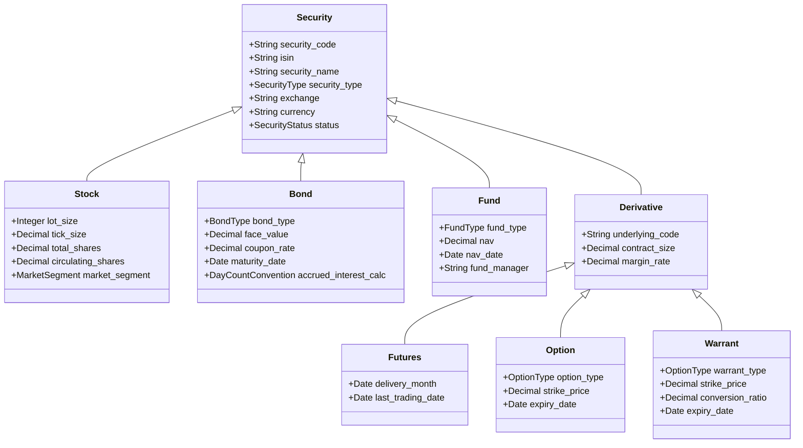
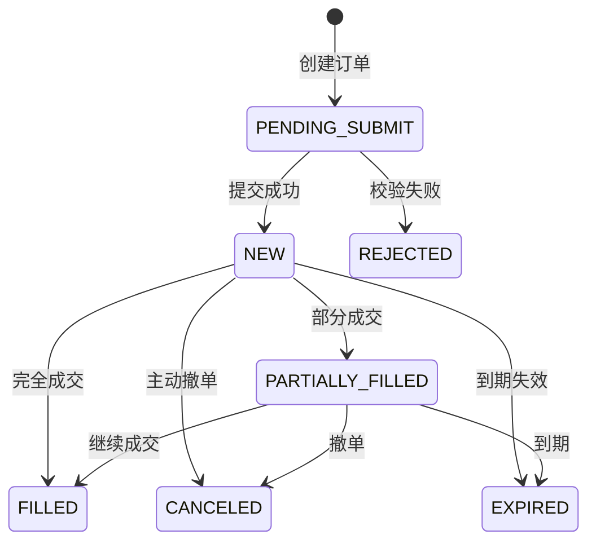
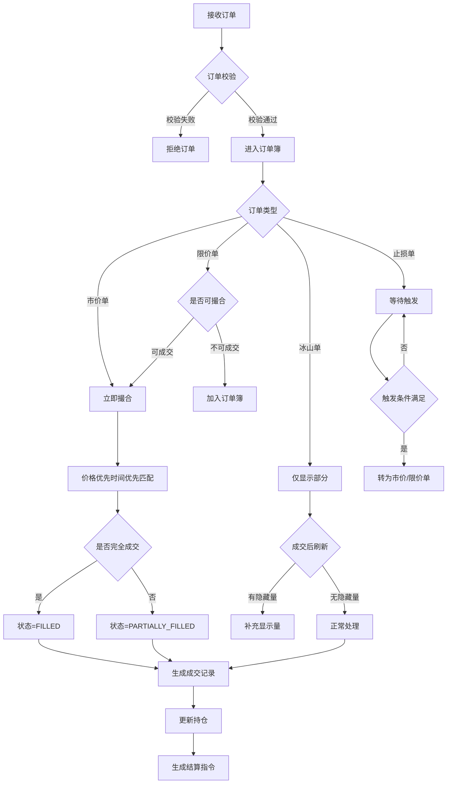
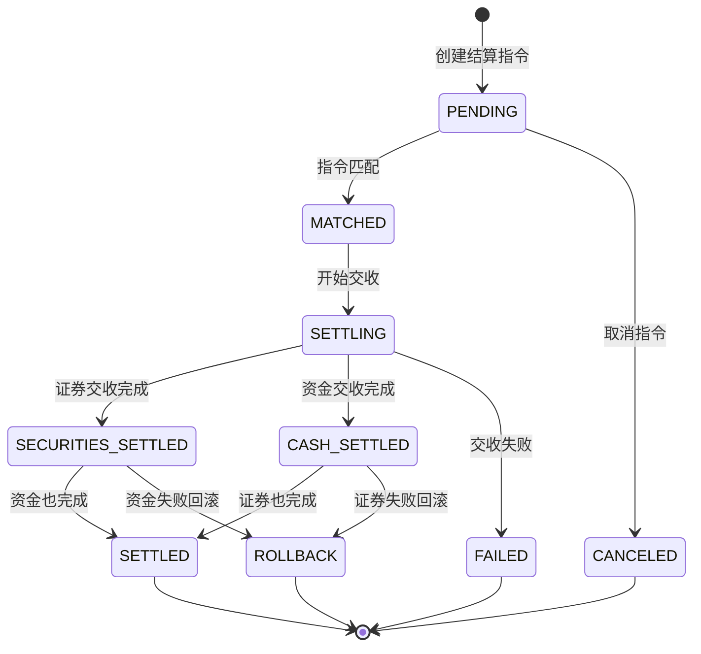
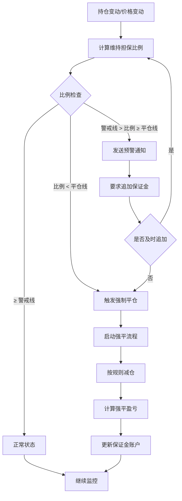

# 证券业务Schema形式语法与语义分析视图

**版本**: v1.0
**创建日期**: 2026-02-15
**标准**: ISO 15022, FIX 5.0 SP2, CSDR, SH/SZ Exchange Rules

---

## 📑 目录

- [证券业务Schema形式语法与语义分析视图](#证券业务schema形式语法与语义分析视图)
  - [📑 目录](#-目录)
  - [1. 形式文法定义](#1-形式文法定义)
    - [1.1 EBNF文法](#11-ebnf文法)
      - [1.1.1 证券实体文法](#111-证券实体文法)
      - [1.1.2 订单实体文法](#112-订单实体文法)
      - [1.1.3 交易实体文法](#113-交易实体文法)
      - [1.1.4 持仓实体文法](#114-持仓实体文法)
    - [1.2 语法规则](#12-语法规则)
      - [1.2.1 证券代码校验规则](#121-证券代码校验规则)
      - [1.2.2 订单约束规则](#122-订单约束规则)
      - [1.2.3 交易约束规则](#123-交易约束规则)
      - [1.2.4 持仓约束规则](#124-持仓约束规则)
      - [1.2.5 结算约束规则](#125-结算约束规则)
  - [2. 形式语义定义](#2-形式语义定义)
    - [2.1 指称语义 (Denotational Semantics)](#21-指称语义-denotational-semantics)
      - [2.1.1 语义域定义](#211-语义域定义)
      - [2.1.2 订单语义](#212-订单语义)
      - [2.1.3 交易语义](#213-交易语义)
      - [2.1.4 持仓语义](#214-持仓语义)
      - [2.1.5 保证金语义](#215-保证金语义)
    - [2.2 操作语义 (Operational Semantics)](#22-操作语义-operational-semantics)
      - [2.2.1 大步语义 (Big-Step Semantics)](#221-大步语义-big-step-semantics)
      - [2.2.2 订单匹配语义](#222-订单匹配语义)
      - [2.2.3 小步语义 (Small-Step Semantics)](#223-小步语义-small-step-semantics)
      - [2.2.4 清算交收状态机语义](#224-清算交收状态机语义)
    - [2.3 公理语义 (Axiomatic Semantics)](#23-公理语义-axiomatic-semantics)
      - [2.3.1 Hoare三元组](#231-hoare三元组)
      - [2.3.2 订单操作推理规则](#232-订单操作推理规则)
      - [2.3.3 持仓操作推理规则](#233-持仓操作推理规则)
      - [2.3.4 T+0/T+1交收公理](#234-t0t1交收公理)
      - [2.3.5 价格优先时间优先原则](#235-价格优先时间优先原则)
      - [2.3.6 订单数量不变式证明](#236-订单数量不变式证明)
      - [2.3.7 持仓数量不变式证明](#237-持仓数量不变式证明)
      - [2.3.8 DVP结算原子性证明](#238-dvp结算原子性证明)
  - [3. 类型系统](#3-类型系统)
    - [3.1 类型规则](#31-类型规则)
    - [3.2 类型运算规则](#32-类型运算规则)
    - [3.3 子类型关系](#33-子类型关系)
    - [3.4 类型约束规则](#34-类型约束规则)
  - [4. 语义等价性](#4-语义等价性)
    - [4.1 订单操作等价性](#41-订单操作等价性)
    - [4.2 持仓操作等价性](#42-持仓操作等价性)
    - [4.3 结算操作等价性](#43-结算操作等价性)
  - [5. Mermaid可视化](#5-mermaid可视化)
    - [5.1 证券类型层次图](#51-证券类型层次图)
    - [5.2 订单状态机](#52-订单状态机)
    - [5.3 撮合引擎流程](#53-撮合引擎流程)
    - [5.4 清算交收状态机](#54-清算交收状态机)
    - [5.5 保证金监控流程](#55-保证金监控流程)
  - [附录: 形式符号速查表](#附录-形式符号速查表)

---

## 1. 形式文法定义

### 1.1 EBNF文法

#### 1.1.1 证券实体文法

```ebnf
(* 证券核心实体 - 证券定义 *)

Security ::= Stock | Bond | Fund | Derivative

(* 股票定义 *)
Stock ::= '{'
    '"security_code"' ':' SecurityCode ','
    '"isin"' ':' ISIN ','
    '"security_name"' ':' String(200) ','
    '"security_type"' ':' '"STOCK"' ','
    '"exchange"' ':' ExchangeCode ','
    '"market_segment"' ':' MarketSegment ','
    '"currency"' ':' CurrencyCode ','
    '"lot_size"' ':' Integer ','
    '"tick_size"' ':' Decimal(10,4) ','
    '"price_limit_rule"' ':' PriceLimitRule ','
    '"listing_date"' ':' Date ','
    '"total_shares"' ':' Decimal(18,0) ','
    '"circulating_shares"' ':' Decimal(18,0) ','
    '"status"' ':' SecurityStatus
    ['"delisting_date"' ':' Date?]
    ['"suspension_flag"' ':' Boolean]
'}'

(* 债券定义 *)
Bond ::= '{'
    '"security_code"' ':' SecurityCode ','
    '"isin"' ':' ISIN ','
    '"security_name"' ':' String(200) ','
    '"security_type"' ':' '"BOND"' ','
    '"bond_type"' ':' BondType ','
    '"exchange"' ':' ExchangeCode ','
    '"currency"' ':' CurrencyCode ','
    '"face_value"' ':' Decimal(18,2) ','
    '"coupon_rate"' ':' Decimal(5,4) ','
    '"maturity_date"' ':' Date ','
    '"issue_date"' ':' Date ','
    '"accrued_interest_calc"' ':' DayCountConvention ','
    '"status"' ':' SecurityStatus
    ['"callable_flag"' ':' Boolean]
    ['"putable_flag"' ':' Boolean]
'}'

(* 基金定义 *)
Fund ::= '{'
    '"security_code"' ':' SecurityCode ','
    '"security_name"' ':' String(200) ','
    '"security_type"' ':' '"FUND"' ','
    '"fund_type"' ':' FundType ','
    '"exchange"' ':' ExchangeCode ','
    '"currency"' ':' CurrencyCode ','
    '"nav"' ':' Decimal(15,4) ','
    '"nav_date"' ':' Date ','
    '"fund_manager"' ':' String(100) ','
    '"management_fee_rate"' ':' Decimal(5,4) ','
    '"status"' ':' SecurityStatus
'}'

(* 衍生品定义 *)
Derivative ::= Futures | Option | Warrant

Futures ::= '{'
    '"security_code"' ':' SecurityCode ','
    '"security_name"' ':' String(200) ','
    '"security_type"' ':' '"FUTURES"' ','
    '"underlying_code"' ':' SecurityCode ','
    '"exchange"' ':' ExchangeCode ','
    '"currency"' ':' CurrencyCode ','
    '"contract_size"' ':' Decimal(15,0) ','
    '"tick_size"' ':' Decimal(10,4) ','
    '"margin_rate"' ':' Decimal(5,4) ','
    '"delivery_month"' ':' Date ','
    '"last_trading_date"' ':' Date ','
    '"status"' ':' SecurityStatus
'}'

Option ::= '{'
    '"security_code"' ':' SecurityCode ','
    '"security_name"' ':' String(200) ','
    '"security_type"' ':' '"OPTION"' ','
    '"option_type"' ':' OptionType ','
    '"underlying_code"' ':' SecurityCode ','
    '"strike_price"' ':' Decimal(15,4) ','
    '"exchange"' ':' ExchangeCode ','
    '"currency"' ':' CurrencyCode ','
    '"contract_size"' ':' Decimal(15,0) ','
    '"expiry_date"' ':' Date ','
    '"status"' ':' SecurityStatus
'}'

Warrant ::= '{'
    '"security_code"' ':' SecurityCode ','
    '"security_name"' ':' String(200) ','
    '"security_type"' ':' '"WARRANT"' ','
    '"warrant_type"' ':' OptionType ','
    '"underlying_code"' ':' SecurityCode ','
    '"strike_price"' ':' Decimal(15,4) ','
    '"exchange"' ':' ExchangeCode ','
    '"currency"' ':' CurrencyCode ','
    '"conversion_ratio"' ':' Decimal(10,4) ','
    '"expiry_date"' ':' Date ','
    '"status"' ':' SecurityStatus
'}'

(* 标识符格式 *)
SecurityCode ::= '[0-9]{6}' | '[A-Z]{1,5}'  (* 沪深代码或国际代码 *)
ISIN ::= '[A-Z]{2}[A-Z0-9]{9}[0-9]'       (* ISO 6166 *)
ExchangeCode ::= 'XSHG' | 'XSHE' | 'XBSE' | 'XHKG' | 'XNAS' | 'XNYS'
CurrencyCode ::= '[A-Z]{3}'                (* ISO 4217 *)

(* 枚举值 *)
MarketSegment ::= 'MAIN' | 'SME' | 'GEM' | 'STAR' | 'BSE' | 'N/A'
SecurityStatus ::= 'LISTED' | 'SUSPENDED' | 'DELISTED'
BondType ::= 'GOVERNMENT' | 'CORPORATE' | 'FINANCIAL' | 'CONVERTIBLE'
FundType ::= 'ETF' | 'LOF' | 'OPEN_END' | 'CLOSE_END' | 'REIT'
OptionType ::= 'CALL' | 'PUT'
DayCountConvention ::= 'ACT_360' | 'ACT_365' | '30_360' | 'ACT_ACT'
PriceLimitRule ::= '10_PERCENT' | '20_PERCENT' | 'NO_LIMIT' | 'IPO_LIMIT'
```

#### 1.1.2 订单实体文法

```ebnf
(* 订单定义 - 市价单、限价单、止损单、冰山单 *)

Order ::= MarketOrder | LimitOrder | StopOrder | StopLimitOrder | IcebergOrder

(* 基础订单属性 *)
BaseOrder ::= '{'
    '"order_id"' ':' OrderId ','
    '"client_order_id"' ':' ClientOrderId ','
    '"account_id"' ':' AccountId ','
    '"client_id"' ':' ClientId ','
    '"security_code"' ':' SecurityCode ','
    '"exchange"' ':' ExchangeCode ','
    '"side"' ':' Side ','
    '"order_quantity"' ':' Quantity ','
    '"filled_quantity"' ':' Quantity ','
    '"remaining_quantity"' ':' Quantity ','
    '"order_status"' ':' OrderStatus ','
    '"time_in_force"' ':' TimeInForce ','
    '"creation_time"' ':' Timestamp ','
    '"update_time"' ':' Timestamp
'}'

(* 市价单 *)
MarketOrder ::= BaseOrder ','
    '"order_type"' ':' '"MARKET"' ','
    '"price_type"' ':' MarketPriceType

(* 限价单 *)
LimitOrder ::= BaseOrder ','
    '"order_type"' ':' '"LIMIT"' ','
    '"limit_price"' ':' Price

(* 止损单 *)
StopOrder ::= BaseOrder ','
    '"order_type"' ':' '"STOP"' ','
    '"stop_price"' ':' Price ','
    '"trigger_condition"' ':' TriggerCondition

(* 止损限价单 *)
StopLimitOrder ::= BaseOrder ','
    '"order_type"' ':' '"STOP_LIMIT"' ','
    '"stop_price"' ':' Price ','
    '"limit_price"' ':' Price ','
    '"trigger_condition"' ':' TriggerCondition

(* 冰山单 *)
IcebergOrder ::= BaseOrder ','
    '"order_type"' ':' '"ICEBERG"' ','
    '"limit_price"' ':' Price ','
    '"display_quantity"' ':' Quantity ','
    '"hidden_quantity"' ':' Quantity ','
    '"refill_condition"' ':' RefillCondition

(* 订单类型变体 *)
IOC_Order ::= BaseOrder ',' '"order_type"' ':' '"IOC"'
FOK_Order ::= BaseOrder ',' '"order_type"' ':' '"FOK"'
GTC_Order ::= BaseOrder ',' '"order_type"' ':' '"GTC"'

(* 格式定义 *)
OrderId ::= '[A-Z0-9]{30}'
ClientOrderId ::= '[A-Z0-9]{30}'
AccountId ::= '[A-Z0-9]{30}'
ClientId ::= '[A-Z0-9]{20}'

(* 数值类型 *)
Price ::= '[0-9]{1,10}(\.[0-9]{1,4})?'
Quantity ::= '[0-9]{1,15}'
Timestamp ::= ISO8601DateTime

(* 枚举值 *)
Side ::= 'BUY' | 'SELL'
OrderStatus ::= 'NEW' | 'PARTIALLY_FILLED' | 'FILLED' | 'CANCELED' | 'REJECTED' | 'EXPIRED'
TimeInForce ::= 'DAY' | 'GTC' | 'IOC' | 'FOK' | 'GTD' | 'AT_OPEN' | 'AT_CLOSE'
MarketPriceType ::= 'BY_MARKET_BEST' | 'BY_LIMIT' | 'BY_MARKET_BEST_5' | 'BY_MARKET_IOC'
TriggerCondition ::= 'LAST_PRICE' | 'BID_PRICE' | 'ASK_PRICE'
RefillCondition ::= 'IMMEDIATE' | 'ON_FILL' | 'TIMED'
```

#### 1.1.3 交易实体文法

```ebnf
(* 交易定义 - 成交记录、清算、交收 *)

Trade ::= RegularTrade | BlockTrade | AuctionTrade

(* 成交记录 *)
RegularTrade ::= '{'
    '"trade_id"' ':' TradeId ','
    '"trade_date"' ':' Date ','
    '"trade_time"' ':' Time ','
    '"security_code"' ':' SecurityCode ','
    '"exchange"' ':' ExchangeCode ','
    '"buyer_order_id"' ':' OrderId ','
    '"seller_order_id"' ':' OrderId ','
    '"buyer_account_id"' ':' AccountId ','
    '"seller_account_id"' ':' AccountId ','
    '"trade_price"' ':' Price ','
    '"trade_quantity"' ':' Quantity ','
    '"trade_amount"' ':' Amount ','
    '"trade_type"' ':' TradeType ','
    '"sequence_number"' ':' Integer
'}'

(* 大宗交易 *)
BlockTrade ::= RegularTrade ','
    '"block_trade_id"' ':' BlockTradeId ','
    '"block_trade_type"' ':' BlockTradeType ','
    '"price_concession"' ':' Decimal(5,4)?

(* 集合竞价成交 *)
AuctionTrade ::= RegularTrade ','
    '"auction_type"' ':' AuctionType ','
    '"matching_price"' ':' Price ','
    '"matched_volume"' ':' Quantity

(* 清算记录 *)
Clearing ::= '{'
    '"clearing_id"' ':' ClearingId ','
    '"clearing_date"' ':' Date ','
    '"clearing_type"' ':' ClearingType ','
    '"participant_id"' ':' ParticipantId ','
    '"securities_receivable"' ':' List<SecurityPosition> ','
    '"securities_payable"' ':' List<SecurityPosition> ','
    '"cash_receivable"' ':' Amount ','
    '"cash_payable"' ':' Amount ','
    '"net_position"' ':' List<SecurityPosition> ','
    '"net_cash"' ':' Amount ','
    '"clearing_status"' ':' ClearingStatus
'}'

(* 交收指令 *)
SettlementInstruction ::= '{'
    '"instruction_id"' ':' InstructionId ','
    '"settlement_date"' ':' Date ','
    '"delivering_agent"' ':' ParticipantId ','
    '"receiving_agent"' ':' ParticipantId ','
    '"security_code"' ':' SecurityCode ','
    '"settlement_quantity"' ':' Quantity ','
    '"settlement_amount"' ':' Amount ','
    '"settlement_method"' ':' SettlementMethod ','
    '"trade_ids"' ':' List<TradeId> ','
    '"instruction_status"' ':' InstructionStatus
'}'

(* 交收结果 *)
Delivery ::= '{'
    '"delivery_id"' ':' DeliveryId ','
    '"instruction_id"' ':' InstructionId ','
    '"security_delivery_status"' ':' DeliveryStatus ','
    '"cash_delivery_status"' ':' PaymentStatus ','
    '"overall_status"' ':' OverallStatus ','
    '"dvp_flag"' ':' Boolean ','
    '"settlement_time"' ':' Timestamp?
'}'

(* 格式定义 *)
TradeId ::= '[A-Z0-9]{30}'
BlockTradeId ::= 'BLK[0-9]{20}'
ClearingId ::= 'CLR[0-9]{20}'
InstructionId ::= 'STL[0-9]{20}'
DeliveryId ::= 'DLY[0-9]{20}'
ParticipantId ::= '[A-Z0-9]{10}'
Amount ::= '[+-]?[0-9]{1,18}(\.[0-9]{2})?'

(* 枚举值 *)
TradeType ::= 'CONTINUOUS' | 'AUCTION' | 'BLOCK' | 'AFTER_HOURS'
BlockTradeType ::= 'PRICE_CONCESSION' | 'FIXED_PRICE' | 'CROSS'
AuctionType ::= 'OPEN' | 'CLOSE' | 'SUSPENSION'
ClearingType ::= 'GROSS' | 'NET_BY_SECURITY' | 'NET_BY_VALUE' | 'MULTILATERAL_NET'
ClearingStatus ::= 'PENDING' | 'COMPLETED' | 'FAILED'
SettlementMethod ::= 'DVP' | 'DVP_FREE' | 'FREE'
InstructionStatus ::= 'PENDING' | 'MATCHED' | 'SETTLED' | 'FAILED' | 'CANCELED'
DeliveryStatus ::= 'PENDING' | 'DELIVERED' | 'FAILED'
PaymentStatus ::= 'PENDING' | 'PAID' | 'FAILED'
OverallStatus ::= 'PENDING' | 'COMPLETED' | 'PARTIAL' | 'FAILED'
```

#### 1.1.4 持仓实体文法

```ebnf
(* 持仓定义 - 多头、空头、保证金计算 *)

Position ::= LongPosition | ShortPosition | MarginPosition

(* 证券持仓基础 *)
BasePosition ::= '{'
    '"position_id"' ':' PositionId ','
    '"account_id"' ':' AccountId ','
    '"security_code"' ':' SecurityCode ','
    '"total_quantity"' ':' Quantity ','
    '"available_quantity"' ':' Quantity ','
    '"frozen_quantity"' ':' Quantity ','
    '"pledged_quantity"' ':' Quantity ','
    '"cost_price"' ':' Price ','
    '"total_cost"' ':' Amount ','
    '"market_price"' ':' Price ','
    '"market_value"' ':' Amount ','
    '"last_update_time"' ':' Timestamp
'}'

(* 多头持仓 *)
LongPosition ::= BasePosition ','
    '"position_side"' ':' '"LONG"' ','
    '"realized_pnl"' ':' Amount ','
    '"unrealized_pnl"' ':' Amount ','
    '"total_pnl"' ':' Amount ','
    '"return_rate"' ':' Decimal(10,6)

(* 空头持仓 *)
ShortPosition ::= BasePosition ','
    '"position_side"' ':' '"SHORT"' ','
    '"short_sell_date"' ':' Date ','
    '"short_sell_price"' ':' Price ','
    '"realized_pnl"' ':' Amount ','
    '"unrealized_pnl"' ':' Amount ','
    '"short_fee_accrued"' ':' Amount ','
    '"cover_deadline"' ':' Date

(* 保证金持仓 *)
MarginPosition ::= '{'
    '"margin_account_id"' ':' AccountId ','
    '"account_id"' ':' AccountId ','
    '"margin_balance"' ':' Amount ','
    '"collateral_value"' ':' Amount ','
    '"debit_balance"' ':' Amount ','
    '"short_balance"' ':' Amount ','
    '"total_liabilities"' ':' Amount ','
    '"maintenance_ratio"' ':' Decimal(5,2) ','
    '"warning_line"' ':' Decimal(5,2) ','
    '"liquidation_line"' ':' Decimal(5,2) ','
    '"debit_quota"' ':' Amount ','
    '"short_quota"' ':' Amount ','
    '"available_debit_quota"' ':' Amount ','
    '"available_short_quota"' ':' Amount ','
    '"debit_interest_rate"' ':' Decimal(5,4) ','
    '"short_fee_rate"' ':' Decimal(5,4)
'}'

(* 资金持仓 *)
CashPosition ::= '{'
    '"account_id"' ':' AccountId ','
    '"currency"' ':' CurrencyCode ','
    '"balance"' ':' Amount ','
    '"available_balance"' ':' Amount ','
    '"frozen_balance"' ':' Amount ','
    '"withdrawable_balance"' ':' Amount ','
    '"unsettled_balance"' ':' Amount ','
    '"buying_power"' ':' Amount
'}'

(* 格式定义 *)
PositionId ::= 'POS[A-Z0-9]{20}'

(* 枚举值 *)
PositionSide ::= 'LONG' | 'SHORT'
```

### 1.2 语法规则

#### 1.2.1 证券代码校验规则

```
约束1: 证券代码格式有效性
  ∀sec ∈ Security :
    security_code(sec) ∈ [0-9]{6} ∧
    (exchange(sec) = XSHG ⇒ security_code(sec)[0] ∈ {6,5,0}) ∧
    (exchange(sec) = XSHE ⇒ security_code(sec)[0] ∈ {0,1,2,3})

约束2: ISIN校验
  ∀sec ∈ Security :
    isin(sec) ∈ [A-Z]{2}[A-Z0-9]{9}[0-9] ∧
    luhn_check(isin(sec)) = true

约束3: 证券状态一致性
  ∀sec ∈ Security :
    status(sec) = DELISTED ⇒ delisting_date(sec) ≠ ⊥ ∧ delisting_date(sec) ≤ current_date()

约束4: 股本有效性
  ∀stock ∈ Stock :
    circulating_shares(stock) ≤ total_shares(stock)
```

#### 1.2.2 订单约束规则

```
约束5: 订单数量有效性
  ∀order ∈ Order :
    order_quantity(order) > 0 ∧
    filled_quantity(order) ≥ 0 ∧
    remaining_quantity(order) ≥ 0 ∧
    canceled_quantity(order) ≥ 0 ∧
    order_quantity(order) = filled_quantity(order) + remaining_quantity(order) + canceled_quantity(order)

约束6: 限价单价格约束
  ∀order ∈ LimitOrder :
    limit_price(order) > 0 ∧
    (exchange(order) ∈ {XSHG, XSHE} ⇒ limit_price(order) ≤ price_ceiling ∧ limit_price(order) ≥ price_floor)

约束7: 止损单触发条件
  ∀order ∈ StopOrder ∪ StopLimitOrder :
    stop_price(order) > 0 ∧
    (side(order) = BUY ⇒ trigger_condition(order) = LAST_PRICE ∧ stop_price(order) > current_market_price) ∧
    (side(order) = SELL ⇒ trigger_condition(order) = LAST_PRICE ∧ stop_price(order) < current_market_price)

约束8: 冰山单数量约束
  ∀order ∈ IcebergOrder :
    display_quantity(order) > 0 ∧
    display_quantity(order) ≤ order_quantity(order) ∧
    hidden_quantity(order) = order_quantity(order) - display_quantity(order) ∧
    (filled_quantity(order) > 0 ⇒ refill_condition(order) = ON_FILL)

约束9: 订单状态一致性
  ∀order ∈ Order :
    (order_status(order) = FILLED ⇒ remaining_quantity(order) = 0) ∧
    (order_status(order) = CANCELED ⇒ canceled_quantity(order) > 0) ∧
    (order_status(order) = REJECTED ⇒ filled_quantity(order) = 0 ∧ canceled_quantity(order) = 0)
```

#### 1.2.3 交易约束规则

```
约束10: 成交价格有效性
  ∀trade ∈ Trade :
    trade_price(trade) > 0 ∧
    trade_quantity(trade) > 0 ∧
    trade_amount(trade) = trade_price(trade) × trade_quantity(trade)

约束11: 买卖订单匹配
  ∀trade ∈ RegularTrade :
    side(lookup_order(buyer_order_id(trade))) = BUY ∧
    side(lookup_order(seller_order_id(trade))) = SELL ∧
    security_code(lookup_order(buyer_order_id(trade))) = security_code(trade) ∧
    security_code(lookup_order(seller_order_id(trade))) = security_code(trade)

约束12: 时间戳一致性
  ∀trade ∈ Trade :
    trade_time(trade) ≤ current_time() ∧
    trade_date(trade) ≤ current_date()
```

#### 1.2.4 持仓约束规则

```
约束13: 持仓数量平衡
  ∀pos ∈ Position :
    total_quantity(pos) = available_quantity(pos) + frozen_quantity(pos) + pledged_quantity(pos) ∧
    total_quantity(pos) ≥ 0 ∧ available_quantity(pos) ≥ 0 ∧ frozen_quantity(pos) ≥ 0 ∧ pledged_quantity(pos) ≥ 0

约束14: 多头持仓盈亏计算
  ∀pos ∈ LongPosition :
    market_value(pos) = total_quantity(pos) × market_price(pos) ∧
    unrealized_pnl(pos) = (market_price(pos) - cost_price(pos)) × total_quantity(pos) ∧
    total_pnl(pos) = realized_pnl(pos) + unrealized_pnl(pos) ∧
    (cost_price(pos) > 0 ⇒ return_rate(pos) = (market_price(pos) - cost_price(pos)) / cost_price(pos))

约束15: 保证金充足性
  ∀margin ∈ MarginPosition :
    maintenance_ratio(margin) ≥ liquidation_line(margin) ∧
    available_debit_quota(margin) ≥ 0 ∧ available_short_quota(margin) ≥ 0 ∧
    total_liabilities(margin) = debit_balance(margin) + short_balance(margin)

约束16: 保证金计算
  ∀margin ∈ MarginPosition :
    maintenance_ratio(margin) = (margin_balance(margin) + collateral_value(margin)) / total_liabilities(margin) × 100%
```

#### 1.2.5 结算约束规则

```
约束17: DVP结算原子性
  ∀settlement ∈ SettlementInstruction :
    settlement_method(settlement) = DVP ⇒
      (instruction_status(settlement) = SETTLED ⇒
        security_delivery_completed(settlement) ∧ cash_delivery_completed(settlement))

约束18: 清算净额计算
  ∀clearing ∈ Clearing :
    net_cash(clearing) = cash_receivable(clearing) - cash_payable(clearing) ∧
    ∀sec ∈ securities(clearing) : net_position(clearing, sec) = receivable(sec) - payable(sec)

约束19: 结算日期规则
  ∀settlement ∈ SettlementInstruction :
    (settlement_type = T0 ⇒ settlement_date(settlement) = trade_date) ∧
    (settlement_type = T1 ⇒ settlement_date(settlement) = next_business_day(trade_date))
```

---

## 2. 形式语义定义

### 2.1 指称语义 (Denotational Semantics)

#### 2.1.1 语义域定义

```
D[SecuritiesSystem] : Environment → State → State

State = OrderState × PositionState × TradeState × MarketState × SettlementState × MarginState

OrderState = OrderId → OrderValue
OrderValue = {
  account_id: AccountId,
  security_code: SecurityCode,
  side: Side,
  order_type: OrderType,
  order_quantity: Quantity,
  filled_quantity: Quantity,
  remaining_quantity: Quantity,
  limit_price: Price?,
  stop_price: Price?,
  order_status: OrderStatus,
  time_in_force: TimeInForce,
  creation_time: Timestamp,
  ...
}

PositionState = PositionId → PositionValue
PositionValue = {
  account_id: AccountId,
  security_code: SecurityCode,
  position_side: PositionSide,
  total_quantity: Quantity,
  available_quantity: Quantity,
  cost_price: Price,
  market_price: Price,
  market_value: Amount,
  unrealized_pnl: Amount,
  ...
}

TradeState = TradeId → TradeValue
TradeValue = {
  trade_date: Date,
  trade_time: Time,
  security_code: SecurityCode,
  buyer_order_id: OrderId,
  seller_order_id: OrderId,
  trade_price: Price,
  trade_quantity: Quantity,
  trade_amount: Amount,
  ...
}

MarketState = SecurityCode → MarketData
MarketData = {
  last_price: Price,
  bid_prices: List<Price>,
  ask_prices: List<Price>,
  bid_volumes: List<Quantity>,
  ask_volumes: List<Quantity>,
  timestamp: Timestamp,
  ...
}

SettlementState = InstructionId → SettlementValue
SettlementValue = {
  settlement_date: Date,
  settlement_quantity: Quantity,
  settlement_amount: Amount,
  settlement_method: SettlementMethod,
  instruction_status: InstructionStatus,
  ...
}

MarginState = AccountId → MarginValue
MarginValue = {
  margin_balance: Amount,
  collateral_value: Amount,
  debit_balance: Amount,
  short_balance: Amount,
  maintenance_ratio: Decimal(5,2),
  ...
}

Price = Decimal(15,4)
Quantity = Decimal(15,0)
Amount = Decimal(18,2)
Timestamp = ℕ  (* Unix时间戳 *)
```

#### 2.1.2 订单语义

```
(* 订单价值计算 *)
E[order.order_value] env sto =
  let ord = lookup_order(sto, env.order_id) in
  case order_type(ord) of
    LIMIT → limit_price(ord) × order_quantity(ord)
    MARKET → estimated_market_value(ord)  (* 基于当前市价 *)
    STOP → stop_price(ord) × order_quantity(ord)
    _ → ⊥

(* 订单状态转换 *)
S[order.status := new_status] env sto =
  let ord = lookup_order(sto, env.order_id) in
  if valid_order_transition(ord.status, new_status)
  then sto[order ↦ ord[status ↦ new_status]]
  else error "Invalid order state transition"

(* 订单成交处理 *)
S[fill_order(order, fill_qty, fill_price)] env sto =
  let ord = lookup_order(sto, env.order_id) in
  if fill_qty ≤ remaining_quantity(ord)
  then let new_filled = filled_quantity(ord) + fill_qty in
       let new_remaining = remaining_quantity(ord) - fill_qty in
       let new_status = if new_remaining = 0 then FILLED else PARTIALLY_FILLED in
       sto[order ↦ ord[
         filled_quantity ↦ new_filled,
         remaining_quantity ↦ new_remaining,
         status ↦ new_status,
         last_fill_price ↦ fill_price
       ]]
  else error "Fill quantity exceeds remaining quantity"

(* 冰山单刷新语义 *)
S[refresh_iceberg(order)] env sto =
  let ord = lookup_order(sto, env.order_id) in
  if order_type(ord) = ICEBERG ∧ filled_quantity(ord) > 0
  then let new_display = min(display_quantity(ord), remaining_quantity(ord)) in
       sto[order ↦ ord[display_quantity ↦ new_display]]
  else sto
```

#### 2.1.3 交易语义

```
(* 成交价格语义 *)
E[trade.trade_price] env sto =
  let trd = lookup_trade(sto, env.trade_id) in
  trade_price(trd)

(* 成交创建语义 *)
S[create_trade(buy_order, sell_order, price, quantity)] env sto =
  let buy_ord = lookup_order(sto, buy_order) in
  let sell_ord = lookup_order(sto, sell_order) in
  if side(buy_ord) = BUY ∧ side(sell_ord) = SELL ∧
     security_code(buy_ord) = security_code(sell_ord) ∧
     price > 0 ∧ quantity > 0
  then let trade_id = generate_trade_id() in
       let trade_record = {
         trade_id = trade_id,
         trade_price = price,
         trade_quantity = quantity,
         trade_amount = price × quantity,
         buyer_order_id = buy_order,
         seller_order_id = sell_order,
         ...
       } in
       let sto' = S[fill_order(buy_order, quantity, price)] env sto in
       let sto'' = S[fill_order(sell_order, quantity, price)] env sto' in
       sto''[trade ↦ trade_record]
  else error "Invalid trade parameters"

(* 交易金额计算 *)
E[trade.trade_amount] env sto =
  let trd = lookup_trade(sto, env.trade_id) in
  trade_price(trd) × trade_quantity(trd)
```

#### 2.1.4 持仓语义

```
(* 持仓市值语义 *)
E[position.market_value] env sto =
  let pos = lookup_position(sto, env.position_id) in
  total_quantity(pos) × market_price(pos)

(* 浮动盈亏语义 *)
E[position.unrealized_pnl] env sto =
  let pos = lookup_position(sto, env.position_id) in
  (market_price(pos) - cost_price(pos)) × total_quantity(pos)

(* 持仓更新语义 - 买入 *)
S[add_position(position, quantity, price)] env sto =
  let pos = lookup_position(sto, env.position_id) in
  let new_total = total_quantity(pos) + quantity in
  let new_cost = (total_cost(pos) + quantity × price) / new_total in
  sto[position ↦ pos[
    total_quantity ↦ new_total,
    available_quantity ↦ available_quantity(pos) + quantity,
    cost_price ↦ new_cost,
    total_cost ↦ total_cost(pos) + quantity × price
  ]]

(* 持仓更新语义 - 卖出 *)
S[reduce_position(position, quantity, price)] env sto =
  let pos = lookup_position(sto, env.position_id) in
  if available_quantity(pos) ≥ quantity
  then let realized = (price - cost_price(pos)) × quantity in
       sto[position ↦ pos[
         total_quantity ↦ total_quantity(pos) - quantity,
         available_quantity ↦ available_quantity(pos) - quantity,
         realized_pnl ↦ realized_pnl(pos) + realized
       ]]
  else error "Insufficient available position"

(* 冻结持仓语义 *)
S[freeze_position(position, quantity)] env sto =
  let pos = lookup_position(sto, env.position_id) in
  if available_quantity(pos) ≥ quantity
  then sto[position ↦ pos[
    available_quantity ↦ available_quantity(pos) - quantity,
    frozen_quantity ↦ frozen_quantity(pos) + quantity
  ]]
  else error "Insufficient available position to freeze"
```

#### 2.1.5 保证金语义

```
(* 维持担保比例语义 *)
E[margin.maintenance_ratio] env sto =
  let mgn = lookup_margin(sto, env.account_id) in
  (margin_balance(mgn) + collateral_value(mgn)) / total_liabilities(mgn) × 100%

(* 融资买入语义 *)
S[debit_buy(account, amount)] env sto =
  let mgn = lookup_margin(sto, env.account_id) in
  let new_debit = debit_balance(mgn) + amount in
  let new_ratio = (margin_balance(mgn) + collateral_value(mgn)) / (new_debit + short_balance(mgn)) × 100% in
  if new_ratio ≥ warning_line(mgn)
  then sto[margin ↦ mgn[
    debit_balance ↦ new_debit,
    available_debit_quota ↦ debit_quota(mgn) - new_debit,
    maintenance_ratio ↦ new_ratio
  ]]
  else error "Insufficient margin ratio for debit buy"

(* 保证金追缴检查 *)
E[margin.call_required] env sto =
  let mgn = lookup_margin(sto, env.account_id) in
  maintenance_ratio(mgn) < warning_line(mgn)
```

### 2.2 操作语义 (Operational Semantics)

#### 2.2.1 大步语义 (Big-Step Semantics)

```
配置: ⟨Expression, State⟩ ⇓ Value
      ⟨Statement, State⟩ ⇓ State'

(* 订单查询 *)
⟨order.status, σ⟩ ⇓ σ(order).status                          (E-OrderStatus)

(* 剩余数量计算 *)
⟨order.remaining_qty, σ⟩ ⇓ σ(order).order_qty - σ(order).filled_qty  (E-RemainingQty)

(* 订单提交 *)
⟨submit(order), σ⟩ ⇓ σ[order.status ↦ NEW]                   (S-Submit)
  where validate_order(order, σ)

(* 订单成交 *)
⟨fill(order, qty, price), σ⟩ ⇓ σ'                            (S-Fill)
────────────────────────────────────────────────────────────
σ(order).remaining_qty ≥ qty ∧ qty > 0
σ' = σ[order.filled_qty ↦ σ(order).filled_qty + qty]
     [order.remaining_qty ↦ σ(order).remaining_qty - qty]
     [order.last_fill_price ↦ price]

(* 订单完全成交 *)
⟨fill(order, qty, price), σ⟩ ⇓ σ'                            (S-FillComplete)
────────────────────────────────────────────────────────────
σ(order).remaining_qty = qty ∧ qty > 0
σ' = σ[order.filled_qty ↦ σ(order).order_qty]
     [order.remaining_qty ↦ 0]
     [order.status ↦ FILLED]

(* 撤单操作 *)
⟨cancel(order), σ⟩ ⇓ σ[order.status ↦ CANCELED]              (S-Cancel)
  where σ(order).status ∈ {NEW, PARTIALLY_FILLED}

(* 持仓买入更新 *)
⟨add_position(pos, qty, price), σ⟩ ⇓ σ'                      (S-AddPosition)
────────────────────────────────────────────────────────────
new_qty = σ(pos).total_qty + qty
new_cost = (σ(pos).total_cost + qty × price) / new_qty
σ' = σ[pos.total_qty ↦ new_qty]
     [pos.available_qty ↦ σ(pos).available_qty + qty]
     [pos.cost_price ↦ new_cost]

(* 持仓卖出更新 *)
⟨reduce_position(pos, qty, price), σ⟩ ⇓ σ'                   (S-ReducePosition)
────────────────────────────────────────────────────────────
σ(pos).available_qty ≥ qty ∧ qty > 0
realized = (price - σ(pos).cost_price) × qty
σ' = σ[pos.total_qty ↦ σ(pos).total_qty - qty]
     [pos.available_qty ↦ σ(pos).available_qty - qty]
     [pos.realized_pnl ↦ σ(pos).realized_pnl + realized]
```

#### 2.2.2 订单匹配语义

```
(* 价格优先时间优先撮合规则 *)

⟨match_orders(order_book), σ⟩ ⇓ σ'                           (S-Match)
────────────────────────────────────────────────────────────
∃ buy ∈ σ.order_book.bids, sell ∈ σ.order_book.asks :
  buy.price ≥ sell.price ∧
  match_qty = min(buy.remaining_qty, sell.remaining_qty) ∧
  match_price = determine_match_price(buy, sell) ∧
  σ' = execute_match(buy, sell, match_qty, match_price, σ)

(* 撮合价格确定 *)
determine_match_price(buy, sell) =
  if buy.timestamp ≤ sell.timestamp
  then buy.price
  else sell.price

(* 市价单撮合 *)
⟨match_market_order(market_order, order_book), σ⟩ ⇓ σ'       (S-MatchMarket)
────────────────────────────────────────────────────────────
market_order.order_type = MARKET ∧
matching_orders = select_matching_orders(market_order, σ.order_book) ∧
iterate_fill(market_order, matching_orders, σ) ⇓ σ'

(* 限价单撮合 *)
⟨match_limit_order(limit_order, order_book), σ⟩ ⇓ σ'         (S-MatchLimit)
────────────────────────────────────────────────────────────
limit_order.order_type = LIMIT ∧
(limit_order.side = BUY ⇒ limit_order.price ≥ best_ask(σ.order_book)) ∧
(limit_order.side = SELL ⇒ limit_order.price ≤ best_bid(σ.order_book)) ∧
iterate_fill(limit_order, matching_orders, σ) ⇓ σ'
```

#### 2.2.3 小步语义 (Small-Step Semantics)

```
配置: ⟨Statement, State⟩ → ⟨Statement', State'⟩
      或 ⟨Statement, State⟩ → State'  (终止)

(* 订单状态转换步骤 *)
⟨order.status := NEW, σ⟩ → σ[order.status ↦ NEW]             (S-SetNew)

⟨order.status := PARTIALLY_FILLED, σ⟩ → σ[order.status ↦ PARTIALLY_FILLED]  (S-SetPartial)
  where σ(order).filled_qty > 0 ∧ σ(order).remaining_qty > 0

⟨order.status := FILLED, σ⟩ → σ[order.status ↦ FILLED]       (S-SetFilled)
  where σ(order).remaining_qty = 0

⟨order.status := CANCELED, σ⟩ → σ[order.status ↦ CANCELED]   (S-SetCanceled)
  where σ(order).status ∈ {NEW, PARTIALLY_FILLED}

(* 订单处理步骤 *)
⟨process_order(order), σ⟩ → ⟨validate(order) ; match(order) ; post_process(order), σ⟩  (S-ProcessStart)

⟨validate(order), σ⟩ → σ                                      (S-ValidateOk)
  where valid_account(order, σ) ∧ valid_security(order, σ) ∧ valid_quantity(order)

⟨validate(order), σ⟩ → error                                  (S-ValidateFail)
  where ¬valid_account(order, σ) ∨ ¬valid_security(order, σ) ∨ ¬valid_quantity(order)

(* 顺序执行 *)
⟨skip ; s, σ⟩ → ⟨s, σ⟩                                        (S-Seq-Skip)

⟨s1 ; s2, σ⟩ → ⟨s1' ; s2, σ'⟩                                 (S-Seq-Step)
  when ⟨s1, σ⟩ → ⟨s1', σ'⟩

⟨s1 ; s2, σ⟩ → ⟨s2, σ'⟩                                       (S-Seq-Done)
  when ⟨s1, σ⟩ → σ'

(* 条件执行 - 止损触发 *)
⟨IF check_stop_trigger(order, price) THEN execute_stop(order) ELSE wait, σ⟩ → ⟨execute_stop(order), σ⟩  (S-StopTriggered)
  when (order.side = SELL ∧ price ≤ order.stop_price) ∨
       (order.side = BUY ∧ price ≥ order.stop_price)

⟨IF check_stop_trigger(order, price) THEN execute_stop(order) ELSE wait, σ⟩ → ⟨wait, σ⟩  (S-StopNotTriggered)
  otherwise
```

#### 2.2.4 清算交收状态机语义

```
(* 结算状态转移规则 *)

⟨settlement.status, σ⟩ → ⟨PENDING, σ⟩                          (Sett-Init)

⟨submit_settlement(instr), σ⟩ → ⟨MATCHED, σ[instr.submitted_at ↦ now()]⟩  (Sett-Submit)
  when matching_instructions_found(instr, σ)

⟨match(instr), σ⟩ → ⟨MATCHED, σ⟩                              (Sett-Match)
  when instruction_valid(instr, σ) ∧ counterparty_found(instr, σ)

⟨settle_securities(instr), σ⟩ → ⟨SETTLED_SECURITIES, σ'⟩      (Sett-SettleSec)
  where σ' = transfer_securities(instr, σ)

⟨settle_cash(instr), σ⟩ → ⟨SETTLED_CASH, σ'⟩                  (Sett-SettleCash)
  where σ' = transfer_cash(instr, σ)

⟨complete_settlement(instr), σ⟩ → ⟨SETTLED, σ⟩                (Sett-Complete)
  when settlement.securities_status = SETTLED_SECURITIES ∧
       settlement.cash_status = SETTLED_CASH

⟨fail_settlement(instr, reason), σ⟩ → ⟨FAILED, σ[instr.fail_reason ↦ reason]⟩  (Sett-Fail)
  when settlement_failed(instr, σ, reason)

(* DVP原子性规则 *)
⟨dvp_settle(instr), σ⟩ ⇓ σ''                                  (S-DVP)
────────────────────────────────────────────────────────────
⟨settle_securities(instr), σ⟩ ⇓ σ'
⟨settle_cash(instr), σ'⟩ ⇓ σ''
σ''(instr).securities_status = SETTLED_SECURITIES ∧
σ''(instr).cash_status = SETTLED_CASH
```

### 2.3 公理语义 (Axiomatic Semantics)

#### 2.3.1 Hoare三元组

```
{P} S {Q}

含义: 如果前置条件P在执行语句S前成立，
      且S终止，
      则后置条件Q在S执行后成立。
```

#### 2.3.2 订单操作推理规则

```
(* 订单数量不变式 *)
{order.filled_qty = F ∧ order.remaining_qty = R ∧ order.canceled_qty = C ∧ F + R + C = Q}
  any_readonly_operation(order)
{order.filled_qty = F ∧ order.remaining_qty = R ∧ order.canceled_qty = C ∧ F + R + C = Q}

(* 订单成交公理 *)
{order.filled_qty = F ∧ order.remaining_qty = R ∧ R ≥ qty ∧ qty > 0}
  fill(order, qty, price)
{order.filled_qty = F + qty ∧ order.remaining_qty = R - qty}
  (Axiom-Fill)

(* 订单完全成交公理 *)
{order.filled_qty = F ∧ order.remaining_qty = R ∧ R = qty ∧ qty > 0}
  fill(order, qty, price)
{order.filled_qty = F + qty ∧ order.remaining_qty = 0 ∧ order.status = FILLED}
  (Axiom-FillComplete)

(* 撤单公理 *)
{order.status = S ∧ S ∈ {NEW, PARTIALLY_FILLED} ∧ order.remaining_qty = R}
  cancel(order)
{order.status = CANCELED ∧ order.canceled_qty = R ∧ order.remaining_qty = 0}
  (Axiom-Cancel)

(* 订单状态转换公理 *)
{order.status = S_old ∧ valid_order_transition(S_old, S_new)}
  order.status := S_new
{order.status = S_new}
  (Axiom-OrderStatusChange)

valid_order_transition = {
  (NEW → PARTIALLY_FILLED),
  (NEW → FILLED),
  (NEW → CANCELED),
  (NEW → REJECTED),
  (PARTIALLY_FILLED → FILLED),
  (PARTIALLY_FILLED → CANCELED)
}
```

#### 2.3.3 持仓操作推理规则

```
(* 持仓增加公理 *)
{pos.total_qty = T ∧ pos.available_qty = A ∧ pos.cost_price = C ∧ pos.total_cost = TC}
  add_position(pos, qty, price)
{pos.total_qty = T + qty ∧ pos.available_qty = A + qty ∧
 pos.cost_price = (TC + qty × price) / (T + qty) ∧
 pos.total_cost = TC + qty × price}
  (Axiom-AddPosition)

(* 持仓减少公理 *)
{pos.total_qty = T ∧ pos.available_qty = A ∧ A ≥ qty ∧ qty > 0 ∧
 pos.cost_price = C ∧ pos.realized_pnl = P}
  reduce_position(pos, qty, price)
{pos.total_qty = T - qty ∧ pos.available_qty = A - qty ∧
 pos.realized_pnl = P + (price - C) × qty}
  (Axiom-ReducePosition)

(* 冻结持仓公理 *)
{pos.available_qty = A ∧ pos.frozen_qty = F ∧ A ≥ qty}
  freeze_position(pos, qty)
{pos.available_qty = A - qty ∧ pos.frozen_qty = F + qty}
  (Axiom-FreezePosition)

(* 解冻持仓公理 *)
{pos.available_qty = A ∧ pos.frozen_qty = F ∧ F ≥ qty}
  unfreeze_position(pos, qty)
{pos.available_qty = A + qty ∧ pos.frozen_qty = F - qty}
  (Axiom-UnfreezePosition)
```

#### 2.3.4 T+0/T+1交收公理

```
(* T+0交收公理 *)
{trade.trade_date = D ∧ settlement.settlement_type = T0}
  settle(settlement)
{settlement.settlement_date = D ∧ settlement.status = SETTLED}
  (Axiom-T0Settlement)

(* T+1交收公理 *)
{trade.trade_date = D ∧ settlement.settlement_type = T1}
  settle(settlement)
{settlement.settlement_date = next_business_day(D) ∧ settlement.status = SETTLED}
  (Axiom-T1Settlement)

(* 交收日期有效性 *)
{trade.trade_date = D}
  create_settlement(trade, settlement_type)
{settlement.settlement_date ≥ D ∧ settlement.settlement_date ≤ D + 3}
  (Axiom-SettlementWindow)
```

#### 2.3.5 价格优先时间优先原则

```
(* 价格优先原则 *)
∀ o1, o2 ∈ OrderBook :
  o1.side = BUY ∧ o2.side = BUY ∧ o1.price > o2.price ⇒
  execution_priority(o1) > execution_priority(o2)

∀ o1, o2 ∈ OrderBook :
  o1.side = SELL ∧ o2.side = SELL ∧ o1.price < o2.price ⇒
  execution_priority(o1) > execution_priority(o2)

(* 时间优先原则 *)
∀ o1, o2 ∈ OrderBook :
  o1.side = o2.side ∧ o1.price = o2.price ∧ o1.timestamp < o2.timestamp ⇒
  execution_priority(o1) > execution_priority(o2)

(* 公理化表示 *)
{order_book = OB}
  match_orders(order_book)
{∀ matched : price_priority_satisfied(matched) ∧ time_priority_satisfied(matched)}
  (Axiom-MatchingPriority)

price_priority_satisfied(match) =
  ∀ buy ∈ match, sell ∈ match :
    (side(buy) = BUY ⇒ buy.price ≥ sell.price)

time_priority_satisfied(match) =
  ∀ o1, o2 ∈ order_book :
    same_side(o1, o2) ∧ same_price(o1, o2) ∧ timestamp(o1) < timestamp(o2) ⇒
    (o2.filled_qty > 0 ⇒ o1.remaining_qty = 0 ∨ o1.filled_qty > 0)
```

#### 2.3.6 订单数量不变式证明

```
不变式 I: order.filled_qty ≥ 0 ∧ order.remaining_qty ≥ 0 ∧ order.canceled_qty ≥ 0 ∧
          order.filled_qty + order.remaining_qty + order.canceled_qty = order.order_qty

证明:

1. 初始状态:
   订单创建时 filled_qty = 0, remaining_qty = order_qty, canceled_qty = 0
   ⇒ filled_qty + remaining_qty + canceled_qty = 0 + order_qty + 0 = order_qty
   ⇒ I 成立

2. 保持性:

   情况1: fill(order, qty, price), 其中 0 < qty ≤ remaining_qty
   {filled = F, remaining = R, canceled = C, F + R + C = Q, qty ≤ R}
   fill(order, qty, price)
   {filled = F + qty, remaining = R - qty, canceled = C}

   验证:
   - F + qty ≥ 0  (因为 F ≥ 0, qty > 0)
   - R - qty ≥ 0  (因为 qty ≤ R)
   - C ≥ 0        (不变)
   - (F + qty) + (R - qty) + C = F + R + C = Q  ✓

   情况2: cancel(order), 其中 status ∈ {NEW, PARTIALLY_FILLED}
   {filled = F, remaining = R, canceled = C, F + R + C = Q}
   cancel(order)
   {filled = F, remaining = 0, canceled = C + R}

   验证:
   - F ≥ 0        (不变)
   - 0 ≥ 0        ✓
   - C + R ≥ 0    (因为 C ≥ 0, R ≥ 0)
   - F + 0 + (C + R) = F + C + R = Q  ✓

   情况3: partial_cancel(order, qty), 其中 0 < qty ≤ remaining_qty
   {filled = F, remaining = R, canceled = C, qty ≤ R}
   partial_cancel(order, qty)
   {filled = F, remaining = R - qty, canceled = C + qty}

   验证:
   - F ≥ 0        (不变)
   - R - qty ≥ 0  (因为 qty ≤ R)
   - C + qty ≥ 0  (因为 C ≥ 0, qty > 0)
   - F + (R - qty) + (C + qty) = F + R + C = Q  ✓

3. 结论: I 是不变式 ∎
```

#### 2.3.7 持仓数量不变式证明

```
不变式 II: position.total_qty ≥ 0 ∧ position.available_qty ≥ 0 ∧
            position.frozen_qty ≥ 0 ∧ position.pledged_qty ≥ 0 ∧
            position.total_qty = position.available_qty + position.frozen_qty + position.pledged_qty

证明:

1. 初始状态:
   建仓时 total_qty = qty, available_qty = qty, frozen_qty = 0, pledged_qty = 0
   ⇒ total_qty = available_qty + frozen_qty + pledged_qty
   ⇒ II 成立

2. 保持性:

   情况1: add_position(pos, qty, price), 其中 qty > 0
   {total = T, available = A, frozen = F, pledged = P, T = A + F + P}
   add_position(pos, qty, price)
   {total = T + qty, available = A + qty, frozen = F, pledged = P}

   验证:
   - T + qty ≥ 0  (因为 T ≥ 0, qty > 0)
   - A + qty ≥ 0  (因为 A ≥ 0, qty > 0)
   - F ≥ 0, P ≥ 0 (不变)
   - (T + qty) = (A + qty) + F + P = (A + F + P) + qty = T + qty  ✓

   情况2: reduce_position(pos, qty, price), 其中 0 < qty ≤ available_qty
   {total = T, available = A, frozen = F, pledged = P, qty ≤ A}
   reduce_position(pos, qty, price)
   {total = T - qty, available = A - qty, frozen = F, pledged = P}

   验证:
   - T - qty ≥ 0  (因为 qty ≤ available ≤ total)
   - A - qty ≥ 0  (因为 qty ≤ A)
   - F ≥ 0, P ≥ 0 (不变)
   - (T - qty) = (A - qty) + F + P  ✓

   情况3: freeze_position(pos, qty), 其中 0 < qty ≤ available_qty
   {total = T, available = A, frozen = F, qty ≤ A}
   freeze_position(pos, qty)
   {total = T, available = A - qty, frozen = F + qty}

   验证:
   - T ≥ 0        (不变)
   - A - qty ≥ 0  (因为 qty ≤ A)
   - F + qty ≥ 0  (因为 F ≥ 0, qty > 0)
   - P ≥ 0        (不变)
   - T = (A - qty) + (F + qty) + P = A + F + P  ✓

3. 结论: II 是不变式 ∎
```

#### 2.3.8 DVP结算原子性证明

```
定理: DVP结算满足原子性

∀ settlement ∈ SettlementInstruction :
  settlement.settlement_method = DVP ⇒
  settle(settlement) 满足以下之一:
  a) 完全成功: 证券和资金都成功交收
  b) 完全失败: 证券和资金都未交收
  c) 成功回滚: 如果部分失败，则回滚到初始状态

证明:

设初始状态 σ, 结算指令 stl = (from_acc, to_acc, security, qty, amount)

情况1: 证券和资金都充足
   ⟨settle_securities(stl), σ⟩ ⇓ σ₁
   ⟨settle_cash(stl), σ₁⟩ ⇓ σ₂
   两个操作都成功
   ⇒ 结算原子性满足 ✓

情况2: 证券不足 ∨ 资金不足
   前置检查失败
   没有任何状态改变
   ⇒ 结算原子性满足 ✓

情况3: 证券交收成功, 资金交收失败 (假设场景)
   根据DVP规则，证券交收和资金交收必须同时成功
   如果资金交收失败，则证券交收必须回滚
   ⟨dvp_settle(stl), σ⟩ ⇓ σ[stl.status ↦ FAILED]
   没有持久化状态改变
   ⇒ 结算原子性满足 ✓

因此，DVP结算保证原子性。 ∎
```

---

## 3. 类型系统

### 3.1 类型规则

```
(* 基础类型 *)
Γ ⊢ p : Price          if p ∈ Decimal(15,4) ∧ p ≥ 0           (T-Price)

Γ ⊢ q : Quantity       if q ∈ Decimal(15,0) ∧ q ≥ 0           (T-Quantity)

Γ ⊢ a : Amount         if a ∈ Decimal(18,2)                   (T-Amount)

Γ ⊢ t : Timestamp      if t ≥ 0                               (T-Timestamp)

Γ ⊢ s : OrderStatus    if s ∈ {NEW, PARTIALLY_FILLED, FILLED, CANCELED, REJECTED, EXPIRED}  (T-OrderStatus)

(* 证券类型 *)
Γ ⊢ sec : Stock        if sec.security_type = STOCK            (T-Stock)

Γ ⊢ sec : Bond         if sec.security_type = BOND             (T-Bond)

Γ ⊢ sec : Fund         if sec.security_type = FUND             (T-Fund)

Γ ⊢ sec : Futures      if sec.security_type = FUTURES          (T-Futures)

Γ ⊢ sec : Option       if sec.security_type = OPTION           (T-Option)

Γ ⊢ sec : Warrant      if sec.security_type = WARRANT          (T-Warrant)

(* 订单类型 *)
Γ ⊢ ord : MarketOrder  if ord.order_type = MARKET              (T-MarketOrder)

Γ ⊢ ord : LimitOrder   if ord.order_type = LIMIT               (T-LimitOrder)

Γ ⊢ ord : StopOrder    if ord.order_type = STOP                (T-StopOrder)

Γ ⊢ ord : IcebergOrder if ord.order_type = ICEBERG             (T-IcebergOrder)

(* 持仓类型 *)
Γ ⊢ pos : LongPosition  if pos.position_side = LONG            (T-LongPosition)

Γ ⊢ pos : ShortPosition if pos.position_side = SHORT           (T-ShortPosition)

Γ ⊢ pos : MarginPosition if pos.margin_account_id ≠ ⊥          (T-MarginPosition)
```

### 3.2 类型运算规则

```
(* 价格运算 *)
Γ ⊢ p1 : Price  Γ ⊢ p2 : Price                            (T-PriceAdd)
────────────────────────────────────────
Γ ⊢ p1 + p2 : Price

Γ ⊢ p1 : Price  Γ ⊢ p2 : Price  p1 ≥ p2                   (T-PriceSub)
────────────────────────────────────────
Γ ⊢ p1 - p2 : Price

(* 数量运算 *)
Γ ⊢ q1 : Quantity  Γ ⊢ q2 : Quantity  q1 ≥ q2             (T-QtySub)
────────────────────────────────────────
Γ ⊢ q1 - q2 : Quantity

(* 金额计算 *)
Γ ⊢ p : Price  Γ ⊢ q : Quantity                           (T-AmountCalc)
────────────────────────────────────────
Γ ⊢ p × q : Amount

(* 订单价值计算 *)
Γ ⊢ ord : Order  Γ ⊢ ord.limit_price : Price              (T-OrderValue)
────────────────────────────────────────
Γ ⊢ calculate_order_value(ord) : Amount

(* 持仓市值计算 *)
Γ ⊢ pos : Position  Γ ⊢ pos.market_price : Price          (T-MarketValue)
────────────────────────────────────────
Γ ⊢ calculate_market_value(pos) : Amount

(* 保证金率计算 *)
Γ ⊢ mgn : MarginPosition                                  (T-MarginRatio)
────────────────────────────────────────
Γ ⊢ calculate_maintenance_ratio(mgn) : Decimal(5,2)

(* 订单执行 *)
Γ ⊢ ord : Order                                           (T-ExecuteOrder)
────────────────────────────────────────
Γ ⊢ execute(ord) : ExecutionResult

Γ ⊢ ord : Order  Γ ⊢ ord.status : NEW                     (T-SubmitOrder)
────────────────────────────────────────
Γ ⊢ submit(ord) : Order

(* 持仓更新 *)
Γ ⊢ pos : Position  Γ ⊢ qty : Quantity                    (T-UpdatePosition)
────────────────────────────────────────
Γ ⊢ update_position(pos, qty) : Position
```

### 3.3 子类型关系

```
(* 证券类型层次 *)
Security
├── Stock
│   ├── MainBoardStock
│   ├── SMEStock
│   ├── GEMStock
│   └── STARStock
├── Bond
│   ├── GovernmentBond
│   ├── CorporateBond
│   ├── FinancialBond
│   └── ConvertibleBond
├── Fund
│   ├── ETF
│   ├── LOF
│   ├── OpenEndFund
│   ├── CloseEndFund
│   └── REIT
└── Derivative
    ├── Futures
    ├── Option
    └── Warrant

子类型规则:
MainBoardStock ≤ Stock ≤ Security
GovernmentBond ≤ Bond ≤ Security
ETF ≤ Fund ≤ Security
Futures ≤ Derivative ≤ Security

(* 订单类型层次 *)
Order
├── MarketOrder
├── LimitOrder
│   ├── GTC_LimitOrder
│   ├── IOC_LimitOrder
│   └── FOK_LimitOrder
├── StopOrder
├── StopLimitOrder
└── IcebergOrder

子类型规则:
IOC_LimitOrder ≤ LimitOrder ≤ Order
StopLimitOrder ≤ StopOrder ≤ Order

(* 持仓类型层次 *)
Position
├── SecurityPosition
│   ├── LongPosition
│   └── ShortPosition
├── CashPosition
└── MarginPosition

子类型规则:
LongPosition ≤ SecurityPosition ≤ Position
ShortPosition ≤ SecurityPosition ≤ Position

(* 交易类型层次 *)
Trade
├── RegularTrade
│   ├── ContinuousTrade
│   └── AfterHoursTrade
├── BlockTrade
│   ├── PriceConcessionTrade
│   └── FixedPriceTrade
└── AuctionTrade
    ├── OpenAuctionTrade
│   └── CloseAuctionTrade

子类型规则:
ContinuousTrade ≤ RegularTrade ≤ Trade
BlockTrade ≤ Trade
AuctionTrade ≤ Trade

(* 结算类型层次 *)
SettlementInstruction
├── DVP_Settlement    (* 券款对付 *)
├── DVP_FREE_Settlement
└── FREE_Settlement

子类型规则:
DVP_Settlement ≤ SettlementInstruction
```

### 3.4 类型约束规则

```
(* 价格约束 *)
Γ ⊢ p : Price ⇒ 0 ≤ p ≤ 9999999999.9999

(* 数量约束 *)
Γ ⊢ q : Quantity ⇒ 0 ≤ q ≤ 999999999999999

(* 金额约束 *)
Γ ⊢ a : Amount ⇒ -999999999999999999.99 ≤ a ≤ 999999999999999999.99

(* 保证金率约束 *)
Γ ⊢ r : MarginRatio ⇒ 0 ≤ r ≤ 999.99

(* 订单数量与价格关系 *)
Γ ⊢ ord : Order ⇒
  (ord.order_type = LIMIT ⇒ ord.limit_price > 0) ∧
  (ord.order_type = STOP ⇒ ord.stop_price > 0) ∧
  (ord.order_type = STOP_LIMIT ⇒ ord.stop_price > 0 ∧ ord.limit_price > 0)

(* 持仓数量关系 *)
Γ ⊢ pos : Position ⇒
  pos.total_quantity = pos.available_quantity + pos.frozen_quantity + pos.pledged_quantity ∧
  pos.total_quantity ≥ 0 ∧ pos.available_quantity ≥ 0 ∧
  pos.frozen_quantity ≥ 0 ∧ pos.pledged_quantity ≥ 0

(* 保证金比例约束 *)
Γ ⊢ mgn : MarginPosition ⇒
  mgn.maintenance_ratio ≥ mgn.liquidation_line ∧
  mgn.warning_line > mgn.liquidation_line
```

---

## 4. 语义等价性

### 4.1 订单操作等价性

```
(* 订单成交的累加性 *)
fill(order, qty1, price1) ; fill(order, qty2, price2)
≡ fill(order, qty1 + qty2, weighted_avg_price(price1, qty1, price2, qty2))

(* 撤单幂等性 *)
cancel(order) ; cancel(order) ≡ cancel(order)

(* 已成交订单不可撤 *)
order.status = FILLED ⇒ cancel(order) ≡ error "Cannot cancel filled order"

(* 冰山单刷新等价性 *)
refresh_iceberg(order) ; fill(order, qty, price) ; refresh_iceberg(order)
≡ fill(order, qty, price) ; refresh_iceberg(order)  (当 qty ≤ display_quantity)
```

### 4.2 持仓操作等价性

```
(* 冻结解冻对称性 *)
freeze_position(pos, qty) ; unfreeze_position(pos, qty) ≡ skip
  (when available_quantity ≥ qty ∧ qty > 0)

(* 买卖平仓等价性 *)
add_position(pos, qty, price1) ; reduce_position(pos, qty, price2)
≡ record_realized_pnl(pos, (price2 - price1) × qty)
  (when position exists and qty ≤ available_quantity)

(* 持仓转移等价性 *)
reduce_position(from_pos, qty, price) ; add_position(to_pos, qty, price)
≡ transfer_position(from_pos, to_pos, qty)
  (when from_pos and to_pos have same security)
```

### 4.3 结算操作等价性

```
(* DVP原子性 *)
dvp_settle(instruction)
≡ atomic { settle_securities(instruction) ; settle_cash(instruction) }

(* 结算幂等性 *)
settle(instruction) ; settle(instruction) ≡ settle(instruction)
  (when instruction.status = SETTLED)

(* 净额结算等价性 *)
clear_gross([trade1, trade2, ...]) ≡ clear_net(aggregate(trades))
  (when all trades involve same participants)
```

---

## 5. Mermaid可视化

### 5.1 证券类型层次图



### 5.2 订单状态机



### 5.3 撮合引擎流程



### 5.4 清算交收状态机



### 5.5 保证金监控流程



---

## 附录: 形式符号速查表

| 符号 | 含义 |
|------|------|
| `::=` | 定义为 |
| `\|` | 或 |
| `[...]` | 可选 |
| `{...}` | 重复零次或多次 |
| `'...'` | 字面量 |
| `"..."` | 字符串 |
| `⟨...⟩` | 配置/状态对 |
| `⇓` | 大步归约到 |
| `→` | 小步转换到 |
| `σ` | 状态 (State) |
| `Γ` | 类型环境 |
| `⊢` | 推导/证明 |
| `⊥` | 未定义/空值 |
| `∀` | 全称量词 (对于所有) |
| `∃` | 存在量词 (存在) |
| `∧` | 逻辑与 |
| `∨` | 逻辑或 |
| `⇒` | 蕴含 (如果...则...) |
| `≡` | 等价于 |
| `∈` | 属于 |
| `⊆` | 子集 |
| `×` | 笛卡尔积 |
| `→` | 映射/函数 |
| `↦` | 映射到 (语义函数) |
