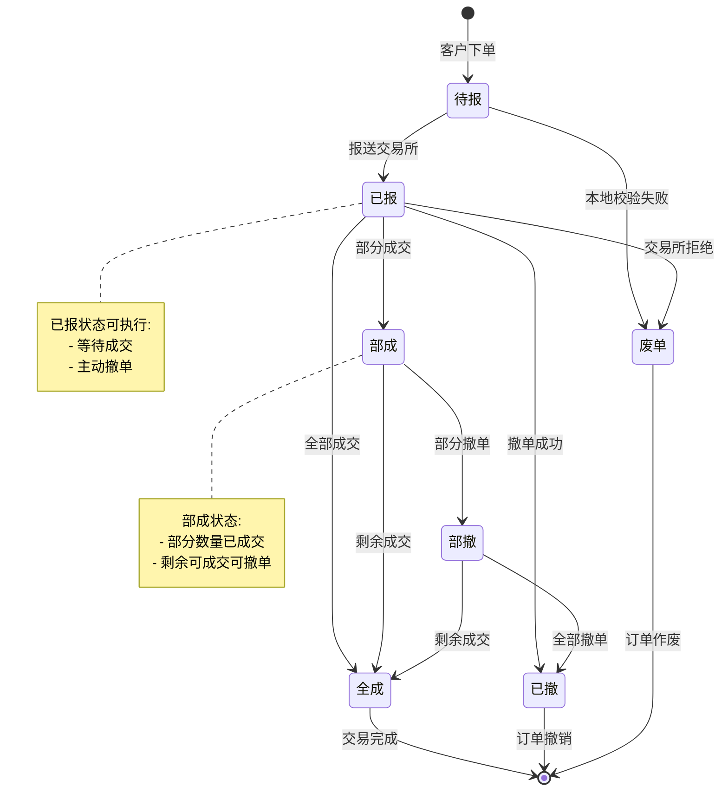
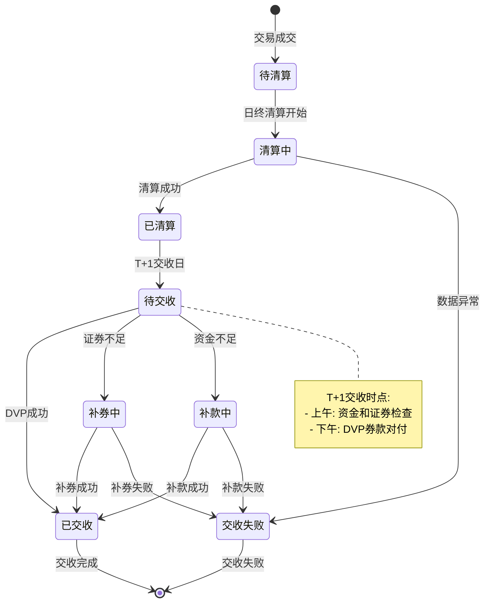
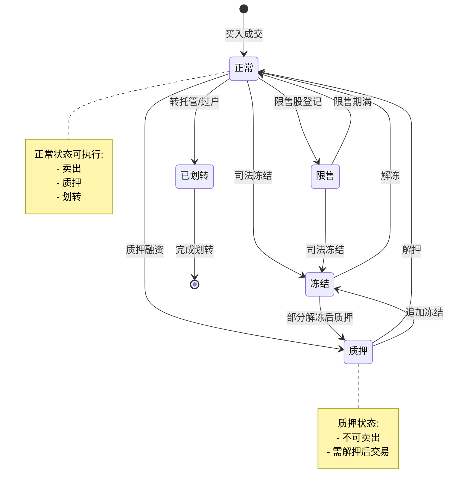
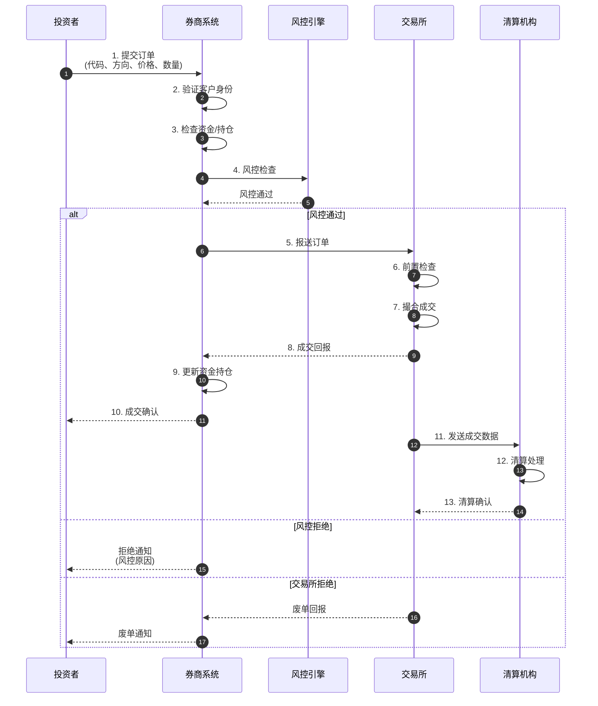
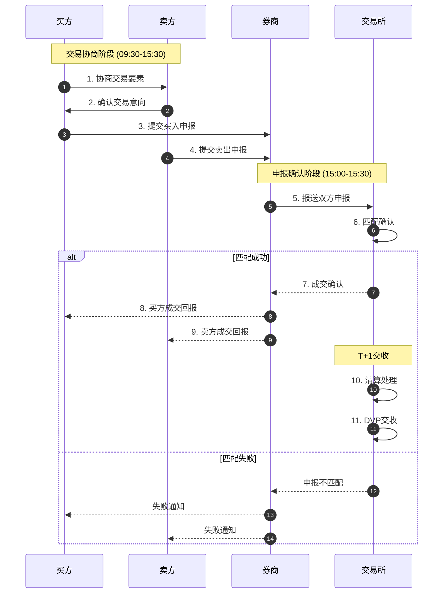
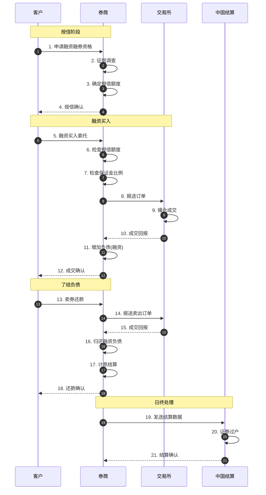
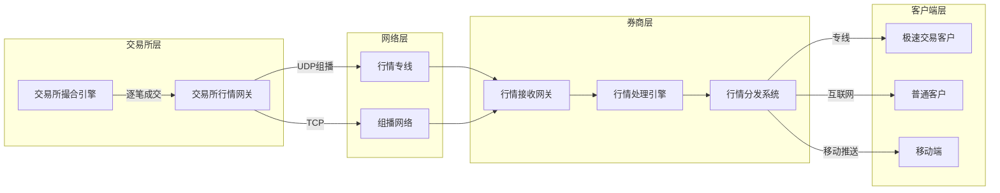
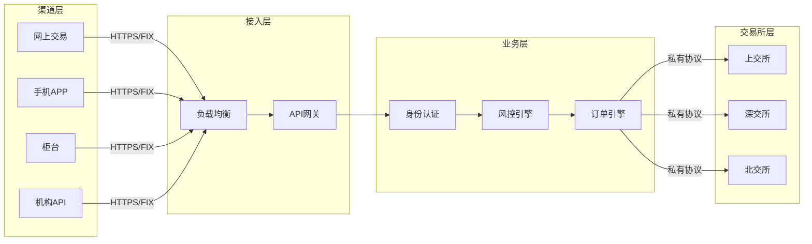
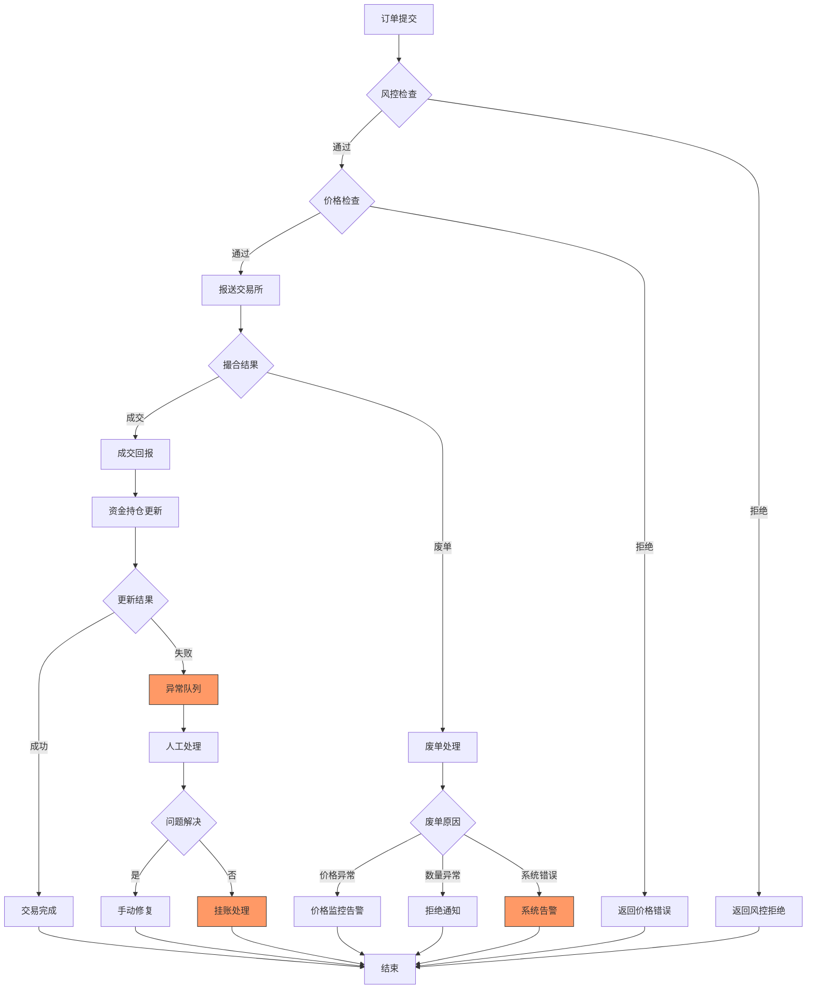
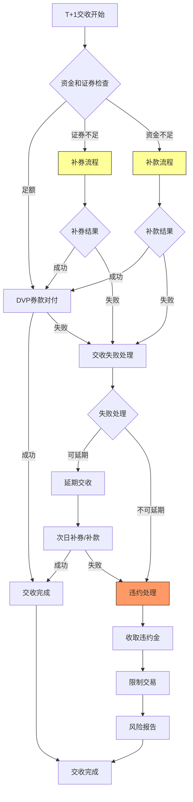

# Securities Schema信息表征动态动作分析视图

**版本**: v1.0
**创建日期**: 2026-02-15
**标准**: FIX 5.0 SP2, ISO 10383 MIC, T+1 Settlement, ISO 15022/20022

---

## 📑 目录

- [Securities Schema信息表征动态动作分析视图](#securities-schema信息表征动态动作分析视图)
  - [📑 目录](#-目录)
  - [1. 动态动作分析概述](#1-动态动作分析概述)
  - [2. 状态机形式化](#2-状态机形式化)
    - [2.1 订单生命周期状态机](#21-订单生命周期状态机)
    - [2.2 交易交收状态机](#22-交易交收状态机)
    - [2.3 持仓状态机](#23-持仓状态机)
  - [3. 时序交互分析](#3-时序交互分析)
    - [3.1 订单完整流程](#31-订单完整流程)
    - [3.2 大宗交易流程](#32-大宗交易流程)
    - [3.3 融资融券流程](#33-融资融券流程)
  - [4. 数据流分析](#4-数据流分析)
    - [4.1 行情数据流动路径](#41-行情数据流动路径)
    - [4.2 订单流数据流动](#42-订单流数据流动)
    - [4.3 成交回报数据流](#43-成交回报数据流)
    - [4.4 信息熵变化分析](#44-信息熵变化分析)
  - [5. 实时性分析](#5-实时性分析)
    - [5.1 低延迟要求定义](#51-低延迟要求定义)
    - [5.2 撮合引擎性能分析](#52-撮合引擎性能分析)
    - [5.3 行情分发延迟分析](#53-行情分发延迟分析)
  - [6. 异常处理机制](#6-异常处理机制)
    - [6.1 熔断机制](#61-熔断机制)
    - [6.2 价格异常监控](#62-价格异常监控)
    - [6.3 交收失败处理](#63-交收失败处理)
    - [6.4 异常处理决策矩阵](#64-异常处理决策矩阵)
  - [7. Mermaid动态视图](#7-mermaid动态视图)
    - [7.1 订单生命周期状态机图](#71-订单生命周期状态机图)
    - [7.2 交易交收状态机图](#72-交易交收状态机图)
    - [7.3 持仓状态机图](#73-持仓状态机图)
    - [7.4 订单流程时序图](#74-订单流程时序图)
    - [7.5 大宗交易流程时序图](#75-大宗交易流程时序图)
    - [7.6 融资融券流程时序图](#76-融资融券流程时序图)
    - [7.7 行情数据流图](#77-行情数据流图)
    - [7.8 订单数据流图](#78-订单数据流图)
    - [7.9 异常处理流程图](#79-异常处理流程图)
    - [7.10 交收异常处理流程图](#710-交收异常处理流程图)

---

## 1. 动态动作分析概述

证券交易系统动态动作分析关注证券交易在运行时的行为特征，包括：

- **状态转换**: 订单、持仓和交收在不同状态间的迁移
- **时序交互**: 投资者、券商、交易所、清算机构之间的消息传递顺序
- **数据流动**: 行情数据、订单流、成交回报在各系统组件间的传递路径
- **实时性能**: 满足低延迟要求的撮合性能和行情分发能力
- **异常恢复**: 熔断机制、价格监控、交收失败的处置机制

---

## 2. 状态机形式化

### 2.1 订单生命周期状态机

```
订单状态集合: O = {待报, 已报, 部成, 全成, 已撤, 废单, 部撤}

状态转换函数:
δ(待报) = 已报          (报单发送至交易所)
δ(已报) = 部成          (部分数量成交)
δ(已报) = 全成          (全部数量成交)
δ(已报) = 已撤          (撤单成功)
δ(已报) = 废单          (交易所拒绝)
δ(部成) = 全成          (剩余数量全部成交)
δ(部成) = 部撤          (撤单成功，部分未成交)
δ(部成) = 已撤          (剩余数量撤单成功)
δ(部撤) = 全成          (剩余部分成交)
δ(部撤) = 已撤          (剩余部分撤单成功)

状态不变式:
∀订单: 成交数量(订单) + 未成交数量(订单) = 订单数量(订单)
∀订单: 订单状态(订单) ∈ O
∀订单: 成交数量(订单) ≥ 0 ∧ 未成交数量(订单) ≥ 0
```

**订单状态转换矩阵:**

| 当前状态 | 报单发送 | 部分成交 | 全部成交 | 撤单成功 | 交易所拒绝 | 剩余撤单 |
|---------|---------|---------|---------|---------|-----------|---------|
| **待报** | 已报 | - | - | - | 废单 | - |
| **已报** | - | 部成 | 全成 | 已撤 | 废单 | - |
| **部成** | - | - | 全成 | - | - | 部撤 |
| **部撤** | - | - | 全成 | 已撤 | - | - |
| **全成** | - | - | - | - | - | - |
| **已撤** | - | - | - | - | - | - |
| **废单** | - | - | - | - | - | - |

**订单生命周期时序约束:**

| 阶段 | 操作 | 时间限制 | 超时处理 |
|-----|------|---------|---------|
| 待报→已报 | 报单发送至交易所 | < 10ms | 重发或废单 |
| 已报→部成/全成 | 撮合成交 | 取决于市场 | 持续等待 |
| 已报→已撤 | 撤单处理 | < 50ms | 重试撤单 |
| 部成→全成 | 剩余成交 | 当日有效 | 收盘自动撤单 |

### 2.2 交易交收状态机

```
交收状态集合: S = {待清算, 清算中, 已清算, 待交收, 已交收, 交收失败, 补券中, 补款中}

状态转换流程:
1. 交易确认阶段
   待清算 → 清算中      (进入清算队列)

2. 清算处理阶段
   清算中 → 已清算      (清算成功，计算应收应付)
   清算中 → 交收失败    (清算异常，数据不匹配)

3. 结算交收阶段
   已清算 → 待交收      (发起DVP交收)
   待交收 → 已交收      (券款对付成功)
   待交收 → 补券中      (证券不足，进入补券流程)
   待交收 → 补款中      (资金不足，进入补款流程)

4. 异常处理阶段
   补券中 → 已交收      (补券成功，完成交收)
   补款中 → 已交收      (补款成功，完成交收)
   补券中 → 交收失败    (补券失败，交收失败)
   补款中 → 交收失败    (补款失败，交收失败)

交收周期约束:
- A股: T+1交收 (成交后第1个交易日完成)
- 港股通: T+2交收
- 债券: T+0/T+1交收
- 基金: T+1交收
```

**交收状态转换条件:**

| 转换 | 触发条件 | 执行动作 | 时间限制 |
|-----|---------|---------|---------|
| 待清算→清算中 | 交易日收盘 | 汇总当日成交数据 | < 30分钟 |
| 清算中→已清算 | 数据核对通过 | 生成交收指令 | < 2小时 |
| 已清算→待交收 | 结算日到达 | 检查资金和证券 | T+1日早间 |
| 待交收→已交收 | 券款对付成功 | 更新持仓和资金 | < 1小时 |
| 待交收→补券中 | 证券不足 | 通知补券 | 即时 |
| 待交收→补款中 | 资金不足 | 通知补款 | 即时 |
| 补券中→已交收 | 补足证券 | 完成交收 | T+1日下午 |
| 补款中→已交收 | 补足资金 | 完成交收 | T+1日下午 |

### 2.3 持仓状态机

```
持仓状态集合: P = {正常, 冻结, 质押, 限售, 已划转}

持仓类型:
- LONG: 多头持仓 (普通买入持有)
- SHORT: 空头持仓 (融券卖出)

状态转换规则:

正常状态:
正常 → 冻结        (司法冻结、质押冻结)
正常 → 质押        (质押融资)
正常 → 限售        (限售股解禁前)
正常 → 已划转      (转托管、过户)

冻结状态:
冻结 → 正常        (冻结解除)
冻结 → 质押        (部分解冻后质押)

质押状态:
质押 → 正常        (质押解除)
质押 → 冻结        (追加冻结)

限售状态:
限售 → 正常        (限售期满解禁)

状态属性约束:
∀持仓: 总数量 = 可用数量 + 冻结数量 + 质押数量
∀持仓: 可用数量 ≥ 0
∀持仓: 冻结数量 ≥ 0
∀持仓: 质押数量 ≥ 0
```

**持仓状态转换矩阵:**

| 当前状态 | 冻结指令 | 解冻指令 | 质押指令 | 解押指令 | 限售期满 | 转托管 |
|---------|---------|---------|---------|---------|---------|--------|
| **正常** | 冻结 | - | 质押 | - | - | 已划转 |
| **冻结** | - | 正常 | - | - | - | - |
| **质押** | 冻结 | - | - | 正常 | - | - |
| **限售** | 冻结 | - | - | - | 正常 | - |

---

## 3. 时序交互分析

### 3.1 订单完整流程

```
参与方:
- 投资者 (Investor)
- 券商交易系统 (Broker)
- 交易所撮合引擎 (Exchange)
- 清算机构 (Clearing House)

时序流程:

T0: 投资者提交订单
T1 = T0 + Δt1: 券商接收订单，验证客户身份和资金/持仓
T2 = T1 + Δt2: 券商风控检查 (价格、数量、持仓限额)
T3 = T2 + Δt3: 订单报送至交易所
T4 = T3 + Δt4: 交易所订单前置检查 (价格涨跌幅、交易权限)
T5 = T4 + Δt5: 进入撮合引擎等待撮合
T6 = T5 + Δt6: 撮合成交，生成成交回报
T7 = T6 + Δt7: 交易所发送成交回报至券商
T8 = T7 + Δt8: 券商更新客户资金和持仓
T9 = T8 + Δt9: 券商发送成交确认给投资者
T10 = T9 + Δt10: 成交数据发送至清算机构
T11 = T10 + Δt11: 清算机构确认并进入待交收状态

总延迟: T_total = ΣΔti (i=1 to 11)
目标延迟: < 100ms (从投资者下单到收到确认)
```

**订单流程各阶段延迟要求:**

| 阶段 | 操作 | 目标延迟 | 最大延迟 |
|-----|------|---------|---------|
| T1 | 订单接收 | < 1ms | 5ms |
| T2 | 风控检查 | < 5ms | 20ms |
| T3 | 报送交易所 | < 10ms | 50ms |
| T4 | 交易所前置 | < 2ms | 10ms |
| T5 | 撮合等待 | 取决于市场 | - |
| T6 | 撮合成交 | < 1ms | 5ms |
| T7 | 回报发送 | < 5ms | 20ms |
| T8 | 资金持仓更新 | < 10ms | 50ms |
| T9 | 投资者通知 | < 20ms | 100ms |

### 3.2 大宗交易流程

```
大宗交易特征:
- 单笔申报数量 ≥ 30万股 或 金额 ≥ 200万元
- 协议定价，不进入连续竞价
- 15:00-15:30 盘后固定价格交易
- T+1交收

时序模型:

阶段1: 交易协商 (09:30-15:30)
- 买卖双方协商交易要素
- 确定证券代码、数量、价格
- 签署大宗交易协议

阶段2: 申报提交 (15:00-15:30)
- 买卖双方分别提交申报
- 交易所匹配确认
- 成交确认及回报

阶段3: 清算交收 (T+1)
- 清算处理
- 证券过户
- 资金交收
```

### 3.3 融资融券流程

```
融资融券交易时序:

阶段1: 开户授信
- 客户申请融资融券资格
- 券商征信调查
- 确定授信额度
- 签署风险揭示书

阶段2: 融资买入
- 客户提交融资买入委托
- 券商检查可用授信额度
- 检查标的证券和保证金比例
- 报送交易所撮合
- 成交后计息开始

阶段3: 融券卖出
- 客户提交融券卖出委托
- 券商检查可融券数量
- 检查保证金比例
- 报送交易所撮合
- 成交后计息开始

阶段4: 了结负债
- 卖券还款 (卖出持仓归还融资)
- 买券还券 (买入证券归还融券)
- 直接还款/还券
- 利息计算与扣除

风险控制时点:
- 下单前: 保证金比例检查
- 日终: 维持担保比例计算
- 实时: 预警线、平仓线监控
```

---

## 4. 数据流分析

### 4.1 行情数据流动路径

```
行情数据生命周期:

1. 数据源生成
   ┌─────────────────────────────────────────┐
   │ 交易所行情源:                            │
   │   - 逐笔成交数据                         │
   │   - 五档/十档盘口                        │
   │   - 指数计算数据                         │
   │   - 市场状态信息                         │
   └─────────────────────────────────────────┘
                    │
                    ▼ (UDP组播/专线)
2. 行情接收
   ┌─────────────────────────────────────────┐
   │ 行情网关:                               │
   │   - 多路行情接收                         │
   │   - 数据完整性校验                       │
   │   - 丢包检测与补录                       │
   └─────────────────────────────────────────┘
                    │
                    ▼ (内部高速总线)
3. 行情处理
   ┌─────────────────────────────────────────┐
   │ 行情处理引擎:                            │
   │   - 数据解析与标准化                     │
   │   - 增量合成快照                         │
   │   - K线计算 (分钟/日/周/月)              │
   │   - 技术指标计算                         │
   └─────────────────────────────────────────┘
                    │
                    ▼ (分发)
4. 行情分发
   ┌─────────────────────────────────────────┐
   │ 行情分发系统:                            │
   │   - Level-1 行情 (五档)                  │
   │   - Level-2 行情 (十档/逐笔)             │
   │   - 极速行情专线                         │
   │   - 互联网行情推送                       │
   └─────────────────────────────────────────┘
```

### 4.2 订单流数据流动

```
订单数据生命周期:

生成阶段:
┌─────────────────────────────────────────────────────────────┐
│ 客户端订单封装:                                              │
│   Header: 订单头 (会话ID、序列号、时间戳)                     │
│   Body: 订单详情 (代码、方向、类型、价格、数量)               │
│   Risk: 风控标签 (客户风险等级、订单属性)                     │
│   Signature: 数字签名                                        │
└─────────────────────────────────────────────────────────────┘
                    │
                    ▼ (TCP/UDP)
传输阶段:
┌─────────────────────────────────────────────────────────────┐
│ 网络传输层:                                                  │
│   - TLS加密 (互联网接入)                                     │
│   - 专线直连 (机构接入)                                      │
│   - 负载均衡分发                                             │
│   - 流量整形限流                                             │
└─────────────────────────────────────────────────────────────┘
                    │
                    ▼
处理阶段:
┌─────────────────────────────────────────────────────────────┐
│ 订单处理引擎:                                                │
│   - 报文解析与校验                                           │
│   - 客户身份认证                                             │
│   - 资金持仓检查                                             │
│   - 合规性检查 (涨跌停、最小变动单位)                         │
│   - 路由至交易所                                             │
└─────────────────────────────────────────────────────────────┘
                    │
                    ▼ (FIX/交易所私有协议)
交易所阶段:
┌─────────────────────────────────────────────────────────────┐
│ 交易所处理:                                                  │
│   - 前置检查                                                 │
│   - 撮合成交                                                 │
│   - 生成成交回报                                             │
│   - 市场数据发布                                             │
└─────────────────────────────────────────────────────────────┘
```

### 4.3 成交回报数据流

```
成交回报处理流程:

成交生成:
┌─────────────────────────────────────────────────────────────┐
│ 交易所撮合引擎:                                              │
│   - 价格优先、时间优先撮合                                   │
│   - 生成成交记录 (成交ID、价格、数量、时间)                   │
│   - 发送至买卖双方券商                                       │
└─────────────────────────────────────────────────────────────┘
                    │
                    ▼ (多播/单播)
回报接收:
┌─────────────────────────────────────────────────────────────┐
│ 券商回报处理:                                                │
│   - 回报接收与解析                                           │
│   - 重复检测与去重                                           │
│   - 订单匹配关联                                             │
└─────────────────────────────────────────────────────────────┘
                    │
                    ▼
资金持仓更新:
┌─────────────────────────────────────────────────────────────┐
│ 核心系统处理:                                                │
│   - 买入: 扣减资金、增加持仓                                 │
│   - 卖出: 增加可用资金、扣减持仓                             │
│   - 冻结资金/持仓释放                                        │
│   - 交易费用计算                                             │
└─────────────────────────────────────────────────────────────┘
                    │
                    ▼
通知发送:
┌─────────────────────────────────────────────────────────────┐
│ 客户端通知:                                                  │
│   - 实时推送成交信息                                         │
│   - 更新持仓和资金显示                                       │
│   - 生成交易确认书                                          │
└─────────────────────────────────────────────────────────────┘
```

### 4.4 信息熵变化分析

```
证券数据在系统中的熵变:

原始行情输入:    H ≈ 256 bits (逐笔成交、五档盘口)
     │
     │ 行情压缩
     ▼
压缩行情数据:    H ≈ 128 bits (增量编码、差分压缩)
     │
     │ 行情解析
     ▼
结构化行情:      H ≈ 64 bits (标准字段)
     │
     │ 业务处理
     ▼
交易信号:        H ≈ 8 bits (买入/卖出/持有)
     │
     │ 订单生成
     ▼
订单数据:        H ≈ 128 bits (订单详情)
     │
     │ 执行结果
     ▼
成交确认:        H ≈ 64 bits (成交回报)
     │
     │ 结算处理
     ▼
交收结果:        H ≈ 16 bits (成功/失败)

信息保护点:
1. 行情传输加密: 防止行情被窃取或篡改
2. 订单签名验证: 确保订单来源可信
3. 成交数据完整性: 防止成交数据丢失
4. 交收数据一致性: 确保证券和资金匹配
```

---

## 5. 实时性分析

### 5.1 低延迟要求定义

```
证券交易SLA指标:

业务类型            │ 响应时间    │ 可用性    │ 吞吐量      │ 延迟要求
────────────────────┼────────────┼──────────┼────────────┼─────────
订单报送            │ < 10ms     │ 99.99%   │ 100,000 TPS│ 微秒级
撮合引擎            │ < 100μs    │ 99.999%  │ 500,000 TPS│ 亚毫秒级
成交回报            │ < 5ms      │ 99.99%   │ 500,000 TPS│ 毫秒级
行情分发(Level-1)   │ < 1ms      │ 99.99%   │ 1,000,000笔/秒│ 毫秒级
行情分发(Level-2)   │ < 10ms     │ 99.99%   │ 500,000笔/秒│ 毫秒级
资金查询            │ < 10ms     │ 99.99%   │ 500,000 QPS│ 毫秒级
持仓查询            │ < 10ms     │ 99.99%   │ 500,000 QPS│ 毫秒级

交易时段要求:
- 开盘集合竞价 (09:15-09:25): 峰值处理，延迟敏感
- 连续竞价 (09:30-11:30, 13:00-15:00): 持续高吞吐
- 收盘集合竞价 (14:57-15:00): 集中申报处理
- 大宗交易 (15:00-15:30): 独立处理通道
```

### 5.2 撮合引擎性能分析

```
撮合引擎延迟分解:

总延迟 = 网络延迟 + 网关延迟 + 撮合延迟 + 回报延迟

网络延迟 (T_network):
- 券商到交易所: 0.5-2ms (同城) / 10-50ms (异地)
- 交易所内部: 0.01-0.1ms
- 小计: 0.51-50ms

网关延迟 (T_gateway):
- 报文解析: 5-20μs
- 前置检查: 5-10μs
- 协议转换: 5-15μs
- 小计: 15-45μs

撮合延迟 (T_match):
- 订单簿检索: 1-5μs
- 价格匹配: 1-3μs
- 数量扣减: 1-3μs
- 成交生成: 1-3μs
- 小计: 4-14μs

回报延迟 (T_report):
- 成交记录生成: 1-3μs
- 回报封装发送: 5-15μs
- 小计: 6-18μs

端到端撮合延迟: 25-77μs (交易所内部)
```

**撮合引擎吞吐量计算:**

```
撮合引擎容量规划:

峰值TPS计算:
TPS_peak = (日撮合笔数 × 峰值系数) / (峰值持续秒数)

假设:
- 日撮合笔数: 50,000,000 笔
- 峰值系数: 3.0 (开盘时段是平均的3倍)
- 峰值持续: 30分钟 (1800秒)

计算:
TPS_avg = 50,000,000 / 14,400 ≈ 3,472 TPS
TPS_peak = (50,000,000 × 3.0) / 1800 ≈ 83,333 TPS

设计容量 (考虑2倍冗余):
TPS_design = 83,333 × 2 ≈ 166,666 TPS

撮合引擎优化技术:
1. 无锁数据结构: 订单簿无锁化
2. CPU亲和性: 绑定特定核心
3. 内存数据库: 订单簿驻留内存
4. FPGA加速: 关键路径硬件加速
5. 内核旁路: DPDK网络栈
```

### 5.3 行情分发延迟分析

```
行情分发延迟分解:

全链路延迟 = 交易所生成 + 网络传输 + 行情处理 + 客户端接收

交易所生成延迟:
- 成交触发: 1μs
- 快照生成: 10-50μs
- 数据编码: 5-20μs
- 小计: 16-71μs

网络传输延迟:
- 交易所到券商: 0.1-1ms (专线)
- 券商到客户: 1-50ms (取决于接入方式)
- 小计: 1.1-51ms

行情处理延迟:
- 数据解析: 10-100μs
- 快照合成: 50-200μs
- 协议封装: 10-50μs
- 小计: 70-350μs

客户端接收延迟:
- 网络接收: 1-50ms
- 数据解析: 1-10ms
- UI刷新: 16ms (60fps)
- 小计: 18-76ms

全链路行情延迟:
- 极速专线: 1.2-2ms
- 普通互联网: 20-130ms
```

---

## 6. 异常处理机制

### 6.1 熔断机制

```
熔断机制层级设计:

Level 1: 个股熔断
- 触发条件: 价格涨跌幅达到±10% (主板) / ±20% (创业板/科创板)
- 处置措施: 临时停牌至收盘或特定时间
- 恢复条件: 次日自动恢复

Level 2: 指数熔断 (已暂停)
- 触发条件: 沪深300指数涨跌幅达到5%或7%
- 处置措施:
  - 5%触发: 暂停交易15分钟
  - 7%触发: 暂停交易至收盘
- 恢复条件: 熔断时间结束后恢复

Level 3: 券商系统熔断
- 触发条件: 系统负载超过阈值 (CPU>90%, 内存>95%)
- 处置措施: 限制新订单接入，优先处理撤单
- 恢复条件: 负载降至正常水平

Level 4: 交易所系统熔断
- 触发条件: 交易所系统异常
- 处置措施: 临时休市，发布市场公告
- 恢复条件: 系统故障修复后恢复交易

熔断决策矩阵:

熔断类型        │ 触发阈值       │ 暂停时长       │ 自动恢复      │ 人工介入
────────────────┼───────────────┼───────────────┼──────────────┼──────────
个股涨停        │ +10%/+20%     │ 至收盘         │ 次日          │ 否
个股跌停        │ -10%/-20%     │ 至收盘         │ 次日          │ 否
指数熔断(5%)    │ ±5%           │ 15分钟         │ 是            │ 否
指数熔断(7%)    │ ±7%           │ 至收盘         │ 次日          │ 否
系统过载        │ CPU>90%       │ 视负载而定     │ 是            │ 可能
系统故障        │ 严重故障      │ 视修复时间     │ 否            │ 必须
```

### 6.2 价格异常监控

```
价格异常检测规则:

规则1: 价格跳变检测
- 触发条件: 价格相对于前收盘价变动超过阈值
- 阈值设置:
  - 正常股票: ±10%
  - ST股票: ±5%
  - 科创板/创业板: ±20%
- 处置措施:
  - 达到阈值: 限制该价格订单
  - 超过阈值: 拒绝订单并报错

规则2: 价格精度检测
- 触发条件: 委托价格不符合最小变动单位
- 阈值设置:
  - 主板: 0.01元
  - 科创板: 0.01元 (高价股可能调整)
- 处置措施: 自动修正或拒绝订单

规则3: 异常波动检测
- 触发条件: 连续竞价期间价格异常波动
- 检测指标:
  - 1分钟内涨跌幅超过5%
  - 3分钟内涨跌幅超过8%
- 处置措施:
  - 触发监控: 标记重点监控
  - 触发警示: 发送风险提示
  - 触发停牌: 临时停牌核查

规则4: 跨市场价格偏离
- 触发条件: A股与港股价格偏离超过阈值
- 阈值设置: 20% (相对溢价率)
- 处置措施: 发布溢价率警示
```

### 6.3 交收失败处理

```
交收失败类型与处理:

类型1: 证券不足 (Fail to Deliver)
- 原因: 卖方证券账户持仓不足
- 检测时点: T+1日交收前
- 处置流程:
  1. 通知卖方补足证券
  2. 启动补券程序 (买入证券)
  3. 收取违约金 (万分之3/天)
  4. 连续失败限制交易

类型2: 资金不足 (Fail to Pay)
- 原因: 买方资金账户余额不足
- 检测时点: T+1日交收前
- 处置流程:
  1. 通知买方补足资金
  2. 启动补款程序
  3. 收取违约金 (万分之3/天)
  4. 连续失败限制交易

类型3: 系统故障
- 原因: 结算系统故障
- 检测时点: 交收处理过程中
- 处置流程:
  1. 启动备用结算系统
  2. 延迟交收至系统恢复
  3. 公告市场延期交收
  4. 记录异常事件

类型4: 数据不一致
- 原因: 交易数据与结算数据不匹配
- 检测时点: 清算过程中
- 处置流程:
  1. 暂停相关交易交收
  2. 人工核对数据
  3. 修正数据后重新交收
  4. 调查原因并整改

交收失败处置决策树:

┌─────────────────────────────────────────────────────────────┐
│                    交收失败处置                              │
├─────────────────────────────────────────────────────────────┤
│                                                             │
│  检测失败 ──→ 确定失败类型                                   │
│                  │                                          │
│      ┌───────────┼───────────┐                              │
│      ▼           ▼           ▼                              │
│   证券不足    资金不足    系统故障                            │
│      │           │           │                              │
│      ▼           ▼           ▼                              │
│   通知补券   通知补款    启动备机                            │
│      │           │           │                              │
│      ▼           ▼           ▼                              │
│   补券成功?  补款成功?   系统恢复?                           │
│      │           │           │                              │
│   ┌──┴──┐    ┌──┴──┐    ┌──┴──┐                           │
│   │     │    │     │    │     │                           │
│   是    否   是    否   是    否                           │
│   │     │    │     │    │     │                           │
│   ▼     ▼    ▼     ▼    ▼     ▼                           │
│  完成  违约 完成  违约 完成  延期                           │
│                                                             │
└─────────────────────────────────────────────────────────────┘
```

### 6.4 异常处理决策矩阵

```
异常场景分类与处理:

异常类型          │ 检测方式       │ 自动处理         │ 人工介入      │ 通知方式
──────────────────┼───────────────┼─────────────────┼──────────────┼──────────
订单超时          │ 定时器监控    │ 自动撤单         │ 否            │ 客户端提示
价格异常          │ 规则引擎      │ 拒绝订单         │ 可能          │ 风控告警
重复订单          │ 幂等检查      │ 返回原结果       │ 否            │ 日志记录
撮合异常          │ 成交校验      │ 标记待核查       │ 是            │ 紧急告警
行情中断          │ 心跳检测      │ 切换备份源       │ 否            │ 运维告警
结算失败          │ 交收对账      │ 启动补券/补款    │ 超时后介入     │ 双重告警
系统故障          │ 健康检查      │ 服务降级/切换    │ 故障恢复      │ 全员告警

异常处理时限:
- 自动处理: 实时 (< 100ms)
- 人工介入: 工作时间内 (09:00-17:00)
- 紧急响应: 30分钟内
- 故障恢复: 2小时内
```

---

## 7. Mermaid动态视图

### 7.1 订单生命周期状态机图



### 7.2 交易交收状态机图



### 7.3 持仓状态机图



### 7.4 订单流程时序图



### 7.5 大宗交易流程时序图



### 7.6 融资融券流程时序图



### 7.7 行情数据流图



### 7.8 订单数据流图



### 7.9 异常处理流程图



### 7.10 交收异常处理流程图



---

**参考文档**:

- `01_Overview.md` - 证券业务Schema概述
- `02_Formal_Definition.md` - 形式化定义
- `04_Transformation.md` - 模型转换
- `05_Case_Studies.md` - 案例研究
- FIX 5.0 SP2 协议规范
- ISO 10383 MIC 标准
- T+1 结算标准规范

**维护者**: DSL Schema研究团队
