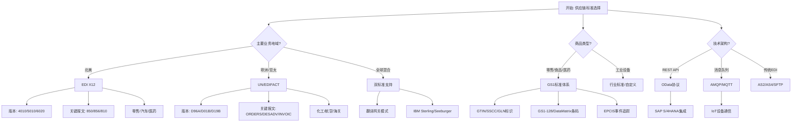
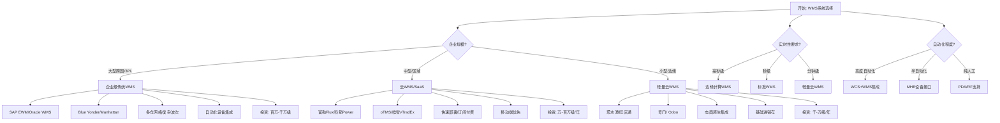
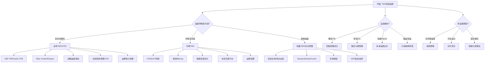
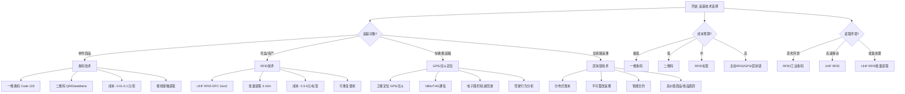
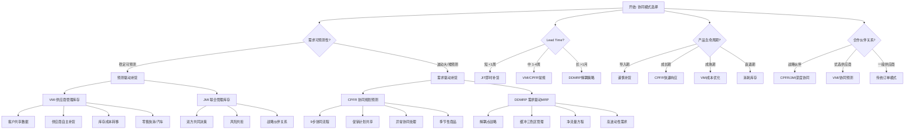

# 物流供应链Schema决策树图

**版本**: v1.0
**创建日期**: 2026-02-15
**适用范围**: 物流供应链Schema设计和选型

---

## 📑 目录

- [物流供应链Schema决策树图](#物流供应链schema决策树图)
  - [📑 目录](#-目录)
  - [概览](#概览)
  - [1. 供应链标准选择决策树](#1-供应链标准选择决策树)
  - [2. 仓储系统选择决策树](#2-仓储系统选择决策树)
  - [3. 运输管理系统决策树](#3-运输管理系统决策树)
  - [4. 物流追踪技术决策树](#4-物流追踪技术决策树)
  - [5. 供应链协同模式决策树](#5-供应链协同模式决策树)
  - [6. Mermaid可视化](#6-mermaid可视化)
    - [6.1 供应链标准选择流程图](#61-供应链标准选择流程图)
    - [6.2 仓储系统选择流程图](#62-仓储系统选择流程图)
    - [6.3 运输管理系统流程图](#63-运输管理系统流程图)
    - [6.4 物流追踪技术流程图](#64-物流追踪技术流程图)
    - [6.5 供应链协同模式流程图](#65-供应链协同模式流程图)
  - [使用指南](#使用指南)
    - [如何使用这些决策树](#如何使用这些决策树)
    - [决策树组合使用示例](#决策树组合使用示例)
    - [常见陷阱与建议](#常见陷阱与建议)

---

## 概览

| 决策树 | 适用场景 | 关键决策点 | 输出结果 |
|--------|----------|------------|----------|
| 供应链标准选择 | EDI/XML标准选型 | 地域分布、行业类型、技术架构 | X12/EDIFACT/GS1/OData |
| 仓储系统选择 | WMS系统架构 | 企业规模、IT能力、实时性需求 | 传统/云/边缘WMS |
| 运输管理系统 | TMS功能模块 | 运输模式、网络复杂度、协同需求 | 核心/高级/生态TMS |
| 物流追踪技术 | 追踪技术选型 | 精度需求、成本预算、场景特点 | RFID/条码/GPS/区块链 |
| 供应链协同模式 | 补货策略设计 | 需求波动、 lead time、数据成熟度 | VMI/CPFR/DDMRP/JIT |

---

## 1. 供应链标准选择决策树

```text
开始: 选择供应链消息标准
│
├─ Q: 主要业务地域?
│   │
│   ├─ 北美市场
│   │   └─ 决策: EDI X12标准
│   │       ├─ 理由: 北美B2B交易事实标准
│   │       ├─ 版本: 4010/5010/6020
│   │       ├─ 关键报文:
│   │       │   ├─ 850 (采购订单)
│   │       │   ├─ 856 (发货通知ASN)
│   │       │   ├─ 810 (发票)
│   │       │   ├─ 830 (物料需求预测)
│   │       │   └─ 204 (运输承运招标)
│   │       ├─ 适用行业:
│   │       │   ├─ 零售 (沃尔玛、亚马逊强制要求)
│   │       │   ├─ 汽车制造 (通用、福特)
│   │       │   ├─ 医药 (FDA合规)
│   │       │   └─ 物流 (第三方物流)
│   │       └─ 技术特点:
│   │           ├─ 定长字段格式
│   │           ├─ 段(Segment)结构
│   │           └─ 交换信封( ISA/GE/GS )
│   │
│   ├─ 欧洲/亚太/其他地区
│   │   └─ 决策: UN/EDIFACT标准
│   │       ├─ 理由: 联合国推荐国际标准
│   │       ├─ 版本: D96A/D01B/D19B
│   │       ├─ 关键报文:
│   │       │   ├─ ORDERS (采购订单)
│   │       │   ├─ DESADV (发货通知)
│   │       │   ├─ INVOIC (发票)
│   │       │   ├─ DELFOR (交付预测)
│   │       │   └─ IFTMIN (运输指令)
│   │       ├─ 适用行业:
│   │       │   ├─ 欧洲零售 (家乐福、麦德龙)
│   │       │   ├─ 化工 (巴斯夫、拜耳)
│   │       │   ├─ 航空 (IATA标准)
│   │       │   └─ 海关 (进出口清关)
│   │       └─ 技术特点:
│   │           ├─ 变长字段格式
│   │           ├─ 更灵活的语法
│   │           └─ 多语言支持
│   │
│   └─ 全球混合业务
│       └─ 决策: 双标准支持
│           ├─ 架构: 翻译网关模式
│           ├─ 工具: 集成EDI平台
│           │   ├─ IBM Sterling
│           │   ├─ Seeburger
│           │   ├─ MuleSoft
│           │   └─ 自研映射引擎
│           └─ 策略:
│               ├─ 发送方标准优先
│               ├─ 内部统一格式(规范XML/JSON)
│               └─ 动态协议协商
│
├─ Q: 商品类型与标识?
│   │
│   ├─ 零售消费品/食品/医药
│   │   └─ 决策: GS1标准体系
│   │       ├─ 理由: 全球贸易项目标识权威
│   │       ├─ 核心标准:
│   │       │   │
│   │       │   ├─ GS1标识
│   │       │   │   ├─ GTIN (全球贸易项目代码)
│   │       │   │   ├─ SSCC (系列货运包装箱代码)
│   │       │   │   ├─ GLN (全球位置编码)
│   │       │   │   ├─ GRAI (全球可回收资产标识)
│   │       │   │   └─ GIAI (全球单个资产标识)
│   │       │   │
│   │       │   ├─ GS1条码
│   │       │   │   ├─ EAN-13 (零售商品)
│   │       │   │   ├─ UPC-A (北美零售)
│   │       │   │   ├─ GS1-128 (物流单元)
│   │       │   │   ├─ GS1 DataMatrix (小物品)
│   │       │   │   └─ GS1 QR Code (移动端)
│   │       │   │
│   │       │   ├─ GS1 EPCIS (事件数据)
│   │       │   │   ├─ 事件捕获
│   │       │   │   ├─ 事件查询
│   │       │   │   └─ 供应链可视化
│   │       │   │
│   │       │   └─ GS1 XML/EDI
│   │       │       ├─ 订单管理消息
│   │       │       ├─ 物流状态消息
│   │       │       └─ 发票消息
│   │       │
│   │       └─ 适用场景:
│   │           ├─ 全球零售供应链
│   │           ├─ 冷链追溯 (食品/医药)
│   │           ├─ 快消品促销管理
│   │           └─ 逆向物流 (退货/召回)
│   │
│   └─ 非零售商品 (工业设备/大宗物资)
│       └─ 决策: 行业标准/自定义
│           ├─ 工业4.0 → IEC 62264 (ISA-95)
│           ├─ 能源 → PIDX (石油数据交换)
│           ├─ 航空 → SPEC2000
│           └─ 其他 → 自定义XML Schema
│
├─ Q: 技术架构偏好?
│   │
│   ├─ REST API优先
│   │   └─ 决策: OData协议
│   │       ├─ 理由: 现代Web服务标准
│   │       ├─ 特点:
│   │       │   ├─ 基于HTTP/REST
│   │       │   ├─ 标准化查询语法
│   │       │   ├─ JSON/XML双格式
│   │       │   └─ 元数据驱动
│   │       ├─ 适用场景:
│   │       │   ├─ 云平台集成
│   │       │   ├─ 移动应用
│   │       │   ├─ 实时数据访问
│   │       │   └─ 与SAP S/4HANA集成
│   │       └─ 版本: OData v4 (推荐)
│   │
│   ├─ 消息队列/事件驱动
│   │   └─ 决策: AMQP/MQTT + JSON Schema
│   │       ├─ AMQP: 企业级消息中间件
│   │       ├─ MQTT: IoT设备通信
│   │       └─ Kafka: 高吞吐事件流
│   │
│   └─ 传统EDI基础设施
│       └─ 决策: AS2/AS4/SFTP传输
│           ├─ AS2: 点对点安全传输
│           ├─ AS4: Web服务消息传输
│           └─ OFTP2: 欧洲汽车业专用
│
└─ Q: 实施复杂度承受度?
    │
    ├─ 高 (标准化优先)
    │   └─ 推荐: 完整GS1体系 + X12/EDIFACT
    │
    ├─ 中 (平衡方案)
    │   └─ 推荐: 核心EDI报文 + OData API混合
    │
    └─ 低 (快速上线)
        └─ 推荐: JSON/CSV过渡 + 渐进式标准化
```

---

## 2. 仓储系统选择决策树

```text
开始: 选择WMS仓储系统
│
├─ Q: 企业规模与复杂度?
│   │
│   ├─ 大型跨国企业/3PL服务商
│   │   └─ 决策: 企业级传统WMS
│   │       ├─ 代表产品:
│   │       │   ├─ SAP EWM (扩展仓库管理)
│   │       │   ├─ Oracle WMS Cloud
│   │       │   ├─ Blue Yonder (原JDA)
│   │       │   ├─ Manhattan Associates
│   │       │   └─ Infor WMS
│   │       │
│   │       ├─ 核心能力:
│   │       │   ├─ 多仓库网络管理
│   │       │   ├─ 复杂波次计划与优化
│   │       │   ├─ 高级劳动力管理(LMS)
│   │       │   ├─ 自动化设备集成(AS/RS/AGV)
│   │       │   ├─ 多租户3PL计费
│   │       │   └─ 深度ERP集成
│   │       │
│   │       ├─ 适用场景:
│   │       │   ├─ 年吞吐量 > 100万箱
│   │       │   ├─ SKU数量 > 10万
│   │       │   ├─ 仓库数量 > 10个
│   │       │   ├─ 多业态支持(B2B+B2C)
│   │       │   └─ 全球化运营
│   │       │
│   │       └─ 投资规模: 百万-千万级
│   │
│   ├─ 中型企业/区域配送
│   │   └─ 决策: 云WMS/SaaS方案
│   │       ├─ 代表产品:
│   │       │   ├─ 富勒Flux (中国)
│   │       │   ├─ 科箭Power WMS
│   │       │   ├─ 唯智vTradEx
│   │       │   ├─ HighJump (Körber)
│   │       │   ├─ Fishbowl
│   │       │   └─ NetSuite WMS
│   │       │
│   │       ├─ 核心能力:
│   │       │   ├─ 快速部署 (周级)
│   │       │   ├─ 订阅付费模式
│   │       │   ├─ 标准功能开箱即用
│   │       │   ├─ 移动端优先
│   │       │   ├─ 自动升级维护
│   │       │   └─ 弹性扩容
│   │       │
│   │       ├─ 适用场景:
│   │       │   ├─ 年吞吐量 10-100万箱
│   │       │   ├─ SKU数量 1-10万
│   │       │   ├─ 仓库数量 1-10个
│   │       │   ├─ 电商/零售/制造业
│   │       │   └─ 无专业IT团队
│   │       │
│   │       └─ 投资规模: 万-百万级/年
│   │
│   └─ 小型企业/边缘仓库
│       └─ 决策: 轻量云WMS/边缘WMS
│           ├─ 代表产品:
│           │   ├─ 聚水潭
│           │   ├─ 旺店通
│           │   ├─ 奇门
│           │   ├─ Zoho Inventory
│           │   └─ 开源方案 (Odoo等)
│           │
│           ├─ 核心能力:
│           │   ├─ 极简配置
│           │   ├─ 电商原生集成
│           │   ├─ 基础进销存
│           │   ├─ PDA/手机作业
│           │   └─ 低成本快速上线
│           │
│           ├─ 适用场景:
│           │   ├─ 年吞吐量 < 10万箱
│           │   ├─ SKU数量 < 1万
│           │   ├─ 单仓或微型仓
│           │   ├─ 纯电商/社交电商
│           │   └─ 前店后仓模式
│           │
│           └─ 投资规模: 千-万级/年
│
├─ Q: 实时性要求?
│   │
│   ├─ 毫秒级响应 (自动化仓)
│   │   └─ 决策: 边缘计算WMS + 传统WMS混合
│   │       ├─ 边缘节点: PLC/工控机实时控制
│   │       ├─ 云端协同: 计划/分析/报表
│   │       └─ 场景: 无人仓/黑灯工厂
│   │
│   ├─ 秒级响应 (人工+自动化)
│   │   └─ 决策: 企业WMS/云WMS均可
│   │       └─ 场景: 标准配送中心
│   │
│   └─ 分钟级响应 (纯人工)
│       └─ 决策: 轻量云WMS
│           └─ 场景: 小型前置仓/门店仓
│
├─ Q: IT能力与定制需求?
│   │
│   ├─ 强IT团队 + 高定制 → 本地部署企业WMS
│   ├─ 中等IT能力 + 标准流程 → 云WMS
│   └─ 弱IT能力 → SaaS/外包服务
│
└─ Q: 自动化程度?
    │
    ├─ 高度自动化(AS/RS/AGV/机械臂)
    │   └─ 必须: WCS(仓库控制系统) + WMS集成
    │       ├─ WCS: 实时设备控制
    │       └─ WMS: 业务逻辑管理
    │
    ├─ 半自动化(输送线/分拣机)
    │   └─ 需要: 设备接口层(MHE接口)
    │
    └─ 纯人工
        └─ 可选: 基础PDA/RF支持
```

---

## 3. 运输管理系统决策树

```text
开始: 选择TMS运输管理系统
│
├─ Q: 运输网络复杂度?
│   │
│   ├─ 复杂多模式网络 (海运+空运+陆运+铁路)
│   │   └─ 决策: 全球TMS/GTM套件
│   │       ├─ 代表产品:
│   │       │   ├─ SAP TM (Transportation Management)
│   │       │   ├─ Oracle Transportation Management (OTM)
│   │       │   ├─ Blue Yonder TMS
│   │       │   ├─ E2open
│   │       │   └─ Alpega (TenderEasy)
│   │       │
│   │       ├─ 核心模块:
│   │       │   ├─ 战略运输规划
│   │       │   │   ├─ 网络设计与优化
│   │       │   │   ├─ 承运商选型与招标
│   │       │   │   ├─ 合同费率管理
│   │       │   │   └─ 碳排放规划
│   │       │   │
│   │       │   ├─ 运输执行
│   │       │   │   ├─ 多式联运计划
│   │       │   │   ├─ 承运商 tendering
│   │       │   │   ├─ 运费审计与结算
│   │       │   │   ├─ 货运追踪可视化
│   │       │   │   └─ 异常管理
│   │       │   │
│   │       │   ├─ 全球贸易管理(GTM)
│   │       │   │   ├─ 贸易合规筛查
│   │       │   │   ├─ 报关单证管理
│   │       │   │   ├─ 关税计算
│   │       │   │   ├─ 优惠原产地管理
│   │       │   │   └─ 受限方筛查
│   │       │   │
│   │       │   └─ 运费管理
│   │       │       ├─ 运费审计(Parcel+LTL+FTL)
│   │       │       ├─ 运费支付
│   │       │       ├─ GL成本分摊
│   │       │       └─ 承运商绩效分析
│   │       │
│   │       └─ 适用场景:
│   │           ├─ 年运费支出 > 1亿
│   │           ├─ 跨境贸易占比 > 30%
│   │           ├─ 承运商数量 > 50家
│   │           ├─ 多区域运营
│   │           └─ 需要贸易合规
│   │
│   ├─ 中等复杂度 (区域配送+干线)
│   │   └─ 决策: 中端TMS
│   │       ├─ 代表产品:
│   │       │   ├─ oTMS (中国)
│   │       │   ├─ G7/嬴彻 (中国)
│   │       │   ├─ 科箭TMS
│   │       │   ├─ 唯智TMS
│   │       │   ├─ BluJay Solutions
│   │       │   └─ MercuryGate
│   │       │
│   │       ├─ 核心功能:
│   │       │   ├─ 订单聚合与配载
│   │       │   ├─ 智能调度与路径优化
│   │       │   ├─ 承运商协同平台
│   │       │   ├─ 在途跟踪(GPS/API)
│   │       │   ├─ 电子回单(POD)
│   │       │   ├─ 运费结算
│   │       │   └─ KPI报表
│   │       │
│   │       └─ 适用场景:
│   │           ├─ 年运费 1000万-1亿
│   │           ├─ 以公路运输为主
│   │           ├─ 区域配送网络
│   │           └─ 需要车货匹配
│   │
│   └─ 简单运输 (点对点/自有车队)
│       └─ 决策: 轻量TMS/车队管理
│           ├─ 代表产品:
│           │   ├─ 货拉拉企业版
│           │   ├─ 快狗打车企业版
│           │   ├─ Samsara (车队管理)
│           │   ├─ KeepTruckin
│           │   └─ 自建调度系统
│           │
│           ├─ 核心功能:
│           │   ├─ 车辆调度
│           │   ├─ 司机管理
│           │   ├─ 油耗监控
│           │   ├─ GPS轨迹
│           │   └─ 基础运费计算
│           │
│           └─ 适用场景:
│               ├─ 自有车队 < 50台
│               ├─ 运输路线固定
│               └─ 年运费 < 1000万
│
├─ Q: 运输模式?
│   │
│   ├─ 整车运输(FTL)为主
│   │   └─ 重点关注: 回程配载、线路优化
│   │
│   ├─ 零担运输(LTL)为主
│   │   └─ 重点关注: 集货分拨、中转管理
│   │
│   ├─ 快递/包裹(Parcel)
│   │   └─ 重点关注: 多承运商比价、追踪聚合
│   │
│   ├─ 海运/空运
│   │   └─ 重点关注: 订舱、舱单、ETA预测
│   │
│   └─ 多模式混合
│       └─ 重点关注: 模式切换、转运协同
│
├─ Q: 承运商类型?
│   │
│   ├─ 合同承运商为主
│   │   └─ 需要: 绩效管理、合同管理
│   │
│   ├─ 临时运力/平台运力为主
│   │   └─ 需要: 实时竞价、动态定价
│   │
│   └─ 混合模式
│       └─ 需要: 智能分配算法
│
└─ Q: 协同深度?
    │
    ├─ 承运商深度协同
    │   └─ 需要: API对接、移动端协同、电子回单
    │
    ├─ 货主协同
    │   └─ 需要: 订单可视化、预约管理、VMI
    │
    └─ 基础协同
        └─ 邮件/电话 + Excel对账
```

---

## 4. 物流追踪技术决策树

```text
开始: 选择物流追踪技术
│
├─ Q: 追踪对象是什么?
│   │
│   ├─ 单件商品/包装级别
│   │   └─ 决策: 条码技术
│   │       │
│   │       ├─ 一维条码
│   │       │   ├─ Code 128 (物流专用)
│   │       │   ├─ ITF-14 (箱码)
│   │       │   ├─ GS1-128 (带属性信息)
│   │       │   └─ 优势: 成本低、识读快
│   │       │
│   │       ├─ 二维条码
│   │       │   ├─ QR Code (通用、手机友好)
│   │       │   ├─ Data Matrix (小尺寸高密度)
│   │       │   ├─ PDF417 (大容量)
│   │       │   └─ 优势: 信息量大、纠错能力
│   │       │
│   │       ├─ 适用场景:
│   │       │   ├─ 零售商品结算
│   │       │   ├─ 仓库出入库扫描
│   │       │   ├─ 运输交接签收
│   │       │   ├─ 生产追溯
│   │       │   └─ 医药追溯码
│   │       │
│   │       ├─ 成本: 标签0.01-0.1元/张
│   │       ├─ 识读距离: 接触-30cm
│   │       └─ 局限: 视线接触、一次性使用
│   │
│   ├─ 托盘/周转箱/资产
│   │   └─ 决策: RFID技术
│   │       │
│   │       ├─ RFID频段选择
│   │       │   │
│   │       │   ├─ 低频(LF) 125-134kHz
│   │       │   │   ├─ 特点: 穿透性强、距离短(<10cm)
│   │       │   │   ├─ 应用: 动物识别、门禁
│   │       │   │   └─ 不推荐: 物流追踪
│   │       │   │
│   │       │   ├─ 高频(HF) 13.56MHz
│   │       │   │   ├─ 特点: 中距离(<1m)、NFC兼容
│   │       │   │   ├─ 应用: 图书馆、门票、支付
│   │       │   │   └─ 适用: 近距离资产盘点
│   │       │   │
│   │       │   └─ 超高频(UHF) 860-960MHz
│   │       │       ├─ 特点: 远距离(3-10m)、批量读取
│   │       │       ├─ 标准: EPC Gen2 V2
│   │       │       ├─ 应用: 物流首选
│   │       │       ├─ 优势:
│   │       │       │   ├─ 无需视线接触
│   │       │       │   ├─ 批量快速读取(每秒数百件)
│   │       │       │   ├─ 可重复使用
│   │       │       │   ├─ 可写入数据
│   │       │       │   └─ 与传感器集成(温度/湿度)
│   │       │       └─ 挑战:
│   │       │           ├─ 金属/液体干扰
│   │       │           ├─ 成本较高(标签0.5-5元)
│   │       │           └─ 需要专业设备
│   │       │
│   │       ├─ 适用场景:
│   │       │   ├─ 仓库快速盘点
│   │       │   ├─ 传送带自动分拣
│   │       │   ├─ 周转箱追踪管理
│   │       │   ├─ 高价值资产防盗
│   │       │   ├─ 冷链温度监控
│   │       │   └─ 服装零售自助结算
│   │       │
│   │       └─ 部署模式:
│   │           ├─ 固定式读写器 (门禁/通道)
│   │           ├─ 手持式扫描 (盘点/查找)
│   │           └─ 叉车/AGV集成
│   │
│   ├─ 车辆/集装箱
│   │   └─ 决策: GPS/北斗定位
│   │       │
│   │       ├─ 卫星定位
│   │       │   ├─ GPS (美国)
│   │       │   ├─ 北斗 (中国，亚米级精度)
│   │       │   ├─ GLONASS (俄罗斯)
│   │       │   └─ Galileo (欧洲)
│   │       │
│   │       ├─ 通信方式
│   │       │   ├─ 2G/4G/5G 公网
│   │       │   ├─ NB-IoT (低功耗广覆盖)
│   │       │   └─ 卫星通信 (远洋/偏远地区)
│   │       │
│   │       ├─ 增值功能
│   │       │   ├─ 电子围栏
│   │       │   ├─ 历史轨迹回放
│   │       │   ├─ 驾驶行为分析
│   │       │   ├─ 油耗监控
│   │       │   ├─ 温度传感器联动
│   │       │   └─ 摄像头联动
│   │       │
│   │       └─ 适用场景:
│   │           ├─ 干线运输在途跟踪
│   │           ├─ 冷链温控追踪
│   │           ├─ 危险品运输监管
│   │           ├─ 城市配送路径优化
│   │           └─ 车队调度管理
│   │
│   └─ 全链路可信追溯
│       └─ 决策: 区块链技术
│           │
│           ├─ 技术特点:
│           │   ├─ 分布式账本
│           │   ├─ 不可篡改
│           │   ├─ 智能合约
│           │   └─ 多方共识
│           │
│           ├─ 适用场景:
│           │   ├─ 高价值商品溯源 (奢侈品、艺术品)
│           │   ├─ 食品安全追溯
│           │   ├─ 医药冷链全程追踪
│           │   ├─ 跨境贸易单证
│           │   ├─ 供应链金融
│           │   └─ 碳足迹追踪
│           │
│           ├─ 平台选择:
│           │   ├─ 蚂蚁链 (中国)
│           │   ├─ 腾讯云区块链
│           │   ├─ 华为云BCS
│           │   ├─ IBM Food Trust
│           │   ├─ Hyperledger Fabric
│           │   └─ VeChain
│           │
│           └─ 实施要点:
│               ├─ 链上链下数据结合
│               ├─ IoT数据自动上链
│               ├─ 隐私保护(零知识证明)
│               └─ 跨链互操作
│
├─ Q: 成本预算?
│   │
│   ├─ 极低 (<0.1元/件) → 一维条码
│   ├─ 低 (0.1-1元/件) → 二维码
│   ├─ 中 (1-10元/件) → RFID标签
│   ├─ 高 (>10元/件) → 主动式RFID/GPS/区块链
│   │
│   └─ 注: 成本需综合标签成本+设备成本+运营成本
│
├─ Q: 读取环境?
│   │
│   ├─ 清洁干燥环境 → 所有技术均可
│   ├─ 恶劣环境(油污/高温/潮湿) → RFID/工业条码
│   ├─ 高速移动 → UHF RFID/固定扫码器
│   └─ 批量处理 → UHF RFID
│
└─ Q: 数据安全要求?
    │
    ├─ 一般 → 条码/普通RFID
    ├─ 较高 → 加密RFID/防转移标签
    └─ 极高 → 区块链 + 硬件安全模块
```

---

## 5. 供应链协同模式决策树

```text
开始: 选择供应链协同模式
│
├─ Q: 需求可预测性如何?
│   │
│   ├─ 需求稳定可预测 (标准品/计划生产)
│   │   └─ 决策: 预测驱动的补货 (VMI/JMI)
│   │       │
│   │       ├─ VMI (供应商管理库存)
│   │       │   ├─ 核心机制:
│   │       │   │   ├─ 客户共享库存/销售数据给供应商
│   │       │   │   ├─ 供应商自主决定补货时机和数量
│   │       │   │   ├─ 库存所有权转移点灵活设定
│   │       │   │   └─ 服务水平协议(SLA)约束
│   │       │   │
│   │       │   ├─ 适用条件:
│   │       │   │   ├─ 需求相对稳定
│   │       │   │   ├─ 供应商能力较强
│   │       │   │   ├─ 信息共享程度高
│   │       │   │   ├─ 单品价值中等
│   │       │   │   └─ 供应风险较低
│   │       │   │
│   │       │   ├─ 典型行业:
│   │       │   │   ├─ 零售快消 (宝洁-沃尔玛)
│   │       │   │   ├─ 汽车零部件 (JIT配送)
│   │       │   │   ├─ 医药分销
│   │       │   │   └─ 办公用品MRO
│   │       │   │
│   │       │   ├─ 优势:
│   │       │   │   ├─ 降低客户库存成本
│   │       │   │   ├─ 减少牛鞭效应
│   │       │   │   ├─ 提高订单满足率
│   │       │   │   └─ 供应商掌握需求主动权
│   │       │   │
│   │       │   └─ 挑战:
│   │       │       ├─ 信息共享的信任成本
│   │       │       ├─ 供应商承担库存风险
│   │       │       └─ 系统对接复杂度高
│   │       │
│   │       └─ JMI (联合管理库存)
│   │           ├─ 核心机制:
│   │           │   ├─ 双方共同制定预测和补货计划
│   │           │   ├─ 建立联合预测团队
│   │           │   ├─ 共享预测模型和参数
│   │           │   └─ 协同解决供需差异
│   │           │
│   │           ├─ 与VMI区别:
│   │           │   ├─ 决策权共享 vs 供应商主导
│   │           │   ├─ 风险共担 vs 供应商承担
│   │           │   └─ 更强调协作而非委托
│   │           │
│   │           └─ 适用: 战略伙伴关系、复杂产品
│   │
│   └─ 需求波动大/难预测 (个性化/长尾商品)
│       └─ 决策: 需求驱动的补货 (CPFR/DDMRP)
│           │
│           ├─ CPFR (协同规划预测补货)
│           │   ├─ 核心流程(9步模型):
│           │   │   ├─ 前端协议
│           │   │   │   ├─ 1. 建立前端协议
│           │   │   │   └─ 2. 创建联合商业计划
│           │   │   ├─ 计划阶段
│           │   │   │   ├─ 3. 创建销售预测
│           │   │   │   └─ 4. 识别预测异常
│           │   │   ├─ 预测阶段
│           │   │   │   ├─ 5. 解决/协作异常
│           │   │   │   └─ 6. 创建订单预测
│           │   │   ├─ 补货阶段
│           │   │   │   ├─ 7. 识别订单异常
│           │   │   │   ├─ 8. 解决订单异常
│           │   │   │   └─ 9. 订单生成/交付
│           │   │
│           │   ├─ 关键协同点:
│           │   │   ├─ 促销计划共享
│           │   │   ├─ 新品上市计划
│           │   │   ├─ 库存政策协调
│           │   │   └─ 异常事件预警
│           │   │
│           │   ├─ 技术支撑:
│           │   │   ├─ 协同平台 (Retail Link等)
│           │   │   ├─ POS数据共享
│           │   │   ├─ 预测算法协同
│           │   │   └─ 异常预警系统
│           │   │
│           │   ├─ 典型应用:
│   │           │   ├─ 季节性商品 (服装/家电)
│           │   │   ├─ 促销驱动品类
│           │   │   └─ 快消品零售
│           │   │
│           │   └─ 成功要素:
│           │       ├─ 高层承诺
│           │       ├─ 流程标准化
│           │       ├─ 系统深度集成
│           │       └─ 持续改进机制
│           │
│           └─ DDMRP (需求驱动的物料需求计划)
│               ├─ 核心理念:
│               │   ├─ 解耦点战略定位
│           │   │   ├─ 缓冲库存动态管理
│           │   │   ├─ 可见性驱动决策
│           │   │   └─ 实际消耗触发补货
│           │   │
│           │   ├─ 5个核心组件:
│           │   │   ├─ 1. 战略库存定位
│           │   │   │   └─ 识别解耦点(DDP)
│           │   │   ├─ 2. 缓冲配置文件
│           │   │   │   └─ 根据波动性设置缓冲级别
│           │   │   ├─ 3. 动态调整
│           │   │   │   └─ 根据实际消耗调整缓冲
│           │   │   ├─ 4. 需求驱动的计划
│           │   │   │   └─ 净流量方程计算
│           │   │   └─ 5. 可见性驱动的执行
│           │   │       └─ 优先级驱动的任务排序
│           │   │
│           │   ├─ 三色区管理:
│           │   │   ├─ 绿区: 充足库存，暂停补货
│           │   │   ├─ 黄区: 正常消耗，常规补货
│           │   │   └─ 红区: 加速补货，紧急处理
│           │   │
│           │   ├─ 适用场景:
│           │   │   ├─ 高波动性需求
│           │   │   ├─ 长提前期物料
│           │   │   ├─ 复杂BOM结构
│           │   │   ├─ 多品种小批量
│           │   │   └─ 传统MRP失效场景
│           │   │
│           │   └─ 优势:
│           │       ├─ 降低50%以上库存
│           │       ├─ 提高服务水平
│           │       ├─ 缩短交付周期
│           │       └─ 减少加急/赶工
│
├─ Q: Lead Time特点?
│   │
│   ├─ 短Lead Time (<1周)
│   │   └─ 可选: JIT即时补货、看板拉动
│   │
│   ├─ 中Lead Time (1-4周)
│   │   └─ 可选: VMI/CPFR常规模式
│   │
│   └─ 长Lead Time (>1月)
│       └─ 建议: DDMRP解耦点策略、预置缓冲库存
│
├─ Q: 产品生命周期阶段?
│   │
│   ├─ 导入期 → 谨慎补货，高频小批
│   ├─ 成长期 → CPFR协同，快速响应
│   ├─ 成熟期 → VMI优化，成本最小化
│   └─ 衰退期 → 消耗库存，停止补货
│
├─ Q: 供应链合作伙伴关系?
│   │
│   ├─ 战略伙伴 (深度绑定)
│   │   └─ 推荐: CPFR/JMI深度协同
│   │
│   ├─ 优选供应商 (长期合作)
│   │   └─ 推荐: VMI/协同预测
│   │
│   └─ 一般供应商 (交易关系)
│       └─ 推荐: 传统订单模式/电子采购
│
└─ Q: 数字化成熟度?
    │
    ├─ 高 (实时数据共享)
    │   └─ 可实施: 端到端可视化、AI预测、自动补货
    │
    ├─ 中 (定期数据交换)
    │   └─ 可实施: EDI/门户协同、周期性S&OP
    │
    └─ 低 (手工为主)
        └─ 建议: 先内部流程优化，再逐步协同
```

---

## 6. Mermaid可视化

### 6.1 供应链标准选择流程图



### 6.2 仓储系统选择流程图



### 6.3 运输管理系统流程图



### 6.4 物流追踪技术流程图



### 6.5 供应链协同模式流程图



---

## 使用指南

### 如何使用这些决策树

1. **确定决策起点**
   - 根据当前项目阶段，找到对应的决策树
   - 从"开始"节点出发，按层次逐步回答关键问题

2. **评估决策因素**
   - 每个决策节点(菱形)代表一个关键问题
   - 仔细评估组织/项目的具体情况
   - 考虑短期需求和长期战略

3. **对比可选方案**
   - 每个分支末端给出推荐方案
   - 阅读理由说明，理解方案适用场景
   - 必要时参考概览表格快速对比

4. **综合考虑约束**
   - 技术约束: 现有系统兼容性、集成复杂度
   - 业务约束: 客户要求、供应商能力、监管要求
   - 资源约束: 预算、时间、IT能力

### 决策树组合使用示例

**场景: 设计一个跨境电商物流平台**

1. 使用**供应链标准选择决策树**
   - 地域: 全球混合 → 双标准支持(X12+EDIFACT)
   - 商品: 零售消费品 → GS1标识体系
   - 架构: REST API → OData + EDI混合

2. 使用**仓储系统选择决策树**
   - 规模: 中型企业+多仓 → 云WMS方案
   - 实时性: 秒级 → 标准云WMS
   - 自动化: 半自动 → 需要MHE接口

3. 使用**运输管理系统决策树**
   - 网络: 跨境多模式 → 全球TMS
   - 模式: 海运+空运+快递 → 多式联运管理
   - 协同: 货主深度协同 → API对接+可视化

4. 使用**物流追踪技术决策树**
   - 商品级: 条码/二维码
   - 集装箱: GPS定位+温度传感器
   - 全链路: 区块链溯源(高价值商品)

5. 使用**供应链协同模式决策树**
   - 需求特点: 波动大 → 需求驱动补货
   - 具体模式: DDMRP解耦点策略
   - 合作伙伴: 战略供应商 → CPFR深度协同

### 常见陷阱与建议

| 陷阱 | 建议 |
|------|------|
| 忽视合作伙伴系统能力 | 评估上下游数字化成熟度，分阶段推进 |
| 过度追求技术先进 | 平衡创新性与稳定性，避免未经验证的技术 |
| 低估数据质量要求 | 建立数据治理体系，先治理后协同 |
| 忽视网络效应 | 评估采用该标准的生态系统规模 |
| 缺乏变更管理 | 制定详细的组织变革和培训计划 |
| 忽视合规要求 | 了解目标市场的数据保护和海关法规 |

---

**参考文档**:

- `README.md` - 主题概览
- `Core_Logistics_Schema/README.md` - 核心物流Schema
- `Transportation_Schema/README.md` - 运输Schema
- `../UNIFIED_GLOSSARY.md` - 统一术语表

**维护者**: DSL Schema研究团队
**更新周期**: 随供应链标准更新同步修订
