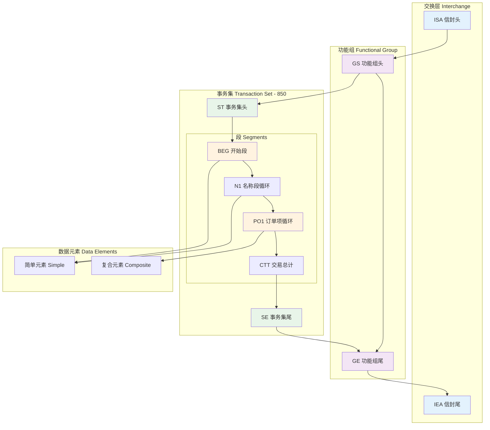
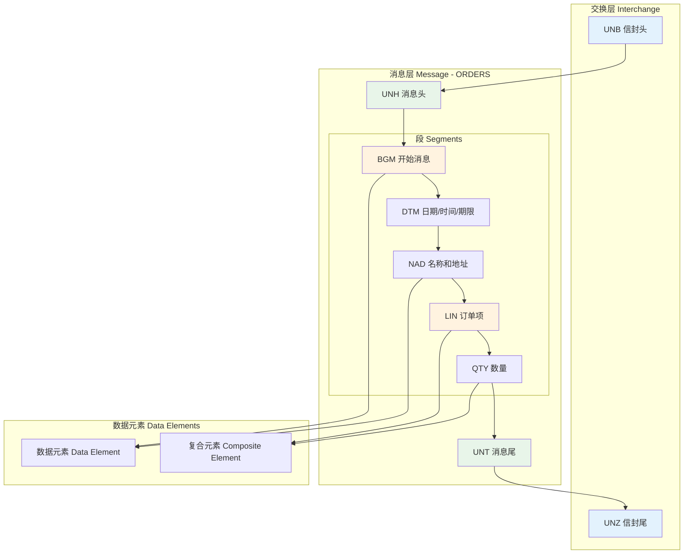
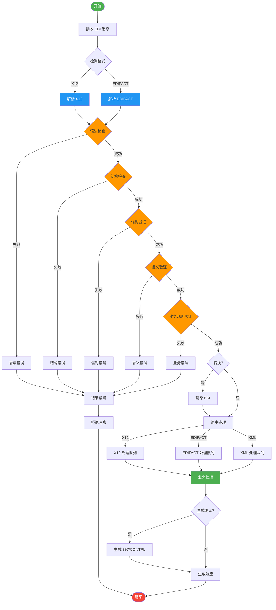

# EDI Schema 形式语法与语义分析视图

**版本**: v1.0
**创建日期**: 2026-02-15
**标准**: ANSI X12, UN/EDIFACT, ISO 9735

---

## 📑 目录

- [EDI Schema 形式语法与语义分析视图](#edi-schema-形式语法与语义分析视图)
  - [📑 目录](#-目录)
  - [1. 形式语法定义 (EBNF)](#1-形式语法定义-ebnf)
    - [1.1 EDI X12 信封结构文法](#11-edi-x12-信封结构文法)
    - [1.2 EDIFACT 信封结构文法](#12-edifact-信封结构文法)
    - [1.3 数据元素文法](#13-数据元素文法)
    - [1.4 事务集/消息文法](#14-事务集消息文法)
  - [2. 类型系统](#2-类型系统)
    - [2.1 EDI X12 数据类型](#21-edi-x12-数据类型)
    - [2.2 EDIFACT 数据类型](#22-edifact-数据类型)
    - [2.3 类型约束与验证规则](#23-类型约束与验证规则)
  - [3. 操作语义](#3-操作语义)
    - [3.1 EDI 解析操作](#31-edi-解析操作)
    - [3.2 EDI 验证操作](#32-edi-验证操作)
    - [3.3 EDI 翻译操作](#33-edi-翻译操作)
  - [4. 指称语义](#4-指称语义)
    - [4.1 EDI 消息语义域](#41-edi-消息语义域)
    - [4.2 语义解释函数](#42-语义解释函数)
    - [4.3 信封嵌套语义](#43-信封嵌套语义)
  - [5. 公理语义](#5-公理语义)
    - [5.1 信封嵌套公理](#51-信封嵌套公理)
    - [5.2 段顺序约束公理](#52-段顺序约束公理)
    - [5.3 业务规则公理](#53-业务规则公理)
  - [6. Mermaid 可视化](#6-mermaid-可视化)
    - [6.1 EDI X12 信封结构](#61-edi-x12-信封结构)
    - [6.2 EDIFACT 信封结构](#62-edifact-信封结构)
    - [6.3 EDI 处理流程](#63-edi-处理流程)

---

## 1. 形式语法定义 (EBNF)

### 1.1 EDI X12 信封结构文法

```ebnf
(* EDI X12 交换层结构 *)
Interchange ::= ISA_Header FunctionalGroup+ IEA_Trailer

(* ISA 信封头 - 106 字符固定长度 *)
ISA_Header ::= 'ISA'
                 AuthorizationQualifier
                 AuthorizationInformation
                 SecurityQualifier
                 SecurityInformation
                 InterchangeIDQualifier1
                 InterchangeSenderID
                 InterchangeIDQualifier2
                 InterchangeReceiverID
                 InterchangeDate
                 InterchangeTime
                 InterchangeControlStandardsID
                 InterchangeControlVersionNumber
                 InterchangeControlNumber
                 AcknowledgmentRequested
                 UsageIndicator
                 ComponentElementSeparator

AuthorizationQualifier      ::= AlphaNumeric{2}
AuthorizationInformation    ::= AlphaNumeric{10}
SecurityQualifier           ::= AlphaNumeric{2}
SecurityInformation         ::= AlphaNumeric{10}
InterchangeIDQualifier1     ::= AlphaNumeric{2}
InterchangeSenderID         ::= AlphaNumeric{15}
InterchangeIDQualifier2     ::= AlphaNumeric{2}
InterchangeReceiverID       ::= AlphaNumeric{15}
InterchangeDate             ::= Digit{6}    (* YYMMDD *)
InterchangeTime             ::= Digit{4}    (* HHMM *)
InterchangeControlStandardsID   ::= 'U'
InterchangeControlVersionNumber ::= '00401' | '00501' | '00601'
InterchangeControlNumber    ::= Digit{9}
AcknowledgmentRequested     ::= '0' | '1'
UsageIndicator              ::= 'P' (* 生产 *) | 'T' (* 测试 *)
ComponentElementSeparator   ::= SpecialChar

(* IEA 信封尾 *)
IEA_Trailer ::= 'IEA'
                  NumberOfIncludedFunctionalGroups
                  InterchangeControlNumber

NumberOfIncludedFunctionalGroups ::= Digit{1,5}

(* GS 功能组头 *)
FunctionalGroup ::= GS_Header TransactionSet+ GE_Trailer

GS_Header ::= 'GS'
                FunctionalIdentifierCode
                ApplicationSenderCode
                ApplicationReceiverCode
                Date
                Time
                GroupControlNumber
                ResponsibleAgencyCode
                VersionReleaseIndustryIdentifier

FunctionalIdentifierCode          ::= AlphaNumeric{2}   (* PO, SH, IN等 *)
ApplicationSenderCode             ::= AlphaNumeric{2,15}
ApplicationReceiverCode           ::= AlphaNumeric{2,15}
Date                              ::= Digit{8}          (* CCYYMMDD *)
Time                              ::= Digit{4,8}        (* HHMM或HHMMSS *)
GroupControlNumber                ::= Digit{1,9}
ResponsibleAgencyCode             ::= 'X' (* X12 *) | 'T' (* TDCC *)
VersionReleaseIndustryIdentifier  ::= AlphaNumeric{1,12} (* 004010, 005010等 *)

(* GE 功能组尾 *)
GE_Trailer ::= 'GE'
                 NumberOfTransactionSetsIncluded
                 GroupControlNumber

NumberOfTransactionSetsIncluded ::= Digit{1,6}

(* ST 事务集头 *)
TransactionSet ::= ST_Header Segment+ ST_Trailer

ST_Header ::= 'ST'
                TransactionSetIdentifierCode
                TransactionSetControlNumber
                ImplementationConventionReference?

TransactionSetIdentifierCode      ::= '850' (* 采购订单 *)
                                    | '855' (* 采购订单确认 *)
                                    | '856' (* 发货通知 *)
                                    | '810' (* 发票 *)
                                    | '820' (* 汇款通知 *)
                                    | '997' (* 功能确认 *)
TransactionSetControlNumber       ::= AlphaNumeric{4,9}
ImplementationConventionReference ::= AlphaNumeric{1,35}

(* SE 事务集尾 *)
ST_Trailer ::= 'SE'
                 NumberOfIncludedSegments
                 TransactionSetControlNumber

NumberOfIncludedSegments ::= Digit{1,10}
```

### 1.2 EDIFACT 信封结构文法

```ebnf
(* EDIFACT 交换层结构 *)
EDIFACT_Interchange ::= UNB_Header Message+ UNZ_Trailer
                      | UNB_Header FunctionalGroupED+ UNZ_Trailer

(* UNB 信封头 *)
UNB_Header ::= 'UNB'
                 SyntaxIdentifier
                 SenderIdentification
                 RecipientIdentification
                 DateTimeOfPreparation
                 InterchangeControlReference
                 RecipientReferencePassword?
                 ApplicationReference?
                 ProcessingPriorityCode?
                 AcknowledgmentRequest?
                 AgreementIdentification?
                 TestIndicator?

SyntaxIdentifier ::= SyntaxVersionNumber ':' SyntaxReleaseNumber
SyntaxVersionNumber   ::= 'UNOA' (* 级别A *)
                        | 'UNOB' (* 级别B *)
                        | 'UNOC' (* 级别C - ISO 8859-1 *)
                        | 'UNOD' (* 级别D - ISO 8859-2 *)
                        | 'UNOE' (* 级别E - ISO 8859-5 *)
                        | 'UNOF' (* 级别F - ISO 8859-7 *)
                        | 'UNOX' (* 级别X - ISO 2022 *)
                        | 'UNOY' (* 级别Y - 任意字节 *)
SyntaxReleaseNumber   ::= Digit{1}

SenderIdentification ::= SenderID ':' SenderCodeQualifier?
SenderID              ::= AlphaNumeric{1,35}
SenderCodeQualifier   ::= AlphaNumeric{1,4}

RecipientIdentification ::= RecipientID ':' RecipientCodeQualifier?
RecipientID              ::= AlphaNumeric{1,35}
RecipientCodeQualifier   ::= AlphaNumeric{1,4}

DateTimeOfPreparation ::= DateOfPreparation ':' TimeOfPreparation
DateOfPreparation     ::= Digit{6} | Digit{8}  (* YYMMDD或CCYYMMDD *)
TimeOfPreparation     ::= Digit{4}              (* HHMM *)

InterchangeControlReference ::= AlphaNumeric{1,14}

TestIndicator ::= '1' (* 测试 *) | Empty (* 生产 *)

(* UNZ 信封尾 *)
UNZ_Trailer ::= 'UNZ'
                  InterchangeControlCount
                  InterchangeControlReference

InterchangeControlCount ::= Digit{1,6}

(* UNG 功能组头 *)
FunctionalGroupED ::= UNG_Header MessageED+ UNE_Trailer

UNG_Header ::= 'UNG'
                 MessageGroupIdentification
                 SenderIdentification
                 RecipientIdentification
                 DateTimeOfPreparation
                 GroupControlReference
                 ControllingAgency?
                 MessageVersionNumber
                 MessageReleaseNumber
                 AssociationAssignedCode?
                 ApplicationPassword?

MessageGroupIdentification  ::= AlphaNumeric{1,6}  (* ORDERS, INVOIC等 *)
GroupControlReference       ::= AlphaNumeric{1,14}
ControllingAgency           ::= AlphaNumeric{1,3}   (* UN, OJ等 *)
MessageVersionNumber        ::= AlphaNumeric{1,3}   (* D, 2, 3等 *)
MessageReleaseNumber        ::= AlphaNumeric{1,3}   (* 96A, 01B, 23A等 *)
AssociationAssignedCode     ::= AlphaNumeric{1,6}

(* UNE 功能组尾 *)
UNE_Trailer ::= 'UNE'
                  NumberOfMessagesInGroup
                  GroupControlReference

NumberOfMessagesInGroup ::= Digit{1,6}

(* UNH 消息头 *)
MessageED ::= UNH_Header SegmentED+ UNT_Trailer

UNH_Header ::= 'UNH'
                 MessageReferenceNumber
                 MessageIdentifier
                 CommonAccessReference?
                 StatusOfTransfer?
                 MessageSubsetIdentification?
                 MessageImplementationGuidelineIdentification?
                 ScenarioIdentification?

MessageReferenceNumber ::= AlphaNumeric{1,14}

MessageIdentifier ::= MessageType ':' MessageVersionNumber ':'
                      MessageReleaseNumber ':' ControllingAgency
                      (':' AssociationAssignedCode)?

MessageType  ::= AlphaNumeric{1,6}  (* ORDERS, DESADV, INVOIC等 *)

(* UNT 消息尾 *)
UNT_Trailer ::= 'UNT'
                  NumberOfSegmentsInMessage
                  MessageReferenceNumber

NumberOfSegmentsInMessage ::= Digit{1,6}
```

### 1.3 数据元素文法

```ebnf
(* ===== 简单数据元素 ===== *)
SimpleDataElement ::= ElementValue

ElementValue ::= AlphaNumeric{1,MaxLength}

(* EDI X12 数据元素类型 *)
X12_Element ::= StringElement
              | DecimalElement
              | IntegerElement
              | DateElement
              | TimeElement
              | IdentifierElement
              | BinaryElement

StringElement       ::= AlphaNumeric{1,MaxLength}
DecimalElement      ::= Sign? Digit+ ('.' Digit*)?
IntegerElement      ::= Sign? Digit+
DateElement         ::= Digit{6} | Digit{8}  (* YYMMDD或CCYYMMDD *)
TimeElement         ::= Digit{4} | Digit{6} | Digit{7}  (* HHMM, HHMMSS, HHMMSSD *)
IdentifierElement   ::= AlphaNumeric{1,MaxLength}
BinaryElement       ::= BinaryData

Sign ::= '+' | '-'

(* EDIFACT 数据元素类型 *)
EDIFACT_Element ::= AlphaDataElement
                  | NumericDataElement
                  | AlphaNumericDataElement

AlphaDataElement      ::= Alpha{1,MaxLength}
NumericDataElement    ::= Digit{1,MaxLength}
AlphaNumericDataElement ::= AlphaNumeric{1,MaxLength}

(* ===== 复合数据元素 ===== *)
CompositeDataElement ::= SimpleDataElement
                         (ComponentDataElementSeparator SimpleDataElement)*

ComponentDataElementSeparator ::= ':'

(* ===== 段结构 ===== *)
Segment ::= SegmentTag DataElementSeparator
            (SimpleDataElement | CompositeDataElement)
            (DataElementSeparator (SimpleDataElement | CompositeDataElement))*
            SegmentTerminator

SegmentTag ::= Alpha{2,3}  (* EDI X12: 2-3字符 *)
             | Alpha{3}    (* EDIFACT: 3字符 *)

DataElementSeparator ::= '*' (* EDI X12 *)
                       | '+' (* EDIFACT *)

SegmentTerminator    ::= '~' (* EDI X12 *)
                       | ''' (* EDIFACT *)

(* 常用段定义 *)
Segment_850_BEG ::= 'BEG' DataElementSeparator
                      TransactionSetPurposeCode
                      DataElementSeparator
                      PurchaseOrderTypeCode
                      DataElementSeparator
                      PurchaseOrderNumber
                      (DataElementSeparator ReleaseNumber)?
                      (DataElementSeparator Date)?

Segment_856_BSN ::= 'BSN' DataElementSeparator
                      TransactionSetPurposeCode
                      DataElementSeparator
                      ShipmentIdentification
                      DataElementSeparator
                      Date
                      DataElementSeparator
                      Time
                      (DataElementSeparator HierarchicalStructureCode)?

Segment_ORDERS_BGM ::= 'BGM' DataElementSeparator
                         DocumentMessageName
                         (DataElementSeparator DocumentMessageNumber)?
                         (DataElementSeparator MessageFunctionCode)?
                         (DataElementSeparator ResponseTypeCode)?

Segment_DESADV_BGM ::= 'BGM' DataElementSeparator
                         DocumentMessageName
                         (DataElementSeparator DespatchAdviceNumber)?
```

### 1.4 事务集/消息文法

```ebnf
(* ===== EDI X12 850 采购订单事务集 ===== *)
TransactionSet_850 ::= ST_Header
                         BEG_Segment
                         CUR_Segment?
                         REF_Segment*
                         PER_Segment*
                         N1_Loop*
                         PO1_Loop+
                         CTT_Segment?
                         AMT_Segment?
                       SE_Trailer

BEG_Segment ::= 'BEG' '*' TransactionSetPurposeCode '*'
                PurchaseOrderTypeCode '*' PurchaseOrderNumber
                ('*' ReleaseNumber)? ('*' Date)? '~'

TransactionSetPurposeCode ::= '00' (* 原始 *)
                            | '01' (* 取消 *)
                            | '05' (* 替换 *)

PurchaseOrderTypeCode ::= 'NE' (* 新订单 *)
                        | 'DS' (* 直运 *)
                        | 'SA' (* 常规订单 *)

N1_Loop ::= N1_Segment N2_Segment? N3_Segment* N4_Segment? REF_Segment* PER_Segment*

N1_Segment ::= 'N1' '*' EntityIdentifierCode '*'
               (Name)? ('*' IdentificationCodeQualifier)?
               ('*' IdentificationCode)? '~'

EntityIdentifierCode ::= 'BT' (* 账单至 *)
                       | 'ST' (* 运送至 *)
                       | 'BY' (* 买方 *)
                       | 'SE' (* 卖方 *)

PO1_Loop ::= PO1_Segment PO2_Segment? PID_Segment*
             ACK_Segment* QTY_Segment* SCH_Loop*

PO1_Segment ::= 'PO1' '*' (AssignedIdentification)? '*'
                (Quantity)? '*' (UnitOfMeasure)? '*'
                (UnitPrice)? '*' (BasisOfUnitPriceCode)? '*'
                (ProductIDQualifier '*' ProductID)* '~'

CTT_Segment ::= 'CTT' '*' NumberOfLineItems
                ('*' HashTotal)? '~'

(* ===== EDI X12 856 发货通知事务集 ===== *)
TransactionSet_856 ::= ST_Header
                         BSN_Segment
                         HLS_Loop+
                         SE_Trailer

BSN_Segment ::= 'BSN' '*' TransactionSetPurposeCode '*'
                ShipmentIdentification '*' Date '*' Time
                ('*' HierarchicalStructureCode)? '~'

HLS_Loop ::= HL_Segment (LIN_Segment | SN1_Segment)?
             PRF_Segment* TD1_Segment* REF_Segment* DTM_Segment*

HL_Segment ::= 'HL' '*' HierarchicalIDNumber '*'
               (HierarchicalParentIDNumber)? '*'
               HierarchicalLevelCode '*'
               (HierarchicalChildCode)? '~'

HierarchicalLevelCode ::= 'S' (* 发货 *)
                        | 'O' (* 订单 *)
                        | 'P' (* 包装 *)
                        | 'I' (* 物品 *)

(* ===== EDIFACT ORDERS 订单消息 ===== *)
Message_ORDERS ::= UNH_Header
                     BGM_Segment
                     DTM_Segment*
                     PAI_Segment?
                     ALI_Segment*
                     FTX_Segment*
                     SegmentGroup1*
                     SegmentGroup2*
                     SegmentGroup6+
                     SegmentGroup25*
                     SegmentGroup38*
                   UNT_Trailer

SegmentGroup1 ::= RFF_Segment DTM_Segment*

SegmentGroup2 ::= NAD_Segment LOC_Segment* FTX_Segment* SegmentGroup3*

SegmentGroup3 ::= CTA_Segment COM_Segment*

SegmentGroup6 ::= LIN_Segment PIA_Segment* IMD_Segment* MEA_Segment*
                  QTY_Segment* PCD_Segment* ALI_Segment* DTM_Segment*
                  FTX_Segment* SegmentGroup7* SegmentGroup8*
                  SegmentGroup25* SegmentGroup35*

SegmentGroup7 ::= RFF_Segment DTM_Segment*

SegmentGroup8 ::= CUX_Segment DTM_Segment?

SegmentGroup25 ::= PRC_Segment APR_Segment* RNG_Segment* DTM_Segment*

SegmentGroup35 ::= LOC_Segment QTY_Segment* DTM_Segment*

BGM_Segment ::= 'BGM' '+' DocumentMessageName
                ('+' DocumentMessageNumber)?
                ('+' MessageFunctionCode)?
                ('+' ResponseTypeCode)? "'"

DocumentMessageName ::= '220' (* 采购订单 *)

MessageFunctionCode ::= '9' (* 原始 *)
                      | '1' (* 取消 *)
                      | '5' (* 替换 *)

(* ===== EDIFACT DESADV 发货通知消息 ===== *)
Message_DESADV ::= UNH_Header
                     BGM_Segment
                     DTM_Segment+
                     ALI_Segment*
                     MEA_Segment*
                     MOA_Segment*
                     SegmentGroup1*
                     SegmentGroup2*
                     SegmentGroup10+
                   UNT_Trailer

SegmentGroup10 ::= CPS_Segment PAC_Segment* SegmentGroup11*

SegmentGroup11 ::= LIN_Segment PIA_Segment* IMD_Segment* MEA_Segment*
                   QTY_Segment* ALI_Segment* DTM_Segment*
                   FTX_Segment* LOC_Segment* SegmentGroup13*

SegmentGroup13 ::= RFF_Segment DTM_Segment*

CPS_Segment ::= 'CPS' '+' HierarchicalIDNumber
                ('+' HierarchicalParentID)?
                ('+' PackagingLevelCode)? "'"
```

---

## 2. 类型系统

### 2.1 EDI X12 数据类型

```haskell
-- EDI X12 数据类型层次结构
data X12DataType
  = StringType StringConstraint
  | DecimalType DecimalConstraint
  | IntegerType IntegerConstraint
  | DateType DateFormat
  | TimeType TimeFormat
  | IdentifierType CodeSetConstraint
  | BinaryType BinaryConstraint
  | CompositeType [X12DataType]

data StringConstraint = StringConstraint
  { minLength :: Int
  , maxLength :: Int
  , isFixed   :: Bool
  }

data DecimalConstraint = DecimalConstraint
  { maxDigits        :: Int
  , fractionDigits   :: Int
  , minInclusive     :: Maybe Decimal
  , maxInclusive     :: Maybe Decimal
  }

data IntegerConstraint = IntegerConstraint
  { minValue :: Maybe Integer
  , maxValue :: Maybe Integer
  }

data DateFormat
  = DateCCYYMMDD  -- CCYYMMDD
  | DateYYMMDD    -- YYMMDD

data TimeFormat
  = TimeHHMM      -- HHMM
  | TimeHHMMSS    -- HHMMSS
  | TimeHHMMSSDD  -- HHMMSSDD (DD = 1/100秒)

data CodeSetConstraint = CodeSetConstraint
  { codeSetName    :: String
  , validCodes     :: [String]
  , isExternal     :: Bool
  }

data BinaryConstraint = BinaryConstraint
  { maxLength :: Int
  , encoding  :: BinaryEncoding
  }

data BinaryEncoding = Base64 | HexBinary | Binary

-- EDI X12 标准数据元素类型定义
-- AN - 字母数字型
anType :: Int -> X12DataType
anType maxLen = StringType $ StringConstraint 1 maxLen False

-- ID - 标识符型
idType :: Int -> [String] -> X12DataType
idType maxLen codes = IdentifierType $ CodeSetConstraint "Standard" codes False

-- Nn - 数值型（隐含小数点）
nType :: Int -> Int -> X12DataType
nType digits frac = DecimalType $ DecimalConstraint digits frac Nothing Nothing

-- R - 十进制数值型
rType :: Int -> Int -> X12DataType
rType digits frac = DecimalType $ DecimalConstraint digits frac Nothing Nothing

-- DT - 日期型
dtType :: DateFormat -> X12DataType
dtType = DateType

-- TM - 时间型
tmType :: TimeFormat -> X12DataType
tmType = TimeType

-- B - 二进制型
bType :: Int -> X12DataType
bType maxLen = BinaryType $ BinaryConstraint maxLen Binary
```

### 2.2 EDIFACT 数据类型

```haskell
-- EDIFACT 数据类型层次结构（基于 ISO 9735）
data EDIFACTDataType
  = AlphaType AlphaConstraint          -- 'a' - 字母型
  | NumericType NumericConstraint      -- 'n' - 数值型
  | AlphaNumType AlphaNumConstraint    -- 'an' - 字母数字型
  deriving (Eq, Show)

data AlphaConstraint = AlphaConstraint
  { alphaMinLength :: Int
  , alphaMaxLength :: Int
  }

data NumericConstraint = NumericConstraint
  { numericMinLength :: Int
  , numericMaxLength :: Int
  , impliedDecimal   :: Maybe Int  -- 隐含小数位
  }

data AlphaNumConstraint = AlphaNumConstraint
  { anMinLength :: Int
  , anMaxLength :: Int
  }

-- EDIFACT 标准数据元素类型定义
-- A - 字母型（仅大写字母和空格）
aType :: Int -> EDIFACTDataType
aType len = AlphaType $ AlphaConstraint 1 len

-- N - 数值型（隐含小数点）
nType :: Int -> Maybe Int -> EDIFACTDataType
nType len dec = NumericType $ NumericConstraint 1 len dec

-- An - 字母数字型
anType :: Int -> EDIFACTDataType
anType len = AlphaNumType $ AlphaNumConstraint 1 len

-- 复合数据元素类型
data CompositeElement = CompositeElement
  { ceTag      :: String
  , components :: [EDIFACTDataType]
  }

-- 标准EDIFACT数据元素示例
-- 1153 - 参考限定符 (an..3)
e1153 :: EDIFACTDataType
e1153 = anType 3

-- 3035 - 参与方限定符 (an..3)
e3035 :: EDIFACTDataType
e3035 = anType 3

-- 5004 - 货币金额 (n..18)
e5004 :: EDIFACTDataType
e5004 = nType 18 Nothing

-- 2379 - 日期/时间/期限格式限定符 (an..3)
e2379 :: EDIFACTDataType
e2379 = anType 3

-- EDIFACT 代码集
data EDIFACTCodeSet = EDIFACTCodeSet
  { codeSetId    :: String
  , codeSetName  :: String
  , codeValues   :: [(String, String)]  -- (代码值, 描述)
  }

-- 常用代码集示例
quantityQualifierCodes :: EDIFACTCodeSet
quantityQualifierCodes = EDIFACTCodeSet
  { codeSetId   = "6063"
  , codeSetName = "Quantity Qualifier"
  , codeValues  = [ ("21", "Ordered quantity")
                  , ("46", "Despatch quantity")
                  , ("12", "Minimum quantity")
                  , ("13", "Maximum quantity")
                  , ("61", "Quantity to be delivered")
                  ]
  }
```

### 2.3 类型约束与验证规则

```haskell
-- 类型验证函数
class Validatable a where
  validate :: a -> String -> Either ValidationError ()

instance Validatable X12DataType where
  validate (StringType constraint) value =
    let len = length value
    in if len >= minLength constraint && len <= maxLength constraint
       then Right ()
       else Left $ ValidationError
         { errorCode = "STRING_LENGTH_ERROR"
         , errorMessage = "String length " ++ show len ++
                          " not in range [" ++ show (minLength constraint) ++
                          "," ++ show (maxLength constraint) ++ "]"
         }

  validate (DecimalType constraint) value =
    case parseDecimal value of
      Nothing -> Left $ ValidationError "DECIMAL_FORMAT_ERROR" "Invalid decimal format"
      Just d ->
        let digits = countDigits d
            frac = countFractionDigits d
        in if digits <= maxDigits constraint && frac <= fractionDigits constraint
           then Right ()
           else Left $ ValidationError
             { errorCode = "DECIMAL_PRECISION_ERROR"
             , errorMessage = "Decimal precision exceeds limit"
             }

  validate (DateType format) value =
    case format of
      DateCCYYMMDD -> validateDatePattern "[0-9]{8}" value
      DateYYMMDD   -> validateDatePattern "[0-9]{6}" value

  validate (IdentifierType constraint) value =
    if isExternal constraint || value `elem` validCodes constraint
    then Right ()
    else Left $ ValidationError
      { errorCode = "INVALID_CODE"
      , errorMessage = "Value '" ++ value ++ "' not in valid code set"
      }

-- 复合元素验证
validateComposite :: CompositeElement -> [String] -> Either [ValidationError] ()
validateComposite ce values =
  let results = zipWith validate (components ce) values
      errors = lefts results
  in if null errors
     then Right ()
     else Left errors

-- 数据元素长度约束验证
data LengthConstraint
  = Fixed Int           -- n           - 固定长度
  | MinMax Int Int      -- n..m        - 最小最大长度
  | Min Int             -- n..         - 最小长度无上限
  deriving (Eq, Show)

validateLength :: LengthConstraint -> String -> Either ValidationError ()
validateLength (Fixed n) value
  | length value == n = Right ()
  | otherwise = Left $ ValidationError
      "LENGTH_ERROR"
      ("Expected length " ++ show n ++ ", got " ++ show (length value))

validateLength (MinMax minLen maxLen) value
  | len >= minLen && len <= maxLen = Right ()
  | otherwise = Left $ ValidationError
      "LENGTH_ERROR"
      ("Length " ++ show len ++ " not in range [" ++
       show minLen ++ "," ++ show maxLen ++ "]")
  where len = length value

validateLength (Min minLen) value
  | length value >= minLen = Right ()
  | otherwise = Left $ ValidationError
      "LENGTH_ERROR"
      ("Length " ++ show (length value) ++ " less than minimum " ++ show minLen)
```

---

## 3. 操作语义

### 3.1 EDI 解析操作

```haskell
-- EDI 解析状态
data ParseState = ParseState
  { inputStream    :: String
  , position       :: Int
  , currentSegment :: Maybe Segment
  , segmentCount   :: Int
  , syntaxVersion  :: SyntaxVersion
  , errors         :: [ParseError]
  }

data SyntaxVersion
  = X12Version String      -- 00401, 00501等
  | EDIFACTVersion String  -- UNOA, UNOB等
  deriving (Eq, Show)

-- 解析结果
data ParseResult a
  = ParseSuccess a ParseState
  | ParseFailure [ParseError]

newtype Parser a = Parser (ParseState -> ParseResult a)

instance Functor Parser where
  fmap f (Parser p) = Parser $ \s -> case p s of
    ParseSuccess a s' -> ParseSuccess (f a) s'
    ParseFailure e    -> ParseFailure e

instance Applicative Parser where
  pure a = Parser $ \s -> ParseSuccess a s
  (Parser pf) <*> (Parser px) = Parser $ \s -> case pf s of
    ParseFailure e -> ParseFailure e
    ParseSuccess f s' -> case px s' of
      ParseFailure e' -> ParseFailure e'
      ParseSuccess x s'' -> ParseSuccess (f x) s''

instance Monad Parser where
  return = pure
  (Parser p) >>= f = Parser $ \s -> case p s of
    ParseFailure e -> ParseFailure e
    ParseSuccess a s' -> let (Parser p') = f a in p' s'

-- 基础解析操作
parseChar :: Char -> Parser Char
parseChar c = Parser $ \s ->
  let input = inputStream s
      pos = position s
  in if pos < length input && input !! pos == c
     then ParseSuccess c (s { position = pos + 1 })
     else ParseFailure [ParseError pos $ "Expected '" ++ [c] ++ "'"]

parseSegmentTag :: Parser String
parseSegmentTag = Parser $ \s ->
  let input = inputStream s
      pos = position s
      tag = takeWhile isAlpha (drop pos input)
  in if length tag >= 2 && length tag <= 3
     then ParseSuccess tag (s { position = pos + length tag })
     else ParseFailure [ParseError pos "Invalid segment tag"]

-- EDI X12 解析器
parseX12 :: Parser X12Interchange
parseX12 = do
  isa <- parseISA
  groups <- many parseFunctionalGroup
  iea <- parseIEA
  return $ X12Interchange isa groups iea

parseISA :: Parser ISAHeader
parseISA = do
  _ <- parseString "ISA"
  authQualifier <- parseElement 2
  authInfo <- parseElement 10
  secQualifier <- parseElement 2
  secInfo <- parseElement 10
  senderQualifier <- parseElement 2
  senderId <- parseElement 15
  receiverQualifier <- parseElement 2
  receiverId <- parseElement 15
  date <- parseElement 6
  time <- parseElement 4
  standardsId <- parseElement 1
  version <- parseElement 5
  controlNum <- parseElement 9
  ackRequested <- parseElement 1
  usage <- parseElement 1
  componentSep <- parseChar
  return $ ISAHeader
    { authorizationQualifier = authQualifier
    , authorizationInformation = authInfo
    , securityQualifier = secQualifier
    , securityInformation = secInfo
    , interchangeSenderQualifier = senderQualifier
    , interchangeSenderID = trim senderId
    , interchangeReceiverQualifier = receiverQualifier
    , interchangeReceiverID = trim receiverId
    , interchangeDate = date
    , interchangeTime = time
    , interchangeControlStandardsID = standardsId
    , interchangeControlVersionNumber = version
    , interchangeControlNumber = controlNum
    , acknowledgmentRequested = ackRequested
    , usageIndicator = usage
    , componentElementSeparator = componentSep
    }

-- EDIFACT 解析器
parseEDIFACT :: Parser EDIFACTInterchange
parseEDIFACT = do
  unb <- parseUNB
  messages <- many parseMessageED
  unz <- parseUNZ
  return $ EDIFACTInterchange unb messages unz

parseUNB :: Parser UNBHeader
parseUNB = do
  _ <- parseString "UNB"
  _ <- parseElementSeparator
  syntaxId <- parseComposite
  _ <- parseElementSeparator
  sender <- parseComposite
  _ <- parseElementSeparator
  recipient <- parseComposite
  _ <- parseElementSeparator
  dateTime <- parseComposite
  _ <- parseElementSeparator
  controlRef <- parseElement
  -- 可选字段
  return $ UNBHeader
    { syntaxIdentifier = parseSyntaxId syntaxId
    , senderIdentification = parsePartyId sender
    , recipientIdentification = parsePartyId recipient
    , dateTimeOfPreparation = parseDateTime dateTime
    , interchangeControlReference = controlRef
    }

-- 分段解析器（适用于大文件流式解析）
segmentParser :: Parser Segment
segmentParser = do
  tag <- parseSegmentTag
  _ <- parseElementSeparator
  elements <- parseElements
  _ <- parseSegmentTerminator
  return $ Segment tag elements

parseElements :: Parser [Element]
parseElements = do
  first <- parseElement
  rest <- many (parseElementSeparator >> parseElement)
  return (first : rest)

-- 解析错误类型
data ParseError = ParseError
  { errorPosition :: Int
  , errorMessage  :: String
  } deriving (Eq, Show)
```

### 3.2 EDI 验证操作

```haskell
-- 验证规则定义
data ValidationRule = ValidationRule
  { ruleId       :: String
  , ruleName     :: String
  , ruleType     :: RuleType
  , ruleCheck    :: EDIInterchange -> [ValidationError]
  , ruleSeverity :: Severity
  }

data RuleType
  = SyntaxRule          -- 语法规则（ISO 9735）
  | StructureRule       -- 结构规则
  | BusinessRule        -- 业务规则
  | CodeSetRule         -- 代码集规则
  | CrossSegmentRule    -- 跨段规则
  deriving (Eq, Show)

data Severity = Error | Warning | Info
  deriving (Eq, Show)

data ValidationError = ValidationError
  { validationRuleId   :: String
  , validationMessage  :: String
  , validationLocation :: Location
  , validationSeverity :: Severity
  } deriving (Eq, Show)

data Location
  = InterchangeLocation
  | GroupLocation Int
  | TransactionLocation Int Int
  | SegmentLocation Int Int Int String  -- group, trans, seg, tag
  | ElementLocation Int Int Int Int String -- group, trans, seg, elem, tag
  deriving (Eq, Show)

-- 语法验证规则（ISO 9735）
syntaxValidationRules :: [ValidationRule]
syntaxValidationRules =
  [ validateControlCharacters
  , validateSegmentTerminator
  , validateDataElementSeparator
  , validateSegmentOrder
  , validateEnvelopeNesting
  ]

-- 控制字符验证
validateControlCharacters :: ValidationRule
validateControlCharacters = ValidationRule
  { ruleId = "SYN001"
  , ruleName = "Control Characters Validation"
  , ruleType = SyntaxRule
  , ruleCheck = checkControlChars
  , ruleSeverity = Error
  }
  where
    checkControlChars interchange =
      case syntaxVersion interchange of
        EDIFACTVersion "UNOA" -> checkUNOA interchange
        EDIFACTVersion "UNOB" -> checkUNOB interchange
        _ -> []

    checkUNOA interchange =
      let content = interchangeContent interchange
          invalidChars = filter (not . isUNOAChar) content
      in if null invalidChars
         then []
         else [ValidationError "SYN001"
               ("Invalid characters for UNOA: " ++ show invalidChars)
               InterchangeLocation Error]

    isUNOAChar c = isUpper c || isDigit c || c `elem` " .,()-/=?:\"'"
    isUNOBChar c = isUNOAChar c || isLower c

-- 信封嵌套验证
validateEnvelopeNesting :: ValidationRule
validateEnvelopeNesting = ValidationRule
  { ruleId = "SYN002"
  , ruleName = "Envelope Nesting Validation"
  , ruleType = StructureRule
  , ruleCheck = checkNesting
  , ruleSeverity = Error
  }
  where
    checkNesting :: EDIInterchange -> [ValidationError]
    checkNesting interchange =
      case interchange of
        X12Interchange isa groups iea ->
          let groupCount = length groups
              ieaCount = read (numberOfIncludedFunctionalGroups iea) :: Int
          in if groupCount == ieaCount
             then concatMap checkGroupNesting groups
             else [ValidationError "SYN002"
                   ("Group count mismatch: expected " ++ show ieaCount ++
                    ", found " ++ show groupCount)
                   InterchangeLocation Error]

        EDIFACTInterchange unb messages unz ->
          let msgCount = length messages
              unzCount = read (interchangeControlCount unz) :: Int
          in if msgCount == unzCount
             then concatMap checkMessageNesting messages
             else [ValidationError "SYN002"
                   ("Message count mismatch: expected " ++ show unzCount ++
                    ", found " ++ show msgCount)
                   InterchangeLocation Error]

    checkGroupNesting group =
      let sets = transactionSets group
          geCount = read (numberOfTransactionSetsIncluded (geTrailer group)) :: Int
      in if length sets == geCount
         then []
         else [ValidationError "SYN002"
               ("Transaction set count mismatch")
               (GroupLocation (groupControlNumber group))
               Error]

-- 事务集完整性验证（850示例）
validate850TransactionSet :: TransactionSet -> [ValidationError]
validate850TransactionSet ts =
  let segments = transactionSetSegments ts
      errors = catMaybes
        [ validateBEGPresence segments
        , validatePO1Presence segments
        , validateN1Presence segments
        , validateCTTConsistency segments
        , validateSECount segments
        ]
  in errors

validateBEGPresence :: [Segment] -> Maybe ValidationError
validateBEGPresence segments =
  case find (\s -> segmentTag s == "BEG") segments of
    Nothing -> Just $ ValidationError "TS850001"
      "Missing required BEG segment"
      (SegmentLocation 0 0 0 "BEG")
      Error
    Just seg -> validateBEGContent seg

validateBEGContent :: Segment -> Maybe ValidationError
validateBEGContent seg =
  let elements = segmentElements seg
  in if length elements >= 3
     then case elements !! 0 of  -- Transaction Set Purpose Code
       Element "" -> Just $ ValidationError "TS850002"
         "BEG01 (Transaction Set Purpose Code) is required"
         (ElementLocation 0 0 0 0 "BEG")
         Error
       Element val | val `notElem` ["00", "01", "05"] -> Just $ ValidationError "TS850003"
         ("Invalid BEG01 value: " ++ val)
         (ElementLocation 0 0 0 0 "BEG")
         Error
       _ -> case elements !! 2 of  -- Purchase Order Number
         Element "" -> Just $ ValidationError "TS850004"
           "BEG03 (Purchase Order Number) is required"
           (ElementLocation 0 0 0 2 "BEG")
           Error
         _ -> Nothing
     else Just $ ValidationError "TS850005"
       "BEG segment requires at least 3 elements"
       (SegmentLocation 0 0 0 "BEG")
       Error

-- 代码集验证
validateCodeSet :: String -> String -> [String] -> Maybe ValidationError
validateCodeSet elementId value validCodes =
  if value `elem` validCodes
  then Nothing
  else Just $ ValidationError "COD001"
    ("Invalid code '" ++ value ++ "' for element " ++ elementId ++
     ". Valid codes: " ++ intercalate ", " validCodes)
    (ElementLocation 0 0 0 0 elementId)
    Error

-- 事务集850的代码集
transactionSetPurposeCodes :: [String]
transactionSetPurposeCodes = ["00", "01", "05", "06", "07"]

purchaseOrderTypeCodes :: [String]
purchaseOrderTypeCodes = ["NE", "DS", "SA", "BP", "RC"]

entityIdentifierCodes :: [String]
entityIdentifierCodes = ["BT", "ST", "BY", "SE", "VN", "CA", "OB"]

-- 验证状态转换（小步骤操作语义）
data ValidationState = ValidationState
  { ediMessage       :: EDIInterchange
  , validationQueue  :: [ValidationRule]
  , validationErrors :: [ValidationError]
  , isComplete       :: Bool
  }

stepValidation :: ValidationState -> ValidationState
stepValidation state =
  case validationQueue state of
    [] -> state { isComplete = True }
    (rule:rest) ->
      let errors = ruleCheck rule (ediMessage state)
      in state
        { validationQueue = rest
        , validationErrors = validationErrors state ++ errors
        }

runValidation :: ValidationState -> ValidationState
runValidation state
  | isComplete state = state
  | otherwise = runValidation (stepValidation state)
```

### 3.3 EDI 翻译操作

```haskell
-- EDI 翻译操作语义
data TranslationDirection
  = X12ToEDIFACT
  | EDIFACTToX12
  | X12ToXML
  | EDIFACTToXML
  | XMLToX12
  | XMLToEDIFACT
  deriving (Eq, Show)

data TranslationContext = TranslationContext
  { direction     :: TranslationDirection
  , sourceVersion :: String
  , targetVersion :: String
  , mappingRules  :: MappingRuleSet
  , options       :: TranslationOptions
  }

data TranslationOptions = TranslationOptions
  { preserveComments    :: Bool
  , strictValidation    :: Bool
  , generateAcknowledgment :: Bool
  , dateFormatConversion :: DateFormatConversion
  }

data DateFormatConversion
  = ConvertToCCYYMMDD
  | ConvertToYYMMDD
  | PreserveOriginal

data MappingRuleSet = MappingRuleSet
  { segmentMappings    :: Map String String      -- 源段 -> 目标段
  , elementMappings    :: Map (String, Int) (String, Int)  -- (源段,源元素) -> (目标段,目标元素)
  , codeSetMappings    :: Map String (Map String String)  -- 代码集映射
  , defaultValues      :: Map String String
  }

-- EDI X12 850 到 EDIFACT ORDERS 的翻译
translate850ToORDERS :: X12TransactionSet -> TranslationContext -> Either [TranslationError] EDIFACTMessage
translate850ToORDERS x12 ctx = do
  -- 验证源消息
  let validationErrors = validate850TransactionSet x12
  unless (null validationErrors) $ Left (map toTranslationError validationErrors)

  -- 创建目标消息结构
  unh <- createUNHHeader x12
  bgm <- translateBEGBGM x12
  dtmList <- translateDTMSegments x12
  nadList <- translateN1NAD x12
  linList <- translatePO1LIN x12
  unt <- createUNTTrailer unh (length segments)

  return $ EDIFACTMessage
    { unhHeader = unh
    , segments = [bgm] ++ dtmList ++ nadList ++ linList ++ [unt]
    , untTrailer = unt
    }

-- BEG -> BGM 翻译
translateBEGBGM :: X12TransactionSet -> Either TranslationError BGM_Segment
translateBEGBGM x12 = do
  let beg = findSegment "BEG" x12
  case beg of
    Nothing -> Left $ TranslationError "TRAN001" "Missing BEG segment"
    Just seg -> do
      let purposeCode = getElement 0 seg  -- BEG01
          poTypeCode = getElement 1 seg   -- BEG02
          poNumber = getElement 2 seg     -- BEG03
          date = getElement 4 seg         -- BEG05

      -- 映射事务集目的代码到文档消息功能代码
      let msgFunctionCode = case purposeCode of
            "00" -> "9"   -- 原始 -> 原始
            "01" -> "1"   -- 取消 -> 取消
            "05" -> "5"   -- 替换 -> 替换
            _    -> "9"

      return $ BGM_Segment
        { documentMessageName = "220"  -- 采购订单
        , documentMessageNumber = poNumber
        , messageFunctionCode = Just msgFunctionCode
        , responseTypeCode = Just "AC"  -- 确认
        }

-- N1 -> NAD 翻译
translateN1NAD :: X12TransactionSet -> Either TranslationError [NAD_Segment]
translateN1NAD x12 = do
  let n1Segments = findSegments "N1" x12
  mapM translateN1Segment n1Segments
  where
    translateN1Segment n1 = do
      let entityCode = getElement 0 n1
          name = getElement 1 n1
          idQualifier = getElement 2 n1
          idCode = getElement 3 n1

      -- 映射实体标识符到参与方限定符
      let partyQualifier = case entityCode of
            "BT" -> "BP"  -- 账单至
            "ST" -> "DP"  -- 运送至
            "BY" -> "BY"  -- 买方
            "SE" -> "SU"  -- 卖方
            "VN" -> "SU"  -- 供应商
            _    -> "ZZ"  -- 互定义

      return $ NAD_Segment
        { partyQualifier = partyQualifier
        , partyIdentification = if null idCode
                                then Nothing
                                else Just (idCode, idQualifier)
        , partyName = if null name then Nothing else Just name
        }

-- PO1 -> LIN 翻译
translatePO1LIN :: X12TransactionSet -> Either TranslationError [LIN_Segment]
translatePO1LIN x12 = do
  let po1Segments = findSegments "PO1" x12
      ctt = findSegment "CTT" x12
      expectedCount = maybe 0 (read . getElement 0) ctt

  if length po1Segments /= expectedCount
    then Left $ TranslationError "TRAN002"
         ("CTT count mismatch: expected " ++ show expectedCount ++
          ", found " ++ show (length po1Segments))
    else mapM translatePO1Segment (zip [1..] po1Segments)
  where
    translatePO1Segment (lineNum, po1) = do
      let assignedId = getElement 0 po1
          quantity = getElement 1 po1
          uom = getElement 2 po1
          unitPrice = getElement 3 po1
          productIdQualifier = getElement 4 po1
          productId = getElement 5 po1

      return $ LIN_Segment
        { lineItemNumber = Just (show lineNum)
        , itemNumberIdentification =
            if null productId
            then Nothing
            else Just $ ItemNumberIdentification
              { itemNumberTypeCodeQualifier =
                  translateProductIdQualifier productIdQualifier
              , itemNumber = productId
              }
        , quantityDetails = Just $ QuantityDetails
          { quantityTypeCodeQualifier = "21"  -- 订购数量
          , quantity = read quantity
          , measureUnitCode = translateUOM uom
          }
        }

    translateProductIdQualifier :: String -> String
    translateProductIdQualifier q = case q of
      "VN" -> "VN"  -- 供应商零件号
      "BP" -> "IN"  -- 买方零件号
      "UP" -> "SRV" -- UPC
      _    -> "ZZ"  -- 互定义

    translateUOM :: String -> String
    translateUOM uom = case uom of
      "EA" -> "EA"  -- 每个
      "BX" -> "BX"  -- 箱
      "CA" -> "CS"  -- 箱
      "PL" -> "PF"  -- 托盘
      "KG" -> "KGM" -- 千克
      _    -> uom

-- 翻译操作的组合语义
composeTranslation :: (a -> Either e b) -> (b -> Either e c) -> (a -> Either e c)
composeTranslation f g = \x -> case f x of
  Left e  -> Left e
  Right y -> g y

-- 并行翻译（批量处理）
parallelTranslate :: [X12TransactionSet] -> TranslationContext -> [Either [TranslationError] EDIFACTMessage]
parallelTranslate x12s ctx = map (\x12 -> translate850ToORDERS x12 ctx) x12s

-- 翻译错误
data TranslationError = TranslationError
  { transErrorCode    :: String
  , transErrorMessage :: String
  } deriving (Eq, Show)

toTranslationError :: ValidationError -> TranslationError
toTranslationError ve = TranslationError
  { transErrorCode = validationRuleId ve
  , transErrorMessage = validationMessage ve
  }
```

---

## 4. 指称语义

### 4.1 EDI 消息语义域

```
-- EDI 消息语义域定义

Domain D = (I, G, T, S, E, V)

其中:
  I: 交换语义空间 (Interchange Semantic Space)
  G: 功能组语义空间 (Functional Group Semantic Space)
  T: 事务集/消息语义空间 (Transaction/Message Semantic Space)
  S: 段语义空间 (Segment Semantic Space)
  E: 元素语义空间 (Element Semantic Space)
  V: 值语义空间 (Value Semantic Space)

交换语义空间 I:
  I = Sender × Receiver × Date × Time × ControlNumber × [G]

  Sender        = Qualifier × Identifier
  Receiver      = Qualifier × Identifier
  Date          = Year × Month × Day
  Time          = Hour × Minute
  ControlNumber = Numeric{9} | Numeric{14}

功能组语义空间 G:
  G = FunctionalID × ApplicationSender × ApplicationReceiver × Date × Time
      × GroupControlNumber × [T]

  FunctionalID        = String{2}  -- PO, SH, IN等
  ApplicationSender   = String{2,15}
  ApplicationReceiver = String{2,15}
  GroupControlNumber  = Numeric{1,9}

事务集语义空间 T (EDI X12):
  T_X12 = TransactionSetID × ControlNumber × [S] × SegmentCount

  TransactionSetID = "850" | "855" | "856" | "810" | "820" | "997"
  ControlNumber    = String{4,9}
  SegmentCount     = Numeric{1,10}

消息语义空间 M (EDIFACT):
  M_EDIFACT = MessageType × ReferenceNumber × [S] × SegmentCount

  MessageType    = "ORDERS" | "DESADV" | "INVOIC" | "APERAK"
  ReferenceNumber = String{1,14}

段语义空间 S:
  S = SegmentTag × [E]

  SegmentTag = String{2,3}

元素语义空间 E:
  E = SimpleElement | CompositeElement

  SimpleElement    = Value
  CompositeElement = [Value]  -- 复合元素值列表

值语义空间 V:
  V = String | Numeric | DateTime | Binary | Code

  String   = Unicode字符序列
  Numeric  = Integer | Decimal
  DateTime = Date | Time | DateTime
  Binary   = Byte序列
  Code     = String (来自预定义代码集)
```

### 4.2 语义解释函数

```haskell
-- 语义解释函数: 语法结构 -> 语义域

-- 顶层解释函数
_ :: EDIInterchange -> D

-- 交换层解释
X12Interchange isa groups iea_interchange =
  InterchangeSemantics
    { interchangeSender = isa_sender
    , interchangeReceiver = isa_receiver
    , interchangeDateTime = isa_datetime
    , interchangeControlNumber = isa_controlnum
    , functionalGroups = map _group groups
    , envelopeTrailer = iea_trailer
    }

EDIFACTInterchange unb messages unz_interchange =
  InterchangeSemantics
    { interchangeSender = unb_sender
    , interchangeReceiver = unb_receiver
    , interchangeDateTime = unb_datetime
    , interchangeControlNumber = unb_controlref
    , messages = map _message messages
    , envelopeTrailer = unz_trailer
    }

-- ISA 头解释
ISAHeader authQ authInfo secQ secInfo senderQ senderId
   receiverQ receiverId date time ..._sender =
  PartySemantics
    { partyQualifier = trim senderQ
    , partyIdentifier = trim senderId
    }

ISAHeader ... receiverQ receiverId ..._receiver =
  PartySemantics
    { partyQualifier = trim receiverQ
    , partyIdentifier = trim receiverId
    }

ISAHeader ... date time ..._datetime =
  DateTimeSemantics
    { date = parseYYMMDD date
    , time = parseHHMM time
    , timezone = Nothing  -- X12不携带时区信息
    }

-- UNB 头解释
UNBHeader syntax sender recipient dateTime controlRef ..._sender =
  PartySemantics
    { partyQualifier = fst (parseComposite sender)
    , partyIdentifier = snd (parseComposite sender)
    }

UNBHeader ... dateTime ..._datetime =
  let (dt, tm) = parseDateTimeComposite dateTime
  in DateTimeSemantics
    { date = parseDate dt
    , time = parseTime tm
    , timezone = Nothing
    }

-- 事务集/消息解释
TransactionSet850 beg n1s po1s ctt se_transaction =
  PurchaseOrderSemantics
    { poPurpose = beg_purpose
    , poType = beg_type
    , poNumber = beg_number
    , poDate = beg_date
    , parties = map _party n1s
    , lineItems = map _lineitem po1s
    , totalControl = ctt_control
    }

MessageORDERS bgm dtm nadList linList unt_message =
  OrderMessageSemantics
    { orderFunction = bgm_function
    , orderNumber = bgm_number
    , orderDate = findDate "137" dtm  -- 137 = 文档日期
    , parties = map _party nadList
    , lineItems = map _lineitem linList
    }

-- 段解释
Segment "BEG" [purpose, poType, poNum, release, date]_purpose =
  case purpose of
    "00" -> OriginalOrder
    "01" -> CancelOrder
    "05" -> ReplaceOrder
    _    -> UnknownOrder purpose

Segment "BEG" [purpose, poType, poNum, release, date]_type =
  case poType of
    "NE" -> NewOrder
    "DS" -> DropShip
    "SA" -> StandingOrder
    _    -> OtherOrderType poType

Segment "BEG" ... [_, _, poNum, _, _]_number = poNum

Segment "BEG" ... [_, _, _, _, date]_date =
  if null date then Nothing else Just (parseDate date)

Segment "N1" [entityCode, name, idQual, idCode]_party =
  PartySemantics
    { partyRole = case entityCode of
        "BT" -> BillTo
        "ST" -> ShipTo
        "BY" -> Buyer
        "SE" -> Seller
        "VN" -> Vendor
        _    -> OtherRole entityCode
    , partyName = if null name then Nothing else Just name
    , partyIdentification =
        if null idCode
        then Nothing
        else Just (idQual, idCode)
    }

Segment "PO1" [assignedId, qty, uom, unitPrice, _, prodQual, prodId]_lineitem =
  LineItemSemantics
    { lineNumber = if null assignedId then Nothing else Just assignedId
    , quantityOrdered = read qty
    , unitOfMeasure = uom_uom
    , unitPrice = if null unitPrice then Nothing else Just (read unitPrice)
    , productIdentification =
        if null prodId
        then Nothing
        else Just (prodQual, prodId)
    }

-- 元素值解释
value_uom :: String -> UnitOfMeasure
value_uom = case value of
  "EA" -> Each
  "BX" -> Box
  "CA" -> Case
  "PL" -> Pallet
  "KG" -> Kilogram
  _    -> CustomUOM value

value_date :: String -> Maybe Date
value_date s
  | length s == 6  = Just (parseYYMMDD s)
  | length s == 8  = Just (parseCCYYMMDD s)
  | otherwise      = Nothing

value_amount :: String -> Maybe Decimal
value_amount s = case parseDecimal s of
  Just d -> if d >= 0 then Just d else Nothing
  Nothing -> Nothing
```

### 4.3 信封嵌套语义

```
-- 信封嵌套语义定义

信封嵌套关系:
  Interchange [Level 0]
  ├── FunctionalGroup [Level 1]  (EDI X12)
  │   └── TransactionSet [Level 2]
  │       ├── Segment [Level 3]
  │       │   └── Element [Level 4]
  │       │       └── Value [Level 5]
  │       └── Segment ...
  └── FunctionalGroup ...

  Interchange [Level 0]  (EDIFACT)
  ├── Message [Level 1]
  │   ├── Segment [Level 2]
  │   │   └── Element [Level 3]
  │   │       └── Value [Level 4]
  │   └── Segment ...
  └── Message ...

-- 信封语义解释函数
envelope_nesting :: Envelope -> NestingStructure

ISA/IEA envelope_nesting =
  NestingStructure
    { level = 0
    , container = "Interchange"
    , children = ["FunctionalGroup"]
    , constraints =
        [ ISA_must_be_first_segment
        , IEA_must_be_last_segment
        , ISA_control_number_matches_IEA
        , FunctionalGroup_count_matches_IEA02
        ]
    }

GS/GE envelope_nesting =
  NestingStructure
    { level = 1
    , container = "FunctionalGroup"
    , children = ["TransactionSet"]
    , constraints =
        [ GS_must_follow_ISA_or_GE
        , GE_must_precede_IEA_or_GS
        , GS_control_number_matches_GE
        , TransactionSet_count_matches_GE01
        , All_ST_segments_must_have_matching_SE
        ]
    }

ST/SE envelope_nesting =
  NestingStructure
    { level = 2
    , container = "TransactionSet"
    , children = ["Segment"]
    , constraints =
        [ ST_must_be_first_segment
        , SE_must_be_last_segment
        , ST_control_number_matches_SE
        , Segment_count_matches_SE01
        , Segment_order_follows_standard
        ]
    }

UNB/UNZ envelope_nesting =
  NestingStructure
    { level = 0
    , container = "Interchange"
    , children = ["Message"]
    , constraints =
        [ UNB_must_be_first_segment
        , UNZ_must_be_last_segment
        , UNB_control_reference_matches_UNZ
        , Message_count_matches_UNZ01
        ]
    }

UNH/UNT envelope_nesting =
  NestingStructure
    { level = 1
    , container = "Message"
    , children = ["Segment"]
    , constraints =
        [ UNH_must_be_first_segment
        , UNT_must_be_last_segment
        , UNH_reference_number_matches_UNT
        , Segment_count_matches_UNT01
        ]
    }

-- 信封完整性语义
EnvelopeIntegrity :: Interchange -> Bool
EnvelopeIntegrity interchange =
  ∀ envelope ∈ getAllEnvelopes interchange:
    headerPresent(envelope) ∧
    trailerPresent(envelope) ∧
    controlNumbersMatch(envelope) ∧
    childCountMatches(envelope)

-- 信封作用域语义
ScopeSemantics :: Segment -> Interchange -> Scope
ScopeSemantics segment interchange =
  let path = findSegmentPath segment interchange
  in case path of
    [ISA, GS, ST, seg] -> TransactionScope (getControlNumber ST)
    [ISA, GS, seg]     -> FunctionalGroupScope (getControlNumber GS)
    [ISA, seg]         -> InterchangeScope (getControlNumber ISA)

-- 信封级联语义
CascadeSemantics :: EnvelopeChange -> Interchange -> Interchange
CascadeSemantics (UpdateControlNumber env newNum) interchange =
  let updatedEnv = updateControlNumber env newNum
      dependentEnvs = findDependentEnvelopes env interchange
  in foldr (updateDependentControlNumber newNum) interchange dependentEnvs
```

---

## 5. 公理语义

### 5.1 信封嵌套公理

```
-- 公理 1: 交换信封唯一性
∀ interchange ∈ EDIInterchange:
  count(ISA, interchange) = 1 ∧ count(IEA, interchange) = 1
  ∨
  count(UNB, interchange) = 1 ∧ count(UNZ, interchange) = 1

-- 公理 2: 信封顺序性
∀ interchange ∈ EDIInterchange:
  position(ISA/UNB, interchange) < position(GS/UNH, interchange)
  ∧ position(GS/UNH, interchange) < position(GE/UNT, interchange)
  ∧ position(GE/UNT, interchange) < position(IEA/UNZ, interchange)

-- 公理 3: 信封嵌套完备性
∀ interchange ∈ EDIInterchange,
  fg ∈ functionalGroups(interchange),
  ts ∈ transactionSets(fg):
  interchangeControlNumber(isaHeader(interchange))
    = interchangeControlNumber(ieaTrailer(interchange))
  ∧ groupControlNumber(gsHeader(fg))
      = groupControlNumber(geTrailer(fg))
  ∧ transactionSetControlNumber(stHeader(ts))
      = transactionSetControlNumber(seTrailer(ts))

-- 公理 4: 功能组与事务集计数一致性 (EDI X12)
∀ interchange ∈ X12Interchange:
  let ieaCount = numberOfIncludedFunctionalGroups(ieaTrailer(interchange))
      actualCount = length(functionalGroups(interchange))
  in ieaCount = actualCount

∀ functionalGroup ∈ FunctionalGroup:
  let geCount = numberOfTransactionSetsIncluded(geTrailer(functionalGroup))
      actualCount = length(transactionSets(functionalGroup))
  in geCount = actualCount

-- 公理 5: 消息与段计数一致性 (EDIFACT)
∀ interchange ∈ EDIFACTInterchange:
  let unzCount = interchangeControlCount(unzTrailer(interchange))
      actualCount = length(messages(interchange))
  in unzCount = actualCount

∀ message ∈ Message:
  let untCount = numberOfSegmentsInMessage(untTrailer(message))
      actualCount = length(segments(message))
  in untCount = actualCount

-- 公理 6: 功能标识符一致性
∀ functionalGroup ∈ FunctionalGroup (EDI X12):
  let funcId = functionalIdentifierCode(gsHeader(functionalGroup))
  in ∀ transactionSet ∈ transactionSets(functionalGroup):
       transactionSetType(transactionSet) ∈ compatibleTypes(funcId)

  where
    compatibleTypes("PO") = ["850", "855", "860"]  -- 采购相关
    compatibleTypes("SH") = ["856", "940", "945"]  -- 发货相关
    compatibleTypes("IN") = ["810", "819", "823"]  -- 发票相关
    compatibleTypes("FA") = ["997"]                -- 确认相关

-- 公理 7: 信封分隔符一致性
∀ interchange ∈ EDIInterchange:
  let sep = componentElementSeparator(isaHeader(interchange))
  in ∀ segment ∈ allSegments(interchange):
       ∀ element ∈ elements(segment):
         isComposite(element) → separatorUsed(element) = sep
```

### 5.2 段顺序约束公理

```
-- 公理 8: 事务集段顺序（850示例）
∀ ts ∈ TransactionSet_850:
  position(BEG, ts) = 1
  ∧ position(SE, ts) = length(segments(ts))
  ∧ position(BEG, ts) < position(N1_loop, ts)
  ∧ position(N1_loop, ts) < position(PO1_loop, ts)
  ∧ position(PO1_loop, ts) < position(CTT, ts)
  ∧ position(CTT, ts) < position(SE, ts)

-- 公理 9: 循环段顺序
∀ po1_loop ∈ PO1_Loop (850):
  position(PO1, po1_loop) < position(PO2, po1_loop)
  ∧ position(PO1, po1_loop) < position(PID, po1_loop)
  ∧ position(PO1, po1_loop) < position(ACK, po1_loop)

-- 公理 10: 层次结构段顺序（856示例）
∀ ts ∈ TransactionSet_856, hl ∈ HL_Segment(ts):
  let parentId = hierarchicalParentIDNumber(hl)
      levelCode = hierarchicalLevelCode(hl)
  in parentId = ""
     → levelCode ∈ ["S", "O"]  -- 顶层只能是发货或订单级别
     ∧ position(hl) = minimumPositionForLevel(levelCode)

∀ ts ∈ TransactionSet_856, hl₁, hl₂ ∈ HL_Segment(ts):
  hierarchicalIDNumber(hl₁) = hierarchicalParentIDNumber(hl₂)
  → position(hl₁, ts) < position(hl₂, ts)

-- 公理 11: 段出现次数约束
∀ ts ∈ TransactionSet:
  ∀ segmentDef ∈ segmentDefinitions(transactionSetID(ts)):
    let occurrences = count(segmentTag(segmentDef), ts)
        minOccurs = minimumOccurrences(segmentDef)
        maxOccurs = maximumOccurrences(segmentDef)
    in occurrences ≥ minOccurs ∧ (maxOccurs = unbounded ∨ occurrences ≤ maxOccurs)

-- 公理 12: EDIFACT 消息段顺序
∀ msg ∈ Message_ORDERS:
  position(UNH, msg) = 1
  ∧ position(UNT, msg) = length(segments(msg))
  ∧ position(BGM, msg) < position(DTM_segments, msg)
  ∧ position(DTM_segments, msg) < position(NAD_segments, msg)
  ∧ position(NAD_segments, msg) < position(LIN_segments, msg)

-- 公理 13: 段组顺序约束
∀ msg ∈ EDIFACTMessage:
  ∀ segmentGroup ∈ segmentGroups(messageType(msg)):
    let requiredPredecessors = predecessorGroups(segmentGroup)
    in ∀ pred ∈ requiredPredecessors:
         position(pred, msg) < position(segmentGroup, msg)
```

### 5.3 业务规则公理

```
-- 公理 14: 采购订单日期约束（850/ORDERS）
∀ po ∈ PurchaseOrder:
  poDate(po) ≥ currentDate - 365  -- 订单日期不能早于一年前
  ∧ poDate(po) ≤ currentDate + 365  -- 订单日期不能晚于一年后

-- 公理 15: 数量与单位一致性
∀ lineItem ∈ LineItem:
  quantity(lineItem) > 0
  ∧ unitOfMeasure(lineItem) ∈ validUOMs
  ∧ (unitPrice(lineItem) = ⊥ ∨ unitPrice(lineItem) ≥ 0)

-- 公理 16: 货币金额精度
∀ amount ∈ Amount:
  decimalPlaces(amount) ≤ 2
  ∧ amount ≥ 0

-- 公理 17: 参与方完整性
∀ po ∈ PurchaseOrder:
  ∃ seller ∈ parties(po): partyRole(seller) = Seller
  ∧ ∃ buyer ∈ parties(po): partyRole(buyer) = Buyer

-- 公理 18: 产品标识完整性
∀ lineItem ∈ LineItem:
  productIdentification(lineItem) ≠ ⊥
  ∨ (itemDescription(lineItem) ≠ ⊥ ∧ itemDescription(lineItem) ≠ "")

-- 公理 19: 发货通知一致性（856/DESADV）
∀ shipNotice ∈ ShipNotice:
  let poReference = purchaseOrderReference(shipNotice)
      lineItems = shipNoticeLineItems(shipNotice)
  in poReference ≠ ⊥  -- 必须引用采购订单
     ∧ ∀ item ∈ lineItems:
         shippedQuantity(item) ≤ orderedQuantity(poReference, item)

-- 公理 20: 层次结构完整性（856）
∀ shipNotice ∈ ShipNotice, hl ∈ hierarchicalLevels(shipNotice):
  hierarchicalLevelCode(hl) ∈ ["S", "O", "P", "I", "T"]
  ∧ (hierarchicalParentID(hl) = ""
     ∨ ∃ parent ∈ hierarchicalLevels(shipNotice):
         hierarchicalID(parent) = hierarchicalParentID(hl))

-- 公理 21: 控制总和一致性（850）
∀ po ∈ TransactionSet_850:
  let ctt = findSegment("CTT", po)
      po1s = findSegments("PO1", po)
  in if ctt ≠ ⊥ then
       numberOfLineItems(ctt) = length(po1s)
       ∧ (hashTotal(ctt) = ⊥
          ∨ hashTotal(ctt) = sum(map lineItemTotal(po1s)))

-- 公理 22: EDIFACT 日期格式一致性
∀ dtm ∈ DTM_Segment:
  dateTimePeriod(dtm)格式必须与dateTimePeriodFormatQualifier(dtm)匹配

  其中:
    dateTimePeriodFormatQualifier = "102" → 格式为 "CCYYMMDD"
    dateTimePeriodFormatQualifier = "203" → 格式为 "CCYYMMDDHHMM"
    dateTimePeriodFormatQualifier = "718" → 格式为 "WW"

-- 公理 23: 代码值有效性
∀ element ∈ Element:
  let elementType = getElementType(element)
  in if isCodeSetType(elementType) then
       elementValue(element) ∈ validCodes(elementType)

-- 公理 24: 互操作性约束
∀ x12Msg ∈ X12Message, edifactMsg ∈ EDIFACTMessage:
  if translatesTo(x12Msg, edifactMsg) then
    semanticEquivalence(x12Msg, edifactMsg)
    ∧ dataPreservation(x12Msg, edifactMsg)
```

---

## 6. Mermaid 可视化

### 6.1 EDI X12 信封结构



### 6.2 EDIFACT 信封结构



### 6.3 EDI 处理流程



---

**参考文档**：

- `01_Overview.md` - EDI Schema 概述
- `02_Formal_Definition.md` - 形式化定义
- `03_Standards.md` - 标准对标
- `04_Transformation.md` - 转换体系
- `05_Case_Studies.md` - 实践案例

**相关标准**：

- ANSI X12 - 美国国家标准协会 EDI X12 标准
- UN/EDIFACT - 联合国行政、商业和运输电子数据交换标准
- ISO 9735 - EDIFACT 应用级语法规则
- ISO 7372 - 贸易数据元目录

**创建时间**：2026-02-15
**维护者**：DSL Schema 研究团队
