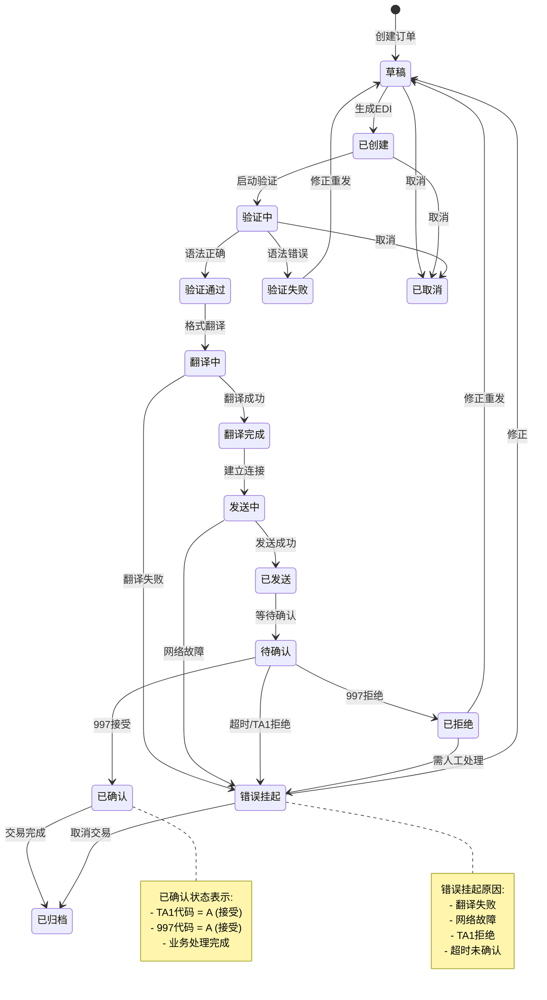
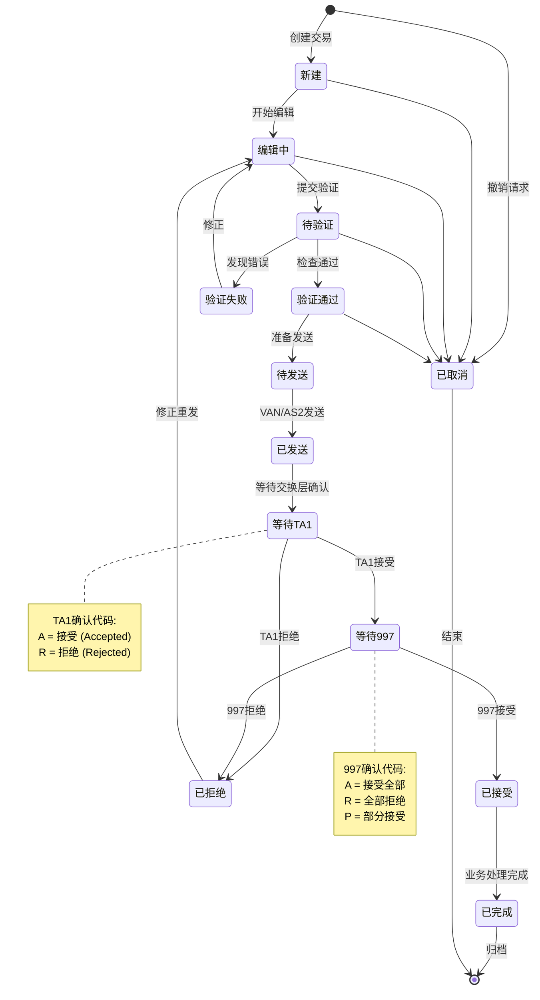
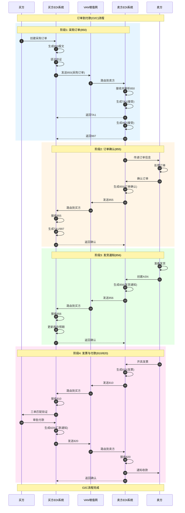
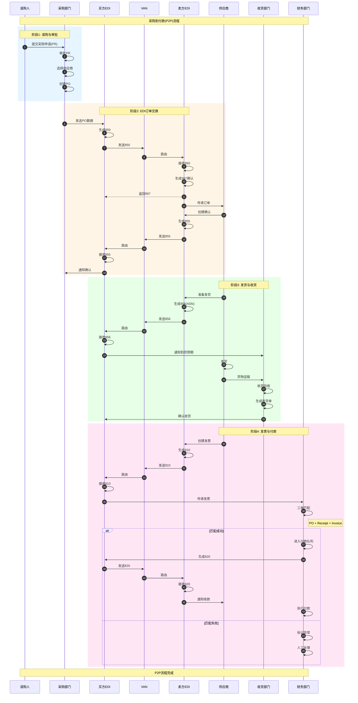
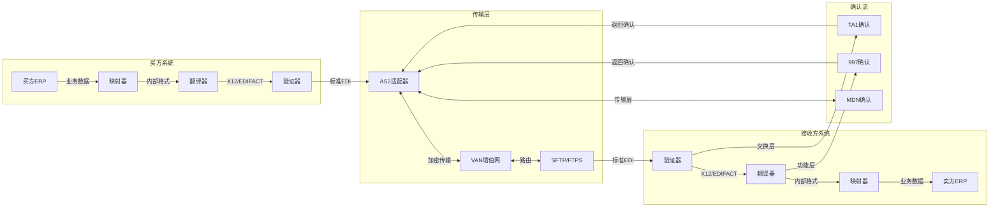
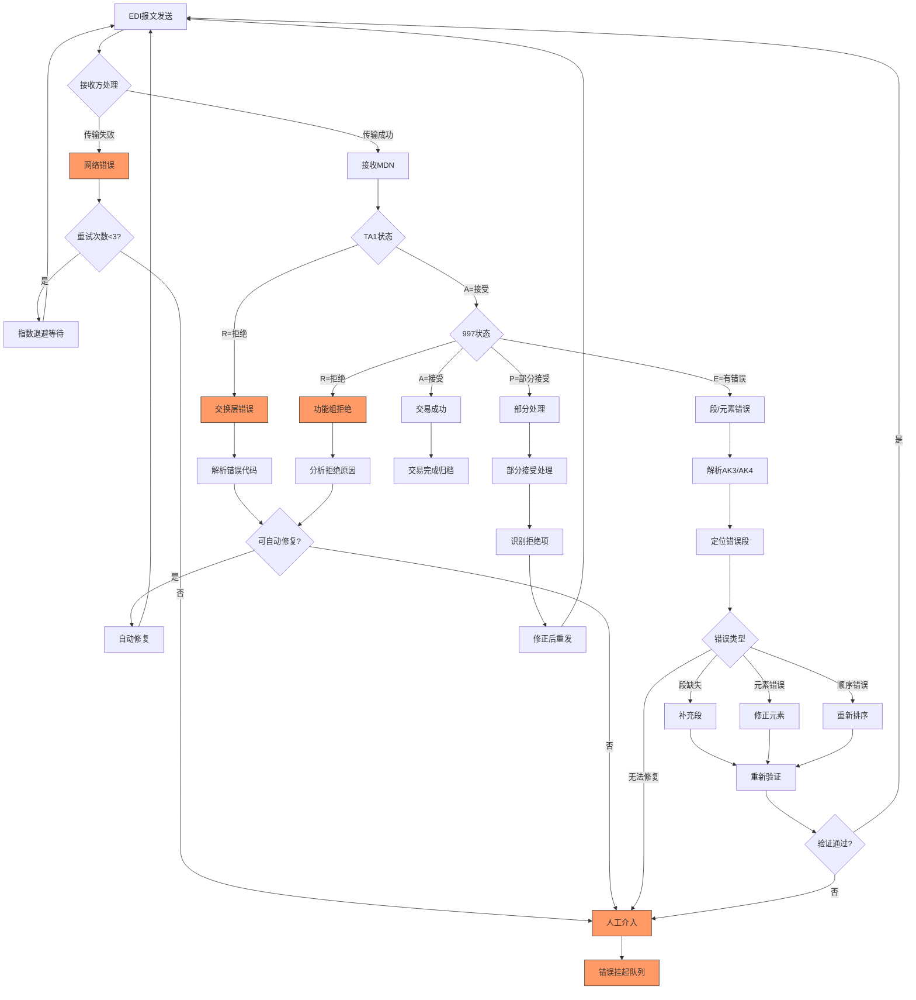
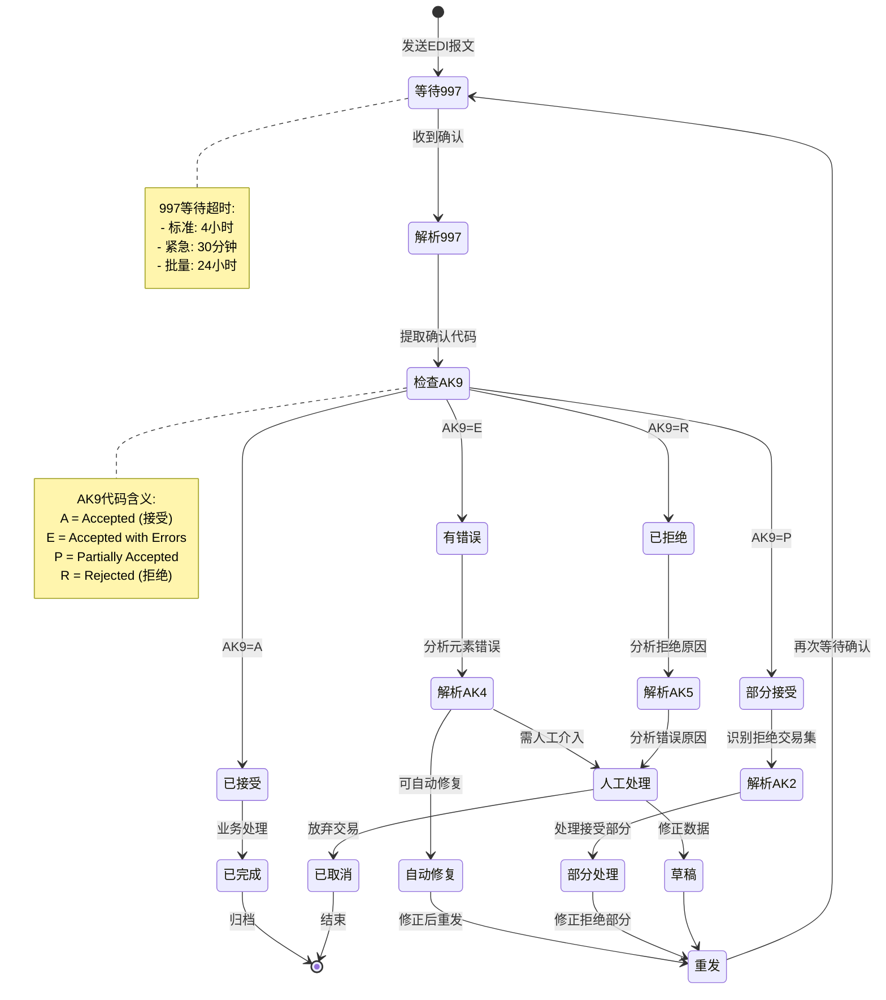

# EDI Schema信息表征动态动作分析视图

**版本**: v1.0
**创建日期**: 2026-02-15
**标准**: EDI X12, UN/EDIFACT, ANSI ASC X12, ISO 9735

---

## 📑 目录

- [EDI Schema信息表征动态动作分析视图](#edi-schema信息表征动态动作分析视图)
  - [📑 目录](#-目录)
  - [1. 动态动作分析概述](#1-动态动作分析概述)
  - [2. 状态机形式化](#2-状态机形式化)
    - [2.1 EDI文档生命周期状态机](#21-edi文档生命周期状态机)
    - [2.2 EDI交易状态机（X12标准）](#22-edi交易状态机x12标准)
    - [2.3 EDIFACT消息状态机](#23-edifact消息状态机)
  - [3. 时序交互分析](#3-时序交互分析)
    - [3.1 订单到付款(O2C)流程](#31-订单到付款o2c流程)
    - [3.2 采购到付款(P2P)流程](#32-采购到付款p2p流程)
    - [3.3 EDI确认时序模型](#33-edi确认时序模型)
  - [4. 数据流分析](#4-数据流分析)
    - [4.1 EDI数据流动路径](#41-edi数据流动路径)
    - [4.2 EDI报文结构流动分析](#42-edi报文结构流动分析)
    - [4.3 EDI信息熵变化分析](#43-edi信息熵变化分析)
  - [5. 实时性分析](#5-实时性分析)
    - [5.1 EDI SLA要求定义](#51-edi-sla要求定义)
    - [5.2 EDI处理延迟分析模型](#52-edi处理延迟分析模型)
    - [5.3 997功能性确认时效分析](#53-997功能性确认时效分析)
  - [6. 异常处理机制](#6-异常处理机制)
    - [6.1 TA1交换层错误处理](#61-ta1交换层错误处理)
    - [6.2 997功能确认错误处理](#62-997功能确认错误处理)
    - [6.3 段错误恢复机制](#63-段错误恢复机制)
    - [6.4 异常处理决策矩阵](#64-异常处理决策矩阵)
  - [7. Mermaid动态视图](#7-mermaid动态视图)
    - [7.1 EDI文档生命周期状态机图](#71-edi文档生命周期状态机图)
    - [7.2 X12交易处理状态机图](#72-x12交易处理状态机图)
    - [7.3 订单到付款(O2C)时序图](#73-订单到付款o2c时序图)
    - [7.4 采购到付款(P2P)时序图](#74-采购到付款p2p时序图)
    - [7.5 EDI确认层级时序图](#75-edi确认层级时序图)
    - [7.6 EDI数据流图](#76-edi数据流图)
    - [7.7 异常处理流程图](#77-异常处理流程图)
    - [7.8 997确认处理状态机](#78-997确认处理状态机)

---

## 1. 动态动作分析概述

EDI（电子数据交换）动态动作分析关注 EDI 文档在供应链环境中的运行时行为特征，包括：

- **状态转换**: EDI 文档从创建到归档的生命周期状态迁移
- **时序交互**: 贸易伙伴之间 EDI 消息传递的顺序和因果关系
- **数据流动**: EDI 数据在 VAN（增值网）、翻译器、ERP 系统间的传递路径
- **实时性能**: 满足 SLA 要求的处理延迟和 997 确认时效
- **异常恢复**: TA1/997 错误处理、段错误恢复和重试机制

---

## 2. 状态机形式化

### 2.1 EDI文档生命周期状态机

```
状态集合: S = {草稿, 已创建, 验证中, 验证通过, 验证失败, 翻译中, 翻译完成, 发送中, 已发送, 待确认, 已确认, 已拒绝, 已归档, 错误挂起}

状态转换流程:
1. 文档创建阶段
   草稿 → 已创建      (EDI文档生成完成)

2. 语法验证阶段
   已创建 → 验证中    (启动语法验证)
   验证中 → 验证通过  (ISA/GS/ST段结构正确)
   验证中 → 验证失败  (段缺失、分隔符错误、长度超限)

3. 业务验证阶段
   验证通过 → 翻译中  (启动格式翻译)
   翻译中 → 翻译完成  (X12/EDIFACT ↔ 内部格式)
   翻译中 → 错误挂起  (翻译失败、字符集错误)

4. 传输阶段
   翻译完成 → 发送中  (建立VAN/AS2连接)
   发送中 → 已发送    (报文成功发出)
   发送中 → 错误挂起  (网络故障、连接超时)

5. 确认阶段
   已发送 → 待确认    (等待TA1/997确认)
   待确认 → 已确认    (接收方返回997成功)
   待确认 → 已拒绝    (接收方返回997错误)
   待确认 → 错误挂起  (TA1拒绝、超时未确认)

6. 归档阶段
   已确认 → 已归档    (交易完成归档)
   已拒绝 → 错误挂起  (待人工处理)

状态不变式:
∀文档: 状态(文档) ∈ S
∀文档: 状态(文档) = 已确认 → ∃确认(文档) ∧ 确认时间 ≤ 发送时间 + SLA时限
```

**EDI文档状态转换矩阵:**

| 当前状态 | 创建完成 | 语法验证通过 | 翻译成功 | 发送成功 | 997确认 | 997拒绝 | TA1拒绝 | 超时 | 人工处理 |
|---------|---------|-------------|---------|---------|---------|---------|---------|------|---------|
| **草稿** | 已创建 | - | - | - | - | - | - | - | - |
| **已创建** | - | 验证中 | - | - | - | - | - | - | - |
| **验证中** | - | 验证通过 | - | - | - | - | 验证失败 | - | - |
| **验证通过** | - | - | 翻译中 | - | - | - | - | - | - |
| **翻译中** | - | - | 翻译完成 | - | - | - | 错误挂起 | - | - |
| **翻译完成** | - | - | - | 发送中 | - | - | - | - | - |
| **发送中** | - | - | - | 已发送 | - | - | 错误挂起 | 错误挂起 | - |
| **已发送** | - | - | - | - | 待确认 | - | - | - | - |
| **待确认** | - | - | - | - | 已确认 | 已拒绝 | 错误挂起 | 错误挂起 | - |
| **已确认** | - | - | - | - | - | - | - | - | 已归档 |
| **已拒绝** | - | - | - | - | - | - | - | - | 错误挂起 |
| **错误挂起** | - | - | - | - | - | - | - | - | 草稿/已归档 |

### 2.2 EDI交易状态机（X12标准）

```
交易状态集合: T = {新建, 编辑中, 待验证, 验证通过, 验证失败, 待发送, 已发送, 等待TA1, 等待997, 已接受, 已拒绝, 已完成, 已取消}

X12交易集生命周期:

新建 → 编辑中      (开始编辑交易集)
编辑中 → 待验证    (编辑完成提交)
待验证 → 验证通过  (语法检查通过)
待验证 → 验证失败  (发现语法错误)
验证失败 → 编辑中  (修正错误)
验证通过 → 待发送  (打包准备发送)
待发送 → 已发送    (通过VAN/AS2发送)
已发送 → 等待TA1   (等待交换层确认)
等待TA1 → 等待997  (TA1接受,等待功能确认)
等待TA1 → 已拒绝   (TA1拒绝,交换层错误)
等待997 → 已接受   (997接受,交易成功)
等待997 → 已拒绝   (997拒绝,业务错误)
已接受 → 已完成    (业务处理完成)
已拒绝 → 编辑中    (修正重发)
任意状态 → 已取消  (取消交易)
```

**X12交易状态转换条件:**

| 转换 | 触发条件 | 执行动作 | 时间限制 |
|-----|---------|---------|---------|
| 编辑中→待验证 | 用户提交 | 启动语法验证 | < 1s |
| 待验证→验证通过 | ISA/GS/ST正确 | 生成控制编号 | < 2s |
| 待验证→验证失败 | 段错误/元素错误 | 记录错误位置 | < 2s |
| 验证通过→待发送 | 排入发送队列 | 分配批次号 | < 500ms |
| 待发送→已发送 | MDN接收确认 | 记录发送时间 | 视网络而定 |
| 已发送→等待TA1 | ISA/IEA校验完成 | 计时开始 | < 24h |
| 等待TA1→等待997 | TA1代码=A(接受) | 继续等待997 | < 48h |
| 等待TA1→已拒绝 | TA1代码=R(拒绝) | 记录错误代码 | < 24h |
| 等待997→已接受 | AK9/AK5=A(接受) | 更新交易状态 | < 48h |
| 等待997→已拒绝 | AK9/AK5=R(拒绝) | 记录业务错误 | < 48h |

### 2.3 EDIFACT消息状态机

```
EDIFACT消息状态: E = {新建, 语法检查, 段验证, 消息验证, 就绪, 已发送, 等待CONTRL, 等待APERAK, 已接受, 语法错误, 业务错误, 已完成}

EDIFACT消息生命周期:
┌─────────┐   ┌──────────┐   ┌──────────┐   ┌──────────┐
│  新建    │ → │ 语法检查 │ → │ 段验证   │ → │ 消息验证 │
└─────────┘   └──────────┘   └──────────┘   └──────────┘
                                                   │
                         ┌─────────────────────────┘
                         ▼
                   ┌──────────┐   ┌────────┐   ┌────────────┐   ┌──────────┐
                   │ 语法错误 │   │ 就绪   │ → │   已发送   │ → │等待CONTRL│
                   └──────────┘   └────────┘   └────────────┘   └──────────┘
                                                                       │
                    ┌──────────────────────────────────────────────────┤
                    ▼                                                  ▼
              ┌────────────┐                                     ┌────────────┐
              │  CONTRL接受 │                                     │ CONTRL拒绝 │
              │  →等待APERAK│                                     │ →语法错误  │
              └────────────┘                                     └────────────┘
                    │
        ┌───────────┴───────────┐
        ▼                       ▼
  ┌────────────┐          ┌────────────┐
  │ APERAK接受  │          │ APERAK拒绝  │
  │ → 已接受   │          │ →业务错误  │
  └────────────┘          └────────────┘
        │
        ▼
  ┌────────────┐
  │  已完成    │
  └────────────┘
```

---

## 3. 时序交互分析

### 3.1 订单到付款(O2C)流程

```
参与方:
- 买方 (Buyer) - 发起采购订单
- 买方EDI系统 (Buyer EDI) - 生成和发送850
- VAN/增值网 (VAN) - EDI数据交换网络
- 卖方EDI系统 (Seller EDI) - 接收和处理EDI
- 卖方 (Seller) - 履行订单并开票

时序流程:

阶段1: 订单发起 (Order)
T0: 买方创建采购需求
T1 = T0 + Δt1: 买方ERP生成采购订单
T2 = T1 + Δt2: 买方EDI系统生成850 (采购订单)
T3 = T2 + Δt3: 850语法验证通过
T4 = T3 + Δt4: 850翻译为X12格式
T5 = T4 + Δt5: 通过VAN发送850给卖方
T6 = T5 + Δt6: VAN路由到卖方EDI系统

阶段2: 订单确认 (Order Acknowledgment)
T7 = T6 + Δt7: 卖方接收850
T8 = T7 + Δt8: 卖方生成855 (订单确认)
T9 = T8 + Δt9: 855返回买方
T10 = T9 + Δt10: 买方接收855确认

阶段3: 发货通知 (Shipment)
T11 = T10 + Δt11: 卖方准备发货
T12 = T11 + Δt12: 卖方生成856 (发货通知/ASN)
T13 = T12 + Δt13: 856返回买方
T14 = T13 + Δt14: 买方接收856并更新库存预期

阶段4: 发票与付款 (Invoice & Payment)
T15 = T14 + Δt15: 卖方生成810 (发票)
T16 = T15 + Δt16: 810发送给买方
T17 = T16 + Δt17: 买方验证发票(三单匹配: 850/856/810)
T18 = T17 + Δt18: 买方生成820 (汇款通知)或执行付款
T19 = T18 + Δt19: 交易完成

O2C端到端总延迟: T_total = ΣΔti (i=1 to 19)
典型时间范围: 1-7天(取决于交付周期)
```

### 3.2 采购到付款(P2P)流程

```
参与方:
- 请购人 (Requester) - 发起采购申请
- 采购部门 (Procurement) - 审批和创建PO
- 供应商 (Supplier) - 提供商品/服务
- 收货部门 (Receiving) - 确认收货
- 财务部门 (Finance) - 处理发票和付款

时序流程:

阶段1: 请购与审批
T0: 请购人提交采购申请
T1 = T0 + Δt1: 采购部门审批申请
T2 = T1 + Δt2: 采购部门选择供应商
T3 = T2 + Δt3: 创建采购订单(PO)

阶段2: EDI订单交换
T4 = T3 + Δt4: 买方EDI生成850
T5 = T4 + Δt5: 850发送给供应商
T6 = T5 + Δt6: 供应商接收850
T7 = T6 + Δt7: 供应商系统验证订单
T8 = T7 + Δt8: 供应商生成855(确认)或865(变更请求)
T9 = T8 + Δt9: 供应商返回确认
T10 = T9 + Δt10: 买方接收确认

阶段3: 发货与收货
T11 = T10 + Δt11: 供应商准备发货
T12 = T11 + Δt12: 供应商生成856(ASN)提前通知
T13 = T12 + Δt13: 买方接收ASN
T14 = T13 + Δt14: 货物到达
T15 = T14 + Δt15: 收货部门扫描收货(生成收货单)
T16 = T15 + Δt16: EDI 861(收货确认)或内部系统更新

阶段4: 发票处理与付款
T17 = T16 + Δt17: 供应商生成810(发票)
T18 = T17 + Δt18: 810发送给买方财务系统
T19 = T18 + Δt19: 三单匹配验证(PO+Receipt+Invoice)
    - 匹配成功: 进入付款队列
    - 匹配失败: 生成业务异常处理
T20 = T19 + Δt20: 财务审批付款
T21 = T20 + Δt21: 生成820(汇款通知)
T22 = T21 + Δt22: 执行付款/EFT转账
T23 = T22 + Δt23: 交易闭环

P2P端到端总延迟: T_total = ΣΔti (i=1 to 23)
关键控制点: 三单匹配(T19)是付款前置条件
```

### 3.3 EDI确认时序模型

```
EDI确认层级:

Level 1: 传输层确认 (AS2 MDN)
- 发送方通过AS2发送EDI报文
- 接收方返回同步/异步MDN(消息处理通知)
- 确认: 报文完整性和签名验证结果
- 时效: 同步MDN < 30秒, 异步MDN < 5分钟

Level 2: 交换层确认 (TA1/CONTRL)
- TA1 (X12): 交换层语法确认
  * A = 接受 (Accepted)
  * R = 拒绝 (Rejected)
- CONTRL (EDIFACT): 语法和服务报告消息
  * 2 = 接受无错误
  * 3 = 接受有错误
  * 4 = 拒绝
- 时效: < 24小时(通常数分钟内)

Level 3: 功能层确认 (997/APERAK)
- 997 (X12): 功能组确认
  * AK1: 功能组头确认
  * AK9: 功能组尾状态 (A=接受, R=拒绝, P=部分接受)
  * AK2-AK5: 交易集级别状态
- APERAK (EDIFACT): 应用错误和确认消息
  * 业务级错误报告
- 时效: < 48小时

Level 4: 业务层确认 (855/ORDRSP)
- 855 (X12): 采购订单确认
  * IA = 接受全部
  * IC = 接受有变更
  * ID = 拒绝
  * IP = 接受部分
- ORDRSP (EDIFACT): 订单响应消息
- 时效: 根据贸易伙伴协议(通常24-48小时)
```

---

## 4. 数据流分析

### 4.1 EDI数据流动路径

```
EDI数据生命周期:

1. 业务系统生成阶段
   ┌─────────────────────────────────────────┐
   │ ERP系统: SAP/Oracle/用友/金蝶            │
   │   - 采购订单(PO)创建                     │
   │   - 销售订单(SO)处理                     │
   │   - 发货通知(DN)生成                     │
   │   - 发票(INV)开具                        │
   └─────────────────────────────────────────┘
                    │
                    ▼ (内部API/数据库)
2. EDI映射与翻译阶段
   ┌─────────────────────────────────────────┐
   │ EDI翻译器: IBM Sterling/SEEBURGER/      │
   │            Gentran/自主开发              │
   │   - 内部格式 → X12/EDIFACT              │
   │   - 数据映射转换                         │
   │   - 段和元素组装                         │
   │   - 控制编号生成                         │
   └─────────────────────────────────────────┘
                    │
                    ▼ (EDI标准格式)
3. 验证与处理阶段
   ┌─────────────────────────────────────────┐
   │ 语法验证引擎:                             │
   │   - ISA/GS/GE/IEA交换层验证              │
   │   - ST/SE交易集层验证                    │
   │   - 段顺序和 Mandatory 检查              │
   │   - 元素数据类型和长度验证               │
   └─────────────────────────────────────────┘
                    │
                    ▼ (AS2/SFTP/FTPS/VAN)
4. 传输阶段
   ┌─────────────────────────────────────────┐
   │ 通信协议层:                               │
   │   - AS2: 签名+加密+MDN                   │
   │   - SFTP/FTPS: 安全文件传输              │
   │   - VAN: 增值网络路由                    │
   │   - HTTPS/API: 现代EDI传输               │
   └─────────────────────────────────────────┘
                    │
                    ▼ (网络传输)
5. 接收与确认阶段
   ┌─────────────────────────────────────────┐
   │ 接收方处理:                               │
   │   - 报文接收与解密                       │
   │   - 数字签名验证                         │
   │   - 生成MDN/TA1/997确认                  │
   │   - 翻译为内部格式                       │
   └─────────────────────────────────────────┘
                    │
                    ▼ (ERP集成)
6. 业务系统处理阶段
   ┌─────────────────────────────────────────┐
   │ 接收方ERP:                                │
   │   - 订单处理                             │
   │   - 库存更新                             │
   │   - 发票校验                             │
   │   - 财务记账                             │
   └─────────────────────────────────────────┘
```

### 4.2 EDI报文结构流动分析

```
X12 850报文数据包生命周期:

生成阶段:
┌─────────────────────────────────────────────────────────────┐
│ 业务数据封装:                                                │
│   PO Header: 采购订单头 (订单号、日期、买方信息)              │
│   PO Detail: 明细行 (物料号、数量、单价、单位)                │
│   PO Summary: 汇总 (总金额、行数统计)                         │
└─────────────────────────────────────────────────────────────┘
                    │
                    ▼ (EDI翻译)
翻译阶段:
┌─────────────────────────────────────────────────────────────┐
│ X12结构化:                                                   │
│   ISA/IEA: 交换信封 (发送方/接收方ID、日期时间、控制号)        │
│   GS/GE: 功能组信封 (功能组类型、应用码、控制号)              │
│   ST/SE: 交易集信封 (交易集类型850、控制号)                   │
│   BEG: 开始段 (订单类型、订单号、日期)                        │
│   N1-N4: 名称地址段 (买方、卖方、收货方)                      │
│   PO1: 订单明细行 (行号、数量、单位、单价)                    │
│   CTT/SE: 交易集汇总
└─────────────────────────────────────────────────────────────┘
                    │
                    ▼ (语法验证)
验证阶段:
┌─────────────────────────────────────────────────────────────┐
│ 完整性校验:                                                  │
│   - 段分隔符检查 (通常 ~ )                                    │
│   - 元素分隔符检查 (通常 * )                                  │
│   - 子元素分隔符检查 (通常 > )                                │
│   - 控制编号连续性验证                                        │
│   - 交易集计数与SE段匹配                                      │
│   - 功能组计数与GE段匹配                                      │
│   - 交换层计数与IEA段匹配                                     │
└─────────────────────────────────────────────────────────────┘
                    │
                    ▼ (加密签名)
传输阶段:
┌─────────────────────────────────────────────────────────────┐
│ AS2封装 (如使用AS2):                                         │
│   - MIME报文封装                                             │
│   - 数字签名 (SMIME签名)                                      │
│   - 加密 (SMIME加密)                                          │
│   - HTTP POST传输                                             │
│   - MDN请求                                                   │
└─────────────────────────────────────────────────────────────┘
                    │
                    ▼ (接收解析)
接收阶段:
┌─────────────────────────────────────────────────────────────┐
│ 逆向解析:                                                    │
│   - 解密/验签                                                │
│   - X12格式解析                                              │
│   - 映射到内部格式                                           │
│   - 业务规则验证                                             │
│   - 生成确认报文                                             │
└─────────────────────────────────────────────────────────────┘
```

### 4.3 EDI信息熵变化分析

```
EDI数据在系统中的熵变:

原始业务数据:    H ≈ 256 bits (采购订单详细信息)
     │
     │ ERP系统标准化
     ▼
结构化业务对象:  H ≈ 128 bits (标准化字段)
     │
     │ EDI映射转换
     ▼
X12/EDIFACT格式: H ≈ 64 bits (段和元素的组合)
     │
     │ 压缩传输
     ▼
压缩EDI数据:     H ≈ 48 bits (消除冗余分隔符)
     │
     │ 加密传输
     ▼
加密报文:        H ≈ 256 bits (AES/TLS加密)
     │
     │ 网络传输
     ▼
接收解密:        H ≈ 48 bits (恢复压缩格式)
     │
     │ 解压解析
     ▼
解析后X12:       H ≈ 64 bits (恢复原始格式)
     │
     │ 反向映射
     ▼
内部业务对象:    H ≈ 128 bits (目标系统格式)
     │
     │ 业务处理
     ▼
处理结果:        H ≈ 8 bits (成功/失败)
     │
     │ 确认报文
     ▼
997/TA1确认:     H ≈ 32 bits (确认代码和状态)

信息保护关键点:
1. 传输加密: AS2/SMIME 或 TLS 保护数据机密性
2. 数字签名: 确保报文完整性和不可否认性
3. 访问控制: EDI系统权限管理和审计日志
4. 存档加密: 长期存储的EDI数据加密
5. 控制编号: 防止重放攻击和确保顺序
```

---

## 5. 实时性分析

### 5.1 EDI SLA要求定义

```
服务等级协议 (SLA) 指标:

交易类型              │ 处理时间   │ 997确认时效 │ 可用性    │ 错误率
─────────────────────┼───────────┼────────────┼──────────┼─────────
850 采购订单          │ < 5分钟   │ < 4小时    │ 99.9%    │ < 0.1%
855 订单确认          │ < 5分钟   │ < 4小时    │ 99.9%    │ < 0.1%
856 发货通知          │ < 5分钟   │ < 4小时    │ 99.9%    │ < 0.1%
810 发票              │ < 5分钟   │ < 24小时   │ 99.9%    │ < 0.1%
820 汇款通知          │ < 5分钟   │ < 24小时   │ 99.5%    │ < 0.5%
997 功能确认          │ < 1分钟   │ N/A        │ 99.99%   │ < 0.01%
TA1 交换确认          │ < 30秒    │ N/A        │ 99.99%   │ < 0.01%

业务时段要求:
- 工作日 08:00-18:00: 全功能开放，最高性能
- 工作日 18:00-08:00: 标准处理，批量传输
- 周末/节假日: 紧急订单处理，非紧急批量处理

997确认时效分级:
- 紧急订单 (Premium): < 30分钟
- 标准订单 (Standard): < 4小时
- 批量订单 (Batch): < 24小时
```

### 5.2 EDI处理延迟分析模型

```
EDI处理延迟分解:

总延迟 = 生成延迟 + 翻译延迟 + 验证延迟 + 排队延迟 + 传输延迟 + 确认延迟

生成延迟 (T_generate):
- ERP系统生成: 500ms - 2s (取决于数据量)
- 数据库查询: 100ms - 500ms
- 小计: 600ms - 2.5s

翻译延迟 (T_translate):
- 映射查找: 50ms - 200ms
- 格式转换: 100ms - 500ms
- 字符集处理: 20ms - 100ms
- 小计: 170ms - 800ms

验证延迟 (T_validate):
- 语法验证: 50ms - 200ms
- 业务规则验证: 100ms - 500ms
- 伙伴特定验证: 50ms - 300ms
- 小计: 200ms - 1s

排队延迟 (T_queue):
- 正常负载: 10ms - 100ms
- 高峰负载: 100ms - 1s
- 极端负载: 1s - 10s
- 小计: 10ms - 10s

传输延迟 (T_transmit):
- AS2连接建立: 100ms - 500ms
- 报文传输: 取决于报文大小 (1KB ≈ 10ms)
- MDN等待 (同步): 500ms - 2s
- VAN路由: 500ms - 5s
- 小计: 600ms - 8s

确认延迟 (T_ack):
- 接收方处理: 1分钟 - 1小时 (取决于业务系统)
- 997生成: < 1分钟
- 997返回: 同传输延迟
- 小计: 1分钟 - 4小时 (SLA要求)

端到端总延迟范围:
- 最小延迟: 600ms + 170ms + 200ms + 10ms + 600ms + 1min ≈ 1.5分钟
- 典型延迟: 2s + 500ms + 500ms + 100ms + 2s + 30min ≈ 30分钟
- 最大延迟 (SLA): 2.5s + 800ms + 1s + 10s + 8s + 4h ≈ 4小时
```

### 5.3 997功能性确认时效分析

```
997确认流程与时效:

阶段1: 接收与解析 (< 2分钟)
┌─────────────────────────────────────────┐
│ 1. 报文接收 (AS2/SFTP/VAN)               │
│    - 传输层确认 (MDN): < 30秒            │
│                                          │
│ 2. 解密与解析                            │
│    - SMIME解密: < 500ms                  │
│    - X12解析: < 500ms                    │
│                                          │
│ 3. 语法验证                              │
│    - 段结构检查: < 200ms                 │
│    - 元素验证: < 500ms                   │
└─────────────────────────────────────────┘
                    │
                    ▼
阶段2: 997生成 (< 1分钟)
┌─────────────────────────────────────────┐
│ 4. TA1生成 (交换层确认)                  │
│    - ISA/IEA校验结果                     │
│    - 代码: A=接受, R=拒绝                │
│                                          │
│ 5. 997交易集生成                         │
│    - AK1: 功能组响应头                   │
│    - AK2-AK5: 交易集响应细节             │
│    - AK9: 功能组响应尾                   │
│    - 状态: A=接受, R=拒绝, E=错误, P=部分 │
│                                          │
│ 6. 997打包与签名                         │
│    - 控制编号分配                        │
│    - 数字签名                            │
└─────────────────────────────────────────┘
                    │
                    ▼
阶段3: 997发送 (< 2分钟)
┌─────────────────────────────────────────┐
│ 7. 997传输                               │
│    - AS2发送: < 30秒                     │
│    - 等待发送方MDN: < 30秒               │
│                                          │
│ 8. 发送方接收997                         │
│    - 解密验证: < 1秒                     │
│    - 状态更新: < 1秒                     │
└─────────────────────────────────────────┘

997时效保障措施:
- 异步处理: 997异步生成避免阻塞
- 优先级队列: 997报文高优先级传输
- 批处理: 批量生成997减少开销
- 监控告警: 997超时自动告警

997状态代码含义:
AK901 (功能组确认代码):
- A = Accepted (接受)
- E = Accepted but Errors Noted (接受但有错误)
- P = Partially Accepted (部分接受)
- R = Rejected (拒绝)

AK501 (交易集确认代码):
- A = Accepted (接受)
- E = Accepted but Errors Noted (接受但有错误)
- M = Rejected, Message Authentication Code Failed
- P = Partially Accepted (部分接受)
- R = Rejected (拒绝)
- W = Rejected, Assurance Failed Validity Tests
- X = Rejected, Content After Decryption Could Not Be Analyzed
```

---

## 6. 异常处理机制

### 6.1 TA1交换层错误处理

```
TA1 (Interchange Acknowledgment) 错误处理:

TA1报文结构:
TA1*ISA13*ISA08*ISA06*TA104*TA105*IK502~ (X12 版本)

TA104 - 功能组确认代码:
A = Accepted
E = Accepted But Errors Were Noted
R = Rejected

TA105/IK502 - 错误代码:
001 = The Interchange Control Number in the Header and Trailer Do Not Match
002 = This Standard as Noted in the Control Standards Identifier is Not Supported
003 = This Version of the Controls is Not Supported
004 = The Segment Terminator is Invalid
005 = Invalid Interchange ID Qualifier for Sender
006 = Invalid Interchange Sender ID
007 = Invalid Interchange ID Qualifier for Receiver
008 = Invalid Interchange Receiver ID
009 = Unknown Interchange Receiver ID
010 = Invalid Authorization Information Qualifier Value
011 = Invalid Authorization Information Value
012 = Invalid Security Information Qualifier Value
013 = Invalid Security Information Value
014 = Invalid Interchange Date Value
015 = Invalid Interchange Time Value
016 = Invalid Interchange Standards Identifier Value
017 = Invalid Interchange Version ID Value
018 = Invalid Interchange Control Number Value
019 = Invalid Acknowledgment Requested Value
020 = Invalid Test Indicator Value
021 = Invalid Number of Included Groups Value
022 = Invalid Control Structure
023 = Improper (Premature) End-of-File (Transmission)
024 = Invalid Interchange Content (e.g., Invalid GS Segment)
025 = Duplicate Interchange Control Number
026 = Invalid Data Element Separator
027 = Invalid Component Element Separator
028 = Invalid Delivery Date in Deferred Delivery Request
029 = Invalid Delivery Time in Deferred Delivery Request
030 = Invalid Delivery Time Code in Deferred Delivery Request
031 = Invalid Grade of Service Code

TA1错误处理流程:

发送方                   接收方
   │                       │
   │---- ISA/IEA 交换层 ---->│
   │                       │
   │                       │-- 解析ISA
   │                       │-- 检测到错误
   │                       │
   │<--- TA1 (R + 错误代码) │
   │                       │
   │-- 解析TA1              │
   │-- 记录错误日志          │
   │-- 触发告警             │
   │-- 人工/自动修复        │
   │                       │
   │---- 重发修正后的交换 --->│
   │                       │
   │<--- TA1 (A)            │
```

### 6.2 997功能确认错误处理

```
997 (Functional Acknowledgment) 错误处理:

997错误类型分类:

1. 段级别错误 (AK3-AK4)
AK3*段名*段位置*循环ID*语法错误代码~
AK4*元素位置*组件位置*数据元素引用号*语法错误代码~

段语法错误代码:
1 = Unrecognized segment ID
2 = Unexpected segment
3 = Required Segment Missing
4 = Loop Occurs Over Maximum Times
5 = Segment Exceeds Maximum Use
6 = Segment Not in Defined Transaction Set
7 = Segment Not in Proper Sequence
8 = Segment Has Data Element Errors

元素语法错误代码 (AK4):
1 = Required Data Element Missing
2 = Conditional Required Data Element Missing
3 = Too Many Data Elements
4 = Data Element Too Short
5 = Data Element Too Long
6 = Invalid Character in Data Element
7 = Invalid Code Value
8 = Invalid Date
9 = Invalid Time
10 = Exclusion Condition Violated
11 = Too Many Repetitions
12 = Too Many Components

2. 交易集级别错误 (AK5)
AK5*交易集确认代码*交易集语法错误代码1*...

交易集语法错误代码:
1 = Transaction Set Not Supported
2 = Transaction Set Trailer Missing
3 = Transaction Set Control Number in Header and Trailer Do Not Match
4 = Number of Included Segments Does Not Match Actual Count
5 = One or More Segments in Error
6 = Missing or Invalid Transaction Set Identifier
7 = Missing or Invalid Transaction Set Control Number
8 = Authentication Key Name Unknown
9 = Encryption Key Name Unknown
10 = Requested Service (Authentication or Encrypted) Not Available
11 = Unknown Security Recipient
12 = Incorrect Message Length (Encryption Only)
13 = Message Authentication Code Failed

3. 功能组级别错误 (AK9)
AK9*功能组确认代码*交易集计数*接收计数*接受计数~

997错误处理流程:

发送方 850          接收方
   │                   │
   │----- 850 -------->│
   │                   │
   │                   │-- 语法验证
   │                   │-- 发现段错误
   │                   │
   │<---- 997 -------- │
   │  (包含 AK3/AK4)   │
   │                   │
   │-- 解析997         │
   │-- 定位错误段      │
   │-- 分析错误原因    │
   │                   │
   │  自动修复可能?    │
   │      │            │
   │   Yes│  No        │
   │      │            │
   │      ▼            │
   │   自动修正        │
   │      │            │
   │      ▼            │
   │   重发850         │
   │      │            │
   │      ▼            │
   │   等待997         │
   │      │            │
   │      ▼            │
   │   确认接受        │
   │      │            │
   └──────┴────────────┘

997错误恢复策略:
- 段错误: 修正段内容后重发
- 元素错误: 修正数据元素后重发
- 控制编号错误: 重新生成正确的控制编号
- 重复交换: 更换控制编号后重发
- 格式错误: 检查EDI标准版本配置
```

### 6.3 段错误恢复机制

```
段错误检测与恢复:

常见段错误类型:

1. 强制段缺失 (Mandatory Segment Missing)
   错误代码: AK303 = 3

   示例: 850采购订单缺少 BEG 段
   修正: 补充 BEG*00*SA*PO12345*20260115~

2. 段重复超限 (Segment Exceeds Maximum Use)
   错误代码: AK305 = 5

   示例: N1 段超过最大使用次数(200次)
   修正: 拆分交易集或合并名称信息

3. 段顺序错误 (Segment Not in Proper Sequence)
   错误代码: AK307 = 7

   示例: PO1 段出现在 REF 段之后(顺序错误)
   修正: 重新排列段顺序符合X12规范

4. 数据元素错误 (Segment Has Data Element Errors)
   错误代码: AK308 = 8

   示例: N401 城市名长度超过30字符
   修正: 截断或缩写城市名

段错误恢复流程:

检测错误
    │
    ▼
解析AK3/AK4
    │
    ▼
┌─────────────────┐
│ 错误段位置定位   │
│ 原始报文回溯    │
└─────────────────┘
    │
    ▼
┌─────────────────┐
│ 错误类型判断    │
│ - 缺失?         │
│ - 长度?         │
│ - 格式?         │
│ - 代码值?       │
└─────────────────┘
    │
    ▼
┌─────────────────┐
│ 自动修复尝试    │
│ - 默认值填充    │
│ - 长度截断      │
│ - 格式转换      │
└─────────────────┘
    │
    ▼
修复成功?
    │
 Yes │    No
    │      │
    ▼      ▼
 重发   人工介入
        │
        ▼
    修正原始数据
        │
        ▼
      重发

段错误预防机制:
1. 预验证: 发送前运行语法检查
2. 模板校验: 使用标准模板生成EDI
3. 段计数: 自动生成SE01段计数
4. 控制编号: 自动生成连续控制编号
5. 代码表验证: 验证代码值在允许列表中
```

### 6.4 异常处理决策矩阵

```
EDI异常场景分类与处理:

异常类型           │ 检测方式      │ 自动处理        │ 人工介入      │ 通知方式
───────────────────┼───────────────┼────────────────┼─────────────┼──────────
TA1交换层错误      │ 接收TA1       │ 部分可修复      │ 配置错误      │ 紧急告警
997功能层错误      │ 接收997       │ 语法错误自动    │ 业务错误      │ 业务告警
段缺失错误         │ AK303=3       │ 自动填充默认值  │ 无法填充      │ 日志+邮件
元素长度超限       │ AK405=4/5     │ 自动截断        │ 截断后无效    │ 日志
非法字符           │ AK406=6       │ 自动替换/删除   │ 字符集问题    │ 日志+告警
控制编号重复       │ IK502=25      │ 自动重生成      │ 系统故障      │ 紧急告警
交易集不支持       │ AK501=1       │ 配置贸易伙伴    │ 升级协议      │ 业务告警
验证超时           │ 定时器        │ 自动重试        │ 多次失败      │ 告警升级
网络传输失败       │ 连接超时      │ 重试3次         │ 超过3次       │ 运维告警
MDN超时            │ 同步MDN等待   │ 切换异步模式    │ 持续失败      │ 技术告警
签名验证失败       │ 安全模块      │ 拒收并告警      │ 证书问题      │ 安全告警
解密失败           │ 安全模块      │ 拒收并告警      │ 密钥问题      │ 安全告警

重试策略:
- 网络错误: 指数退避重试 (1min, 2min, 4min, 8min, 16min)
- 语法错误: 自动修复后重试 (最多3次)
- 业务错误: 人工介入后手动重发
- 超时错误: 查询状态后决定重试或放弃
```

---

## 7. Mermaid动态视图

### 7.1 EDI文档生命周期状态机图



### 7.2 X12交易处理状态机图



### 7.3 订单到付款(O2C)时序图



### 7.4 采购到付款(P2P)时序图



### 7.5 EDI确认层级时序图

```mermaid
sequenceDiagram
    autonumber
    participant S as 发送方
    participant R as 接收方

    Note over S,R: EDI四级确认机制

    rect rgb(230, 245, 255)
        Note over S,R: Level 1: 传输层确认 (MDN)
        S->>S: 生成EDI报文
        S->>S: 数字签名(SMIME)
        S->>S: 加密报文
        S->>R: AS2传输 (HTTP POST)

        R->>R: 接收报文
        R->>R: 解密
        R->>R: 验证签名
        R->>R: 计算MIC

        alt 同步MDN
            R-->>S: 立即返回MDN
        else 异步MDN
            R-->>S: HTTP 200确认接收
            R->>R: 异步处理
            R-->>S: 稍后返回MDN
        end

        S->>S: 验证MDN/MIC
    end

    rect rgb(255, 245, 230)
        Note over S,R: Level 2: 交换层确认 (TA1)
        R->>R: 解析ISA/IEA
        R->>R: 语法验证
        R->>R: 生成TA1

        alt TA1 = A (接受)
            R-->>S: 发送TA1 (A)
            Note right of R: 继续处理功能组
        else TA1 = R (拒绝)
            R-->>S: 发送TA1 (R + 错误码)
            Note right of R: 丢弃交换
        end
    end

    rect rgb(230, 255, 230)
        Note over S,R: Level 3: 功能层确认 (997)
        R->>R: 解析GS/GE
        R->>R: 解析ST/SE
        R->>R: 段级别验证
        R->>R: 元素级别验证
        R->>R: 生成997

        R-->>S: 发送997 (AK1/AK9)

        Note right of R
            AK9状态:
            A = 接受
            E = 接受有错误
            P = 部分接受
            R = 拒绝
        End note
    end

    rect rgb(255, 230, 245)
        Note over S,R: Level 4: 业务层确认 (855)
        R->>R: 业务系统处理
        R->>R: 订单确认/拒绝
        R->>R: 生成855 (如适用)

        R-->>S: 发送855

        Note right of R
            855确认类型:
            IA = 接受全部
            IC = 接受有变更
            IP = 接受部分
            ID = 拒绝
        End note
    end
```

### 7.6 EDI数据流图



### 7.7 异常处理流程图



### 7.8 997确认处理状态机



---

**参考文档**:

- `01_Overview.md` - EDI Schema概述
- `02_Formal_Definition.md` - 形式化定义
- `03_Standards.md` - EDI标准对标
- `04_Transformation.md` - 模型转换
- `05_Case_Studies.md` - 案例研究
- ANSI ASC X12 Standards
- UN/EDIFACT ISO 9735

**维护者**: DSL Schema研究团队
