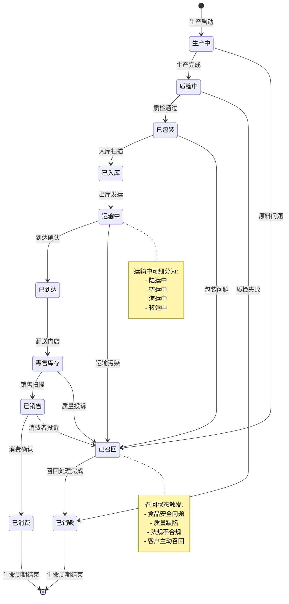
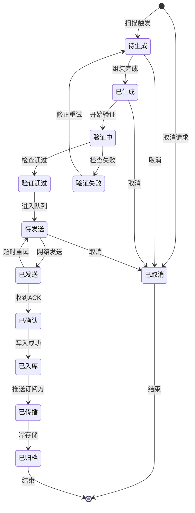
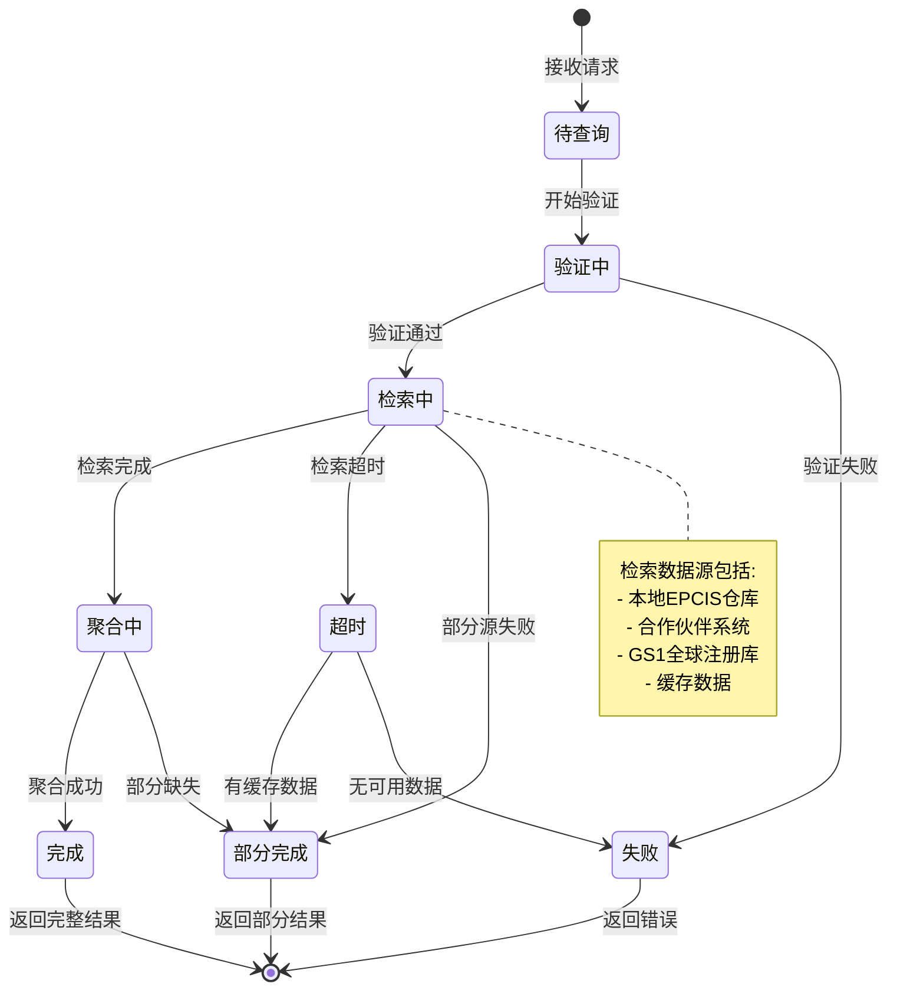
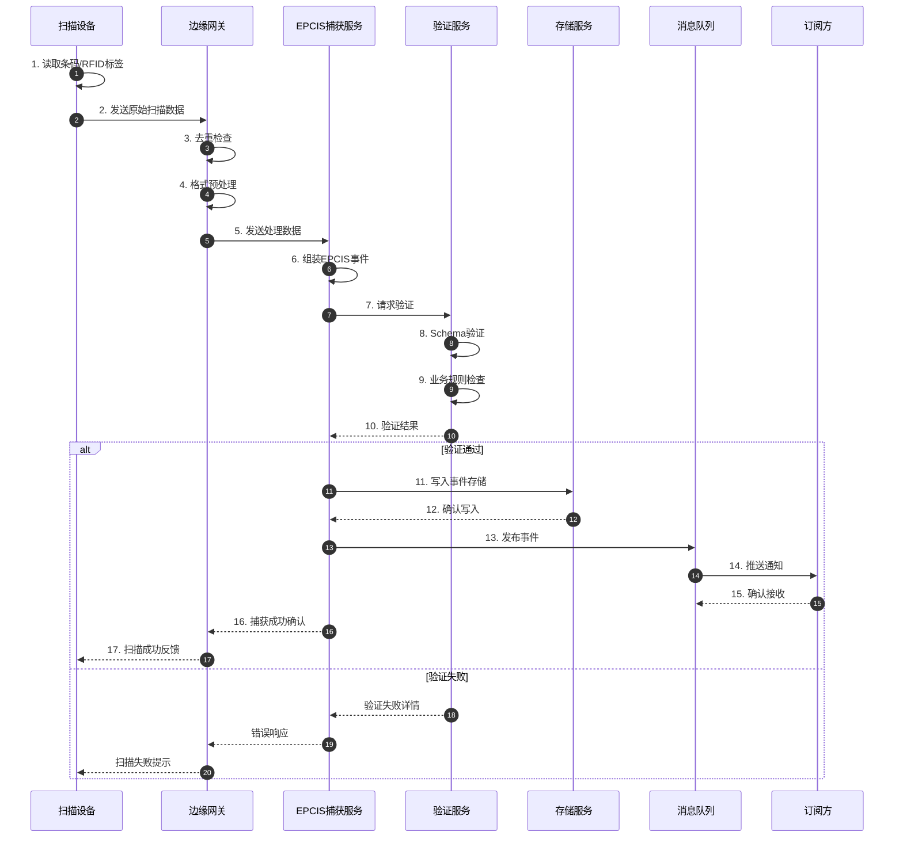
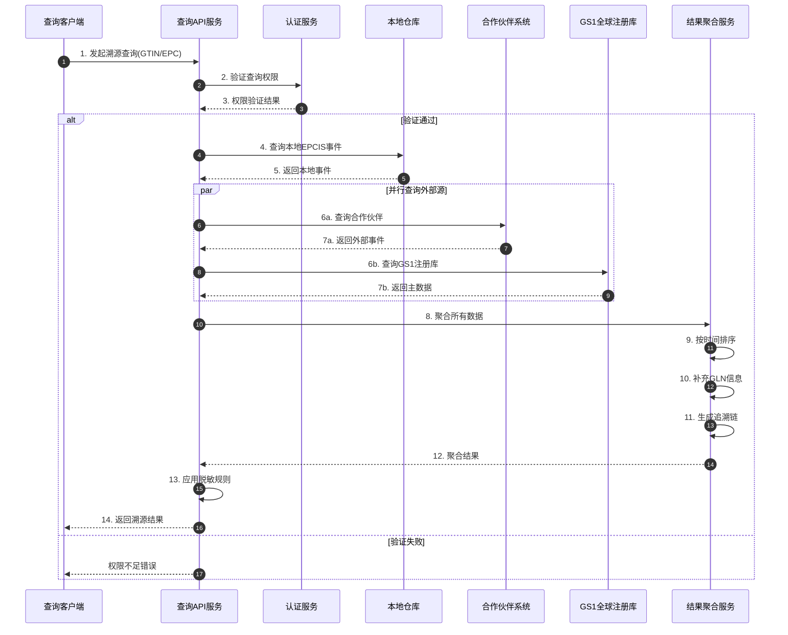
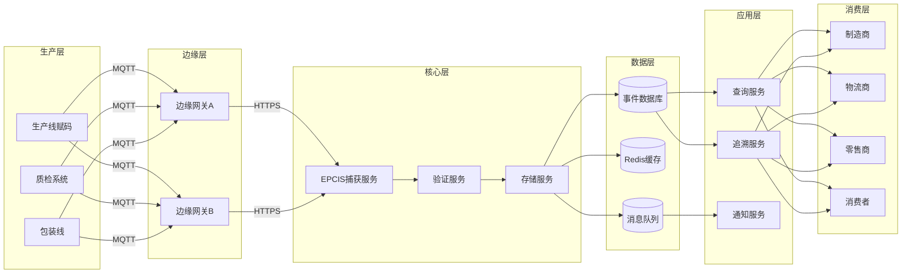
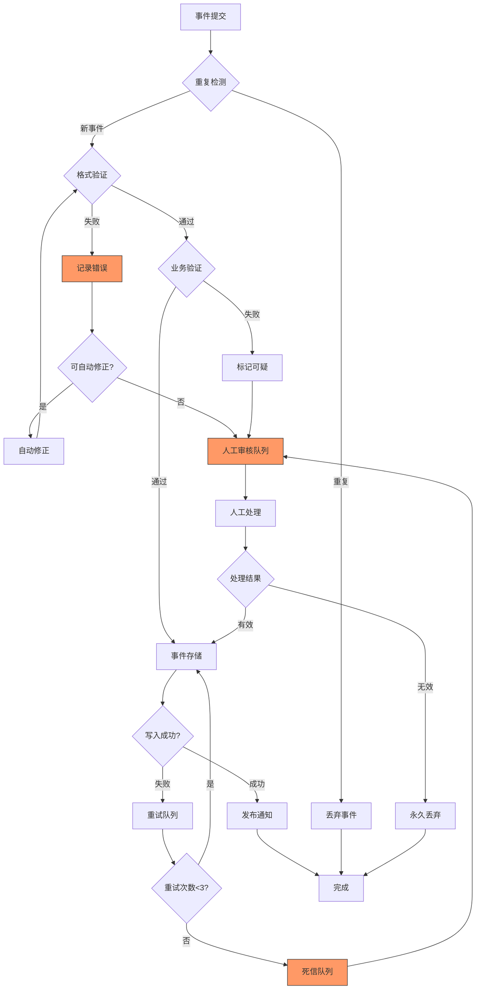
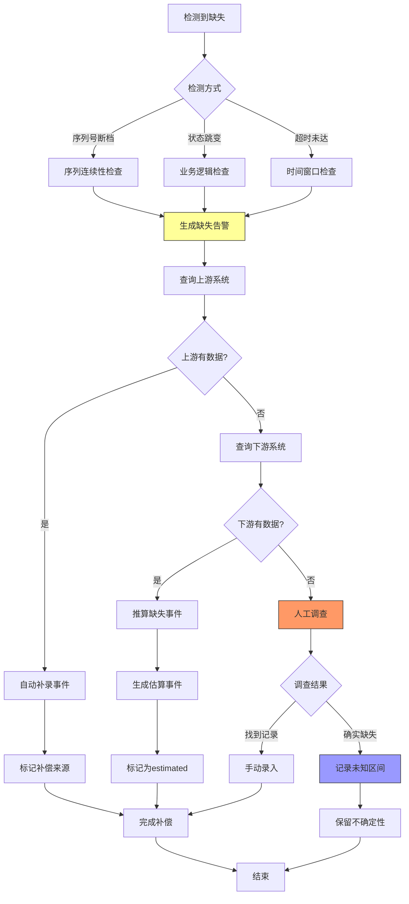

# GS1 Schema动态动作分析视图

**版本**: v1.0
**创建日期**: 2026-02-15
**标准**: GS1 EPCIS 2.0, ISO/IEC 19823, GS1 Digital Link

---

## 📑 目录

- [GS1 Schema动态动作分析视图](#gs1-schema动态动作分析视图)
  - [📑 目录](#-目录)
  - [1. 动态动作分析概述](#1-动态动作分析概述)
  - [2. 状态机形式化](#2-状态机形式化)
    - [2.1 产品生命周期状态机](#21-产品生命周期状态机)
    - [2.2 EPCIS事件状态机](#22-epcis事件状态机)
    - [2.3 溯源查询状态机](#23-溯源查询状态机)
  - [3. 时序交互分析](#3-时序交互分析)
    - [3.1 EPCIS事件捕获流程](#31-epcis事件捕获流程)
    - [3.2 完整溯源查询流程](#32-完整溯源查询流程)
    - [3.3 实时事件处理流程](#33-实时事件处理流程)
  - [4. 数据流分析](#4-数据流分析)
    - [4.1 供应链可见性数据流](#41-供应链可见性数据流)
    - [4.2 EPCIS事件数据包流动分析](#42-epcis事件数据包流动分析)
    - [4.3 信息熵变化分析](#43-信息熵变化分析)
  - [5. 实时性分析](#5-实时性分析)
    - [5.1 SLA要求定义](#51-sla要求定义)
    - [5.2 延迟分析模型](#52-延迟分析模型)
    - [5.3 吞吐量计算](#53-吞吐量计算)
  - [6. 异常处理机制](#6-异常处理机制)
    - [6.1 重复扫描处理机制](#61-重复扫描处理机制)
    - [6.2 缺失事件补偿机制](#62-缺失事件补偿机制)
    - [6.3 事件验证失败处理](#63-事件验证失败处理)
    - [6.4 异常处理决策矩阵](#64-异常处理决策矩阵)
  - [7. Mermaid动态视图](#7-mermaid动态视图)
    - [7.1 产品生命周期状态机图](#71-产品生命周期状态机图)
    - [7.2 EPCIS事件状态机图](#72-epcis事件状态机图)
    - [7.3 溯源查询状态机图](#73-溯源查询状态机图)
    - [7.4 EPCIS事件捕获时序图](#74-epcis事件捕获时序图)
    - [7.5 完整溯源查询时序图](#75-完整溯源查询时序图)
    - [7.6 供应链数据流图](#76-供应链数据流图)
    - [7.7 异常处理流程图](#77-异常处理流程图)
    - [7.8 缺失事件补偿流程图](#78-缺失事件补偿流程图)

---

## 1. 动态动作分析概述

GS1供应链动态动作分析关注产品在供应链全流程中的行为特征，包括：

- **状态转换**: 产品在不同生命周期阶段间的迁移
- **时序交互**: 供应链参与方之间的EPCIS事件传递顺序
- **数据流动**: 溯源数据在各系统组件间的传递路径
- **实时性能**: 事件捕获延迟和追溯查询响应时间保障
- **异常恢复**: 重复扫描处理、缺失事件补偿机制

---

## 2. 状态机形式化

### 2.1 产品生命周期状态机

```
状态集合: S = {生产中, 质检中, 已包装, 已入库, 运输中, 已到达, 零售库存, 已销售, 已消费, 已召回, 已销毁}

状态转换函数:
δ(生产中) = 质检中        (生产完成)
δ(质检中) = 已包装        (质检通过)
δ(质检中) = 已销毁        (质检失败)
δ(已包装) = 已入库        (入库扫描)
δ(已入库) = 运输中        (出库发运)
δ(运输中) = 已到达        (到达配送中心)
δ(已到达) = 零售库存      (配送至门店)
δ(零售库存) = 已销售      (消费者购买)
δ(已销售) = 已消费        (产品使用)
δ(任意状态) = 已召回      (召回触发)
δ(已召回) = 已销毁        (召回处理)

状态不变式:
∀产品: 状态(产品) ∈ S
∀产品: 转换(状态) = 符合EPCIS事件顺序
∀产品: 时间戳(状态i) < 时间戳(状态i+1)
```

**产品状态转换矩阵:**

| 当前状态 | 生产完成 | 质检通过 | 入库扫描 | 出库发运 | 到达确认 | 门店收货 | 销售扫描 | 消费确认 | 召回触发 |
|---------|---------|---------|---------|---------|---------|---------|---------|---------|---------|
| **生产中** | 质检中 | - | - | - | - | - | - | - | - |
| **质检中** | - | 已包装 | - | - | - | - | - | - | 已销毁 |
| **已包装** | - | - | 已入库 | - | - | - | - | - | - |
| **已入库** | - | - | - | 运输中 | - | - | - | - | - |
| **运输中** | - | - | - | - | 已到达 | - | - | - | - |
| **已到达** | - | - | - | - | - | 零售库存 | - | - | - |
| **零售库存** | - | - | - | - | - | - | 已销售 | - | - |
| **已销售** | - | - | - | - | - | - | - | 已消费 | - |
| **已消费** | - | - | - | - | - | - | - | - | - |

### 2.2 EPCIS事件状态机

```
事件状态集合: E = {待生成, 已生成, 验证中, 验证通过, 验证失败, 待发送, 已发送, 已确认, 已入库, 已传播, 已归档}

状态转换流程:
1. 事件生成阶段
   待生成 → 已生成      (扫描触发事件)

2. 事件验证阶段
   已生成 → 验证中      (启动验证)
   验证中 → 验证通过    (格式合法、数据完整)
   验证中 → 验证失败    (格式错误、数据缺失)

3. 事件传输阶段
   验证通过 → 待发送    (进入发送队列)
   待发送 → 已发送      (网络发送)
   已发送 → 已确认      (接收方ACK)
   已发送 → 待发送      (超时重试)

4. 事件存储阶段
   已确认 → 已入库      (写入数据库)
   已入库 → 已传播      (推送至订阅方)
   已传播 → 已归档      (冷存储归档)

5. 异常处理
   验证失败 → 待生成    (修正后重新生成)
   任意状态 → 已取消    (人工取消)
```

**EPCIS事件状态转换条件:**

| 转换 | 触发条件 | 执行动作 | 时间限制 |
|-----|---------|---------|---------|
| 待生成→已生成 | 扫描/手动触发 | 创建EventID | < 50ms |
| 已生成→验证中 | 事件组装完成 | 启动验证 | < 10ms |
| 验证中→验证通过 | 所有检查通过 | 标记有效 | < 100ms |
| 验证中→验证失败 | 任一检查失败 | 记录错误 | < 100ms |
| 验证通过→待发送 | 进入发送队列 | 生成待发送记录 | < 20ms |
| 待发送→已发送 | 网络发送成功 | 记录发送时间 | 视网络而定 |
| 已发送→已确认 | 收到ACK | 更新确认时间 | < 5s |
| 已确认→已入库 | 数据库写入成功 | 生成存储路径 | < 200ms |

### 2.3 溯源查询状态机

```
查询状态: Q = {待查询, 验证中, 检索中, 聚合中, 完成, 部分完成, 超时, 失败}

状态转换规则:

待查询 → 验证中      (接收查询请求)
验证中 → 检索中      (权限验证通过)
验证中 → 失败        (权限不足/格式错误)

检索中 → 聚合中      (多源数据检索完成)
检索中 → 部分完成    (部分数据源不可达)
检索中 → 超时        (检索超时)

聚合中 → 完成        (结果组装完成)
聚合中 → 部分完成    (部分数据缺失)

超时 → 部分完成      (返回已获取数据)
超时 → 失败          (无可用数据)

查询生命周期:
┌─────────┐   ┌─────────┐   ┌─────────┐   ┌─────────┐   ┌─────────┐
│  待查询  │ → │ 验证中  │ → │ 检索中  │ → │ 聚合中  │ → │  完成   │
└─────────┘   └─────────┘   └─────────┘   └─────────┘   └─────────┘
                    │            │             │
                    ▼            ▼             ▼
              ┌─────────┐  ┌─────────┐   ┌─────────┐
              │  失败   │  │  超时   │   │部分完成 │
              └─────────┘  └────┬────┘   └─────────┘
                                 │
                                 ▼
                            ┌─────────┐
                            │部分完成 │
                            └─────────┘
```

---

## 3. 时序交互分析

### 3.1 EPCIS事件捕获流程

```
参与方:
- 扫描设备 (Scanner)
- 边缘网关 (Edge Gateway)
- EPCIS捕获服务 (Capture Service)
- 事件验证服务 (Validation Service)
- 事件存储服务 (Repository Service)
- 消息队列 (MQ)

时序流程:

T0: 扫描设备读取条码/RFID标签
T1 = T0 + Δt1: 边缘网关接收原始扫描数据
T2 = T1 + Δt2: 边缘网关预处理(去重、格式转换)
T3 = T2 + Δt3: 发送至EPCIS捕获服务
T4 = T3 + Δt4: 捕获服务组装EPCIS事件
T5 = T4 + Δt5: 事件验证服务校验
T6 = T5 + Δt6: 验证通过，写入事件存储
T7 = T6 + Δt7: 发布至消息队列
T8 = T7 + Δt8: 订阅方接收事件通知

总延迟: T_capture = ΣΔti (i=1 to 8)
```

### 3.2 完整溯源查询流程

```
溯源查询时序模型:

阶段1: 查询请求处理
- 接收查询请求(GTIN/SSCC/EPC)
- 验证查询权限
- 解析查询参数

阶段2: 数据源检索
- 检索本地EPCIS仓库
- 查询外部合作伙伴系统
- 调用GS1全球注册服务

阶段3: 结果聚合
- 按时间顺序排序事件
- 补充位置信息(GLN解析)
- 生成完整追溯链

阶段4: 响应返回
- 组装查询结果
- 应用数据脱敏规则
- 返回JSON/XML响应

追溯链构建算法:
追溯链 = [ObjectEvent@生产] → [AggregationEvent@包装] →
         [ObjectEvent@入库] → [TransactionEvent@运输] →
         [ObjectEvent@到达] → [ObjectEvent@销售] →
         [TransactionEvent@消费]
```

### 3.3 实时事件处理流程

```
实时事件处理 (Real-time Event Processing) 特征:
- 毫秒级事件捕获
- 实时事件验证
- 即时数据传播
- 低延迟查询响应

时序要求:
- 标签扫描识别: < 100ms
- 边缘网关处理: < 50ms
- 事件组装生成: < 100ms
- 格式验证检查: < 50ms
- 业务规则验证: < 100ms
- 事件持久化: < 200ms
- 消息队列发布: < 50ms
- 订阅方通知: < 100ms

端到端总延迟: < 750ms (99.9%的事件)

并发处理:
- 系统吞吐量: ≥ 50,000 EPS (Events Per Second)
- 峰值处理能力: ≥ 100,000 EPS
- 事件队列容量: ≥ 10,000,000 事件
```

---

## 4. 数据流分析

### 4.1 供应链可见性数据流

```
供应链数据生命周期:

1. 生产阶段
   ┌─────────────────────────────────────────┐
   │ 生产线: 赋码/贴标系统                     │
   │   - GTIN分配                             │
   │   - 批次号生成                           │
   │   - 生产日期记录                         │
   │   - ObjectEvent(ADD)生成                 │
   └─────────────────────────────────────────┘
                    │
                    ▼ (MQTT/HTTPS)
2. 包装阶段
   ┌─────────────────────────────────────────┐
   │ 包装线: 聚合包装系统                       │
   │   - SSCC生成                             │
   │   - 母子关联建立                         │
   │   - AggregationEvent(ADD)生成            │
   └─────────────────────────────────────────┘
                    │
                    ▼ (EPCIS Capture Interface)
3. 仓储阶段
   ┌─────────────────────────────────────────┐
   │ WMS系统:                                 │
   │   - 入库扫描                             │
   │   - 库位管理                             │
   │   - 库存查询                             │
   │   - ObjectEvent/OBSERVE                  │
   └─────────────────────────────────────────┘
                    │
                    ▼ (AS2/HTTPS)
4. 运输阶段
   ┌─────────────────────────────────────────┐
   │ TMS系统:                                 │
   │   - 发货扫描                             │
   │   - 运输跟踪                             │
   │   - 到达确认                             │
   │   - TransactionEvent                     │
   └─────────────────────────────────────────┘
                    │
                    ▼ (REST API)
5. 零售阶段
   ┌─────────────────────────────────────────┐
   │ POS系统:                                 │
   │   - 收货扫描                             │
   │   - 销售扫描                             │
   │   - 库存更新                             │
   │   - ObjectEvent/DISPOSE                  │
   └─────────────────────────────────────────┘
```

### 4.2 EPCIS事件数据包流动分析

```
EPCIS事件报文生命周期:

生成阶段:
┌─────────────────────────────────────────────────────────────┐
│ 事件封装:                                                    │
│   EventID: urn:uuid:550e8400-e29b-41d4-a716-446655440000     │
│   EventTime: 2026-01-15T08:30:00.000Z                        │
│   EventType: ObjectEvent                                    │
│   Action: ADD                                               │
│   EPCList: [urn:epc:id:sgtin:0614141.107346.2017]           │
│   BizStep: urn:epcglobal:cbv:bizstep:commissioning          │
│   ReadPoint: urn:epc:id:sgln:0614141.12345.400              │
│   Disposition: urn:epcglobal:cbv:disp:active                │
└─────────────────────────────────────────────────────────────┘

传输阶段:
┌─────────────────────────────────────────────────────────────┐
│ 网络层处理:                                                  │
│   - TLS 1.3加密传输                                          │
│   - EPCIS Capture Interface (HTTP POST)                     │
│   - Content-Type: application/xml或application/json         │
│   - 数字签名可选                                             │
└─────────────────────────────────────────────────────────────┘

接收阶段:
┌─────────────────────────────────────────────────────────────┐
│ 解析层处理:                                                  │
│   - XML/JSON Schema验证                                     │
│   - CBV标准符合性检查                                        │
│   - 必填字段完整性验证                                       │
│   - 时间戳格式校验                                          │
│   - EPC URI格式验证                                         │
└─────────────────────────────────────────────────────────────┘
```

### 4.3 信息熵变化分析

```
供应链数据在系统中的熵变:

原始扫描数据:    H ≈ 64 bits (条码/RFID原始数据)
     │
     │ 解析处理
     ▼
结构化EPC数据:   H ≈ 128 bits (GTIN+序列号+时间戳)
     │
     │ EPCIS事件封装
     ▼
完整事件文档:    H ≈ 256 bits (含业务上下文)
     │
     │ CBV标准映射
     ▼
标准化事件:      H ≈ 200 bits (标准词汇表)
     │
     │ 查询结果聚合
     ▼
追溯链数据:      H ≈ 512 bits (多事件聚合)
     │
     │ 可视化呈现
     ▼
用户视图:        H ≈ 64 bits (关键信息摘要)

信息保护点:
1. 传输加密: TLS 1.3保护事件传输
2. 访问控制: OAuth 2.0身份验证
3. 数据脱敏: 敏感商业信息隐藏
4. 审计日志: 完整访问追溯
```

---

## 5. 实时性分析

### 5.1 SLA要求定义

```
服务等级协议 (SLA) 指标:

操作类型            │ 响应时间   │ 可用性    │ 吞吐量       │ 错误率
────────────────────┼───────────┼──────────┼─────────────┼─────────
标签扫描捕获        │ < 200ms   │ 99.9%    │ 10,000 TPS  │ < 0.1%
事件验证处理        │ < 150ms   │ 99.9%    │ 50,000 EPS  │ < 0.05%
事件存储写入        │ < 300ms   │ 99.99%   │ 20,000 EPS  │ < 0.01%
单产品溯源查询      │ < 500ms   │ 99.9%    │ 5,000 QPS   │ < 0.1%
批量溯源查询        │ < 2s      │ 99.5%    │ 1,000 QPS   │ < 0.5%
实时事件订阅推送    │ < 1s      │ 99.9%    │ 50,000 EPS  │ < 0.1%

业务时段要求:
- 生产时段 08:00-20:00: 全功能开放，最高性能
- 非生产时段: 仅查询服务，批量处理
- 节假日: 降级服务，优先保障查询
```

### 5.2 延迟分析模型

```
事件处理延迟分解:

总延迟 = 扫描延迟 + 网络延迟 + 处理延迟 + 验证延迟 + 存储延迟

扫描延迟 (T_scan):
- 条码扫描: 50-100ms
- RFID读取: 10-50ms
- 手动录入: 500-2000ms
- 小计: 10-2000ms

网络延迟 (T_network):
- 边缘网关到云端: 50-200ms
- 内网传输: 1-10ms
- 跨地域传输: 100-500ms
- 小计: 1-500ms

处理延迟 (T_process):
- 事件组装: 20-50ms
- 格式转换: 10-30ms
- 上下文补充: 30-100ms
- 小计: 60-180ms

验证延迟 (T_validate):
- Schema验证: 20-50ms
- 业务规则检查: 30-100ms
- 重复检测: 10-30ms
- 小计: 60-180ms

存储延迟 (T_storage):
- 数据库写入: 50-150ms
- 索引更新: 20-50ms
- 缓存同步: 10-30ms
- 小计: 80-230ms

总延迟范围: 211-3090ms (P99: < 3s)
目标延迟: < 1s (95%的事件)
```

### 5.3 吞吐量计算

```
系统容量规划:

峰值EPS计算:
EPS_peak = (日事件量 × 峰值系数) / (峰值持续秒数)

假设:
- 日事件量: 10,000,000 事件
- 峰值系数: 2.0 (峰值是平均的2倍)
- 峰值持续: 4小时 (14400秒)

计算:
EPS_avg = 10,000,000 / 86,400 ≈ 116 EPS
EPS_peak = (10,000,000 × 2.0) / 14400 ≈ 1,389 EPS

设计容量 (考虑5倍冗余):
EPS_design = 1,389 × 5 ≈ 6,945 EPS

资源需求估算:
- 事件处理节点: 6,945 / 500 = 13.9 → 16 节点 (每节点500 EPS)
- 数据库连接: 6,945 × 2 = 13,890 连接
- 消息队列容量: 6,945 × 10KB × 3600s = 250GB
- 存储容量: 10M × 5KB × 365天 = 18.25TB/年
- 网络带宽: 6,945 × 10KB × 8 = 555 Mbps
```

---

## 6. 异常处理机制

### 6.1 重复扫描处理机制

```
重复扫描检测层级:

Level 1: 边缘网关去重 (10s窗口)
- 基于EPC+事件类型+时间窗口
- 内存缓存去重
- 瞬时重复过滤

Level 2: 捕获服务去重 (60s窗口)
- 基于EventID+时间戳
- Redis缓存去重
- 短时重复过滤

Level 3: 存储层去重 (永久)
- 数据库唯一约束 (EventID)
- 业务逻辑重复检测
- 长期重复预防

去重算法:
重复判定条件:
  同一EPC ∧ 同一BizStep ∧ 同一ReadPoint ∧
  |Timestamp1 - Timestamp2| < 去重窗口

去重动作:
1. 丢弃重复事件
2. 记录去重日志
3. 更新最后活动时间
4. 可选: 合并事件属性
```

### 6.2 缺失事件补偿机制

```
缺失事件检测策略:

基于序列号检测:
序列号连续性检查:
  期望序列号 = 上一序列号 + 1
  若 当前序列号 > 期望序列号 → 检测到缺失

基于业务逻辑检测:
业务状态跳变检查:
  运输中 → 已销售 (缺失: 已到达、零售库存)
  已包装 → 已消费 (缺失: 运输链事件)

基于时间窗口检测:
超时未到达检查:
  预期到达时间 = 发货时间 + 运输时长
  若 当前时间 > 预期到达时间 + 缓冲期 → 可能缺失

补偿机制:
1. 自动补偿:
   - 查询上下游系统
   - 补录缺失事件
   - 标记补偿来源

2. 人工补偿:
   - 生成缺失告警
   - 运营人员核实
   - 手动录入事件

3. 估算补偿:
   - 基于已知事件推算
   - 生成估算事件(标记为estimated)
   - 保留不确定性标记
```

### 6.3 事件验证失败处理

```
验证失败分类与处理:

格式验证失败:
- Schema不符合
- 必填字段缺失
- 数据类型错误
处理: 拒绝事件，返回错误详情

业务规则失败:
- 无效GLN
- 无效GTIN校验位
- 时间戳未来日期
处理: 标记为可疑，人工审核

逻辑一致性失败:
- 事件顺序矛盾
- 状态转换非法
- 数量不匹配
处理: 隔离事件，触发调查

补偿流程:
验证失败 → 错误分类 → 自动修正尝试 →
  ├─ 修正成功 → 重新验证 → 正常处理
  └─ 修正失败 → 人工队列 → 人工处理 →
      ├─ 确认有效 → 强制入库
      └─ 确认无效 → 丢弃记录
```

### 6.4 异常处理决策矩阵

```
异常场景分类与处理:

异常类型          │ 检测方式       │ 自动处理         │ 人工介入      │ 通知方式
──────────────────┼───────────────┼─────────────────┼──────────────┼──────────
重复扫描          │ 去重窗口      │ 丢弃/合并        │ 频繁重复      │ 日志+告警
缺失事件          │ 序列检查      │ 自动查询补偿     │ 补偿失败      │ 运营通知
验证失败          │ Schema校验    │ 尝试修正         │ 修正失败      │ 审核队列
网络超时          │ 连接超时      │ 指数退避重试     │ 重试耗尽      │ 系统告警
存储失败          │ DB异常        │ 切换备库/队列    │ 备库也失败    │ 紧急告警
时序错乱          │ 时间戳检查    │ 标记待调查       │ 确认异常      │ 风控通知
数据不一致        │ 关联检查      │ 触发对账         │ 对账不平      │ 双重告警
```

---

## 7. Mermaid动态视图

### 7.1 产品生命周期状态机图



### 7.2 EPCIS事件状态机图



### 7.3 溯源查询状态机图



### 7.4 EPCIS事件捕获时序图



### 7.5 完整溯源查询时序图



### 7.6 供应链数据流图



### 7.7 异常处理流程图



### 7.8 缺失事件补偿流程图



---

**参考文档**:

- `01_Overview.md` - GS1 Schema概述
- `02_Formal_Definition.md` - 形式化定义
- `03_Standards.md` - 标准对标
- `04_Transformation.md` - 模型转换
- `05_Case_Studies.md` - 案例研究
- GS1 EPCIS 2.0 标准
- ISO/IEC 19823 物联网协议标准

**维护者**: DSL Schema研究团队
