# 物流供应链Schema思维导图

## 📑 目录

- [物流供应链Schema思维导图](#物流供应链schema思维导图)
  - [📑 目录](#-目录)
  - [1. 思维导图概述](#1-思维导图概述)
    - [1.1 导图结构](#11-导图结构)
    - [1.2 核心概念](#12-核心概念)
    - [1.3 关联主题](#13-关联主题)
  - [2. 完整思维导图](#2-完整思维导图)
  - [3. 主要分支详解](#3-主要分支详解)
    - [3.1 仓储管理](#31-仓储管理)
    - [3.2 运输管理](#32-运输管理)
    - [3.3 订单管理](#33-订单管理)
    - [3.4 供应链协同](#34-供应链协同)
    - [3.5 追溯系统](#35-追溯系统)
  - [4. Mermaid可视化](#4-mermaid可视化)
    - [4.1 思维导图Mermaid图](#41-思维导图mermaid图)
    - [4.2 关联主题图](#42-关联主题图)

---

## 1. 思维导图概述

本文档以思维导图的形式展示物流供应链Schema
的知识体系结构，帮助理解各个子领域之间的关系。

### 1.1 导图结构

思维导图分为以下主要分支：

1. **仓储管理**: WMS系统, 智能仓储, 库存优化...
2. **运输管理**: TMS系统, 路径优化, 车队管理...
3. **订单管理**: OMS系统, 订单履约, 需求预测...
4. **供应链协同**: SRM供应商管理, 协同计划, VMI库存...
5. **追溯系统**: 商品溯源, 批次管理, 质量追溯...

### 1.2 核心概念

物流供应链Schema的核心概念包括：

- **Schema定义**: 领域特定的数据结构和语义规范
- **标准化**: 遵循行业标准和最佳实践
- **互操作性**: 不同系统之间的数据交换能力
- **可扩展性**: 支持业务增长和变化的能力

### 1.3 关联主题

本主题与以下主题有关联：

- **08_Maritime_Shipping**: 海事航运Schema
- **19_Transportation**: 交通运输Schema
- **17_Manufacturing**: 制造业Schema
- **18_Retail_Industry**: 零售行业Schema

---

## 2. 完整思维导图

```text
物流供应链Schema
│

├─ 1. 仓储管理
│   ├─ WMS系统
│   ├─ 智能仓储
│   ├─ 库存优化
│   ├─ 自动化立体库

├─ 2. 运输管理
│   ├─ TMS系统
│   ├─ 路径优化
│   ├─ 车队管理
│   ├─ 多式联运

├─ 3. 订单管理
│   ├─ OMS系统
│   ├─ 订单履约
│   ├─ 需求预测
│   ├─ 智能调度

├─ 4. 供应链协同
│   ├─ SRM供应商管理
│   ├─ 协同计划
│   ├─ VMI库存
│   ├─ 供应链金融

├─ 5. 追溯系统
│   ├─ 商品溯源
│   ├─ 批次管理
│   ├─ 质量追溯
│   ├─ 区块链溯源
│
└─ 标准体系
    ├─ 国际标准
    │   ├─ ISO系列标准
    │   └─ IEC系列标准
    ├─ 行业标准
    │   ├─ 行业协会标准
    │   └─ 事实标准
    └─ 技术规范
        ├─ API规范
        ├─ 数据格式
        └─ 协议规范

├─ 技术架构
    │
    ├─ 数据层
    │   ├─ 数据模型
    │   ├─ 存储方案
    │   └─ 数据治理
    │
    ├─ 服务层
    │   ├─ 业务服务
    │   ├─ 集成服务
    │   └─ 公共服务
    │
    ├─ 应用层
    │   ├─ 业务应用
    │   ├─ 移动应用
    │   └─ 分析应用
    │
    └─ 接入层
        ├─ API网关
        ├─ 消息总线
        └─ 文件交换

├─ 集成模式
    │
    ├─ 系统间集成
    │   ├─ ESB总线
    │   ├─ API集成
    │   └─ 消息队列
    │
    ├─ 数据集成
    │   ├─ ETL流程
    │   ├─ 数据同步
    │   └─ 主数据管理
    │
    └─ 流程集成
        ├─ BPM编排
        ├─ 事件驱动
        └─ 微服务编排

├─ 安全体系
    │
    ├─ 身份认证
    │   ├─ 单点登录
    │   ├─ 多因素认证
    │   └─ 零信任架构
    │
    ├─ 访问控制
    │   ├─ 基于角色RBAC
    │   ├─ 基于属性ABAC
    │   └─ 最小权限原则
    │
    ├─ 数据安全
    │   ├─ 加密存储
    │   ├─ 传输加密
    │   └─ 数据脱敏
    │
    └─ 合规审计
        ├─ 日志记录
        ├─ 合规检查
        └─ 风险评估

└─ 实施方法
    │
    ├─ 方法论
    │   ├─ 敏捷开发
    │   ├─ DevOps
    │   └─ 领域驱动设计
    │
    ├─ 工具链
    │   ├─ 建模工具
    │   ├─ 开发框架
    │   └─ 测试工具
    │
    └─ 最佳实践
        ├─ 设计模式
        ├─ 代码规范
        └─ 运维规范
```

---

## 3. 主要分支详解

### 3.1 仓储管理

```text
仓储管理
    ├─ WMS系统
    ├─ 智能仓储
    ├─ 库存优化
    ├─ 自动化立体库
```

### 3.2 运输管理

```text
运输管理
    ├─ TMS系统
    ├─ 路径优化
    ├─ 车队管理
    ├─ 多式联运
```

### 3.3 订单管理

```text
订单管理
    ├─ OMS系统
    ├─ 订单履约
    ├─ 需求预测
    ├─ 智能调度
```

### 3.4 供应链协同

```text
供应链协同
    ├─ SRM供应商管理
    ├─ 协同计划
    ├─ VMI库存
    ├─ 供应链金融
```

### 3.5 追溯系统

```text
追溯系统
    ├─ 商品溯源
    ├─ 批次管理
    ├─ 质量追溯
    ├─ 区块链溯源
```


---

## 4. Mermaid可视化

### 4.1 思维导图Mermaid图

```mermaid
mindmap
  root((物流供应链Schema))
      仓储管理
        WMS系统
        智能仓储
        库存优化
      运输管理
        TMS系统
        路径优化
        车队管理
      订单管理
        OMS系统
        订单履约
        需求预测
      供应链协同
        SRM供应商管理
        协同计划
        VMI库存
      追溯系统
        商品溯源
        批次管理
        质量追溯

    标准体系
      国际标准
      行业标准
      技术规范
    技术架构
      数据层
      服务层
      应用层
    安全体系
      身份认证
      访问控制
      数据安全
    关联主题
      08 Maritime Shipping
      19 Transportation
      17 Manufacturing
      18 Retail Industry

```



### 4.2 关联主题图

```mermaid
graph LR
    A[物流供应链Schema] --> B[核心技术]
    A --> C[应用领域]
    A --> D[标准规范]

    A -.-> E[08 Maritime Shipping]
    A -.-> F[19 Transportation]
    A -.-> G[17 Manufacturing]
    A -.-> H[18 Retail Industry]

    style A fill:#e1f5ff,stroke:#01579b,stroke-width:2px
```



---

**参考文档**：

- `../README.md` - 主题总览
- `Knowledge_Matrix.md` - 多维知识矩阵

**创建时间**：2026-02-16
**最后更新**：2026-02-16
