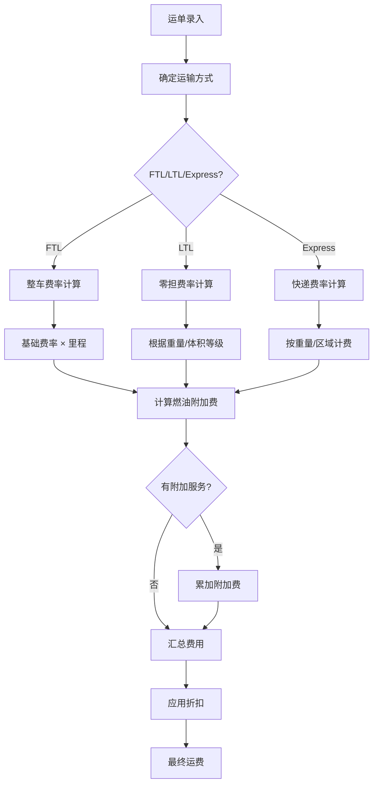
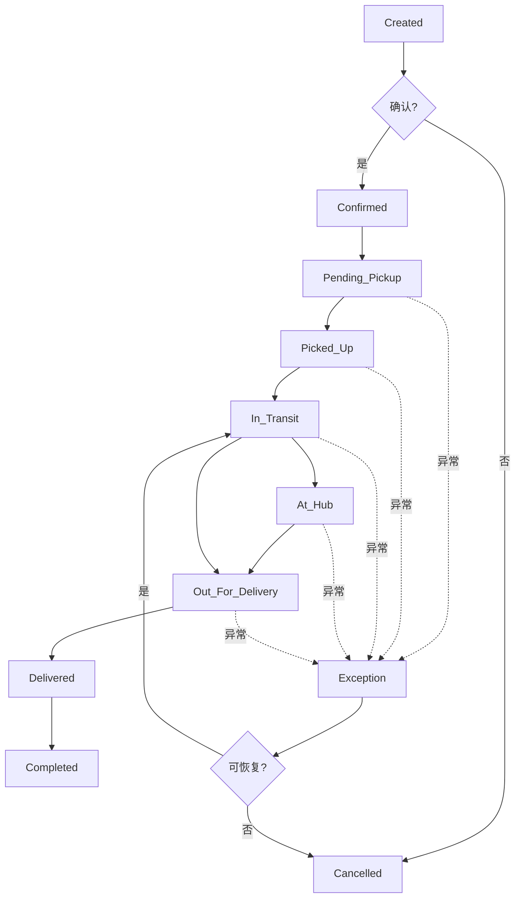
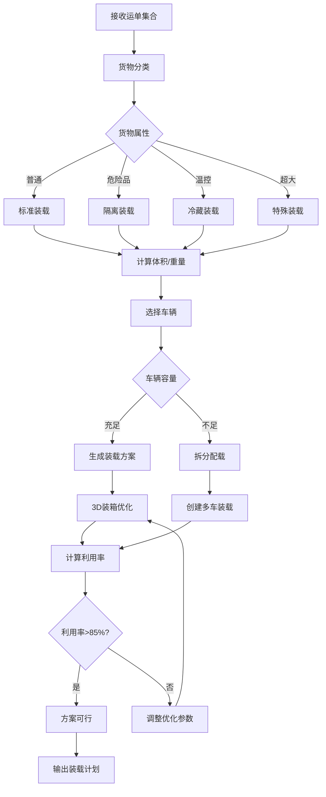
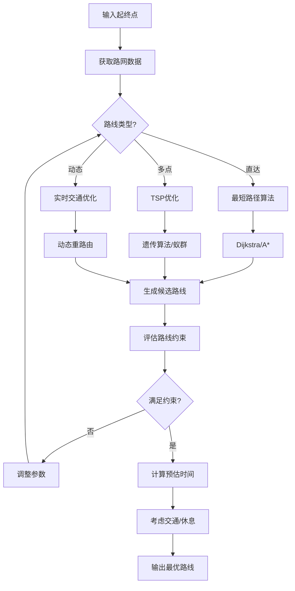
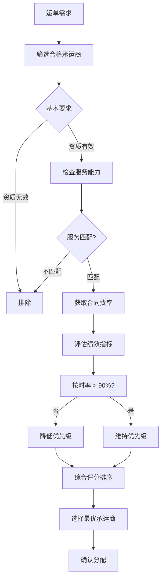
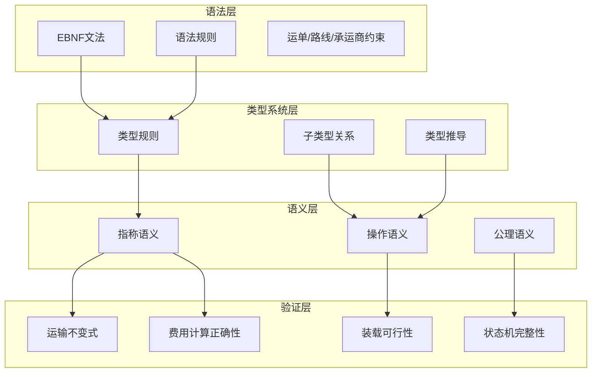
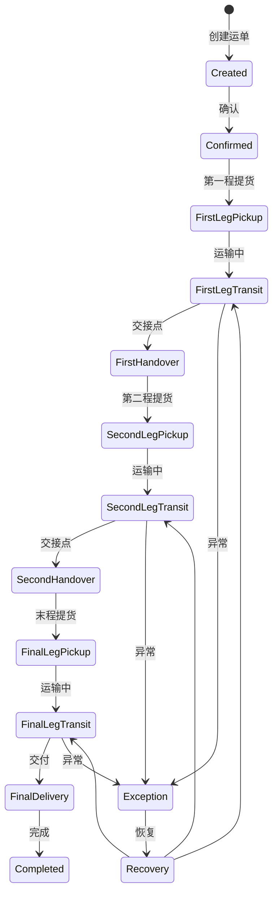

# TMS Schema形式语法与语义分析视图

**版本**: v1.0
**创建日期**: 2026-02-15
**标准**: ISO 14016, CEN/TS 16614 (NeTEx), IATA Cargo XML

---

## 📑 目录

- [TMS Schema形式语法与语义分析视图](#tms-schema形式语法与语义分析视图)
  - [📑 目录](#-目录)
  - [1. 形式文法定义](#1-形式文法定义)
    - [1.1 EBNF文法](#11-ebnf文法)
      - [1.1.1 运单实体文法](#111-运单实体文法)
      - [1.1.2 路线实体文法](#112-路线实体文法)
      - [1.1.3 承运商实体文法](#113-承运商实体文法)
      - [1.1.4 装载实体文法](#114-装载实体文法)
    - [1.2 语法规则](#12-语法规则)
      - [1.2.1 运单约束规则](#121-运单约束规则)
      - [1.2.2 路线约束规则](#122-路线约束规则)
      - [1.2.3 承运商约束规则](#123-承运商约束规则)
      - [1.2.4 装载约束规则](#124-装载约束规则)
      - [1.2.5 状态转换规则](#125-状态转换规则)
  - [2. 形式语义定义](#2-形式语义定义)
    - [2.1 指称语义 (Denotational Semantics)](#21-指称语义-denotational-semantics)
      - [2.1.1 语义域定义](#211-语义域定义)
      - [2.1.2 运单语义](#212-运单语义)
      - [2.1.3 路线语义](#213-路线语义)
      - [2.1.4 装载语义](#214-装载语义)
    - [2.2 操作语义 (Operational Semantics)](#22-操作语义-operational-semantics)
      - [2.2.1 大步语义 (Big-Step Semantics)](#221-大步语义-big-step-semantics)
      - [2.2.2 小步语义 (Small-Step Semantics)](#222-小步语义-small-step-semantics)
      - [2.2.3 运单状态机语义](#223-运单状态机语义)
    - [2.3 公理语义 (Axiomatic Semantics)](#23-公理语义-axiomatic-semantics)
      - [2.3.1 Hoare三元组](#231-hoare三元组)
      - [2.3.2 运单操作推理规则](#232-运单操作推理规则)
      - [2.3.3 装载优化公理](#233-装载优化公理)
      - [2.3.4 运输不变式证明](#234-运输不变式证明)
      - [2.3.5 装载可行性证明](#235-装载可行性证明)
  - [3. 类型系统](#3-类型系统)
    - [3.1 类型规则](#31-类型规则)
    - [3.2 类型运算规则](#32-类型运算规则)
    - [3.3 子类型关系](#33-子类型关系)
    - [3.4 多态与类型约束](#34-多态与类型约束)
  - [4. 语义等价性](#4-语义等价性)
    - [4.1 程序等价定义](#41-程序等价定义)
    - [4.2 等价变换规则](#42-等价变换规则)
    - [4.3 运输操作等价性](#43-运输操作等价性)
  - [5. Mermaid可视化](#5-mermaid可视化)
    - [5.1 运费计算流程](#51-运费计算流程)
    - [5.2 运单状态转换流程](#52-运单状态转换流程)
    - [5.3 装载优化流程](#53-装载优化流程)
    - [5.4 路线规划流程](#54-路线规划流程)
    - [5.5 承运商选择流程](#55-承运商选择流程)
    - [5.6 形式语义层级图](#56-形式语义层级图)
    - [5.7 多式联运状态机](#57-多式联运状态机)

---

## 1. 形式文法定义

### 1.1 EBNF文法

#### 1.1.1 运单实体文法

```ebnf
(* TMS核心实体 - 运单定义 *)

Shipment ::= FTLShipment | LTLShipment | MultimodalShipment | ExpressShipment

FTLShipment ::= '{'
    '"shipment_id"' ':' ShipmentId ','
    '"shipment_number"' ':' ShipmentNumber ','
    '"shipment_type"' ':' '"FTL"' ','
    '"customer_id"' ':' CustomerId ','
    '"shipper"' ':' PartyInfo ','
    '"consignee"' ':' PartyInfo ','
    '"cargo"' ':' CargoInfo ','
    '"route"' ':' RouteRef ','
    '"vehicle_requirements"' ':' VehicleRequirements ','
    '"service_level"' ':' ServiceLevel ','
    '"scheduled_pickup"' ':' Timestamp ','
    '"scheduled_delivery"' ':' Timestamp ','
    '"carrier_assignment"' ':' CarrierAssignment? ','
    '"shipment_status"' ':' ShipmentStatus ','
    '"charges"' ':' ChargeInfo
'}'

LTLShipment ::= '{'
    '"shipment_id"' ':' ShipmentId ','
    '"shipment_number"' ':' ShipmentNumber ','
    '"shipment_type"' ':' '"LTL"' ','
    '"customer_id"' ':' CustomerId ','
    '"shipper"' ':' PartyInfo ','
    '"consignee"' ':' PartyInfo ','
    '"cargo"' ':' CargoInfo ','
    '"nmfc_code"' ':' NMFCCode? ','
    '"freight_class"' ':' FreightClass ','
    '"ltl_attributes"' ':' LTLAttributes ','
    '"hub_routing"' ':' HubRouting ','
    '"service_level"' ':' ServiceLevel ','
    '"scheduled_pickup"' ':' Timestamp ','
    '"scheduled_delivery"' ':' Timestamp ','
    '"shipment_status"' ':' ShipmentStatus
'}'

MultimodalShipment ::= '{'
    '"shipment_id"' ':' ShipmentId ','
    '"shipment_number"' ':' ShipmentNumber ','
    '"shipment_type"' ':' '"MULTIMODAL"' ','
    '"customer_id"' ':' CustomerId ','
    '"shipper"' ':' PartyInfo ','
    '"consignee"' ':' PartyInfo ','
    '"cargo"' ':' CargoInfo ','
    '"legs"' ':' MultimodalLegList ','
    '"master_bill_number"' ':' MasterBillNumber? ','
    '"house_bill_numbers"' ':' HouseBillNumberList ','
    '"customs_info"' ':' CustomsInfo? ','
    '"shipment_status"' ':' ShipmentStatus
'}'

ExpressShipment ::= '{'
    '"shipment_id"' ':' ShipmentId ','
    '"shipment_number"' ':' ShipmentNumber ','
    '"shipment_type"' ':' '"EXPRESS"' ','
    '"customer_id"' ':' CustomerId ','
    '"shipper"' ':' PartyInfo ','
    '"consignee"' ':' PartyInfo ','
    '"cargo"' ':' CargoInfo ','
    '"express_service"' ':' ExpressService ','
    '"declared_value"' ':' MonetaryAmount? ','
    '"signature_required"' ':' Boolean ','
    '"shipment_status"' ':' ShipmentStatus
'}'

(* 参与方信息 *)
PartyInfo ::= '{'
    '"party_type"' ':' PartyType ','
    '"name"' ':' String(100) ','
    '"address"' ':' Address ','
    '"contact"' ':' ContactInfo ','
    '"location_code"' ':' LocationCode?
'}'

(* 货物信息 *)
CargoInfo ::= '{'
    '"description"' ':' String(200) ','
    '"commodity_type"' ':' CommodityType ','
    '"total_packages"' ':' Integer ','
    '"packaging_type"' ':' PackagingType ','
    '"weight"' ':' WeightInfo ','
    '"dimensions"' ':' Dimensions ','
    '"volume"' ':' Volume ','
    '"hazardous_material"' ':' Boolean ','
    '"hazmat_class"' ':' HazmatClass? ','
    '"temperature_controlled"' ':' Boolean ','
    '"temperature_range"' ':' TemperatureRange?
'}'

(* 标识符格式 *)
ShipmentId ::= '[A-Z0-9]{20}'
ShipmentNumber ::= '(SHP|FTL|LTL|MUL|EXP)[0-9]{10,15}'
CustomerId ::= 'CUST[A-Z0-9]{8,15}'
LocationCode ::= '[A-Z]{2,4}[0-9]{2,6}'
NMFCCode ::= '[0-9]{4,6}'
MasterBillNumber ::= '[A-Z]{3}[0-9]{8}'
HouseBillNumber ::= '[A-Z0-9]{8,12}'

(* 枚举值 *)
FreightClass ::= '50' | '55' | '60' | '65' | '70' | '77.5' | '85' | '92.5' | '100' |
                 '110' | '125' | '150' | '175' | '200' | '250' | '300' | '400' | '500'
ServiceLevel ::= 'Standard' | 'Expedited' | 'Guaranteed' | 'White_Glove' | 'Economy'
ShipmentStatus ::= 'Created' | 'Confirmed' | 'Pending_Pickup' | 'Picked_Up' | 'In_Transit' |
                   'At_Hub' | 'Out_For_Delivery' | 'Delivered' | 'Completed' | 'Cancelled' | 'Exception'
PartyType ::= 'Shipper' | 'Consignee' | 'Bill_To' | 'Notify'
PackagingType ::= 'Pallet' | 'Carton' | 'Crate' | 'Drum' | 'Bulk' | 'Bag' | 'Roll' | 'Reel'
CommodityType ::= 'General' | 'Hazmat' | 'Perishable' | 'Fragile' | 'High_Value' | 'Oversized'
ExpressService ::= 'Same_Day' | 'Next_Day' | 'Second_Day' | 'Deferred'
```

#### 1.1.2 路线实体文法

```ebnf
(* 路线定义 - 起点、终点、途经点、里程 *)

Route ::= DirectRoute | HubSpokeRoute | MilkRunRoute | DynamicRoute

DirectRoute ::= '{'
    '"route_id"' ':' RouteId ','
    '"route_number"' ':' RouteNumber ','
    '"route_type"' ':' '"Direct"' ','
    '"origin"' ':' Location ','
    '"destination"' ':' Location ','
    '"distance"' ':' Distance ','
    '"estimated_duration"' ':' Duration ','
    '"path_geometry"' ':' GeoJSON? ','
    '"toll_cost"' ':' MonetaryAmount? ','
    '"restrictions"' ':' RouteRestrictions?
'}'

HubSpokeRoute ::= '{'
    '"route_id"' ':' RouteId ','
    '"route_number"' ':' RouteNumber ','
    '"route_type"' ':' '"Hub_And_Spoke"' ','
    '"origin"' ':' Location ','
    '"destination"' ':' Location ','
    '"hub_location"' ':' Location ','
    '"first_leg"' ':' RouteLeg ','
    '"second_leg"' ':' RouteLeg ','
    '"total_distance"' ':' Distance ','
    '"total_duration"' ':' Duration
'}'

MilkRunRoute ::= '{'
    '"route_id"' ':' RouteId ','
    '"route_number"' ':' RouteNumber ','
    '"route_type"' ':' '"Milk_Run"' ','
    '"stops"' ':' StopList ','
    '"total_distance"' ':' Distance ','
    '"total_duration"' ':' Duration ','
    '"optimization_objective"' ':' OptimizationObjective
'}'

DynamicRoute ::= '{'
    '"route_id"' ':' RouteId ','
    '"route_number"' ':' RouteNumber ','
    '"route_type"' ':' '"Dynamic"' ','
    '"origin"' ':' Location ','
    '"destination"' ':' Location ','
    '"waypoints"' ':' WaypointList ','
    '"real_time_optimized"' ':' Boolean ','
    '"traffic_considered"' ':' Boolean ','
    '"current_estimate"' ':' RouteEstimate
'}'

(* 路线段 *)
RouteLeg ::= '{'
    '"leg_id"' ':' LegId ','
    '"sequence"' ':' Integer ','
    '"from_location"' ':' Location ','
    '"to_location"' ':' Location ','
    '"mode_of_transport"' ':' TransportMode ','
    '"distance"' ':' Distance ','
    '"duration"' ':' Duration ','
    '"cost"' ':' MonetaryAmount?
'}'

(* 多点停靠 *)
Stop ::= '{'
    '"stop_id"' ':' StopId ','
    '"sequence"' ':' Integer ','
    '"location"' ':' Location ','
    '"stop_type"' ':' StopType ','
    '"time_window"' ':' TimeWindow ','
    '"planned_duration"' ':' Duration ','
    '"shipment_refs"' ':' ShipmentRefList
'}'

(* 途经点 *)
Waypoint ::= '{'
    '"sequence"' ':' Integer ','
    '"coordinates"' ':' Coordinates ','
    '"location_type"' ':' WaypointType
'}'

(* 位置信息 *)
Location ::= '{'
    '"location_id"' ':' LocationId? ','
    '"location_code"' ':' LocationCode? ','
    '"name"' ':' String(100) ','
    '"address"' ':' Address ','
    '"coordinates"' ':' Coordinates ','
    '"location_type"' ':' LocationType
'}'

(* 标识符格式 *)
RouteId ::= 'RT[A-Z0-9]{16}'
RouteNumber ::= 'R[0-9]{8,12}'
LegId ::= 'LEG[0-9]{12}'
StopId ::= 'STP[0-9]{12}'
LocationId ::= 'LOC[A-Z0-9]{12}'

(* 枚举值 *)
TransportMode ::= 'Road' | 'Rail' | 'Air' | 'Ocean' | 'Intermodal'
StopType ::= 'Pickup' | 'Delivery' | 'Relay' | 'Rest' | 'Fuel'
WaypointType ::= 'Via' | 'Avoid' | 'Mandatory' | 'Toll'
LocationType ::= 'Warehouse' | 'Distribution_Center' | 'Port' | 'Airport' | 'Rail_Terminal' | 'Customer'
OptimizationObjective ::= 'Minimize_Distance' | 'Minimize_Time' | 'Minimize_Cost' | 'Minimize_Carbon' | 'Balanced'
```

#### 1.1.3 承运商实体文法

```ebnf
(* 承运商定义 - 资质、评分、合同费率 *)

Carrier ::= TruckingCarrier | RailCarrier | AirCarrier | OceanCarrier | FreightForwarder

TruckingCarrier ::= '{'
    '"carrier_id"' ':' CarrierId ','
    '"carrier_code"' ':' CarrierCode ','
    '"company_name"' ':' String(100) ','
    '"legal_name"' ':' String(100) ','
    '"operating_authority"' ':' OperatingAuthority ','
    '"insurance"' ':' InsuranceInfo ','
    '"fleet_info"' ':' FleetInfo ','
    '"service_capabilities"' ':' ServiceCapabilities ','
    '"certifications"' ':' CertificationList ','
    '"performance_metrics"' ':' PerformanceMetrics ','
    '"rating"' ':' CarrierRating ','
    '"contract_rates"' ':' ContractRateList
'}'

RailCarrier ::= '{'
    '"carrier_id"' ':' CarrierId ','
    '"carrier_code"' ':' CarrierCode ','
    '"railroad_code"' ':' RailroadCode ','
    '"company_name"' ':' String(100) ','
    '"service_regions"' ':' ServiceRegionList ','
    '"equipment_types"' ':' RailEquipmentList ','
    '"interchange_points"' ':' InterchangePointList ','
    '"performance_metrics"' ':' PerformanceMetrics
'}'

AirCarrier ::= '{'
    '"carrier_id"' ':' CarrierId ','
    '"carrier_code"' ':' CarrierCode ','
    '"iata_code"' ':' IATACode ','
    '"icao_code"' ':' ICAOCode ','
    '"company_name"' ':' String(100) ','
    '"hub_airports"' ':' AirportCodeList ','
    '"aircraft_types"' ':' AircraftTypeList ','
    '"cargo_capacity"' ':' CargoCapacity ','
    '"performance_metrics"' ':' PerformanceMetrics
'}'

OceanCarrier ::= '{'
    '"carrier_id"' ':' CarrierId ','
    '"carrier_code"' ':' CarrierCode ','
    '"scac_code"' ':' SCACCode ','
    '"company_name"' ':' String(100) ','
    '"trade_lanes"' ':' TradeLaneList ','
    '"vessel_fleet"' ':' VesselList ','
    '"container_capacity"' ':' TEUCapacity ','
    '"performance_metrics"' ':' PerformanceMetrics
'}'

(* 运营资质 *)
OperatingAuthority ::= '{'
    '"dot_number"' ':' DOTNumber? ','
    '"mc_number"' ':' MCNumber? ','
    '"authority_type"' ':' AuthorityType ','
    '"operating_modes"' ':' OperatingModeList ','
    '"cargo_authorizations"' ':' CargoAuthorizationList ','
    '"authority_status"' ':' AuthorityStatus ','
    '"effective_date"' ':' Date ','
    '"expiry_date"' ':' Date?
'}'

(* 保险信息 *)
InsuranceInfo ::= '{'
    '"auto_liability"' ':' CoverageInfo ','
    '"cargo_insurance"' ':' CoverageInfo ','
    '"general_liability"' ':' CoverageInfo?
'}'

(* 车队信息 *)
FleetInfo ::= '{'
    '"total_power_units"' ':' Integer ','
    '"total_trailers"' ':' Integer ','
    '"driver_count"' ':' Integer ','
    '"equipment_types"' ':' EquipmentTypeList
'}'

(* 服务能力 *)
ServiceCapabilities ::= '{'
    '"service_types"' ':' ServiceTypeList ','
    '"equipment_types"' ':' EquipmentTypeList ','
    '"geographic_coverage"' ':' GeographicCoverage ','
    '"special_services"' ':' SpecialServiceList
'}'

(* 绩效指标 *)
PerformanceMetrics ::= '{'
    '"on_time_percentage"' ':' Percentage ','
    '"damage_claim_rate"' ':' Percentage ','
    '"safety_rating"' ':' SafetyRating ','
    '"average_transit_time"' ':' Duration? ','
    '"last_evaluation_date"' ':' Date
'}'

(* 承运商评分 *)
CarrierRating ::= '{'
    '"overall_rating"' ':' Decimal(3,1) ','
    '"rating_tier"' ':' RatingTier ','
    '"on_time_score"' ':' Integer(0,100) ','
    '"service_quality_score"' ':' Integer(0,100) ','
    '"communication_score"' ':' Integer(0,100)
'}'

(* 合同费率 *)
ContractRate ::= '{'
    '"rate_id"' ':' RateId ','
    '"origin_zone"' ':' ZoneCode ','
    '"destination_zone"' ':' ZoneCode ','
    '"equipment_type"' ':' EquipmentType ','
    '"base_rate"' ':' MonetaryAmount ','
    '"fuel_surcharge"' ':' Percentage ','
    '"effective_date"' ':' Date ','
    '"expiry_date"' ':' Date?
'}'

(* 标识符格式 *)
CarrierId ::= 'CAR[A-Z0-9]{12}'
CarrierCode ::= '[A-Z0-9]{4,10}'
DOTNumber ::= '[0-9]{6,8}'
MCNumber ::= 'MC[0-9]{6,8}'
RailroadCode ::= '[A-Z]{2,4}'
IATACode ::= '[A-Z]{2,3}'
ICAOCode ::= '[A-Z]{3}'
SCACCode ::= '[A-Z]{4}'
RateId ::= 'RATE[0-9]{12}'
ZoneCode ::= '[A-Z0-9]{3,8}'

(* 枚举值 *)
AuthorityType ::= 'Common_Carrier' | 'Contract_Carrier' | 'Private_Carrier' | 'Broker'
AuthorityStatus ::= 'Active' | 'Inactive' | 'Revoked' | 'Pending'
SafetyRating ::= 'Satisfactory' | 'Conditional' | 'Unsatisfactory'
RatingTier ::= 'S' | 'A' | 'B' | 'C' | 'D'
EquipmentType ::= 'Dry_Van' | 'Reefer' | 'Flatbed' | 'Step_Deck' | 'Tanker' | 'Container' | 'Box_Truck'
ServiceType ::= 'FTL' | 'LTL' | 'Express' | 'Intermodal' | 'Drayage' | 'White_Glove'
SpecialService ::= 'Hazmat' | 'Oversize' | 'Temperature_Controlled' | 'Expedited' | 'Residential'
```

#### 1.1.4 装载实体文法

```ebnf
(* 装载定义 - 车辆、集装箱、配载优化 *)

Load ::= TruckLoad | ContainerLoad | AirCargoLoad | RailCarLoad

TruckLoad ::= '{'
    '"load_id"' ':' LoadId ','
    '"load_number"' ':' LoadNumber ','
    '"load_type"' ':' '"TRUCK"' ','
    '"vehicle"' ':' VehicleAssignment ','
    '"driver"' ':' DriverAssignment ','
    '"shipments"' ':' ShipmentAssignmentList ','
    '"stops"' ':' LoadStopList ','
    '"route"' ':' RouteRef ','
    '"load_optimization"' ':' LoadOptimization ','
    '"load_status"' ':' LoadStatus
'}'

ContainerLoad ::= '{'
    '"load_id"' ':' LoadId ','
    '"load_number"' ':' LoadNumber ','
    '"load_type"' ':' '"CONTAINER"' ','
    '"container"' ':' ContainerInfo ','
    '"shipments"' ':' ShipmentAssignmentList ','
    '"stuffing_plan"' ':' StuffingPlan ','
    '"vessel_voyage"' ':' VesselVoyage? ','
    '"load_status"' ':' LoadStatus
'}'

AirCargoLoad ::= '{'
    '"load_id"' ':' LoadId ','
    '"load_number"' ':' LoadNumber ','
    '"load_type"' ':' '"AIR_CARGO"' ','
    '"uld_containers"' ':' ULDList ','
    '"shipments"' ':' ShipmentAssignmentList ','
    '"flight_info"' ':' FlightInfo ','
    '"load_status"' ':' LoadStatus
'}'

(* 车辆分配 *)
VehicleAssignment ::= '{'
    '"vehicle_id"' ':' VehicleId ','
    '"vehicle_number"' ':' VehicleNumber ','
    '"vehicle_type"' ':' VehicleType ','
    '"capacity"' ':' VehicleCapacity ','
    '"current_location"' ':' Location? ','
    '"available_from"' ':' Timestamp
'}'

(* 司机分配 *)
DriverAssignment ::= '{'
    '"driver_id"' ':' DriverId ','
    '"driver_name"' ':' String(50) ','
    '"license_number"' ':' LicenseNumber ','
    '"hos_status"' ':' HOSStatus ','
    '"available_driving_hours"' ':' Decimal ','
    '"phone"' ':' PhoneNumber
'}'

(* 集装箱信息 *)
ContainerInfo ::= '{'
    '"container_number"' ':' ContainerNumber ','
    '"container_size"' ':' ContainerSize ','
    '"container_type"' ':' ContainerType ','
    '"tare_weight"' ':' Weight ','
    '"max_gross_weight"' ':' Weight ','
    '"internal_dimensions"' ':' Dimensions
'}'

(* 装载计划 *)
StuffingPlan ::= '{'
    '"plan_id"' ':' PlanId ','
    '"optimization_algorithm"' ':' OptimizationAlgorithm ','
    '"layer_plan"' ':' LayerPlanList ','
    '"utilization"' ':' UtilizationMetrics ','
    '"load_sequence"' ':' LoadSequenceList
'}'

(* 装载优化 *)
LoadOptimization ::= '{'
    '"optimized"' ':' Boolean ','
    '"algorithm"' ':' OptimizationAlgorithm ','
    '"objective"' ':' OptimizationObjective ','
    '"utilization_score"' ':' Percentage ','
    '"feasibility_score"' ':' Percentage
'}'

(* 利用率指标 *)
UtilizationMetrics ::= '{'
    '"weight_utilization"' ':' Percentage ','
    '"volume_utilization"' ':' Percentage ','
    '"floor_space_utilization"' ':' Percentage ','
    '"overall_utilization"' ':' Percentage
'}'

(* 标识符格式 *)
LoadId ::= 'LD[A-Z0-9]{16}'
LoadNumber ::= 'LOAD[0-9]{10,12}'
VehicleId ::= 'VEH[A-Z0-9]{12}'
VehicleNumber ::= String(5,15)
DriverId ::= 'DRV[A-Z0-9]{10}'
LicenseNumber ::= String(5,20)
ContainerNumber ::= '[A-Z]{4}[0-9]{7}'
PlanId ::= 'PLN[0-9]{12}'

(* 枚举值 *)
LoadStatus ::= 'Planned' | 'Loading' | 'Loaded' | 'In_Transit' | 'Unloading' | 'Completed'
ContainerSize ::= '_20ft' | '_40ft' | '_40ft_HC' | '_45ft'
ContainerType ::= 'Dry' | 'Reefer' | 'Open_Top' | 'Flat_Rack' | 'Tank'
VehicleType ::= 'Tractor' | 'Straight_Truck' | 'Box_Truck' | 'Van'
OptimizationAlgorithm ::= 'Greedy' | 'Genetic' | 'Simulated_Annealing' | 'Constraint_Satisfaction' | '3D_Bin_Packing'
```

### 1.2 语法规则

#### 1.2.1 运单约束规则

```
约束1: 运单号唯一性
  ∀s1, s2 ∈ Shipment :
    s1 ≠ s2 ⇒ s1.shipment_number ≠ s2.shipment_number

约束2: 收发货地址有效性
  ∀s ∈ Shipment :
    valid_address(s.shipper.address) ∧ valid_address(s.consignee.address)

约束3: 时间窗口有效性
  ∀s ∈ Shipment :
    s.scheduled_pickup < s.scheduled_delivery

约束4: 货物重量限制
  ∀s ∈ Shipment :
    s.cargo.weight.actual_weight > 0 ∧ s.cargo.weight.chargeable_weight > 0

约束5: 危险品合规性
  ∀s ∈ Shipment where s.cargo.hazardous_material = true :
    s.cargo.hazmat_class ≠ ⊥ ∧ valid_hazmat_documentation(s)

约束6: 温控要求一致性
  ∀s ∈ Shipment where s.cargo.temperature_controlled = true :
    s.cargo.temperature_range ≠ ⊥ ∧
    s.cargo.temperature_range.min < s.cargo.temperature_range.max
```

#### 1.2.2 路线约束规则

```
约束7: 路线距离正数
  ∀r ∈ Route : r.distance.value > 0

约束8: 多点停靠序列唯一
  ∀r ∈ MilkRunRoute :
    all_distinct(map(λs. s.sequence, r.stops))

约束9: 路线段连接性
  ∀r ∈ HubSpokeRoute :
    r.first_leg.to_location = r.hub_location ∧
    r.second_leg.from_location = r.hub_location

约束10: 途经点顺序
  ∀r ∈ Route with r.waypoints :
    sorted_by_sequence(r.waypoints)

约束11: 预估时间合理性
  ∀r ∈ Route : r.estimated_duration > 0 ∧ r.estimated_duration < MAX_TRANSIT_TIME
```

#### 1.2.3 承运商约束规则

```
约束12: 承运商代码唯一性
  ∀c1, c2 ∈ Carrier : c1 ≠ c2 ⇒ c1.carrier_code ≠ c2.carrier_code

约束13: 运营资质有效性
  ∀c ∈ TruckingCarrier :
    c.operating_authority.authority_status = 'Active' ∧
    (c.operating_authority.expiry_date = ⊥ ∨
     c.operating_authority.expiry_date > current_date())

约束14: 保险覆盖充足
  ∀c ∈ TruckingCarrier :
    c.insurance.auto_liability.coverage_amount ≥ MIN_LIABILITY_COVERAGE ∧
    c.insurance.cargo_insurance.coverage_amount ≥ MIN_CARGO_COVERAGE

约束15: 安全评级要求
  ∀c ∈ Carrier where c.rating.rating_tier = 'D' :
    c.operating_authority.authority_status = 'Inactive'

约束16: 合同费率有效期
  ∀cr ∈ ContractRate :
    cr.effective_date ≤ current_date() ∧
    (cr.expiry_date = ⊥ ∨ cr.expiry_date ≥ current_date())
```

#### 1.2.4 装载约束规则

```
约束17: 装载重量限制
  ∀l ∈ TruckLoad :
    sum(map(λs. s.cargo.weight.actual_weight, l.shipments)) ≤
    l.vehicle.capacity.max_weight

约束18: 装载体积限制
  ∀l ∈ Load :
    sum(map(λs. s.cargo.volume, l.shipments)) ≤ l.vehicle.capacity.max_volume

约束19: 司机工作时间合规
  ∀l ∈ TruckLoad where l.load_status = 'In_Transit' :
    l.driver.hos_status.compliant = true ∧
    l.driver.available_driving_hours ≥ MIN_REQUIRED_DRIVING_HOURS

约束20: 集装箱重量限制
  ∀cl ∈ ContainerLoad :
    sum(map(λs. s.cargo.weight.actual_weight, cl.shipments)) + cl.container.tare_weight ≤
    cl.container.max_gross_weight

约束21: 装载序列有效性
  ∀l ∈ Load where l.load_optimization.stuffing_plan ≠ ⊥ :
    valid_load_sequence(l.load_optimization.stuffing_plan.load_sequence)

约束22: 利用率上限
  ∀l ∈ Load :
    l.load_optimization.utilization_score ≤ 100%
```

#### 1.2.5 状态转换规则

```
约束23: 运单状态机有效转换
  valid_transition(ShipmentStatus) = {
    Created → {Confirmed, Cancelled},
    Confirmed → {Pending_Pickup, Cancelled},
    Pending_Pickup → {Picked_Up, Exception},
    Picked_Up → {In_Transit, Exception},
    In_Transit → {At_Hub, Out_For_Delivery, Exception},
    At_Hub → {Out_For_Delivery, Exception},
    Out_For_Delivery → {Delivered, Exception},
    Delivered → {Completed, Exception},
    Exception → {In_Transit, Cancelled}
  }

约束24: 装载状态一致性
  ∀l ∈ Load, ∀s ∈ l.shipments :
    load_status_implies_shipment_status(l.load_status, s.shipment_status)

约束25: 车辆状态一致性
  ∀l ∈ TruckLoad :
    l.load_status = 'In_Transit' ⇒ l.vehicle.current_location ≠ ⊥
```

---

## 2. 形式语义定义

### 2.1 指称语义 (Denotational Semantics)

#### 2.1.1 语义域定义

```
D[TMSSystem] : Environment → State → State

State = ShipmentState × RouteState × CarrierState × LoadState × TrackingState

ShipmentState = ShipmentId → ShipmentValue
ShipmentValue = {
  shipment_number: ShipmentNumber,
  shipment_type: ShipmentType,
  customer_id: CustomerId,
  shipper: PartyInfo,
  consignee: PartyInfo,
  cargo: CargoInfo,
  route: RouteRef,
  scheduled_pickup: Timestamp,
  scheduled_delivery: Timestamp,
  shipment_status: ShipmentStatus,
  ...
}

RouteState = RouteId → RouteValue
RouteValue = {
  route_number: RouteNumber,
  route_type: RouteType,
  origin: Location,
  destination: Location,
  distance: Distance,
  estimated_duration: Duration,
  waypoints: List<Waypoint>,
  ...
}

CarrierState = CarrierId → CarrierValue
CarrierValue = {
  carrier_code: CarrierCode,
  company_name: String,
  operating_authority: OperatingAuthority,
  insurance: InsuranceInfo,
  rating: CarrierRating,
  contract_rates: List<ContractRate>,
  performance_metrics: PerformanceMetrics,
  ...
}

LoadState = LoadId → LoadValue
LoadValue = {
  load_number: LoadNumber,
  load_type: LoadType,
  vehicle: VehicleAssignment,
  driver: DriverAssignment,
  shipments: List<ShipmentAssignment>,
  load_optimization: LoadOptimization,
  load_status: LoadStatus,
  ...
}

TrackingState = ShipmentId → TrackingValue
TrackingValue = {
  current_location: Location?,
  last_update: Timestamp,
  status_history: List<StatusEvent>,
  estimated_arrival: Timestamp?,
  ...
}

Distance = {value: ℝ⁺, unit: DistanceUnit}
Duration = {value: ℕ, unit: TimeUnit}
Timestamp = ℕ  (* Unix时间戳 *)
```

#### 2.1.2 运单语义

```
(* 运输费用计算 *)
E[shipment.total_cost] env sto =
  let s = lookup_shipment(sto, env.shipment_id) in
  let base = calculate_base_rate(s) in
  let fuel = calculate_fuel_surcharge(s, base) in
  let accessorial = sum(map(λa. a.amount, s.accessorial_charges)) in
  base + fuel + accessorial

(* 计费重量计算 *)
E[shipment.chargeable_weight] env sto =
  let s = lookup_shipment(sto, env.shipment_id) in
  let actual = s.cargo.weight.actual_weight in
  let dimensional = s.cargo.volume * DIM_FACTOR in
  max(actual, dimensional)

(* 运单状态转换 *)
S[shipment.status := new_status] env sto =
  let s = lookup_shipment(sto, env.shipment_id) in
  if valid_shipment_transition(s.shipment_status, new_status)
  then sto[shipment ↦ s[shipment_status ↦ new_status,
                         status_history ↦ append(s.status_history, new_event(new_status))]]
  else error "Invalid shipment status transition"

(* 运单分配承运商 *)
S[assign_carrier(shipment, carrier)] env sto =
  let s = lookup_shipment(sto, shipment.shipment_id) in
  let c = lookup_carrier(sto, carrier.carrier_id) in
  if c.rating.rating_tier ≠ 'D' ∧ c.operating_authority.authority_status = 'Active'
  then sto[shipment ↦ s[carrier_assignment ↦ carrier,
                         shipment_status ↦ 'Confirmed']]
  else error "Carrier not qualified for assignment"

(* 预计到达时间计算 *)
E[shipment.estimated_arrival] env sto =
  let s = lookup_shipment(sto, env.shipment_id) in
  let r = lookup_route(sto, s.route.route_id) in
  let base_eta = s.scheduled_pickup + r.estimated_duration in
  apply_traffic_adjustments(base_eta, r)
```

#### 2.1.3 路线语义

```
(* 路线距离计算 *)
E[route.total_distance] env sto =
  let r = lookup_route(sto, env.route_id) in
  case r.route_type of
    'Direct' → r.distance
    'Hub_And_Spoke' → r.first_leg.distance + r.second_leg.distance
    'Milk_Run' → sum(map(λleg. leg.distance, calculate_legs(r.stops)))
    'Dynamic' → r.current_estimate.distance

(* 路线时间估算 *)
E[route.estimated_duration] env sto =
  let r = lookup_route(sto, env.route_id) in
  let base_time = r.estimated_duration in
  apply_traffic_conditions(base_time, r)

(* 路线优化 *)
S[optimize_route(route, objective)] env sto =
  let r = lookup_route(sto, route.route_id) in
  let optimized = run_optimization_algorithm(r, objective) in
  sto[route ↦ r[waypoints ↦ optimized.waypoints,
                estimated_duration ↦ optimized.duration,
                distance ↦ optimized.distance,
                real_time_optimized ↦ true]]
```

#### 2.1.4 装载语义

```
(* 装载重量检查 *)
E[load.total_weight] env sto =
  let l = lookup_load(sto, env.load_id) in
  sum(map(λs. s.cargo.weight.actual_weight, l.shipments))

(* 装载体积检查 *)
E[load.total_volume] env sto =
  let l = lookup_load(sto, env.load_id) in
  sum(map(λs. s.cargo.volume, l.shipments))

(* 装载可行性检查 *)
E[load.is_feasible] env sto =
  let l = lookup_load(sto, env.load_id) in
  let total_weight = sum(map(λs. s.cargo.weight.actual_weight, l.shipments)) in
  let total_volume = sum(map(λs. s.cargo.volume, l.shipments)) in
  total_weight ≤ l.vehicle.capacity.max_weight ∧
  total_volume ≤ l.vehicle.capacity.max_volume

(* 装载创建语义 *)
S[create_load(shipments, vehicle)] env sto =
  let new_load = construct_load(shipments, vehicle) in
  if feasible_load(new_load)
  then sto[load ↦ new_load]
  else error "Load not feasible with given shipments and vehicle"

(* 配载优化执行 *)
S[optimize_load(load)] env sto =
  let l = lookup_load(sto, load.load_id) in
  let plan = run_load_optimization(l.shipments, l.vehicle) in
  sto[load ↦ l[load_optimization ↦ plan]]

(* 利用率计算 *)
E[load.utilization] env sto =
  let l = lookup_load(sto, env.load_id) in
  let weight_util = load.total_weight / l.vehicle.capacity.max_weight in
  let volume_util = load.total_volume / l.vehicle.capacity.max_volume in
  min(weight_util, volume_util)
```

### 2.2 操作语义 (Operational Semantics)

#### 2.2.1 大步语义 (Big-Step Semantics)

```
配置: ⟨Expression, State⟩ ⇓ Value
      ⟨Statement, State⟩ ⇓ State'

(* 运单创建 *)
⟨create_shipment(req), σ⟩ ⇓ σ[shipment ↦ new_shipment(req)]          (S-CreateShipment)
  where valid_shipment_request(req)

(* 承运商分配 *)
⟨assign_carrier(s, c), σ⟩ ⇓ σ[shipment.carrier ↦ c]                  (S-AssignCarrier)
  where qualified_carrier(c, s) ∧ c.status = 'Active'

(* 路线计算 *)
⟨calculate_route(origin, dest), σ⟩ ⇓ route_value                     (E-CalcRoute)
  where route_value = shortest_path(origin, dest, σ.route_graph)

(* 运单状态更新 *)
⟨update_status(s, new_status), σ⟩ ⇓ σ'                               (S-UpdateStatus)
────────────────────────────────────────────────────────────────────────
valid_transition(σ(s).status, new_status)
σ' = σ[s.status ↦ new_status, s.history ↦ append(s.history, new_status)]

(* 装载创建 *)
⟨create_load(shipments, vehicle), σ⟩ ⇓ σ[load ↦ new_load]            (S-CreateLoad)
  where feasible_load(shipments, vehicle)

(* 装载优化 *)
⟨optimize_load(load), σ⟩ ⇓ σ[load.optimization ↦ plan]               (S-Optimize)
  where plan = run_3d_bin_packing(load.shipments, load.vehicle)

(* 费用计算 *)
⟨calculate_freight_charge(shipment), σ⟩ ⇓ monetary_amount            (E-CalcCharge)
────────────────────────────────────────────────────────────────────────
let base = lookup_contract_rate(shipment) in
let fuel = base * get_fuel_surcharge_rate(shipment) in
monetary_amount = base + fuel + sum(accessorials)

(* 跟踪更新 *)
⟨update_tracking(shipment, location), σ⟩ ⇓ σ'                        (S-UpdateTracking)
────────────────────────────────────────────────────────────────────────
σ' = σ[tracking.location ↦ location, tracking.last_update ↦ now()]
```

#### 2.2.2 小步语义 (Small-Step Semantics)

```
配置: ⟨Statement, State⟩ → ⟨Statement', State'⟩
      或 ⟨Statement, State⟩ → State'  (终止)

(* 运单状态转换 *)
⟨shipment.status := Confirmed, σ⟩ → σ[shipment.status ↦ Confirmed]   (S-SetConfirmed)
  where σ(shipment).status = Created

⟨shipment.status := Picked_Up, σ⟩ → σ[shipment.status ↦ Picked_Up]   (S-SetPickedUp)
  where σ(shipment).status = Pending_Pickup

⟨shipment.status := Delivered, σ⟩ → σ[shipment.status ↦ Delivered]   (S-SetDelivered)
  where σ(shipment).status = Out_For_Delivery

(* 装载处理步骤 *)
⟨process_load(l), σ⟩ → ⟨plan_load(l) ; execute_load(l) ; confirm_load(l), σ⟩   (S-ProcessLoad)

⟨plan_load(l), σ⟩ → σ[load.plan ↦ optimization_result]               (S-PlanLoad)
  where feasible(optimization_result)

(* 路线优化步骤 *)
⟨optimize_route(r), σ⟩ → σ[route.waypoints ↦ optimized_path]         (S-OptimizeRoute)
  where optimized_path = tsp_solver(r.stops)

(* 顺序执行 *)
⟨skip ; s, σ⟩ → ⟨s, σ⟩                                                  (S-Seq-Skip)

⟨s1 ; s2, σ⟩ → ⟨s1' ; s2, σ'⟩                                           (S-Seq-Step)
  when ⟨s1, σ⟩ → ⟨s1', σ'⟩

⟨s1 ; s2, σ⟩ → ⟨s2, σ'⟩                                                 (S-Seq-Done)
  when ⟨s1, σ⟩ → σ'

(* 条件执行 *)
⟨IF feasible_load(l) THEN proceed ELSE reject, σ⟩ → ⟨proceed, σ⟩       (S-IfFeasible)
  when feasible(σ(l))

⟨IF feasible_load(l) THEN proceed ELSE reject, σ⟩ → ⟨reject, σ⟩        (S-IfNotFeasible)
  when ¬feasible(σ(l))
```

#### 2.2.3 运单状态机语义

```
(* 状态转移规则 *)

⟨shipment.status, σ⟩ → ⟨Created, σ⟩                                      (Ship-Init)

⟨confirm(shipment), σ⟩ → ⟨Confirmed, σ[shipment.confirmed_at ↦ now()]⟩  (Ship-Confirm)
  when σ(shipment).status = Created

⟨schedule_pickup(shipment), σ⟩ → ⟨Pending_Pickup, σ⟩                   (Ship-Schedule)
  when σ(shipment).status = Confirmed

⟨pickup(shipment), σ⟩ → ⟨Picked_Up, σ[shipment.picked_up_at ↦ now()]⟩  (Ship-Pickup)
  when σ(shipment).status = Pending_Pickup

⟨depart(shipment), σ⟩ → ⟨In_Transit, σ⟩                                (Ship-Depart)
  when σ(shipment).status = Picked_Up

⟨arrive_at_hub(shipment), σ⟩ → ⟨At_Hub, σ⟩                             (Ship-AtHub)
  when σ(shipment).status = In_Transit

⟨out_for_delivery(shipment), σ⟩ → ⟨Out_For_Delivery, σ⟩                (Ship-OutForDel)
  when σ(shipment).status ∈ {In_Transit, At_Hub}

⟨deliver(shipment), σ⟩ → ⟨Delivered, σ[shipment.delivered_at ↦ now()]⟩ (Ship-Deliver)
  when σ(shipment).status = Out_For_Delivery

⟨complete(shipment), σ⟩ → ⟨Completed, σ⟩                               (Ship-Complete)
  when σ(shipment).status = Delivered

⟨cancel(shipment), σ⟩ → ⟨Cancelled, σ⟩                                 (Ship-Cancel)
  when σ(shipment).status ∈ {Created, Confirmed, Pending_Pickup}

⟨exception(shipment, reason), σ⟩ → ⟨Exception, σ⟩                      (Ship-Exception)
  when σ(shipment).status ∉ {Completed, Cancelled}
```

### 2.3 公理语义 (Axiomatic Semantics)

#### 2.3.1 Hoare三元组

```
{P} S {Q}

含义: 如果前置条件P在执行语句S前成立，
      且S终止，
      则后置条件Q在S执行后成立。
```

#### 2.3.2 运单操作推理规则

```
(* 运单创建公理 *)
{valid_shipment_request(req)}
  create_shipment(req)
{shipment.status = Created ∧ shipment.id ≠ ⊥}
  (Axiom-CreateShipment)

(* 承运商分配公理 *)
{shipment.carrier = ⊥ ∧ carrier.qualified = true ∧ carrier.active = true}
  assign_carrier(shipment, carrier)
{shipment.carrier = carrier ∧ shipment.status = Confirmed}
  (Axiom-AssignCarrier)

(* 运单状态转换公理 *)
{shipment.status = S_old ∧ valid_transition(S_old, S_new)}
  update_status(shipment, S_new)
{shipment.status = S_new ∧ shipment.status_history[last] = S_new}
  (Axiom-StatusChange)

(* 路线计算公理 *)
{origin ≠ destination ∧ valid_locations(origin, destination)}
  calculate_route(origin, destination)
{route.distance > 0 ∧ route.estimated_duration > 0}
  (Axiom-CalcRoute)

(* 装载创建公理 *)
{∀s ∈ shipments : s.cargo.weight > 0 ∧ vehicle.capacity > 0}
  create_load(shipments, vehicle)
{load.feasible = true ∧ load.total_weight = Σ(s.weight)}
  (Axiom-CreateLoad)
```

#### 2.3.3 装载优化公理

```
(* 装载可行性公理 *)
{load.total_weight = W ∧ load.total_volume = V ∧
 vehicle.max_weight = MW ∧ vehicle.max_volume = MV}
  check_feasibility(load)
{feasible ⇔ (W ≤ MW ∧ V ≤ MV)}
  (Axiom-Feasibility)

(* 装载优化公理 *)
{load.shipments = S ∧ load.vehicle = V}
  optimize_load(load)
{load.plan ≠ ⊥ ∧ load.utilization ≤ 100%}
  (Axiom-Optimize)

(* 利用率计算公理 *)
{load.total_weight = W ∧ vehicle.max_weight = MW}
  calculate_weight_utilization(load)
{utilization = W / MW}
  (Axiom-WeightUtil)

(* 重量守恒定律 *)
{∀s ∈ load.shipments : s.weight = W_s}
  execute_load_operations(load)
{load.total_weight = Σ(W_s)}
  (Axiom-WeightConservation)
```

#### 2.3.4 运输不变式证明

```
不变式 I:
  ∀s ∈ Shipment :
    s.scheduled_pickup < s.scheduled_delivery ∧
    s.cargo.weight.actual_weight > 0 ∧
    s.cargo.volume > 0 ∧
    (s.shipment_status = Delivered ⇒ s.actual_delivery ≥ s.scheduled_pickup)

证明:

1. 初始状态:
   创建运单时 scheduled_pickup < scheduled_delivery (约束3)
   cargo.weight > 0 (约束4), cargo.volume > 0 (货物定义)
   actual_delivery = ⊥
   ⇒ I 成立

2. 保持性:

   情况1: 更新预计时间
   {scheduled_pickup = PU, scheduled_delivery = PD, PU < PD}
   update_schedule(new_PU, new_PD)
   其中 new_PU < new_PD

   验证:
   - new_PU < new_PD  (由前置条件保证)
   - cargo 属性不变
   - actual_delivery 不变

   情况2: 确认交付
   {status = Out_For_Delivery, actual_delivery = ⊥}
   deliver(shipment, actual_time)
   {status = Delivered, actual_delivery = actual_time}

   验证:
   - scheduled_pickup < scheduled_delivery  (不变)
   - cargo 属性不变
   - actual_time ≥ scheduled_pickup  (业务规则保证)

   情况3: 状态转换不影响不变式
   其他状态转换只改变 status 字段
   不影响时间或货物属性

3. 结论: I 是不变式 ∎
```

#### 2.3.5 装载可行性证明

```
定理: 装载操作满足可行性约束

∀load ∈ Load :
  create_load(load) ⇒
    load.total_weight ≤ load.vehicle.capacity.max_weight ∧
    load.total_volume ≤ load.vehicle.capacity.max_volume

证明:

设创建装载前的初始状态 σ, 货物列表 shipments, 车辆 vehicle

根据装载创建公理 (Axiom-CreateLoad):
前置条件要求 ∀s ∈ shipments : s.cargo.weight > 0 ∧ vehicle.capacity > 0

装载创建过程:
1. 计算总重量: total_weight = Σ(s.cargo.weight.actual_weight for s in shipments)
2. 计算总体积: total_volume = Σ(s.cargo.volume for s in shipments)
3. 检查可行性: feasible = (total_weight ≤ vehicle.max_weight ∧
                          total_volume ≤ vehicle.max_volume)

根据操作语义规则 (S-CreateLoad):
只有当 feasible = true 时，装载才会被创建
否则返回 error "Load not feasible"

因此，所有成功创建的装载都满足:
- total_weight ≤ vehicle.max_weight
- total_volume ≤ vehicle.max_volume

∎
```

---

## 3. 类型系统

### 3.1 类型规则

```
(* 基础类型 *)
Γ ⊢ d : Distance       if d.value ≥ 0 @unit("KM")               (T-Distance)

Γ ⊢ t : Duration       if t.value ≥ 0 @unit("MINUTES")          (T-Duration)

Γ ⊢ w : Weight         if w.value ≥ 0 @unit("KG")                (T-Weight)

Γ ⊢ v : Volume         if v.value ≥ 0 @unit("CBM")               (T-Volume)

Γ ⊢ m : Money          if m.value ≥ 0                            (T-Money)

Γ ⊢ s : ShipmentStatus
       if s ∈ {Created, Confirmed, ..., Completed, Cancelled}   (T-ShipStatus)

Γ ⊢ c : CarrierCode    if valid_carrier_code(c)                 (T-CarrierCode)

(* 运单类型 *)
Γ ⊢ s : FTLShipment      if s.shipment_type = 'FTL'              (T-FTL)

Γ ⊢ s : LTLShipment      if s.shipment_type = 'LTL'              (T-LTL)

Γ ⊢ s : MultimodalShipment
       if s.shipment_type = 'MULTIMODAL'                        (T-Multimodal)

Γ ⊢ s : ExpressShipment  if s.shipment_type = 'EXPRESS'          (T-Express)

(* 路线类型 *)
Γ ⊢ r : DirectRoute      if r.route_type = 'Direct'              (T-DirectRoute)

Γ ⊢ r : HubSpokeRoute    if r.route_type = 'Hub_And_Spoke'       (T-HubSpoke)

Γ ⊢ r : MilkRunRoute     if r.route_type = 'Milk_Run'            (T-MilkRun)

Γ ⊢ r : DynamicRoute     if r.route_type = 'Dynamic'             (T-DynamicRoute)

(* 承运商类型 *)
Γ ⊢ c : TruckingCarrier  if c.dot_number ≠ ⊥                     (T-Trucking)

Γ ⊢ c : RailCarrier      if c.railroad_code ≠ ⊥                  (T-Rail)

Γ ⊢ c : AirCarrier       if c.iata_code ≠ ⊥                      (T-Air)

Γ ⊢ c : OceanCarrier     if c.scac_code ≠ ⊥                      (T-Ocean)

(* 装载类型 *)
Γ ⊢ l : TruckLoad        if l.load_type = 'TRUCK'                (T-TruckLoad)

Γ ⊢ l : ContainerLoad    if l.load_type = 'CONTAINER'            (T-ContainerLoad)

Γ ⊢ l : AirCargoLoad     if l.load_type = 'AIR_CARGO'            (T-AirCargo)
```

### 3.2 类型运算规则

```
(* 距离运算 *)
Γ ⊢ d1 : Distance  Γ ⊢ d2 : Distance                    (T-DistanceAdd)
────────────────────────────────────────
Γ ⊢ d1 + d2 : Distance

(* 时间运算 *)
Γ ⊢ t1 : Duration  Γ ⊢ t2 : Duration                    (T-DurationAdd)
────────────────────────────────────────
Γ ⊢ t1 + t2 : Duration

(* 费用计算 *)
Γ ⊢ base : Money  Γ ⊢ surcharge : Money                 (T-ChargeAdd)
────────────────────────────────────────
Γ ⊢ base + surcharge : Money

(* 装载可行性检查 *)
Γ ⊢ l : Load  Γ ⊢ v : Vehicle                           (T-FeasibilityCheck)
────────────────────────────────────────
Γ ⊢ check_feasibility(l, v) : Boolean

(* 路线计算 *)
Γ ⊢ origin : Location  Γ ⊢ dest : Location              (T-CalcRoute)
────────────────────────────────────────
Γ ⊢ calculate_route(origin, dest) : Route

(* 运单分配 *)
Γ ⊢ s : Shipment  Γ ⊢ c : Carrier                       (T-AssignCarrier)
────────────────────────────────────────
Γ ⊢ assign_carrier(s, c) : AssignmentResult

(* 装载创建 *)
Γ ⊢ shipments : List<Shipment>  Γ ⊢ vehicle : Vehicle   (T-CreateLoad)
────────────────────────────────────────
Γ ⊢ create_load(shipments, vehicle) : Load

(* 费用估算 *)
Γ ⊢ s : Shipment  Γ ⊢ rate : ContractRate               (T-Estimate)
────────────────────────────────────────
Γ ⊢ estimate_freight_charge(s, rate) : Money
```

### 3.3 子类型关系

```
(* 运单类型层次 *)
Shipment
├── FTLShipment
│   ├── DryVanFTL
│   ├── ReeferFTL
│   └── FlatbedFTL
├── LTLShipment
│   ├── StandardLTL
│   ├── GuaranteedLTL
│   └── ExpeditedLTL
├── MultimodalShipment
│   ├── SeaAir
│   ├── RailTruck
│   └── AirTruck
└── ExpressShipment
    ├── SameDayExpress
    ├── NextDayExpress
    └── SecondDayExpress

子类型规则:
DryVanFTL ≤ FTLShipment ≤ Shipment
StandardLTL ≤ LTLShipment ≤ Shipment
SeaAir ≤ MultimodalShipment ≤ Shipment

(* 路线类型层次 *)
Route
├── DirectRoute
│   ├── ShortHaulDirect
│   └── LongHaulDirect
├── HubSpokeRoute
│   ├── SingleHub
│   └── MultiHub
├── MilkRunRoute
│   ├── ScheduledMilkRun
│   └── DynamicMilkRun
└── DynamicRoute
    ├── RealTimeOptimized
    └── TrafficAdjusted

子类型规则:
ShortHaulDirect ≤ DirectRoute ≤ Route
SingleHub ≤ HubSpokeRoute ≤ Route

(* 承运商类型层次 *)
Carrier
├── TruckingCarrier
│   ├── AssetBasedCarrier
│   ├── BrokerCarrier
│   └── OwnerOperator
├── RailCarrier
│   ├── ClassICarrier
│   ├── ClassIICarrier
│   └── ClassIIICarrier
├── AirCarrier
│   ├── PassengerAirline
│   ├── CargoAirline
│   └── CharterOperator
└── OceanCarrier
    ├── LinerCarrier
    └── NVOCC

子类型规则:
AssetBasedCarrier ≤ TruckingCarrier ≤ Carrier
LinerCarrier ≤ OceanCarrier ≤ Carrier

(* 装载类型层次 *)
Load
├── TruckLoad
│   ├── FTLAssignment
│   └── MultiStopLoad
├── ContainerLoad
│   ├── FCLLoad
│   └── LCLLoad
└── AirCargoLoad
    ├── BulkLoad
    └── ULDLoad

子类型规则:
FTLAssignment ≤ TruckLoad ≤ Load
FCLLoad ≤ ContainerLoad ≤ Load

(* 车辆类型层次 *)
Vehicle
├── Tractor
│   ├── SleeperTractor
│   └── DayCab
├── Trailer
│   ├── DryVan
│   ├── Reefer
│   └── Flatbed
└── StraightTruck
    ├── BoxTruck
    └── ReeferTruck
```

### 3.4 多态与类型约束

```
(* 通用费用计算 *)
∀σ ≤ Shipment. Γ ⊢ calculate_charge : σ → Money

(* 通用路线计算 *)
∀ρ ≤ Route. Γ ⊢ calculate_distance : ρ → Distance

(* 通用装载优化 *)
∀λ ≤ Load. Γ ⊢ optimize : λ → OptimizationResult

(* 距离约束 *)
Γ ⊢ d : Distance  where 0 ≤ d ≤ MAX_ROUTE_DISTANCE

(* 重量约束 *)
Γ ⊢ w : Weight  where 0 ≤ w ≤ MAX_SHIPMENT_WEIGHT

(* 承运商评分约束 *)
Γ ⊢ r : CarrierRating  where 0 ≤ r.overall_rating ≤ 5

(* 利用率约束 *)
Γ ⊢ u : Utilization  where 0 ≤ u ≤ 100%
```

---

## 4. 语义等价性

### 4.1 程序等价定义

```
定义: 两个运输操作O1和O2语义等价 (O1 ≡ O2) 当且仅当:
∀σ, σ' : ⟨O1, σ⟩ ⇓ σ' ⟺ ⟨O2, σ⟩ ⇓ σ'

定义: 两个路线序列R1和R2效果等价 (R1 ≈ R2) 当且仅当:
∀σ : final_state(⟨R1, σ⟩) = final_state(⟨R2, σ⟩)

定义: 两个装载方案L1和L2优化等价 (L1 ≃ L2) 当且仅当:
utilization(L1) = utilization(L2) ∧ feasible(L1) = feasible(L2)
```

### 4.2 等价变换规则

```
(* 批量运单创建等价 *)
create_all([s1, s2, ..., sn])
≡
foldl (λσ s. create_shipment(s)) σ [s1, s2, ..., sn]

(* 路线分段等价 *)
DirectRoute(origin, destination)
≡
HubSpokeRoute(origin, hub, destination)
  where hub is any intermediate point
  (if distance(origin, hub) + distance(hub, dest) ≈ distance(origin, dest))

(* 装载方案等价 *)
Load(shipments, vehicle_A)
≡
Load(shipments, vehicle_B)
  where capacity(vehicle_A) = capacity(vehicle_B)

(* 承运商选择等价 *)
assign_carrier(shipment, carrier_A)
≡
assign_carrier(shipment, carrier_B)
  where rate(carrier_A) = rate(carrier_B) ∧ rating(carrier_A) = rating(carrier_B)

(* 多式联运分解等价 *)
MultimodalShipment([leg1, leg2, leg3])
≡
Shipment(leg1) ; Shipment(leg2) ; Shipment(leg3)
  (with proper handoff coordination)

(* 费用计算等价 *)
base_rate + fuel_surcharge + accessorials
≡
all_inclusive_rate
  (if all_inclusive_rate = base + fuel + accessories)
```

### 4.3 运输操作等价性

```
(* 状态转换撤销等价 *)
update_status(s, Picked_Up) ; update_status(s, Exception)
≡
update_status(s, Pending_Pickup)  (if no physical movement occurred)

(* 路线重算等价 *)
recalculate_route(s) ; recalculate_route(s)
≡
recalculate_route(s)
  (if traffic conditions unchanged)

(* 装载优化等价 *)
optimize_load(l) ; optimize_load(l)
≡
optimize_load(l)

(* 零操作等价 *)
update_status(s, s.status)
≡
skip

(* 顺序无关性 *)
update_tracking(s1, loc1) ; update_tracking(s2, loc2)
≡
update_tracking(s2, loc2) ; update_tracking(s1, loc1)
  (if s1 ≠ s2)
```

---

## 5. Mermaid可视化

### 5.1 运费计算流程



### 5.2 运单状态转换流程



### 5.3 装载优化流程



### 5.4 路线规划流程



### 5.5 承运商选择流程



### 5.6 形式语义层级图



### 5.7 多式联运状态机



---

**参考文档**:

- `02_Formal_Definition.md` - 形式化定义
- `03_Standards.md` - 标准对标
- `04_Transformation.md` - 转换体系
- ISO 14016 运输服务质量标准
- CEN/TS 16614 (NeTEx) 公共交通数据标准
- IATA Cargo XML 航空货运标准

**维护者**: DSL Schema研究团队
**标准**: ISO 14016, CEN/TS 16614, IATA Cargo XML
