# TMS Schema 动态行为分析视图

**版本**: v1.0
**创建日期**: 2026-02-15
**标准**: ISO 14016, CEN/TS 16614 (NeTEx), IATA Cargo XML

---

## 📑 目录

- [TMS Schema 动态行为分析视图](#tms-schema-动态行为分析视图)
  - [📑 目录](#-目录)
  - [1. 状态机形式化](#1-状态机形式化)
    - [1.1 运单状态机](#11-运单状态机)
    - [1.2 调度状态机](#12-调度状态机)
    - [1.3 跟踪状态机](#13-跟踪状态机)
  - [2. 时序图形式化](#2-时序图形式化)
    - [2.1 运单创建流程](#21-运单创建流程)
    - [2.2 车辆调度流程](#22-车辆调度流程)
    - [2.3 在途跟踪流程](#23-在途跟踪流程)
  - [3. 数据流分析](#3-数据流分析)
    - [3.1 运单数据流动](#31-运单数据流动)
    - [3.2 GPS轨迹数据流](#32-gps轨迹数据流)
  - [4. 实时性分析](#4-实时性分析)
    - [4.1 ETA计算更新频率](#41-eta计算更新频率)
    - [4.2 异常事件响应时间](#42-异常事件响应时间)
  - [5. 异常处理](#5-异常处理)
    - [5.1 延误处理](#51-延误处理)
    - [5.2 货损处理](#52-货损处理)
    - [5.3 路线偏离处理](#53-路线偏离处理)
  - [附录: 状态机形式化定义](#附录-状态机形式化定义)
    - [A.1 运单状态机形式化](#a1-运单状态机形式化)
    - [A.2 调度状态机形式化](#a2-调度状态机形式化)

---

## 1. 状态机形式化

### 1.1 运单状态机

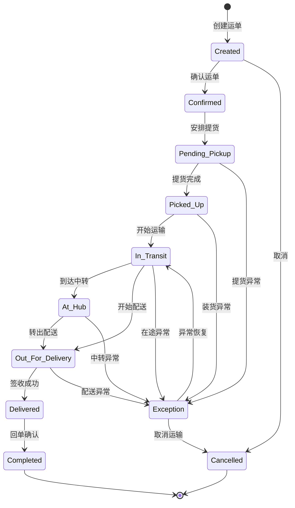

**运单状态转换表**:

| 当前状态 | 事件 | 下一状态 | 条件/动作 |
|---------|------|---------|----------|
| Created | confirm | Confirmed | 信息完整、运力确认 |
| Created | cancel | Cancelled | 客户取消/信息错误 |
| Confirmed | schedule_pickup | Pending_Pickup | 车辆/司机分配完成 |
| Pending_Pickup | pickup_complete | Picked_Up | 货物装车确认 |
| Pending_Pickup | pickup_fail | Exception | 提货失败(客户/货物) |
| Picked_Up | depart | In_Transit | GPS轨迹开始移动 |
| In_Transit | arrive_hub | At_Hub | 到达中转仓库 |
| In_Transit | near_destination | Out_For_Delivery | 距离目的地<50km |
| At_Hub | depart_hub | Out_For_Delivery | 中转完成重新出发 |
| Out_For_Delivery | delivery_complete | Delivered | 签收单上传 |
| Out_For_Delivery | delivery_fail | Exception | 拒收/无人签收 |
| Delivered | pod_confirm | Completed | 回单审核通过 |
| Exception | resolve | In_Transit | 异常解决继续运输 |
| Exception | abort | Cancelled | 异常无法解决 |

**运单状态层次结构**:

```
运单生命周期
├── 计划阶段
│   ├── Created (创建)
│   ├── Confirmed (确认)
│   └── Cancelled (取消)
├── 执行阶段
│   ├── Pending_Pickup (待提货)
│   ├── Picked_Up (已提货)
│   ├── In_Transit (运输中)
│   ├── At_Hub (中转中)
│   └── Out_For_Delivery (配送中)
├── 完成阶段
│   ├── Delivered (已送达)
│   └── Completed (已完成)
└── 异常状态
    └── Exception (异常)
```

### 1.2 调度状态机

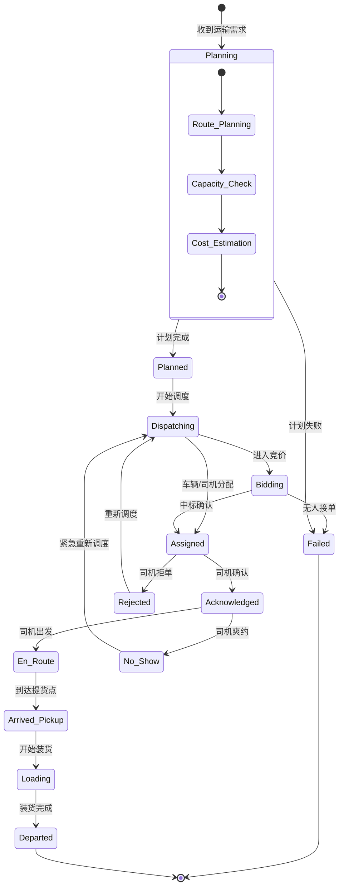

**调度状态转换表**:

| 当前状态 | 事件 | 下一状态 | 触发条件 |
|---------|------|---------|---------|
| Planning | plan_success | Planned | 路线/成本计算完成 |
| Planning | plan_fail | Failed | 无可用运力/路线不可达 |
| Planned | auto_dispatch | Dispatching | 自营车辆直接调度 |
| Planned | tender | Bidding | 外协运力竞价 |
| Bidding | bid_accept | Assigned | 承运商中标 |
| Bidding | bid_timeout | Failed | 超时无人投标 |
| Dispatching | accept | Assigned | 司机接受任务 |
| Dispatching | reject | Dispatching | 司机拒单重新派 |
| Assigned | driver_ack | Acknowledged | 司机APP确认 |
| Assigned | ack_timeout | Rejected | 超时未确认 |
| Acknowledged | driver_start | En_Route | 司机点击出发 |
| En_Route | arrive | Arrived_Pickup | GPS到达判定 |
| Arrived_Pickup | start_load | Loading | 开始装货时间 |
| Loading | load_complete | Departed | 装货完成确认 |

### 1.3 跟踪状态机

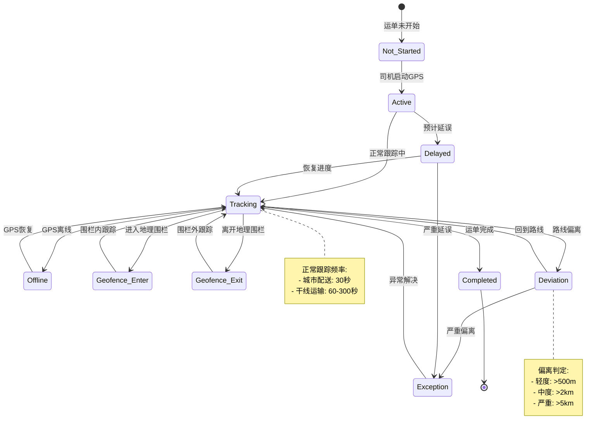

**跟踪状态与事件**:

| 跟踪状态 | 触发事件 | 数据频率 | 告警级别 |
|---------|---------|---------|---------|
| Not_Started | 运单创建 | - | - |
| Active | 司机APP启动 | 首次定位 | 信息 |
| Tracking | GPS正常上报 | 30s-5min | - |
| Offline | GPS>10min未上报 | - | 警告 |
| Geofence_Enter | 进入关键区域 | 实时 | 信息 |
| Geofence_Exit | 离开关键区域 | 实时 | 信息 |
| Deviation | 偏离规划路线 | 实时 | 警告 |
| Delayed | ETA更新>阈值 | 每15min | 警告 |
| Exception | 严重偏离/延误 | 实时 | 紧急 |
| Completed | 运单完成 | 最终位置 | 信息 |

---

## 2. 时序图形式化

### 2.1 运单创建流程

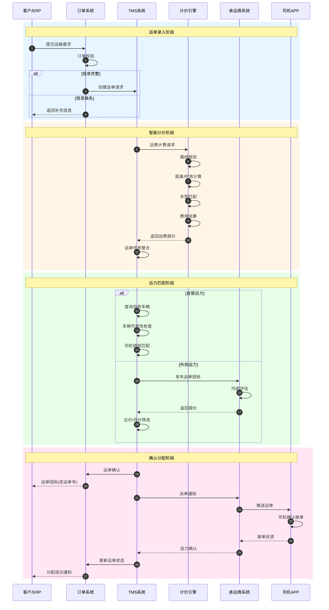

**运单创建时序说明**:

| 步骤 | 操作 | 系统/模块 | 关键数据 |
|-----|------|----------|---------|
| 1 | 提交需求 | 客户/ERP | 收发货地址、货物信息、时效要求 |
| 4 | 运费计算 | 计价引擎 | 距离、车型、油价、路桥费 |
| 8 | 运力匹配 | TMS | 车辆位置、载重、司机排班 |
| 13 | 派单通知 | 承运商系统 | 运单详情、提货时间、联系方式 |
| 16 | 运力确认 | TMS | 司机信息、车牌号、预计到达 |

### 2.2 车辆调度流程

```mermaid
sequenceDiagram
    autonumber
    participant TMS as TMS调度中心
    participant Opt as 优化引擎
    participant Veh as 车辆管理
    participant Driver as 司机端
    participant GPS as GPS监控
    participant GEO as 地理围栏

    rect rgb(230, 245, 255)
        Note over TMS,GEO: 调度计划阶段
        TMS->>Opt: 生成调度计划
        Opt->>Opt: 约束条件收集
        Opt->>Opt: 车辆路径优化(VRP)
        Opt->>Opt: 装载优化
        Opt->>Opt: 时间窗优化
        Opt-->>TMS: 最优调度方案
    end

    rect rgb(255, 245, 230)
        Note over TMS,GEO: 任务分配阶段
        TMS->>Veh: 查询可用车辆
        Veh-->>TMS: 车辆列表(位置/状态)
        TMS->>TMS: 车货匹配
        loop 逐个分配
            TMS->>Driver: 推送任务
            Driver->>Driver: 司机查看任务
            alt 接受任务
                Driver-->>TMS: 确认接单
            else 拒绝任务
                Driver-->>TMS: 拒绝原因
                TMS->>TMS: 重新分配
            end
        end
    end

    rect rgb(230, 255, 230)
        Note over TMS,GEO: 执行监控阶段
        Driver->>Driver: 点击出发
        Driver->>GPS: 启动定位
        GPS->>TMS: 实时位置上报
        TMS->>GEO: 地理围栏监控
        GEO->>TMS: 围栏事件通知

        alt 到达提货点
            GEO->>TMS: 进入提货围栏
            TMS->>Driver: 到达确认提示
            Driver->>Driver: 装货拍照
            Driver-->>TMS: 装货完成
        else 路线偏离
            GEO->>TMS: 偏离告警
            TMS->>Driver: 偏离提醒
            Driver-->>TMS: 偏离原因
        end
    end

    rect rgb(255, 230, 245)
        Note over TMS,GEO: 到达签收阶段
        GPS->>TMS: 到达目的地
        GEO->>TMS: 进入 delivery 围栏
        Driver->>Driver: 联系收货人
        Driver->>Driver: 签收拍照
        Driver->>Driver: 上传回单
        Driver-->>TMS: 签收完成
        TMS->>TMS: 运单状态更新
        TMS->>TMS: 触发结算流程
    end
```

**车辆调度时序说明**:

| 步骤 | 操作 | 系统/模块 | 关键数据 |
|-----|------|----------|---------|
| 1 | 调度优化 | 优化引擎 | 订单集、车辆集、约束条件 |
| 5 | VRP计算 | 优化引擎 | 最优路线、装载方案 |
| 9 | 车货匹配 | TMS | 车辆载重、体积、温控要求 |
| 15 | 实时定位 | GPS监控 | 经纬度、速度、方向 |
| 21 | 围栏监控 | 地理围栏 | 提货/ delivery 围栏触发 |
| 28 | 签收回单 | 司机端 | 签收人、签收时间、照片 |

### 2.3 在途跟踪流程

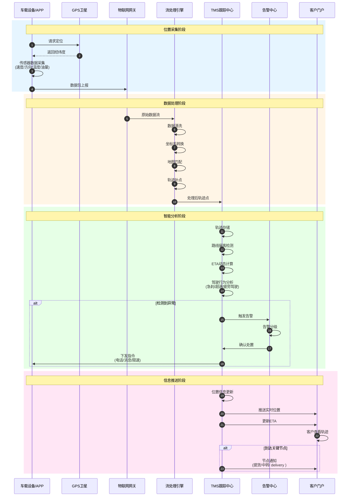

**在途跟踪时序说明**:

| 步骤 | 操作 | 系统/模块 | 关键数据 |
|-----|------|----------|---------|
| 1 | GPS定位 | 车载设备 | 经纬度(±5m精度) |
| 5 | 数据采集 | 传感器 | 速度、温度、油量、ACC状态 |
| 9 | 数据清洗 | 流处理引擎 | 去噪、滤波、异常值处理 |
| 13 | 地图匹配 | 跟踪中心 | 道路匹配、轨迹纠偏 |
| 17 | 偏离检测 | 跟踪中心 | 实际路线vs规划路线 |
| 21 | ETA计算 | 跟踪中心 | 剩余距离、实时路况、历史数据 |
| 26 | 告警分级 | 告警中心 | 轻度/中度/严重/紧急 |

---

## 3. 数据流分析

### 3.1 运单数据流动

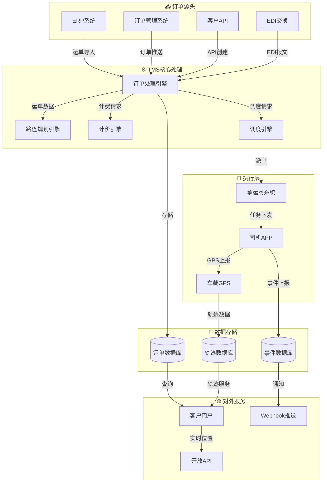

**运单数据流说明**:

| 数据流 | 来源 | 目标 | 频率 | 数据量 |
|-------|------|------|------|--------|
| 运单创建流 | ERP/OMS/API | TMS核心 | 实时 | 单条/批量 |
| 路径规划流 | 订单处理 | 路径引擎 | 实时 | 单条 |
| 计价数据流 | 计价引擎 | 订单处理 | 实时 | 单条 |
| 调度数据流 | 调度引擎 | 承运商系统 | 实时 | 单条 |
| GPS轨迹流 | 车载设备 | 轨迹数据库 | 30s-5min | 持续流 |
| 事件上报流 | 司机APP | 事件数据库 | 实时 | 事件触发 |
| 状态同步流 | TMS核心 | 客户门户 | 准实时 | 批量 |

**运单数据生命周期**:

```
运单数据状态流转:
Created(创建) → Planned(计划) →
Assigned(分配) → Active(执行) →
In_Transit(运输) → Delivered(送达) →
Completed(完成) → Archived(归档)

数据保留策略:
- 活跃运单: 热存储(7天)
- 完成运单: 温存储(90天)
- 历史运单: 冷存储(3年)
- 归档数据: 离线存储(7年)
```

### 3.2 GPS轨迹数据流

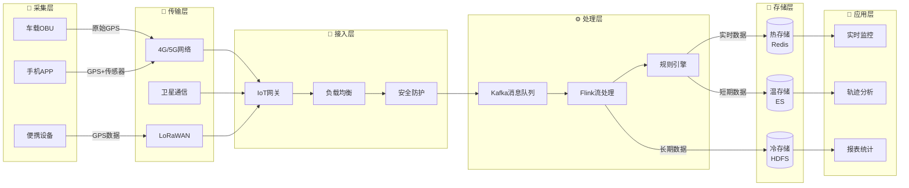

**GPS数据规格**:

| 数据字段 | 类型 | 说明 | 示例 |
|---------|------|------|------|
| device_id | String | 设备唯一标识 | DEV123456789 |
| vehicle_id | String | 车辆标识 | 京A12345 |
| timestamp | Long | 时间戳(毫秒) | 1708000000000 |
| longitude | Double | 经度 | 116.397428 |
| latitude | Double | 纬度 | 39.90923 |
| altitude | Double | 海拔(米) | 43.5 |
| speed | Double | 速度(km/h) | 60.5 |
| direction | Int | 方向(0-360) | 180 |
| accuracy | Float | 定位精度(米) | 5.0 |
| temperature | Float | 车厢温度(°C) | -18.5 |
| fuel_level | Float | 油量百分比 | 75.5 |
| mileage | Long | 总里程(km) | 125000 |

**GPS数据处理流程**:

```
原始GPS点 → 数据清洗 → 坐标转换 → 地图匹配 → 轨迹压缩 → 存储/分析

1. 数据清洗:
   - 去除漂移点(速度>200km/h)
   - 去除重复点(同位置<5s)
   - 填充缺失点(线性插值)

2. 坐标转换:
   - WGS-84 → GCJ-02(国测局)
   - GCJ-02 → BD-09(百度)

3. 地图匹配:
   - 隐马尔可夫模型(HMM)
   - 匹配到最近道路
   - 纠正隧道/高架漂移

4. 轨迹压缩:
   - Douglas-Peucker算法
   - 保留关键点
   - 压缩率>80%

5. 存储策略:
   - 实时点: Redis(24h)
   - 短期轨迹: ES(30天)
   - 长期归档: HDFS(永久)
```

---

## 4. 实时性分析

### 4.1 ETA计算更新频率

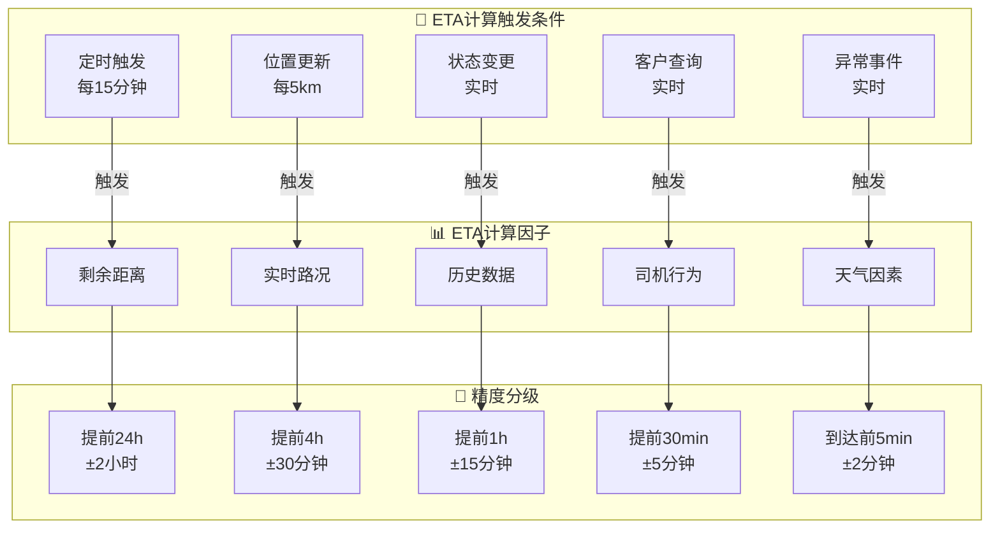

**ETA计算算法**:

```
ETA = current_time + travel_time + service_time + buffer_time

travel_time = Σ(segment_distance / segment_speed)

segment_speed计算:
  - 有实时路况: 实时平均速度 × 车型系数
  - 无实时路况: 历史同期速度 × 时段系数
  - 未知路段: 限速 × 0.8

service_time:
  - 提货: 30-60分钟
  - 中转: 60-120分钟
  - delivery : 15-30分钟

buffer_time:
  - 城市配送: 10%
  - 干线运输: 5%
  - 恶劣天气: +30分钟
```

**ETA更新策略**:

| 运输阶段 | 更新频率 | 精度要求 | 触发条件 |
|---------|---------|---------|---------|
| 待提货 | 每30分钟 | ±2小时 | 计划时间变化 |
| 已提货 | 每15分钟 | ±1小时 | 位置更新>5km |
| 运输中(>100km) | 每15分钟 | ±30分钟 | 定时/路况变化 |
| 运输中(50-100km) | 每10分钟 | ±15分钟 | 位置更新>2km |
| 运输中(<50km) | 每5分钟 | ±10分钟 | 实时位置更新 |
| 配送中(<10km) | 每2分钟 | ±5分钟 | 实时位置更新 |
| 即将到达(<2km) | 每30秒 | ±2分钟 | 实时位置更新 |

**ETA准确性指标**:

```yaml
监控指标:
  - 指标名: eta_accuracy_early
    描述: 提前到达准确率(±15min)
    目标: > 90%

  - 指标名: eta_accuracy_on_time
    描述: 准时到达准确率(±15min)
    目标: > 85%

  - 指标名: eta_accuracy_late
    描述: 延误预报准确率
    目标: > 80%

  - 指标名: eta_update_latency
    描述: ETA更新延迟
    目标: < 30秒
```

### 4.2 异常事件响应时间

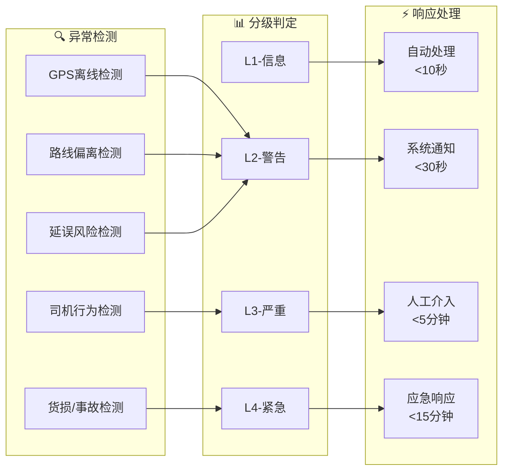

**异常响应时间SLA**:

| 异常类型 | 检测时间 | 通知时间 | 处理时间 | 升级时间 |
|---------|---------|---------|---------|---------|
| GPS离线(>10min) | 实时 | ≤30秒 | ≤5分钟 | >30分钟 |
| 路线偏离(>500m) | 实时 | ≤30秒 | ≤10分钟 | >1小时 |
| 预计延误(>30min) | 15分钟 | ≤1分钟 | ≤15分钟 | >2小时 |
| 车辆事故 | 实时 | ≤10秒 | ≤5分钟 | 立即 |
| 货物异常开箱 | 实时 | ≤10秒 | ≤10分钟 | ≤30分钟 |
| 司机疲劳驾驶 | 实时 | ≤30秒 | ≤5分钟 | >1小时 |
| 温度异常(冷链) | 实时 | ≤10秒 | ≤5分钟 | >15分钟 |
| 客户投诉 | 实时 | ≤30秒 | ≤15分钟 | >1小时 |

**异常处理流程时效**:

```
异常事件处理时效要求:

检测阶段:
  - 系统检测: ≤30秒
  - 人工上报: ≤5分钟

确认阶段:
  - 信息核实: ≤10分钟
  - 影响评估: ≤15分钟

处置阶段:
  - 常规异常: ≤30分钟
  - 严重异常: ≤15分钟
  - 紧急异常: ≤5分钟

恢复阶段:
  - 方案制定: ≤30分钟
  - 执行恢复: 按方案执行
  - 客户通知: 实时

闭环阶段:
  - 原因分析: ≤24小时
  - 改进措施: ≤48小时
  - 经验沉淀: ≤7天
```

---

## 5. 异常处理

### 5.1 延误处理

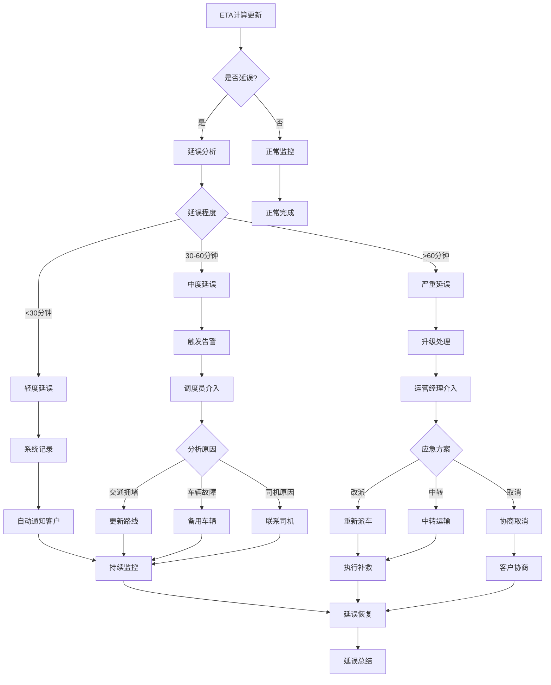

**延误分级与处理**:

| 延误级别 | 延误时长 | 影响范围 | 处理措施 | 通知对象 |
|---------|---------|---------|---------|---------|
| 轻度 | 15-30分钟 | 单运单 | 系统通知 | 客户 |
| 中度 | 30-60分钟 | 单运单 | 调度介入 | 客户+调度 |
| 严重 | 1-3小时 | 多单/线路 | 运营介入 | 客户+运营 |
| 重大 | >3小时 | 区域/全网 | 管理层 | 全链路 |

**延误原因分类**:

| 原因类别 | 具体原因 | 预防措施 | 补救措施 |
|---------|---------|---------|---------|
| 交通因素 | 拥堵/事故/管制 | 实时路况+路线规划 | 绕行/等待 |
| 车辆因素 | 故障/维修/事故 | 定期维保+备用车 | 换车/维修 |
| 司机因素 | 迟到/迷路/请假 | 培训+排班优化 | 换司机/加班 |
| 货物因素 | 装货慢/卸货慢 | 预约时间窗 | 协调现场 |
| 天气因素 | 雨雪/雾霾/大风 | 天气预报预警 | 等待/绕路 |
| 客户因素 | 收货人不在/拒收 | 提前确认 | 改期/退回 |

**延误补偿机制**:

```
延误补偿标准:

标准快递:
  - 延误1-24小时: 运费10%抵扣
  - 延误24-48小时: 运费30%抵扣
  - 延误>48小时: 免运费+额外赔偿

准时达服务:
  - 延误>30分钟: 运费全额返还
  - 延误>2小时: 额外赔付订单金额10%

冷链运输:
  - 温度超标: 全额赔偿货值
  - 时效延误: 按商品价值比例赔偿

免责条款:
  - 不可抗力(自然灾害/战争)
  - 客户原因(地址错误/无人收货)
  - 政府行为(检查/封控)
```

### 5.2 货损处理

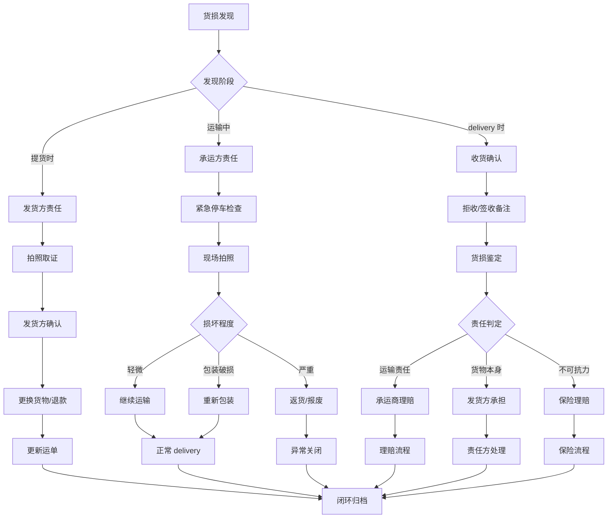

**货损处理流程**:

| 阶段 | 时效要求 | 关键动作 | 证据要求 |
|-----|---------|---------|---------|
| 发现 | 实时 | 停车/隔离/拍照 | 多角度照片+视频 |
| 报告 | ≤15分钟 | 系统上报+电话通知 | 时间戳+位置 |
| 定损 | ≤4小时 | 专业评估/第三方 | 鉴定报告 |
| 理赔 | ≤24小时 | 提交材料 | 完整单据 |
| 赔付 | 按保险条款 | 打款/补发 | 转账凭证 |

**货损责任判定**:

| 货损类型 | 责任方 | 判定依据 | 赔偿标准 |
|---------|--------|---------|---------|
| 提货前损坏 | 发货方 | 提货照片对比 | 发货方承担 |
| 装卸损坏 | 仓库/司机 | 监控录像 | 责任方赔偿 |
| 运输损坏 | 承运商 | GPS轨迹+震动记录 | 按合同赔偿 |
| 温度异常 | 承运商 | 温控记录 | 全额赔偿 |
| 包装破损 | 包装方 | 包装检验 | 责任方赔偿 |
| 交付损坏 | 收货方 | 签收单备注 | 视情况判定 |
| 不可抗力 | 保险 | 政府证明 | 保险赔付 |

**货损预防措施**:

```yaml
预防体系:
  装载阶段:
    - 合理配载: 重不压轻、大不压小
    - 固定绑扎: 防滑、防倾倒
    - 防护隔离: 危险品隔离、易碎品标识

  运输阶段:
    - 平稳驾驶: 监控急刹/急转
    - 温度控制: 冷链实时监控
    - 震动监测: 高价值货物传感器

  交付阶段:
    - 轻拿轻放: 搬运规范培训
    - 现场验收: 开箱检验机制
    - 签收规范: 异常必须备注
```

### 5.3 路线偏离处理

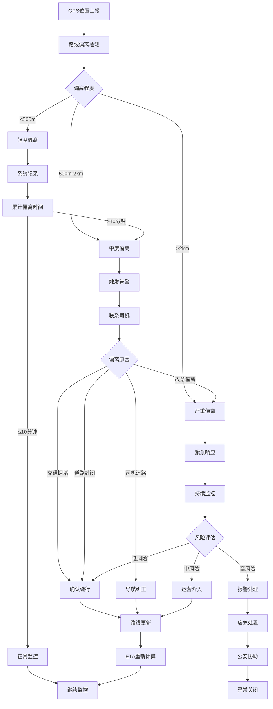

**路线偏离分级**:

| 偏离级别 | 偏离距离 | 偏离时间 | 系统响应 | 人工介入 |
|---------|---------|---------|---------|---------|
| 轻微 | <500m | <10分钟 | 记录不告警 | 否 |
| 轻度 | 500m-2km | >10分钟 | 系统提示 | 调度关注 |
| 中度 | 2-5km | 任何时间 | 告警通知 | 联系司机 |
| 严重 | 5-10km | 任何时间 | 紧急告警 | 运营介入 |
| 危险 | >10km | 任何时间 | 最高级别 | 报警+应急 |

**偏离原因与处理**:

| 偏离原因 | 判定方法 | 处理措施 | 验证方式 |
|---------|---------|---------|---------|
| 交通拥堵绕行 | 路况数据对比 | 确认绕行路线 | 导航记录 |
| 道路施工封闭 | 地图数据+现场 | 更新路线规划 | 现场照片 |
| 司机个人事务 | 无合理原因 | 警告+绩效扣分 | 电话确认 |
| 车辆故障停靠 | 车辆CAN数据 | 救援+换车 | 维修记录 |
| 违规卸货/倒卖 | 停车点异常 | 报警+现场核查 | 调查结果 |
| 劫持/盗抢 | 轨迹异常+失联 | 立即报警 | 警方处理 |

**偏离监控规则**:

```
路线偏离检测算法:

1. 计算实际位置到规划路线的垂直距离
   distance = point_to_line_distance(current_pos, planned_route)

2. 判定偏离等级:
   if distance < 500m: 正常
   if 500m ≤ distance < 2000m: 轻度偏离
   if 2000m ≤ distance < 5000m: 中度偏离
   if 5000m ≤ distance < 10000m: 严重偏离
   if distance ≥ 10000m: 危险偏离

3. 结合时间因素:
   持续偏离时间 = current_time - deviation_start_time
   如果持续偏离>阈值，升级处理

4. 特殊区域豁免:
   - 服务区休息: 允许偏离<2km, <30min
   - 加油站: 允许偏离<1km, <15min
   - 绕行区域: 按绕行路线规划

告警升级策略:
  轻度偏离 → 10分钟后未恢复 → 升级中度
  中度偏离 → 联系司机无响应 → 升级严重
  严重偏离 → 15分钟后未恢复 → 升级危险
  危险偏离 → 立即报警+启动应急预案
```

---

## 附录: 状态机形式化定义

### A.1 运单状态机形式化

```
States_Shipment = {Created, Confirmed, Pending_Pickup, Picked_Up,
                   In_Transit, At_Hub, Out_For_Delivery, Delivered,
                   Completed, Cancelled, Exception}

Event_Shipment = {create, confirm, cancel, schedule_pickup, pickup_complete,
                  pickup_fail, depart, arrive_hub, near_destination,
                  depart_hub, delivery_complete, delivery_fail,
                  pod_confirm, resolve, abort}

Transitions_Shipment ⊆ States_Shipment × Event_Shipment × States_Shipment

Transitions_Shipment = {
  (Created, confirm, Confirmed),
  (Created, cancel, Cancelled),
  (Confirmed, schedule_pickup, Pending_Pickup),
  (Pending_Pickup, pickup_complete, Picked_Up),
  (Pending_Pickup, pickup_fail, Exception),
  (Picked_Up, depart, In_Transit),
  (In_Transit, arrive_hub, At_Hub),
  (In_Transit, near_destination, Out_For_Delivery),
  (At_Hub, depart_hub, Out_For_Delivery),
  (Out_For_Delivery, delivery_complete, Delivered),
  (Out_For_Delivery, delivery_fail, Exception),
  (Delivered, pod_confirm, Completed),
  (Exception, resolve, In_Transit),
  (Exception, abort, Cancelled)
}

Initial_State = Created
Final_States = {Completed, Cancelled}

Invariant_Shipment:
  ∀s ∈ States_Shipment :
    s = Completed → history_contains(s, Delivered) ∧
    s = In_Transit → history_contains(s, Picked_Up) ∧
    s = Exception → ∃e ∈ Events : valid_transition(s, e)
```

### A.2 调度状态机形式化

```
States_Dispatch = {Planning, Planned, Failed, Dispatching, Bidding,
                   Assigned, Acknowledged, Rejected, En_Route,
                   Arrived_Pickup, Loading, Departed, No_Show}

Transitions_Dispatch = {
  (Planning, plan_success, Planned),
  (Planning, plan_fail, Failed),
  (Planned, auto_dispatch, Dispatching),
  (Planned, tender, Bidding),
  (Bidding, bid_accept, Assigned),
  (Bidding, bid_timeout, Failed),
  (Dispatching, accept, Assigned),
  (Assigned, driver_ack, Acknowledged),
  (Assigned, ack_timeout, Rejected),
  (Acknowledged, driver_start, En_Route),
  (Acknowledged, no_show, No_Show),
  (En_Route, arrive, Arrived_Pickup),
  (Arrived_Pickup, start_load, Loading),
  (Loading, load_complete, Departed),
  (Rejected, retry, Dispatching),
  (No_Show, emergency_dispatch, Dispatching)
}
```

---

**文档结束**
