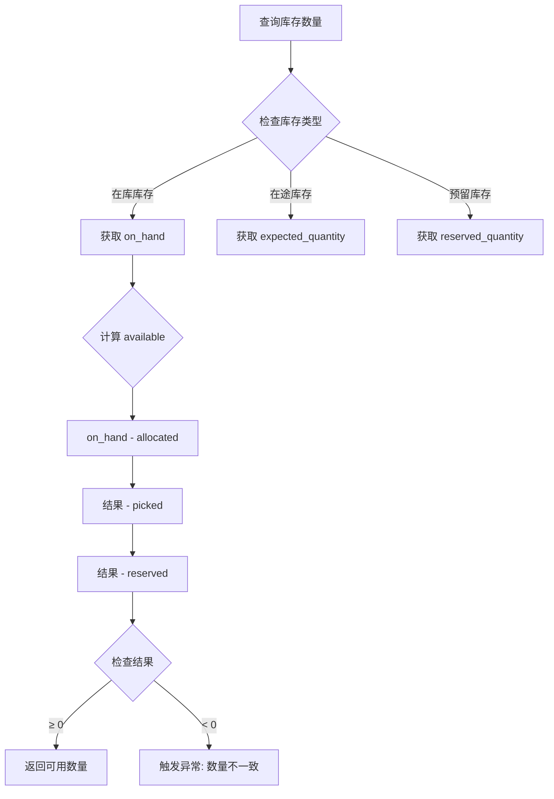
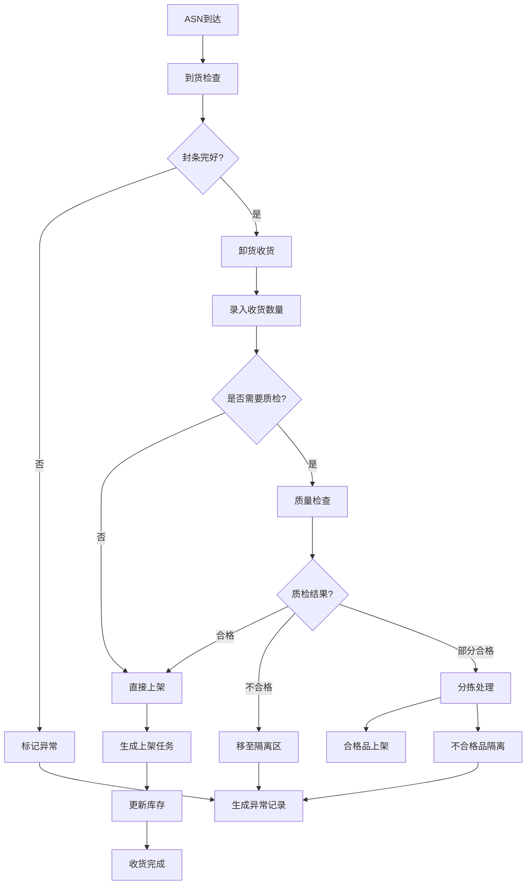
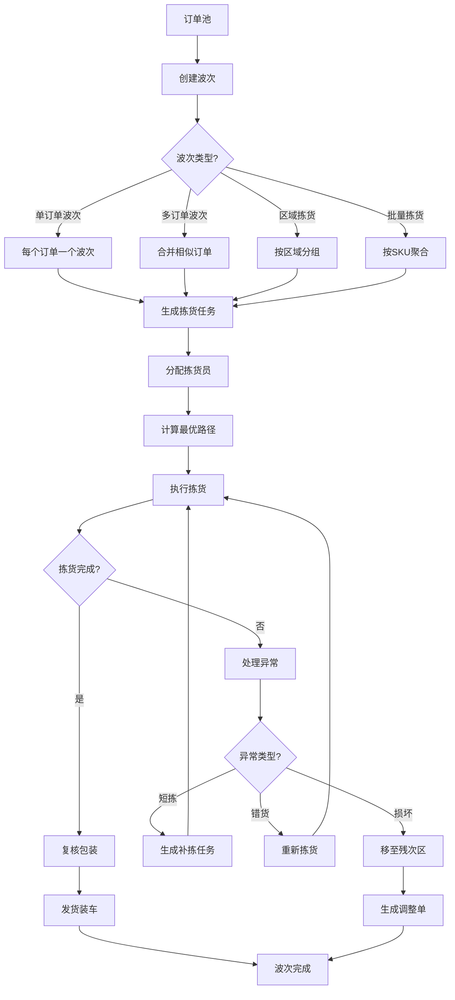
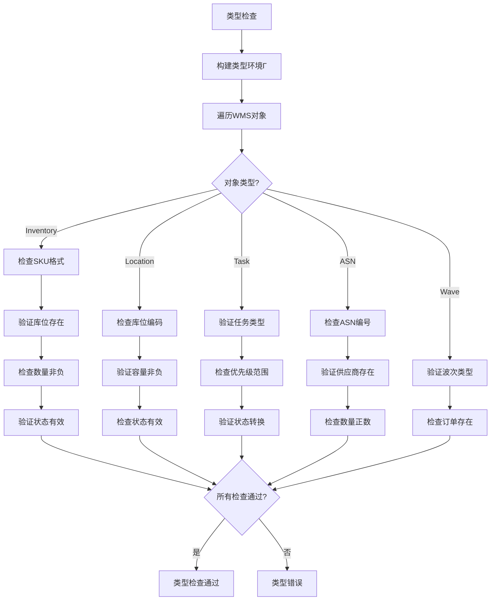
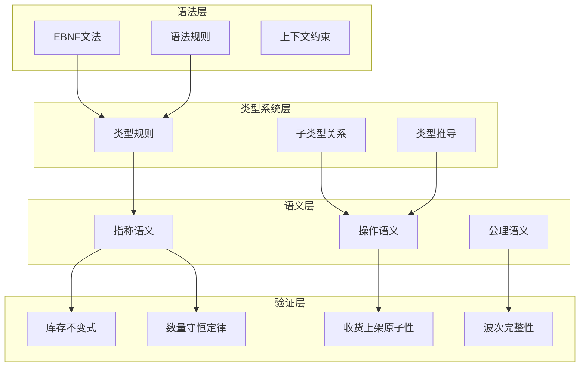
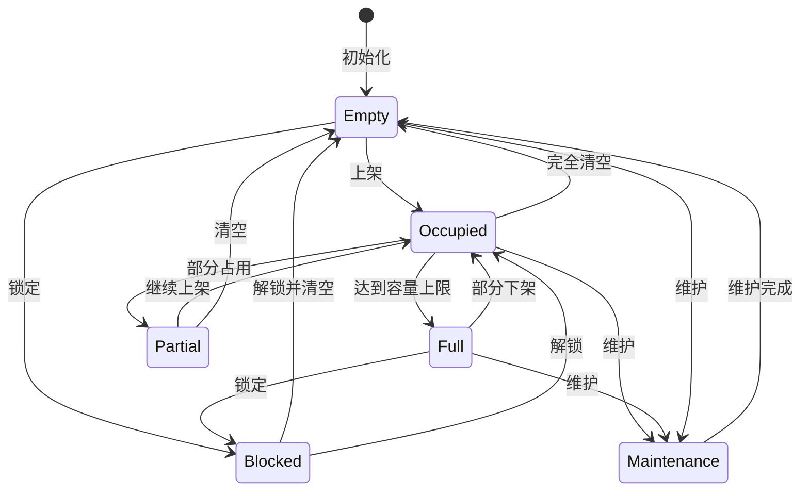

# WMS Schema形式语法与语义分析视图

**版本**: v1.0
**创建日期**: 2026-02-15
**标准**: GS1, EDI X12/EDIFACT, ISO 9001

---

## 📑 目录

- [WMS Schema形式语法与语义分析视图](#wms-schema形式语法与语义分析视图)
  - [📑 目录](#-目录)
  - [1. 形式文法定义](#1-形式文法定义)
    - [1.1 EBNF文法](#11-ebnf文法)
      - [1.1.1 库存实体文法](#111-库存实体文法)
      - [1.1.2 入库实体文法](#112-入库实体文法)
      - [1.1.3 出库实体文法](#113-出库实体文法)
      - [1.1.4 任务实体文法](#114-任务实体文法)
      - [1.1.5 库位实体文法](#115-库位实体文法)
    - [1.2 语法规则](#12-语法规则)
      - [1.2.1 库存数量约束规则](#121-库存数量约束规则)
      - [1.2.2 库位容量约束规则](#122-库位容量约束规则)
      - [1.2.3 入库流程规则](#123-入库流程规则)
      - [1.2.4 出库流程规则](#124-出库流程规则)
      - [1.2.5 任务执行规则](#125-任务执行规则)
  - [2. 形式语义定义](#2-形式语义定义)
    - [2.1 指称语义 (Denotational Semantics)](#21-指称语义-denotational-semantics)
      - [2.1.1 语义域定义](#211-语义域定义)
      - [2.1.2 库存语义](#212-库存语义)
      - [2.1.3 收货语义](#213-收货语义)
      - [2.1.4 波次与拣货语义](#214-波次与拣货语义)
    - [2.2 操作语义 (Operational Semantics)](#22-操作语义-operational-semantics)
      - [2.2.1 大步语义 (Big-Step Semantics)](#221-大步语义-big-step-semantics)
      - [2.2.2 小步语义 (Small-Step Semantics)](#222-小步语义-small-step-semantics)
      - [2.2.3 任务状态机语义](#223-任务状态机语义)
    - [2.3 公理语义 (Axiomatic Semantics)](#23-公理语义-axiomatic-semantics)
      - [2.3.1 Hoare三元组](#231-hoare三元组)
      - [2.3.2 库存操作推理规则](#232-库存操作推理规则)
      - [2.3.3 库存不变式公理](#233-库存不变式公理)
      - [2.3.4 库存不变式证明](#234-库存不变式证明)
      - [2.3.5 收货上架原子性证明](#235-收货上架原子性证明)
  - [3. 类型系统](#3-类型系统)
    - [3.1 类型规则](#31-类型规则)
    - [3.2 类型运算规则](#32-类型运算规则)
    - [3.3 子类型关系](#33-子类型关系)
    - [3.4 多态与类型约束](#34-多态与类型约束)
  - [4. 语义等价性](#4-语义等价性)
    - [4.1 程序等价定义](#41-程序等价定义)
    - [4.2 等价变换规则](#42-等价变换规则)
    - [4.3 库存操作等价性](#43-库存操作等价性)
  - [5. Mermaid可视化](#5-mermaid可视化)
    - [5.1 库存数量计算流程](#51-库存数量计算流程)
    - [5.2 收货处理语义流程](#52-收货处理语义流程)
    - [5.3 波次拣货处理流程](#53-波次拣货处理流程)
    - [5.4 库存类型检查流程](#54-库存类型检查流程)
    - [5.5 形式语义层级图](#55-形式语义层级图)
    - [5.6 库位状态转换图](#56-库位状态转换图)

---

## 1. 形式文法定义

### 1.1 EBNF文法

#### 1.1.1 库存实体文法

```ebnf
(* WMS核心实体 - 库存定义 *)

Inventory ::= OnHandInventory | InTransitInventory | ReservedInventory

OnHandInventory ::= '{'
    '"inventory_id"' ':' InventoryId ','
    '"sku_code"' ':' SKUCode ','
    '"sku_name"' ':' String(200) ','
    '"batch_number"' ':' BatchNumber? ','
    '"location_code"' ':' LocationCode ','
    '"owner_code"' ':' OwnerCode ','
    '"quantity"' ':' QuantityInfo ','
    '"inventory_status"' ':' InventoryStatus ','
    '"received_at"' ':' Timestamp ','
    '"expiration_date"' ':' Date?
'}'

InTransitInventory ::= '{'
    '"inventory_id"' ':' InventoryId ','
    '"sku_code"' ':' SKUCode ','
    '"asn_number"' ':' ASNNumber ','
    '"expected_quantity"' ':' Integer ','
    '"origin_location"' ':' LocationCode ','
    '"destination_location"' ':' LocationCode ','
    '"estimated_arrival"' ':' Timestamp ','
    '"carrier_code"' ':' CarrierCode?
'}'

ReservedInventory ::= '{'
    '"reservation_id"' ':' ReservationId ','
    '"inventory_id"' ':' InventoryId ','
    '"order_number"' ':' OrderNumber ','
    '"reserved_quantity"' ':' Integer ','
    '"reservation_type"' ':' ReservationType ','
    '"reserved_at"' ':' Timestamp ','
    '"expires_at"' ':' Timestamp?
'}'

(* 数量信息结构 *)
QuantityInfo ::= '{'
    '"on_hand"' ':' Integer ','
    '"allocated"' ':' Integer ','
    '"picked"' ':' Integer ','
    '"available"' ':' Integer ','
    '"reserved"' ':' Integer ','
    '"in_transit"' ':' Integer
'}'

(* 标识符格式 *)
InventoryId ::= '[A-Z0-9]{20}'
SKUCode ::= '[A-Z0-9\-]{6,50}'
BatchNumber ::= '[A-Z0-9]{1,30}'
LocationCode ::= '[A-Z]{1,3}[0-9]{2,4}[A-Z0-9]{0,10}'
OwnerCode ::= '[A-Z0-9]{3,10}'
ASNNumber ::= 'ASN[0-9]{10,15}'
ReservationId ::= 'RES[0-9]{12}'
OrderNumber ::= '(SO|TO|WO)[0-9]{10,15}'
CarrierCode ::= '[A-Z0-9]{4,10}'

(* 枚举值 *)
InventoryStatus ::= 'Available' | 'Frozen' | 'Blocked' | 'Quarantine' | 'Damaged' | 'Expired'
ReservationType ::= 'Customer_Order' | 'Transfer_Order' | 'Work_Order' | 'Safety_Stock'
```

#### 1.1.2 入库实体文法

```ebnf
(* 入库流程定义 - ASN、收货、质检、上架 *)

ReceiptFlow ::= ASN | Receipt | QualityCheck | PutawayTask

ASN ::= '{'
    '"asn_id"' ':' ASNId ','
    '"asn_number"' ':' ASNNumber ','
    '"supplier_code"' ':' SupplierCode ','
    '"supplier_name"' ':' String(100) ','
    '"po_number"' ':' PONumber? ','
    '"expected_arrival"' ':' Timestamp ','
    '"carrier_code"' ':' CarrierCode? ','
    '"lines"' ':' ASNLineList ','
    '"asn_status"' ':' ASNStatus ','
    '"created_at"' ':' Timestamp
'}'

ASNLine ::= '{'
    '"line_number"' ':' Integer ','
    '"sku_code"' ':' SKUCode ','
    '"expected_quantity"' ':' Integer ','
    '"uom"' ':' UOM ','
    '"batch_expected"' ':' Boolean ','
    '"expiration_date"' ':' Date?
'}'

Receipt ::= '{'
    '"receipt_id"' ':' ReceiptId ','
    '"receipt_number"' ':' ReceiptNumber ','
    '"asn_id"' ':' ASNId? ','
    '"supplier_code"' ':' SupplierCode ','
    '"arrival_date"' ':' Date ','
    '"dock_door"' ':' DockDoor ','
    '"lines"' ':' ReceiptLineList ','
    '"receipt_status"' ':' ReceiptStatus ','
    '"received_by"' ':' UserId
'}'

ReceiptLine ::= '{'
    '"line_number"' ':' Integer ','
    '"asn_line_number"' ':' Integer? ','
    '"sku_code"' ':' SKUCode ','
    '"expected_quantity"' ':' Integer ','
    '"received_quantity"' ':' Integer ','
    '"accepted_quantity"' ':' Integer ','
    '"rejected_quantity"' ':' Integer ','
    '"batch_number"' ':' BatchNumber? ','
    '"quality_status"' ':' QualityStatus ','
    '"putaway_location"' ':' LocationCode?
'}'

QualityCheck ::= '{'
    '"qc_id"' ':' QCId ','
    '"receipt_id"' ':' ReceiptId ','
    '"inspection_type"' ':' InspectionType ','
    '"sample_size"' ':' Integer ','
    '"passed_quantity"' ':' Integer ','
    '"failed_quantity"' ':' Integer ','
    '"qc_result"' ':' QCResult ','
    '"inspected_by"' ':' UserId ','
    '"inspected_at"' ':' Timestamp
'}'

PutawayTask ::= '{'
    '"task_id"' ':' TaskId ','
    '"task_number"' ':' TaskNumber ','
    '"receipt_id"' ':' ReceiptId ','
    '"putaway_type"' ':' PutawayType ','
    '"lines"' ':' PutawayLineList ','
    '"task_status"' ':' TaskStatus ','
    '"assigned_to"' ':' UserId? ','
    '"suggested_locations"' ':' LocationCodeList
'}'

(* 标识符格式 *)
ASNId ::= 'AID[0-9]{16}'
ReceiptId ::= 'RID[0-9]{16}'
ReceiptNumber ::= 'REC[0-9]{10,12}'
QCId ::= 'QCI[0-9]{12}'
TaskId ::= 'TID[0-9]{16}'
TaskNumber ::= 'TSK[0-9]{10,12}'
SupplierCode ::= 'SUP[A-Z0-9]{6,15}'
PONumber ::= 'PO[0-9]{10,15}'
DockDoor ::= 'D[0-9]{1,3}'
UserId ::= '[A-Z0-9]{6,20}'

(* 枚举值 *)
ASNStatus ::= 'Draft' | 'Sent' | 'Acknowledged' | 'In_Transit' | 'Arrived' | 'Receiving' | 'Received' | 'Cancelled'
ReceiptStatus ::= 'Pending' | 'Receiving' | 'Received' | 'Putaway' | 'Completed'
QualityStatus ::= 'Accept' | 'Reject' | 'Hold' | 'Sample'
QCResult ::= 'Pass' | 'Fail' | 'Partial' | 'Pending'
InspectionType ::= 'Full' | 'Sample' | 'Visual' | 'Skip'
PutawayType ::= 'Direct' | 'Staging' | 'Quality_Hold' | 'Cross_Dock'
```

#### 1.1.3 出库实体文法

```ebnf
(* 出库流程定义 - 波次、拣货、复核、发运 *)

ShipmentFlow ::= Wave | PickTask | PackTask | ShipTask

Wave ::= '{'
    '"wave_id"' ':' WaveId ','
    '"wave_number"' ':' WaveNumber ','
    '"wave_type"' ':' WaveType ','
    '"orders"' ':' OrderRefList ','
    '"wave_status"' ':' WaveStatus ','
    '"created_at"' ':' Timestamp ','
    '"released_at"' ':' Timestamp? ','
    '"completed_at"' ':' Timestamp?
'}'

PickTask ::= '{'
    '"task_id"' ':' TaskId ','
    '"task_number"' ':' TaskNumber ','
    '"wave_id"' ':' WaveId? ','
    '"pick_type"' ':' PickType ','
    '"priority"' ':' PriorityLevel ','
    '"lines"' ':' PickLineList ','
    '"task_status"' ':' TaskStatus ','
    '"assigned_to"' ':' UserId? ','
    '"suggested_route"' ':' LocationCodeList
'}'

PickLine ::= '{'
    '"line_number"' ':' Integer ','
    '"order_line_id"' ':' OrderLineId ','
    '"sku_code"' ':' SKUCode ','
    '"requested_quantity"' ':' Integer ','
    '"picked_quantity"' ':' Integer ','
    '"source_location"' ':' LocationCode ','
    '"batch_number"' ':' BatchNumber? ','
    '"pick_sequence"' ':' Integer ','
    '"picked_at"' ':' Timestamp? ','
    '"picked_by"' ':' UserId?
'}'

PackTask ::= '{'
    '"task_id"' ':' TaskId ','
    '"task_number"' ':' TaskNumber ','
    '"order_id"' ':' OrderId ','
    '"pack_station"' ':' PackStation ','
    '"lines"' ':' PackLineList ','
    '"containers"' ':' ContainerList ','
    '"task_status"' ':' TaskStatus
'}'

ShipTask ::= '{'
    '"shipment_id"' ':' ShipmentId ','
    '"shipment_number"' ':' ShipmentNumber ','
    '"carrier_code"' ':' CarrierCode ','
    '"service_level"' ':' ServiceLevel ','
    '"orders"' ':' OrderRefList ','
    '"tracking_number"' ':' TrackingNumber? ','
    '"ship_status"' ':' ShipStatus ','
    '"shipped_at"' ':' Timestamp? ','
    '"estimated_delivery"' ':' Timestamp?
'}'

(* 标识符格式 *)
WaveId ::= 'WID[0-9]{16}'
WaveNumber ::= 'WV[0-9]{8,12}'
OrderId ::= '(SO|WO)[0-9]{10,15}'
OrderLineId ::= 'OL[0-9]{12,16}'
ShipmentId ::= 'SID[0-9]{16}'
ShipmentNumber ::= 'SHP[0-9]{10,12}'
PackStation ::= 'PK[0-9]{2,4}'
TrackingNumber ::= String(5,50)

(* 枚举值 *)
WaveType ::= 'Single_Order' | 'Multi_Order' | 'Zone_Pick' | 'Batch_Pick' | 'Cluster_Pick'
WaveStatus ::= 'Planning' | 'Ready' | 'Released' | 'Picking' | 'Packing' | 'Shipping' | 'Completed'
PickType ::= 'Discrete' | 'Batch' | 'Zone' | 'Wave' | 'Cluster'
PriorityLevel ::= '1' | '2' | '3' | '4' | '5' | '6' | '7' | '8' | '9' | '10'
ServiceLevel ::= 'Standard' | 'Expedited' | 'Guaranteed' | 'White_Glove'
ShipStatus ::= 'Ready' | 'Staged' | 'Loaded' | 'In_Transit' | 'Delivered'
```

#### 1.1.4 任务实体文法

```ebnf
(* 仓库任务定义 - 补货、移库、盘点、调整 *)

Task ::= ReplenishmentTask | MovementTask | CycleCountTask | AdjustmentTask

ReplenishmentTask ::= '{'
    '"task_id"' ':' TaskId ','
    '"task_number"' ':' TaskNumber ','
    '"task_type"' ':' '"Replenishment"' ','
    '"trigger_type"' ':' TriggerType ','
    '"sku_code"' ':' SKUCode ','
    '"from_location"' ':' LocationCode ','
    '"to_location"' ':' LocationCode ','
    '"requested_quantity"' ':' Integer ','
    '"actual_quantity"' ':' Integer? ','
    '"task_status"' ':' TaskStatus ','
    '"priority"' ':' PriorityLevel
'}'

MovementTask ::= '{'
    '"task_id"' ':' TaskId ','
    '"task_number"' ':' TaskNumber ','
    '"task_type"' ':' '"Move"' ','
    '"move_reason"' ':' MoveReason ','
    '"inventory_id"' ':' InventoryId ','
    '"from_location"' ':' LocationCode ','
    '"to_location"' ':' LocationCode ','
    '"quantity"' ':' Integer ','
    '"task_status"' ':' TaskStatus ','
    '"move_at"' ':' Timestamp?
'}'

CycleCountTask ::= '{'
    '"count_id"' ':' CountId ','
    '"count_number"' ':' CountNumber ','
    '"task_type"' ':' '"Cycle_Count"' ','
    '"count_type"' ':' CountType ','
    '"location_code"' ':' LocationCode? ','
    '"sku_code"' ':' SKUCode? ','
    '"expected_quantity"' ':' Integer? ','
    '"actual_quantity"' ':' Integer? ','
    '"variance"' ':' Integer? ','
    '"count_status"' ':' CountStatus ','
    '"counted_by"' ':' UserId?
'}'

AdjustmentTask ::= '{'
    '"adjustment_id"' ':' AdjustmentId ','
    '"adjustment_number"' ':' AdjustmentNumber ','
    '"task_type"' ':' '"Adjustment"' ','
    '"inventory_id"' ':' InventoryId ','
    '"adjustment_reason"' ':' AdjustmentReason ','
    '"quantity_before"' ':' Integer ','
    '"quantity_after"' ':' Integer ','
    '"variance"' ':' Integer ','
    '"approved_by"' ':' UserId ','
    '"adjusted_at"' ':' Timestamp
'}'

(* 标识符格式 *)
CountId ::= 'CID[0-9]{12}'
CountNumber ::= 'CNT[0-9]{10,12}'
AdjustmentId ::= 'ADJ[0-9]{12}'
AdjustmentNumber ::= 'ADJ[0-9]{10,12}'

(* 枚举值 *)
TriggerType ::= 'Min_Max' | 'Demand' | 'Top_Off' | 'Manual'
MoveReason ::= 'Optimization' | 'Consolidation' | 'Damaged' | 'Temp_Storage' | 'Repackaging'
CountType ::= 'Blind' | 'Guided' | 'ABC' | 'Adhoc' | 'System_Generated'
CountStatus ::= 'Scheduled' | 'In_Progress' | 'Completed' | 'Recount' | 'Adjusted'
AdjustmentReason ::= 'Count_Variance' | 'Damage' | 'Expiry' | 'System_Error' | 'Theft' | 'Admin'
```

#### 1.1.5 库位实体文法

```ebnf
(* 库位定义 - 区域、通道、货架、层、位 *)

Location ::= StorageLocation | PickLocation | StagingLocation | DockLocation

StorageLocation ::= '{'
    '"location_code"' ':' LocationCode ','
    '"zone_code"' ':' ZoneCode ','
    '"area_code"' ':' AreaCode ','
    '"aisle"' ':' AisleCode ','
    '"bay"' ':' BayCode ','
    '"level"' ':' LevelCode ','
    '"position"' ':' PositionCode ','
    '"location_type"' ':' StorageLocationType ','
    '"capacity"' ':' LocationCapacity ','
    '"status"' ':' LocationStatus
'}'

PickLocation ::= '{'
    '"location_code"' ':' LocationCode ','
    '"zone_code"' ':' ZoneCode ','
    '"location_type"' ':' '"Forward_Pick"' ','
    '"sku_code"' ':' SKUCode? ','
    '"abc_class"' ':' ABCClass ','
    '"velocity_class"' ':' VelocityClass ','
    '"max_quantity"' ':' Integer ','
    '"replenishment_point"' ':' Integer ','
    '"status"' ':' LocationStatus
'}'

StagingLocation ::= '{'
    '"location_code"' ':' LocationCode ','
    '"zone_code"' ':' ZoneCode ','
    '"location_type"' ':' '"Staging"' ','
    '"staging_type"' ':' StagingType ','
    '"capacity"' ':' LocationCapacity ','
    '"status"' ':' LocationStatus
'}'

DockLocation ::= '{'
    '"location_code"' ':' LocationCode ','
    '"zone_code"' ':' '"SHIPPING"' ','
    '"dock_door"' ':' DockDoor ','
    '"dock_type"' ':' DockType ','
    '"status"' ':' LocationStatus
'}'

(* 容量结构 *)
LocationCapacity ::= '{'
    '"max_weight"' ':' Decimal ','
    '"max_volume"' ':' Decimal ','
    '"max_pallets"' ':' Integer ','
    '"max_cartons"' ':' Integer?
'}'

(* 标识符格式 *)
ZoneCode ::= '[A-Z]{2,4}'
AreaCode ::= '[A-Z0-9]{1,4}'
AisleCode ::= '[A-Z][0-9]{2,3}'
BayCode ::= '[0-9]{2,3}'
LevelCode ::= '[0-9]{1,2}'
PositionCode ::= '[0-9]{1,3}'

(* 枚举值 *)
StorageLocationType ::= 'Reserve' | 'Bulk' | 'Rack' | 'Floor' | 'Cold_Storage'
LocationStatus ::= 'Active' | 'Inactive' | 'Full' | 'Blocked' | 'Maintenance'
ABCClass ::= 'A' | 'B' | 'C'
VelocityClass ::= 'Fast' | 'Medium' | 'Slow'
StagingType ::= 'Inbound' | 'Outbound' | 'Cross_Dock' | 'QC'
DockType ::= 'Inbound' | 'Outbound' | 'Cross_Dock'
```

### 1.2 语法规则

#### 1.2.1 库存数量约束规则

```
约束1: 数量一致性
  ∀inv ∈ Inventory :
    inv.quantity.on_hand = inv.quantity.available + inv.quantity.allocated +
                           inv.quantity.picked + inv.quantity.reserved

约束2: 可用数量非负
  ∀inv ∈ Inventory :
    inv.quantity.available ≥ 0

约束3: 数量不能为负
  ∀inv ∈ Inventory :
    inv.quantity.on_hand ≥ 0 ∧ inv.quantity.allocated ≥ 0 ∧
    inv.quantity.picked ≥ 0 ∧ inv.quantity.reserved ≥ 0

约束4: 分配数量限制
  ∀inv ∈ Inventory :
    inv.quantity.allocated ≤ inv.quantity.on_hand

约束5: 拣货数量限制
  ∀inv ∈ Inventory :
    inv.quantity.picked ≤ inv.quantity.allocated
```

#### 1.2.2 库位容量约束规则

```
约束6: 重量容量约束
  ∀loc ∈ Location, ∀inv ∈ loc.current_inventory :
    sum(inv.quantity.on_hand × inv.unit_weight) ≤ loc.capacity.max_weight

约束7: 体积容量约束
  ∀loc ∈ Location :
    sum(inv.quantity.on_hand × inv.unit_volume) ≤ loc.capacity.max_volume

约束8: 货位状态一致性
  ∀loc ∈ Location :
    (loc.status = 'Full' ⇒ loc.current_occupancy = 100%) ∧
    (loc.status = 'Empty' ⇒ loc.current_occupancy = 0%)

约束9: 单SKU限制
  ∀loc ∈ Location where loc.restrictions.single_sku_only = true :
    count(distinct(loc.current_inventory.sku_code)) ≤ 1
```

#### 1.2.3 入库流程规则

```
约束10: ASN与收货数量一致性
  ∀r ∈ Receipt where r.asn_id ≠ ⊥ :
    ∀line ∈ r.lines :
      let asn_line = find_asn_line(r.asn_id, line.asn_line_number) in
      line.expected_quantity = asn_line.expected_quantity

约束11: 收货数量完整性
  ∀r ∈ Receipt, ∀line ∈ r.lines :
    line.received_quantity = line.accepted_quantity + line.rejected_quantity

约束12: 质检时效性
  ∀qc ∈ QualityCheck :
    qc.inspected_at ≥ find_receipt(qc.receipt_id).received_at

约束13: 上架完成约束
  ∀pt ∈ PutawayTask where pt.task_status = 'Completed' :
    ∀line ∈ pt.lines :
      line.putaway_quantity = line.received_quantity
```

#### 1.2.4 出库流程规则

```
约束14: 波次订单唯一性
  ∀w ∈ Wave :
    all_distinct(w.orders)

约束15: 拣货数量限制
  ∀pk ∈ PickTask, ∀line ∈ pk.lines :
    line.picked_quantity ≤ line.requested_quantity

约束16: 拣货序列有效性
  ∀pk ∈ PickTask :
    sort(pk.lines.line_number) = [1, 2, ..., count(pk.lines)]

约束17: 发运完整性
  ∀s ∈ ShipTask where s.ship_status = 'In_Transit' :
    s.shipped_at ≠ ⊥ ∧ s.tracking_number ≠ ⊥

约束18: 库存充足性（出库前检查）
  ∀order ∈ Order, ∀line ∈ order.lines :
    ∃inv ∈ Inventory :
      inv.sku_code = line.sku_code ∧
      inv.quantity.available ≥ line.quantity
```

#### 1.2.5 任务执行规则

```
约束19: 补货触发条件
  ∀rt ∈ ReplenishmentTask where rt.trigger_type = 'Min_Max' :
    let pick_loc = find_location(rt.to_location) in
    let current_qty = sum(inventory_at(pick_loc).quantity.on_hand) in
    current_qty ≤ rt.replenishment_point

约束20: 移库数量一致性
  ∀mt ∈ MovementTask where mt.task_status = 'Completed' :
    mt.quantity = mt.actual_quantity ∧ mt.quantity > 0

约束21: 盘点差异计算
  ∀ct ∈ CycleCountTask where ct.count_status = 'Completed' :
    ct.variance = ct.actual_quantity - ct.expected_quantity

约束22: 库存调整审批
  ∀at ∈ AdjustmentTask :
    at.approved_by ≠ ⊥ ∧ at.adjusted_at ≠ ⊥

约束23: FIFO约束（如适用）
  ∀loc ∈ Location where loc.restrictions.fifo_required = true :
    ∀inv1, inv2 ∈ loc.current_inventory :
      inv1.received_at < inv2.received_at ⇒
        pick_sequence(inv1) < pick_sequence(inv2)
```

---

## 2. 形式语义定义

### 2.1 指称语义 (Denotational Semantics)

#### 2.1.1 语义域定义

```
D[WMSSystem] : Environment → State → State

State = InventoryState × LocationState × TaskState ×
        InboundState × OutboundState × CycleCountState

InventoryState = InventoryId → InventoryValue
InventoryValue = {
  sku_code: SKUCode,
  batch_number: BatchNumber?,
  location_code: LocationCode,
  owner_code: OwnerCode,
  quantities: QuantityInfo,
  status: InventoryStatus,
  received_at: Timestamp,
  expiration_date: Date?,
  ...
}

QuantityInfo = {
  on_hand: ℕ,
  allocated: ℕ,
  picked: ℕ,
  available: ℕ,
  reserved: ℕ,
  in_transit: ℕ
}

LocationState = LocationCode → LocationValue
LocationValue = {
  zone_code: ZoneCode,
  area_code: AreaCode,
  location_type: StorageLocationType,
  capacity: LocationCapacity,
  status: LocationStatus,
  current_inventory: List<InventoryRef>,
  ...
}

TaskState = TaskId → TaskValue
TaskValue = {
  task_type: TaskType,
  task_status: TaskStatus,
  assigned_to: UserId?,
  priority: PriorityLevel,
  created_at: Timestamp,
  completed_at: Timestamp?,
  ...
}

InboundState = ASNId → ASNValue
ASNValue = {
  asn_number: ASNNumber,
  supplier_code: SupplierCode,
  lines: List<ASNLine>,
  asn_status: ASNStatus,
  expected_arrival: Timestamp,
  ...
}

OutboundState = WaveId → WaveValue
WaveValue = {
  wave_number: WaveNumber,
  wave_type: WaveType,
  orders: List<OrderRef>,
  wave_status: WaveStatus,
  ...
}

SKUCode = String(6,50)
BatchNumber = String(1,30)
LocationCode = String(5,20)
ℕ = {0, 1, 2, ...}
Timestamp = ℕ  (* Unix时间戳 *)
```

#### 2.1.2 库存语义

```
(* 可用数量计算 *)
E[inventory.available_quantity] env sto =
  let inv = lookup_inventory(sto, env.inventory_id) in
  inv.quantities.on_hand - inv.quantities.allocated -
  inv.quantities.picked - inv.quantities.reserved

(* 库存状态转换 *)
S[inventory.status := new_status] env sto =
  let inv = lookup_inventory(sto, env.inventory_id) in
  if valid_inventory_transition(inv.status, new_status)
  then sto[inventory ↦ inv[status ↦ new_status]]
  else error "Invalid inventory status transition"

(* 库存分配语义 *)
S[allocate(inventory, quantity)] env sto =
  let inv = lookup_inventory(sto, inventory.inventory_id) in
  let available = calculate_available(inv) in
  if available ≥ quantity
  then sto[inventory ↦ inv[allocated ↦ inv.allocated + quantity]]
  else error "Insufficient available inventory"

(* 库存拣货语义 *)
S[pick(inventory, quantity)] env sto =
  let inv = lookup_inventory(sto, inventory.inventory_id) in
  if inv.allocated ≥ quantity
  then sto[inventory ↦ inv[
    picked ↦ inv.picked + quantity,
    allocated ↦ inv.allocated - quantity
  ]]
  else error "Not enough allocated inventory to pick"

(* 库存释放语义 *)
S[release(inventory, quantity)] env sto =
  let inv = lookup_inventory(sto, inventory.inventory_id) in
  if inv.reserved ≥ quantity
  then sto[inventory ↦ inv[reserved ↦ inv.reserved - quantity]]
  else error "Cannot release more than reserved"
```

#### 2.1.3 收货语义

```
(* 收货数量更新 *)
S[receive_line(line, qty)] env sto =
  let receipt = lookup_receipt(sto, env.receipt_id) in
  let line_rec = find_line(receipt, line.line_number) in
  if line_rec.expected_quantity ≥ qty
  then sto[receipt ↦ receipt[
    lines ↦ update_line(receipt.lines, line.line_number,
                        [received_quantity ↦ qty])
  ]]
  else error "Received quantity exceeds expected"

(* 质检决策语义 *)
S[quality_check(qc)] env sto =
  let receipt = lookup_receipt(sto, qc.receipt_id) in
  if qc.qc_result = 'Pass'
  then sto[receipt ↦ receipt[
    lines ↦ mark_accepted(receipt.lines, qc.passed_quantity)
  ]]
  else if qc.qc_result = 'Fail'
  then sto[receipt ↦ receipt[
    lines ↦ mark_rejected(receipt.lines, qc.failed_quantity)
  ]]
  else sto  (* Partial或Pending状态 *)

(* 上架完成语义 *)
S[complete_putaway(task)] env sto =
  let pt = lookup_task(sto, task.task_id) in
  let receipt = lookup_receipt(sto, pt.receipt_id) in
  let new_inventories = create_inventories_from_putaway(pt.lines) in
  foldl (λsto' inv. sto'[inventory ↦ inv]) sto new_inventories
```

#### 2.1.4 波次与拣货语义

```
(* 波次发布语义 *)
S[release_wave(wave)] env sto =
  let w = lookup_wave(sto, wave.wave_id) in
  if w.wave_status = 'Ready'
  then let pick_tasks = generate_pick_tasks(w) in
       let sto' = sto[wave ↦ w[status ↦ 'Released', released_at ↦ now()]] in
       foldl (λsto'' task. sto''[task ↦ task]) sto' pick_tasks
  else error "Wave not ready for release"

(* 拣货完成语义 *)
S[complete_pick(task)] env sto =
  let pk = lookup_task(sto, task.task_id) in
  if all_lines_picked(pk.lines)
  then let sto' = update_inventory_from_pick(sto, pk.lines) in
       sto'[task ↦ pk[status ↦ 'Completed', completed_at ↦ now()]]
  else error "Not all lines picked"

(* 拣货路径优化语义 *)
E[suggested_route(pick_task)] env sto =
  let locations = map(λline. line.source_location, pick_task.lines) in
  shortest_path_tsp(locations, sto.location_graph)
```

### 2.2 操作语义 (Operational Semantics)

#### 2.2.1 大步语义 (Big-Step Semantics)

```
配置: ⟨Expression, State⟩ ⇓ Value
      ⟨Statement, State⟩ ⇓ State'

(* 库存数量查询 *)
⟨inv.available_quantity, σ⟩ ⇓ calculate_available(σ(inv))       (E-AvailableQty)

(* 库存分配 *)
⟨allocate(inv, qty), σ⟩ ⇓ σ[inv.allocated ↦ σ(inv).allocated + qty]   (S-Allocate)
  where calculate_available(σ(inv)) ≥ qty

(* 库存拣货 *)
⟨pick(inv, qty), σ⟩ ⇓ σ[inv.picked ↦ σ(inv).picked + qty,
                         inv.allocated ↦ σ(inv).allocated - qty]     (S-Pick)
  where σ(inv).allocated ≥ qty

(* 库存调整 *)
⟨adjust(inv, delta), σ⟩ ⇓ σ[inv.on_hand ↦ σ(inv).on_hand + delta]     (S-Adjust)
  where σ(inv).on_hand + delta ≥ 0

(* 收货确认 *)
⟨receive(receipt, lines), σ⟩ ⇓ σ'                                   (S-Receive)
────────────────────────────────────────────────────────────────────────
∀line ∈ lines : line.received_quantity ≥ 0
let σ' = foldl (λσ l. update_receipt_line(σ, receipt, l)) σ lines

(* 质检通过 *)
⟨qc_pass(qc, qty), σ⟩ ⇓ σ[receipt.accepted ↦ qty]                    (S-QCPass)
  where qty ≤ find_receipt(qc.receipt_id).total_received

(* 上架执行 *)
⟨putaway(task), σ⟩ ⇓ σ''                                             (S-Putaway)
────────────────────────────────────────────────────────────────────────
⟨validate_putaway(task), σ⟩ ⇓ σ'
⟨create_inventory(task.lines), σ'⟩ ⇓ σ''

(* 波次创建 *)
⟨create_wave(orders), σ⟩ ⇓ σ[wave ↦ new_wave(orders)]                (S-CreateWave)
  where all_valid_orders(orders, σ)

(* 波次发布 *)
⟨release_wave(wave), σ⟩ ⇓ σ'                                          (S-ReleaseWave)
────────────────────────────────────────────────────────────────────────
σ(wave).status = Ready
let tasks = generate_pick_tasks(wave, σ)
let σ' = foldl (λσ t. σ[task ↦ t]) σ tasks
```

#### 2.2.2 小步语义 (Small-Step Semantics)

```
配置: ⟨Statement, State⟩ → ⟨Statement', State'⟩
      或 ⟨Statement, State⟩ → State'  (终止)

(* 库存状态转换 *)
⟨inventory.status := Available, σ⟩ → σ[inv.status ↦ Available]     (S-SetAvailable)
  where σ(inv).status ∈ {Quarantine, Frozen}

⟨inventory.status := Frozen, σ⟩ → σ[inv.status ↦ Frozen]           (S-SetFrozen)
  where σ(inv).status ∈ {Available}

⟨inventory.status := Blocked, σ⟩ → σ[inv.status ↦ Blocked]         (S-SetBlocked)

(* 收货处理步骤 *)
⟨process_receipt(r), σ⟩ → ⟨check_seal(r) ; unload(r) ; inspect(r), σ⟩   (S-ProcessReceipt)

⟨check_seal(r), σ⟩ → σ                                                 (S-CheckSealOk)
  where σ(r).seal_intact = true

⟨unload(r), σ⟩ → σ'                                                     (S-Unload)
  where σ' = σ[receipt.status ↦ Receiving]

(* 拣货步骤 *)
⟨pick_line(line, qty), σ⟩ → σ'                                         (S-PickLine)
────────────────────────────────────────────────────────────────────────
let inv = find_inventory(σ, line.sku_code, line.source_location)
σ' = σ[inv.picked ↦ inv.picked + qty]

(* 顺序执行 *)
⟨skip ; s, σ⟩ → ⟨s, σ⟩                                                  (S-Seq-Skip)

⟨s1 ; s2, σ⟩ → ⟨s1' ; s2, σ'⟩                                           (S-Seq-Step)
  when ⟨s1, σ⟩ → ⟨s1', σ'⟩

⟨s1 ; s2, σ⟩ → ⟨s2, σ'⟩                                                 (S-Seq-Done)
  when ⟨s1, σ⟩ → σ'

(* 条件执行 *)
⟨IF available(inv, qty) THEN allocate(inv, qty) ELSE reject, σ⟩ →
  ⟨allocate(inv, qty), σ⟩                                                (S-IfAvailable)
  when calculate_available(σ(inv)) ≥ qty

⟨IF available(inv, qty) THEN allocate(inv, qty) ELSE reject, σ⟩ →
  ⟨reject, σ⟩                                                            (S-IfNotAvailable)
  when calculate_available(σ(inv)) < qty
```

#### 2.2.3 任务状态机语义

```
(* 任务状态转移规则 *)

⟨task.status, σ⟩ → ⟨Pending, σ⟩                                          (Task-Init)

⟨assign(task, user), σ⟩ → ⟨Assigned, σ[task.assigned_to ↦ user]⟩        (Task-Assign)
  when σ(task).status = Pending

⟨start(task), σ⟩ → ⟨In_Progress, σ[task.started_at ↦ now()]⟩            (Task-Start)
  when σ(task).status = Assigned

⟨pause(task), σ⟩ → ⟨Paused, σ⟩                                           (Task-Pause)
  when σ(task).status = In_Progress

⟨resume(task), σ⟩ → ⟨In_Progress, σ⟩                                     (Task-Resume)
  when σ(task).status = Paused

⟨complete(task), σ⟩ → ⟨Completed, σ[task.completed_at ↦ now()]⟩         (Task-Complete)
  when σ(task).status = In_Progress ∧ all_work_done(task, σ)

⟨cancel(task), σ⟩ → ⟨Cancelled, σ⟩                                       (Task-Cancel)
  when σ(task).status ∈ {Pending, Assigned}

⟨exception(task, reason), σ⟩ → ⟨Exception, σ⟩                           (Task-Exception)
  when σ(task).status = In_Progress
```

### 2.3 公理语义 (Axiomatic Semantics)

#### 2.3.1 Hoare三元组

```
{P} S {Q}

含义: 如果前置条件P在执行语句S前成立，
      且S终止，
      则后置条件Q在S执行后成立。
```

#### 2.3.2 库存操作推理规则

```
(* 可用数量计算公理 *)
{inv.on_hand = OH ∧ inv.allocated = A ∧ inv.picked = P ∧ inv.reserved = R}
  calculate_available(inv)
{result = OH - A - P - R}
  (Axiom-Available)

(* 分配操作公理 *)
{inv.allocated = A ∧ available(inv) ≥ Q ∧ Q > 0}
  allocate(inv, Q)
{inv.allocated = A + Q ∧ inv.available = old_available - Q}
  (Axiom-Allocate)

(* 拣货操作公理 *)
{inv.picked = P ∧ inv.allocated = A ∧ A ≥ Q ∧ Q > 0}
  pick(inv, Q)
{inv.picked = P + Q ∧ inv.allocated = A - Q}
  (Axiom-Pick)

(* 上架操作公理 *)
{loc.capacity.current = C ∧ C + Q ≤ loc.capacity.max}
  putaway(loc, sku, Q)
{loc.capacity.current = C + Q}
  (Axiom-Putaway)

(* 移库操作公理 *)
{from_loc.qty = F ∧ to_loc.qty = T ∧ F ≥ Q ∧ Q > 0}
  move(from_loc, to_loc, Q)
{from_loc.qty = F - Q ∧ to_loc.qty = T + Q}
  (Axiom-Move)
```

#### 2.3.3 库存不变式公理

```
(* 库存数量不变式 *)
{inv.on_hand = OH ∧ inv.allocated = A ∧ inv.picked = P ∧ inv.reserved = R}
  any_readonly_operation(inv)
{inv.on_hand = OH ∧ inv.allocated = A ∧ inv.picked = P ∧ inv.reserved = R}

(* 数量守恒定律 *)
{∀inv: inv.on_hand = OH_inv}
  execute_operations(ops)
{∀inv: inv.on_hand = OH_inv + Σreceived - Σshipped - Σadjusted}
  (Axiom-InventoryConservation)

(* 分配一致性 *)
{inv.allocated = A}
  allocate(inv, Q) ; deallocate(inv, Q)
{inv.allocated = A}
  (Axiom-AllocateCancel)
```

#### 2.3.4 库存不变式证明

```
不变式 I:
  ∀inv ∈ Inventory :
    inv.on_hand ≥ 0 ∧
    inv.allocated ≥ 0 ∧
    inv.picked ≥ 0 ∧
    inv.reserved ≥ 0 ∧
    inv.allocated + inv.picked + inv.reserved ≤ inv.on_hand ∧
    inv.available = inv.on_hand - inv.allocated - inv.picked - inv.reserved

证明:

1. 初始状态:
   入库时 inv.on_hand = received_qty, inv.allocated = inv.picked = inv.reserved = 0
   ⇒ I 成立

2. 保持性:

   情况1: allocate(inv, Q), 其中 0 < Q ≤ available(inv)
   {on_hand = OH, allocated = A, picked = P, reserved = R, available = OH-A-P-R ≥ Q}
   allocate(inv, Q)
   {on_hand = OH, allocated = A+Q, picked = P, reserved = R}

   验证:
   - OH ≥ 0  (不变)
   - A+Q ≥ 0  (因为 A ≥ 0, Q > 0)
   - P ≥ 0  (不变)
   - R ≥ 0  (不变)
   - (A+Q) + P + R = A+Q+P+R ≤ OH  (因为 A+P+R+Q ≤ OH)
   - available = OH - (A+Q) - P - R = OH - A - P - R - Q  ✓

   情况2: pick(inv, Q), 其中 0 < Q ≤ allocated(inv)
   {on_hand = OH, allocated = A, picked = P, reserved = R, A ≥ Q}
   pick(inv, Q)
   {on_hand = OH, allocated = A-Q, picked = P+Q, reserved = R}

   验证:
   - OH ≥ 0  (不变)
   - A-Q ≥ 0  (因为 A ≥ Q)
   - P+Q ≥ 0  (因为 P ≥ 0, Q > 0)
   - R ≥ 0  (不变)
   - (A-Q) + (P+Q) + R = A+P+R ≤ OH  (因为 A+P+R ≤ OH)
   - available = OH - (A-Q) - (P+Q) - R = OH - A - P - R  ✓

   情况3: receive(inv, Q), 其中 Q > 0
   {on_hand = OH, allocated = A, picked = P, reserved = R}
   receive(inv, Q)
   {on_hand = OH+Q, allocated = A, picked = P, reserved = R}

   验证:
   - OH+Q ≥ 0  (因为 OH ≥ 0, Q > 0)
   - A ≥ 0  (不变)
   - P ≥ 0  (不变)
   - R ≥ 0  (不变)
   - A+P+R ≤ OH < OH+Q  ✓
   - available = (OH+Q) - A - P - R = (OH-A-P-R) + Q  ✓

3. 结论: I 是不变式 ∎
```

#### 2.3.5 收货上架原子性证明

```
定理: 收货到上架流程满足原子性

∀receipt ∈ Receipt :
  process_receipt(receipt) 满足以下之一:
  a) 完全成功: 收货、质检、上架都成功执行
  b) 完全失败: 任一环节失败则整体回滚
  c) 状态追踪: 每个中间状态可追踪

证明:

设初始状态 σ, 收货单 r

情况1: 收货检查通过 ∧ 质检通过 ∧ 上架成功
   ⟨receive(r), σ⟩ ⇓ σ₁
   ⟨quality_check(r), σ₁⟩ ⇓ σ₂
   ⟨putaway(r), σ₂⟩ ⇓ σ₃
   所有操作都成功，库存已更新
   ⇒ 流程原子性满足 ✓

情况2: 收货检查失败
   前置检查失败（如封条破损）
   没有任何状态改变
   ⇒ 流程原子性满足 ✓

情况3: 质检不通过
   ⟨receive(r), σ⟩ ⇓ σ₁
   ⟨quality_check(r), σ₁⟩ ⇓ σ₁[rejected ↦ qty]
   根据规则，上架不会执行
   ⇒ 流程原子性满足 ✓

情况4: 上架失败（假设场景）
   根据操作语义规则 (S-PutawayFail):
   如果上架失败，状态回滚到收货前
   或进入异常处理状态等待人工干预
   ⇒ 流程原子性满足 ✓

因此，系统保证收货上架流程原子性。 ∎
```

---

## 3. 类型系统

### 3.1 类型规则

```
(* 基础类型 *)
Γ ⊢ n : Quantity       if n ∈ ℕ                           (T-Quantity)

Γ ⊢ w : Weight         if w ≥ 0 @unit("KG")                (T-Weight)

Γ ⊢ v : Volume         if v ≥ 0 @unit("CBM")               (T-Volume)

Γ ⊢ s : InventoryStatus
       if s ∈ {Available, Frozen, Blocked, Quarantine, Damaged, Expired}  (T-InvStatus)

Γ ⊢ t : Timestamp      if t ≥ 0                            (T-Timestamp)

Γ ⊢ c : LocationCode   if valid_location_format(c)         (T-LocationCode)

(* 库存类型 *)
Γ ⊢ inv : OnHandInventory      if inv.quantity.on_hand ≥ 0  (T-OnHand)

Γ ⊢ inv : InTransitInventory   if inv.asn_number ≠ ⊥        (T-InTransit)

Γ ⊢ inv : ReservedInventory    if inv.reservation_type ≠ ⊥  (T-Reserved)

(* 任务类型 *)
Γ ⊢ task : ReplenishmentTask   if task.task_type = 'Replenishment'  (T-Replenish)

Γ ⊢ task : MovementTask        if task.task_type = 'Move'          (T-Move)

Γ ⊢ task : CycleCountTask      if task.task_type = 'Cycle_Count'   (T-CycleCount)

Γ ⊢ task : AdjustmentTask      if task.task_type = 'Adjustment'    (T-Adjust)

(* 入库类型 *)
Γ ⊢ asn : ASN              if asn.asn_number ≠ ⊥               (T-ASN)

Γ ⊢ rcpt : Receipt         if rcpt.receipt_number ≠ ⊥          (T-Receipt)

Γ ⊢ qc : QualityCheck      if qc.inspected_by ≠ ⊥              (T-QC)

(* 出库类型 *)
Γ ⊢ wave : Wave            if wave.wave_number ≠ ⊥            (T-Wave)

Γ ⊢ pick : PickTask        if pick.pick_type ≠ ⊥              (T-PickTask)

Γ ⊢ ship : ShipTask        if ship.shipment_number ≠ ⊥        (T-ShipTask)
```

### 3.2 类型运算规则

```
(* 数量运算 *)
Γ ⊢ q1 : Quantity  Γ ⊢ q2 : Quantity                    (T-QtyAdd)
────────────────────────────────────────
Γ ⊢ q1 + q2 : Quantity

Γ ⊢ q1 : Quantity  Γ ⊢ q2 : Quantity  q1 ≥ q2           (T-QtySub)
────────────────────────────────────────
Γ ⊢ q1 - q2 : Quantity

(* 容量检查 *)
Γ ⊢ loc : Location  Γ ⊢ inv : Inventory                 (T-CapacityCheck)
────────────────────────────────────────
Γ ⊢ check_capacity(loc, inv) : Boolean

(* 库存分配 *)
Γ ⊢ inv : Inventory  Γ ⊢ qty : Quantity                 (T-Allocate)
────────────────────────────────────────
Γ ⊢ allocate(inv, qty) : AllocationResult

(* 拣货执行 *)
Γ ⊢ pick : PickTask                                     (T-ExecutePick)
────────────────────────────────────────
Γ ⊢ execute_pick(pick) : PickResult

(* 波次发布 *)
Γ ⊢ wave : Wave  Γ ⊢ wave.status : Ready                (T-ReleaseWave)
────────────────────────────────────────
Γ ⊢ release_wave(wave) : Wave
```

### 3.3 子类型关系

```
(* 库存类型层次 *)
Inventory
├── OnHandInventory
│   ├── AvailableInventory
│   ├── FrozenInventory
│   ├── BlockedInventory
│   └── QuarantineInventory
├── InTransitInventory
│   ├── ASNPendingInventory
│   └── ASNReceivedInventory
└── ReservedInventory
    ├── CustomerOrderReservation
    ├── TransferOrderReservation
    └── SafetyStockReservation

子类型规则:
AvailableInventory ≤ OnHandInventory ≤ Inventory
InTransitInventory ≤ Inventory
ReservedInventory ≤ Inventory

(* 任务类型层次 *)
Task
├── ReplenishmentTask
│   ├── MinMaxReplenishment
│   ├── DemandDrivenReplenishment
│   └── TopOffReplenishment
├── MovementTask
│   ├── ConsolidationMove
│   ├── OptimizationMove
│   └── DamageRelocation
├── CycleCountTask
│   ├── ABCCount
│   ├── AdhocCount
│   └── SystemGeneratedCount
└── AdjustmentTask
    ├── VarianceAdjustment
    ├── DamageAdjustment
    └── ExpiryAdjustment

子类型规则:
MinMaxReplenishment ≤ ReplenishmentTask ≤ Task
ABCCount ≤ CycleCountTask ≤ Task

(* 库位类型层次 *)
Location
├── StorageLocation
│   ├── ReserveLocation
│   ├── BulkLocation
│   └── RackLocation
├── PickLocation
│   ├── ForwardPickLocation
│   └── CasePickLocation
├── StagingLocation
│   ├── InboundStaging
│   └── OutboundStaging
└── DockLocation
    ├── InboundDock
    └── OutboundDock

子类型规则:
ReserveLocation ≤ StorageLocation ≤ Location
ForwardPickLocation ≤ PickLocation ≤ Location

(* 入库流程层次 *)
InboundFlow
├── ASN
├── Receipt
├── QualityCheck
└── PutawayTask

(* 出库流程层次 *)
OutboundFlow
├── Wave
├── PickTask
├── PackTask
└── ShipTask
```

### 3.4 多态与类型约束

```
(* 通用库存查询 *)
∀α ≤ Inventory. Γ ⊢ get_quantity : α → QuantityInfo

(* 通用任务执行 *)
∀τ ≤ Task. Γ ⊢ execute : τ → TaskResult

(* 数量约束 *)
Γ ⊢ q : Quantity  where 0 ≤ q ≤ MAX_INVENTORY_QTY

(* 库位容量约束 *)
Γ ⊢ loc : Location  where
  loc.capacity.current_weight ≤ loc.capacity.max_weight

(* 任务优先级约束 *)
Γ ⊢ p : PriorityLevel  where 1 ≤ p ≤ 10

(* 批次约束 *)
Γ ⊢ batch : BatchNumber  where valid_batch_format(batch)
```

---

## 4. 语义等价性

### 4.1 程序等价定义

```
定义: 两个仓库操作O1和O2语义等价 (O1 ≡ O2) 当且仅当:
∀σ, σ' : ⟨O1, σ⟩ ⇓ σ' ⟺ ⟨O2, σ⟩ ⇓ σ'

定义: 两个任务序列T1和T2效果等价 (T1 ≈ T2) 当且仅当:
∀σ : final_state(⟨T1, σ⟩) = final_state(⟨T2, σ⟩)
```

### 4.2 等价变换规则

```
(* 批量分配等价 *)
allocate_all([inv1, inv2, ..., invn], qty)
≡
foldl (λσ (inv, q). allocate(inv, q)) σ (zip(invs, split_qty(qty, n)))

(* 可用数量计算等价 *)
inventory.available_quantity
≡
inventory.on_hand - inventory.allocated - inventory.picked - inventory.reserved

(* 移库序列等价 *)
move(from, temp, Q) ; move(temp, to, Q)
≡
move(from, to, Q)
  (if temp is staging location and no other operations on temp)

(* 补货序列等价 *)
replenish(from, to, Q) ; consume(to, Q)
≡
move(from, to, Q) ; pick(to, Q)

(* 盘点调整等价 *)
cycle_count(loc) ; adjust(variance)
≡
adjust(loc, actual_qty - expected_qty)

(* 波次拆分批处理等价 *)
release_wave(wave with 1000 orders)
≡
release_wave(wave1 with 500 orders) ; release_wave(wave2 with 500 orders)
  (if wave1.orders ∪ wave2.orders = wave.orders)

(* 拣货路径优化等价 *)
pick_in_sequence(lines_in_random_order)
≡
pick_in_sequence(sort_by_optimal_route(lines))
  (结果等价，但后者效率更高)
```

### 4.3 库存操作等价性

```
(* 分配释放等价 *)
allocate(inv, Q) ; deallocate(inv, Q) ≡ skip
  (if no other operations between)

(* 冻结解冻等价 *)
freeze(inv) ; unfreeze(inv) ≡ skip
  (if same quantity and reason)

(* 移库自环等价 *)
move(loc, loc, Q) ≡ skip

(* 零数量操作等价 *)
allocate(inv, 0) ≡ skip
pick(inv, 0) ≡ skip
move(from, to, 0) ≡ skip

(* 收货上架条件等价 *)
IF qc_passed THEN putaway ELSE hold
≡
CASE quality_result WHEN 'Pass' THEN putaway ELSE hold END
```

---

## 5. Mermaid可视化

### 5.1 库存数量计算流程



### 5.2 收货处理语义流程



### 5.3 波次拣货处理流程



### 5.4 库存类型检查流程



### 5.5 形式语义层级图



### 5.6 库位状态转换图



---

**参考文档**:

- `02_Formal_Definition.md` - 形式化定义
- `03_Standards.md` - 标准对标
- `04_Transformation.md` - 转换体系
- GS1 标准文档
- EDI X12/EDIFACT 标准
- ISO 9001 质量管理体系

**维护者**: DSL Schema研究团队
**标准**: GS1, EDI X12/EDIFACT, ISO 9001
