# WMS Schema 动态行为分析视图

**版本**: v1.0
**创建日期**: 2026-02-15
**标准**: GS1, EDI X12/EDIFACT, ISO 9001

---

## 📑 目录

- [WMS Schema 动态行为分析视图](#wms-schema-动态行为分析视图)
  - [📑 目录](#-目录)
  - [1. 状态机形式化](#1-状态机形式化)
    - [1.1 入库流程状态机](#11-入库流程状态机)
    - [1.2 出库流程状态机](#12-出库流程状态机)
    - [1.3 库存状态机](#13-库存状态机)
    - [1.4 任务状态机](#14-任务状态机)
  - [2. 时序图形式化](#2-时序图形式化)
    - [2.1 入库流程时序图](#21-入库流程时序图)
    - [2.2 出库流程时序图](#22-出库流程时序图)
  - [3. 数据流分析](#3-数据流分析)
    - [3.1 库存数据流动](#31-库存数据流动)
    - [3.2 WMS与ERP/自动化设备集成](#32-wms与erp自动化设备集成)
  - [4. 实时性分析](#4-实时性分析)
    - [4.1 作业响应时间](#41-作业响应时间)
    - [4.2 拣货效率SLA](#42-拣货效率sla)
  - [5. 异常处理](#5-异常处理)
    - [5.1 超收/短收处理](#51-超收短收处理)
    - [5.2 缺货处理](#52-缺货处理)
    - [5.3 拣货错误处理](#53-拣货错误处理)
  - [附录: 状态机形式化定义](#附录-状态机形式化定义)
    - [A.1 入库流程状态机形式化](#a1-入库流程状态机形式化)
    - [A.2 出库流程状态机形式化](#a2-出库流程状态机形式化)

---

## 1. 状态机形式化

### 1.1 入库流程状态机

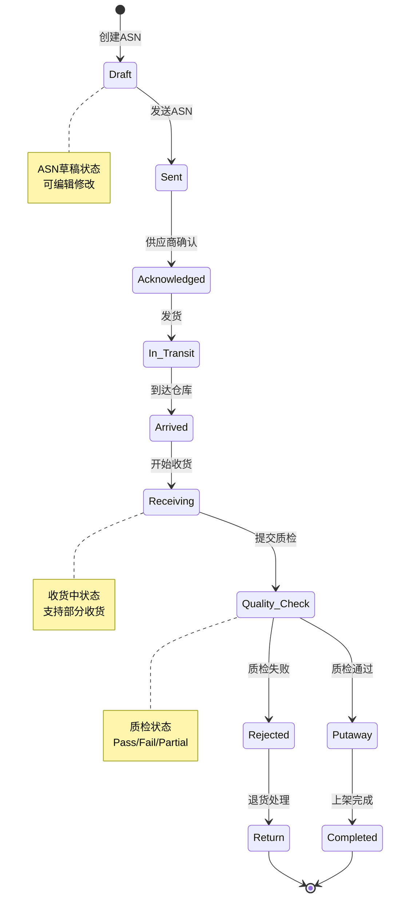

**状态转换表**:

| 当前状态 | 事件 | 下一状态 | 条件/动作 |
|---------|------|---------|----------|
| Draft | send_asn | Sent | ASN信息完整 |
| Sent | acknowledge | Acknowledged | 供应商确认 |
| Acknowledged | ship | In_Transit | 货物发出 |
| In_Transit | arrive | Arrived | 车辆到达 |
| Arrived | start_receive | Receiving | 分配月台 |
| Receiving | submit_qc | Quality_Check | 收货完成 |
| Quality_Check | pass | Putaway | 质检通过 |
| Quality_Check | fail | Rejected | 质检失败 |
| Putaway | complete | Completed | 上架确认 |
| Rejected | process_return | Return | 发起退货 |

### 1.2 出库流程状态机

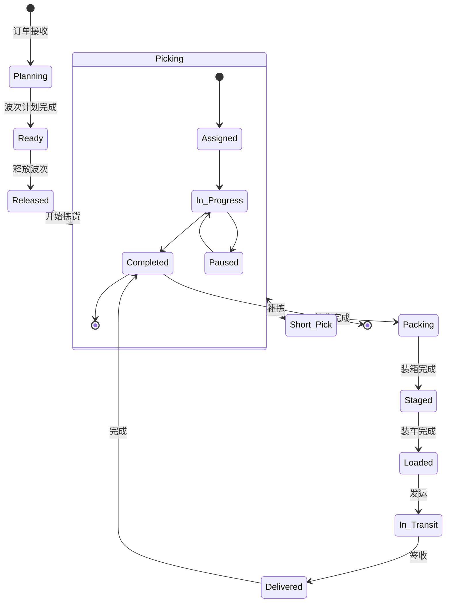

**状态转换表**:

| 当前状态 | 事件 | 下一状态 | 条件/动作 |
|---------|------|---------|----------|
| Planning | plan_complete | Ready | 波次计划完成 |
| Ready | release | Released | 库存充足 |
| Released | start_pick | Picking | 分配拣货任务 |
| Picking | pick_complete | Packing | 全部拣完 |
| Picking | short_pick | Short_Pick | 库存不足 |
| Short_Pick | replenish | Picking | 补货完成 |
| Packing | pack_complete | Staged | 装箱复核 |
| Staged | load | Loaded | 装车确认 |
| Loaded | ship | In_Transit | 发运出库 |
| In_Transit | deliver | Delivered | 客户签收 |
| Delivered | confirm | Completed | 回单确认 |

### 1.3 库存状态机

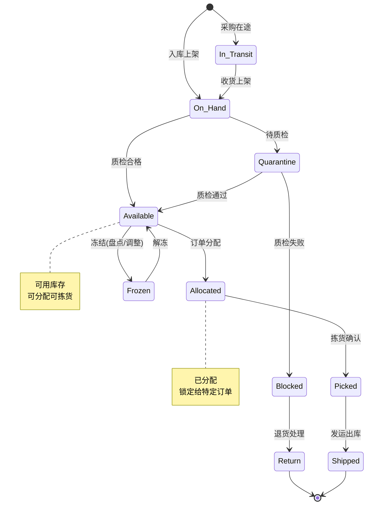

**库存状态转换矩阵**:

```
                事件
状态           收货    质检通过  分配    拣货    发运    冻结    解冻    退货
────────────────────────────────────────────────────────────────────────────
In_Transit     →On_Hand   -       -       -       -       -       -       -
On_Hand           -    →Avail    -       -       -    →Frozen    -       -
Quarantine        -    →Avail    -       -       -       -       -    →Blocked
Available         -       -    →Alloc   -       -    →Frozen    -       -
Allocated         -       -       -    →Picked   -    →Frozen    -       -
Picked            -       -       -       -    →Shipped   -       -       -
Frozen            -       -       -       -       -       -    →Avail    -
Blocked           -       -       -       -       -       -       -    →Return
```

### 1.4 任务状态机

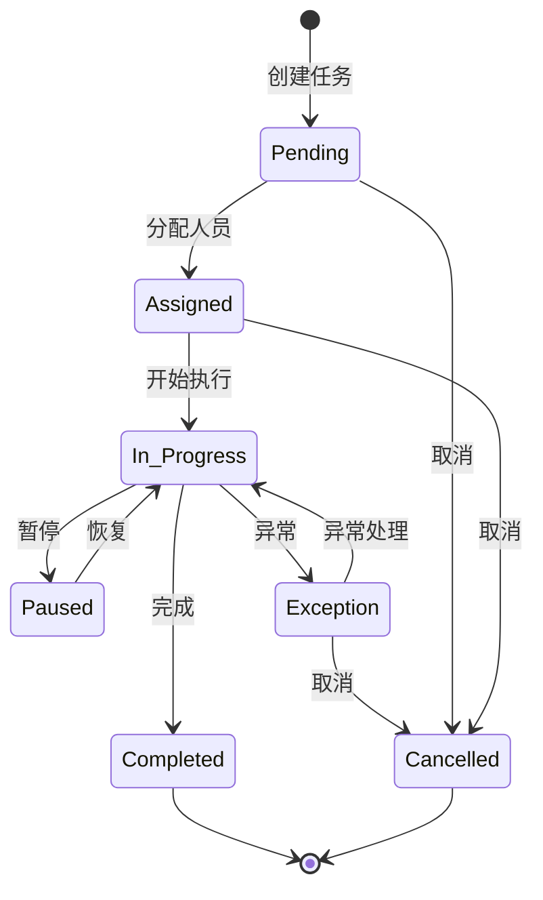

**任务类型与状态**:

| 任务类型 | 初始状态 | 终态 | 异常处理 |
|---------|---------|------|---------|
| 收货任务 | Pending | Completed | 超收/短收/质检异常 |
| 上架任务 | Pending | Completed | 库位已满/SKU不符 |
| 拣货任务 | Pending | Completed | 缺货/货损/库位空 |
| 补货任务 | Pending | Completed | 源库位缺货 |
| 盘点任务 | Pending | Completed | 差异过大 |
| 移库任务 | Pending | Completed | 目标库位不可用 |

---

## 2. 时序图形式化

### 2.1 入库流程时序图

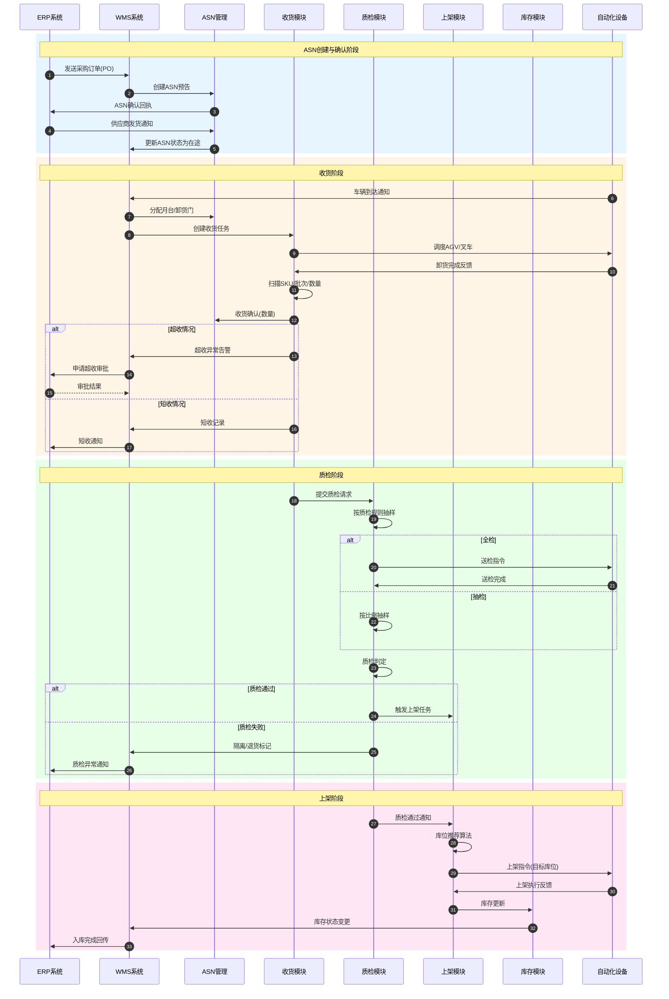

**时序说明**:

| 步骤 | 操作 | 系统/模块 | 关键数据 |
|-----|------|----------|---------|
| 1 | 发送PO | ERP | PO号、供应商、SKU、数量 |
| 2 | 创建ASN | WMS | ASN号、预计到达时间 |
| 6 | 车辆到达 | 自动化设备 | 车牌、司机信息 |
| 9 | 卸货扫描 | 收货模块 | SKU、批次、数量、LPN |
| 13 | 超收/短收处理 | 异常处理 | 差异数量、原因 |
| 19 | 质检判定 | 质检模块 | 合格数、不合格数 |
| 25 | 库位推荐 | 上架模块 | 推荐库位、距离、容量 |
| 27 | 库存更新 | 库存模块 | 库位、数量、状态 |

### 2.2 出库流程时序图

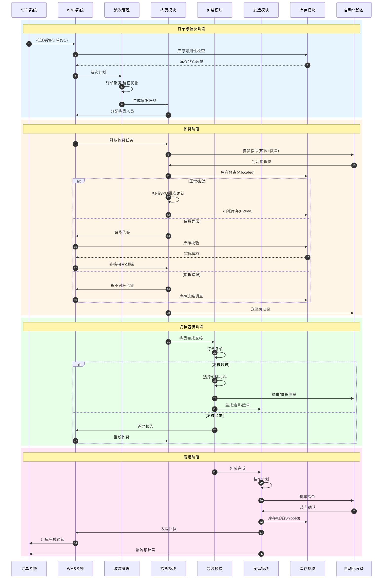

**时序说明**:

| 步骤 | 操作 | 系统/模块 | 关键数据 |
|-----|------|----------|---------|
| 1 | 推送订单 | OMS | SO号、客户、SKU、数量 |
| 4 | 波次计划 | 波次管理 | 波次号、订单列表、优先级 |
| 8 | 库存预占 | 库存模块 | 分配库位、数量 |
| 11 | 缺货处理 | 异常处理 | 缺货SKU、建议替代 |
| 13 | 拣货错误 | 异常处理 | 扫描SKU、系统SKU |
| 17 | 订单复核 | 包装模块 | 订单明细、实物核对 |
| 23 | 装车确认 | 发运模块 | 车辆、司机、路线 |
| 25 | 物流跟踪号 | 发运模块 | 承运商、运单号、ETA |

---

## 3. 数据流分析

### 3.1 库存数据流动

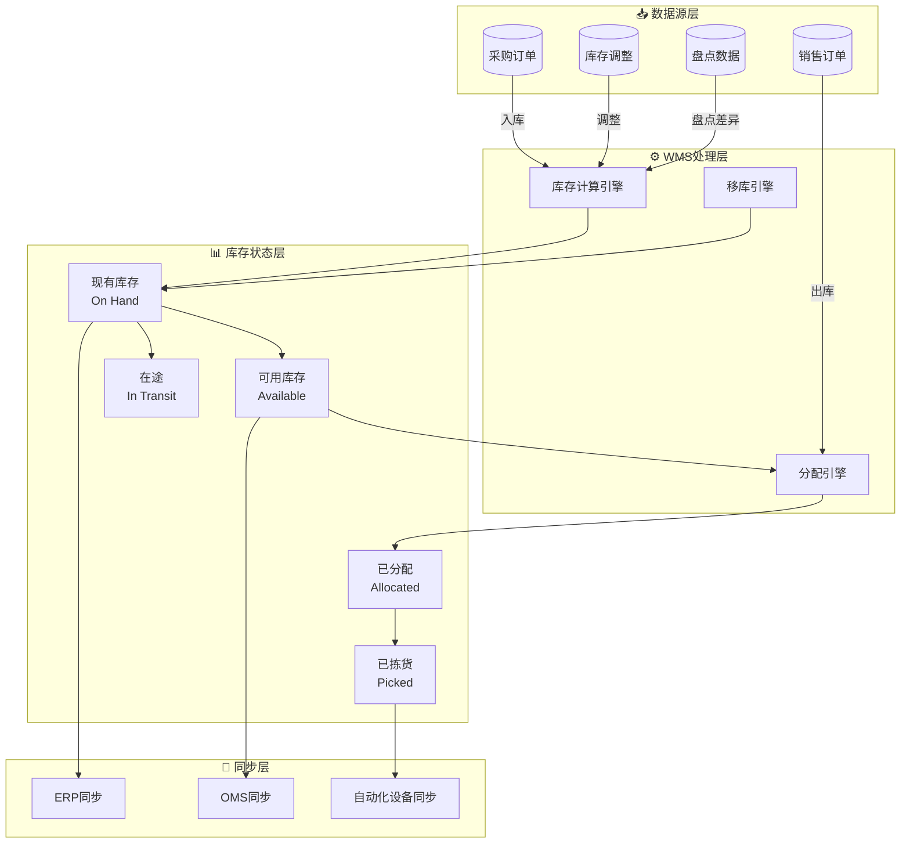

**库存数据流说明**:

| 数据流 | 来源 | 目标 | 频率 | 数据量 |
|-------|------|------|------|--------|
| 入库数据流 | 收货模块 | 库存中心 | 实时 | 单条/批次 |
| 出库数据流 | 拣货模块 | 库存中心 | 实时 | 单条/批次 |
| 调整数据流 | 盘点/异常 | 库存中心 | 按需 | 单条 |
| 同步数据流 | 库存中心 | ERP/OMS | 准实时(5分钟) | 批量 |
| 预占数据流 | 订单分配 | 库存中心 | 实时 | 单条 |

**库存计算公式**:

```
On_Hand = 物理库存数量
Available = On_Hand - Allocated - Picked - Reserved
Allocated = Σ(订单分配数量)
Picked = Σ(已拣货未发运)
Reserved = 安全库存 + 冻结库存
```

### 3.2 WMS与ERP/自动化设备集成

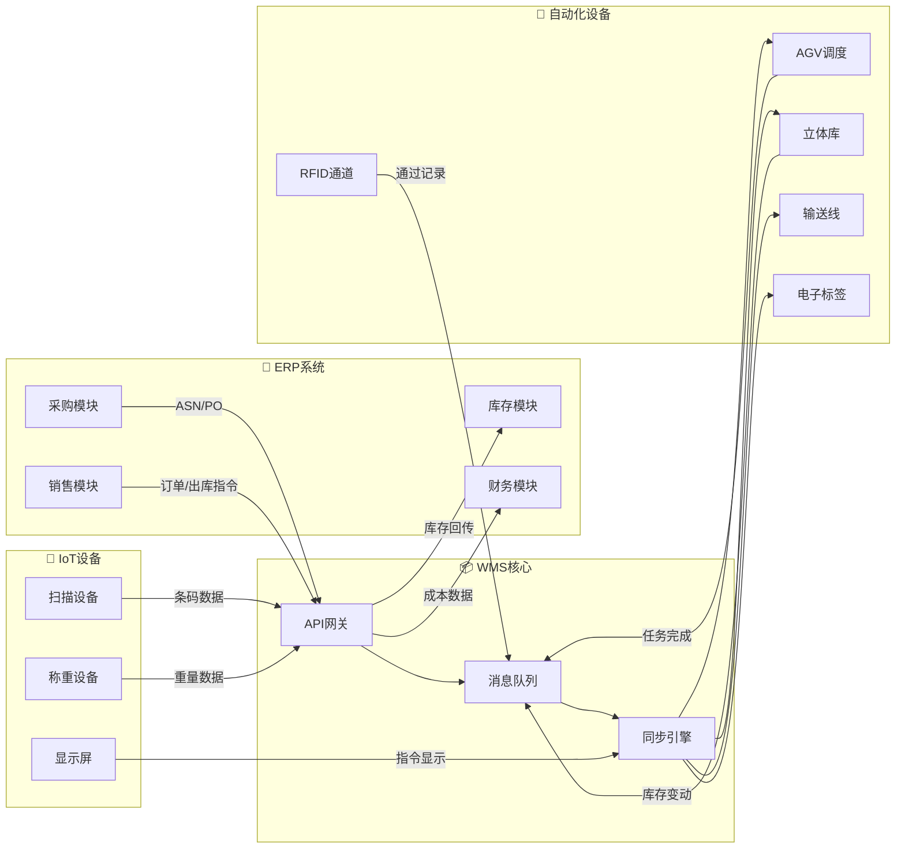

**集成接口矩阵**:

| 接口方向 | 接口名称 | 协议 | 频率 | 关键字段 |
|---------|---------|------|------|---------|
| ERP→WMS | 采购订单接口 | REST/JSON | 实时 | PO号、SKU、数量、供应商 |
| ERP→WMS | 销售订单接口 | REST/JSON | 实时 | SO号、客户、SKU、数量 |
| WMS→ERP | 入库回传接口 | REST/JSON | 准实时 | ASN号、实收数量、差异 |
| WMS→ERP | 出库回传接口 | REST/JSON | 准实时 | SO号、实发数量、运单号 |
| WMS→ERP | 库存同步接口 | REST/JSON | 定时(5min) | SKU、库位、数量、状态 |
| WMS→AGV | 搬运任务接口 | TCP/私有 | 实时 | 任务ID、起点、终点、优先级 |
| AGV→WMS | 任务反馈接口 | TCP/私有 | 实时 | 任务ID、状态、位置 |
| WMS→ASRS | 存取指令接口 | OPC/私有 | 实时 | 指令类型、库位、托盘号 |
| ASRS→WMS | 库存反馈接口 | OPC/私有 | 实时 | 库位、托盘号、数量 |
| RFID→WMS | 通过事件接口 | MQTT | 实时 | 标签ID、方向、时间 |

---

## 4. 实时性分析

### 4.1 作业响应时间

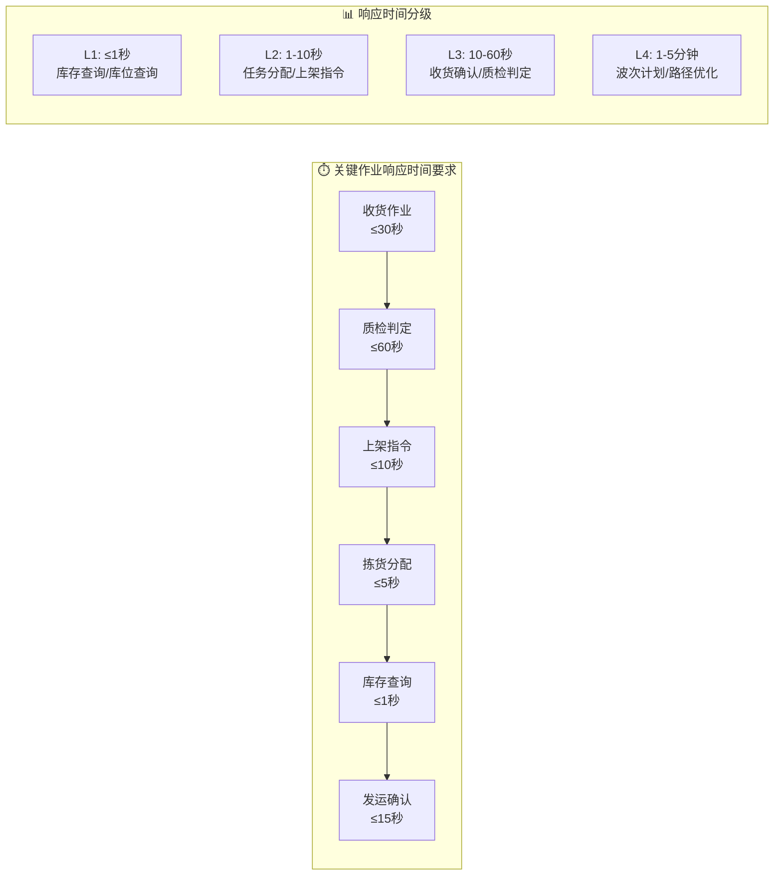

**作业响应时间SLA**:

| 作业类型 | 平均响应时间 | 最大响应时间 | 测量点 |
|---------|-------------|-------------|--------|
| 库存实时查询 | ≤500ms | ≤1s | 查询请求→结果返回 |
| 收货任务创建 | ≤5s | ≤10s | ASN确认→任务生成 |
| 收货扫描确认 | ≤2s | ≤5s | 扫描→系统反馈 |
| 质检结果录入 | ≤3s | ≤8s | 提交→状态更新 |
| 上架库位推荐 | ≤3s | ≤10s | 请求→推荐列表 |
| 上架任务确认 | ≤2s | ≤5s | 确认→库存更新 |
| 波次计划生成 | ≤30s | ≤2min | 触发→计划完成 |
| 拣货任务分配 | ≤5s | ≤15s | 波次释放→任务就绪 |
| 拣货扫描确认 | ≤1s | ≤3s | 扫描→库位亮灯 |
| 发运装车确认 | ≤10s | ≤30s | 扫描→状态更新 |

**响应时间监控指标**:

```yaml
监控指标:
  - 指标名: inventory_query_p99
    描述: 库存查询P99响应时间
    阈值: < 1s
    告警: > 1.5s

  - 指标名: receipt_task_create_avg
    描述: 收货任务创建平均时间
    阈值: < 5s
    告警: > 10s

  - 指标名: pick_scan_response_p95
    描述: 拣货扫描P95响应时间
    阈值: < 2s
    告警: > 5s

  - 指标名: wave_plan_duration
    描述: 波次计划耗时
    阈值: < 60s
    告警: > 120s
```

### 4.2 拣货效率SLA

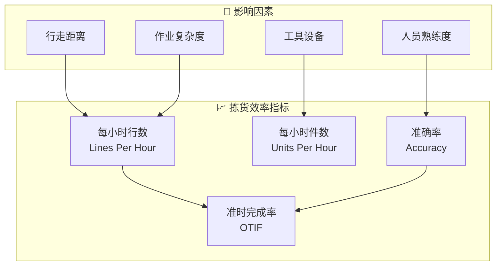

**拣货效率基准**:

| 拣货模式 | 效率基准(LPH) | 效率基准(UPH) | 准确率要求 | 适用场景 |
|---------|-------------|-------------|-----------|---------|
| 纸单拣货 | 30-50行/小时 | 60-100件/小时 | ≥99.0% | 低频小仓 |
| RF扫描拣货 | 60-100行/小时 | 120-200件/小时 | ≥99.5% | 标准仓库 |
| 语音拣货 | 80-120行/小时 | 160-240件/小时 | ≥99.7% | 大批量整件 |
| PTL电子标签 | 150-250行/小时 | 300-500件/小时 | ≥99.9% | 拆零拣选 |
| AGV货到人 | 200-400行/小时 | 400-800件/小时 | ≥99.95% | 高密度存储 |
| 自动分拣 | 500-1000行/小时 | 1000-2000件/小时 | ≥99.99% | 大批量订单 |

**拣货SLA承诺**:

| SLA项 | 标准值 | 承诺值 | 惩罚条款 |
|------|--------|--------|---------|
| 波次准时释放 | 100% | ≥99% | 延迟1单扣减服务费 |
| 拣货准时完成 | 100% | ≥98% | 延迟按分钟计费 |
| 拣货准确率 | 100% | ≥99.9% | 错误按件赔偿 |
| 订单截单时间 | 17:00 | 16:00前100%当日发 | 延迟次日发赔付 |
| 异常响应时间 | - | ≤15分钟 | 超时报备 |

**效率计算公式**:

```
LPH = 总拣货行数 / 总拣货工时
UPH = 总拣货件数 / 总拣货工时
拣货准确率 = (1 - 差错订单数/总订单数) × 100%
OTIF = 准时完成订单数 / 总订单数 × 100%
拣货效率系数 = 实际LPH / 标准LPH
```

---

## 5. 异常处理

### 5.1 超收/短收处理

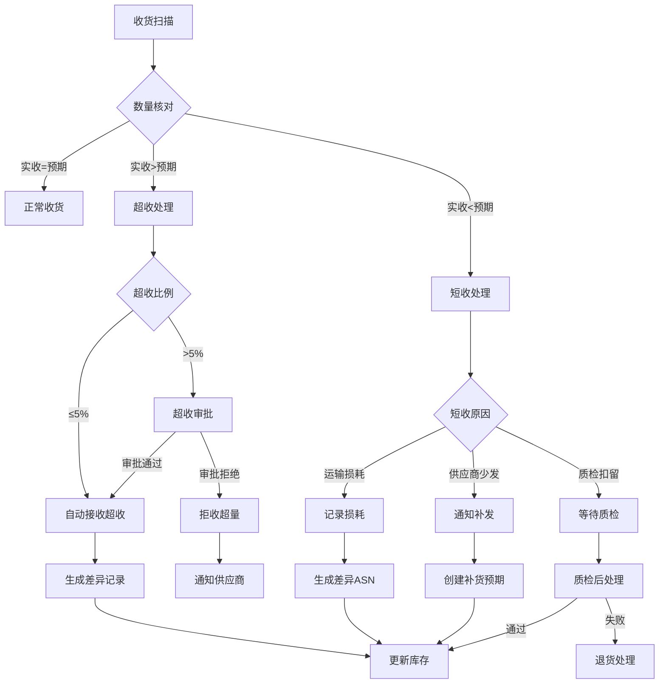

**超收处理规则**:

| 超收比例 | 处理方式 | 审批级别 | 系统动作 |
|---------|---------|---------|---------|
| ≤2% | 自动接收 | 无需审批 | 更新ASN、增加库存 |
| 2%-5% | 自动接收(带标记) | 事后审计 | 生成差异报告 |
| 5%-10% | 需要审批 | 仓库主管 | 冻结超收部分、发起审批 |
| >10% | 必须审批 | 运营经理 | 拒收超量、通知供应商 |

**短收处理规则**:

| 短收类型 | 处理流程 | 责任方 | 补救措施 |
|---------|---------|--------|---------|
| 运输损耗 | 记录损耗→保险索赔 | 承运商 | 索赔/补发 |
| 供应商少发 | 通知供应商→补发预期 | 供应商 | 供应商补发 |
| 质检扣留 | 质检判定→隔离/销毁 | 质检方 | 按结果处理 |
| 系统差错 | 库存调查→差异调整 | 仓库 | 库存调整 |

**异常数据记录**:

```json
{
  "exception_id": "EXC202502150001",
  "exception_type": "Over_Receipt",
  "asn_number": "ASN202502150001",
  "sku_code": "SKU-ABC-123",
  "expected_qty": 100,
  "actual_qty": 108,
  "variance_qty": 8,
  "variance_pct": 8.0,
  "status": "Pending_Approval",
  "created_by": "receiver_001",
  "created_at": "2026-02-15T10:30:00Z",
  "approval_workflow": {
    "level": "Supervisor",
    "approver": null,
    "approved_at": null
  }
}
```

### 5.2 缺货处理

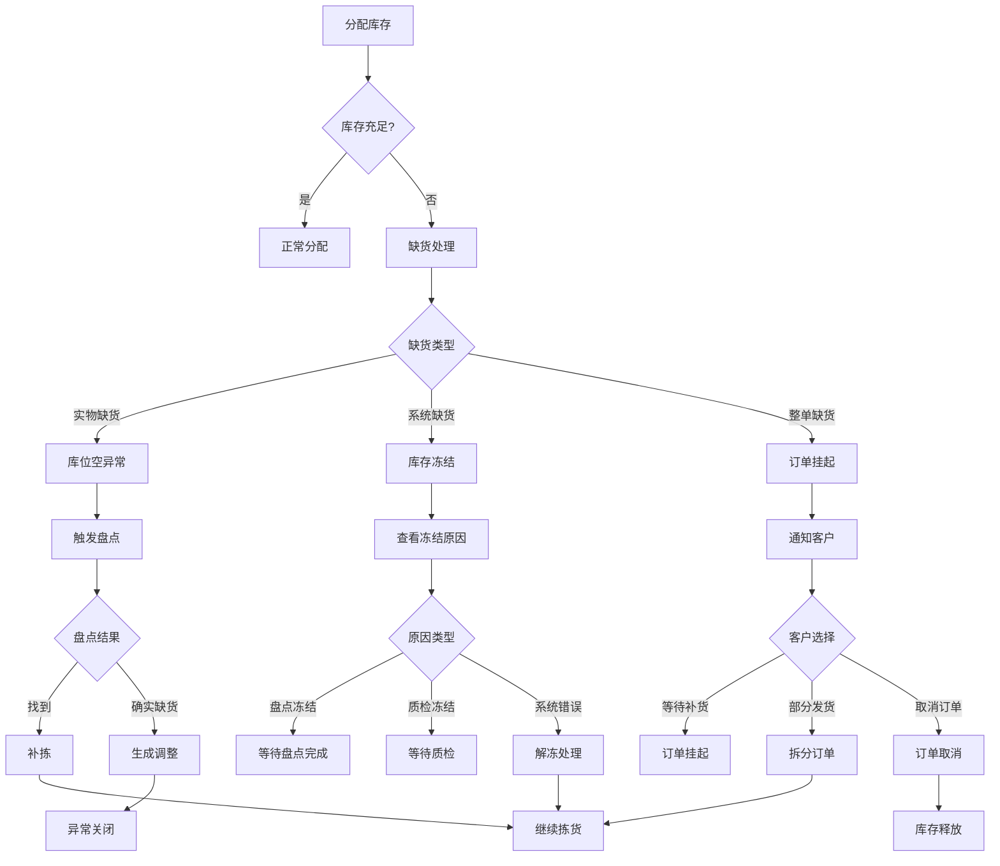

**缺货处理策略**:

| 缺货场景 | 处理策略 | 系统响应时间 | 客户通知 |
|---------|---------|-------------|---------|
| 单库位缺货 | 触发相邻库位查找 | ≤5秒 | 不通知 |
| 区域缺货 | 触发跨区补拣 | ≤30秒 | 延迟通知 |
| 全仓缺货 | 订单挂起/取消 | 实时 | 即时通知 |
| 批次缺货 | 替代批次推荐 | ≤10秒 | 可选通知 |
| 过期批次 | 自动跳过+报告 | 实时 | 内部通知 |

**缺货补救机制**:

```
优先级1: 紧急补货
- 触发条件: 缺货SKU为A类SKU
- 响应时间: ≤2小时
- 执行动作: 从存储区紧急补货至拣货位

优先级2: 跨区调拨
- 触发条件: 本区缺货但其他区域有货
- 响应时间: ≤4小时
- 执行动作: 创建移库任务，跨区域拣货

优先级3: 供应商紧急补货
- 触发条件: 全仓缺货
- 响应时间: 按供应商SLA
- 执行动作: 紧急PO，空运/专车补货

优先级4: 客户协商
- 触发条件: 无法及时补货
- 响应时间: 实时
- 执行动作: 推荐替代品/延迟发货/取消
```

### 5.3 拣货错误处理

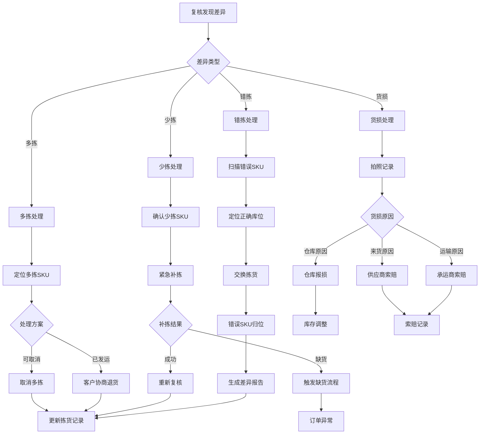

**拣货错误分类与处理**:

| 错误类型 | 错误描述 | 发现阶段 | 处理动作 | 责任判定 |
|---------|---------|---------|---------|---------|
| SKU错误 | 拣错SKU | 复核/客户 | 重新拣货、错误归位 | 拣货员 |
| 数量错误 | 多拣/少拣 | 复核称重 | 补拣/取消、调整记录 | 拣货员 |
| 批次错误 | 拣错批次(先进先出) | 系统校验 | 重新拣货、批次调整 | 拣货员 |
| 货损 | 商品破损 | 复核/包装 | 报损、补发 | 视原因 |
| 库位错误 | 系统库位与实物不符 | 拣货时发现 | 盘点校正、紧急补货 | 系统/仓库 |
| 序列号错误 | 高价值商品序列号错 | 复核扫描 | 追回、重新发货 | 拣货员 |

**错误处理时效要求**:

| 处理阶段 | 时效要求 | 责任人 | 升级条件 |
|---------|---------|--------|---------|
| 错误发现 | 实时 | 复核员 | 批量错误(>5单) |
| 原因分析 | ≤15分钟 | 班组长 | 系统原因 |
| 补救执行 | ≤30分钟 | 拣货员 | 高价值商品 |
| 客户通知 | ≤1小时 | 客服 | 已发运错误 |
| 整改措施 | ≤24小时 | 运营经理 | 重复错误 |

**错误率监控与改进**:

```yaml
监控指标:
  日维度:
    - 拣货错误率: < 0.1%
    - 复核差异率: < 0.05%
    - 客诉错发率: < 0.01%

  人员维度:
    - 新员工错误率: < 1% (首月)
    - 熟练工错误率: < 0.05%
    - 异常人员预警: 连续3天>0.5%

  改进措施:
    - 培训强化: 错误率>0.2%强制培训
    - 系统优化: 库位优化、防错扫描
    - 绩效考核: 错误率纳入KPI
    - 设备升级: 语音/灯光辅助拣货
```

---

## 附录: 状态机形式化定义

### A.1 入库流程状态机形式化

```
States_Inbound = {Draft, Sent, Acknowledged, In_Transit, Arrived,
                  Receiving, Quality_Check, Putaway, Completed,
                  Rejected, Return, Cancelled}

Transitions_Inbound ⊆ States_Inbound × Event × States_Inbound

Transitions_Inbound = {
  (Draft, send_asn, Sent),
  (Sent, acknowledge, Acknowledged),
  (Acknowledged, ship, In_Transit),
  (In_Transit, arrive, Arrived),
  (Arrived, start_receive, Receiving),
  (Receiving, submit_qc, Quality_Check),
  (Quality_Check, pass, Putaway),
  (Quality_Check, fail, Rejected),
  (Putaway, complete, Completed),
  (Rejected, process_return, Return),
  (Draft, cancel, Cancelled),
  (Sent, cancel, Cancelled),
  (Acknowledged, cancel, Cancelled)
}

Invariant_Inbound:
  ∀s ∈ States_Inbound :
    s = Completed → history_contains(s, Arrived) ∧
    s = Quality_Check → history_contains(s, Receiving)
```

### A.2 出库流程状态机形式化

```
States_Outbound = {Planning, Ready, Released, Picking, Short_Pick,
                   Packing, Staged, Loaded, In_Transit, Delivered,
                   Completed, Cancelled, Exception}

Transitions_Outbound = {
  (Planning, plan_complete, Ready),
  (Ready, release, Released),
  (Released, start_pick, Picking),
  (Picking, pick_complete, Packing),
  (Picking, short_pick, Short_Pick),
  (Short_Pick, replenish, Picking),
  (Packing, pack_complete, Staged),
  (Staged, load, Loaded),
  (Loaded, ship, In_Transit),
  (In_Transit, deliver, Delivered),
  (Delivered, confirm, Completed),
  (Planning, cancel, Cancelled),
  (Ready, cancel, Cancelled)
}
```

---

**文档结束**
