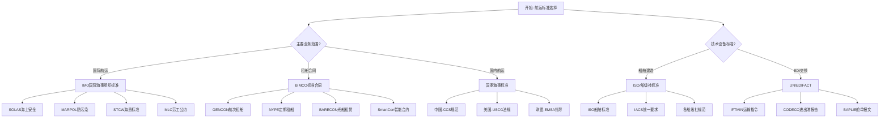
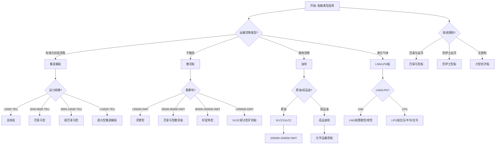
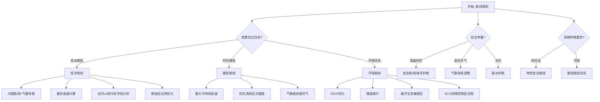
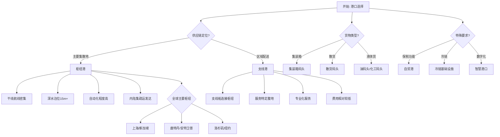
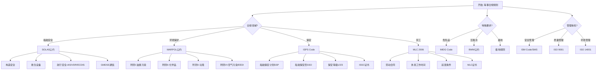

# 海事航运Schema决策树图

**版本**: v1.0
**创建日期**: 2026-02-15
**适用范围**: 海事航运Schema设计和选型

---

## 📑 目录

- [海事航运Schema决策树图](#海事航运schema决策树图)
  - [📑 目录](#-目录)
  - [概览](#概览)
  - [1. 航运标准选择决策树](#1-航运标准选择决策树)
  - [2. 船舶类型选择决策树](#2-船舶类型选择决策树)
  - [3. 航线规划决策树](#3-航线规划决策树)
  - [4. 港口选择决策树](#4-港口选择决策树)
  - [5. 海事合规决策树](#5-海事合规决策树)
  - [6. Mermaid可视化](#6-mermaid可视化)
    - [6.1 航运标准选择流程图](#61-航运标准选择流程图)
    - [6.2 船舶类型选择流程图](#62-船舶类型选择流程图)
    - [6.3 航线规划流程图](#63-航线规划流程图)
    - [6.4 港口选择流程图](#64-港口选择流程图)
    - [6.5 海事合规流程图](#65-海事合规流程图)
  - [使用指南](#使用指南)
    - [如何使用这些决策树](#如何使用这些决策树)
    - [决策树组合使用示例](#决策树组合使用示例)
    - [常见陷阱与建议](#常见陷阱与建议)

---

## 概览

| 决策树 | 适用场景 | 关键决策点 | 输出结果 |
|--------|----------|------------|----------|
| 航运标准选择 | 海事标准选型 | 业务范围、地域分布、合同类型 | IMO/BIMCO/ISO/国家标准 |
| 船舶类型选择 | 运力规划 | 货物类型、运输量、航线特点 | 集装箱/散货/油轮/LNG船 |
| 航线规划 | 航次设计 | 时效要求、成本约束、环保要求 | 经济/最短/环保航线 |
| 港口选择 | 挂靠港决策 | 货物量、中转需求、基础设施 | 枢纽港/支线港 |
| 海事合规 | 法规遵循 | 船舶类型、航行区域、货物性质 | SOLAS/MARPOL/ISPS |

---

## 1. 航运标准选择决策树

```text
开始: 选择航运消息与合同标准
│
├─ Q: 主要业务范围?
│   │
│   ├─ 国际航运 (公海/跨国)
│   │   └─ 决策: 优先IMO国际海事组织标准
│   │       ├─ 理由: 联合国专门机构,全球海事安全与环保权威
│   │       ├─ 核心公约:
│   │       │   ├─ SOLAS (海上人命安全)
│   │       │   ├─ MARPOL (防止船舶污染)
│   │       │   ├─ STCW (海员培训发证值班标准)
│   │       │   ├─ MLC (海事劳工公约)
│   │       │   └─ COLREG (国际海上避碰规则)
│   │       ├─ 适用对象:
│   │       │   ├─ 所有从事国际航行的船舶
│   │       │   ├─ 船旗国管理机构
│   │       │   └─ 港口国监督机构
│   │       └─ 技术要求:
│   │           ├─ GMDSS全球海上遇险安全系统
│   │           ├─ AIS船舶自动识别系统
│   │           ├─ LRIT远程识别与跟踪
│   │           └─ E-Navigation电子航海
│   │
│   ├─ 国际航运合同/租船
│   │   └─ 决策: BIMCO标准合同体系
│   │       ├─ 理由: 全球最大航运组织,标准合同权威
│   │       ├─ 核心合同类型:
│   │       │   │
│   │       │   ├─ 航次租船合同
│   │       │   │   ├─ GENCON (通用航次租船)
│   │       │   │   ├─ COAL-OREVOY (煤炭/矿石)
│   │       │   │   └─ HEAVYCON (重件运输)
│   │       │   │
│   │       │   ├─ 定期租船合同
│   │       │   │   ├─ BALTIME (定期租船)
│   │       │   │   ├─ NYPE (纽约土产交易所)
│   │       │   │   └─ BOXTIME (集装箱定期租船)
│   │       │   │
│   │       │   ├─ 光船租赁合同
│   │       │   │   ├─ BARECON (标准光船租赁)
│   │       │   │   └─ SHELLTIME (壳牌期租)
│   │       │   │
│   │       │   └─ 提单与运输单据
│   │       │       ├─ CONGENBILL (通用提单)
│   │       │       └─ SHIPTERM (船舶代理条款)
│   │       │
│   │       ├─ 数字化创新:
│   │       │   ├─ SmartCon (智能合约平台)
│   │       │   ├─ 25X25愿景 (电子提单标准化)
│   │       │   └─ 区块链技术应用
│   │       │
│   │       └─ 适用场景:
│   │           ├─ 国际租船交易
│   │           ├─ 大宗货物运输
│   │           ├─ 船舶融资租赁
│   │           └─ 船舶买卖交易
│   │
│   └─ 国内航运/内河运输
│       └─ 决策: 国家海事标准
│           │
│           ├─ 中国标准
│           │   ├─ 《海船法定检验技术规则》
│           │   ├─ 《内河船舶法定检验技术规则》
│           │   ├─ JT/T系列交通行业标准
│           │   ├─ GB/T国家标准
│           │   └─ 中国船级社(CCS)规范
│           │
│           ├─ 美国标准
│           │   ├─ USCG法规 (美国海岸警卫队)
│           │   ├─ CFR Title 46 (航运法规)
│           │   └─ ABS船级社规范
│           │
│           ├─ 欧盟标准
│           │   ├─ EMSA指导方针
│           │   ├─ 欧盟港口国监督指令
│           │   └─ 欧盟排放交易体系(EU ETS)
│           │
│           └─ 选择因素:
│               ├─ 船旗国要求
│               ├─ 营运区域法规
│               └─ 港口国监督要求
│
├─ Q: 是否需要技术/设备标准?
│   │
│   ├─ 船舶建造与设备 → ISO/船级社标准
│   │   ├─ ISO船舶标准:
│   │   │   ├─ ISO 8208 (船舶管路)
│   │   │   ├─ ISO 8459 (船舶舱容计量)
│   │   │   ├─ ISO 10303 (船舶产品数据交换STEP)
│   │   │   ├─ ISO 19848 (船舶数据服务器)
│   │   │   └─ ISO 19847 (船舶数据采集)
│   │   │
│   │   ├─ 船级社规范:
│   │   │   ├─ IACS统一要求(国际船级社协会)
│   │   │   ├─ 各船级社规范:
│   │   │   │   ├─ LR (劳氏船级社)
│   │   │   │   ├─ DNV (挪威船级社)
│   │   │   │   ├─ CCS (中国船级社)
│   │   │   │   ├─ ABS (美国船级社)
│   │   │   │   ├─ NK/ClassNK (日本船级社)
│   │   │   │   ├─ BV (法国船级社)
│   │   │   │   └─ KR (韩国船级社)
│   │   │   │
│   │   └─ 适用:
│   │       ├─ 新船建造
│   │       ├─ 船舶改装
│   │       └─ 设备认证
│   │
│   └─ 物流与信息交换 → UN/CEFACT标准
│       ├─ UN/EDIFACT海运报文:
│       │   ├─ IFTMIN (运输指令)
│       │   ├─ IFTMCS (运输状态)
│       │   ├─ IFTSTA (运输状态报告)
│       │   ├─ COPARN (集装箱还箱指令)
│       │   ├─ COPRAR (集装箱卸船报告)
│       │   ├─ CODECO (集装箱进出港报告)
│       │   └─ BAPLIE (舱单报文)
│       │
│       ├─ 数字化标准:
│       │   ├─ SMDG (船舶主数据组)
│       │   ├─ UN/LOCODE (地点代码)
│       │   ├─ BIC代码 (箱主代码)
│       │   └─ ISO 6346 (集装箱编码)
│       │
│       └─ 适用:
│           ├─ 港口电子数据交换
│           ├─ 船公司EDI系统
│           └─ 多式联运信息交换
│
├─ Q: 贸易与单证要求?
│   │
│   ├─ 国际贸易结算 → ICC跟单信用证
│   │   ├─ UCP600 (跟单信用证统一惯例)
│   │   ├─ ISBP745 (国际标准银行实务)
│   │   ├─ eUCP (电子交单补充)
│   │   └─ 关键单证:
│   │       ├─ 海运提单(B/L)
│   │       ├─ 海运单(Sea Waybill)
│   │       └─ 电子提单
│   │
│   └─ 海关与贸易合规 → WCO标准
│       ├─ HS编码 (协调制度)
│       ├─ WCO数据模型
│       ├─ 单一窗口标准
│       └─ AEO认证(经认证的经营者)
│
└─ Q: 实施复杂度承受度?
    │
    ├─ 高 (全球合规优先)
    │   └─ 推荐: IMO + BIMCO + IACS + ISO综合体系
    │
    ├─ 中 (区域专注)
    │   └─ 推荐: 核心IMO公约 + 区域标准 + 主要船级社规范
    │
    └─ 低 (快速适用)
        └─ 推荐: 船旗国最低要求 + 港口国基本要求
```

---

## 2. 船舶类型选择决策树

```text
开始: 选择船舶类型
│
├─ Q: 运输货物类型?
│   │
│   ├─ 标准化包装货物
│   │   └─ 决策: 集装箱船 (Container Ship)
│   │       ├─ 特点:
│   │       │   ├─ 货舱与甲板设导轨/固定装置
│   │       │   ├─ 配备集装箱绑扎系统
│   │       │   ├─ 大舱口设计便于吊装
│   │       │   └─ 航速较快(20-25节)
│   │       │
│   │       ├─ 分类(按运力):
│   │       │   ├─ 小型支线船 (<1000 TEU)
│   │       │   ├─ 支线船 (1000-3000 TEU)
│   │       │   ├─ 灵便型 (3000-6000 TEU)
│   │       │   ├─ 巴拿马型 (4000-8000 TEU)
│   │       │   ├─ 超巴拿马型 (8000-14500 TEU)
│   │       │   ├─ 新巴拿马型 (Neo-Panamax, 10000-14500 TEU)
│   │       │   ├─ 超大型 (14500-24000 TEU)
│   │       │   └─ 巨型集装箱船 (>24000 TEU)
│   │       │
│   │       ├─ 特殊类型:
│   │       │   ├─ 冷藏集装箱船 (Reefer)
│   │       │   ├─ 开顶集装箱船
│   │       │   └─ 框架集装箱船
│   │       │
│   │       ├─ 适用货物:
│   │       │   ├─ 一般消费品
│   │       │   ├─ 电子产品
│   │       │   ├─ 纺织品
│   │       │   ├─ 机械设备
│   │       │   └─ 冷链食品(配冷藏箱)
│   │       │
│   │       └─ 主要航线:
│   │           ├─ 远东-北美
│   │           ├─ 远东-欧洲
│   │           ├─ 欧洲-北美(跨大西洋)
│   │           └─ 区域内支线
│   │
│   ├─ 干散货 (大宗干货)
│   │   └─ 决策: 散货船 (Bulk Carrier)
│   │       ├─ 特点:
│   │       │   ├─ 单层甲板、大舱口
│   │       │   ├─ 底边舱/顶边舱设计
│   │       │   ├─ 配备装卸设备(部分)
│   │       │   ├─ 航速中等(12-16节)
│   │       │   └─ 经济性好
│   │       │
│   │       ├─ 分类(按载重吨DWT):
│   │       │   ├─ 小型散货船 (<10000 DWT)
│   │       │   ├─ 灵便型 (Handysize, 10000-35000 DWT)
│   │       │   ├─ 大灵便型 (Handymax, 35000-50000 DWT)
│   │       │   ├─ 巴拿马型 (Panamax, 60000-80000 DWT)
│   │       │   ├─ 超巴拿马型 (Post-Panamax, 80000-120000 DWT)
│   │       │   ├─ 好望角型 (Capesize, 100000-200000 DWT)
│   │       │   ├─ 超大型矿砂船 (VLOC, 200000-400000 DWT)
│   │       │   └─ 超大型散货船 (ULBC, >320000 DWT)
│   │       │
│   │       ├─ 特殊类型:
│   │       │   ├─ 自卸散货船
│   │       │   ├─ 木片运输船
│   │       │   ├─ 水泥运输船
│   │       │   └─ 敞口散货船
│   │       │
│   │       ├─ 适用货物:
│   │       │   ├─ 铁矿石
│   │       │   ├─ 煤炭
│   │       │   ├─ 粮食(小麦/大豆/玉米)
│   │       │   ├─ 铝土矿
│   │       │   ├─ 磷矿石
│   │       │   └─ 散货水泥
│   │       │
│   │       └─ 主要航线:
│   │           ├─ 巴西/澳大利亚-中国(铁矿石)
│   │           ├─ 印尼/澳大利亚-中国/印度(煤炭)
│   │           ├─ 美洲/黑海-亚洲(粮食)
│   │           └─ 区域性散货运输
│   │
│   ├─ 液体货物 (石油/成品油)
│   │   └─ 决策: 油轮 (Tanker)
│   │       ├─ 特点:
│   │       │   ├─ 纵向舱壁分隔货舱
│   │       │   ├─ 双层船壳(防油污)
│   │       │   ├─ 专用泵送系统
│   │       │   ├─ 惰性气体系统
│   │       │   ├─ 专用洗舱系统
│   │       │   └─ 航速中等(12-16节)
│   │       │
│   │       ├─ 分类(原油轮按DWT):
│   │       │   ├─ 通用型 (General Purpose, <25000 DWT)
│   │       │   ├─ 中型 (Medium Range, 25000-55000 DWT)
│   │       │   ├─ 灵便型 (Handymax, 55000-80000 DWT)
│   │       │   ├─ 巴拿马型 (Panamax, 60000-80000 DWT)
│   │       │   ├─ 阿芙拉型 (Aframax, 80000-120000 DWT)
│   │       │   ├─ 苏伊士型 (Suezmax, 120000-200000 DWT)
│   │       │   ├─ 超大型 (VLCC, 200000-320000 DWT)
│   │       │   └─ 超巨型 (ULCC, >320000 DWT)
│   │       │
│   │       ├─ 成品油轮(Product Tanker):
│   │       │   ├─ 化学品/成品油兼用船
│   │       │   ├─ 不锈钢舱内胆(化学品)
│   │       │   └─ 多舱分隔(运输不同油品)
│   │       │
│   │       ├─ 特殊类型:
│   │       │   ├─ FPSO (浮式生产储油卸油装置)
│   │       │   ├─ FSO (浮式储油装置)
│   │       │   ├─ 穿梭油轮
│   │       │   └─ 沥青船
│   │       │
│   │       ├─ 适用货物:
│   │       │   ├─ 原油
│   │       │   ├─ 成品油(汽油/柴油/航煤)
│   │       │   ├─ 石油化工品
│   │       │   ├─ 润滑油
│   │       │   └─ 液态沥青
│   │       │
│   │       └─ 主要航线:
│   │           ├─ 中东-亚洲(原油)
│   │           ├─ 西非-北美/欧洲
│   │           ├─ 美洲-亚洲
│   │           └─ 区域成品油运输
│   │
│   └─ 液化天然气/石油气
│       └─ 决策: LNG/LPG船
│           │
│           ├─ LNG船 (液化天然气船)
│           │   ├─ 特点:
│           │   │   ├─ 超低温储存(-162°C)
│           │   │   ├─ 薄膜型/球型液货舱
│           │   │   ├─ 高隔热性能
│           │   │   ├─ 货物蒸发气(BOG)处理系统
│           │   │   ├─ 双燃料发动机(可烧BOG)
│           │   │   └─ 建造技术要求极高
│           │   │
│           │   ├─ 舱型技术:
│           │   │   ├─ Moss型 (球形舱, 独立式)
│           │   │   ├─ Membrane薄膜型 (GTT Mark III/NO96)
│           │   │   ├─ SPB型 (棱柱形独立舱)
│           │   │   └─ 新一代技术优化
│           │   │
│           │   ├─ 推进方式:
│           │   │   ├─ 蒸汽轮机(传统)
│           │   │   ├─ 双燃料柴油机+电力
│           │   │   ├─ 双燃料低速柴油机
│           │   │   ├─ MEGI发动机
│           │   │   └─ X-DF发动机
│           │   │
│           │   ├─ 容量规模:
│           │   │   ├─ 小型LNG船 (<50000 m³)
│           │   │   ├─ 中型 (50000-140000 m³)
│           │   │   ├─ 大型 (140000-180000 m³)
│           │   │   └─ Q-Flex/Q-Max (210000-266000 m³)
│           │   │
│           │   └─ 适用:
│           │       ├─ 液化天然气出口运输
│           │       ├─ 大型能源项目
│           │       └─ 长期合同运输
│           │
│           └─ LPG船 (液化石油气船)
│               ├─ 特点:
│               │   ├─ 压力式/半冷半压式/全冷式
│               │   ├─ 运输丙烷/丁烷等
│               │   ├─ 温度/压力可控
│               │   └─ 相对LNG船技术要求较低
│               │
│               ├─ 类型:
│               │   ├─ 全压式 (Pressurized)
│               │   ├─ 半冷半压式 (Semi-refrigerated)
│               │   └─ 全冷式 (Fully refrigerated)
│               │
│               └─ 适用:
│                   ├─ LPG贸易运输
│                   ├─ 化工原料运输
│                   └─ 氨运输
│
├─ Q: 运输规模要求?
│   │
│   ├─ 大批量散货 (>10万吨) → 好望角型/VLOC
│   ├─ 中等批量 (3-10万吨) → 巴拿马型/超巴拿马型
│   ├─ 小批量灵活运输 → 灵便型/支线船
│   └─ 高价值货物 → 集装箱船优先
│
├─ Q: 航线通航限制?
│   │
│   ├─ 巴拿马运河限制 → 巴拿马型 (宽度<32.31m, 吃水<12.04m)
│   ├─ 苏伊士运河限制 → 苏伊士型 (吃水<16m, 宽度<50m)
│   ├─ 港口水深限制 → 按实际水深选择
│   └─ 无限制 → 大型船舶(经济性好)
│
├─ Q: 特殊货物要求?
│   │
│   ├─ 冷藏货物 → 冷藏船/冷藏集装箱
│   ├─ 危险品 → IMO认证专用船舶
│   ├─ 汽车运输 → 汽车运输船(PCTC/Ro-Ro)
│   ├─ 件杂货 → 杂货船/多用途船
│   └─ 重大件 → 重吊船/半潜船
│
└─ Q: 经济性与环保要求?
    │
    ├─ 燃油效率优先 → 新造船/节能设计船舶
    ├─ EEDI合规 → 满足IMO能效设计指数
    ├─ 低排放要求 → LNG双燃料/甲醇燃料船
    └─ 成本优先 → 二手船/传统燃料船
```

---

## 3. 航线规划决策树

```text
开始: 航线规划决策
│
├─ Q: 首要优化目标?
│   │
│   ├─ 成本最低 (燃油+运河费+港口费)
│   │   └─ 决策: 经济航线 (Economic Route)
│   │       ├─ 优化策略:
│   │       │   ├─ 大圆航线+气象导航结合
│   │       │   ├─ 最优航速计算(慢速航行)
│   │       │   ├─ 运河vs绕行经济性分析
│   │       │   ├─ 港口费比较选择
│   │       │   └─ 燃油加注港优化
│   │       │
│   │       ├─ 考虑因素:
│   │       │   ├─ 燃油价格区域差异
│   │       │   ├─ 运河通行费 (苏伊士/巴拿马/马六甲)
│   │       │   ├─ 港口使费比较
│   │       │   ├─ 吃水限制与载货量平衡
│   │       │   ├─ 天气延误概率
│   │       │   └─ 班期准点率要求
│   │       │
│   │       ├─ 典型应用:
│   │       │   ├─ 干散货航运
│   │       │   ├─ 油轮运输
│   │       │   ├─ 非紧急集装箱班轮
│   │       │   └─ 单航次租船
│   │       │
│   │       └─ 计算示例:
│   │           ├─ 苏伊士运河 vs 好望角绕行:
│   │           │   ├─ 运河费: ~30-50万美元/航次
│   │           │   ├─ 绕行增加燃油: ~500-800吨
│   │           │   └─ 决策点: 燃油价格 < $600/吨走运河
│   │           │
│   │           └─ 最优航速计算:
│   │               ├─ 燃油消耗 ∝ 航速³
│   │               ├─ 慢速航行可节省20-40%燃油
│   │               └─ 平衡: 时间成本vs燃油成本
│   │
│   ├─ 时间最短 (最快到达)
│   │   └─ 决策: 最短航线 (Shortest Route)
│   │       ├─ 航线类型:
│   │       │   ├─ 大圆航线 (Great Circle)
│   │       │   │   └─ 地球表面最短路径
│   │       │   ├─ 恒向线航线 (Rhumb Line)
│   │       │   │   └─ 恒定罗经航向,便于驾驶
│   │       │   └─ 混合航线 (Composite)
│   │       │       └─ 大圆+恒向线结合
│   │       │
│   │       ├─ 优化策略:
│   │       │   ├─ 最大可持续航速
│   │       │   ├─ 优先选择运河通道
│   │       │   ├─ 减少中间挂靠
│   │       │   ├─ 气象航线(避开恶劣天气)
│   │       │   └─ 洋流利用(如可能)
│   │       │
│   │       ├─ 典型应用:
│   │       │   ├─ 集装箱班轮干线
│   │       │   ├─ 冷链运输
│   │       │   ├─ 时效性强的货物
│   │       │   └─ 快航服务(Premium Service)
│   │       │
│   │       └─ 技术支撑:
│   │           ├─ ECDIS电子海图系统
│   │           ├─ 气象路由服务
│   │           ├─ 实时交通信息系统
│   │           └─ AIS船舶监控
│   │
│   └─ 环保优先 (最低排放/生态影响)
│       └─ 决策: 环保航线 (Green Route)
│           ├─ 优化策略:
│           │   ├─ EEOI优化 (船舶能效营运指数)
│           │   ├─ 慢速航行 (Slow Steaming)
│           │   ├─ 避开生态敏感区
│           │   ├─ 减少 whale strike风险区
│           │   ├─ 最小化PM2.5排放区
│           │   ├─ 使用岸电的港口优先
│           │   └─ LNG/低硫燃油加注港选择
│           │
│           ├─ IMO环保要求:
│           │   ├─ EEDI能效设计指数合规
│           │   ├─ SEEMP船舶能效管理计划
│           │   ├─ IMO 2020低硫燃油规定
│           │   ├─ 排放控制区(ECA)合规
│           │   │   ├─ 波罗的海ECA
│           │   │   ├─ 北海ECA
│           │   │   ├─ 北美ECA
│           │   │   ├─ 美国加勒比海ECA
│           │   │   └─ 中国沿海ECA
│           │   └─ 压载水管理合规
│           │
│           ├─ 典型应用:
│           │   ├─ 绿色航运公司
│           │   ├─ ESG要求高的货主
│           │   ├─ 欧洲航线(严格环保法规)
│           │   └─ 碳中和承诺运输
│           │
│           └─ 碳排放计算:
│               ├─ CO2排放 = 燃油消耗 × 排放因子
│               ├─ 排放因子: 重油(HFO) ~3.41 kg CO2/kg
│               └─ 目标: 2050年净零排放(IMO战略)
│
├─ Q: 安全因素考量?
│   │
│   ├─ 海盗风险区域 → 安全航线规划
│   │   ├─ 高风险区:
│   │   │   ├─ 亚丁湾/索马里海域
│   │   │   ├─ 几内亚湾
│   │   │   ├─ 马六甲海峡部分区域
│   │   │   └─ 西非部分海域
│   │   └─ 措施: 申请海军护航、武装保安、速度机动
│   │
│   ├─ 恶劣天气区域 → 气象航线
│   │   ├─ 北大西洋冬季风暴
│   │   ├─ 北太平洋冬季
│   │   ├─ 台风/飓风季节区
│   │   └─ 措施: 气象导航服务、航线调整
│   │
│   └─ 冰区航行 → 破冰护航/冰级船
│       ├─ 北极航线 (东北/西北航道)
│       ├─ 波罗的海冬季
│       └─ 圣劳伦斯水道
│
├─ Q: 货物特殊性要求?
│   │
│   ├─ 危险品 → 避开人口密集区、特定航线
│   ├─ 冷链 → 最短航线优先、可靠港口
│   ├─ 超限货物 → 选择无障碍航道
│   └─ 活体动物 → 考虑气候、中途休息港
│
└─ Q: 数字化能力支撑?
    │
    ├─ 实时航线优化 → AI+气象大数据
    ├─ 船队协同 → 船-船通信优化编队
    └─ 港口预约 → JIT(准时制)到港规划
```

---

## 4. 港口选择决策树

```text
开始: 港口选择决策
│
├─ Q: 在供应链中的定位?
│   │
│   ├─ 主要货物集散地 (中转枢纽)
│   │   └─ 决策: 枢纽港 (Hub Port)
│   │       ├─ 特征:
│   │       │   ├─ 地理位置优越(主要航道交汇)
│   │       │   ├─ 深水泊位(15m以上)
│   │       │   ├─ 大型装卸设备(超大型岸桥)
│   │       │   ├─ 自动化程度高
│   │       │   ├─ 航线密集(主干线挂靠)
│   │       │   ├─ 内陆集疏运网络发达
│   │       │   ├─ 物流增值服务齐全
│   │       │   └─ 自由贸易港政策
│   │       │
│   │       ├─ 全球主要枢纽港:
│   │       │   ├─ 亚洲:
│   │       │   │   ├─ 上海 (全球吞吐量第一)
│   │       │   │   ├─ 新加坡 (转运枢纽)
│   │       │   │   ├─ 宁波舟山 (深水良港)
│   │       │   │   ├─ 深圳 (华南枢纽)
│   │       │   │   ├─ 釜山 (东北亚枢纽)
│   │       │   │   ├─ 香港 (国际中转)
│   │       │   │   ├─ 青岛 (北方枢纽)
│   │       │   │   └─ 迪拜杰贝阿里 (中东枢纽)
│   │       │   │
│   │       │   ├─ 欧洲:
│   │       │   │   ├─ 鹿特丹 (欧洲门户)
│   │       │   │   ├─ 安特卫普 (多式联运)
│   │       │   │   ├─ 汉堡 (德国门户)
│   │       │   │   └─ 瓦伦西亚 (地中海枢纽)
│   │       │   │
│   │       │   └─ 美洲:
│   │       │       ├─ 洛杉矶/长滩 (美西主港)
│   │       │       ├─ 纽约/新泽西 (美东枢纽)
│   │       │       ├─ 萨凡纳 (美东南)
│   │       │       ├─ 科隆 (巴拿马枢纽)
│   │       │       └─ 桑托斯 (南美枢纽)
│   │       │
│   │       ├─ 选择因素:
│   │       │   ├─ 干线航线密度
│   │       │   ├─ 支线覆盖范围
│   │       │   ├─ 港口效率(在港时间)
│   │       │   ├─ 集疏运成本
│   │       │   ├─ 港口费用
│   │       │   ├─ 通关效率
│   │       │   └─ 增值服务
│   │       │
│   │       └─ 适用场景:
│   │           ├─ 远洋干线船舶挂靠
│   │           ├─ 国际中转业务
│   │           ├─ 多式联运枢纽
│   │           └─ 区域分拨中心
│   │
│   └─ 区域配送/本地集散 (支线连接)
│       └─ 决策: 支线港 (Feeder Port)
│           ├─ 特征:
│           │   ├─ 服务特定区域经济
│           │   ├─ 泊位规模较小(适合支线船)
│           │   ├─ 通过支线船连接枢纽港
│           │   ├─ 腹地经济支撑
│           │   ├─ 专业化服务(如汽车港、木材港)
│           │   └─ 港口费用相对较低
│           │
│           ├─ 类型:
│           │   ├─ 纯支线港: 无干线挂靠
│           │   ├─ 喂给港: 为枢纽港集疏货物
│           │   └─ 组合港: 兼具部分枢纽功能
│           │
│           ├─ 选择因素:
│           │   ├─ 与枢纽港的连接便利性
│           │   ├─ 支线航班密度
│           │   ├─ 腹地经济状况
│           │   ├─ 陆路运输成本
│           │   ├─ 港口拥堵情况
│           │   └─ 政策优惠(如保税区)
│           │
│           └─ 适用场景:
│               ├─ 区域进出口货物
│               ├─ 内陆地区货物集散
│               ├─ 专业化货物处理
│               └─ 成本敏感型业务
│
├─ Q: 货物处理需求?
│   │
│   ├─ 集装箱货物
│   │   └─ 选择因素:
│   │       ├─ 集装箱吞吐量与航线覆盖
│   │       ├─ 岸桥效率(每小时自然箱)
│   │       ├─ 堆场容量与周转率
│   │       ├─ 冷藏箱插座数量
│   │       ├─ 危险品箱处理能力
│   │       └─ 空箱调运便利性
│   │
│   ├─ 散货
│   │   └─ 选择因素:
│   │       ├─ 专业化码头(矿石/煤炭/粮食)
│   │       ├─ 装卸效率(吨/小时)
│   │       ├─ 堆场与仓储设施
│   │       ├─ 铁路/皮带机疏运能力
│   │       └─ 商检/CIQ便利性
│   │
│   ├─ 液体货
│   │   └─ 选择因素:
│   │       ├─ 泊位水深与管径
│   │       ├─ 储罐容量
│   │       ├─ 专用码头设施
│   │       ├─ 加热/保温能力
│   │       ├─ 油气回收系统
│   │       └─ 环保合规性
│   │
│   └─ 滚装货/件杂货
│       └─ 选择因素:
│           ├─ 滚装泊位设施
│           ├─ 重吊能力
│           ├─ 多用途码头
│           └─ 绑扎场地
│
├─ Q: 成本因素考量?
│   │
│   ├─ 港口使费比较
│   │   ├─ 吨税
│   │   ├─ 停泊费
│   │   ├─ 引航费
│   │   ├─ 拖轮费
│   │   ├─ 装卸费
│   │   └─ 港务费
│   │
│   ├─ 时间成本
│   │   ├─ 泊位等待时间
│   │   ├─ 装卸效率
│   │   ├─ 通关时间
│   │   └─ 集疏运效率
│   │
│   └─ 综合物流成本
│       ├─ 内陆运输距离
│       ├─ 多式联运便利性
│       └─ 仓储成本
│
├─ Q: 特殊要求?
│   │
│   ├─ 保税功能 → 自由贸易港/保税区港口
│   ├─ 冷链服务 → 冷链基础设施完善港口
│   ├─ 船舶修造 → 船厂配套港口
│   ├─ 船员换班 → 移民政策便利港口
│   └─ COVID-19应对 → 防疫政策明确港口
│
└─ Q: 数字化与服务?
    │
    ├─ Port Community System → 无纸化通关
    ├─ 船舶远程监控 → 智能港口服务
    ├─ 区块链单证 → 数字化港口
    └─ 绿色港口认证 → 环保型港口
```

---

## 5. 海事合规决策树

```text
开始: 海事法规合规规划
│
├─ Q: 合规领域优先级?
│   │
│   ├─ 船舶安全 (人命安全)
│   │   └─ 决策: SOLAS公约 (国际海上人命安全公约)
│   │       ├─ 适用范围:
│   │       │   ├─ 国际航行客船
│   │       │   ├─ 300总吨以上国际货船
│   │       │   ├─ 500总吨以上非国际货船
│   │       │   └─ 海上移动式钻井平台
│   │       │
│   │       ├─ 核心章节:
│   │       │   │
│   │       │   ├─ 第II-1章 构造-结构、分舱与稳性
│   │       │   │   ├─ 破损稳性要求
│   │       │   │   ├─ 机电设备要求
│   │       │   │   └─ 消防安全系统
│   │       │   │
│   │       │   ├─ 第II-2章 构造-防火、探火与灭火
│   │       │   │   ├─ 火灾风险区划分
│   │       │   │   ├─ 消防设备配置
│   │       │   │   ├─ 固定式灭火系统
│   │       │   │   └─ 消防员装备
│   │       │   │
│   │       │   ├─ 第III章 救生设备与装置
│   │       │   │   ├─ 救生艇、救助艇
│   │       │   │   ├─ 救生筏
│   │       │   │   ├─ 救生衣与救生圈
│   │       │   │   ├─ 无线电救生设备
│   │       │   │   └─ 遇险信号
│   │       │   │
│   │       │   ├─ 第IV章 无线电通信设备
│   │       │   │   ├─ GMDSS设备
│   │       │   │   ├─ EPIRB应急无线电示位标
│   │       │   │   ├─ SART搜救雷达应答器
│   │       │   │   ├─ 双向无线电话
│   │       │   │   └─ INMARSAT卫星通信
│   │       │   │
│   │       │   ├─ 第V章 航行安全
│   │       │   │   ├─ 航行系统与设备
│   │       │   │   ├─ AIS船舶自动识别系统
│   │       │   │   ├─ VDR航行数据记录仪
│   │       │   │   ├─ ECDIS电子海图系统
│   │       │   │   ├─ LRIT远程识别跟踪
│   │       │   │   └─ BNWAS驾驶台航行值班报警系统
│   │       │   │
│   │       │   ├─ 第VI章 货物装运
│   │       │   │   ├─ 货物系固手册
│   │       │   │   ├─ 散货船安全
│   │       │   │   ├─ 谷物装运规则
│   │       │   │   └─ IMDG Code危险品运输
│   │       │   │
│   │       │   ├─ 第XI-1章 加强海上安全的特别措施
│   │       │   │   ├─ 加强检验程序(ESP)
│   │       │   │   ├─ 散货船和油轮附加要求
│   │       │   │   └─ 船舶识别号
│   │       │   │
│   │       │   └─ 第XI-2章 加强海上保安的特别措施
│   │       │       └─ ISPS Code (见下文)
│   │       │
│   │       ├─ 合规检查:
│   │       │   ├─ 船旗国检验
│   │       │   ├─ 船级社入级检验
│   │       │   ├─ 港口国监督(PSC)
│   │       │   └─ 法定证书:
│   │       │       ├─ 货船安全构造证书
│   │       │       ├─ 货船安全设备证书
│   │       │       ├─ 货船安全无线电证书
│   │       │       ├─ 客船安全证书
│   │       │       ├─ 免除证书(如适用)
│   │       │       └─ 符合证明(DOC)/安全管理证书(SMC)
│   │       │
│   │       └─ 违规后果:
│   │           ├─ PSC滞留(Detention)
│   │           ├─ 要求开航前纠正
│   │           ├─ 限制操作
│   │           └─ 刑事责任(严重情况)
│   │
│   ├─ 环境保护 (防污染)
│   │   └─ 决策: MARPOL公约 (国际防止船舶污染公约)
│   │       ├─ 附则I: 防止油类污染
│   │       │   ├─ 适用范围: 所有船舶
│   │       │   ├─ 要求:
│   │       │   │   ├─ 油水分离器(15ppm)
│   │       │   │   ├─ 排油监控系统
│   │       │   │   ├─ 污油水舱
│   │       │   │   ├─ 油类记录簿(Part I)
│   │       │   │   ├─ 船上油污应急计划(SOPEP)
│   │       │   │   └─ 双层船壳(油轮)
│   │       │   └─ 证书: IOPP (国际防止油污染证书)
│   │       │
│   │       ├─ 附则II: 控制散装有毒液体物质污染
│   │       │   ├─ 适用范围: 散装化学品船
│   │       │   ├─ 要求:
│   │       │   │   ├─ 货舱类型(1/2/3型)
│   │       │   │   ├─ 洗舱程序
│   │       │   │   ├─ 排放控制
│   │       │   │   └─ 货物记录簿
│   │       │   └─ 证书: NLS (国际散装运输有毒液体物质适装证书)
│   │       │
│   │       ├─ 附则III: 防止海运包装有害物质污染
│   │       │   ├─ IMDG Code实施
│   │       │   ├─ 包装、标记、标签要求
│   │       │   └─ 积载与隔离
│   │       │
│   │       ├─ 附则IV: 防止船舶生活污水污染
│   │       │   ├─ 生活污水处理装置
│   │       │   ├─ 粉碎和消毒系统
│   │       │   ├─ 集污舱
│   │       │   └─ 证书: IEPC (国际防止生活污水污染证书)
│   │       │
│   │       ├─ 附则V: 防止船舶垃圾污染
│   │       │   ├─ 垃圾管理计划
│   │       │   ├─ 垃圾记录簿
│   │       │   ├─ 垃圾公告牌
│   │       │   └─ 排放限制(零塑料排放)
│   │       │
│   │       ├─ 附则VI: 防止船舶造成空气污染
│   │       │   │
│   │       │   ├─ 硫氧化物(SOx)控制
│   │       │   │   ├─ 全球: 0.50% m/m (2020起)
│   │       │   │   ├─ ECA: 0.10% m/m
│   │       │   │   ├─ 合规方式:
│   │       │   │   │   ├─ 低硫燃油(LSFO)
│   │       │   │   │   ├─ MGO/MDO
│   │       │   │   │   ├─ LNG燃料
│   │       │   │   │   ├─ 废气清洗系统(脱硫塔)
│   │       │   │   │   └─ 其他替代燃料
│   │       │   │   └─ 合规文件: 加油单(BDN)、燃油样品
│   │       │   │
│   │       │   ├─ 氮氧化物(NOx)控制
│   │       │   │   ├─ Tier I/II/III标准
│   │       │   │   ├─ Tier III适用于ECA
│   │       │   │   └─ 技术: SCR(选择性催化还原)、EGR
│   │       │   │
│   │       │   ├─ 消耗臭氧物质
│   │       │   ├─ 挥发性有机化合物(VOC)
│   │       │   ├─ 船上焚烧
│   │       │   └─ 燃油质量
│   │       │
│   │       ├─ 附则VI EEDI/SEEMP:
│   │       │   ├─ EEDI (能效设计指数)
│   │       │   │   ├─ 适用于400GT以上新造船
│   │       │   │   ├─ 分阶段减排要求
│   │       │   │   └─ 技术文件和证书
│   │       │   │
│   │       │   └─ SEEMP (船舶能效管理计划)
│   │       │       ├─ 适用于所有船舶
│   │       │       ├─ Part I: 船舶能效管理
│   │       │       └─ Part II: 燃油消耗数据收集
│   │       │
│   │       └─ 违规后果:
│   │           ├─ PSC滞留
│   │           ├─ 罚款(重罚)
│   │           ├─ 刑事责任(故意排放)
│   │           └─ 船公司声誉损失
│   │
│   └─ 港口与船舶保安
│       └─ 决策: ISPS Code (国际船舶和港口设施保安规则)
│           ├─ 适用范围:
│           │   ├─ 国际航行客船(包括高速客船)
│           │   ├─ 500总吨以上国际货船
│           │   ├─ 海上移动式钻井平台
│           │   └─ 为上述船舶服务的港口设施
│           │
│           ├─ 船舶要求:
│           │   │
│           │   ├─ 公司层面:
│           │   │   ├─ 指定公司保安员(CSO)
│           │   │   ├─ 批准船舶保安计划
│           │   │   └─ 确保船舶保安评估完成
│           │   │
│           │   ├─ 船舶层面:
│           │   │   ├─ 指定船舶保安员(SSO)
│           │   │   ├─ 船舶保安评估(SSA)
│           │   │   ├─ 船舶保安计划(SSP)
│           │   │   ├─ 船舶保安证书(ISSC)
│           │   │   ├─ 保安等级声明
│           │   │   ├─ 连续概要记录(CSR)
│           │   │   └─ 保安警报系统(SSAS)
│           │   │
│           │   └─ 保安等级(1/2/3):
│           │       ├─ 等级1: 常规
│           │       ├─ 等级2: 持续威胁(加强措施)
│           │       └─ 等级3: 紧急威胁(特殊措施)
│           │
│           ├─ 港口设施要求:
│           │   ├─ 指定港口设施保安员(PFSO)
│           │   ├─ 港口设施保安评估
│           │   ├─ 港口设施保安计划
│           │   └─ 港口设施保安声明
│           │
│           ├─ 保安措施:
│           │   ├─ 限制区域标识与控制
│           │   ├─ 人员身份查验
│           │   ├─ 登船通道控制
│           │   ├─ 货物装卸监控
│           │   ├─ 船上物料交付控制
│           │   ├─ 监控设备(照明/CCTV)
│           │   └─ 保安巡逻
│           │
│           └─ 证书与记录:
│               ├─ 国际船舶保安证书(ISSC)
│               ├─ 临时ISSC(交船/船旗变更)
│               ├─ 符合声明(DOC)
│               ├─ 连续概要记录(CSR)
│               └─ 保安活动记录
│
├─ Q: 船员与劳工要求?
│   │
│   └─ 决策: MLC 2006 (海事劳工公约)
│       ├─ 适用范围: 通常200GT以上商业船舶
│       ├─ 五大领域:
│       │   ├─ 海员上船工作的最低要求
│       │   ├─ 就业条件
│       │   ├─ 船上起居、娱乐设施、食品供应
│       │   ├─ 健康保护、医疗、福利、社会保障
│       │   └─ 遵守与执行
│       ├─ 核心权利:
│       │   ├─ 最低年龄(16/18岁)
│       │   ├─ 体检证书
│       │   ├─ 培训和资格
│       │   ├─ 劳动合同
│       │   ├─ 工资支付
│       │   ├─ 休息时间和工作时间
│       │   ├─ 遣返权利
│       │   └─ 船上投诉程序
│       └─ 证书: 海事劳工证书(MLC)/符合声明(DMLC)
│
├─ Q: 货物安全要求?
│   │
│   └─ 决策: IMDG Code (国际海运危险货物规则)
│       ├─ 适用范围: 包装危险品海上运输
│       ├─ 9大类危险品分类
│       ├─ 要求:
│       │   ├─ 正确分类与标识
│       │   ├─ 适当包装与标记
│       │   ├─ 货物适运证书
│       │   ├─ 积载与隔离要求
│       │   ├─ 应急响应程序
│       │   └─ 危险品清单/舱单
│       └─ 散货: IMSBC Code (国际海运固体散货规则)
│
├─ Q: 航行区域特殊要求?
│   │
│   ├─ 极地水域 → 极地规则(Polar Code)
│   │   ├─ 船舶结构强度
│   │   ├─ 冰级要求
│   │   ├─ 设备要求
│   │   └─ 环境保护附加要求
│   │
│   ├─ 压载水管理 → BWM公约
│   │   ├─ 压载水管理计划
│   │   ├─ 压载水记录簿
│   │   ├─ 压载水处理系统(D-2标准)
│   │   └─ 压载水管理证书
│   │
│   └─ 防污底系统 → AFS公约
│       └─ 禁止含有机锡化合物防污涂料
│
└─ Q: 合规管理体系?
    │
    ├─ ISM Code (国际安全管理规则)
    │   ├─ 安全管理体系(SMS)
    │   ├─ 符合证明(DOC) - 公司
    │   ├─ 安全管理证书(SMC) - 船舶
    │   └─ 指定人员(DP)监督
    │
    ├─ ISO体系
    │   ├─ ISO 9001 (质量管理)
    │   ├─ ISO 14001 (环境管理)
    │   └─ ISO 45001 (职业健康安全管理)
    │
    └─ 船旗国/船级社要求
        ├─ 定期检验计划
        ├─ 状态监控计划(PMS)
        └─ 法定证书维护
```

---

## 6. Mermaid可视化

### 6.1 航运标准选择流程图



### 6.2 船舶类型选择流程图



### 6.3 航线规划流程图



### 6.4 港口选择流程图



### 6.5 海事合规流程图



---

## 使用指南

### 如何使用这些决策树

1. **确定决策起点**
   - 根据当前项目阶段，找到对应的决策树
   - 从"开始"节点出发，按层次逐步回答关键问题

2. **评估决策因素**
   - 每个决策节点(菱形)代表一个关键问题
   - 仔细评估组织/项目的具体情况
   - 考虑短期需求和长期战略

3. **对比可选方案**
   - 每个分支末端给出推荐方案
   - 阅读理由说明，理解方案适用场景
   - 必要时参考概览表格快速对比

4. **综合考虑约束**
   - 技术约束: 现有船队/基础设施兼容性
   - 业务约束: 航线、货主、监管要求
   - 资源约束: 预算、时间、专业知识

### 决策树组合使用示例

**场景: 规划一条中欧集装箱新航线**

1. 使用**船舶类型选择决策树**
   - 货物: 标准化包装 → 集装箱船
   - 规模: 主干线 → 超巴拿马型 (15000 TEU级)
   - 限制: 苏伊士运河 → 苏伊士型兼容

2. 使用**航线规划决策树**
   - 目标: 班轮准点率 → 最短航线+气象导航
   - 路径: 远东-欧洲经苏伊士运河
   - 安全: 避开亚丁湾海盗区→选择护航航线

3. 使用**港口选择决策树**
   - 起点: 上海港 (枢纽港)
   - 中转: 新加坡/丹吉尔 (枢纽港)
   - 终点: 鹿特丹 (欧洲门户枢纽港)

4. 使用**海事合规决策树**
   - SOLAS: 完整配备AIS/VDR/ECDIS
   - MARPOL: IMO 2020低硫合规(LNG双燃料)
   - ISPS: 船舶保安证书+SSO
   - MLC: 海事劳工证书

5. 使用**航运标准选择决策树**
   - 标准: IMO公约+BIMCO合同
   - 技术: IACS统一要求+船级社规范
   - 单证: BIMCO电子提单

### 常见陷阱与建议

| 陷阱 | 建议 |
|------|------|
| 忽视港口国监督趋势 | 关注Tokyo/MoU/Paris MoU检查重点 |
| 低估环保合规成本 | 提前规划压载水/脱硫塔/碳税预算 |
| 忽视数字化标准 | BIMCO 25X25电子提单愿景 |
| 单一港口依赖 | 构建多元化港口网络 |
| 忽视船员培训 | MLC/STCW持续合规要求 |
| 缺乏应急计划 | 制定保安/污染/事故应急响应 |

---

**参考文档**:

- `README.md` - 主题概览
- `Maritime_Schema/01_Overview.md` - 海事Schema概述
- `Maritime_Schema/03_Standards.md` - 海事标准详解
- `../UNIFIED_GLOSSARY.md` - 统一术语表

**维护者**: DSL Schema研究团队
**更新周期**: 随IMO/海事法规更新同步修订
