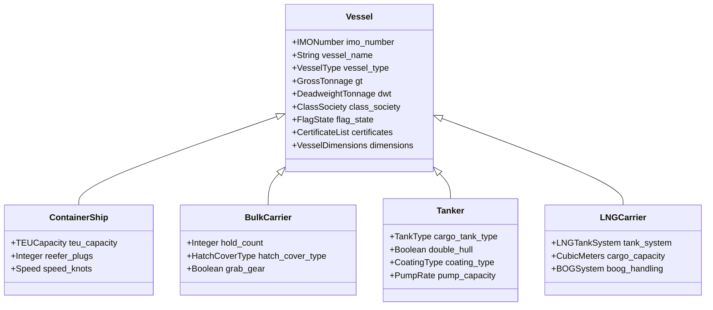
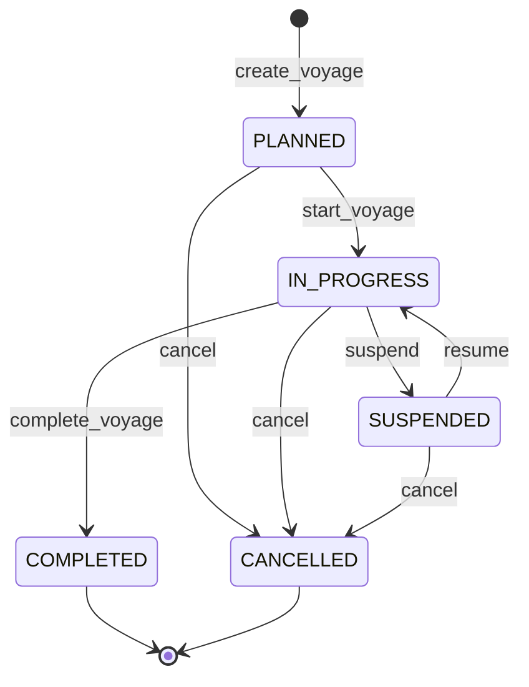
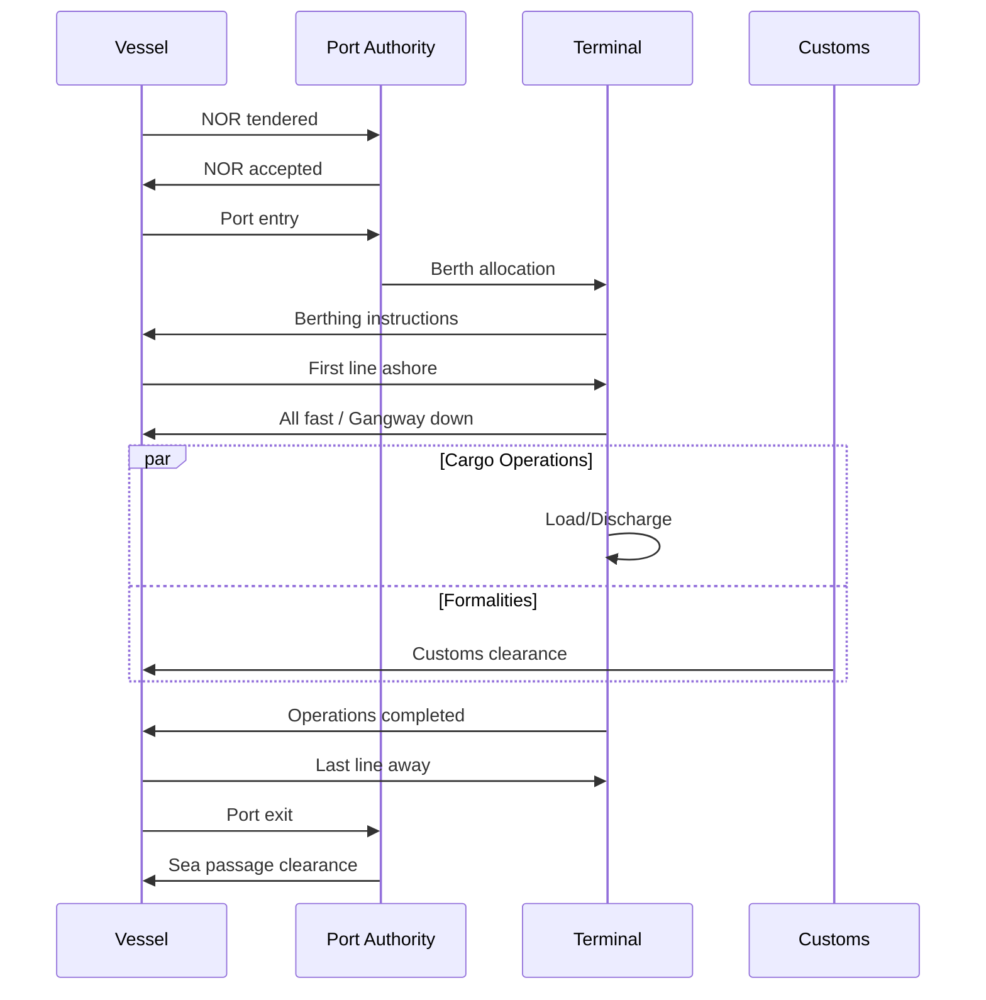
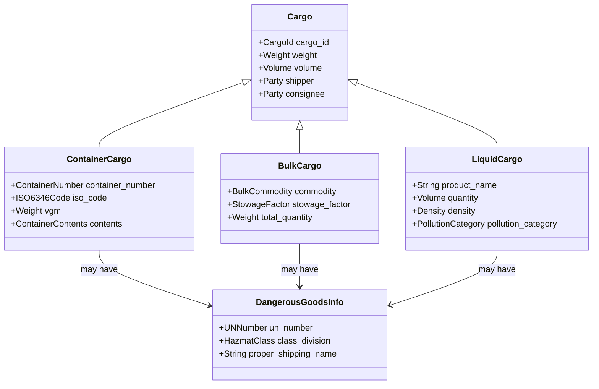
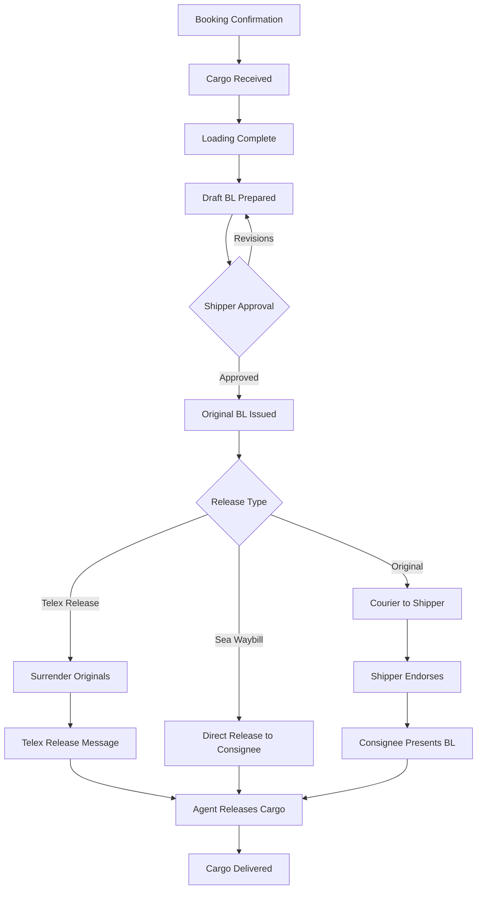

# 海事航运Schema形式语法与语义分析视图

**版本**: v1.0
**创建日期**: 2026-02-15
**标准**: SOLAS 1974, MARPOL 73/78, ISPS Code, ISO 19847/19848

---

## 📑 目录

- [海事航运Schema形式语法与语义分析视图](#海事航运schema形式语法与语义分析视图)
  - [📑 目录](#-目录)
  - [1. 形式文法定义](#1-形式文法定义)
    - [1.1 EBNF文法](#11-ebnf文法)
      - [1.1.1 船舶实体文法 (Vessel)](#111-船舶实体文法-vessel)
      - [1.1.2 航次实体文法 (Voyage)](#112-航次实体文法-voyage)
      - [1.1.3 货物实体文法 (Cargo)](#113-货物实体文法-cargo)
      - [1.1.4 港口挂靠实体文法 (PortCall)](#114-港口挂靠实体文法-portcall)
      - [1.1.5 提单实体文法 (BillOfLading)](#115-提单实体文法-billoflading)
    - [1.2 语法规则](#12-语法规则)
      - [1.2.1 IMO编号校验规则](#121-imo编号校验规则)
      - [1.2.2 航次约束规则](#122-航次约束规则)
      - [1.2.3 货物重量约束规则](#123-货物重量约束规则)
      - [1.2.4 港口挂靠约束规则](#124-港口挂靠约束规则)
  - [2. 形式语义定义](#2-形式语义定义)
    - [2.1 指称语义 (Denotational Semantics)](#21-指称语义-denotational-semantics)
      - [2.1.1 语义域定义](#211-语义域定义)
      - [2.1.2 船舶语义](#212-船舶语义)
      - [2.1.3 航次语义](#213-航次语义)
      - [2.1.4 货物语义](#214-货物语义)
    - [2.2 操作语义 (Operational Semantics)](#22-操作语义-operational-semantics)
      - [2.2.1 大步语义 (Big-Step Semantics)](#221-大步语义-big-step-semantics)
      - [2.2.2 小步语义 (Small-Step Semantics)](#222-小步语义-small-step-semantics)
      - [2.2.3 航次状态机语义](#223-航次状态机语义)
    - [2.3 公理语义 (Axiomatic Semantics)](#23-公理语义-axiomatic-semantics)
      - [2.3.1 Hoare三元组](#231-hoare三元组)
      - [2.3.2 船舶安全规则公理](#232-船舶安全规则公理)
      - [2.3.3 航次规划霍尔三元组](#233-航次规划霍尔三元组)
      - [2.3.4 货物配载约束公理](#234-货物配载约束公理)
      - [2.3.5 提单完整性公理](#235-提单完整性公理)
  - [3. 类型系统](#3-类型系统)
    - [3.1 类型规则](#31-类型规则)
    - [3.2 类型运算规则](#32-类型运算规则)
    - [3.3 子类型关系](#33-子类型关系)
  - [4. 语义等价性](#4-语义等价性)
    - [4.1 船舶标识等价](#41-船舶标识等价)
    - [4.2 航次等价](#42-航次等价)
    - [4.3 货物等价](#43-货物等价)
    - [4.4 提单等价](#44-提单等价)
  - [5. Mermaid可视化](#5-mermaid可视化)
    - [5.1 船舶实体类型层次](#51-船舶实体类型层次)
    - [5.2 航次状态机](#52-航次状态机)
    - [5.3 港口挂靠流程](#53-港口挂靠流程)
    - [5.4 货物类型层次](#54-货物类型层次)
    - [5.5 提单签发流程](#55-提单签发流程)

---

## 1. 形式文法定义

### 1.1 EBNF文法

#### 1.1.1 船舶实体文法 (Vessel)

```ebnf
(* 海事核心实体 - 船舶定义 *)

Vessel ::= ContainerShip | BulkCarrier | Tanker | LNGCarrier | GeneralCargoShip | PassengerShip

ContainerShip ::= '{'
    '"imo_number"' ':' IMONumber ','
    '"vessel_name"' ':' VesselName ','
    '"vessel_type"' ':' '"CONTAINER_SHIP"' ','
    '"teu_capacity"' ':' TEUCapacity ','
    '"gt"' ':' GrossTonnage ','
    '"dwt"' ':' DeadweightTonnage ','
    '"class_society"' ':' ClassSociety ','
    '"build_year"' ':' Year ','
    '"flag_state"' ':' FlagState ','
    '"manager"' ':' Company ','
    '"owner"' ':' Company ','
    '"certificates"' ':' CertificateList ','
    '"dimensions"' ':' VesselDimensions
    ['"reefer_plugs"' ':' Integer]
    ['"speed_knots"' ':' Speed]
'}'

BulkCarrier ::= '{'
    '"imo_number"' ':' IMONumber ','
    '"vessel_name"' ':' VesselName ','
    '"vessel_type"' ':' '"BULK_CARRIER"' ','
    '"hold_count"' ':' Integer ','
    '"gt"' ':' GrossTonnage ','
    '"dwt"' ':' DeadweightTonnage ','
    '"class_society"' ':' ClassSociety ','
    '"build_year"' ':' Year ','
    '"flag_state"' ':' FlagState ','
    '"hatch_cover_type"' ':' HatchCoverType ','
    '"grab_gear"' ':' Boolean ','
    '"certificates"' ':' CertificateList ','
    '"dimensions"' ':' VesselDimensions
    ['"speed_knots"' ':' Speed]
'}'

Tanker ::= '{'
    '"imo_number"' ':' IMONumber ','
    '"vessel_name"' ':' VesselName ','
    '"vessel_type"' ':' '"TANKER"' ','
    '"cargo_tank_type"' ':' TankType ','
    '"gt"' ':' GrossTonnage ','
    '"dwt"' ':' DeadweightTonnage ','
    '"class_society"' ':' ClassSociety ','
    '"build_year"' ':' Year ','
    '"flag_state"' ':' FlagState ','
    '"double_hull"' ':' Boolean ','
    '"coating_type"' ':' CoatingType ','
    '"pump_capacity"' ':' PumpRate ','
    '"certificates"' ':' CertificateList ','
    '"dimensions"' ':' VesselDimensions
    ['"speed_knots"' ':' Speed]
'}'

LNGCarrier ::= '{'
    '"imo_number"' ':' IMONumber ','
    '"vessel_name"' ':' VesselName ','
    '"vessel_type"' ':' '"LNG_CARRIER"' ','
    '"tank_system"' ':' LNGTankSystem ','
    '"cargo_capacity"' ':' CubicMeters ','
    '"gt"' ':' GrossTonnage ','
    '"dwt"' ':' DeadweightTonnage ','
    '"class_society"' ':' ClassSociety ','
    '"build_year"' ':' Year ','
    '"flag_state"' ':' FlagState ','
    '"boog_handling"' ':' BOGSystem ','
    '"certificates"' ':' CertificateList ','
    '"dimensions"' ':' VesselDimensions
    ['"speed_knots"' ':' Speed]
'}'

(* IMO编号格式: 7位数字 + 校验位 *)
IMONumber ::= '[0-9]{7}'

(* 船舶名称: 1-50字符 *)
VesselName ::= String(50)

(* 船级社 *)
ClassSociety ::= 'CCS' | 'LR' | 'DNV' | 'ABS' | 'NK' | 'BV' | 'KR' | 'RINA' | 'RS'

(* 船旗国: ISO 3166-1 alpha-3 *)
FlagState ::= '[A-Z]{3}'

(* 吨位类型 *)
GrossTonnage ::= Integer  (* 总吨 *)
DeadweightTonnage ::= Integer  (* 载重吨 *)
TEUCapacity ::= Integer  (* TEU容量 *)

(* 公司信息 *)
Company ::= '{'
    '"name"' ':' String(100) ','
    '"imo_company_id"' ':' '[0-9]{7}' ','
    '"address"' ':' Address ','
    '"contact"' ':' ContactInfo
'}'

(* 船舶尺寸 *)
VesselDimensions ::= '{'
    '"loa"' ':' Length ','          (* 总长 *)
    '"lbp"' ':' Length ','          (* 垂线间长 *)
    '"breadth"' ':' Length ','      (* 船宽 *)
    '"depth"' ':' Length ','        (* 型深 *)
    '"draft_design"' ':' Length ',' (* 设计吃水 *)
    '"draft_scantling"' ':' Length  (* 结构吃水 *)
'}'

(* 证书列表 *)
CertificateList ::= '[]' | '[' Certificate {',' Certificate}* ']'

Certificate ::= '{'
    '"certificate_type"' ':' CertificateType ','
    '"certificate_number"' ':' String(50) ','
    '"issued_by"' ':' ClassSociety ','
    '"issue_date"' ':' Date ','
    '"expiry_date"' ':' Date ','
    '"survey_type"' ':' SurveyType
'}'

CertificateType ::=
    'SMC' |       (* 安全管理证书 *)
    'DOC' |       (* 符合证明 *)
    'ISSC' |      (* 国际船舶保安证书 *)
    'IOPP' |      (* 国际防止油污染证书 *)
    'IEPC' |      (* 国际防止生活污水污染证书 *)
    'IAPP' |      (* 国际防止空气污染证书 *)
    'MLC' |       (* 海事劳工证书 *)
    'CLCC' |      (* 国际散装运输危险化学品适装证书 *)
    'COFC' |      (* 国际散装运输液化气体适装证书 *)
    'SECC' |      (* 国际海运固体散装货物证书 *)
    'PSCC' |      (* 客船安全证书 *)
    'CSSC'        (* 货船安全证书 *)

SurveyType ::= 'INITIAL' | 'RENEWAL' | 'INTERMEDIATE' | 'ANNUAL' | 'ADDITIONAL'

(* 枚举值 *)
HatchCoverType ::= 'LIFT_ON_OFF' | 'ROLLING' | 'FOLDING' | 'SLIDING'
TankType ::= 'CARGO_TANK' | 'SLOP_TANK' | 'BALLAST_TANK'
CoatingType ::= 'EPOXY' | 'PHENOLIC' | 'ZINC' | 'STAINLESS_STEEL'
LNGTankSystem ::= 'MOSS' | 'GTT_MKIII' | 'GTT_NO96' | 'SPB'
BOGSystem ::= 'RELIQUEFACTION' | 'DUAL_FUEL_ENGINE' | 'GCU'

(* 物理量 *)
Length ::= '[0-9]+(\.[0-9]+)?'  (* 米 *)
Speed ::= '[0-9]+(\.[0-9]+)?'   (* 节 *)
PumpRate ::= '[0-9]+'            (* 立方米/小时 *)
CubicMeters ::= '[0-9]+'         (* 立方米 *)
Year ::= '[0-9]{4}'
```

#### 1.1.2 航次实体文法 (Voyage)

```ebnf
(* 航次定义 - 船舶航行计划与执行 *)

Voyage ::= '{'
    '"voyage_number"' ':' VoyageNumber ','
    '"vessel"' ':' IMONumber ','
    '"service_route"' ':' RouteCode ','
    '"status"' ':' VoyageStatus ','
    '"legs"' ':' LegList ','
    '"cargo_summary"' ':' CargoSummary ','
    '"schedule"' ':' Schedule ','
    '"actual"' ':' ActualTiming
    ['"weather_routing"' ':' WeatherRoute]
    ['"fuel_plan"' ':' FuelPlan]
'}'

(* 航次编号: 公司代码+年份+序号 *)
VoyageNumber ::= '[A-Z]{3}[0-9]{4}[0-9]{4}'

(* 航线代码 *)
RouteCode ::= String(20)

(* 航次状态 *)
VoyageStatus ::= 'PLANNED' | 'IN_PROGRESS' | 'COMPLETED' | 'CANCELLED'

(* 航段列表 *)
LegList ::= '[' Leg {',' Leg}* ']'

Leg ::= '{'
    '"leg_number"' ':' Integer ','
    '"departure_port"' ':' PortCall ','
    '"arrival_port"' ':' PortCall ','
    '"distance_nm"' ':' Distance ','
    '"estimated_sail_days"' ':' Decimal ','
    '"sea_passage"' ':' SeaPassage
'}'

(* 港口挂靠 *)
PortCall ::= '{'
    '"un_locode"' ':' UNLOCODE ','
    '"port_name"' ':' String(100) ','
    '"terminal"' ':' String(50)? ','
    '"eta"' ':' Timestamp ','
    '"etb"' ':' Timestamp ','
    '"etd"' ':' Timestamp ','
    '"ata"' ':' Timestamp? ','
    '"atb"' ':' Timestamp? ','
    '"atd"' ':' Timestamp?
'}'

(* 航线定义 *)
SeaPassage ::= '{'
    '"waypoints"' ':' WaypointList ','
    '"routing_type"' ':' RoutingType ','
    '"eca_zones"' ':' ECAList? ','
    '"piracy_risk_areas"' ':' RiskAreaList?
'}'

WaypointList ::= '[' Waypoint {',' Waypoint}* ']'

Waypoint ::= '{'
    '"sequence"' ':' Integer ','
    '"latitude"' ':' Latitude ','
    '"longitude"' ':' Longitude ','
    '"passage_type"' ':' '"GREAT_CIRCLE"' | '"RHUMB_LINE"'
'}'

(* 坐标类型 *)
Latitude ::= '(-)?([0-8][0-9]|90)(\.[0-9]+)?'
Longitude ::= '(-)?((0?[0-9]{1,2}|1[0-7][0-9])(\.[0-9]+)?|180)'

UNLOCODE ::= '[A-Z]{5}'  (* 联合国地点代码 *)

(* 航线类型 *)
RoutingType ::= 'GREAT_CIRCLE' | 'RHUMB_LINE' | 'COMPOSITE' | 'ECO' | 'WEATHER_ROUTED'

(* 排放控制区 *)
ECAList ::= '[' ECAZone {',' ECAZone}* ']'

ECAZone ::= '{'
    '"zone_name"' ':' String(50) ','
    '"entry_waypoint"' ':' Integer ','
    '"exit_waypoint"' ':' Integer ','
    '"sulfur_limit"' ':' SulfurLimit
'}'

SulfurLimit ::= '0.001' | '0.005'  (* 0.1% or 0.5% *)

(* 货物汇总 *)
CargoSummary ::= '{'
    '"total_volume"' ':' Volume? ','
    '"total_weight"' ':' Weight? ','
    '"total_teus"' ':' TEUCapacity? ','
    '"cargo_types"' ':' CargoTypeList ','
    '"reefer_count"' ':' Integer? ','
    '"hazardous_count"' ':' Integer?
'}'

(* 计划时刻表 *)
Schedule ::= '{'
    '"start_date"' ':' Date ','
    '"end_date"' ':' Date ','
    '"round_trip"' ':' Boolean ','
    '"frequency"' ':' String(10)?  (* weekly/bi-weekly *)
'}'

(* 实际执行时间 *)
ActualTiming ::= '{'
    '"departure_actual"' ':' Timestamp? ','
    '"arrival_actual"' ':' Timestamp? ','
    '"total_distance_sailed"' ':' Distance? ','
    '"average_speed"' ':' Speed? ','
    '"delays"' ':' DelayList?
'}'

DelayList ::= '[' Delay {',' Delay}* ']'

Delay ::= '{'
    '"delay_type"' ':' DelayType ','
    '"delay_hours"' ':' Decimal ','
    '"reason"' ':' String(200)
'}'

DelayType ::= 'PORT_CONGESTION' | 'WEATHER' | 'MECHANICAL' | 'PILOT_DELAY' | 'CUSTOMS' | 'OTHER'

(* 物理量 *)
Distance ::= '[0-9]+(\.[0-9]+)?'  (* 海里 *)
Volume ::= '[0-9]+(\.[0-9]+)?'   (* 立方米 *)
Weight ::= '[0-9]+(\.[0-9]+)?'   (* 吨 *)
CargoTypeList ::= '[' String(50) {',' String(50)}* ']'
```

#### 1.1.3 货物实体文法 (Cargo)

```ebnf
(* 货物定义 - 海运货物类型与属性 *)

Cargo ::= ContainerCargo | BulkCargo | LiquidCargo | GeneralCargo | RoRoCargo

ContainerCargo ::= '{'
    '"cargo_id"' ':' CargoId ','
    '"cargo_type"' ':' '"CONTAINER"' ','
    '"container_number"' ':' ContainerNumber ','
    '"iso_code"' ':' ISO6346Code ','
    '"size_type"' ':' ContainerSize ','
    '"tare_weight"' ':' Weight ','
    '"max_gross_weight"' ':' Weight ','
    '"contents"' ':' ContainerContents ','
    '"shipper"' ':' Party ','
    '"consignee"' ':' Party ','
    '"dangerous_goods"' ':' DangerousGoodsInfo? ','
    '"reefer_settings"' ':' ReeferSettings? ','
    '"seal_number"' ':' String(20)? ','
    '"vgm"' ':' Weight  (*  verified gross mass *)
'}'

(* 集装箱编号: 箱主代码(4) + 箱号(6) + 校验码(1) *)
ContainerNumber ::= '[A-Z]{4}[0-9]{6}[0-9]'

(* ISO 6346代码: 尺寸(2) + 类型(2) *)
ISO6346Code ::= '[0-9]{2}[A-Z]{2}'

ContainerSize ::= '20GP' | '40GP' | '40HQ' | '45HQ' | '20RF' | '40RF' | '20OT' | '40OT' | '20TK' | '40TK'

ContainerContents ::= '{'
    '"description"' ':' String(500) ','
    '"commodity_code"' ':' HSCode? ','
    '"packages"' ':' PackageCount ','
    '"net_weight"' ':' Weight ','
    '"volume"' ':' Volume ','
    '"marks_and_numbers"' ':' String(200)?
'}'

HSCode ::= '[0-9]{6,10}'  (* 协调制度编码 *)

BulkCargo ::= '{'
    '"cargo_id"' ':' CargoId ','
    '"cargo_type"' ':' '"BULK"' ','
    '"commodity"' ':' BulkCommodity ','
    '"stowage_factor"' ':' StowageFactor ','
    '"total_quantity"' ':' Weight ','
    '"shipper"' ':' Party ','
    '"consignee"' ':' Party ','
    '"moisture_content"' ':' Percentage? ','
    '"trimming_required"' ':' Boolean ','
    '"imsbc_code"' ':' String(10)?
'}'

BulkCommodity ::= 'IRON_ORE' | 'COAL' | 'GRAIN' | 'BAUXITE' | 'PHOSPHATE' | 'CEMENT' | 'SULPHUR' | 'WOOD_CHIPS'

StowageFactor ::= '[0-9]+(\.[0-9]+)?'  (* 立方米/吨 *)

LiquidCargo ::= '{'
    '"cargo_id"' ':' CargoId ','
    '"cargo_type"' ':' '"LIQUID"' ','
    '"product_name"' ':' String(100) ','
    '"flash_point"' ':' Temperature? ','
    '"quantity"' ':' Volume ','
    '"density"' ':' Density ','
    '"stowage_tank"' ':' TankNumber ','
    '"shipper"' ':' Party ','
    '"consignee"' ':' Party ','
    '"hazmat_class"' ':' HazmatClass? ','
    '"pollution_category"' ':' PollutionCategory ','
    '"transport_temperature"' ':' Temperature? ','
    '"vapor_pressure"' ':' Pressure?
'}'

PollutionCategory ::= 'X' | 'Y' | 'Z' | 'OS'  (* MARPOL附则II *)

GeneralCargo ::= '{'
    '"cargo_id"' ':' CargoId ','
    '"cargo_type"' ':' '"GENERAL"' ','
    '"description"' ':' String(500) ','
    '"package_type"' ':' PackageType ','
    '"total_packages"' ':' Integer ','
    '"total_weight"' ':' Weight ','
    '"total_volume"' ':' Volume ','
    '"dimensions"' ':' Dimensions? ','
    '"shipper"' ':' Party ','
    '"consignee"' ':' Party ','
    '"marks_and_numbers"' ':' String(200)? ','
    '"heavy_lift"' ':' Boolean ','
    '"hazmat_info"' ':' DangerousGoodsInfo?
'}'

(* 货物标识 *)
CargoId ::= '[A-Z0-9]{20}'

(* 当事人信息 *)
Party ::= '{'
    '"party_type"' ':' '"SHIPPER"' | '"CONSIGNEE"' | '"NOTIFY_PARTY"' | '"FORWARDER"' ','
    '"name"' ':' String(100) ','
    '"address"' ':' Address ','
    '"contact"' ':' ContactInfo? ','
    '"tax_id"' ':' String(50)?
'}'

(* 危险品信息 *)
DangerousGoodsInfo ::= '{'
    '"un_number"' ':' UNNumber ','
    '"proper_shipping_name"' ':' String(100) ','
    '"class_division"' ':' HazmatClass ','
    '"packing_group"' '"I"' | '"II"' | '"III"' ','
    '"subsidiary_risk"' ':' HazmatClass? ','
    '"flash_point"' ':' Temperature? ','
    '"ems_number"' ':' String(10)? ','
    '"mfag_table"' ':' String(10)? ','
    '"segregation_group"' ':' String(50)? ','
    '"limited_quantity"' ':' Boolean ','
    '"marine_pollutant"' ':' Boolean
'}'

UNNumber ::= 'UN[0-9]{4}'
HazmatClass ::= '[1-9](\.[1-4])?'

(* 冷藏设置 *)
ReeferSettings ::= '{'
    '"set_temperature"' ':' Temperature ','
    '"temperature_unit"' '"C"' | '"F"' ','
    '"ventilation"' ':' Percentage? ','
    '"humidity"' ':' Percentage?
'}'

(* 物理量 *)
Temperature ::= '(-)?[0-9]+(\.[0-9]+)?'
Pressure ::= '[0-9]+(\.[0-9]+)?'  (* kPa *)
Density ::= '[0-9]+(\.[0-9]+)?'   (* kg/m³ *)
Percentage ::= '[0-9]{1,3}'
PackageCount ::= '[0-9]+'
PackageType ::= 'CTNS' | 'BGS' | 'DRMS' | 'PLTS' | 'ROLLS' | 'CASES' | 'BALES' | 'OTHER'
TankNumber ::= String(10)
```

#### 1.1.4 港口挂靠实体文法 (PortCall)

```ebnf
(* 港口挂靠定义 - 船舶在港作业全过程 *)

PortCallEvent ::= '{'
    '"port_call_id"' ':' PortCallId ','
    '"voyage"' ':' VoyageNumber ','
    '"vessel"' ':' IMONumber ','
    '"port"' ':' PortInfo ','
    '"arrival"' ':' ArrivalPhase ','
    '"berthing"' ':' BerthingPhase ','
    '"cargo_operations"' ':' CargoOperationList ','
    '"departure"' ':' DeparturePhase ','
    '"services"' ':' ServiceList ','
    '"formalities"' ':' FormalityList
'}'

PortCallId ::= '[A-Z0-9]{20}'

PortInfo ::= '{'
    '"un_locode"' ':' UNLOCODE ','
    '"port_name"' ':' String(100) ','
    '"country"' ':' FlagState ','
    '"port_authority"' ':' String(100) ','
    '"terminal"' ':' TerminalInfo? ','
    '"anchorages"' ':' AnchorageList?
'}'

TerminalInfo ::= '{'
    '"terminal_name"' ':' String(100) ','
    '"terminal_operator"' ':' String(100) ','
    '"berth_name"' ':' String(50) ','
    '"max_draft"' ':' Length ','
    '"max_loa"' ':' Length ','
    '"equipment"' ':' TerminalEquipment
'}'

(* 抵港阶段 *)
ArrivalPhase ::= '{'
    '"pilot_station_eta"' ':' Timestamp ','
    '"pilot_onboard_actual"' ':' Timestamp? ','
    '"pilot_off_actual"' ':' Timestamp? ','
    '"anchorage_arrival"' ':' Timestamp? ','
    '"port_entry_time"' ':' Timestamp? ','
    '"nor_tendered"' ':' Timestamp? ','
    '"nor_accepted"' ':' Timestamp? ','
    '"laytime_commencement"' ':' Timestamp? ','
    '"arrival_draft_fwd"' ':' Length ','
    '"arrival_draft_aft"' ':' Length
'}'

(* 靠泊阶段 *)
BerthingPhase ::= '{'
    '"berth_berthing_time"' ':' Timestamp ','
    '"berth_waiting_time_hours"' ':' Decimal ','
    '"first_line_ashore"' ':' Timestamp? ','
    '"all_fast"' ':' Timestamp? ','
    '"gangway_down"' ':' Timestamp? ','
    '"tugs_used"' ':' TugList ','
    '"mooring_configuration"' ':' String(100)?
'}'

TugList ::= '[' TugOperation {',' TugOperation}* ']'

TugOperation ::= '{'
    '"tug_name"' ':' String(50) ','
    '"operation_type"' ':' '"BOW"' | '"STERN"' | '"PORT"' | '"STARBOARD"' ','
    '"line_on"' ':' Timestamp? ','
    '"line_off"' ':' Timestamp?
'}'

(* 货物作业 *)
CargoOperationList ::= '[' CargoOperation {',' CargoOperation}* ']'

CargoOperation ::= ContainerOperation | BulkOperation | LiquidOperation | GeneralOperation

ContainerOperation ::= '{'
    '"operation_type"' ':' '"CONTAINER"' ','
    '"move_count"' ':' Integer ','
    '"discharged"' ':' ContainerMoveList ','
    '"loaded"' ':' ContainerMoveList ','
    '"shifted"' ':' ContainerMoveList? ','
    '"crane_productivity"' ':' MovesPerHour ','
    '"berth_productivity"' ':' MovesPerHour
'}'

ContainerMoveList ::= '[' ContainerMove {',' ContainerMove}* ']'

ContainerMove ::= '{'
    '"container_number"' ':' ContainerNumber ','
    '"iso_code"' ':' ISO6346Code ','
    '"operation"' '"DISCHARGE"' | '"LOAD"' | '"SHIFT"' ','
    '"from_position"' ':' StowagePosition? ','
    '"to_position"' ':' StowagePosition? ','
    '"timestamp"' ':' Timestamp? ','
    '"crane_id"' ':' String(20)?
'}'

StowagePosition ::= '{'
    '"bay"' ':' Integer ','
    '"row"' ':' Integer ','
    '"tier"' ':' Integer ','
    '"hold_or_deck"' '"HOLD"' | '"DECK"'
'}'

MovesPerHour ::= '[0-9]+(\.[0-9]+)?'

BulkOperation ::= '{'
    '"operation_type"' ':' '"BULK"' ','
    '"commodity"' ':' BulkCommodity ','
    '"cargo_id"' ':' CargoId ','
    '"quantity_loaded"' ':' Weight? ','
    '"quantity_discharged"' ':' Weight? ','
    '"loading_rate"' ':' LoadingRate? ','
    '"discharge_rate"' ':' LoadingRate? ','
    '"trimming_method"' ':' String(50)?
'}'

LoadingRate ::= '[0-9]+'  (* 吨/小时 *)

LiquidOperation ::= '{'
    '"operation_type"' ':' '"LIQUID"' ','
    '"cargo_id"' ':' CargoId ','
    '"product_name"' ':' String(100) ','
    '"quantity_loaded"' ':' Volume? ','
    '"quantity_discharged"' ':' Volume? ','
    '"pumping_rate"' ':' PumpRate ','
    '"prewash_required"' ':' Boolean
'}'

(* 离港阶段 *)
DeparturePhase ::= '{'
    '"cargo_operations_completed"' ':' Timestamp ','
    '"gangway_up"' ':' Timestamp? ','
    '"last_line_away"' ':' Timestamp ','
    '"pilot_onboard_departure"' ':' Timestamp? ','
    '"pilot_off_departure"' ':' Timestamp? ','
    '"port_exit_time"' ':' Timestamp? ','
    '"sea_passage_commenced"' ':' Timestamp ','
    '"departure_draft_fwd"' ':' Length ','
    '"departure_draft_aft"' ':' Length
'}'

(* 港口服务 *)
ServiceList ::= '[' PortService {',' PortService}* ']'

PortService ::= '{'
    '"service_type"' ':' ServiceType ','
    '"provider"' ':' String(100) ','
    '"start_time"' ':' Timestamp? ','
    '"end_time"' ':' Timestamp? ','
    '"quantity"' ':' Decimal? ','
    '"unit"' ':' String(10)?
'}'

ServiceType ::= 'BUNKERING' | 'FRESH_WATER' | 'PROVISIONS' | 'SPARES' | 'REPAIRS' | 'SURVEY' | 'GARBAGE' | 'SLUDGE'

(* 手续办理 *)
FormalityList ::= '[' Formality {',' Formality}* ']'

Formality ::= '{'
    '"formality_type"' ':' FormalityType ','
    '"authority"' ':' String(100) ','
    '"submitted"' ':' Timestamp? ','
    '"cleared"' ':' Timestamp? ','
    '"documents"' ':' DocumentList
'}'

FormalityType ::= 'CUSTOMS' | 'IMMIGRATION' | 'HEALTH' | 'PORT_AUTHORITY' | 'PSC' | 'ISPS'

DocumentList ::= '[' Document {',' Document}* ']'

Document ::= '{'
    '"document_type"' ':' String(50) ','
    '"document_number"' ':' String(50)? ','
    '"issue_date"' ':' Date? ','
    '"expiry_date"' ':' Date?
'}'
```

#### 1.1.5 提单实体文法 (BillOfLading)

```ebnf
(* 提单定义 - 海上货物运输合同证明 *)

BillOfLading ::= '{'
    '"bl_number"' ':' BLNumber ','
    '"bl_type"' ':' BLType ','
    '"bl_status"' ':' BLStatus ','
    '"carrier"' ':' Carrier ','
    '"shipper"' ':' Party ','
    '"consignee"' ':' Consignee ','
    '"notify_party"' ':' Party? ','
    '"vessel"' ':' VesselInfo ','
    '"port_of_loading"' ':' PortInfo ','
    '"port_of_discharge"' ':' PortInfo ','
    '"place_of_receipt"' ':' Location? ','
    '"place_of_delivery"' ':' Location? ','
    '"cargo_description"' ':' CargoDescription ','
    '"freight_details"' ':' FreightDetails ','
    '"issue_details"' ':' BLIssue ','
    '"signature"' ':' SignatureInfo ','
    '"original_count"' ':' Integer ','
    '"terms_and_conditions"' ':' String(100)?
'}'

(* 提单编号 *)
BLNumber ::= '[A-Z0-9]{20}'

(* 提单类型 *)
BLType ::= 'ORIGINAL' | 'SEA_WAYBILL' | 'SWITCH' | 'SURRENDERED' | 'TELEX_RELEASE'

(* 提单状态 *)
BLStatus ::= 'ISSUED' | 'ENDORSED' | 'SURRENDERED' | 'RELEASED' | 'CANCELLED'

(* 承运人 *)
Carrier ::= '{'
    '"name"' ':' String(100) ','
    '"address"' ':' Address ','
    '"contact"' ':' ContactInfo? ','
    '"scac_code"' ':' String(4)?  (* Standard Carrier Alpha Code *)
'}'

(* 收货人 *)
Consignee ::= '{'
    '"consignee_type"' '"TO_ORDER"' | '"TO_ORDER_OF"' | '"NAMED"' ','
    '"name"' ':' String(100)? ','
    '"address"' ':' Address? ','
    '"endorsement"' ':' EndorsementInfo?
'}'

EndorsementInfo ::= '{'
    '"endorsed_to"' ':' String(100) ','
    '"endorsement_date"' ':' Date ','
    '"signature"' ':' String(100)
'}'

(* 船舶信息 - 提单 *)
VesselInfo ::= '{'
    '"vessel_name"' ':' VesselName ','
    '"voyage_number"' ':' VoyageNumber ','
    '"imo_number"' ':' IMONumber ','
    '"pre_carriage_by"' ':' String(100)? ','
    '"onward_carriage_by"' ':' String(100)?
'}'

(* 货物描述 *)
CargoDescription ::= ContainerBLCargo | BulkBLCargo | GeneralBLCargo

ContainerBLCargo ::= '{'
    '"cargo_type"' ':' '"CONTAINER"' ','
    '"containers"' ':' ContainerList ','
    '"total_packages"' ':' Integer ','
    '"package_description"' ':' String(200) ','
    '"gross_weight"' ':' Weight ','
    '"measurement"' ':' Volume ','
    '"description_of_goods"' ':' String(500) ','
    '"marks_and_numbers"' ':' String(200)?
'}'

ContainerList ::= '[' ContainerBLEntry {',' ContainerBLEntry}* ']'

ContainerBLEntry ::= '{'
    '"container_number"' ':' ContainerNumber ','
    '"iso_code"' ':' ISO6346Code ','
    '"seal_number"' ':' String(20)? ','
    '"package_count"' ':' Integer ','
    '"gross_weight"' ':' Weight ','
    '"measurement"' ':' Volume ','
    '"cargo_description"' ':' String(500)? ','
    '"dangerous_goods"' ':' DangerousGoodsShortInfo?
'}'

DangerousGoodsShortInfo ::= '{'
    '"un_number"' ':' UNNumber ','
    '"class_division"' ':' HazmatClass ','
    '"proper_shipping_name"' ':' String(100)
'}'

BulkBLCargo ::= '{'
    '"cargo_type"' ':' '"BULK"' ','
    '"commodity_description"' ':' String(200) ','
    '"quantity"' ':' Weight ','
    '"stowage_factor"' ':' StowageFactor? ','
    '"description_of_goods"' ':' String(500)
'}'

GeneralBLCargo ::= '{'
    '"cargo_type"' ':' '"GENERAL"' ','
    '"total_packages"' ':' Integer ','
    '"package_type"' ':' String(50) ','
    '"description_of_goods"' ':' String(500) ','
    '"gross_weight"' ':' Weight ','
    '"measurement"' ':' Volume ','
    '"marks_and_numbers"' ':' String(200)?
'}'

(* 运费详情 *)
FreightDetails ::= '{'
    '"freight_terms"' ':' FreightTerms ','
    '"freight_amount"' ':' MonetaryAmount? ','
    '"currency"' ':' CurrencyCode ','
    '"payable_at"' ':' Location? ','
    '"freight_remarks"' ':' String(200)?
'}'

FreightTerms ::= 'PREPAID' | 'COLLECT' | 'THIRD_PARTY'

(* 提单签发 *)
BLIssue ::= '{'
    '"place_of_issue"' ':' Location ','
    '"date_of_issue"' ':' Date ','
    '"signed_by"' ':' String(100) ','
    '"as_agent_for"' ':' String(100)? ','
    '"on_board_date"' ':' Date?
'}'

(* 签名信息 *)
SignatureInfo ::= '{'
    '"signature_type"' '"DIGITAL"' | '"ELECTRONIC"' | '"PHYSICAL"' ','
    '"signature_value"' ':' String(500)? ','
    '"certificate_id"' ':' String(100)? ','
    '"timestamp"' ':' Timestamp?
'}'

(* 地点信息 *)
Location ::= '{'
    '"location_name"' ':' String(100) ','
    '"un_locode"' ':' UNLOCODE? ','
    '"country"' ':' FlagState?
'}'

(* 地址信息 *)
Address ::= '{'
    '"street"' ':' String(200) ','
    '"city"' ':' String(50) ','
    '"postal_code"' ':' String(20)? ','
    '"state_province"' ':' String(50)? ','
    '"country"' ':' FlagState
'}'

(* 联系信息 *)
ContactInfo ::= '{'
    '"phone"' ':' String(20)? ','
    '"fax"' ':' String(20)? ','
    '"email"' ':' String(100)? ','
    '"contact_person"' ':' String(50)?
'}'

(* 通用格式 *)
CurrencyCode ::= '[A-Z]{3}'  (* ISO 4217 *)
MonetaryAmount ::= '[0-9]+(\.[0-9]{2})?'
Date ::= '[0-9]{4}-[0-9]{2}-[0-9]{2}'
Timestamp ::= ISO8601DateTime
Integer ::= '[0-9]+'
Decimal ::= '[0-9]+(\.[0-9]+)?'
Boolean ::= 'true' | 'false'
String(n) ::= '"' {.}* '"'  (* max length n *)
```

### 1.2 语法规则

#### 1.2.1 IMO编号校验规则

```
约束1: IMO编号格式有效性
  ∀v ∈ Vessel :
    imo_number(v) ∈ [0-9]{7} ∧
    check_digit(imo_number(v)) = true

约束2: IMO校验位算法
  check_digit(imo) =
    let digits = [d1, d2, d3, d4, d5, d6, d7] where imo = d1d2d3d4d5d6d7 in
    let weights = [7, 6, 5, 4, 3, 2] in
    let sum = Σ(i=1..6) di × weights[i] in
    d7 = sum mod 10

约束3: 船级社一致性
  ∀v ∈ Vessel :
    class_society(v) ∈ {CCS, LR, DNV, ABS, NK, BV, KR, RINA, RS}

约束4: 船旗国有效性
  ∀v ∈ Vessel :
    flag_state(v) ∈ ISO_3166_1_Alpha_3
```

#### 1.2.2 航次约束规则

```
约束5: 航次顺序一致性
  ∀voy ∈ Voyage :
    ∀i ∈ [1, |legs(voy)|-1] :
      arrival_port(legs(voy)[i]) = departure_port(legs(voy)[i+1])

约束6: 时间顺序约束
  ∀pc ∈ PortCall :
    if ata(pc) ≠ ⊥ then ata(pc) ≤ atb(pc) ≤ atd(pc)
    if eta(pc) ≠ ⊥ then eta(pc) ≤ etb(pc) ≤ etd(pc)

约束7: 坐标有效性
  ∀wp ∈ Waypoint :
    -90 ≤ latitude(wp) ≤ 90 ∧
    -180 ≤ longitude(wp) ≤ 180

约束8: 航程距离正性
  ∀leg ∈ Leg :
    distance_nm(leg) > 0
```

#### 1.2.3 货物重量约束规则

```
约束9: 集装箱VGM规则
  ∀c ∈ ContainerCargo :
    vgm(c) ≥ tare_weight(c) + net_weight(contents(c))

约束10: 载重吨约束
  ∀v ∈ Vessel, ∀voy ∈ Voyage :
    vessel(voy) = imo_number(v) ⇒
    total_cargo_weight(voy) ≤ dwt(v)

约束11: 危险品一致性
  ∀c ∈ Cargo :
    if dangerous_goods(c) ≠ ⊥ then
      hazmat_class(c) ∈ IMDG_Class_List ∧
      un_number(c) ∈ UN_Number_Registry
```

#### 1.2.4 港口挂靠约束规则

```
约束12: 港口挂靠时间序列
  ∀pc ∈ PortCallEvent :
    pilot_onboard_actual(arrival(pc)) ≤ port_entry_time(arrival(pc)) ≤
    berth_berthing_time(berthing(pc)) ≤
    cargo_operations_completed(departure(pc)) ≤
    sea_passage_commenced(departure(pc))

约束13: 装卸作业完整性
  ∀co ∈ CargoOperation :
    if operation_type(co) = "CONTAINER" then
      |discharged(co)| + |loaded(co)| + |shifted(co)| = move_count(co)

约束14: 提单货物一致性
  ∀bl ∈ BillOfLading :
    gross_weight(cargo_description(bl)) =
      Σ(c ∈ containers(cargo_description(bl))) gross_weight(c)
```

---

## 2. 形式语义定义

### 2.1 指称语义 (Denotational Semantics)

#### 2.1.1 语义域定义

```
D[MaritimeSystem] : Environment → State → State

State = VesselState × VoyageState × CargoState × PortCallState × BLState

VesselState = IMONumber → VesselValue
VesselValue = {
  vessel_name: String,
  vessel_type: VesselType,
  gt: GrossTonnage,
  dwt: DeadweightTonnage,
  class_society: ClassSociety,
  flag_state: FlagState,
  certificates: CertificateList,
  dimensions: VesselDimensions,
  ...
}

VoyageState = VoyageNumber → VoyageValue
VoyageValue = {
  vessel: IMONumber,
  status: VoyageStatus,
  legs: LegList,
  schedule: Schedule,
  actual: ActualTiming,
  ...
}

CargoState = CargoId → CargoValue
CargoValue = {
  cargo_type: CargoType,
  weight: Weight,
  volume: Volume,
  shipper: Party,
  consignee: Party,
  ...
}

PortCallState = PortCallId → PortCallValue
PortCallValue = {
  voyage: VoyageNumber,
  port: PortInfo,
  arrival: ArrivalPhase,
  berthing: BerthingPhase,
  cargo_operations: CargoOperationList,
  departure: DeparturePhase,
  ...
}

BLState = BLNumber → BLValue
BLValue = {
  bl_type: BLType,
  carrier: Carrier,
  shipper: Party,
  consignee: Consignee,
  cargo_description: CargoDescription,
  freight_details: FreightDetails,
  ...
}

(* 辅助类型 *)
Weight = ℝ⁺  (* 吨, 非负 *)
Volume = ℝ⁺  (* 立方米, 非负 *)
Distance = ℝ⁺  (* 海里, 非负 *)
Timestamp = ℕ  (* Unix时间戳 *)
```

#### 2.1.2 船舶语义

```
(* 船舶查询语义 *)
E[vessel.dwt] env sto =
  let v = lookup_vessel(sto, env.imo_number) in
  v.dwt

(* 证书有效性检查 *)
E[validate_certificates(vessel)] env sto =
  let v = lookup_vessel(sto, env.imo_number) in
  ∀cert ∈ v.certificates :
    expiry_date(cert) ≥ current_date() ∧
    issued_by(cert) ∈ Valid_Class_Societies

(* 船舶状态转换 *)
S[vessel.flag_state := new_flag] env sto =
  let v = lookup_vessel(sto, env.imo_number) in
  if valid_flag_change(v.flag_state, new_flag)
  then sto[vessel ↦ v[flag_state ↦ new_flag]]
  else error "Invalid flag state change"
```

#### 2.1.3 航次语义

```
(* 航次距离计算 *)
E[voyage.total_distance] env sto =
  let voy = lookup_voyage(sto, env.voyage_number) in
  Σ(leg ∈ legs(voy)) distance_nm(leg)

(* 航次执行语义 *)
S[execute_voyage(voy)] env sto =
  let v = lookup_vessel(sto, vessel(voy)) in
  let cargo_total = Σ(c ∈ cargo(voy)) weight(c) in

  if cargo_total > v.dwt
  then error "Cargo weight exceeds vessel DWT"
  else if ¬all_certificates_valid(v)
  then error "Vessel certificates not valid"
  else if ¬valid_schedule(voy)
  then error "Invalid voyage schedule"
  else
    let sto' = sto[voyage ↦ voy[status ↦ IN_PROGRESS]] in
    sto'

(* 港口挂靠完成 *)
S[complete_portcall(pc)] env sto =
  let pc_rec = lookup_portcall(sto, env.port_call_id) in
  if all_operations_complete(pc_rec)
  then sto[portcall ↦ pc_rec[departure.atd ↦ now()]]
  else error "Operations not complete"
```

#### 2.1.4 货物语义

```
(* 货物重量计算 *)
E[cargo.total_weight] env sto =
  let c = lookup_cargo(sto, env.cargo_id) in
  if cargo_type(c) = "CONTAINER"
  then Σ(cont ∈ containers(c)) vgm(cont)
  else weight(c)

(* 危险品检查语义 *)
E[check_hazmat(cargo)] env sto =
  let c = lookup_cargo(sto, env.cargo_id) in
  if dangerous_goods(c) ≠ ⊥
  then validate_imdg_compliance(c) ∧
       check_segregation(c, other_cargo)
  else true

(* 货物装载语义 *)
S[load_cargo(voy, cargo)] env sto =
  let voy_rec = lookup_voyage(sto, voy) in
  let c = lookup_cargo(sto, cargo) in
  let current_load = Σ(cg ∈ cargo(voy_rec)) weight(cg) in
  let v = lookup_vessel(sto, vessel(voy_rec)) in

  if current_load + weight(c) ≤ v.dwt
  then sto[voyage ↦ voy_rec[cargo ↦ cargo(voy_rec) ∪ {c}]]
  else error "Cargo exceeds vessel capacity"
```

### 2.2 操作语义 (Operational Semantics)

#### 2.2.1 大步语义 (Big-Step Semantics)

```
配置: ⟨Expression, State⟩ ⇓ Value
      ⟨Statement, State⟩ ⇓ State'

(* 船舶载重吨查询 *)
⟨v.dwt, σ⟩ ⇓ σ(v).dwt                          (E-VesselDWT)

(* 航次总距离计算 *)
⟨voy.total_distance, σ⟩ ⇓ Σ(leg ∈ σ(voy).legs) distance(leg)  (E-VoyageDistance)

(* 证书有效性检查 *)
⟨validate_certs(v), σ⟩ ⇓ true                   (E-CertsValid)
  where ∀cert ∈ σ(v).certificates : expiry(cert) ≥ today

⟨validate_certs(v), σ⟩ ⇓ false                  (E-CertsInvalid)
  where ∃cert ∈ σ(v).certificates : expiry(cert) < today

(* 航次状态转换 *)
⟨start_voyage(voy), σ⟩ ⇓ σ[voy.status ↦ IN_PROGRESS]  (S-StartVoyage)
  where σ(voy).status = PLANNED ∧ validate_voyage(σ(voy))

⟨complete_voyage(voy), σ⟩ ⇓ σ[voy.status ↦ COMPLETED] (S-CompleteVoyage)
  where σ(voy).status = IN_PROGRESS ∧ all_portcalls_complete(σ(voy))

(* 港口挂靠状态转换 *)
⟨arrive_portcall(pc), σ⟩ ⇓ σ[pc.arrival.ata ↦ now()]  (S-ArrivePC)
  where σ(pc).arrival.eta ≤ now()

⟨berth_portcall(pc), σ⟩ ⇓ σ[pc.berthing.first_line ↦ now()]  (S-BerthPC)
  where σ(pc).arrival.ata ≠ ⊥

⟨depart_portcall(pc), σ⟩ ⇓ σ[pc.departure.atd ↦ now()]  (S-DepartPC)
  where operations_complete(σ(pc))

(* 货物装载 *)
⟨load(voy, c), σ⟩ ⇓ σ[voy.cargo ↦ σ(voy).cargo ∪ {c}]  (S-LoadCargo)
  where total_weight(σ(voy)) + weight(c) ≤ σ(vessel(σ(voy))).dwt

⟨load(voy, c), σ⟩ ⇓ error                           (S-LoadCargoFail)
  where total_weight(σ(voy)) + weight(c) > σ(vessel(σ(voy))).dwt
```

#### 2.2.2 小步语义 (Small-Step Semantics)

```
配置: ⟨Statement, State⟩ → ⟨Statement', State'⟩
      或 ⟨Statement, State⟩ → State'  (终止)

(* 航次执行步骤 *)
⟨execute_voyage(voy), σ⟩ → ⟨start_voyage(voy) ; process_legs(voy) ; complete_voyage(voy), σ⟩  (S-VoyageStart)

⟨start_voyage(voy), σ⟩ → σ[voy.status ↦ IN_PROGRESS]     (S-VoyageStarted)
  where validate_voyage(σ(voy))

⟨process_legs(voy), σ⟩ → ⟨process(leg₁) ; process(leg₂) ; ... ; process(legₙ), σ⟩  (S-ProcessLegs)

(* 港口挂靠步骤 *)
⟨process(pc), σ⟩ → ⟨arrive(pc) ; berth(pc) ; cargo_ops(pc) ; depart(pc), σ⟩  (S-ProcessPC)

⟨arrive(pc), σ⟩ → σ[pc.arrival.ata ↦ now()]               (S-Arrive)
  where σ(pc).arrival.eta ≤ now()

⟨berth(pc), σ⟩ → σ[pc.berthing.first_line ↦ now()]        (S-Berth)
  where σ(pc).arrival.ata ≠ ⊥

⟨cargo_ops(pc), σ⟩ → σ                                    (S-CargoOpsComplete)
  where operations_complete(σ(pc))

⟨depart(pc), σ⟩ → σ[pc.departure.atd ↦ now()]             (S-Depart)

(* 顺序执行 *)
⟨skip ; s, σ⟩ → ⟨s, σ⟩                                    (S-Seq-Skip)

⟨s1 ; s2, σ⟩ → ⟨s1' ; s2, σ'⟩                             (S-Seq-Step)
  when ⟨s1, σ⟩ → ⟨s1', σ'⟩

⟨s1 ; s2, σ⟩ → ⟨s2, σ'⟩                                   (S-Seq-Done)
  when ⟨s1, σ⟩ → σ'
```

#### 2.2.3 航次状态机语义

```
(* 航次状态转移规则 *)

⟨voy.status, σ⟩ → ⟨PLANNED, σ⟩                            (Voy-Init)

⟨start(voy), σ⟩ → ⟨IN_PROGRESS, σ[voy.started_at ↦ now()]⟩ (Voy-Start)
  when validate_voyage(σ(voy))

⟨suspend(voy), σ⟩ → ⟨SUSPENDED, σ[voy.suspended_at ↦ now()]⟩ (Voy-Suspend)
  when σ(voy).status = IN_PROGRESS

⟨resume(voy), σ⟩ → ⟨IN_PROGRESS, σ[voy.resumed_at ↦ now()]⟩ (Voy-Resume)
  when σ(voy).status = SUSPENDED

⟨complete(voy), σ⟩ → ⟨COMPLETED, σ[voy.completed_at ↦ now()]⟩ (Voy-Complete)
  when all_portcalls_complete(σ(voy))

⟨cancel(voy), σ⟩ → ⟨CANCELLED, σ[voy.cancelled_at ↦ now()]⟩ (Voy-Cancel)
  when σ(voy).status ∈ {PLANNED, IN_PROGRESS, SUSPENDED}
```

### 2.3 公理语义 (Axiomatic Semantics)

#### 2.3.1 Hoare三元组

```
{P} S {Q}

含义: 如果前置条件P在执行语句S前成立，
      且S终止，
      则后置条件Q在S执行后成立。
```

#### 2.3.2 船舶安全规则公理

```
(* 船舶载重能力不变式 *)
{∀v: dwt(v) = D ∧ certificates_valid(v)}
  any_readonly_operation(v)
{∀v: dwt(v) = D ∧ certificates_valid(v)}

(* 航次载重公理 *)
{total_cargo(voy) = C ∧ C + W ≤ dwt(vessel(voy))}
  load(voy, cargo)
{total_cargo(voy) = C + W}
  (Axiom-LoadCargo)

(* 航次卸载公理 *)
{total_cargo(voy) = C ∧ C ≥ W}
  unload(voy, cargo)
{total_cargo(voy) = C - W}
  (Axiom-UnloadCargo)

(* 证书更新公理 *)
{vessel(v).certificates = Certs}
  renew_certificate(v, cert_type)
{vessel(v).certificates = Certs[cert_type ↦ new_cert]}
  (Axiom-RenewCert)

(* 船旗变更公理 *)
{vessel(v).flag = F_old ∧ valid_flag_change(F_old, F_new)}
  change_flag(v, F_new)
{vessel(v).flag = F_new}
  (Axiom-ChangeFlag)
```

#### 2.3.3 航次规划霍尔三元组

```
(* 航次开始公理 *)
{voy.status = PLANNED ∧ validate_vessel(vessel(voy)) ∧
 validate_schedule(voy) ∧ certificates_valid(vessel(voy))}
  start_voyage(voy)
{voy.status = IN_PROGRESS}
  (Axiom-StartVoyage)

(* 航次完成公理 *)
{voy.status = IN_PROGRESS ∧ all_portcalls_complete(voy)}
  complete_voyage(voy)
{voy.status = COMPLETED}
  (Axiom-CompleteVoyage)

(* 港口挂靠开始公理 *)
{pc.status = SCHEDULED ∧ voy.status = IN_PROGRESS ∧
 vessel(voy) at port(pc)}
  start_portcall(pc)
{pc.status = AT_ANCHORAGE}
  (Axiom-StartPortcall)

(* 靠泊作业公理 *)
{pc.status = AT_ANCHORAGE ∧ berth_available(port(pc))}
  berth_vessel(pc)
{pc.status = AT_BERTH}
  (Axiom-BerthVessel)

(* 离港公理 *)
{pc.status = AT_BERTH ∧ cargo_ops_complete(pc) ∧
 formalities_complete(pc)}
  depart_portcall(pc)
{pc.status = DEPARTED}
  (Axiom-DepartPortcall)

(* 航次连续性 *)
{leg_i.arrival_port = P ∧ leg_{i+1}.departure_port = P'}
  validate_voyage_sequence(voy)
{P = P'}
  (Axiom-VoyageContinuity)
```

#### 2.3.4 货物配载约束公理

```
(* 载重能力约束 *)
{Σc ∈ cargo(voy) weight(c) ≤ dwt(vessel(voy))}
  any_cargo_operation(voy)
{Σc ∈ cargo(voy) weight(c) ≤ dwt(vessel(voy))}
  (Axiom-DWTConstraint)

(* 危险品隔离公理 *)
{hazmat_class(c1) incompatible_with hazmat_class(c2)}
  load(voy, c2)
{segregation_distance(c1, c2) ≥ required_distance}
  (Axiom-HazmatSegregation)

(* 冷藏集装箱电力约束 *)
{reefer_containers(voy) = R ∧ reefer_plugs(vessel(voy)) = P}
  load(voy, new_reefer)
{|R| + 1 ≤ P}
  (Axiom-ReeferPower)

(* 集装箱VGM验证公理 *)
{vgm(c) measured ∧ vgm(c) ≥ tare_weight(c) + net_weight(c)}
  accept_container(c)
{container_accepted(c) = true}
  (Axiom-VGMVerified)
```

#### 2.3.5 提单完整性公理

```
(* 提单签发公理 *)
{bl.status = DRAFT ∧ cargo_loaded(bl) ∧
 freight_terms_defined(bl) ∧ signatures_complete(bl)}
  issue_bl(bl)
{bl.status = ISSUED ∧ bl.issue_date = today}
  (Axiom-IssueBL)

(* 提单背书公理 *)
{bl.status = ISSUED ∧ bl.consignee.type = TO_ORDER}
  endorse_bl(bl, new_holder)
{bl.endorsement = new_holder ∧ bl.endorsement_date = today}
  (Axiom-EndorseBL)

(* 电放公理 *)
{bl.status = ISSUED ∧ surrender_requested(bl)}
  telex_release(bl)
{bl.status = TELEX_RELEASED ∧ originals_surrendered(bl)}
  (Axiom-TelexRelease)

(* 提单货物一致性公理 *)
{bl.cargo_description matches actual_loaded_cargo(bl.voyage)}
  issue_bl(bl)
{bl_accurate(bl) = true}
  (Axiom-BLCargoAccuracy)
```

---

## 3. 类型系统

### 3.1 类型规则

```
(* 基础类型 *)
Γ ⊢ n : Weight        if n ∈ ℝ⁺ ∧ n ≥ 0          (T-Weight)

Γ ⊢ n : Volume        if n ∈ ℝ⁺ ∧ n ≥ 0          (T-Volume)

Γ ⊢ n : Distance      if n ∈ ℝ⁺ ∧ n ≥ 0          (T-Distance)

Γ ⊢ t : Timestamp     if t ≥ 0                     (T-Timestamp)

Γ ⊢ imo : IMONumber   if imo ∈ [0-9]{7} ∧
                        check_digit(imo) = true    (T-IMONumber)

Γ ⊢ cn : ContainerNumber if cn ∈ [A-Z]{4}[0-9]{6}[0-9] ∧
                             iso6346_check(cn) = true (T-ContainerNumber)

(* 船舶类型 *)
Γ ⊢ v : ContainerShip  if v.vessel_type = "CONTAINER_SHIP" ∧
                         v.teu_capacity > 0        (T-ContainerShip)

Γ ⊢ v : Tanker         if v.vessel_type = "TANKER" ∧
                         v.double_hull ∈ Boolean    (T-Tanker)

Γ ⊢ v : LNGCarrier     if v.vessel_type = "LNG_CARRIER" ∧
                         v.tank_system ∈ {MOSS, GTT_MKIII, GTT_NO96, SPB}
                                                    (T-LNGCarrier)

(* 航次类型 *)
Γ ⊢ voy : Voyage       if voy.voyage_number ∈ [A-Z]{3}[0-9]{4}[0-9]{4} ∧
                         valid_legs(voy.legs)      (T-Voyage)

(* 货物类型 *)
Γ ⊢ c : ContainerCargo if c.cargo_type = "CONTAINER" ∧
                         c.vgm > 0                  (T-ContainerCargo)

Γ ⊢ c : DangerousCargo if c.dangerous_goods ≠ ⊥ ∧
                         c.dangerous_goods.un_number ∈ UN_Registry
                                                    (T-DangerousCargo)

(* 港口挂靠类型 *)
Γ ⊢ pc : PortCall      if pc.port_call_id ∈ [A-Z0-9]{20} ∧
                         time_sequence_valid(pc)    (T-PortCall)

(* 提单类型 *)
Γ ⊢ bl : BillOfLading  if bl.bl_number ∈ [A-Z0-9]{20} ∧
                         bl.original_count > 0      (T-BillOfLading)
```

### 3.2 类型运算规则

```
(* 重量运算 *)
Γ ⊢ w1 : Weight  Γ ⊢ w2 : Weight                    (T-WeightAdd)
────────────────────────────────────────
Γ ⊢ w1 + w2 : Weight

(* 距离与速度运算 *)
Γ ⊢ d : Distance  Γ ⊢ s : Speed  s > 0              (T-SailTime)
────────────────────────────────────────
Γ ⊢ d / s : Time  (航行时间, 小时)

(* 坐标类型 *)
Γ ⊢ lat : Latitude  Γ ⊢ lon : Longitude             (T-Coordinate)
────────────────────────────────────────
Γ ⊢ (lat, lon) : Coordinate

(* 航段验证 *)
Γ ⊢ leg : Leg  Γ ⊢ leg.distance > 0                 (T-ValidLeg)
────────────────────────────────────────
Γ ⊢ validate(leg) : Boolean

(* 港口挂靠序列 *)
Γ ⊢ pc1 : PortCall  Γ ⊢ pc2 : PortCall              (T-PortCallSeq)
────────────────────────────────────────
Γ ⊢ pc2 follows pc1 : Boolean
  where pc1.departure.port = pc2.arrival.port

(* 货物装载检查 *)
Γ ⊢ v : Vessel  Γ ⊢ c : Cargo                       (T-CargoFit)
────────────────────────────────────────
Γ ⊢ fits(v, c) : Boolean
  where weight(c) ≤ available_dwt(v)

(* 提单状态转换 *)
Γ ⊢ bl : BillOfLading  Γ ⊢ bl.status = DRAFT        (T-BLIssue)
────────────────────────────────────────
Γ ⊢ issue(bl) : BillOfLading[status = ISSUED]
```

### 3.3 子类型关系

```
(* 船舶类型层次 *)
Vessel
├── ContainerShip
│   ├── FeederContainerShip (<3000 TEU)
│   ├── PanamaxContainerShip (3000-8000 TEU)
│   ├── PostPanamaxContainerShip (8000-14500 TEU)
│   └── UltraLargeContainerShip (>14500 TEU)
├── BulkCarrier
│   ├── HandysizeBulkCarrier (<35000 DWT)
│   ├── PanamaxBulkCarrier (35000-80000 DWT)
│   ├── CapesizeBulkCarrier (80000-200000 DWT)
│   └── VLOC (>200000 DWT)
├── Tanker
│   ├── ProductTanker
│   ├── Aframax (80000-120000 DWT)
│   ├── Suezmax (120000-200000 DWT)
│   ├── VLCC (200000-320000 DWT)
│   └── ULCC (>320000 DWT)
├── LNGCarrier
│   ├── SmallLNGCarrier (<50000 m³)
│   ├── MidSizeLNGCarrier (50000-140000 m³)
│   └── LargeLNGCarrier (>140000 m³)
└── GeneralCargoShip

子类型规则:
PanamaxContainerShip ≤ ContainerShip ≤ Vessel
VLCC ≤ Tanker ≤ Vessel
LargeLNGCarrier ≤ LNGCarrier ≤ Vessel

(* 货物类型层次 *)
Cargo
├── ContainerCargo
│   ├── DryContainerCargo
│   ├── ReeferContainerCargo
│   ├── OpenTopContainerCargo
│   └── TankContainerCargo
├── BulkCargo
│   ├── IronOre
│   ├── Coal
│   ├── Grain
│   └── OtherBulk
├── LiquidCargo
│   ├── CrudeOil
│   ├── ProductOil
│   └── Chemicals
└── GeneralCargo

子类型规则:
ReeferContainerCargo ≤ ContainerCargo ≤ Cargo
CrudeOil ≤ LiquidCargo ≤ Cargo

(* 航次类型层次 *)
Voyage
├── ScheduledVoyage (班轮)
├── TrampVoyage (不定期船)
└── CharterVoyage (租船航次)

子类型规则:
ScheduledVoyage ≤ Voyage
TrampVoyage ≤ Voyage

(* 证书类型层次 *)
Certificate
├── SafetyCertificate
│   ├── SMC (Safety Management Certificate)
│   ├── ISSC (International Ship Security Certificate)
│   └── CargoShipSafetyCertificate
├── EnvironmentalCertificate
│   ├── IOPP (International Oil Pollution Prevention)
│   ├── IAPP (International Air Pollution Prevention)
│   └── IEPC (International Sewage Pollution Prevention)
└── CrewCertificate
    └── MLC (Maritime Labour Certificate)

子类型规则:
SMC ≤ SafetyCertificate ≤ Certificate
IOPP ≤ EnvironmentalCertificate ≤ Certificate
```

---

## 4. 语义等价性

### 4.1 船舶标识等价

```
(* IMO编号是船舶的唯一标识 *)
∀v1, v2 ∈ Vessel :
  imo_number(v1) = imo_number(v2) ⇔ v1 = v2

(* IMO校验保证编号有效性 *)
∀imo ∈ IMONumber :
  check_digit(imo) = true ⇒ ∃!v ∈ Vessel : imo_number(v) = imo
```

### 4.2 航次等价

```
(* 航次编号唯一性 *)
∀voy1, voy2 ∈ Voyage :
  voyage_number(voy1) = voyage_number(voy2) ⇔ voy1 = voy2

(* 航次执行等价 *)
∀voy ∈ Voyage :
  execute_voyage(voy) ≡
    start_voyage(voy) ;
    (process_leg(leg₁) ; ... ; process_leg(legₙ)) ;
    complete_voyage(voy)
```

### 4.3 货物等价

```
(* 集装箱编号唯一性 *)
∀c1, c2 ∈ ContainerCargo :
  container_number(c1) = container_number(c2) ⇒ c1 = c2

(* VGM等价: 同一集装箱VGM一致 *)
∀c ∈ ContainerCargo :
  vgm(c) = measured_weight(c) ∨ vgm(c) = calculated_weight(c)
```

### 4.4 提单等价

```
(* 提单编号唯一性 *)
∀bl1, bl2 ∈ BillOfLading :
  bl_number(bl1) = bl_number(bl2) ⇔ bl1 = bl2

(* 提单与货物一致性 *)
∀bl ∈ BillOfLading :
  cargo_description(bl) ≡ actual_loaded_cargo(bl.voyage, bl.bl_number)
```

---

## 5. Mermaid可视化

### 5.1 船舶实体类型层次



### 5.2 航次状态机



### 5.3 港口挂靠流程



### 5.4 货物类型层次



### 5.5 提单签发流程



---

**参考文档**:

- `01_Overview.md` - 海事Schema概述
- `02_Formal_Definition.md` - 形式化定义
- `03_Standards.md` - 海事标准详解
- `../UNIFIED_GLOSSARY.md` - 统一术语表

**维护者**: DSL Schema研究团队
**更新周期**: 随IMO/海事法规更新同步修订
