# 海运与航运动态行为分析

## 📑 目录

- [海运与航运动态行为分析](#海运与航运动态行为分析)
  - [📑 目录](#-目录)
  - [1. 概述](#1-概述)
    - [形式化定义](#形式化定义)
    - [核心特征](#核心特征)
  - [2. 状态机形式化](#2-状态机形式化)
    - [2.1 船舶航行状态机](#21-船舶航行状态机)
    - [2.2 货物状态机](#22-货物状态机)
    - [2.3 航次状态机](#23-航次状态机)
  - [3. 时序图形式化](#3-时序图形式化)
    - [3.1 港口挂靠流程](#31-港口挂靠流程)
    - [3.2 集装箱班轮运输流程](#32-集装箱班轮运输流程)
    - [3.3 船舶代理业务流程](#33-船舶代理业务流程)
  - [4. 数据流分析](#4-数据流分析)
    - [4.1 AIS数据流](#41-ais数据流)
    - [4.2 港口EDI数据流](#42-港口edi数据流)
  - [5. 实时性分析](#5-实时性分析)
    - [5.1 AIS报告频率](#51-ais报告频率)
    - [5.2 港口作业效率SLA](#52-港口作业效率sla)
  - [6. 异常处理机制](#6-异常处理机制)
    - [6.1 恶劣天气绕航](#61-恶劣天气绕航)
    - [6.2 港口拥堵处理](#62-港口拥堵处理)
    - [6.3 设备故障处理](#63-设备故障处理)
  - [附录](#附录)
    - [A. 状态机DSL完整定义](#a-状态机dsl完整定义)
    - [B. 异常处理决策树](#b-异常处理决策树)
    - [C. 相关标准参考](#c-相关标准参考)

---

## 1. 概述

**海运与航运动态行为分析**是对海运系统中各种实体（船舶、货物、航次）的状态转换、交互流程、数据流转和异常处理的系统性形式化描述。

### 形式化定义

```text
Dynamic_Action_Analysis = (State_Machine_Formalization
                          ⊕ Sequence_Diagram_Formalization
                          ⊕ Data_Flow_Analysis
                          ⊕ Real_Time_Analysis
                          ⊕ Exception_Handling)
```

### 核心特征

1. **状态完整性**：所有状态转换都有明确的触发条件和动作
2. **流程可追溯**：每个业务流程都有完整的时序记录
3. **数据实时性**：关键数据流满足实时性要求
4. **异常可恢复**：异常处理机制确保系统鲁棒性

---

## 2. 状态机形式化

### 2.1 船舶航行状态机

**形式化定义**：

```text
Vessel_Navigation_SM = (States, Events, Transitions, Initial_State, Final_States)

Where:
  States = {ANCHORED, UNDERWAY, BERTHED, OPERATING, DEPARTING}
  Events = {anchor_lifted, arrival_notice, berth_assigned,
            cargo_ops_complete, departure_clearance}
  Initial_State = ANCHORED
  Final_States = {UNDERWAY}
```

**状态转换表**：

| 当前状态 | 触发事件 | 下一状态 | 执行动作 |
|---------|---------|---------|---------|
| 锚泊 (ANCHORED) | 起锚 | 在航 (UNDERWAY) | 更新航行状态，报告港口VTS |
| 在航 (UNDERWAY) | 抵港通知 | 锚泊 (ANCHORED) | 抛锚等待泊位 |
| 锚泊 (ANCHORED) | 分配泊位 | 靠泊 (BERTHED) | 准备靠泊作业 |
| 靠泊 (BERTHED) | 开始作业 | 作业中 (OPERATING) | 启动货物操作 |
| 作业中 (OPERATING) | 作业完成 | 离泊 (DEPARTING) | 准备离港手续 |
| 离泊 (DEPARTING) | 离港许可 | 在航 (UNDERWAY) | 离港报告，更新AIS状态 |

**Mermaid状态图**：

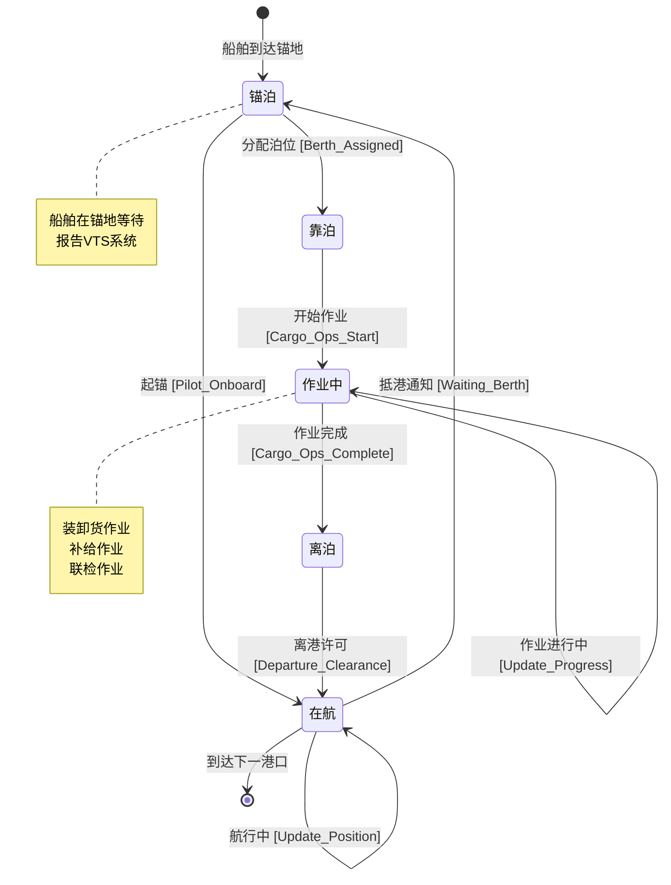

**DSL形式化定义**：

```dsl
stateMachine VesselNavigation {
  states {
    ANCHORED @initial
    UNDERWAY
    BERTHED
    OPERATING
    DEPARTING
  }

  transitions {
    ANCHORED --> UNDERWAY {
      event: ANCHOR_LIFTED
      condition: Pilot_Onboard == true
      action: [UpdateNavStatus, ReportVTS]
    }

    UNDERWAY --> ANCHORED {
      event: ARRIVAL_NOTICE
      condition: Berth_Available == false
      action: [DropAnchor, WaitBerth]
    }

    ANCHORED --> BERTHED {
      event: BERTH_ASSIGNED
      action: [PrepareBerthing]
    }

    BERTHED --> OPERATING {
      event: OPS_START
      action: [StartCargoOps, UpdateAIS]
    }

    OPERATING --> DEPARTING {
      event: OPS_COMPLETE
      condition: Cargo_Ops_Done == true && Docs_Ready == true
      action: [CompleteOps, PrepareDeparture]
    }

    DEPARTING --> UNDERWAY {
      event: DEPARTURE_CLEARANCE
      action: [UpdateNavStatus, ReportDeparture]
    }
  }

  invariants {
    VesselPositionValid
    AIS_Status_Consistent
  }
}
```

---

### 2.2 货物状态机

**形式化定义**：

```text
Cargo_Status_SM = (States, Events, Transitions, Initial_State, Final_States)

Where:
  States = {BOOKED, STUFFED, LOADED, IN_TRANSIT, DISCHARGED, DELIVERED}
  Events = {booking_confirmed, container_stuffed, vessel_loaded,
            voyage_complete, cargo_discharged, cargo_delivered}
  Initial_State = BOOKED
  Final_States = {DELIVERED}
```

**状态转换表**：

| 当前状态 | 触发事件 | 下一状态 | 执行动作 |
|---------|---------|---------|---------|
| 订舱 (BOOKED) | 订舱确认 | 订舱 (BOOKED) | 分配B/L号，安排提箱 |
| 订舱 (BOOKED) | 提空箱 | 装箱 (STUFFED) | 更新集装箱状态 |
| 装箱 (STUFFED) | 还重箱 | 装船 (LOADED) | 确认码头收箱 |
| 装船 (LOADED) | 船舶离港 | 运输中 (IN_TRANSIT) | 更新航行状态，ETA通知 |
| 运输中 (IN_TRANSIT) | 船舶到港 | 卸船 (DISCHARGED) | 更新卸船进度 |
| 卸船 (DISCHARGED) | 提货放行 | 交付 (DELIVERED) | 完成交付确认 |

**Mermaid状态图**：

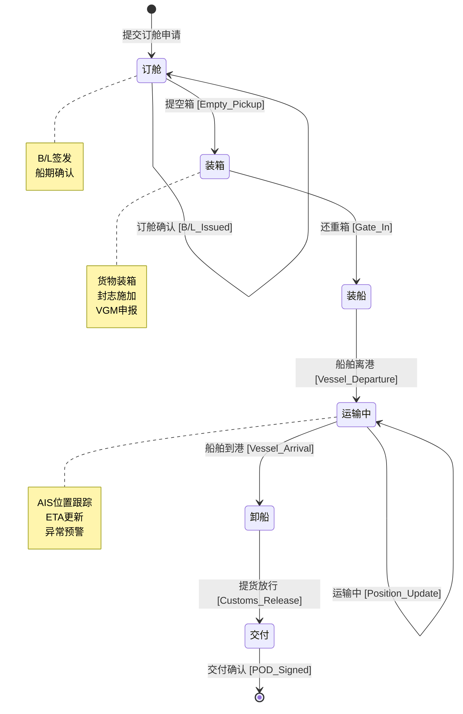

**DSL形式化定义**：

```dsl
stateMachine CargoStatus {
  states {
    BOOKED @initial
    STUFFED
    LOADED
    IN_TRANSIT
    DISCHARGED
    DELIVERED @final
  }

  transitions {
    BOOKED --> STUFFED {
      event: EMPTY_PICKUP
      action: [UpdateContainerStatus, AssignContainer]
    }

    STUFFED --> LOADED {
      event: GATE_IN
      condition: VGM_Submitted == true
      action: [ConfirmGateIn, Yard_Position]
    }

    LOADED --> IN_TRANSIT {
      event: VESSEL_DEPARTURE
      action: [UpdateVoyageStatus, NotifyShipper]
    }

    IN_TRANSIT --> IN_TRANSIT {
      event: POSITION_UPDATE
      action: [TrackByAIS, UpdateETA]
    }

    IN_TRANSIT --> DISCHARGED {
      event: VESSEL_ARRIVAL
      action: [UpdateDischargeProgress]
    }

    DISCHARGED --> DELIVERED {
      event: CUSTOMS_RELEASE
      condition: Charges_Paid == true && Docs_Checked == true
      action: [Gate_Out, POD_Generation]
    }
  }

  constraints {
    VGM_Required_Before_Load
    Customs_Clearance_Before_Delivery
  }
}
```

---

### 2.3 航次状态机

**形式化定义**：

```text
Voyage_SM = (States, Events, Transitions, Initial_State, Final_States)

Where:
  States = {PLANNED, EXECUTING, COMPLETED, SETTLED}
  Events = {voyage_approved, voyage_started, voyage_ended,
            accounts_settled}
  Initial_State = PLANNED
  Final_States = {SETTLED}
```

**状态转换表**：

| 当前状态 | 触发事件 | 下一状态 | 执行动作 |
|---------|---------|---------|---------|
| 计划 (PLANNED) | 航次批准 | 计划 (PLANNED) | 分配船舶，发布船期 |
| 计划 (PLANNED) | 航次开始 | 执行 (EXECUTING) | 首个港口开航 |
| 执行 (EXECUTING) | 港口作业 | 执行 (EXECUTING) | 更新各港状态 |
| 执行 (EXECUTING) | 末港离港 | 完成 (COMPLETED) | 航次结束确认 |
| 完成 (COMPLETED) | 费用结算 | 结算 (SETTLED) | 成本收入核算 |

**Mermaid状态图**：

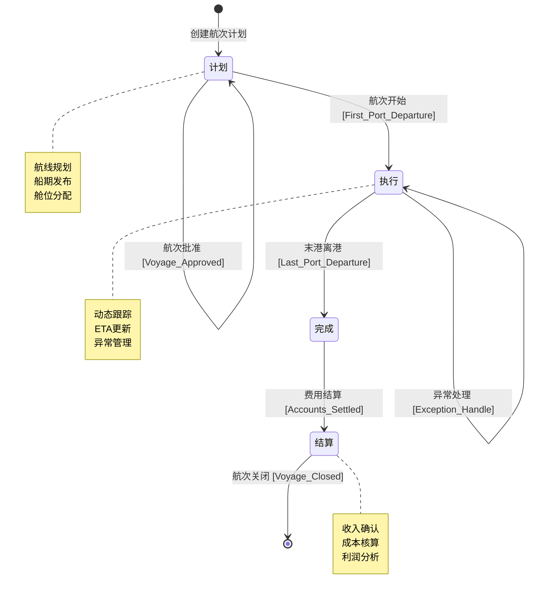

**DSL形式化定义**：

```dsl
stateMachine VoyageStatus {
  states {
    PLANNED @initial
    EXECUTING
    COMPLETED
    SETTLED @final
  }

  transitions {
    PLANNED --> EXECUTING {
      event: VOYAGE_START
      action: [ActivateVoyage, StartTracking]
    }

    EXECUTING --> EXECUTING {
      event: PORT_CALL
      action: [UpdatePortStatus, UpdateSchedule]
    }

    EXECUTING --> EXECUTING {
      event: SCHEDULE_UPDATE
      action: [RecalculateETA, NotifyCustomers]
    }

    EXECUTING --> COMPLETED {
      event: VOYAGE_END
      condition: All_Cargo_Delivered == true
      action: [CloseOperations, GenerateReport]
    }

    COMPLETED --> SETTLED {
      event: ACCOUNTS_SETTLED
      action: [Revenue_Recognition, Cost_Allocation]
    }
  }

  metrics {
    Schedule_Reliability
    Voyage_Profitability
    Fuel_Efficiency
  }
}
```

---

## 3. 时序图形式化

### 3.1 港口挂靠流程

**流程说明**：

```text
Port_Call_Flow = (Pre_Arrival, Arrival, Berthing, Operations, Departure)

Pre_Arrival:  ETA报告 → 进港申请 → 泊位安排 → 引航调度
Arrival:     抵达报告 → 锚泊/直接靠泊 → VTS确认
Berthing:    引航上船 → 靠泊操作 → 系缆确认 → 联检开始
Operations:  货物装卸 → 船舶补给 → 联检完成
Departure:   离泊准备 → 引航离船 → 离港报告 → VTS放行
```

**Mermaid时序图**：

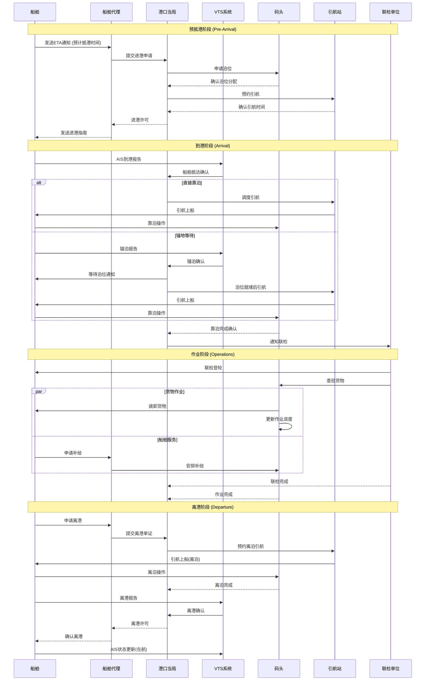

**关键时间节点**：

| 阶段 | 关键事件 | SLA要求 | 数据来源 |
|-----|---------|--------|---------|
| 预抵港 | ETA发送 | 抵港前48-72小时 | AIS/船代 |
| 到港 | 锚泊/靠泊 | 按泊位计划 | VTS |
| 作业 | 装卸完成 | 按船期窗口 | 码头TOS |
| 离港 | 离泊 | 按泊位计划 | VTS |

---

### 3.2 集装箱班轮运输流程

**流程说明**：

```text
Container_Liner_Flow = (Booking, Empty_Pickup, Stuffing, Gate_In,
                       Loading, Ocean_Transport, Discharge, Delivery)

Full_Cycle:  订舱 → 提空 → 装箱 → 还重 → 装船 → 海运 → 卸船 → 提重 → 交付
```

**Mermaid时序图**：

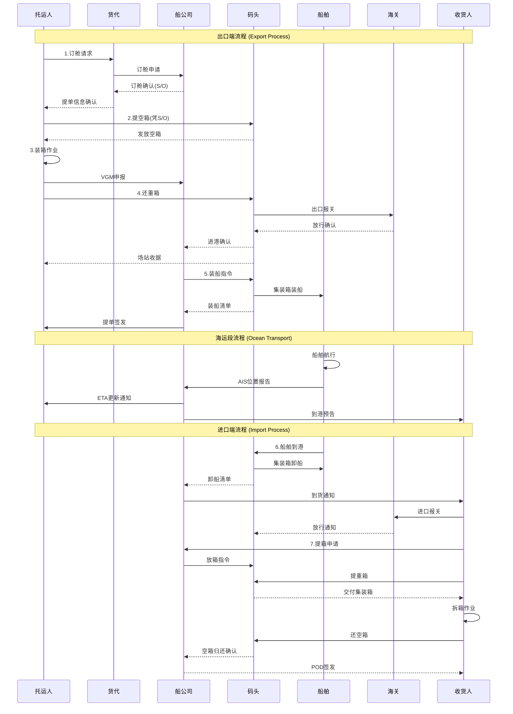

**关键单证流转**：

| 单证 | 发送方 | 接收方 | 作用 |
|-----|-------|-------|-----|
| S/O (订舱单) | 船公司 | 托运人 | 提箱凭证 |
| VGM ( verified gross mass) | 托运人 | 船公司 | 安全装载依据 |
| B/L (提单) | 船公司 | 托运人 | 物权凭证 |
| EIR (设备交接单) | 码头 | 卡车司机 | 集装箱交接凭证 |
| POD (交付凭证) | 收货人 | 船公司 | 完成交付确认 |

---

### 3.3 船舶代理业务流程

**流程说明**：

```text
Ship_Agency_Flow = (Appointment, Pre_Arrival, Arrival, Port_Stay, Departure)

Agency_Tasks:  委托受理 → 单证准备 → 港口协调 → 费用结算 → 航次报告
```

**Mermaid时序图**：

```mermaid
sequenceDiagram
    participant Principal as 委托人(船东)
    participant Agent as 船舶代理
    participant Port as 港口当局
    participant VTS as VTS中心
    participant Terminal as 码头公司
    Pilot as 引航站
    participant Customs as 联检单位
    participant Supplier as 供应商
    participant P&I as 保赔协会

    Note over Principal,P&I: 委托阶段 (Appointment)

    Principal->>Agent: 委托函/代理协议
    Agent->>Principal: 确认接受委托
    Agent->>Agent: 建立航次档案

    Note over Principal,P&I: 预抵港阶段 (Pre-Arrival)

    Principal->>Agent: 船舶资料/ETA
    Agent->>Port: 抵港预报(72h)
    Agent->>Customs: 预报关申请
    Agent->>Terminal: 泊位申请
    Terminal-->>Agent: 泊位确认
    Agent->>Pilot: 引航预约
    Pilot-->>Agent: 引航确认
    Agent->>Supplier: 供应预约

    Agent->>Principal: 港口费用估算
    Principal-->>Agent: 费用确认/备用金

    Note over Principal,P&I: 在港阶段 (Port Stay)

    Agent->>VTS: 进港申报
    VTS-->>Agent: 进港许可
    Agent->>Pilot: 确认引航
    Pilot->>Vessel: 引航服务

    Agent->>Customs: 办理联检
    Customs->>Vessel: 登轮检查
    Customs-->>Agent: 联检完成

    Agent->>Terminal: 协调装卸
    Terminal-->>Agent: 作业进度
    Agent->>Supplier: 协调供应

    alt 船舶维修需求
        Agent->>Supplier: 安排维修
        Supplier->>Vessel: 维修服务
    end

    alt 船员更换需求
        Agent->>Customs: 船员入境申请
        Customs-->>Agent: 入境许可
    end

    Agent->>Principal: 每日航次报告

    Note over Principal,P&I: 离港阶段 (Departure)

    Agent->>Terminal: 确认作业完成
    Agent->>Customs: 办理出口联检
    Agent->>Port: 办理离港手续
    Port->>VTS: 离港许可
    VTS-->>Agent: 确认离港
    Agent->>Pilot: 离泊引航

    Agent->>Principal: 离港报告
    Agent->>Principal: 提交航次账单
    Principal-->>Agent: 结算费用
    Agent->>Agent: 归档航次资料
```

**代理业务关键节点**：

| 阶段 | 关键任务 | 时间节点 | 责任方 |
|-----|---------|---------|-------|
| 委托 | 签署代理协议 | 抵港前7天 | 船东/代理 |
| 预报 | 发送抵港预报 | 抵港前72小时 | 代理 |
| 联检 | 完成进出口联检 | 靠泊后2小时内 | 代理/海关 |
| 作业 | 协调装卸作业 | 按船期窗口 | 代理/码头 |
| 离港 | 办理离港手续 | 离泊前2小时 | 代理 |
| 结算 | 航次费用结算 | 离港后30天 | 代理/船东 |

---

## 4. 数据流分析

### 4.1 AIS数据流

**数据流定义**：

```text
AIS_Data_Flow = (Sources, Processing, Storage, Distribution, Applications)

Sources:     船载AIS发射器 → 岸基接收站 → 卫星AIS
Processing:  解码 → 验证 → 融合 → 分析
Storage:     时序数据库 → 历史归档
Distribution: API推送 → 消息队列 → 数据服务
Applications: 船舶跟踪 → 碰撞预警 → 航线优化 → 港口调度
```

**Mermaid数据流图**：

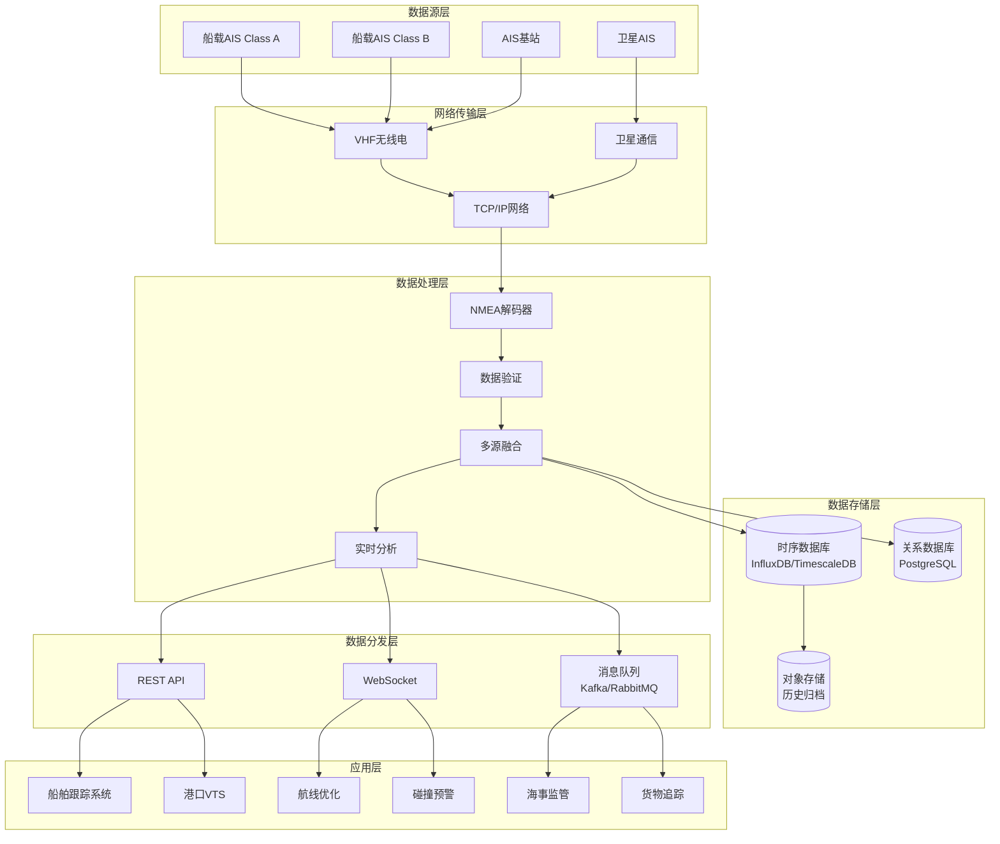

**AIS数据报文类型**：

| 消息类型 | 内容 | 频率 | 优先级 |
|---------|-----|-----|-------|
| Type 1/2/3 | 位置报告(Class A) | 2-10秒 | 高 |
| Type 5 | 静态与航行数据 | 6分钟 | 中 |
| Type 18 | 位置报告(Class B) | 可变速率 | 中 |
| Type 24 | Class B静态数据 | 6分钟 | 低 |

**数据处理流程**：

```python
# AIS数据处理流程伪代码
class AISDataFlow:
    def receive(self, raw_nmea):
        """接收原始NMEA数据"""
        return decode_nmea(raw_nmea)

    def validate(self, message):
        """数据验证"""
        return validate_checksum(message) and
               validate_mmsi(message.mmsi) and
               validate_position(message.lat, message.lon)

    def fuse(self, messages):
        """多源数据融合"""
        return merge_by_timestamp(
            deduplicate(messages),
            priority=['satellite', 'terrestrial']
        )

    def process(self, fused_data):
        """实时分析处理"""
        return {
            'position': extract_position(fused_data),
            'movement': calculate_movement(fused_data),
            'anomalies': detect_anomalies(fused_data)
        }

    def distribute(self, processed_data):
        """数据分发"""
        api_publish(processed_data)
        websocket_broadcast(processed_data)
        message_queue_push(processed_data)
```

---

### 4.2 港口EDI数据流

**数据流定义**：

```text
Port_EDI_Flow = (Trading_Partners, Message_Types, Translation,
                 Integration, Business_Processes)

Trading_Partners: 船公司 ↔ 码头 ↔ 海关 ↔ 货代 ↔ 收发货人
Message_Types:    IFTMBF(订舱) ↔ IFTMBC(订舱确认) ↔
                  IFTSTA(状态报告) ↔ IFTMIN(进港指令) ↔
                  CUSCAR(报关) ↔ COARRI(到离港通知)
```

**Mermaid数据流图**：

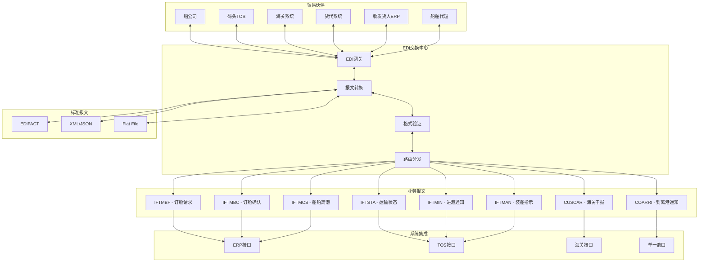

**EDI报文处理流程**：

| 步骤 | 处理内容 | 系统组件 | SLA |
|-----|---------|---------|-----|
| 接收 | 接收原始报文 | EDI网关 | < 1分钟 |
| 解析 | 语法解析验证 | 报文转换器 | < 30秒 |
| 映射 | 标准格式转换 | 映射引擎 | < 30秒 |
| 验证 | 业务规则验证 | 验证引擎 | < 1分钟 |
| 路由 | 目标系统分发 | 路由引擎 | < 30秒 |
| 确认 | 发送功能确认 | 回执系统 | < 5分钟 |

**关键报文类型说明**：

```dsl
message IFTMBF_BookingRequest {
  // 订舱请求报文
  header: UNH_MessageHeader

  segment BGM_BeginningOfMessage {
    message_name: "IFTMBF"
    document_number: String
  }

  segment TDT_TransportDetails {
    mode: "1" // 海运
    voyage: String
    vessel: String
  }

  segment LOC_Locations {
    pol: UNLocode
    pod: UNLocode
  }

  segment GID_GoodsItemDetails {
    number_of_packages: Integer
    goods_description: String
    gross_weight: Decimal
  }

  segment EQD_EquipmentDetails {
    container_type: String
    container_count: Integer
  }

  trailer: UNT_MessageTrailer
}

message IFTSTA_StatusReport {
  // 运输状态报告
  header: UNH_MessageHeader

  segment BGM {
    message_name: "IFTSTA"
  }

  segment CNI_ConsignmentInfo {
    bl_number: String
  }

  segment STS_Status {
    status_code: StatusCode
    // 1: 预订确认
    // 2: 已收货
    // 3: 已装船
    // 4: 运输中
    // 5: 已到港
    // 6: 已卸船
    // 7: 已交付
    location: String
    timestamp: DateTime
  }

  trailer: UNT_MessageTrailer
}
```

---

## 5. 实时性分析

### 5.1 AIS报告频率

**报告频率定义**：

```text
AIS_Report_Frequency = (Ship_Static, Ship_Dynamic, Voyage_Data, Binary_Msg)

Dynamic_Reports:
  - Class A Underway (SOG > 23 knots): 2 seconds
  - Class A Underway (SOG 14-23 knots): 3.33 seconds
  - Class A Underway (SOG < 14 knots): 10 seconds
  - Class A At Anchor/Moored: 3 minutes
  - Class B: 可变速率，通常为30秒-3分钟

Static_Reports: 6 minutes
Voyage_Data: 6 minutes
```

**Mermaid时序图 - AIS报告周期**：

```mermaid
gantt
    title AIS报告时间线
    dateFormat X
    axisFormat %s

    section Class A高速
    位置报告    :crit, 0, 2
    位置报告    :crit, 2, 4
    位置报告    :crit, 4, 6
    位置报告    :crit, 6, 8
    位置报告    :crit, 8, 10

    section Class A中速
    位置报告    :active, 0, 3.33
    位置报告    :active, 3.33, 6.66
    位置报告    :active, 6.66, 10

    section Class A低速
    位置报告    :done, 0, 10
    位置报告    :done, 10, 20

    section 静态数据
    静态数据    :milestone, 0, 0
    静态数据    :milestone, 360, 360
    航行数据    :milestone, 360, 360
```

**AIS报告频率表**：

| 船舶状态 | 速度范围 | 报告间隔 | 船舶类型 |
|---------|---------|---------|---------|
| 高速航行 | SOG > 23节 | 2秒 | Class A |
| 中速航行 | 14 < SOG ≤ 23节 | 3.33秒 | Class A |
| 低速航行 | SOG ≤ 14节 | 10秒 | Class A |
| 锚泊/系泊 | SOG ≈ 0 | 3分钟 | Class A |
| 正常航行 | 任意 | 30秒-3分钟 | Class B |
| 静态数据 | N/A | 6分钟 | Class A/B |
| 航行数据 | N/A | 6分钟 | Class A |

**实时性SLA要求**：

```dsl
sla AIS_Realtime_Requirements {
  position_update_latency: {
    target: "< 5 seconds"
    critical: "< 10 seconds"
  }

  data_availability: {
    target: "99.9%"
    measurement: "per_month"
  }

  position_accuracy: {
    high_accuracy: "< 10 meters"
    low_accuracy: "> 10 meters"
  }

  data_freshness: {
    target: "< 30 seconds"
    critical: "< 60 seconds"
  }
}
```

---

### 5.2 港口作业效率SLA

**SLA定义**：

```text
Port_Operation_SLA = (Vessel_Operation, Cargo_Handling,
                     Documentation, Service_Response)

Vessel_Operation: 船舶在港时间、泊位周转率、准班率
Cargo_Handling:   单桥效率、场地周转率、查验时效
Documentation:    单证处理时间、放行速度
Service_Response: 客户响应时间、异常处理时间
```

**港口作业KPI与SLA**：

| 指标类别 | 具体指标 | 目标值 | 挑战值 | 测量方法 |
|---------|---------|-------|-------|---------|
| 船舶效率 | 船舶在港时间 | < 24小时 | < 18小时 | AIS/VTS |
| | 泊位周转率 | > 4艘/天 | > 5艘/天 | TOS统计 |
| | 准班率 | > 80% | > 90% | 船期对比 |
| 作业效率 | 单桥效率 | > 30自然箱/小时 | > 35自然箱/小时 | TOS统计 |
| | 重箱平均堆存期 | < 7天 | < 5天 | 场存分析 |
| 服务时效 | 进口放行时间 | < 4小时 | < 2小时 | 海关系统 |
| | 出口提前截关 | 24小时 | 12小时 | 船公司确认 |
| | 客服响应时间 | < 15分钟 | < 5分钟 | 工单系统 |

**Mermaid甘特图 - 港口作业时间窗口**：

```mermaid
gantt
    title 集装箱船港口作业时间窗口(示例)
    dateFormat HH:mm
    axisFormat %H:%M

    section 船舶作业
    引航靠泊     :crit, 08:00, 09:00
    系缆固定     :09:00, 09:30
    联检作业     :09:30, 11:00
    货物装卸     :active, 09:30, 17:30
    船舶补给     :10:00, 14:00
    离泊准备     :17:00, 17:30
    引航离泊     :crit, 17:30, 18:30

    section 货物作业
    进口卸船     :active, 09:30, 13:00
    出口装船     :active, 14:00, 17:30
    查验作业     :11:00, 15:00

    section 单证作业
    进口放行     :09:00, 12:00
    出口结关     :15:00, 17:00
    舱单确认     :17:00, 18:00
```

**SLA监控仪表板**：

```dsl
dashboard Port_Operation_SLA {
  panel Vessel_Turnaround_Time {
    type: gauge
    metric: avg(berth_departure - berth_arrival)
    unit: hours
    target: 24
    critical_threshold: 36
  }

  panel Crane_Productivity {
    type: time_series
    metric: moves_per_crane_hour
    unit: moves/hour
    target: 30
  }

  panel Schedule_Reliability {
    type: percentage
    metric: on_time_arrivals / total_arrivals
    target: 0.80
    critical_threshold: 0.70
  }

  panel Documentation_TAT {
    type: bar_chart
    metric: document_processing_time
    breakdown: [customs_clearance, manifest_confirmation, release_processing]
    target: 4_hours
  }
}
```

---

## 6. 异常处理机制

### 6.1 恶劣天气绕航

**异常定义**：

```text
Weather_Diversion = (Trigger, Assessment, Decision, Execution, Recovery)

Trigger:    气象预警(Wind > Beaufort 8 / Wave > 4m)
Assessment: 航线评估 → 绕航方案 → 成本影响 → ETA变更
Decision:   船长决定 + 船公司批准 + 租家通知 + 港口调整
Execution:  航线变更 → AIS更新 → 相关方通知 → 动态跟踪
Recovery:   回到原航线 → 后续港口调整 → 合同条款触发
```

**Mermaid状态图 - 恶劣天气处理**：

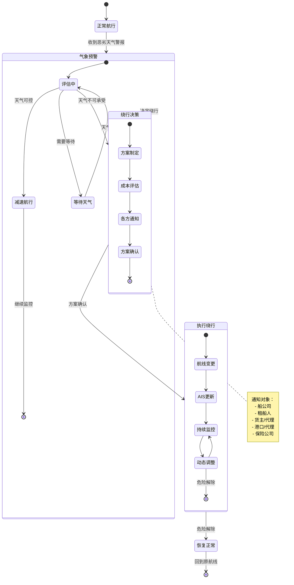

**Mermaid时序图 - 恶劣天气处理流程**：

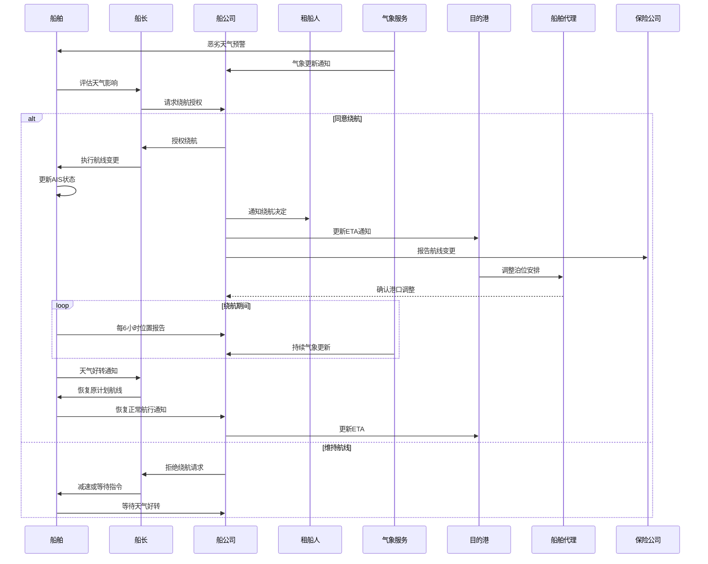

---

### 6.2 港口拥堵处理

**异常定义**：

```text
Port_Congestion = (Detection, Impact_Assessment, Mitigation, Communication)

Detection:        锚地船舶数 > 阈值 OR 泊位等待时间 > SLA
Impact_Assessment: 后续航次延误、货物交付延迟、成本增加
Mitigation:       航线调整、港口变更、船期跳港、加开加班船
Communication:    客户通知、船期更新、合同协商
```

**Mermaid流程图 - 港口拥堵处理**：

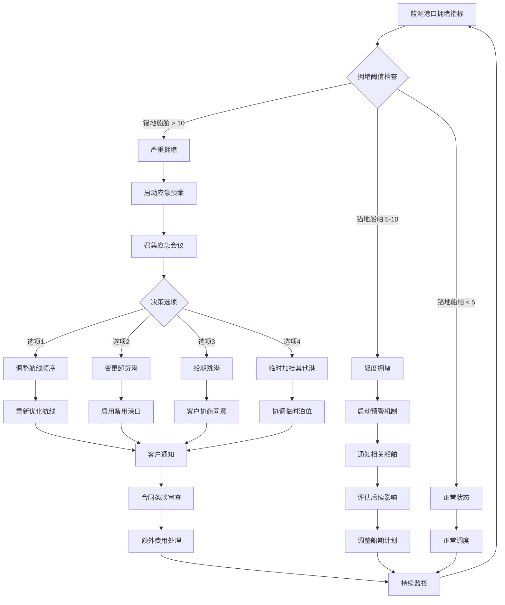

**拥堵处理决策矩阵**：

| 拥堵等级 | 锚地船舶数 | 等待时间 | 响应措施 | 决策时效 |
|---------|----------|---------|---------|---------|
| 绿色(正常) | 0-3艘 | < 6小时 | 正常调度 | 24小时 |
| 黄色(轻度) | 4-7艘 | 6-24小时 | 预警通知 | 12小时 |
| 橙色(中度) | 8-12艘 | 24-48小时 | 航线调整 | 6小时 |
| 红色(严重) | > 12艘 | > 48小时 | 应急预案 | 2小时 |

---

### 6.3 设备故障处理

**异常定义**：

```text
Equipment_Failure = (Failure_Types, Response_Levels, Recovery_Procedures)

Failure_Types:
  - Critical: 主机故障、舵机故障、电力系统故障
  - Major:    辅机故障、装卸设备故障、通信设备故障
  - Minor:    导航设备故障、生活设施故障

Response_Levels:
  - Level 1: 船上维修
  - Level 2: 港口维修
  - Level 3: 拖轮协助
  - Level 4: 进入船厂
```

**Mermaid状态图 - 设备故障处理**：

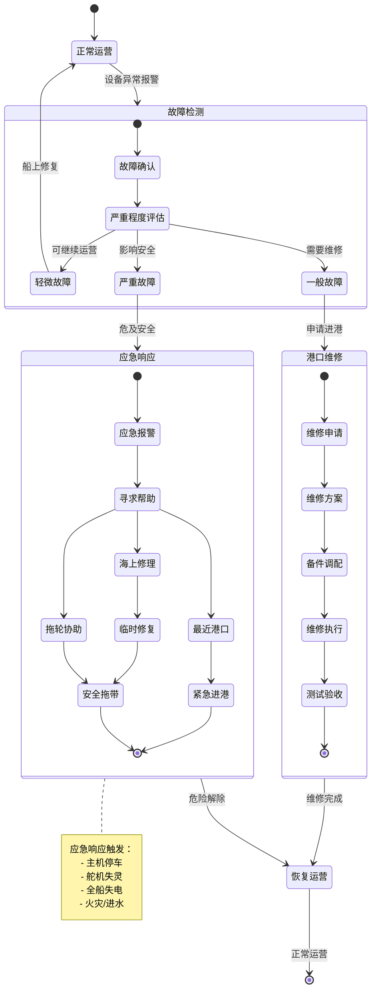

**Mermaid时序图 - 主机故障应急处理**：

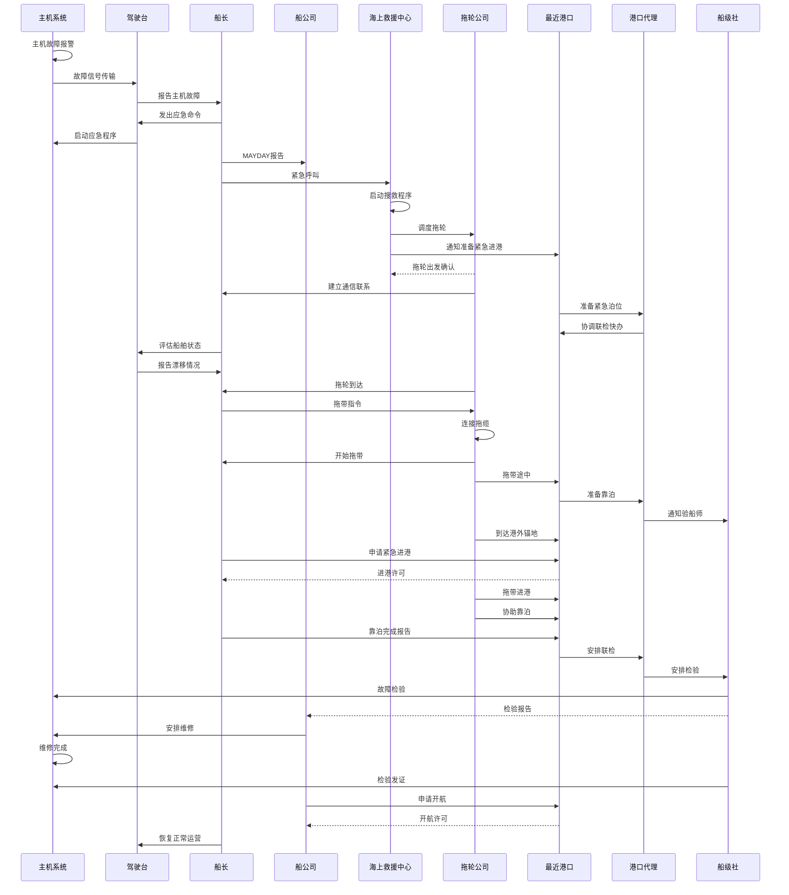

**故障响应时效要求**：

| 故障等级 | 报告时限 | 响应措施 | 恢复目标 |
|---------|---------|---------|---------|
| 轻微故障 | 24小时内 | 船上维修 | 7天内 |
| 一般故障 | 12小时内 | 港口维修 | 3天内 |
| 严重故障 | 立即 | 应急响应 | 视情况而定 |
| 紧急故障 | 立即 | MAYDAY | 安全第一 |

---

## 附录

### A. 状态机DSL完整定义

```dsl
schema MaritimeStateMachines {

  stateMachine VesselNavigation {
    description: "船舶航行状态管理"
    version: "1.0"

    states {
      ANCHORED @initial {
        entry_action: [ReportToVTS]
        exit_action: [ClearAnchor]
      }

      UNDERWAY {
        do_action: [UpdatePosition, ReportAIS]
      }

      BERTHED {
        entry_action: [ConfirmBerthing]
      }

      OPERATING {
        do_action: [TrackCargoOps]
      }

      DEPARTING {
        exit_action: [FinalDepartureReport]
      }
    }

    transitions {
      // 定义见前文
    }
  }

  stateMachine CargoLifecycle {
    description: "货物全生命周期管理"
    version: "1.0"

    // 定义见前文
  }

  stateMachine VoyageManagement {
    description: "航次全流程管理"
    version: "1.0"

    // 定义见前文
  }
}
```

### B. 异常处理决策树

```
异常事件检测
    ├── 天气相关
    │   ├── 风力 > 8级 → 评估绕航
    │   ├── 浪高 > 4m → 评估绕航
    │   └── 台风预警 → 紧急避台
    ├── 港口相关
    │   ├── 泊位取消 → 评估替代港
    │   ├── 港口拥堵 → 调整船期
    │   └── 罢工/关闭 → 航线变更
    ├── 船舶相关
    │   ├── 主机故障 → 紧急响应
    │   ├── 设备故障 → 分级处理
    │   └── 船员伤病 → 医疗援助
    └── 货物相关
        ├── 危险品泄漏 → 应急处理
        ├── 冷藏故障 → 紧急修理
        └── 货损货差 → 理算处理
```

### C. 相关标准参考

| 标准编号 | 标准名称 | 适用范围 |
|---------|---------|---------|
| IMO MSC.74(69) | AIS性能标准 | 船舶AIS设备 |
| IEC 61993-2 | AIS Class A标准 | AIS设备规范 |
| ISO 28005 | 电子港口清关 | 港口EDI |
| UN/EDIFACT | 联合国电子数据交换 | EDI报文 |
| IMDG Code | 国际海运危险品规则 | 危险品运输 |

---

*文档版本: 1.0*
*最后更新: 2026-02-15*
*维护者: Maritime Schema工作组*
