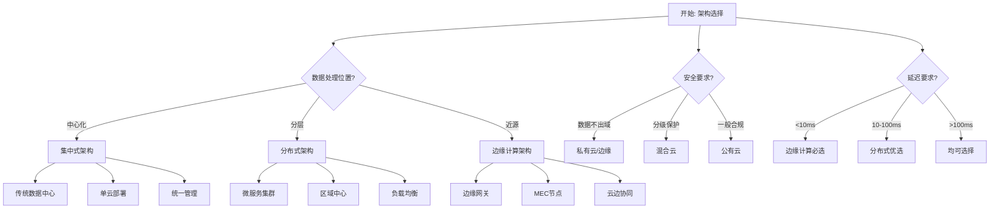
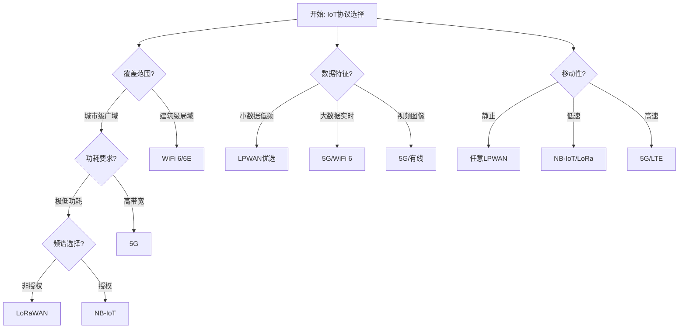
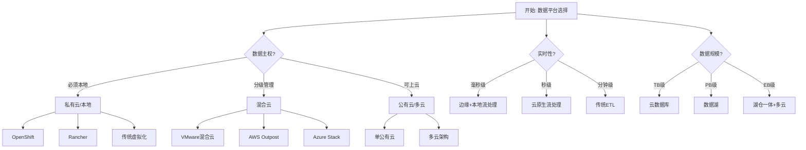

# 智慧城市Schema决策树图

**版本**: v1.0
**创建日期**: 2026-02-15
**适用范围**: 智慧城市系统架构设计和选型

---

## 📑 目录

- [智慧城市Schema决策树图](#智慧城市schema决策树图)
  - [📑 目录](#-目录)
  - [1. 智慧城市架构选择决策树](#1-智慧城市架构选择决策树)
    - [1.1 架构模式对比](#11-架构模式对比)
    - [1.2 决策矩阵](#12-决策矩阵)
  - [2. IoT协议选择决策树](#2-iot协议选择决策树)
    - [2.1 协议选型决策](#21-协议选型决策)
    - [2.2 协议特性对比](#22-协议特性对比)
  - [3. 数据平台选择决策树](#3-数据平台选择决策树)
    - [3.1 平台策略决策](#31-平台策略决策)
    - [3.2 部署模式对比](#32-部署模式对比)
  - [4. 城市服务领域决策树](#4-城市服务领域决策树)
    - [4.1 领域选择决策](#41-领域选择决策)
    - [4.2 优先级评估矩阵](#42-优先级评估矩阵)
  - [5. 市民参与模式决策树](#5-市民参与模式决策树)
    - [5.1 参与模式选择](#51-参与模式选择)
    - [5.2 模式对比分析](#52-模式对比分析)
  - [6. Mermaid可视化](#6-mermaid可视化)
    - [6.1 架构选择流程图](#61-架构选择流程图)
    - [6.2 IoT协议选择流程图](#62-iot协议选择流程图)
    - [6.3 数据平台选择流程图](#63-数据平台选择流程图)

---

## 1. 智慧城市架构选择决策树

### 1.1 架构模式对比

```text
开始: 确定智慧城市架构需求
│
├─ 数据处理位置?
│   ├─ 中心化处理
│   │   └─ 集中式架构
│   │       ├─ 特点: 统一管理、易于维护
│   │       ├─ 适用: 小规模城市、预算有限
│   │       ├─ 代表: 传统数据中心
│   │       └─ 挑战: 延迟高、单点故障风险
│   │
│   ├─ 分层处理
│   │   └─ 分布式架构
│   │       ├─ 特点: 负载均衡、高可用
│   │       ├─ 适用: 中大型城市、多业务部门
│   │       ├─ 代表: 微服务集群、区域中心
│   │       └─ 挑战: 复杂性高、运维成本高
│   │
│   └─ 近源处理
│       └─ 边缘计算架构
│           ├─ 特点: 低延迟、带宽节省
│           ├─ 适用: 实时性要求高、IoT密集
│           ├─ 代表: 边缘网关、MEC节点
│           └─ 挑战: 边缘设备管理复杂
│
├─ 网络拓扑要求?
│   ├─ 星型拓扑
│   │   └─ 集中式/云原生
│   │       ├─ 优势: 简化管理
│   │       └─ 劣势: 中心节点压力大
│   │
│   ├─ 网状拓扑
│   │   └─ 分布式/边缘协同
│   │       ├─ 优势: 容错性强
│   │       └─ 劣势: 通信开销大
│   │
│   └─ 混合拓扑
│       └─ 云边端协同
│           ├─ 优势: 灵活性高
│           └─ 劣势: 架构复杂
│
└─ 安全合规要求?
    ├─ 数据不出域
    │   └─ 私有云/边缘部署
    ├─ 等保三级以上
    │   └─ 分布式+加密传输
    └─ 一般合规
        └─ 公有云/混合云
```

### 1.2 决策矩阵

| 评估维度 | 集中式 | 分布式 | 边缘计算 |
|---------|--------|--------|----------|
| **延迟** | 高(>100ms) | 中(10-100ms) | 低(<10ms) |
| **带宽** | 高消耗 | 中消耗 | 低消耗 |
| **可扩展性** | 垂直扩展 | 水平扩展 | 就近扩展 |
| **运维复杂度** | 低 | 高 | 中 |
| **数据安全** | 集中管控 | 分级管控 | 本地处理 |
| **初期投入** | 低 | 高 | 中 |
| **长期TCO** | 高 | 中 | 低(IoT场景) |

**推荐场景**:

- **集中式**: 智慧政务、城市大数据中心
- **分布式**: 跨区域协同、多租户平台
- **边缘计算**: 智慧交通信号控制、视频监控分析

---

## 2. IoT协议选择决策树

### 2.1 协议选型决策

```text
开始: 确定IoT通信需求
│
├─ 覆盖范围?
│   ├─ 广域覆盖(城市级)
│   │   ├─ 低功耗广域网
│   │   │   ├─ 非授权频谱
│   │   │   │   └─ LoRaWAN
│   │   │   │       ├─ 频段: 470/868/915 MHz
│   │   │   │       ├─ 速率: 0.3-50 kbps
│   │   │   │       ├─ 距离: 2-15 km
│   │   │   │       ├─ 功耗: 极低(10年电池)
│   │   │   │       ├─ 成本: 低
│   │   │   │       └─ 适用: 智能表计、环境监测
│   │   │   │
│   │   │   └─ 授权频谱
│   │   │       └─ NB-IoT
│   │   │           ├─ 频段: 运营商授权频段
│   │   │           ├─ 速率: 上行66kbps/下行26kbps
│   │   │           ├─ 覆盖: 比GSM强20dB
│   │   │           ├─ 功耗: 低(10年电池)
│   │   │           ├─ 成本: 中(需SIM卡)
│   │   │           └─ 适用: 智能停车、垃圾桶监测
│   │   │
│   │   └─ 高带宽广域网
│   │       └─ 5G
│   │           ├─ 频段: Sub-6GHz/mmWave
│   │           ├─ 速率: 下行1Gbps+/上行100Mbps+
│   │           ├─ 延迟: 1ms级(uRLLC)
│   │           ├─ 密度: 100万设备/km²
│   │           ├─ 成本: 高
│   │           └─ 适用: 自动驾驶、远程医疗、AR/VR
│   │
│   └─ 局域覆盖(建筑/园区)
│       └─ WiFi 6/6E
│           ├─ 频段: 2.4/5/6 GHz
│           ├─ 速率: 9.6 Gbps
│           ├─ 延迟: 低至10ms
│           ├─ 密度: 支持更多并发设备
│           ├─ 成本: 中
│           └─ 适用: 智慧建筑、园区物联网
│
├─ 数据特征?
│   ├─ 小数据包、低频
│   │   └─ LoRaWAN/NB-IoT
│   ├─ 大数据流、实时
│   │   └─ 5G/WiFi 6
│   └─ 视频/图像传输
│       └─ 5G/有线光纤
│
├─ 移动性要求?
│   ├─ 静止设备
│   │   └─ 任何LPWAN
│   ├─ 低速移动(<30km/h)
│   │   └─ NB-IoT/LoRaWAN
│   └─ 高速移动(>100km/h)
│       └─ 5G/4G LTE
│
└─ 部署成本约束?
    ├─ 极低成本
    │   └─ LoRaWAN(自建网)
    ├─ 中等成本
    │   └─ NB-IoT(运营商资费)
    └─ 成本不敏感
        └─ 5G/WiFi 6E
```

### 2.2 协议特性对比

| 特性 | LoRaWAN | NB-IoT | 5G | WiFi 6 |
|-----|---------|--------|-----|--------|
| **频谱** | 非授权ISM | 授权蜂窝 | 授权蜂窝 | 非授权ISM |
| **覆盖** | 2-15 km | 1-10 km | 1-5 km | 50-100 m |
| **速率** | 0.3-50 kbps | 66/26 kbps | 1+ Gbps | 9.6 Gbps |
| **延迟** | 秒级 | 秒级-分秒级 | 1ms | 10ms |
| **功耗** | 极低 | 低 | 中高 | 中 |
| **电池寿命** | 10-15年 | 10年 | 数小时 | 数小时-数天 |
| **单节点成本** | <$5 | <$10 | >$50 | $5-20 |
| **网络成本** | 自建/低 | 运营商/中 | 运营商/高 | 自建/中 |
| **最佳应用** | 环境监测、农业 | 智能表计、停车 | 车联网、工业 | 智慧建筑、园区 |

---

## 3. 数据平台选择决策树

### 3.1 平台策略决策

```text
开始: 确定数据平台需求
│
├─ 数据主权要求?
│   ├─ 数据必须本地存储
│   │   └─ 私有云/本地部署
│   │       ├─ 云原生
│   │       │   └─ 本地Kubernetes集群
│   │       │       ├─ 工具: OpenShift/Rancher
│   │       │       ├─ 优势: 云原生能力+数据控制
│   │       │       └─ 挑战: 需要专业运维团队
│   │       │
│   │       └─ 传统架构
│   │           └─ 虚拟机/物理服务器
│   │               ├─ 优势: 成熟稳定
│   │               └─ 挑战: 扩展性受限
│   │
│   ├─ 敏感数据本地、一般数据上云
│   │   └─ 混合云架构
│   │       ├─ 架构模式
│   │       │   ├─ 数据分层: 热数据云端、冷数据本地
│   │       │   ├─ 业务分层: 核心系统本地、创新应用云端
│   │       │   └─ 灾备分层: 生产本地、备份云端
│   │       │
│   │       ├─ 技术方案
│   │       │   ├─ 混合云管理平台: VMware/AWS Outpost/Azure Stack
│   │       │   ├─ 数据同步: 专线/VPN + 数据同步工具
│   │       │   └─ 统一监控: 跨云监控体系
│   │       │
│   │       └─ 适用场景
│   │           ├─ 监管合规要求(金融、医疗)
│   │           ├─ 数据分级管理需求
│   │           └─ 渐进式上云策略
│   │
│   └─ 数据可上云
│       └─ 公有云/多云
│           ├─ 单云策略
│           │   └─ 单一公有云提供商
│           │       ├─ 优势: 简化管理、深度集成
│           │       └─ 风险: 厂商锁定
│           │
│           └─ 多云策略
│               └─ 跨多个云提供商
│                   ├─ 优势: 避免锁定、最优服务选择
│                   ├─ 挑战: 复杂性高、跨云治理难
│                   └─ 技术: Terraform/Kubernetes多集群
│
├─ 实时性要求?
│   ├─ 毫秒级实时
│   │   └─ 边缘计算 + 本地流处理
│   ├─ 秒级实时
│   │   └─ 云原生流处理(Cloud Streaming)
│   └─ 分钟级/批处理
│       └─ 传统ETL/云数据仓库
│
├─ 数据规模?
│   ├─ TB级以下
│   │   └─ 单云数据库/数据仓库
│   ├─ PB级
│   │   └─ 大数据平台/数据湖
│   └─ EB级
│       └─ 湖仓一体 + 多云存储
│
└─ 预算约束?
    ├─ 有限预算
    │   └─ 开源方案 + 公有云
    ├─ 中等预算
    │   └─ 混合云 + 部分商业软件
    └─ 充足预算
        └─ 企业级多云解决方案
```

### 3.2 部署模式对比

| 维度 | 云原生 | 混合云 | 多云 |
|-----|--------|--------|------|
| **数据控制** | 中 | 高 | 中 |
| **扩展性** | 极高 | 高 | 极高 |
| **灵活性** | 高 | 中 | 极高 |
| **复杂性** | 中 | 高 | 极高 |
| **成本模型** | OPEX为主 | CAPEX+OPEX | OPEX为主 |
| **厂商锁定** | 有 | 低 | 无 |
| **灾备能力** | 依赖云商 | 自主可控 | 跨云冗余 |
| **合规性** | 需评估 | 最佳 | 需评估 |

---

## 4. 城市服务领域决策树

### 4.1 领域选择决策

```text
开始: 确定智慧城市服务领域
│
├─ 核心痛点?
│   ├─ 交通拥堵
│   │   └─ 智慧交通
│   │       ├─ 智能信号控制
│   │       │   └─ AI优化配时、自适应控制
│   │       ├─ 交通态势感知
│   │       │   └─ 视频分析、流量预测
│   │       ├─ 出行信息服务
│   │       │   └─ 实时路况、多模式导航
│   │       ├─ 车路协同
│   │       │   └─ V2X通信、自动驾驶支持
│   │       └─ 停车管理
│   │           └─ 智能诱导、无感支付
│   │
│   ├─ 能源紧张/碳排放
│   │   └─ 智慧能源
│   │       ├─ 智能电网
│   │       │   └─ 需求响应、负荷预测
│   │       ├─ 分布式能源管理
│   │       │   └─ 光伏、储能、微电网
│   │       ├─ 建筑能效管理
│   │       │   └─ HVAC优化、能耗监测
│   │       └─ 碳排放监测
│   │           └─ 碳足迹追踪、碳交易支持
│   │
│   ├─ 环境污染
│   │   └─ 智慧环保
│   │       ├─ 大气监测
│   │       │   └─ 网格化监测、污染溯源
│   │       ├─ 水质监测
│   │       │   └─ 水源地保护、排污监控
│   │       ├─ 噪声监测
│   │       │   └─ 敏感区域监控
│   │       └─ 固废管理
│   │           └─ 垃圾分类、收运优化
│   │
│   └─ 公共安全
│       └─ 智慧安防
│           ├─ 视频监控
│           │   └─ 人脸识别、行为分析
│           ├─ 应急指挥
│           │   └─ 事件联动、资源调度
│           ├─ 消防安全
│           │   └─ 烟感监测、消防通道监控
│           └─ 食品安全
│               └─ 溯源追踪、风险预警
│
├─ 投资规模?
│   ├─ 大型(>1亿)
│   │   └─ 可建设综合平台(如城市大脑)
│   ├─ 中型(1000万-1亿)
│   │   └─ 重点领域深度建设
│   └─ 小型(<1000万)
│       └─ 单点突破/试点项目
│
├─ 建设周期?
│   ├─ 短期(<1年)
│   │   └─ 成熟场景快速部署
│   ├─ 中期(1-3年)
│   │   └─ 系统集成+数据融合
│   └─ 长期(>3年)
│       └─ 全域覆盖+生态构建
│
└─ 跨部门协同?
    ├─ 单一部门
    │   └─ 垂直领域系统
    ├─ 少数部门
    │   └─ 部门间数据共享平台
    └─ 多部门协同
        └─ 城市级综合管理平台
```

### 4.2 优先级评估矩阵

| 评估维度 | 智慧交通 | 智慧能源 | 智慧环保 | 智慧安防 |
|---------|---------|---------|---------|---------|
| **民生影响** | ★★★★★ | ★★★★☆ | ★★★★☆ | ★★★★★ |
| **经济效益** | ★★★★☆ | ★★★★★ | ★★★☆☆ | ★★★☆☆ |
| **技术成熟度** | ★★★★★ | ★★★★☆ | ★★★★☆ | ★★★★★ |
| **投资规模** | 大 | 大 | 中 | 大 |
| **实施难度** | 中 | 高 | 中 | 中 |
| **数据价值** | ★★★★★ | ★★★★★ | ★★★★☆ | ★★★★☆ |
| **可视化效果** | ★★★★★ | ★★★☆☆ | ★★★★☆ | ★★★★★ |

**推荐建设顺序**:

1. **第一阶段**: 智慧安防(基础保障) + 智慧交通(民生痛点)
2. **第二阶段**: 智慧环保(绿色城市) + 数据平台整合
3. **第三阶段**: 智慧能源(双碳目标) + 跨域协同

---

## 5. 市民参与模式决策树

### 5.1 参与模式选择

```text
开始: 确定市民参与策略
│
├─ 参与深度目标?
│   ├─ 信息公开
│   │   └─ 开放数据平台
│   │       ├─ 数据开放范围
│   │       │   ├─ 基础数据: 地理信息、基础设施
│   │       │   ├─ 业务数据: 交通、环境、气象
│   │       │   └─ 决策数据: 规划、预算、绩效
│   │       │
│   │       ├─ 开放形式
│   │       │   ├─ 数据API: 开发者接口
│   │       │   ├─ 数据下载: CSV/JSON/XML
│   │       │   ├─ 数据可视化: 仪表盘、地图
│   │       │   └─ 应用商店: 第三方应用展示
│   │       │
│   │       └─ 配套机制
│   │           ├─ 数据质量保障
│   │           ├─ 开放目录管理
│   │           └─ 隐私脱敏处理
│   │
│   ├─ 问题反馈
│   │   └─ 众包平台
│   │       ├─ 报事报修
│   │       │   ├─ 多渠道接入: APP/小程序/热线
│   │       │   ├─ 智能派单: AI辅助分派
│   │       │   └─ 闭环管理: 进度跟踪+评价
│   │       │
│   │       ├─ 城市众测
│   │       │   ├─ 设施问题发现
│   │       │   ├─ 环境质量监测
│   │       │   └─ 积分激励机制
│   │       │
│   │       └─ 协同治理
│   │           ├─ 志愿者管理
│   │           ├─ 社区自治
│   │           └─ 公民科学家项目
│   │
│   └─ 深度互动
│       └─ 数字孪生互动平台
│           ├─ 虚拟城市体验
│           │   ├─ 3D城市漫游
│           │   ├─ 规划方案预览
│           │   └─ 历史变迁展示
│           │
│           ├─ 参与式规划
│           │   ├─ 方案可视化对比
│           │   ├─ 在线意见征集
│           │   ├─ 投票与共识构建
│           │   └─ 影响模拟分析
│           │
│           ├─ 场景仿真
│           │   ├─ 交通改善效果预览
│           │   ├─ 建设项目影响评估
│           │   └─ 应急预案演练
│           │
│           └─ 虚实融合服务
│               ├─ AR导航
│               ├─ 虚拟政务大厅
│               └─ 沉浸式市民教育
│
├─ 目标人群?
│   ├─ 普通市民
│   │   └─ 简化操作、移动端优先
│   ├─ 专业开发者
│   │   └─ 开放API、数据大赛
│   ├─ 学术研究者
│   │   └─ 批量数据、研究合作
│   └─ 企业机构
│       └─ 商业授权、合作开发
│
├─ 技术成熟度?
│   ├─ 成熟技术
│   │   └─ 开放数据门户 + 移动APP
│   ├─ 较新技术
│   │   └─ 众包平台 + 社交功能
│   └─ 前沿技术
│       └─ 数字孪生 + VR/AR/Metaverse
│
└─ 运营资源?
    ├─ 有限资源
    │   └─ 开放数据(单向)为主
    ├─ 中等资源
    │   └─ 开放数据 + 众包反馈
    └─ 充足资源
        └─ 全模式覆盖 + 持续运营
```

### 5.2 模式对比分析

| 维度 | 开放数据 | 众包 | 数字孪生互动 |
|-----|---------|------|-------------|
| **技术门槛** | 低 | 中 | 高 |
| **参与门槛** | 低(仅查看) | 低(报事) | 中(需设备) |
| **互动深度** | 浅 | 中 | 深 |
| **数据流向** | 单向 | 双向 | 多向 |
| **建设成本** | 低 | 中 | 高 |
| **运营成本** | 低 | 中 | 高 |
| **市民获得感** | 中 | 高 | 高 |
| **创新激发** | 高(开发者) | 中 | 高(沉浸体验) |
| **决策支持** | 间接 | 直接 | 直观 |
| **可持续性** | 高 | 中(需激励) | 待验证 |

**组合策略建议**:

- **基础层**: 开放数据平台(必建)
- **互动层**: 众包平台(高ROI)
- **体验层**: 数字孪生(示范引领)

---

## 6. Mermaid可视化

### 6.1 架构选择流程图



### 6.2 IoT协议选择流程图



### 6.3 数据平台选择流程图



---

**参考文档**:

- `README.md` - 主题概览
- `Smart_City_Schema/03_Standards.md` - 智慧城市标准详细说明
- `../UNIFIED_GLOSSARY.md` - 统一术语表

**维护者**: DSL Schema研究团队
**更新周期**: 随标准更新同步修订
