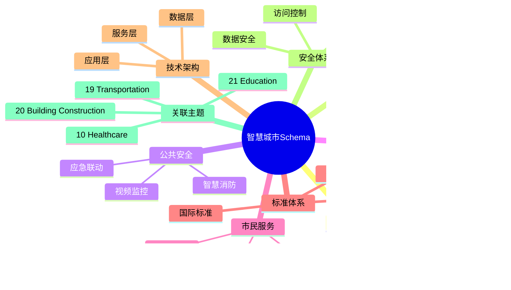
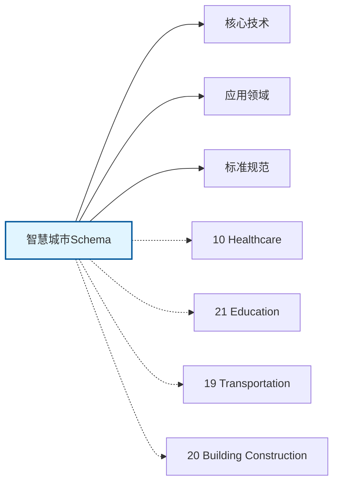

# 智慧城市Schema思维导图

## 📑 目录

- [智慧城市Schema思维导图](#智慧城市schema思维导图)
  - [📑 目录](#-目录)
  - [1. 思维导图概述](#1-思维导图概述)
    - [1.1 导图结构](#11-导图结构)
    - [1.2 核心概念](#12-核心概念)
    - [1.3 关联主题](#13-关联主题)
  - [2. 完整思维导图](#2-完整思维导图)
  - [3. 主要分支详解](#3-主要分支详解)
    - [3.1 城市大脑](#31-城市大脑)
    - [3.2 智慧交通](#32-智慧交通)
    - [3.3 公共安全](#33-公共安全)
    - [3.4 环境监测](#34-环境监测)
    - [3.5 市民服务](#35-市民服务)
  - [4. Mermaid可视化](#4-mermaid可视化)
    - [4.1 思维导图Mermaid图](#41-思维导图mermaid图)
    - [4.2 关联主题图](#42-关联主题图)

---

## 1. 思维导图概述

本文档以思维导图的形式展示智慧城市Schema
的知识体系结构，帮助理解各个子领域之间的关系。

### 1.1 导图结构

思维导图分为以下主要分支：

1. **城市大脑**: 数据中台, AI决策, 事件协同...
2. **智慧交通**: 信号控制, 智能停车, 公交优先...
3. **公共安全**: 视频监控, 智慧消防, 应急联动...
4. **环境监测**: 空气质量, 水质监测, 噪声监测...
5. **市民服务**: 一网通办, 智慧医疗, 智慧教育...

### 1.2 核心概念

智慧城市Schema的核心概念包括：

- **Schema定义**: 领域特定的数据结构和语义规范
- **标准化**: 遵循行业标准和最佳实践
- **互操作性**: 不同系统之间的数据交换能力
- **可扩展性**: 支持业务增长和变化的能力

### 1.3 关联主题

本主题与以下主题有关联：

- **10_Healthcare**: 医疗健康Schema
- **21_Education**: 教育行业Schema
- **19_Transportation**: 交通运输Schema
- **20_Building_Construction**: 建筑工程Schema

---

## 2. 完整思维导图

```text
智慧城市Schema
│

├─ 1. 城市大脑
│   ├─ 数据中台
│   ├─ AI决策
│   ├─ 事件协同
│   ├─ 应急指挥

├─ 2. 智慧交通
│   ├─ 信号控制
│   ├─ 智能停车
│   ├─ 公交优先
│   ├─ MaaS出行

├─ 3. 公共安全
│   ├─ 视频监控
│   ├─ 智慧消防
│   ├─ 应急联动
│   ├─ 治安防控

├─ 4. 环境监测
│   ├─ 空气质量
│   ├─ 水质监测
│   ├─ 噪声监测
│   ├─ 垃圾分类

├─ 5. 市民服务
│   ├─ 一网通办
│   ├─ 智慧医疗
│   ├─ 智慧教育
│   ├─ 社区服务
│
└─ 标准体系
    ├─ 国际标准
    │   ├─ ISO系列标准
    │   └─ IEC系列标准
    ├─ 行业标准
    │   ├─ 行业协会标准
    │   └─ 事实标准
    └─ 技术规范
        ├─ API规范
        ├─ 数据格式
        └─ 协议规范

├─ 技术架构
    │
    ├─ 数据层
    │   ├─ 数据模型
    │   ├─ 存储方案
    │   └─ 数据治理
    │
    ├─ 服务层
    │   ├─ 业务服务
    │   ├─ 集成服务
    │   └─ 公共服务
    │
    ├─ 应用层
    │   ├─ 业务应用
    │   ├─ 移动应用
    │   └─ 分析应用
    │
    └─ 接入层
        ├─ API网关
        ├─ 消息总线
        └─ 文件交换

├─ 集成模式
    │
    ├─ 系统间集成
    │   ├─ ESB总线
    │   ├─ API集成
    │   └─ 消息队列
    │
    ├─ 数据集成
    │   ├─ ETL流程
    │   ├─ 数据同步
    │   └─ 主数据管理
    │
    └─ 流程集成
        ├─ BPM编排
        ├─ 事件驱动
        └─ 微服务编排

├─ 安全体系
    │
    ├─ 身份认证
    │   ├─ 单点登录
    │   ├─ 多因素认证
    │   └─ 零信任架构
    │
    ├─ 访问控制
    │   ├─ 基于角色RBAC
    │   ├─ 基于属性ABAC
    │   └─ 最小权限原则
    │
    ├─ 数据安全
    │   ├─ 加密存储
    │   ├─ 传输加密
    │   └─ 数据脱敏
    │
    └─ 合规审计
        ├─ 日志记录
        ├─ 合规检查
        └─ 风险评估

└─ 实施方法
    │
    ├─ 方法论
    │   ├─ 敏捷开发
    │   ├─ DevOps
    │   └─ 领域驱动设计
    │
    ├─ 工具链
    │   ├─ 建模工具
    │   ├─ 开发框架
    │   └─ 测试工具
    │
    └─ 最佳实践
        ├─ 设计模式
        ├─ 代码规范
        └─ 运维规范
```

---

## 3. 主要分支详解

### 3.1 城市大脑

```text
城市大脑
    ├─ 数据中台
    ├─ AI决策
    ├─ 事件协同
    ├─ 应急指挥
```

### 3.2 智慧交通

```text
智慧交通
    ├─ 信号控制
    ├─ 智能停车
    ├─ 公交优先
    ├─ MaaS出行
```

### 3.3 公共安全

```text
公共安全
    ├─ 视频监控
    ├─ 智慧消防
    ├─ 应急联动
    ├─ 治安防控
```

### 3.4 环境监测

```text
环境监测
    ├─ 空气质量
    ├─ 水质监测
    ├─ 噪声监测
    ├─ 垃圾分类
```

### 3.5 市民服务

```text
市民服务
    ├─ 一网通办
    ├─ 智慧医疗
    ├─ 智慧教育
    ├─ 社区服务
```


---

## 4. Mermaid可视化

### 4.1 思维导图Mermaid图



### 4.2 关联主题图



---

**参考文档**：

- `../README.md` - 主题总览
- `Knowledge_Matrix.md` - 多维知识矩阵

**创建时间**：2026-02-16
**最后更新**：2026-02-16
