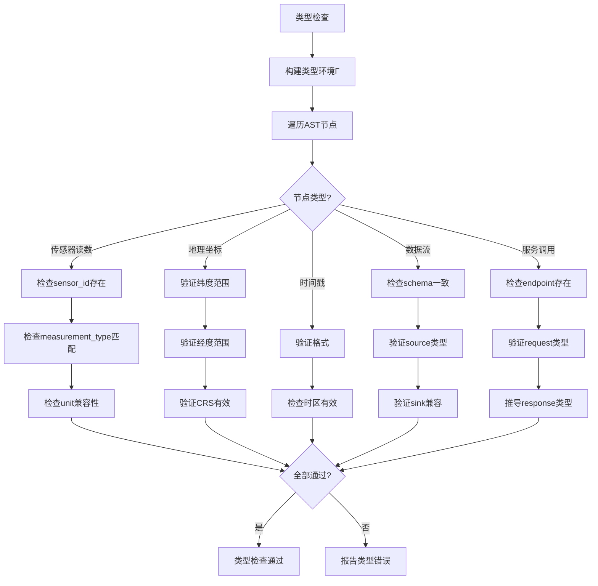
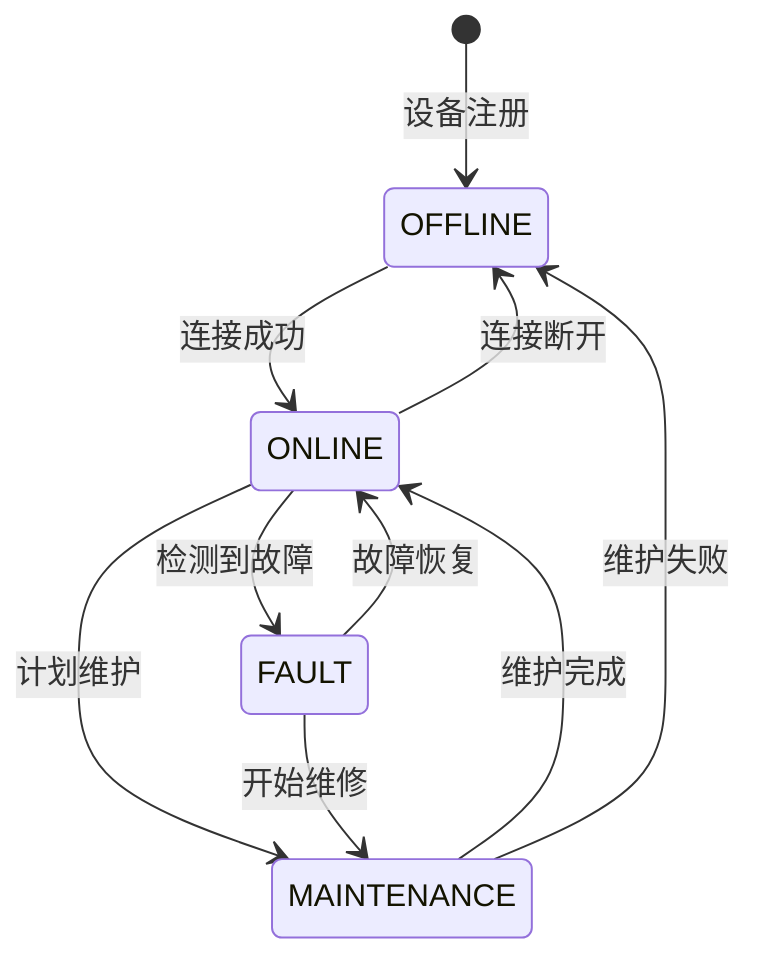
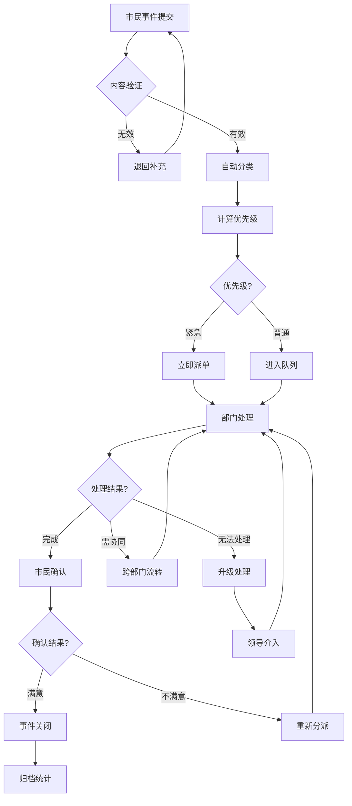
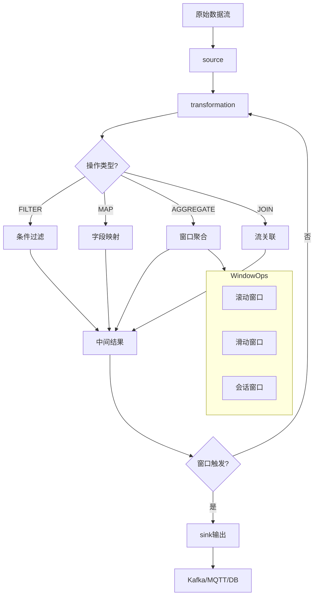

# 智慧城市Schema形式语法与语义分析视图

**版本**: v1.0
**创建日期**: 2026-02-15
**标准**: ISO 37120, ISO/IEC 30141, IEC 61850

---

## 📑 目录

- [智慧城市Schema形式语法与语义分析视图](#智慧城市schema形式语法与语义分析视图)
  - [📑 目录](#-目录)
  - [1. 形式文法定义](#1-形式文法定义)
    - [1.1 EBNF文法](#11-ebnf文法)
      - [1.1.1 智慧城市核心概念文法](#111-智慧城市核心概念文法)
      - [1.1.2 辅助定义](#112-辅助定义)
    - [1.2 语法规则](#12-语法规则)
      - [1.2.1 命名规范与约束](#121-命名规范与约束)
      - [1.2.2 层级关系约束](#122-层级关系约束)
  - [2. 形式语义定义](#2-形式语义定义)
    - [2.1 指称语义 (Denotational Semantics)](#21-指称语义-denotational-semantics)
      - [2.1.1 语义域定义](#211-语义域定义)
      - [2.1.2 设备语义](#212-设备语义)
      - [2.1.3 数据流语义](#213-数据流语义)
      - [2.1.4 市民事件语义](#214-市民事件语义)
    - [2.2 操作语义 (Operational Semantics)](#22-操作语义-operational-semantics)
      - [2.2.1 大步语义 (Big-Step Semantics)](#221-大步语义-big-step-semantics)
      - [2.2.2 小步语义 (Small-Step Semantics)](#222-小步语义-small-step-semantics)
      - [2.2.3 事件处理语义](#223-事件处理语义)
    - [2.3 公理语义 (Axiomatic Semantics)](#23-公理语义-axiomatic-semantics)
      - [2.3.1 Hoare三元组](#231-hoare三元组)
      - [2.3.2 推理规则](#232-推理规则)
      - [2.3.3 智慧城市特定公理](#233-智慧城市特定公理)
      - [2.3.4 循环不变式示例](#234-循环不变式示例)
  - [3. 类型系统](#3-类型系统)
    - [3.1 基本类型](#31-基本类型)
      - [3.1.1 传感器读数类型](#311-传感器读数类型)
      - [3.1.2 地理坐标类型](#312-地理坐标类型)
      - [3.1.3 时间戳类型](#313-时间戳类型)
    - [3.2 复合类型](#32-复合类型)
      - [3.2.1 设备类型](#321-设备类型)
      - [3.2.2 服务类型](#322-服务类型)
    - [3.3 类型规则](#33-类型规则)
  - [4. 语义等价性](#4-语义等价性)
    - [4.1 程序等价定义](#41-程序等价定义)
    - [4.2 等价变换规则](#42-等价变换规则)
  - [5. Mermaid可视化](#5-mermaid可视化)
    - [5.1 类型检查流程](#51-类型检查流程)
    - [5.2 设备状态机](#52-设备状态机)
    - [5.3 事件处理流程](#53-事件处理流程)
    - [5.4 数据流处理语义](#54-数据流处理语义)

---

## 1. 形式文法定义

### 1.1 EBNF文法

#### 1.1.1 智慧城市核心概念文法

```ebnf
(* 智慧城市Schema核心文法 - 基于ISO/IEC 30141物联网参考架构 *)

SmartCitySchema ::= 'SMART_CITY' Identifier
                    [CityInterface]
                    CityBody
                    'END_SMART_CITY'

CityInterface ::= DomainDeclaration*
                  ServiceDeclaration*

CityBody ::= InfrastructureLayer
             CommunicationLayer
             DataLayer
             ApplicationLayer

(* ========== Device (设备) ========== *)
Device ::= 'DEVICE' DeviceType Identifier
           [DeviceInterface]
           DeviceBody
           'END_DEVICE'

DeviceType ::=
    'SENSOR'          (* 传感器 *)
  | 'ACTUATOR'        (* 执行器 *)
  | 'GATEWAY'         (* 网关 *)
  | 'EDGE_NODE'       (* 边缘节点 *)

DeviceInterface ::=
    PhysicalInterface
  | CommunicationInterface
  | PowerInterface

PhysicalInterface ::=
    'PHYSICAL'
    ('MOUNTING' ':' MountingType)
    ('DIMENSIONS' ':' Dimensions)
    ('WEIGHT' ':' Weight)
    ('IP_RATING' ':' IPCode)
    'END_PHYSICAL'

MountingType ::= 'WALL' | 'POLE' | 'CEILING' | 'GROUND' | 'MOBILE'
IPCode ::= 'IP' Digit Digit

CommunicationInterface ::=
    'COMMUNICATION'
    ProtocolSpec+
    'END_COMMUNICATION'

ProtocolSpec ::=
    'PROTOCOL' ProtocolName
    'FREQUENCY' ':' Frequency
    'RANGE' ':' Range
    'DATA_RATE' ':' DataRate
    'END_PROTOCOL'

ProtocolName ::=
    'LoRaWAN' | 'NB_IoT' | '5G_NR' | 'WiFi6'
  | 'BLE' | 'Zigbee' | 'Modbus' | 'OPC_UA'

PowerInterface ::=
    'POWER'
    ('TYPE' ':' PowerType)
    ('CAPACITY' ':' Capacity)
    ('LIFETIME' ':' Lifetime)
    'END_POWER'

PowerType ::= 'AC_MAINS' | 'DC_SOLAR' | 'BATTERY' | 'ENERGY_HARVESTING'

DeviceBody ::=
    SensorBody      (* 传感器特有 *)
  | ActuatorBody    (* 执行器特有 *)
  | GatewayBody     (* 网关特有 *)
  | EdgeNodeBody    (* 边缘节点特有 *)

SensorBody ::=
    'SENSOR_SPEC'
    ('MEASUREMENT' ':' MeasurementType)
    ('UNIT' ':' Unit)
    ('PRECISION' ':' Precision)
    ('SAMPLING_RATE' ':' SamplingRate)
    ('CALIBRATION' ':' CalibrationDate)
    'END_SENSOR_SPEC'

MeasurementType ::=
    'TEMPERATURE' | 'HUMIDITY' | 'PRESSURE' | 'LIGHT'
  | 'NOISE' | 'AIR_QUALITY' | 'TRAFFIC_FLOW' | 'OCCUPANCY'
  | 'VIBRATION' | 'CURRENT' | 'VOLTAGE' | 'POWER'

ActuatorBody ::=
    'ACTUATOR_SPEC'
    ('ACTION' ':' ActionType)
    ('RESPONSE_TIME' ':' ResponseTime)
    ('DUTY_CYCLE' ':' DutyCycle)
    'END_ACTUATOR_SPEC'

ActionType ::= 'ON_OFF' | 'DIMMING' | 'VALVE_CONTROL' | 'MOTOR_CONTROL'

GatewayBody ::=
    'GATEWAY_SPEC'
    ('MAX_DEVICES' ':' Integer)
    ('COVERAGE_RADIUS' ':' Distance)
    ('BACKHAUL' ':' BackhaulType)
    'END_GATEWAY_SPEC'

BackhaulType ::= 'ETHERNET' | 'FIBER' | '4G' | '5G' | 'SATELLITE'

EdgeNodeBody ::=
    'EDGE_SPEC'
    ('COMPUTE' ':' ComputeSpec)
    ('STORAGE' ':' StorageSpec)
    ('AI_ACCELERATION' ':' Boolean)
    'END_EDGE_SPEC'

ComputeSpec ::= 'CPU_CORES' ':' Integer 'MEMORY' ':' Size
StorageSpec ::= 'TYPE' ':' StorageType 'CAPACITY' ':' Size
StorageType ::= 'SSD' | 'EMMC' | 'SD_CARD'

(* ========== Service (服务) ========== *)
Service ::= 'SERVICE' ServiceType Identifier
            [ServiceInterface]
            ServiceBody
            'END_SERVICE'

ServiceType ::=
    'CITY_API'           (* 城市服务API *)
  | 'MICROSERVICE'       (* 微服务 *)
  | 'EVENT_STREAM'       (* 事件流 *)
  | 'ANALYTICS_SERVICE'  (* 分析服务 *)

ServiceInterface ::=
    'INTERFACE'
    ('ENDPOINTS' ':' EndpointList)
    ('AUTHENTICATION' ':' AuthMethod)
    ('RATE_LIMIT' ':' RateLimit)
    'END_INTERFACE'

EndpointList ::= Endpoint {',' Endpoint}
Endpoint ::= ('REST' URI) | ('GRPC' ServiceName) | ('MQTT' Topic)

AuthMethod ::= 'API_KEY' | 'OAUTH2' | 'JWT' | 'MTLS'
RateLimit ::= 'REQUESTS_PER_MIN' ':' Integer

ServiceBody ::=
    'IMPLEMENTATION'
    ('LANGUAGE' ':' ProgrammingLanguage)
    ('RUNTIME' ':' Runtime)
    ('SCALING' ':' ScalingPolicy)
    ('DEPENDENCIES' ':' DependencyList)
    'END_IMPLEMENTATION'

ProgrammingLanguage ::= 'Java' | 'Python' | 'Go' | 'Node.js' | 'Rust' | 'C++'
Runtime ::= 'CONTAINER' | 'SERVERLESS' | 'VM'
ScalingPolicy ::= 'HORIZONTAL' | 'VERTICAL' | 'AUTO'

(* ========== DataStream (数据流) ========== *)
DataStream ::= 'DATA_STREAM' StreamType Identifier
               [StreamInterface]
               StreamBody
               'END_DATA_STREAM'

StreamType ::=
    'REAL_TIME'       (* 实时流 *)
  | 'BATCH'           (* 批处理 *)
  | 'LAKEHOUSE'       (* 湖仓一体 *)

StreamInterface ::=
    'SCHEMA'
    FieldDefinition+
    'END_SCHEMA'

FieldDefinition ::=
    FieldName ':' DataStreamType ['NOT_NULL'] ['DEFAULT' DefaultValue]

DataStreamType ::=
    PrimitiveType
  | SensorReadingType
  | GeospatialType
  | TemporalType

PrimitiveType ::= 'STRING' | 'INTEGER' | 'LONG' | 'FLOAT' | 'DOUBLE' | 'BOOLEAN' | 'BYTES'

SensorReadingType ::=
    'SENSOR_ID' ':' String
    'TIMESTAMP' ':' Timestamp
    'VALUE' ':' Double
    'QUALITY' ':' QualityCode
    'LOCATION' ':' GeoCoordinate

QualityCode ::= 'GOOD' | 'UNCERTAIN' | 'BAD' | 'NOT_CONNECTED'

GeospatialType ::= 'GEO_POINT' | 'GEO_POLYGON' | 'GEO_PATH' | 'GEO_GRID'
TemporalType ::= 'TIMESTAMP' | 'DATE' | 'TIME' | 'INTERVAL' | 'DURATION'

StreamBody ::=
    'PROCESSING'
    ('SOURCE' ':' DataSource)
    ('TRANSFORMATION' ':' TransformSpec)
    ('SINK' ':' DataSink)
    ('WINDOWING' ':' WindowSpec)
    'END_PROCESSING'

DataSource ::=
    'KAFKA' TopicName
  | 'MQTT' BrokerURL TopicPattern
  | 'PULSAR' TopicName
  | 'FILES' Path Pattern

TransformSpec ::=
    'FILTER' ':' FilterExpression
  | 'MAP' ':' MapExpression
  | 'AGGREGATE' ':' AggregateFunction
  | 'JOIN' ':' JoinSpec

WindowSpec ::=
    'TUMBLING' Duration
  | 'SLIDING' Duration SlideStep
  | 'SESSION' TimeoutDuration

(* ========== CityAsset (城市资产) ========== *)
CityAsset ::= 'ASSET' AssetType Identifier
              [AssetInterface]
              AssetBody
              'END_ASSET'

AssetType ::=
    'ROAD'            (* 道路 *)
  | 'BUILDING'        (* 建筑 *)
  | 'PIPELINE'        (* 管网 *)
  | 'PUBLIC_FACILITY' (* 公共设施 *)
  | 'VEHICLE'         (* 车辆 *)

AssetInterface ::=
    'ASSET_SPEC'
    ('CATEGORY' ':' AssetCategory)
    ('OWNER' ':' OwnerType)
    ('MAINTENANCE' ':' MaintenanceSchedule)
    'END_ASSET_SPEC'

AssetCategory ::=
    'CRITICAL' | 'ESSENTIAL' | 'IMPORTANT' | 'GENERAL'
OwnerType ::= 'MUNICIPAL' | 'PRIVATE' | 'MIXED'

AssetBody ::=
    'GEOMETRY'
    GeometricRepresentation
    'END_GEOMETRY'
    'PROPERTIES'
    AssetProperty+
    'END_PROPERTIES'

GeometricRepresentation ::=
    ('POINT' GeoCoordinate)
  | ('LINESTRING' GeoCoordinateList)
  | ('POLYGON' GeoCoordinateList)
  | ('MESH' MeshDefinition)

AssetProperty ::=
    'CONSTRUCTION_DATE' ':' Date
  | 'MATERIAL' ':' MaterialType
  | 'CAPACITY' ':' CapacityValue
  | 'CONDITION' ':' ConditionRating

ConditionRating ::= 'EXCELLENT' | 'GOOD' | 'FAIR' | 'POOR' | 'CRITICAL'

(* ========== CitizenEvent (市民事件) ========== *)
CitizenEvent ::= 'EVENT' EventType Identifier
                 [EventInterface]
                 EventBody
                 'END_EVENT'

EventType ::=
    'REPORT'          (* 报事 *)
  | 'COMPLAINT'       (* 投诉 *)
  | 'SUGGESTION'      (* 建议 *)
  | 'PARTICIPATION'   (* 参与 *)

EventInterface ::=
    'EVENT_SPEC'
    ('URGENCY' ':' UrgencyLevel)
    ('CATEGORY' ':' EventCategory)
    ('CHANNEL' ':' SubmissionChannel)
    'END_EVENT_SPEC'

UrgencyLevel ::= 'EMERGENCY' | 'URGENT' | 'NORMAL' | 'LOW'
EventCategory ::=
    'INFRASTRUCTURE' | 'ENVIRONMENT' | 'TRAFFIC' | 'SECURITY'
  | 'CIVIL_AFFAIRS' | 'ECONOMY' | 'CULTURE' | 'OTHER'
SubmissionChannel ::= 'APP' | 'WEB' | 'HOTLINE' | 'ON_SITE' | 'SOCIAL_MEDIA'

EventBody ::=
    'CONTENT'
    ('TITLE' ':' String)
    ('DESCRIPTION' ':' Text)
    ('LOCATION' ':' GeoCoordinate)
    ('ATTACHMENTS' ':' AttachmentList)
    'END_CONTENT'
    'WORKFLOW'
    ('STATUS' ':' EventStatus)
    ('ASSIGNED_TO' ':' Department)
    ('TIMELINE' ':' EventTimeline)
    'END_WORKFLOW'

EventStatus ::= 'SUBMITTED' | 'REVIEWING' | 'ASSIGNED' | 'PROCESSING' | 'RESOLVED' | 'CLOSED' | 'REJECTED'

EventTimeline ::=
    ('CREATED_AT' ':' Timestamp)
    ('ASSIGNED_AT' ':' Timestamp)
    ('COMPLETED_AT' ':' Timestamp)
    ('DEADLINE' ':' Timestamp)
```

#### 1.1.2 辅助定义

```ebnf
(* 标识符和基本类型 *)
Identifier ::= Letter {Letter | Digit | '_'}
Letter ::= 'a'..'z' | 'A'..'Z'
Digit ::= '0'..'9'

String ::= '"' {Character} '"'
Text ::= '"' {Character | '\n'} '"'
Integer ::= ['-'] Digit {Digit}
Long ::= Integer 'L'
Float ::= Integer '.' Digit {Digit} ['f']
Double ::= Integer '.' Digit {Digit}
Boolean ::= 'TRUE' | 'FALSE'

(* 地理坐标 *)
GeoCoordinate ::= 'LAT' ':' Latitude 'LON' ':' Longitude
Latitude ::= ['-'] Digit {Digit} '.' Digit {Digit}
Longitude ::= ['-'] Digit {Digit} '.' Digit {Digit}
GeoCoordinateList ::= GeoCoordinate {',' GeoCoordinate}

(* 时间和尺寸 *)
Timestamp ::= ISO8601Format | UnixEpoch
Date ::= Year '-' Month '-' Day
Time ::= Hour ':' Minute ':' Second ['.' Millisecond]
Duration ::= Integer TimeUnit
TimeUnit ::= 'MS' | 'S' | 'MIN' | 'H' | 'D'
Size ::= Integer SizeUnit
SizeUnit ::= 'B' | 'KB' | 'MB' | 'GB' | 'TB'
Distance ::= Integer DistanceUnit
DistanceUnit ::= 'M' | 'KM'
Frequency ::= Integer FrequencyUnit
FrequencyUnit ::= 'HZ' | 'KHZ' | 'MHZ' | 'GHZ'
DataRate ::= Integer DataRateUnit
DataRateUnit ::= 'BPS' | 'KBPS' | 'MBPS'
```

### 1.2 语法规则

#### 1.2.1 命名规范与约束

```
约束1: 标识符唯一性
  ∀i1, i2 ∈ Identifier : i1 ≠ i2 ⟹ name(i1) ≠ name(i2)

约束2: 设备ID格式
  device_id = CityCode(6) + DistrictCode(3) + TypeCode(2) + Sequence(6)
  示例: 310105SE000123 (上海市长宁区传感器第123号)

约束3: 坐标有效性
  ∀coord ∈ GeoCoordinate :
    -90.0 ≤ coord.latitude ≤ 90.0 ∧
    -180.0 ≤ coord.longitude ≤ 180.0

约束4: 时间戳有效性
  ∀ts ∈ Timestamp : ts ≥ 2020-01-01T00:00:00Z
  (智慧城市系统部署起始时间)

约束5: 传感器采样率约束
  ∀sensor ∈ Device, sensor.type = 'SENSOR' :
    sensor.sampling_rate ≤ 1000 Hz (物理传感器上限)
```

#### 1.2.2 层级关系约束

```
层级1: 物理层
  Device ∈ PhysicalLayer
  ∀d ∈ Device : d.location ∈ CityBoundary

层级2: 通信层
  Gateway ∈ CommunicationLayer
  ∀g ∈ Gateway : connected_devices(g) ≤ g.max_devices

层级3: 数据层
  DataStream ∈ DataLayer
  ∀s ∈ DataStream : source(s) ∈ Device ∪ Gateway ∪ ExternalSystem

层级4: 应用层
  Service ∈ ApplicationLayer
  ∀svc ∈ Service : depends_on(svc) ⊆ Service ∪ DataStream

层级5: 交互层
  CitizenEvent ∈ InteractionLayer
  ∀e ∈ CitizenEvent : reporter(e) ∈ Citizen ∪ System
```

---

## 2. 形式语义定义

### 2.1 指称语义 (Denotational Semantics)

#### 2.1.1 语义域定义

```
D[SmartCitySchema] : Environment → WorldState → WorldState

WorldState = Time × CityState × CitizenState × EnvironmentState

CityState = {
  devices: DeviceID → DeviceState,
  assets: AssetID → AssetState,
  services: ServiceID → ServiceState,
  data_streams: StreamID → StreamState
}

DeviceState = {
  location: GeoCoordinate,
  status: DeviceStatus,
  last_reading: SensorReading ∪ {⊥},
  connection: ConnectionStatus,
  battery: Percentage ∪ {⊥}
}

DeviceStatus = 'ONLINE' | 'OFFLINE' | 'MAINTENANCE' | 'FAULT'
ConnectionStatus = 'CONNECTED' | 'DISCONNECTED' | 'DEGRADED'
Percentage = [0.0, 100.0]

SensorReading = {
  timestamp: Timestamp,
  sensor_id: DeviceID,
  value: Real,
  unit: Unit,
  quality: QualityCode
}

AssetState = {
  geometry: GeometricObject,
  properties: PropertyName → PropertyValue,
  condition: ConditionRating,
  attached_devices: Set(DeviceID)
}

ServiceState = {
  endpoint: URI,
  status: ServiceStatus,
  load: CurrentLoad,
  latency: AverageLatency,
  availability: Percentage
}

ServiceStatus = 'RUNNING' | 'DEGRADED' | 'DOWN' | 'SCALING'

StreamState = {
  schema: SchemaDefinition,
  throughput: EventsPerSecond,
  latency: ProcessingLatency,
  backlog: MessageCount
}

CitizenState = {
  active_events: EventID → EventState,
  participation_score: CitizenID → Score,
  satisfaction: ServiceID → Rating
}

EventState = {
  event_type: EventType,
  status: EventStatus,
  timeline: EventTimeline,
  priority: PriorityScore
}

Environment = Identifier → Denotable
Denotable = DeviceLocation | ServiceEndpoint | DataSchema | TypeDefinition
```

#### 2.1.2 设备语义

```
(* 设备状态转换 *)
D[Device] : DeviceCommand → DeviceState → DeviceState

(* 传感器读数语义 *)
D[SensorReading] : Environment → Timestamp → SensorReading

E[reading.value] env t =
  let sensor = lookup(env, reading.sensor_id) in
  let raw = acquire(sensor.physical_interface, t) in
  apply_calibration(raw, sensor.calibration_params)

(* 执行器动作语义 *)
D[ActuatorAction] : ActionCommand → DeviceState → DeviceState

S[action] env state =
  case action.action_type of
    'ON_OFF' → state{output = action.value}
    'DIMMING' → state{output = action.level, level ∈ [0, 100]}
    'VALVE_CONTROL' → state{position = action.position}
    'MOTOR_CONTROL' → state{speed = action.speed, direction = action.direction}
```

#### 2.1.3 数据流语义

```
(* 数据流处理语义 *)
D[DataStream] : InputEvent → StreamState → (OutputEvent × StreamState)

(* 窗口操作语义 *)
E[window(events, TUMBLING(size))] =
  partition(events, λe. floor(e.timestamp / size))

E[window(events, SLIDING(size, step))] =
  {e | e ∈ events ∧ e.timestamp ∈ [n×step, n×step+size), n ∈ ℕ}

(* 聚合操作语义 *)
E[aggregate(window, function)] =
  case function of
    'SUM' → Σ(e.value for e in window)
    'AVG' → mean(e.value for e in window)
    'MAX' → max(e.value for e in window)
    'MIN' → min(e.value for e in window)
    'COUNT' → |window|
```

#### 2.1.4 市民事件语义

```
(* 事件生命周期语义 *)
D[CitizenEvent] : EventSubmission → EventState → EventState

(* 事件优先级计算 *)
E[priority(event)] env =
  let urgency_score = case event.urgency of
    'EMERGENCY' → 100
    'URGENT' → 75
    'NORMAL' → 50
    'LOW' → 25
  in
  let category_score = case event.category of
    'SECURITY' → 20
    'INFRASTRUCTURE' → 15
    'TRAFFIC' → 10
    _ → 5
  in
  urgency_score + category_score + citizen_reputation(event.reporter)

(* 事件工作流状态机 *)
S[event_workflow] env state =
  case state.status of
    'SUBMITTED' → if valid(event) then 'REVIEWING' else 'REJECTED'
    'REVIEWING' → 'ASSIGNED'  (* 经过人工或AI审核 *)
    'ASSIGNED' → 'PROCESSING'
    'PROCESSING' → if resolved(event) then 'RESOLVED' else state.status
    'RESOLVED' → if confirmed(event) then 'CLOSED' else 'PROCESSING'
```

### 2.2 操作语义 (Operational Semantics)

#### 2.2.1 大步语义 (Big-Step Semantics)

```
配置: ⟨Expression, WorldState⟩ ⇓ Value
      ⟨Command, WorldState⟩ ⇓ WorldState'

(* 传感器读数获取 *)
⟨sensor.read(), σ⟩ ⇓ v                          (E-SensorRead)
─────────────────────────────────
where v = read_physical(sensor.id, σ.time)

(* 设备状态更新 *)
⟨device.update(cmd), σ⟩ ⇓ σ[device.id ↦ new_state]  (E-DeviceUpdate)
─────────────────────────────────
where new_state = execute(cmd, σ.devices[device.id])

(* 数据流事件处理 *)
⟨stream.process(event), σ⟩ ⇓ result                (E-StreamProcess)
─────────────────────────────────
where result = apply_transformations(event, stream.schema)

(* 服务调用 *)
⟨service.invoke(request), σ⟩ ⇓ response            (E-ServiceInvoke)
─────────────────────────────────
where response = execute(service.impl, request) ∧ update_metrics(service, σ)

(* 市民事件提交 *)
⟨event.submit(content), σ⟩ ⇓ σ'                    (E-EventSubmit)
─────────────────────────────────
where event_id = generate_id() ∧
      σ' = σ{citizen.events[event_id] ↦ create_event(content, σ.time)}
```

#### 2.2.2 小步语义 (Small-Step Semantics)

```
配置: ⟨Command, WorldState⟩ → ⟨Command', WorldState'⟩
      或 ⟨Command, WorldState⟩ → WorldState'  (终止)

(* 设备命令序列 *)
⟨skip ; cmd, σ⟩ → ⟨cmd, σ⟩                      (S-Seq-Skip)

⟨cmd1, σ⟩ → ⟨cmd1', σ'⟩                         (S-Seq)
─────────────────────────────────
⟨cmd1 ; cmd2, σ⟩ → ⟨cmd1' ; cmd2, σ'⟩

(* 条件设备控制 *)
⟨if condition then cmd1 else cmd2, σ⟩ → ⟨cmd1, σ⟩  (S-IfTrue)
when eval(condition, σ) = true

⟨if condition then cmd1 else cmd2, σ⟩ → ⟨cmd2, σ⟩  (S-IfFalse)
when eval(condition, σ) = false

(* 数据流窗口触发 *)
⟨window.check(t), σ⟩ → ⟨window.emit(batch), σ⟩     (S-WindowTrigger)
when t ≥ window.next_trigger_time

(* 事件状态转换 *)
⟨event.transition(target), σ⟩ → σ[event.status ↦ target]  (S-EventTransition)
when valid_transition(event.status, target)
```

#### 2.2.3 事件处理语义

```
(* 复杂事件处理 (CEP) *)
⟨pattern.detect(event_stream), σ⟩ ⇓ matched_events  (E-PatternDetect)
─────────────────────────────────
where matched_events = find_sequences(event_stream, pattern.definition)

(* 事件关联 *)
⟨event1 correlate event2, σ⟩ ⇓ correlation_score    (E-EventCorrelate)
─────────────────────────────────
correlation_score = spatial_proximity(e1, e2) × temporal_proximity(e1, e2) × semantic_similarity(e1, e2)

(* 服务编排 *)
⟨orchestrate(services, workflow), σ⟩ ⇓ result       (E-Orchestrate)
─────────────────────────────────
result = foldl(λacc.λsvc. execute(svc, acc), workflow.initial, services)
```

### 2.3 公理语义 (Axiomatic Semantics)

#### 2.3.1 Hoare三元组

```
{P} C {Q}

含义: 如果前置条件P在执行命令C前成立，
      且C终止，
      则后置条件Q在C执行后成立。
```

#### 2.3.2 推理规则

```
(* 设备控制公理 *)
{device.status = 'ONLINE'} device.command(cmd) {device.state = f(cmd)}  (Axiom-DeviceCmd)

(* 传感器读数公理 *)
{sensor.calibrated ∧ sensor.connected} sensor.read()
{reading.quality = 'GOOD' ∧ |reading.timestamp - now| < ε}  (Axiom-SensorRead)

(* 数据流处理公理 *)
{stream.schema_valid ∧ event.conforms_to(schema)} stream.process(event)
{stream.state.consistent ∧ output.conforms_to(target_schema)}  (Axiom-StreamProcess)

(* 服务调用公理 *)
{service.available ∧ request.valid} service.invoke(request)
{response.received ∧ response.valid}  (Axiom-ServiceInvoke)

(* 事件提交公理 *)
{event.content_valid ∧ reporter.authorized} event.submit(content)
{event.created ∧ event.tracked}  (Axiom-EventSubmit)

(* 顺序规则 *)
{P} C1 {R}  {R} C2 {Q}                          (Rule-Seq)
─────────────────────────────────
{P} C1 ; C2 {Q}

(* 条件规则 *)
{P ∧ b} C1 {Q}  {P ∧ ¬b} C2 {Q}                 (Rule-If)
─────────────────────────────────
{P} if b then C1 else C2 {Q}

(* 循环规则 *)
{I ∧ b} C {I}                                   (Rule-While)
─────────────────────────────────
{I} while b do C {I ∧ ¬b}
```

#### 2.3.3 智慧城市特定公理

```
(* 数据隐私公理 *)
{true} collect(data) {data.anonymized ∨ citizen.consent_obtained}  (Axiom-Privacy)

(* 服务可用性公理 *)
{service.deployed} operation(window)
{service.uptime ≥ SLA.threshold}  (Axiom-Availability)

(* 响应时间约束公理 *)
{emergency.received} emergency.response()
{response.time ≤ 5_minutes}  (Axiom-ResponseTime)

(* 数据一致性公理 *)
{stream.replicated} stream.write(data)
{∀replica ∈ stream.replicas : replica.data = data}  (Axiom-Consistency)

(* 资源约束公理 *)
{resource.available ≥ required} service.scale(up)
{service.capacity ≥ required ∧ resource.available ≥ 0}  (Axiom-Resource)
```

#### 2.3.4 循环不变式示例

```
(* 数据聚合程序不变式 *)
Program: aggregate := 0; count := 0;
          WHILE has_next(sensor_stream) DO
            reading := next(sensor_stream);
            aggregate := aggregate + reading.value;
            count := count + 1
          END_WHILE;
          average := aggregate / count

目标: 证明 {sensor_stream.valid} program {average = mean(sensor_stream)}

循环不变式 I:
  aggregate = Σ(readings[0..count-1].value) ∧
  count = |readings_processed| ∧
  readings_processed ⊆ sensor_stream

证明步骤:
1. 初始化: {sensor_stream.valid}
           aggregate := 0; count := 0
           {aggregate = 0 ∧ count = 0} ⟹ I

2. 保持: {I ∧ has_next(stream)}
         reading := next(stream);
         aggregate := aggregate + reading.value;
         count := count + 1
         {aggregate = Σ(readings[0..count-1].value)} ⟹ I

3. 终止: {I ∧ ¬has_next(stream)}
         ⇒ {aggregate = Σ(all_readings.value)}
         ⇒ {average = aggregate / count = mean(sensor_stream)}
```

---

## 3. 类型系统

### 3.1 基本类型

#### 3.1.1 传感器读数类型

```
SensorReading<T> = {
  sensor_id: DeviceID,
  timestamp: Timestamp,
  value: T,
  unit: Unit,
  quality: QualityCode
}

(* 类型参数T可以是 *)
T ::= Temperature | Pressure | Humidity | LightLevel |
      NoiseLevel | AirQualityIndex | FlowRate | OccupancyCount

(* 单位类型 *)
Unit ::=
  (* 温度 *) 'CELSIUS' | 'FAHRENHEIT' | 'KELVIN'
  (* 压力 *) 'PASCAL' | 'BAR' | 'PSI' | 'HPA'
  (* 湿度 *) 'PERCENT_RH'
  (* 光照 *) 'LUX' | 'WATT_PER_M2'
  (* 噪声 *) 'DB_SPL'
  (* 空气质量 *) 'AQI' | 'UG_PER_M3'
  (* 流量 *) 'M3_PER_S' | 'L_PER_MIN'
  (* 人数 *) 'COUNT'
```

#### 3.1.2 地理坐标类型

```
(* 地理坐标系统 *)
GeoCoordinate = {
  latitude: Latitude,
  longitude: Longitude,
  altitude: Altitude,
  crs: CoordinateReferenceSystem,
  accuracy: Distance
}

Latitude = [-90.0, 90.0]  (* 度 *)
Longitude = [-180.0, 180.0]  (* 度 *)
Altitude = [-500, 9000]  (* 米，相对于WGS84椭球 *)
CoordinateReferenceSystem = 'WGS84' | 'CGCS2000' | 'LOCAL'

(* 地理几何类型 *)
GeometricObject ::=
  Point(GeoCoordinate)
| LineString([GeoCoordinate])  (* 路径 *)
| Polygon([GeoCoordinate])     (* 多边形区域 *)
| MultiPoint([GeoCoordinate])
| MultiLineString([[GeoCoordinate]])
| MultiPolygon([[GeoCoordinate]])
| GeometryCollection([GeometricObject])

(* 空间关系 *)
SpatialRelation ::= 'CONTAINS' | 'WITHIN' | 'INTERSECTS' |
                    'DISJOINT' | 'TOUCHES' | 'OVERLAPS'

spatial_relation(a: GeometricObject, b: GeometricObject, r: SpatialRelation) : Boolean
```

#### 3.1.3 时间戳类型

```
(* 时间类型层次 *)
Temporal ::=
  Instant
| Interval
| Duration
| Period

(* 时刻 *)
Instant = {
  epoch_ms: Long,
  timezone: Timezone,
  precision: TemporalPrecision
}

TemporalPrecision = 'MS' | 'S' | 'MIN' | 'H' | 'D'

(* 时间区间 *)
Interval = {
  start: Instant,
  end: Instant,
  start_inclusive: Boolean,
  end_inclusive: Boolean
}

(* 持续时间 *)
Duration = {
  milliseconds: Long,
  normalized: Boolean
}

(* 周期 *)
Period = {
  start: Instant,
  end: Instant | 'UNBOUNDED',
  frequency: Duration,
  count: Integer | 'UNBOUNDED'
}

(* 时间运算 *)
operations:
  (+) : Instant × Duration → Instant
  (-) : Instant × Instant → Duration
  (∈) : Instant × Interval → Boolean
  (∩) : Interval × Interval → Interval | ∅
  (union) : Interval × Interval → Interval | 'DISJOINT'
```

### 3.2 复合类型

#### 3.2.1 设备类型

```
(* 设备类型层次 *)
Device = Sensor | Actuator | Gateway | EdgeNode

Sensor = DeviceBase & {
  measurement_type: MeasurementType,
  precision: Precision,
  accuracy: Accuracy,
  range: MeasurementRange,
  sampling_rate: Frequency
}

Actuator = DeviceBase & {
  action_type: ActionType,
  response_time: Duration,
  power_consumption: Power,
  duty_cycle: Percentage
}

Gateway = DeviceBase & {
  max_connections: Integer,
  coverage_radius: Distance,
  backhaul: NetworkInterface,
  protocol_support: [Protocol]
}

EdgeNode = DeviceBase & {
  compute: ComputeSpec,
  storage: StorageSpec,
  ai_acceleration: Boolean,
  container_runtime: Boolean
}

DeviceBase = {
  id: DeviceID,
  name: String,
  location: GeoCoordinate,
  status: DeviceStatus,
  firmware_version: Version,
  installation_date: Date,
  maintenance_schedule: MaintenanceSchedule
}
```

#### 3.2.2 服务类型

```
(* 服务类型层次 *)
Service = CityAPI | Microservice | EventStream | AnalyticsService

CityAPI = ServiceBase & {
  endpoints: [RESTEndpoint],
  authentication: AuthMethod,
  rate_limiting: RateLimitPolicy,
  caching: CachePolicy
}

Microservice = ServiceBase & {
  language: ProgrammingLanguage,
  runtime: ContainerRuntime,
  scaling: ScalingPolicy,
  health_checks: [HealthCheck],
  dependencies: [ServiceDependency]
}

EventStream = ServiceBase & {
  schema: StreamSchema,
  source: DataSource,
  transformations: [Transformation],
  windowing: WindowConfig,
  sinks: [DataSink]
}

AnalyticsService = ServiceBase & {
  model: AIModel,
  training_data: DataSource,
  inference_latency: Duration,
  accuracy: Percentage
}

ServiceBase = {
  id: ServiceID,
  name: String,
  version: Version,
  owner: Organization,
  sla: ServiceLevelAgreement,
  status: ServiceStatus
}
```

### 3.3 类型规则

```
(* 常量类型 *)
Γ ⊢ n : INT                              (T-Int)
Γ ⊢ r : REAL                             (T-Real)
Γ ⊢ s : STRING                           (T-String)
Γ ⊢ coord : GeoCoordinate                (T-Geo)
  where valid_coord(coord)
Γ ⊢ ts : Timestamp                       (T-Timestamp)
  where valid_timestamp(ts)

(* 传感器读数类型 *)
Γ ⊢ reading : SensorReading<T>           (T-SensorReading)
─────────────────────────────────
Γ(reading.sensor_id) = Sensor ∧
Γ(reading.sensor_id).measurement_type = T ∧
unit_compatible(reading.unit, T)

(* 地理运算类型 *)
Γ ⊢ a : GeometricObject  Γ ⊢ b : GeometricObject   (T-SpatialOp)
─────────────────────────────────
Γ ⊢ distance(a, b) : Distance

Γ ⊢ a : GeometricObject  Γ ⊢ b : GeometricObject   (T-SpatialRel)
─────────────────────────────────
Γ ⊢ contains(a, b) : BOOL

(* 时间运算类型 *)
Γ ⊢ t : Instant  Γ ⊢ d : Duration        (T-TimeAdd)
─────────────────────────────────
Γ ⊢ t + d : Instant

Γ ⊢ t1 : Instant  Γ ⊢ t2 : Instant       (T-TimeDiff)
─────────────────────────────────
Γ ⊢ t1 - t2 : Duration

Γ ⊢ i : Interval  Γ ⊢ t : Instant        (T-TimeIn)
─────────────────────────────────
Γ ⊢ t ∈ i : BOOL

(* 数据流类型 *)
Γ ⊢ stream : DataStream  Γ ⊢ event : Event  (T-StreamProcess)
─────────────────────────────────
Γ ⊢ stream.process(event) : ProcessedEvent
where event.schema ⊆ stream.input_schema

(* 服务调用类型 *)
Γ ⊢ service : Service  Γ ⊢ request : RequestType  (T-ServiceInvoke)
─────────────────────────────────
Γ ⊢ service.invoke(request) : ResponseType
where request ∈ service.input_types ∧
      ResponseType = service.output_type

(* 子类型规则 *)
SensorReading<Real> ≤ SensorReading<Number>     (Sub-Sensor)
Point ≤ GeometricObject                         (Sub-Geo)
Instant ≤ Temporal                              (Sub-Temporal)
Microservice ≤ Service                          (Sub-Service)

(* 协变/逆变 *)
SensorReading<T> 协变于 T
Function<A, R> 逆变于 A，协变于 R
```

---

## 4. 语义等价性

### 4.1 程序等价定义

```
定义: 两个智慧城市程序P1和P2语义等价 (P1 ≡ P2) 当且仅当:
∀σ, σ' : ⟨P1, σ⟩ ⇓ σ' ⟺ ⟨P2, σ⟩ ⇓ σ'

定义: 两个设备控制序列C1和C2观察等价 (C1 ≈ C2) 当且仅当:
∀σ : observations(⟨C1, σ⟩) = observations(⟨C2, σ⟩)
```

### 4.2 等价变换规则

```
(* 传感器批处理等价 *)
FOR r IN sensor.read_batch(n) DO process(r) END_FOR
≡
sensor.read_batch(n).map(process)

(* 流处理合并等价 *)
stream1.union(stream2).filter(p)
≡
stream1.filter(p).union(stream2.filter(p))

(* 服务调用并行等价 *)
seq(service1.call(), service2.call())
≡
par(service1.call(), service2.call())
when independent(service1, service2)

(* 事件路由等价 *)
IF event.type = 'A' THEN handlerA(event)
ELSIF event.type = 'B' THEN handlerB(event)
ELSE defaultHandler(event)
≡
switch(event.type) {
  'A' → handlerA,
  'B' → handlerB,
  _ → defaultHandler
}(event)

(* 窗口操作等价 *)
stream.window(TUMBLING(5min)).aggregate(AVG)
≡
stream.sample(5min).map(window → mean(window.values))

(* 边缘-云协同等价 *)
edge.process(data).cloud.aggregate()
≡
cloud.process(edge.process(data)).aggregate()
when edge.process is deterministic
```

---

## 5. Mermaid可视化

### 5.1 类型检查流程



### 5.2 设备状态机



### 5.3 事件处理流程



### 5.4 数据流处理语义



---

**参考文档**:

- `02_Formal_Definition.md` - 形式化定义
- `03_Standards.md` - 标准对标(ISO 37120, ISO/IEC 30141, IEC 61850)
- `../UNIFIED_GLOSSARY.md` - 统一术语表

**维护者**: DSL Schema研究团队
**标准**: ISO 37120, ISO/IEC 30141, IEC 61850
