# Smart City Schema 动态行为分析

## 📑 目录

- [Smart City Schema 动态行为分析](#smart-city-schema-动态行为分析)
  - [📑 目录](#-目录)
  - [1. 状态机形式化](#1-状态机形式化)
    - [1.1 设备生命周期状态机](#11-设备生命周期状态机)
    - [1.2 城市事件处理状态机](#12-城市事件处理状态机)
    - [1.3 数据流处理状态机](#13-数据流处理状态机)
  - [2. 时序图形式化](#2-时序图形式化)
    - [2.1 智能交通信号控制流程](#21-智能交通信号控制流程)
    - [2.2 城市应急响应流程](#22-城市应急响应流程)
    - [2.3 市民服务请求处理流程](#23-市民服务请求处理流程)
  - [3. 数据流分析](#3-数据流分析)
    - [3.1 IoT数据流](#31-iot数据流)
    - [3.2 城市大数据平台数据流](#32-城市大数据平台数据流)
  - [4. 实时性分析](#4-实时性分析)
    - [4.1 关键服务响应时间](#41-关键服务响应时间)
    - [4.2 实时流处理延迟](#42-实时流处理延迟)
  - [5. 异常处理](#5-异常处理)
    - [5.1 设备故障处理](#51-设备故障处理)
    - [5.2 网络中断处理](#52-网络中断处理)
    - [5.3 数据异常处理](#53-数据异常处理)

---

## 1. 状态机形式化

### 1.1 设备生命周期状态机

智慧城市IoT设备完整生命周期状态转换：

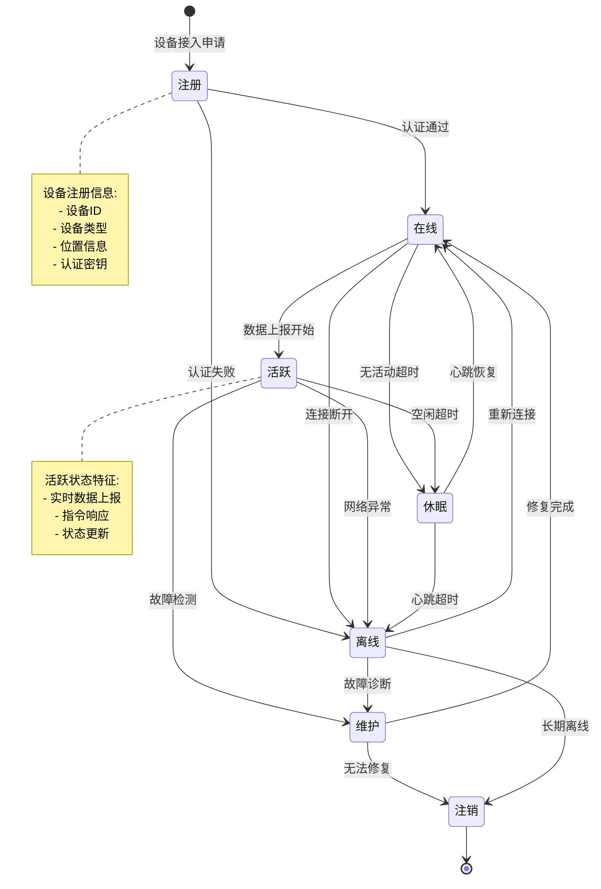

**状态转换形式化定义**：

```text
Device_Lifecycle = (States, Events, Transitions, Initial, Final)

States = {Registered, Online, Active, Dormant, Offline, Maintenance, Deregistered}

Events = {
  auth_success, auth_failure,
  data_start, inactivity_timeout, connection_lost,
  heartbeat_restore, heartbeat_timeout,
  fault_detected, repair_complete, unrepairable,
  reconnect, diagnose, long_term_offline
}

Transitions ⊆ States × Events × States

Initial = Registered
Final = {Deregistered}
```

### 1.2 城市事件处理状态机

城市管理事件从上报到关闭的全流程状态机：

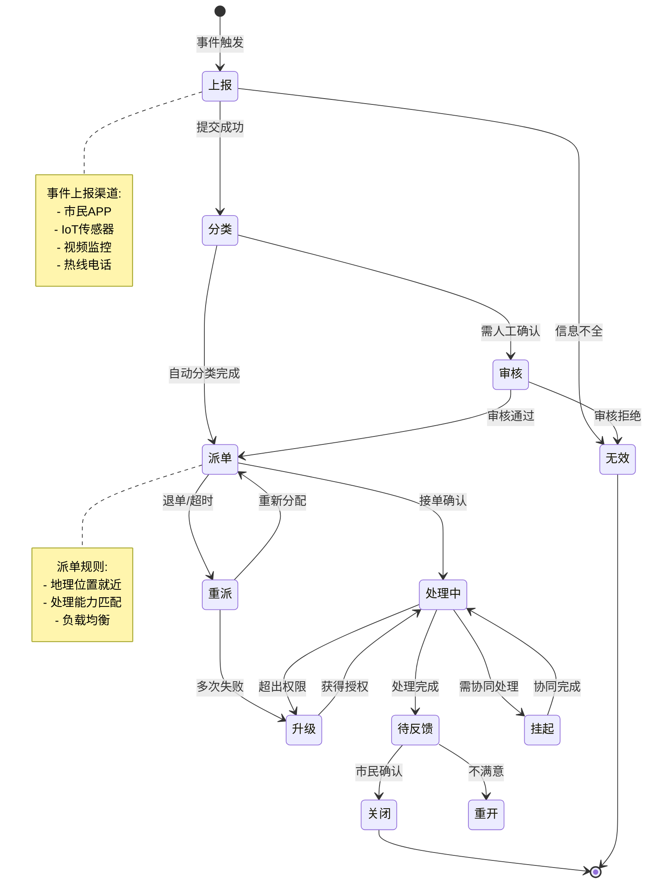

**事件处理形式化定义**：

```text
Event_Processing = (Event_States, Event_Events, Event_Transitions, Event_Initial, Event_Final)

Event_States = {
  Reported, Classified, Reviewing, Dispatched,
  Handling, Suspended, Escalated, Awaiting_Feedback,
  Closed, Invalid, Redispatch
}

Event_Transitions = {
  (Reported, classify, Classified),
  (Classified, dispatch, Dispatched),
  (Dispatched, accept, Handling),
  (Handling, complete, Awaiting_Feedback),
  (Awaiting_Feedback, confirm, Closed),
  ...
}
```

### 1.3 数据流处理状态机

智慧城市数据从采集到应用的完整处理流程：

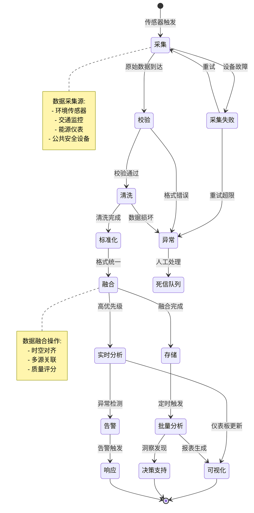

**数据处理形式化定义**：

```text
Data_Processing_Lifecycle = (Data_States, Data_Events, Data_Transitions)

Data_States = {
  Collection, Validation, Cleansing, Standardization,
  Fusion, Storage, RealTime_Analysis, Batch_Analysis,
  Alert, Visualization, Decision_Support, Response,
  Collection_Failed, Anomaly, Dead_Letter
}

Processing_Pipeline = Collection → Validation → Cleansing → Standardization → Fusion → (Storage | RealTime_Analysis)
```

---

## 2. 时序图形式化

### 2.1 智能交通信号控制流程

基于实时交通流量的自适应信号控制：

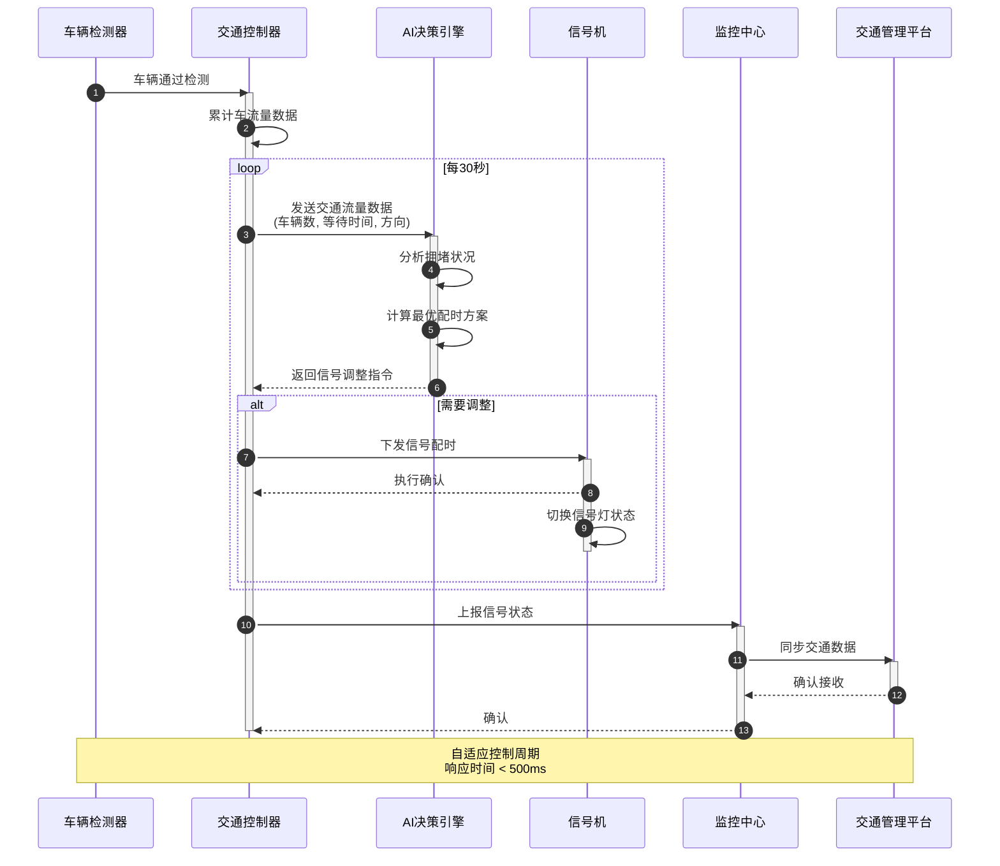

**控制流程形式化定义**：

```text
Traffic_Signal_Control = (Actors, Messages, Sequence)

Actors = {Vehicle_Detector, Controller, AI_Engine, Signal, Monitor, Platform}

Messages = {
  vehicle_detected,
  traffic_data_request, traffic_data_response,
  signal_adjust_command, signal_execute_confirm,
  status_report, data_sync
}

Sequence =
  1. Vehicle_Detector → Controller : vehicle_detected
  2. Controller → AI_Engine : traffic_data (every 30s)
  3. AI_Engine → AI_Engine : analyze & optimize
  4. AI_Engine → Controller : adjustment_command
  5. Controller → Signal : timing_command
  6. Signal → Controller : execution_confirm
  7. Controller → Monitor : status_report
```

### 2.2 城市应急响应流程

从报警到事件处置完成的完整应急流程：

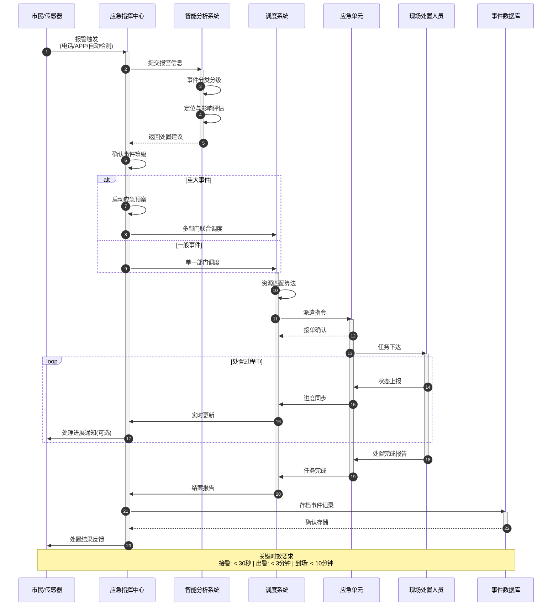

**应急响应形式化定义**：

```text
Emergency_Response = (Phases, Participants, Timing)

Phases = {
  Alarm_Receipt,      % 接警
  Event_Classification, % 分级
  Resource_Dispatch,   % 调度
  On_Site_Handling,    % 处置
  Case_Closure,        % 结案
  Feedback             % 反馈
}

Timing_Constraints = {
  alarm_receipt: 30s,
  dispatch: 3min,
  arrival: 10min,
  handling_report: 5min
}
```

### 2.3 市民服务请求处理流程

市民通过多渠道提交服务请求的处理流程：

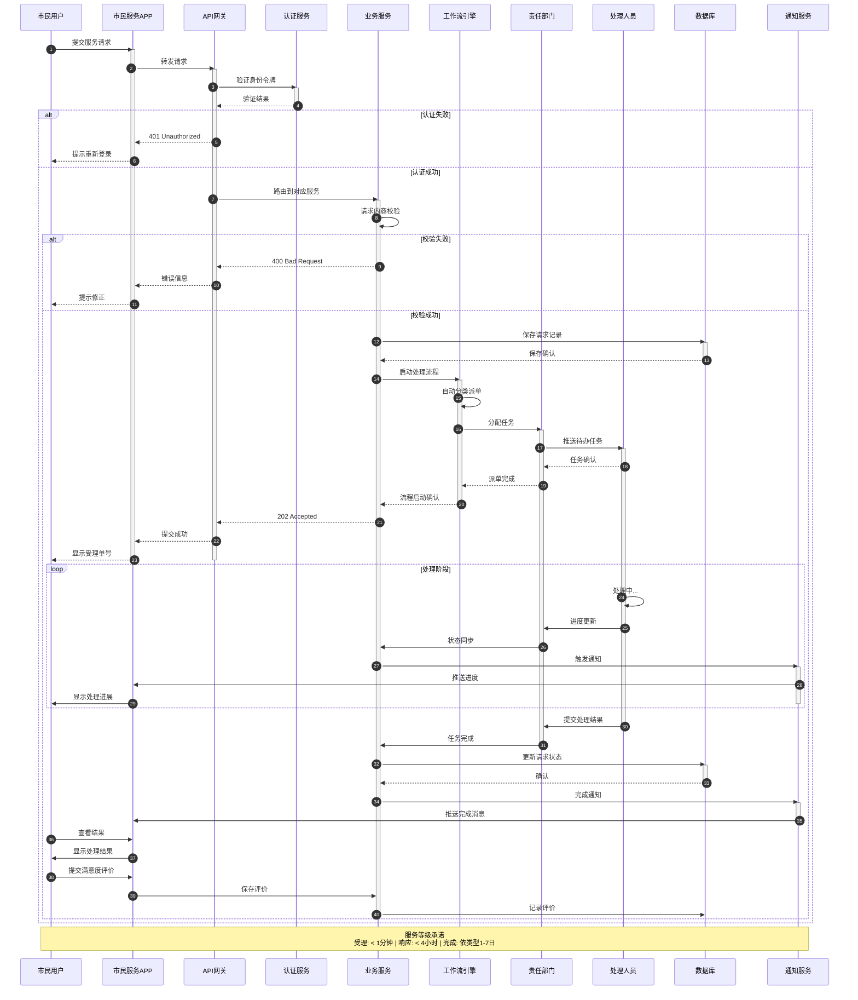

**服务请求形式化定义**：

```text
Service_Request_Processing = (Stages, SLAs, Channels)

Stages = {
  Submission,
  Authentication,
  Validation,
  Acceptance,
  Dispatch,
  Processing,
  Completion,
  Feedback
}

SLAs = {
  acceptance_time: 1min,
  response_time: 4hours,
  completion_time: type_dependent(1..7days),
  satisfaction_rate: >= 90%
}

Channels = {Mobile_APP, Web_Portal, Hotline, WeChat, Alipay}
```

---

## 3. 数据流分析

### 3.1 IoT数据流

智慧城市IoT设备数据采集与处理流程：

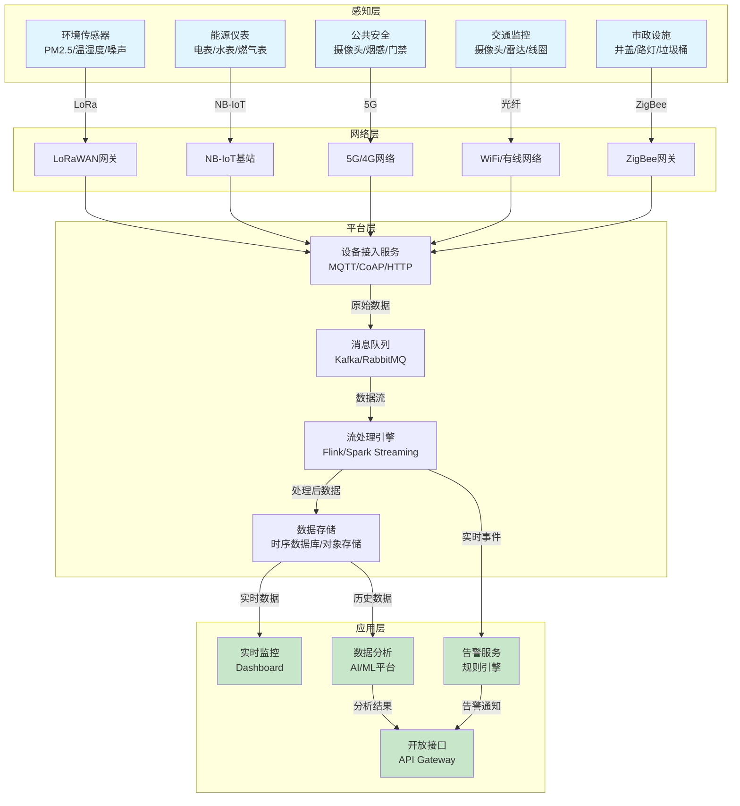

**IoT数据流形式化定义**：

```text
IoT_Data_Flow = (Sources, Network_Layer, Platform_Layer, Applications, Data_Transformations)

Sources = {
  Environmental_Sensors: {pm25, temperature, humidity, noise},
  Traffic_Monitors: {vehicle_count, speed, density},
  Energy_Meters: {electricity, water, gas_consumption},
  Public_Safety: {video_stream, smoke_alarm, access_control},
  Municipal_Facilities: {manhole_cover, streetlight, trash_bin}
}

Network_Protocols = {LoRaWAN, NB_IoT, 5G, WiFi, ZigBee}

Platform_Components = {
  Gateway: MQTT_CoAP_HTTP,
  Message_Queue: Kafka_RabbitMQ,
  Stream_Processing: Flink_Spark,
  Storage: TimeSeries_DB_ObjectStorage
}

Data_Transformations =
  Raw_Data → Protocol_Parse → Message_Queue → Stream_Process → Storage → Applications
```

### 3.2 城市大数据平台数据流

城市级大数据平台的端到端数据流程：

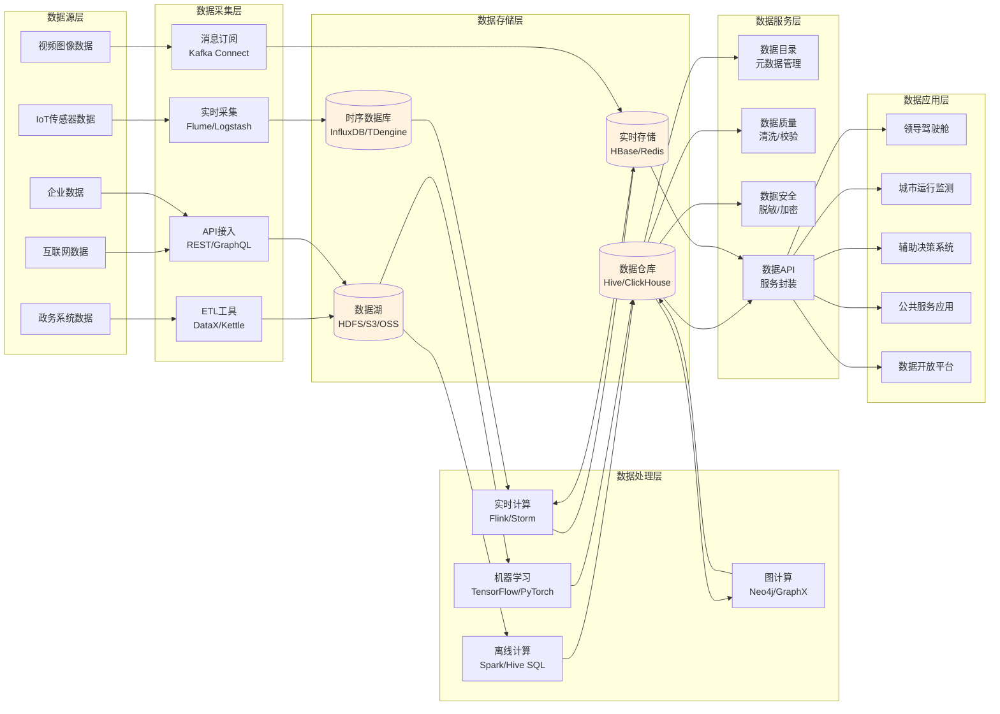

**大数据平台数据流形式化定义**：

```text
City_Big_Data_Platform = (Data_Sources, Ingestion, Storage, Processing, Services, Applications)

Data_Sources = {
  Government_Systems,
  IoT_Sensors,
  Internet_Data,
  Enterprise_Data,
  Video_Images
}

Ingestion_Methods = {
  Batch_ETL: {DataX, Kettle},
  Real_Time: {Flume, Logstash},
  API: {REST, GraphQL},
  Message: {Kafka_Connect}
}

Storage_Types = {
  Data_Lake: {HDFS, S3, OSS},
  Data_Warehouse: {Hive, ClickHouse},
  Real_Time: {HBase, Redis},
  TimeSeries: {InfluxDB, TDengine}
}

Processing_Engines = {
  Batch: {Spark, Hive_SQL},
  Stream: {Flink, Storm},
  ML: {TensorFlow, PyTorch},
  Graph: {Neo4j, GraphX}
}
```

---

## 4. 实时性分析

### 4.1 关键服务响应时间

智慧城市核心服务响应时间要求：

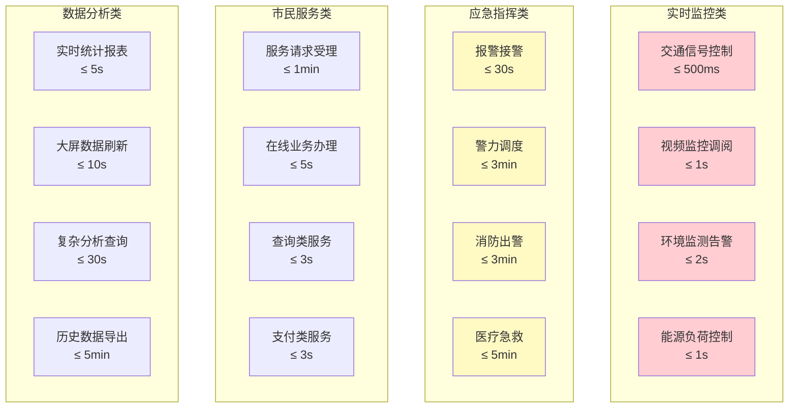

**服务响应时间指标**：

| 服务类别 | 服务名称 | 响应时间要求 | 可用性要求 | 并发能力 |
|---------|---------|-------------|-----------|---------|
| **实时监控** | 交通信号自适应控制 | ≤ 500ms | 99.99% | 10万设备 |
| | 视频监控实时调阅 | ≤ 1s | 99.95% | 5万路视频 |
| | 环境异常告警 | ≤ 2s | 99.99% | 50万传感器 |
| | 电网负荷控制 | ≤ 1s | 99.999% | 100万节点 |
| **应急指挥** | 110/119/120接警 | ≤ 30s | 99.999% | 1万并发 |
| | 警力调度响应 | ≤ 3min | 99.99% | 实时 |
| | 应急资源调配 | ≤ 5min | 99.95% | 实时 |
| **市民服务** | 政务服务受理 | ≤ 1min | 99.9% | 10万并发 |
| | 在线业务办理 | ≤ 5s | 99.9% | 50万并发 |
| | 信息查询服务 | ≤ 3s | 99.5% | 100万并发 |
| **数据分析** | 实时统计查询 | ≤ 5s | 99.5% | 1万并发 |
| | 大屏数据刷新 | ≤ 10s | 99.0% | 100并发 |
| | 复杂分析任务 | ≤ 30s | 95.0% | 1000并发 |

### 4.2 实时流处理延迟

城市级实时数据流处理延迟分析：

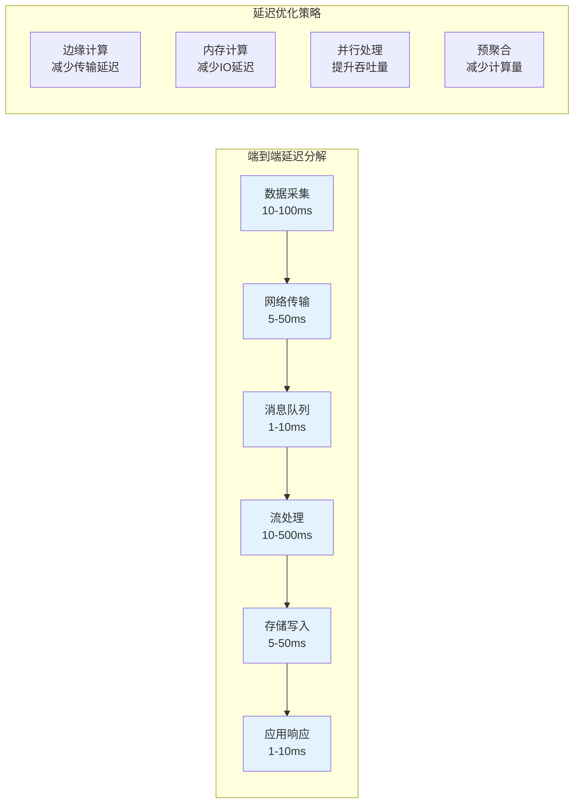

**流处理延迟分级**：

| 延迟级别 | 时间范围 | 适用场景 | 技术方案 |
|---------|---------|---------|---------|
| **超实时** | < 10ms | 工业控制、电网保护 | 边缘计算、FPGA |
| **实时** | 10-100ms | 交通信号、安防告警 | Flink、Storm |
| **准实时** | 100ms-1s | 环境监测、设备监控 | Kafka Streams |
| **近实时** | 1-10s | 业务监控、统计分析 | Spark Streaming |
| **批流一体** | 10-60s | 报表生成、数据同步 | 微批处理 |

**延迟优化公式**：

```text
Total_Latency = Collection_Latency + Transmission_Latency +
                Queue_Latency + Processing_Latency +
                Storage_Latency + Response_Latency

Optimized_Latency = ∑(Parallel_Pipeline) + Caching + Pre_aggregation

其中:
- Collection_Latency: 传感器采样周期
- Transmission_Latency: 网络传输时间
- Queue_Latency: 消息队列缓冲时间
- Processing_Latency: 计算处理时间
- Storage_Latency: 持久化时间
- Response_Latency: 应用响应时间
```

---

## 5. 异常处理

### 5.1 设备故障处理

IoT设备故障检测与恢复机制：

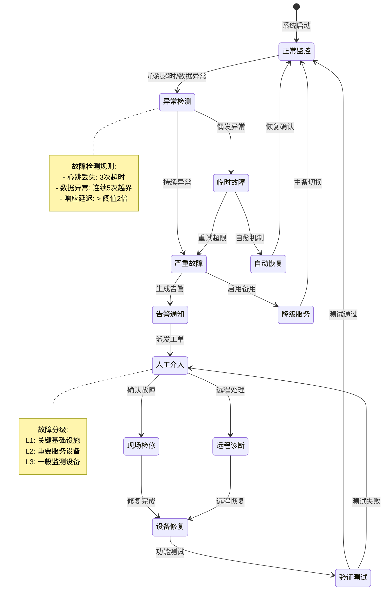

**设备故障处理策略**：

| 故障类型 | 检测方式 | 自动处理 | 人工介入 | 恢复时间 |
|---------|---------|---------|---------|---------|
| **通信故障** | 心跳超时 | 重连3次 | 现场检修 | < 30min |
| **数据异常** | 规则校验 | 数据清洗 | 校准设备 | < 2h |
| **硬件故障** | 自检告警 | 切换备用 | 更换设备 | < 4h |
| **电源故障** | 电压监测 | 电池切换 | 修复供电 | < 1h |
| **固件故障** | 运行异常 | 远程重启 | 固件升级 | < 30min |

### 5.2 网络中断处理

智慧城市网络分层容灾架构：

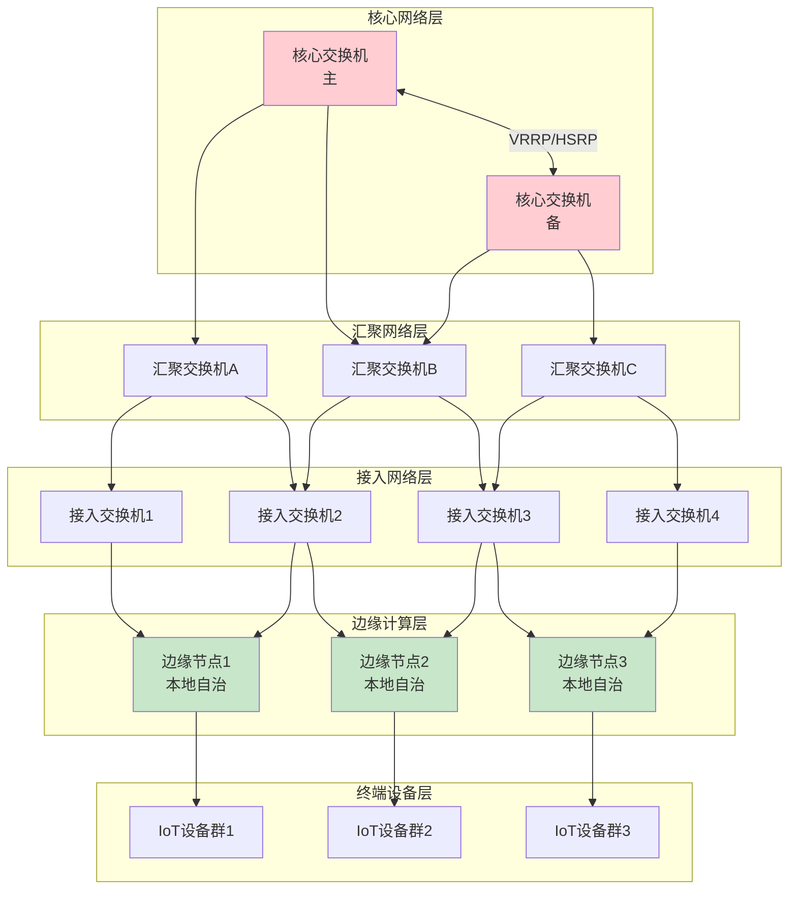

**网络容灾策略表**：

| 故障场景 | 检测时间 | 切换时间 | 影响范围 | 应对措施 |
|---------|---------|---------|---------|---------|
| **核心网故障** | < 3s | < 5s | 全网 | 自动切换至备用核心 |
| **汇聚层故障** | < 5s | < 10s | 区域 | 路由重收敛 |
| **接入层故障** | < 10s | < 30s | 局部 | 边缘自治模式 |
| **互联网出口** | < 5s | < 3s | 外网访问 | BGP自动切换 |
| **广域网链路** | < 10s | < 30s | 跨区通信 | 4G/5G备份 |

**边缘自治机制**：

```text
Edge_Autonomy_Mode = (Conditions, Capabilities, Recovery)

Conditions = {
  uplink_disconnected > 30s,
  heartbeat_loss > 3,
  network_latency > threshold
}

Capabilities = {
  local_data_storage: 7_days,
  local_rule_engine: enabled,
  local_decision_making: critical_only,
  local_alarm_buffering: 10000_events
}

Recovery = {
  sync_after_reconnect: full,
  conflict_resolution: timestamp_based,
  data_priority: alarm > control > telemetry
}
```

### 5.3 数据异常处理

数据质量异常检测与修复流程：

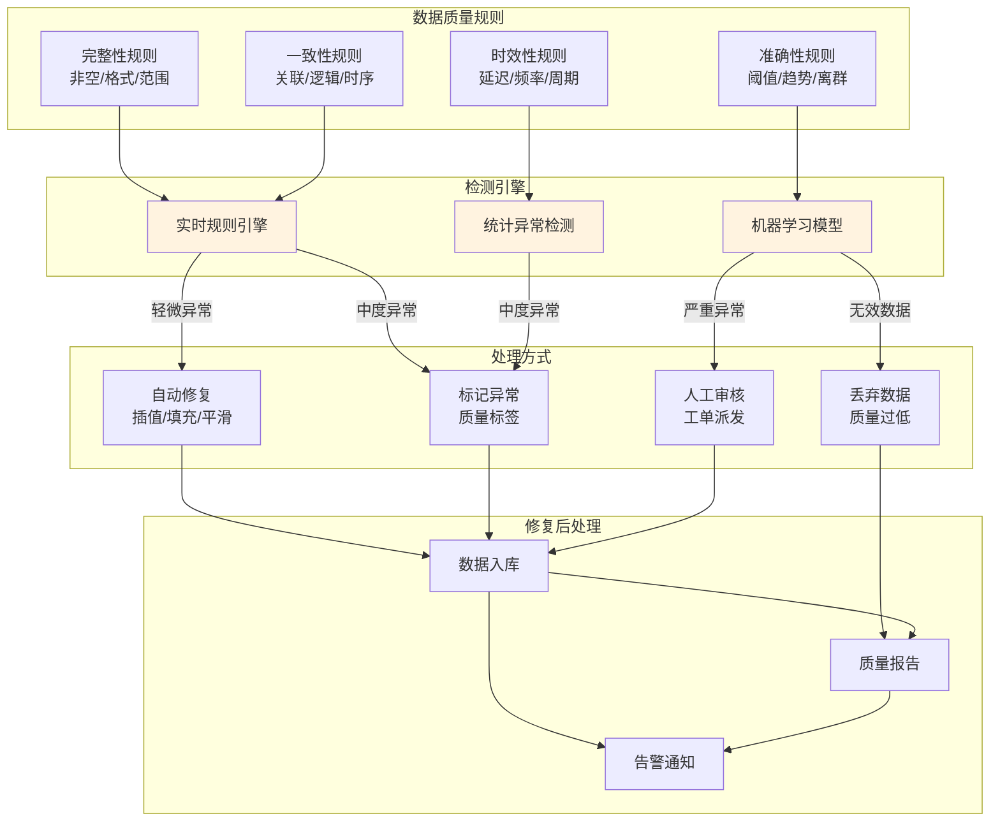

**数据异常分类与处理**：

| 异常类型 | 检测方法 | 严重程度 | 自动修复 | 处理策略 |
|---------|---------|---------|---------|---------|
| **缺失值** | 空值检测 | 低 | 线性插值 | 自动填充 |
| **异常值** | 3σ原则/IQR | 中 | 平滑处理 | 标记审核 |
| **重复值** | 主键/哈希比对 | 低 | 去重 | 自动删除 |
| **格式错误** | 正则匹配 | 高 | 无法修复 | 人工处理 |
| **时间乱序** | 时序校验 | 中 | 排序重组 | 自动修复 |
| **数值跳变** | 差分检测 | 高 | 标记异常 | 人工确认 |
| **传感器漂移** | 长期趋势分析 | 中 | 校准补偿 | 定期维护 |

**数据质量评分模型**：

```text
Data_Quality_Score = w1 × Completeness + w2 × Consistency +
                     w3 × Timeliness + w4 × Accuracy

其中:
- Completeness = (1 - missing_rate) × 100
- Consistency = (1 - conflict_rate) × 100
- Timeliness = (1 - delay_exceed_rate) × 100
- Accuracy = (1 - outlier_rate) × 100

权重配置:
- 关键控制数据: w1=0.2, w2=0.3, w3=0.2, w4=0.3
- 监测统计数据: w1=0.3, w2=0.2, w3=0.2, w4=0.3
- 日志记录数据: w1=0.2, w2=0.2, w3=0.4, w4=0.2

质量等级:
- 优秀: Score ≥ 95
- 良好: 85 ≤ Score < 95
- 合格: 70 ≤ Score < 85
- 不合格: Score < 70
```

---

**参考文档**：

- `01_Overview.md` - Smart City Schema概述
- `02_Formal_Definition.md` - 形式化定义
- `04_Transformation.md` - 转换体系

**创建时间**：2026-02-15
**最后更新**：2026-02-15
