# 医疗健康Schema决策树图

**版本**: v1.0
**创建日期**: 2026-02-15
**适用范围**: 医疗健康领域Schema设计和选型

---

## 📑 目录

- [医疗健康Schema决策树图](#医疗健康schema决策树图)
  - [📑 目录](#-目录)
  - [概览](#概览)
  - [1. 医疗互操作标准选择决策树](#1-医疗互操作标准选择决策树)
  - [2. 医疗数据交换格式决策树](#2-医疗数据交换格式决策树)
  - [3. 医疗系统集成模式决策树](#3-医疗系统集成模式决策树)
  - [4. 医疗合规性决策树](#4-医疗合规性决策树)
  - [5. 临床文档类型决策树](#5-临床文档类型决策树)
  - [6. Mermaid可视化](#6-mermaid可视化)
    - [6.1 医疗互操作标准选择流程图](#61-医疗互操作标准选择流程图)
    - [6.2 医疗数据交换格式流程图](#62-医疗数据交换格式流程图)
    - [6.3 医疗系统集成模式流程图](#63-医疗系统集成模式流程图)
    - [6.4 医疗合规性决策流程图](#64-医疗合规性决策流程图)
    - [6.5 临床文档类型选择流程图](#65-临床文档类型选择流程图)
  - [使用指南](#使用指南)
    - [如何使用这些决策树](#如何使用这些决策树)
    - [决策树组合使用示例](#决策树组合使用示例)
    - [常见陷阱与建议](#常见陷阱与建议)

---

## 概览

| 决策树 | 适用场景 | 关键决策点 | 输出结果 |
|--------|----------|------------|----------|
| 医疗互操作标准选择 | 医疗信息系统集成 | 数据类型、互操作范围、技术栈 | HL7 v2/FHIR/CDA/DICOM/IHE |
| 医疗数据交换格式 | 数据传输格式选型 | 可读性、性能、兼容性 | XML/JSON/专有格式 |
| 医疗系统集成模式 | 系统架构设计 | 集成复杂度、规模、扩展性 | 点对点/ESB/API网关/混合 |
| 医疗合规性 | 法规遵循框架 | 地域、数据类型、业务场景 | HIPAA/GDPR/等保/HITRUST |
| 临床文档类型 | 文档结构设计 | 文档用途、互操作需求、技术基础 | CCD/Composition/自定义 |

---

## 1. 医疗互操作标准选择决策树

```text
开始: 选择医疗互操作标准
│
├─ Q: 主要数据类型是什么?
│   │
│   ├─ 临床数据 (患者信息、诊断、医嘱)
│   │   └─ 决策: 评估 HL7 标准族
│   │       │
│   │       ├─ Q: 系统现代化程度?
│   │       │   │
│   │       │   ├─ 遗留系统为主 → HL7 v2.x
│   │       │   │       ├─ 理由: 广泛支持，成熟稳定
│   │       │   │       ├─ 适用: 医院内部系统(HIS/LIS/RIS)
│   │       │   │       ├─ 版本: v2.3.1 / v2.5.1 / v2.8
│   │       │   │       ├─ 特点: 管道符分隔，ER7编码
│   │       │   │       └─ 劣势: 语义歧义，实现差异大
│   │       │   │
│   │       │   ├─ 现代系统/新建设 → HL7 FHIR
│   │       │   │       ├─ 理由: 现代RESTful架构，资源导向
│   │       │   │       ├─ 版本: R4 / R4B / R5
│   │       │   │       ├─ 资源: Patient/Encounter/Observation
│   │       │   │       ├─ 格式: JSON/XML/Turtle
│   │       │   │       ├─ 适用: 移动应用、患者门户、互操作平台
│   │       │   │       └─ 优势: 开源生态，全球社区支持
│   │       │   │
│   │       │   └─ 混合环境 → 双轨策略
│   │       │           ├─ 遗留系统: HL7 v2 接口引擎
│   │       │           ├─ 新系统: FHIR API
│   │       │           └─ 转换: v2-to-FHIR 映射
│   │       │
│   │       └─ Q: 文档交换需求?
│   │           │
│   │           ├─ 需要结构化临床文档 → HL7 CDA
│   │           │       ├─ 理由: 完整临床文档标准
│   │           │       ├─ 文档类型: CCD/Discharge Summary/Progress Note
│   │           │       ├─ 版本: CDA R2 / C-CDA 2.1
│   │           │       ├─ 格式: XML
│   │           │       └─ 适用: 转诊摘要、患者摘要交换
│   │           │
│   │           └─ 轻量级文档 → FHIR Composition
│   │                   ├─ 理由: 更简洁的资源模型
│   │                   ├─ 互操作: FHIR Bundle + Composition
│   │                   └─ 趋势: 逐步替代CDA
│   │
│   ├─ 医学影像数据
│   │   └─ 决策: 选择 DICOM
│   │       ├─ 理由: 医学影像领域事实标准
│   │       ├─ 内容: 影像数据 + 元数据 + 工作流
│   │       ├─ 版本: DICOM 3.0
│   │       ├─ 服务: C-STORE/C-FIND/C-MOVE/WADO
│   │       ├─ 适用: PACS/VNA/影像AI
│   │       └─ 扩展: DICOMweb (RESTful接口)
│   │
│   ├─ 医疗设备数据
│   │   └─ 决策: 评估 IEEE 11073 / HL7 FHIR
│   │       ├─ 床旁设备 → IEEE 11073 (POC设备通信)
│   │       ├─ 设备集成 → HL7 FHIR Device/Observation
│   │       └─ 趋势: 向FHIR整合
│   │
│   └─ 跨机构工作流程
│       └─ 决策: 采用 IHE 集成方案
│           ├─ 理由: 基于现有标准的流程整合
│           ├─ 领域: 放射科(XDS-I)、检验(LAB)、心血管(CathPCI)
│           ├─ 集成配置文件: PIX/PDQ/XDS/ATNA
│           ├─ 基于标准: HL7/DICOM/ebXML
│           └─ 优势: 成熟最佳实践，互联互通测试验证
│
├─ Q: 互操作范围?
│   │
│   ├─ 机构内部 → 基于现有系统能力选择
│   ├─ 区域/国家级 → FHIR (US Core/IPS) 或国家标准
│   │       ├─ 美国: US Core Implementation Guide
│   │       ├─ 国际: IPS (International Patient Summary)
│   │       ├─ 欧洲: HL7 FHIR + GDPR合规
│   │       └─ 中国: 互联互通标准化成熟度测评
│   └─ 全球互操作 → FHIR + 国际实施指南
│
├─ Q: 技术栈约束?
│   │
│   ├─ .NET平台 → FHIR .NET API (Firely)
│   ├─ Java平台 → HAPI FHIR / FHIRworks
│   ├─ JavaScript/Node → fhir.js / FHIR Client
│   ├─ Python → fhir.resources / SMART on FHIR
│   └─ 移动开发 → FHIR REST + JSON
│
└─ Q: 认证与合规要求?
    │
    ├─ ONC认证(美国) → FHIR US Core + SMART on FHIR
    ├─ NHS认证(英国) → FHIR UK Core
    └─ 互连互通测评(中国) → 按国家规范要求
```

---

## 2. 医疗数据交换格式决策树

```text
开始: 选择医疗数据交换格式
│
├─ Q: 首要考虑因素?
│   │
│   ├─ 标准化与互操作性优先
│   │   └─ 决策: 评估 XML
│   │       │
│   │       ├─ Q: 是否需要严格模式验证?
│   │       │   │
│   │       │   ├─ 是 → XML Schema (XSD)
│   │       │   │       ├─ 理由: 强类型验证，命名空间支持
│   │       │   │       ├─ 适用: CDA文档、FHIR XML格式
│   │       │   │       ├─ 数字签名: XML-DSig 原生支持
│   │       │   │       ├─ 加密: XML-Enc 标准支持
│   │       │   │       └─ 劣势: 冗余标记，文件体积大
│   │       │   │
│   │       │   └─ 否 → 宽松XML或JSON
│   │       │
│   │       └─ Q: 遗留系统兼容性?
│   │           ├─ 需要支持旧版系统 → XML (HL7 v3/CDA)
│   │           └─ 全新系统 → 优先考虑JSON
│   │
│   ├─ 开发效率与可读性优先
│   │   └─ 决策: 选择 JSON
│   │       ├─ 理由: 人类可读，解析简单
│   │       ├─ 适用: FHIR REST API、移动应用
│   │       ├─ 优势:
│   │       │   ├─ JavaScript原生支持
│   │       │   ├─ 体积比XML小30-40%
│   │       │   ├─ 现代开发工具链完善
│   │       │   └─ 浏览器/移动友好
│   │       ├─ 验证: JSON Schema
│   │       ├─ 扩展: JSON-LD (语义网)
│   │       └─ 安全: JSON Web Signature (JWS) / Encryption (JWE)
│   │
│   └─ 性能与带宽优先
│       └─ 决策: 评估二进制或压缩格式
│           │
│           ├─ Q: 是否FHIR环境?
│           │   │
│           │   ├─ 是 → FHIR Binary 或 FHIR R5 + 压缩
│           │   └─ 否 → Protobuf / Avro
│           │
│           └─ Q: 数据量规模?
│               ├─ 大数据处理 → Avro/Parquet (分析场景)
│               ├─ 流式传输 → Protobuf / MessagePack
│               └─ 小到中等 → JSON + Gzip压缩
│
├─ Q: 安全与隐私要求?
│   │
│   ├─ 需要数字签名
│   │   ├─ XML文档 → XML-DSig
│   │   ├─ JSON数据 → JSON-JWS (JOSE)
│   │   └─ 混合环境 → FHIR Bundle + Signature
│   │
│   ├─ 需要加密传输
│   │   ├─ 传输层: TLS 1.3
│   │   ├─ 应用层: XML-Enc / JSON-JWE
│   │   └─ 端到端: FHIR Document Encryption
│   │
│   └─ 需要内容完整性
│       ├─ 哈希校验: SHA-256
│       └─ FHIR: Bundle.signature
│
├─ Q: 生态兼容性?
│   │
│   ├─ HL7 FHIR → JSON (首选) / XML
│   ├─ HL7 v2 → ER7 (管道符) 或 FHIR转换
│   ├─ DICOM → 原生DICOM或DICOMweb (JSON/XML)
│   ├─ IHE XDS → ebXML Registry/Repository
│   └─ 自定义系统 → 根据对方系统能力协商
│
└─ Q: 转换与迁移?
    │
    ├─ v2 → FHIR → HL7 v2-to-FHIR IG
    ├─ CDA → FHIR → CDA-to-FHIR Mapping
    ├─ FHIR → CDA → FHIR Composition to CDA
    └─ 通用转换 → FHIR Mapping Language
```

---

## 3. 医疗系统集成模式决策树

```text
开始: 设计医疗系统集成架构
│
├─ Q: 集成复杂度评估?
│   │
│   ├─ 简单 (2-5个系统)
│   │   └─ 决策: 点对点集成 (Point-to-Point)
│   │       ├─ 理由: 简单直接，无需中间件
│   │       ├─ 适用: 单科室系统、小型诊所
│   │       ├─ 技术: 直接数据库连接/API调用
│   │       ├─ 优势: 低延迟，简单部署
│   │       ├─ 劣势: N^2连接问题，难以扩展
│   │       └─ 示例: HIS-LIS直接接口
│   │
│   ├─ 中等 (5-20个系统)
│   │   └─ 决策: API网关模式
│   │       │
│   │       ├─ Q: 是否需要统一管控?
│   │       │   │
│   │       │   ├─ 是 → API网关 (Kong/AWS API GW/Azure APIM)
│   │       │   │       ├─ 功能: 认证授权、限流、监控
│   │       │   │       ├─ 医疗场景: FHIR API网关
│   │       │   │       ├─ 安全: OAuth2/OIDC + SMART on FHIR
│   │       │   │       ├─ 审计: API访问日志
│   │       │   │       └─ 适用: 医院数字化平台
│   │       │   │
│   │       │   └─ 否 → 混合模式 (部分直连)
│   │       │
│   │       └─ Q: 微服务架构?
│   │           ├─ 是 → Service Mesh (Istio/Linkerd)
│   │           │       ├─ 服务发现
│   │           │       ├─ 负载均衡
│   │           │       ├─ 熔断限流
│   │           │       └─ 可观测性
│   │           └─ 否 → 传统API网关
│   │
│   └─ 复杂 (>20个系统或多机构)
│       └─ 决策: 企业服务总线 (ESB) 或集成平台
│           │
│           ├─ Q: 企业级集成需求?
│           │   │
│           │   ├─ 需要复杂编排 → ESB (MuleSoft/Dell Boomi)
│           │   │       ├─ 协议转换: HL7 v2 ↔ FHIR ↔ DICOM
│           │   │       ├─ 消息路由: 基于内容/规则
│           │   │       ├─ 事务管理: 可靠消息传递
│           │   │       ├─ 监控: 端到端追踪
│           │   │       └─ 适用: 大型医院集团、区域平台
│           │   │
│           │   └─ 轻量级集成 → iPaaS 或现代集成平台
│           │           ├─ 低代码集成
│           │           ├─ 云原生支持
│           │           └─ 预建连接器
│           │
│           └─ Q: 实时性要求?
│               ├─ 准实时 → 消息队列 (RabbitMQ/Kafka)
│               ├─ 批处理 → ETL/ELT管道
│               └─ 混合 → Lambda架构
│
├─ Q: 互操作标准选择?
│   │
│   ├─ 现代FHIR优先 → FHIR RESTful API
│   │       ├─ 同步: CRUD操作
│   │       ├─ 异步: Subscription/Notification
│   │       └─ 批量: FHIR Bulk Data
│   │
│   ├─ 遗留系统 → HL7 v2.x 接口引擎
│   │       ├─ 引擎: Mirth Connect/Rhapsody/InterfaceWare
│   │       ├─ 映射: v2字段 ↔ 内部数据模型
│   │       └─ 监控: 消息追踪与重试
│   │
│   ├─ 文档交换 → IHE XDS/XCA
│   │       ├─ 文档注册: XDS Registry
│   │       ├─ 文档存储: XDS Repository
│   │       └─ 跨社区: XCA (Cross-Community Access)
│   │
│   └─ 影像集成 → DICOMweb / WADO-RS
│           ├─ 查询: QIDO-RS
│           ├─ 检索: WADO-RS
│           └─ 存储: STOW-RS
│
├─ Q: 部署模式?
│   │
│   ├─ 本地部署 → 传统ESB/消息中间件
│   ├─ 混合云 → API管理 + 云代理
│   ├─ 云原生 → Kubernetes + Service Mesh
│   └─ SaaS → 托管iPaaS方案
│
├─ Q: 安全架构?
│   │
│   ├─ 认证 → OAuth2/OIDC + SMART on FHIR
│   ├─ 授权 → 基于角色的访问控制 (RBAC)
│   ├─ 审计 → 集中日志与审计追踪
│   └─ 加密 → TLS 1.3 + 应用层加密
│
└─ Q: 监控与运维?
    │
    ├─ 可观测性 → APM + 分布式追踪
    ├─ 健康检查 → 端点监控与告警
    ├─ 性能监控 → 吞吐量/延迟/错误率
    └─ 合规审计 → 访问日志与报告
```

---

## 4. 医疗合规性决策树

```text
开始: 确定医疗合规框架
│
├─ Q: 主要服务地域?
│   │
│   ├─ 美国
│   │   └─ 决策: HIPAA 合规框架
│   │       │
│   │       ├─ Q: 实体类型?
│   │       │   │
│   │       │   ├─ 医疗服务提供方 → 全面HIPAA合规
│   │       │   │       ├─ 隐私规则: PHI使用与披露限制
│   │       │   │       ├─ 安全规则: 管理/物理/技术保障
│   │       │   │       ├─ 违规通知规则: 72小时通知要求
│   │       │   │       └─ 执法规则: 民事/刑事处罚
│   │       │   │
│   │       │   ├─ 健康计划 → 类似提供商要求
│   │       │   └─ 医疗信息交换所 → 商业伙伴协议(BAA)
│   │       │
│   │       ├─ 安全措施:
│   │       │   ├─ 管理保障: 安全官任命、风险评估
│   │       │   ├─ 物理保障: 设施访问控制、工作站安全
│   │       │   └─ 技术保障: 访问控制、审计控制、完整性、传输安全
│   │       │
│   │       ├─ Q: 需要增强安全认证?
│   │       │   │
│   │       │   ├─ 是 → HITRUST CSF
│   │       │   │       ├─ 理由: 综合性安全框架，整合多标准
│   │       │   │       ├─ 基础: ISO27001 + HIPAA + NIST
│   │       │   │       ├─ 认证: 第三方评估与认证
│   │       │   │       ├─ 等级: 基础/中级/高级
│   │       │   │       └─ 优势: 简化审计，行业认可
│   │       │   │
│   │       │   └─ 否 → 基础HIPAA合规
│   │       │
│   │       └─ Q: ONC认证要求?
│   │           ├─ 是 → 21世纪治愈法案 + Cures Act
│   │           │       ├─ 信息封锁规则
│   │           │       ├─ 患者访问API
│   │           │       └─ FHIR标准强制要求
│   │           └─ 否 → 基础HIPAA合规
│   │
│   ├─ 欧盟/欧洲经济区
│   │   └─ 决策: GDPR + 本地医疗法规
│   │       │
│   │       ├─ GDPR 核心要求:
│   │       │   ├─ 合法性基础: 同意或合法利益
│   │       │   ├─ 数据主体权利: 访问/更正/删除/可携带
│   │       │   ├─ 数据保护官(DPO): 强制任命
│   │       │   ├─ 影响评估(DPIA): 高风险处理
│   │       │   ├─ 泄露通知: 72小时内报告监管机构
│   │       │   └─ 隐私设计: 默认隐私保护
│   │       │
│   │       └─ 医疗特定:
│   │           ├─ 患者数据特别敏感(特殊类别)
│   │           ├─ eHealth Network标准
│   │           ├─ EHDS (欧洲健康数据空间) - 新兴
│   │           └─ 跨境: 充分性决定或标准合同条款
│   │
│   ├─ 中国
│   │   └─ 决策: 网络安全等级保护 + 医疗数据合规
│   │       │
│   │       ├─ 网络安全等级保护 (等保2.0)
│   │       │   │
│   │       │   ├─ Q: 系统定级?
│   │       │   │   │
│   │       │   │   ├─ 第二级 → 一般医疗信息系统
│   │       │   │   │       ├─ 自主保护级
│   │       │   │   │       ├─ 年度测评
│   │       │   │   │       └─ 基础安全要求
│   │       │   │   │
│   │       │   │   ├─ 第三级 → 重要医疗系统(HIS核心)
│   │       │   │   │       ├─ 监督保护级
│   │       │   │   │       ├─ 年度强制测评
│   │       │   │   │       ├─ 详细安全技术要求
│   │       │   │   │       └─ 三级医院核心系统通常适用
│   │       │   │   │
│   │       │   │   └─ 第四级 → 关键医疗基础设施
│   │       │   │           ├─ 强制保护级
│   │       │   │           ├─ 半年度测评
│   │       │   │           └─ 最高安全要求
│   │       │   │
│   │       │   ├─ 安全通用要求: 安全物理环境、通信网络、区域边界、计算环境
│   │       │   └─ 安全扩展要求: 云计算、移动互联、物联网、工业控制
│   │       │
│   │       ├─ 数据安全法/个人信息保护法
│   │       │   ├─ 数据分类分级
│   │       │   ├─ 重要数据识别与保护
│   │       │   ├─ 跨境数据传输安全评估
│   │       │   └─ 敏感个人信息处理规则
│   │       │
│   │       ├─ 医疗健康数据安全指南
│   │       │   ├─ 重要数据识别指南
│   │       │   ├─ 数据脱敏处理
│   │       │   └─ 数据安全评估
│   │       │
│   │       └─ 互联互通标准化成熟度测评
│   │           ├─ 等级: 1-5级
│   │           ├─ 内容: 技术架构、互联互通、业务应用
│   │           └─ 要求: 符合国家标准数据格式
│   │
│   └─ 其他地域
│       └─ 决策: 本地法规 + 国际最佳实践
│           ├─ 加拿大: PIPEDA + 省级健康隐私法
│           ├─ 澳大利亚: Privacy Act + My Health Records
│           ├─ 日本: APPI + 医疗信息安全管理指南
│           └─ 国际: ISO27001 + ISO27799 (医疗信息安全)
│
├─ Q: 数据跨境传输?
│   │
│   ├─ 美国↔欧盟 → 标准合同条款(SCCs) / 数据隐私框架
│   ├─ 中国出境 → 安全评估/标准合同/专业机构认证
│   └─ 其他 → 充分性决定或法律机制
│
├─ Q: 云服务使用?
│   │
│   ├─ 公有云 → 云服务提供商合规认证
│   ├─ 混合云 → 责任共担模型明确
│   └─ 私有云 → 完全自主控制
│
├─ Q: 第三方合作?
│   │
│   ├─ 业务伙伴协议(BAA) → 美国HIPAA要求
│   ├─ 数据处理协议(DPA) → GDPR要求
│   └─ 安全承诺书 → 等保要求
│
└─ Q: 审计与认证?
    │
    ├─ SOC 2 Type II → 服务组织控制
    ├─ ISO 27001 → 信息安全管理
    ├─ ISO 27799 → 医疗信息安全
    └─ 行业特定 → HITRUST / 等保测评
```

---

## 5. 临床文档类型决策树

```text
开始: 选择临床文档结构类型
│
├─ Q: 文档主要用途?
│   │
│   ├─ 患者摘要交换 (转诊/出院/急诊)
│   │   └─ 决策: 评估 CDA CCD 或 FHIR Composition
│   │       │
│   │       ├─ Q: 对方系统能力?
│   │       │   │
│   │       │   ├─ 支持FHIR → FHIR Composition + Bundle
│   │       │   │       ├─ 理由: 现代标准，简洁高效
│   │       │   │       ├─ 资源: Composition + Patient + Encounter + ...
│   │       │   │       ├─ 格式: JSON
│   │       │   │       ├─ 适用: 现代互操作平台
│   │       │   │       └─ 优势: RESTful API友好，移动支持
│   │       │   │
│   │       │   ├─ 仅支持CDA → C-CDA 2.1 CCD
│   │       │   │       ├─ 理由: 广泛部署，成熟稳定
│   │       │   │       ├─ 标准: HL7 CDA R2 + C-CDA 2.1
│   │       │   │       ├─ 章节: 用药/过敏/问题/结果...
│   │       │   │       ├─ 格式: XML
│   │       │   │       └─ 适用: 美国医疗系统，Meaningful Use
│   │       │   │
│   │       │   └─ 未知/混合 → 双格式支持
│   │       │           ├─ 优先: FHIR Composition
│   │       │           ├─ 备选: C-CDA转换
│   │       │           └─ 工具: FHIR CDA转换工具
│   │       │
│   │       └─ Q: 国际互操作?
│   │           ├─ 是 → IPS (International Patient Summary)
│   │           │       ├─ 基于: FHIR R4
│   │           │       ├─ 内容: 核心患者摘要国际标准化
│   │           │       ├─ 适用: 跨境医疗、旅游医疗
│   │           │       └─ 欧盟: 推荐实施指南
│   │           │
│   │           └─ 否 → 本地化实施指南
│   │
│   ├─ 临床笔记/病程记录
│   │   └─ 决策: FHIR ClinicalImpression / DocumentReference
│   │       ├─ 结构化 → ClinicalImpression + Observation
│   │       ├─ 半结构化 → Composition with structured data
│   │       └─ 非结构化 → DocumentReference + Binary
│   │
│   ├─ 检查/检验报告
│   │   └─ 决策: FHIR DiagnosticReport
│   │       ├─ 影像报告 → DiagnosticReport + ImagingStudy
│   │       ├─ 检验报告 → DiagnosticReport + Observation
│   │       └─ 病理报告 → DiagnosticReport + Specimen
│   │
│   ├─ 护理文档
│   │   └─ 决策: FHIR CarePlan / Goal / Procedure
│   │       ├─ 护理计划 → CarePlan
│   │       ├─ 护理评估 → QuestionnaireResponse
│   │       └─ 护理执行 → Procedure/Observation
│   │
│   └─ 手术/操作记录
│       └─ 决策: FHIR Procedure + DocumentReference
│           ├─ 结构化数据 → Procedure资源
│           ├─ 操作描述 → Composition
│           └─ 附件文档 → DocumentReference
│
├─ Q: 内容结构化程度?
│   │
│   ├─ 高度结构化 → FHIR资源组合
│   │       ├─ 优势: 可计算、可查询、互操作性强
│   │       ├─ 适用: CDS、质量报告、研究
│   │       └─ 复杂度: 高，需要详细建模
│   │
│   ├─ 混合结构 → CDA 或 FHIR Composition
│   │       ├─ 章节级结构
│   │       ├─ 条目级部分结构
│   │       └─ 支持人读和机读
│   │
│   └─ 非结构化 → DocumentReference + NLP
│           ├─ 原始文档存储
│           ├─ OCR/NLP提取结构化数据
│           └─ 渐进式结构化
│
├─ Q: 签名与认证要求?
│   │
│   ├─ 需要数字签名
│   │   ├─ CDA → CDA签名扩展
│   │   ├─ FHIR → Bundle.signature 或 JWS
│   │   └─ PDF → PAdES数字签名
│   │
│   ├─ 需要时间戳
│   │   ├─ RFC 3161 时间戳
│   │   └─ FHIR Provenance
│   │
│   └─ 法律证据效力
│       ├─ 符合eIDAS (欧盟)
│       ├─ 符合ESIGN法案 (美国)
│       └─ 符合电子签名法 (中国)
│
├─ Q: 长期归档需求?
│   │
│   ├─ 长期保存 → 格式标准化 + 迁移策略
│   ├─ IHE XDS → 文档注册与存储
│   └─ FHIR → 版本控制与向后兼容
│
└─ Q: 现有系统迁移?
    │
    ├─ CDA → FHIR → CDA-to-FHIR转换工具
    ├─ 自定义格式 → 映射到FHIR资源
    ├─ PDF/扫描件 → DocumentReference + OCR
    └─ 混合策略 → 渐进式标准化
```

---

## 6. Mermaid可视化

### 6.1 医疗互操作标准选择流程图

```mermaid
flowchart TD
    A[开始: 医疗互操作标准选择] --> B{主要数据类型?}

    B -->|临床数据| C{系统现代化程度?}
    B -->|医学影像| D[DICOM]
    B -->|医疗设备| E[IEEE 11073 / FHIR]
    B -->|跨机构工作流| F[IHE集成方案]

    C -->|遗留系统| G[HL7 v2.x]
    C -->|现代系统| H[HL7 FHIR]
    C -->|混合环境| I[双轨策略]

    G --> G1[医院内部HIS/LIS/RIS]
    G --> G2[成熟稳定广泛支持]

    H --> H1[RESTful API]
    H --> H2[资源导向架构]
    H --> H3[移动/患者门户友好]

    D --> D1[PACS/VNA]
    D --> D2[DICOMweb]
    D --> D3[WADO/STOW/QIDO]

    F --> F1[XDS影像共享]
    F --> F2[LAB检验流程]
    F --> F3[PIX/PDQ患者管理]

    A --> J{互操作范围?}
    J -->|机构内部| K[基于现有能力]
    J -->|区域/国家| L[US Core/IPS/国家标准]
    J -->|全球| M[FHIR + 国际IG]
```



### 6.2 医疗数据交换格式流程图


### 6.3 医疗系统集成模式流程图


### 6.4 医疗合规性决策流程图


### 6.5 临床文档类型选择流程图


---

## 使用指南

### 如何使用这些决策树

1. **确定决策起点**
   - 根据当前项目阶段，找到对应的决策树
   - 从"开始"节点出发，按层次逐步回答关键问题

2. **评估决策因素**
   - 每个决策节点(菱形)代表一个关键问题
   - 仔细评估组织/项目的具体情况
   - 考虑技术现状、预算、时间线、人员技能

3. **对比可选方案**
   - 每个分支末端给出推荐方案
   - 阅读理由说明，理解方案适用场景
   - 必要时参考概览表格快速对比

4. **综合考虑约束**
   - 技术约束: 现有系统兼容性、技术栈限制
   - 法规约束: 地域合规要求、行业认证
   - 业务约束: 互操作伙伴能力、患者需求
   - 资源约束: 预算、时间、专业技能

### 决策树组合使用示例

**场景: 设计一个区域医疗信息平台**

1. 使用**医疗互操作标准选择决策树**
   - 数据类型: 临床数据 → FHIR
   - 互操作范围: 区域级 → FHIR + 国家实施指南
   - 遗留系统: 多 → 需要v2转换网关

2. 使用**医疗数据交换格式决策树**
   - 标准化优先 → JSON (FHIR标准格式)
   - 安全要求: 数字签名 → JWS
   - 遗留兼容: XML支持作为备选

3. 使用**医疗系统集成模式决策树**
   - 复杂度: 多医院多系统 → ESB/集成平台
   - 标准: FHIR优先 + v2网关
   - 部署: 混合云 → 安全边界设计

4. 使用**医疗合规性决策树**
   - 地域: 中国 → 等保2.0三级 + 数据安全法
   - 跨境: 无 → 国内合规为主
   - 认证: 互联互通测评4级以上

5. 使用**临床文档类型决策树**
   - 用途: 患者摘要交换 → FHIR Composition
   - 对方能力: 混合 → 双格式支持
   - 结构化: 混合 → Composition + 结构化Section

### 常见陷阱与建议

| 陷阱 | 建议 |
|------|------|
| 忽视遗留系统现实 | 采用渐进式迁移策略，保留v2接口引擎 |
| 过度追求技术先进 | 平衡创新性与合作伙伴互操作能力 |
| 低估合规复杂度 | 早期引入法规专家，进行合规性评审 |
| 忽视用户体验 | 临床工作流集成测试，确保可用性 |
| 缺乏长期演进规划 | 关注FHIR版本升级路径，避免技术债务 |
| 忽视安全设计 | 默认启用加密，实施零信任架构 |

---

**参考文档**:

- `README.md` - 主题概览
- `Core_Schema/` - 核心医疗Schema
- `FHIR_Implementation/` - FHIR实施指南
- `../UNIFIED_GLOSSARY.md` - 统一术语表

**维护者**: DSL Schema研究团队
**更新周期**: 随医疗标准更新同步修订
