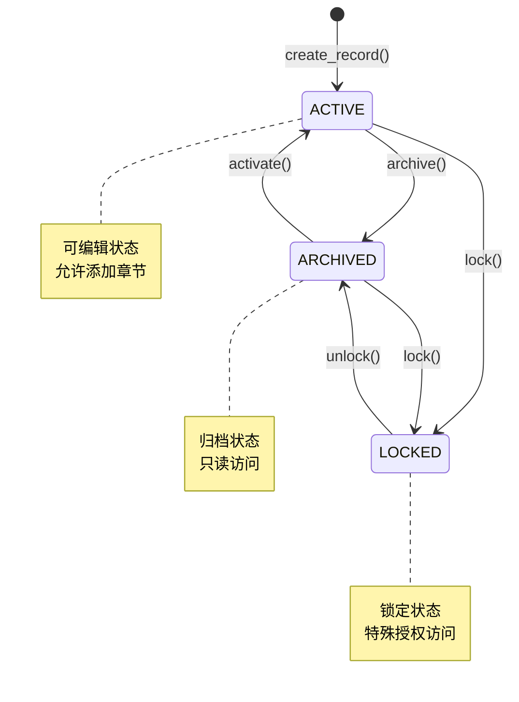
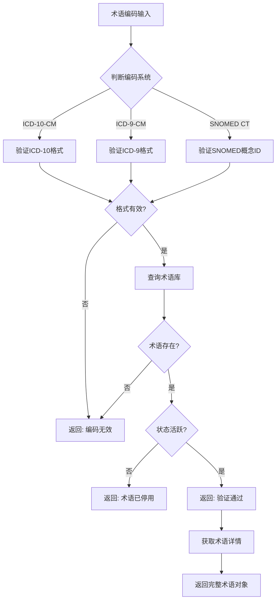
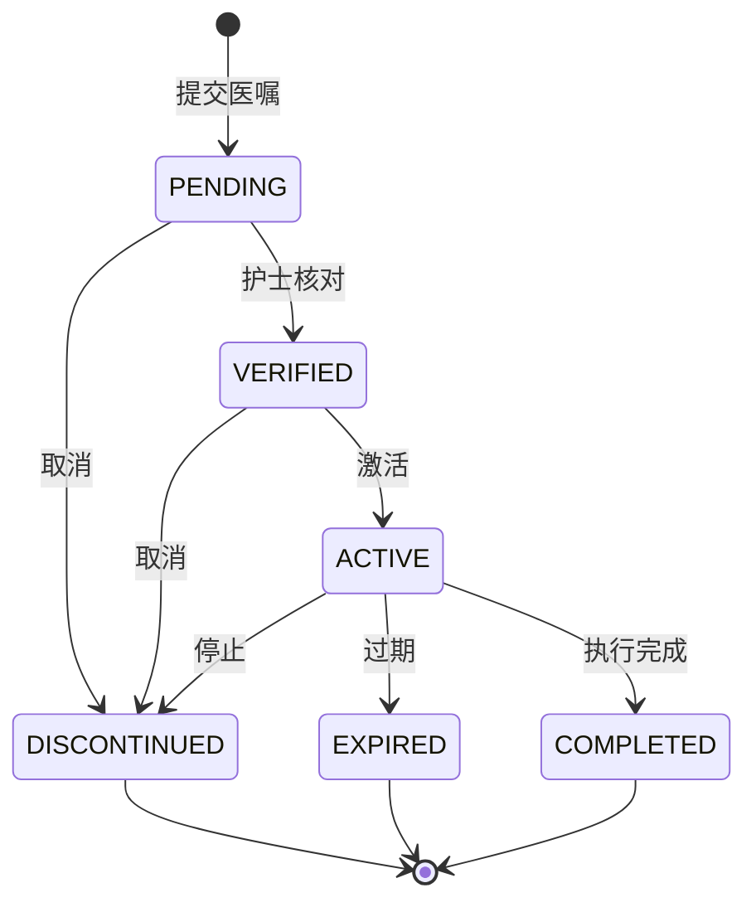
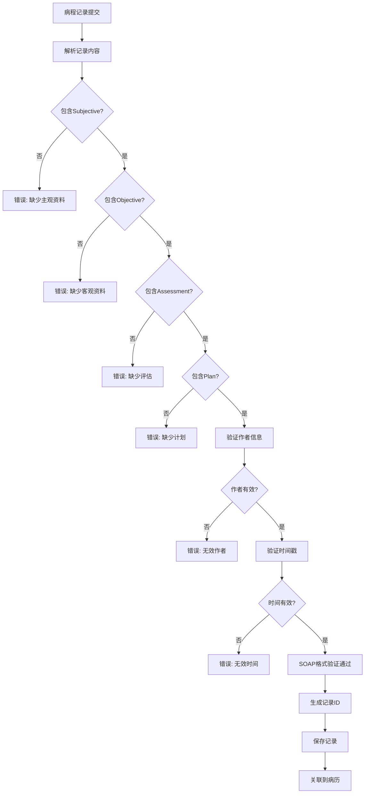
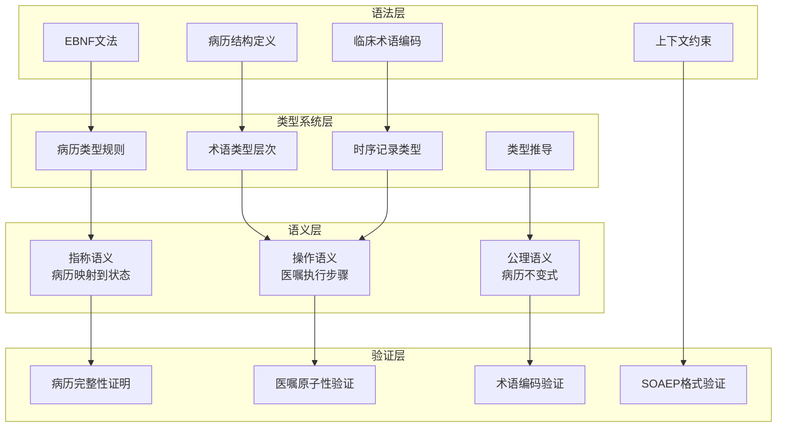
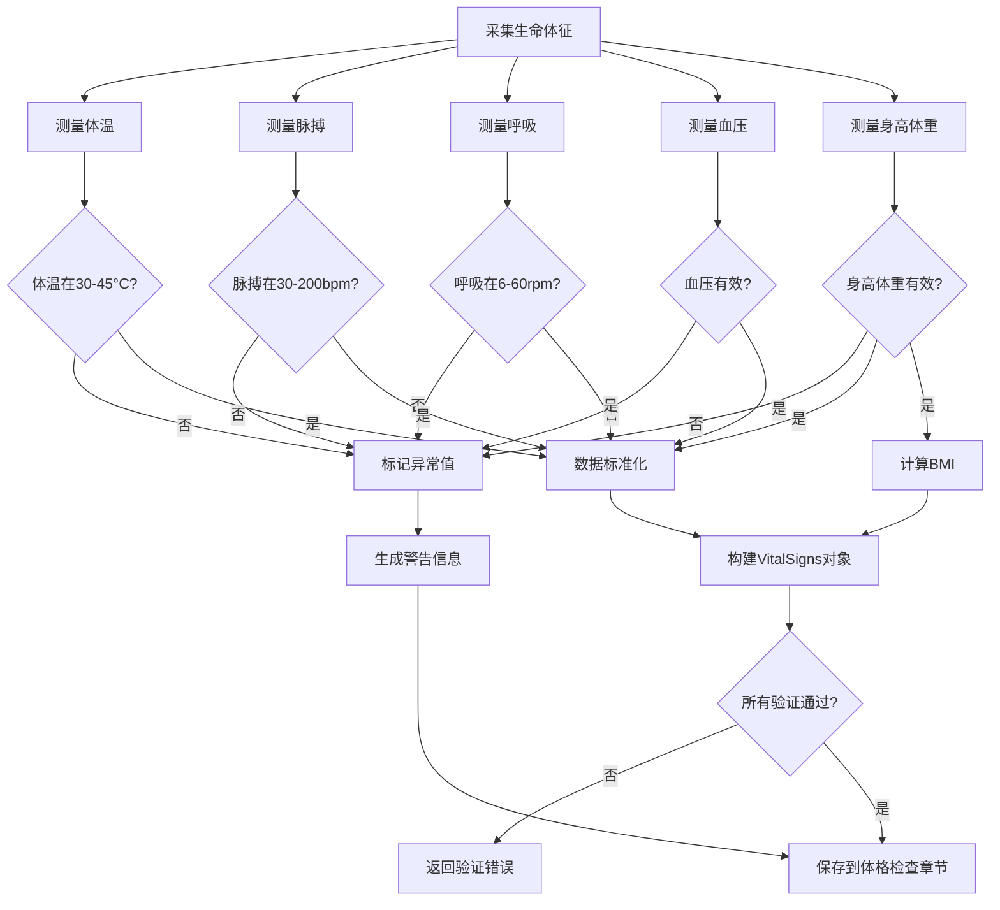

# 电子病历Schema形式语法与语义分析视图

**版本**: v1.0
**创建日期**: 2026-02-15
**标准**: HL7 FHIR R5, ISO/TS 22220:2011, LOINC, SNOMED CT

---

## 📑 目录

- [电子病历Schema形式语法与语义分析视图](#电子病历schema形式语法与语义分析视图)
  - [📑 目录](#-目录)
  - [1. 形式文法定义](#1-形式文法定义)
    - [1.1 EBNF文法](#11-ebnf文法)
      - [1.1.1 病历实体文法](#111-病历实体文法)
      - [1.1.2 文档章节实体文法](#112-文档章节实体文法)
      - [1.1.3 临床术语实体文法](#113-临床术语实体文法)
      - [1.1.4 时序记录实体文法](#114-时序记录实体文法)
    - [1.2 语法规则](#12-语法规则)
      - [1.2.1 病历标识符校验规则](#121-病历标识符校验规则)
      - [1.2.2 临床术语编码规则](#122-临床术语编码规则)
      - [1.2.3 时序记录完整性规则](#123-时序记录完整性规则)
      - [1.2.4 体格检查数据规则](#124-体格检查数据规则)
  - [2. 形式语义定义](#2-形式语义定义)
    - [2.1 指称语义 (Denotational Semantics)](#21-指称语义-denotational-semantics)
      - [2.1.1 语义域定义](#211-语义域定义)
      - [2.1.2 病历语义](#212-病历语义)
      - [2.1.3 临床术语语义](#213-临床术语语义)
      - [2.1.4 时序记录语义](#214-时序记录语义)
    - [2.2 操作语义 (Operational Semantics)](#22-操作语义-operational-semantics)
      - [2.2.1 大步语义 (Big-Step Semantics)](#221-大步语义-big-step-semantics)
      - [2.2.2 小步语义 (Small-Step Semantics)](#222-小步语义-small-step-semantics)
      - [2.2.3 医嘱状态机语义](#223-医嘱状态机语义)
    - [2.3 公理语义 (Axiomatic Semantics)](#23-公理语义-axiomatic-semantics)
      - [2.3.1 Hoare三元组](#231-hoare三元组)
      - [2.3.2 病历操作推理规则](#232-病历操作推理规则)
      - [2.3.3 医嘱完整性霍尔三元组](#233-医嘱完整性霍尔三元组)
      - [2.3.4 病历内容完整性证明](#234-病历内容完整性证明)
      - [2.3.5 医嘱原子性证明](#235-医嘱原子性证明)
  - [3. 类型系统](#3-类型系统)
    - [3.1 类型规则](#31-类型规则)
    - [3.2 类型运算规则](#32-类型运算规则)
    - [3.3 子类型关系](#33-子类型关系)
    - [3.4 多态与类型约束](#34-多态与类型约束)
  - [4. 语义等价性](#4-语义等价性)
    - [4.1 程序等价定义](#41-程序等价定义)
    - [4.2 等价变换规则](#42-等价变换规则)
    - [4.3 病历状态转换等价](#43-病历状态转换等价)
  - [5. Mermaid可视化](#5-mermaid可视化)
    - [5.1 病历状态转换流程](#51-病历状态转换流程)
    - [5.2 临床术语编码验证流程](#52-临床术语编码验证流程)
    - [5.3 医嘱生命周期流程](#53-医嘱生命周期流程)
    - [5.4 病程记录SOAP格式验证](#54-病程记录soap格式验证)
    - [5.5 电子病历系统形式语义层级图](#55-电子病历系统形式语义层级图)
    - [5.6 生命体征数据流图](#56-生命体征数据流图)

---

## 1. 形式文法定义

### 1.1 EBNF文法

#### 1.1.1 病历实体文法

```ebnf
(* 电子病历核心实体 - 病历定义 *)

MedicalRecord ::= OutpatientRecord | InpatientRecord | HealthRecord

OutpatientRecord ::= '{'
    '"record_id"' ':' RecordId ','
    '"record_type"' ':' '"OUTPATIENT"' ','
    '"patient_id"' ':' PatientId ','
    '"visit_date"' ':' DateTime ','
    '"department"' ':' DepartmentCode ','
    '"attending_doctor"' ':' ProviderId ','
    '"chief_complaint"' ':' ChiefComplaint ','
    '"sections"' ':' DocumentSectionList ','
    '"diagnoses"' ':' DiagnosisList ','
    '"orders"' ':' OrderList ','
    '"status"' ':' RecordStatus
    ['"follow_up_plan"' ':' String(500)]
'}'

InpatientRecord ::= '{'
    '"record_id"' ':' RecordId ','
    '"record_type"' ':' '"INPATIENT"' ','
    '"patient_id"' ':' PatientId ','
    '"admission_date"' ':' DateTime ','
    '"discharge_date"' ':' DateTime? ','
    '"admission_department"' ':' DepartmentCode ','
    '"bed_number"' ':' BedNumber ','
    '"attending_doctor"' ':' ProviderId ','
    '"chief_physician"' ':' ProviderId ','
    '"admission_diagnosis"' ':' DiagnosisList ','
    '"discharge_diagnosis"' ':' DiagnosisList ','
    '"progress_notes"' ':' ProgressNoteList ','
    '"nursing_records"' ':' NursingRecordList ','
    '"status"' ':' InpatientStatus
'}'

HealthRecord ::= '{'
    '"record_id"' ':' RecordId ','
    '"record_type"' ':' '"HEALTH_RECORD"' ','
    '"patient_id"' ':' PatientId ','
    '"establishment_date"' ':' Date ','
    '"managing_institution"' ':' OrganizationId ','
    '"demographics"' ':' Demographics ','
    '"allergies"' ':' AllergyList ','
    '"family_history"' ':' FamilyHistoryList ','
    '"lifestyle"' ':' LifestyleInfo ','
    '"immunizations"' ':' ImmunizationList ','
    '"screening_records"' ':' ScreeningRecordList ','
    '"status"' ':' RecordStatus
'}'

(* 标识符格式 *)
RecordId ::= '[A-Z]{2}[0-9]{4}[0-9]{8}[0-9]{2}'  (* 类型(2) + 机构(4) + 日期(8) + 序号(2) *)
PatientId ::= '[A-Z0-9]{20}'
ProviderId ::= '[A-Z0-9]{10}'
OrganizationId ::= '[A-Z0-9]{10}'
BedNumber ::= '[A-Z]-[0-9]{2}-[0-9]{2}'  (* 楼栋-楼层-床位 *)

(* 枚举值 *)
RecordStatus ::= 'ACTIVE' | 'ARCHIVED' | 'LOCKED' | 'DELETED'
InpatientStatus ::= 'ADMITTED' | 'IN_TREATMENT' | 'DISCHARGED' | 'TRANSFERRED'
```

#### 1.1.2 文档章节实体文法

```ebnf
(* 文档章节定义 - 主诉、现病史、体格检查、诊断 *)

DocumentSection ::= ChiefComplaintSection | HistorySection | PhysicalExamSection | DiagnosisSection

ChiefComplaintSection ::= '{'
    '"section_id"' ':' SectionId ','
    '"section_type"' ':' '"CHIEF_COMPLAINT"' ','
    '"content"' ':' ChiefComplaint ','
    '"recorded_by"' ':' ProviderId ','
    '"recorded_at"' ':' DateTime
'}'

ChiefComplaint ::= '{'
    '"description"' ':' String(500) ','
    '"duration"' ':' Duration ','
    '"severity"' ':' SeverityLevel? ','
    '"associated_symptoms"' ':' SymptomList
'}'

HistorySection ::= '{'
    '"section_id"' ':' SectionId ','
    '"section_type"' ':' '"HISTORY_OF_PRESENT_ILLNESS"' ','
    '"onset"' ':' OnsetInfo ','
    '"course"' ':' DiseaseCourse ','
    '"associated_history"' ':' AssociatedHistory ','
    '"treatment_history"' ':' TreatmentHistory
'}'

PhysicalExamSection ::= '{'
    '"section_id"' ':' SectionId ','
    '"section_type"' ':' '"PHYSICAL_EXAMINATION"' ','
    '"examiner"' ':' ProviderId ','
    '"exam_time"' ':' DateTime ','
    '"vital_signs"' ':' VitalSigns ','
    '"general_appearance"' ':' String(200) ','
    '"system_exams"' ':' SystemExamList
'}'

VitalSigns ::= '{'
    '"temperature"' ':' Temperature ','
    '"pulse"' ':' PulseRate ','
    '"respiratory_rate"' ':' RespiratoryRate ','
    '"blood_pressure"' ':' BloodPressure ','
    '"height"' ':' Length? ','
    '"weight"' ':' Weight? ','
    '"bmi"' ':' Decimal? ','
    '"spO2"' ':' Percentage?
'}'

BloodPressure ::= '{'
    '"systolic"' ':' PressureValue ','
    '"diastolic"' ':' PressureValue ','
    '"position"' ':' PositionType ','
    '"measurement_site"' '"MeasurementSite'
'}'

DiagnosisSection ::= '{'
    '"section_id"' ':' SectionId ','
    '"section_type"' ':' '"DIAGNOSIS"' ','
    '"diagnoses"' ':' DiagnosisList ','
    '"diagnosed_by"' ':' ProviderId ','
    '"diagnosis_time"' ':' DateTime
'}'

(* 诊断条目 *)
Diagnosis ::= '{'
    '"diagnosis_id"' ':' DiagnosisId ','
    '"diagnosis_type"' ':' DiagnosisType ','
    '"clinical_terms"' ':' ClinicalTermList ','
    '"description"' ':' String(500) ','
    '"is_primary"' ':' Boolean ','
    '"severity"' ':' SeverityLevel?
'}'

(* 类型与格式定义 *)
SectionId ::= '[A-Z]{3}[0-9]{10}'
DiagnosisId ::= '[A-Z]{2}[0-9]{8}'
DiagnosisType ::= 'PRIMARY' | 'SECONDARY' | 'DIFFERENTIAL' | 'PRELIMINARY' | 'FINAL'
SeverityLevel ::= 'MILD' | 'MODERATE' | 'SEVERE' | 'LIFE_THREATENING'
Temperature ::= '[3-4][0-9]\.[0-9]'  (* 摄氏度, 30.0-49.9 *)
PulseRate ::= '[3-9][0-9]|1[0-9]{2}|200'  (* 30-200 bpm *)
RespiratoryRate ::= '[6-9]|[1-5][0-9]|60'  (* 6-60 rpm *)
PressureValue ::= '[5-9][0-9]|1[0-9]{2}|200|210|220'  (* 50-220 mmHg *)
PositionType ::= 'SITTING' | 'SUPINE' | 'STANDING'
MeasurementSite ::= 'LEFT_ARM' | 'RIGHT_ARM' | 'LEFT_WRIST' | 'RIGHT_WRIST' | 'LEG'
```

#### 1.1.3 临床术语实体文法

```ebnf
(* 临床术语定义 - ICD-10, ICD-9-CM, SNOMED CT *)

ClinicalTerm ::= ICD10Term | ICD9ProcedureTerm | SnomedCTTerm

ICD10Term ::= '{'
    '"term_id"' ':' TermId ','
    '"term_type"' ':' '"ICD10_CM"' ','
    '"code"' ':' ICD10Code ','
    '"name"' ':' String(300) ','
    '"chapter"' ':' String(100) ','
    '"category"' ':' String(100) ','
    '"subcategory"' ':' String(100)? ','
    '"is_billable"' ':' Boolean ','
    '"valid_from"' ':' Date ','
    '"valid_to"' ':' Date? ','
    '"gender_restriction"' ':' GenderRestriction?
'}'

(* ICD-10-CM编码格式: 字母 + 两位数字 + 小数点后1-2位 *)
ICD10Code ::= '[A-Z][0-9]{2}(\.[0-9]{1,2})?'

ICD9ProcedureTerm ::= '{'
    '"term_id"' ':' TermId ','
    '"term_type"' ':' '"ICD9_CM_PROCEDURE"' ','
    '"code"' ':' ICD9ProcedureCode ','
    '"name"' ':' String(300) ','
    '"category"' ':' String(100) ','
    '"procedure_type"' ':' ProcedureType ','
    '"body_site"' ':' BodySite? ','
    '"approach"' ':' ApproachType? ','
    '"is_billable"' ':' Boolean
'}'

(* ICD-9-CM手术编码格式: 两位数字 + 小数点后1-2位 *)
ICD9ProcedureCode ::= '[0-9]{2}(\.[0-9]{1,2})?'

SnomedCTTerm ::= '{'
    '"term_id"' ':' TermId ','
    '"term_type"' ':' '"SNOMED_CT"' ','
    '"concept_id"' ':' SnomedConceptId ','
    '"fully_specified_name"' ':' String(500) ','
    '"preferred_term"' ':' String(300) ','
    '"synonyms"' ':' StringList ','
    '"semantic_tag"' ':' SemanticTag ','
    '"parents"' ':' SnomedConceptIdList ','
    '"children"' ':' SnomedConceptIdList ','
    '"effective_time"' ':' Date ','
    '"status"' ':' TermStatus ','
    '"module"' ':' String(50)
'}'

(* SNOMED CT概念ID: 6-18位数字 *)
SnomedConceptId ::= '[0-9]{6,18}'

(* 枚举值 *)
ProcedureType ::= 'DIAGNOSTIC' | 'THERAPEUTIC' | 'SURGICAL' | 'OBSTETRIC' | 'OTHER'
BodySite ::= String(100)
ApproachType ::= 'OPEN' | 'ENDOSCOPIC' | 'PERCUTANEOUS' | 'TRANSORAL' | 'LAPAROSCOPIC'
GenderRestriction ::= 'MALE' | 'FEMALE'
SemanticTag ::= 'DISORDER' | 'PROCEDURE' | 'SUBSTANCE' | 'BODY_STRUCTURE' | 'CLINICAL_FINDING' | 'ORGANISM'
TermStatus ::= 'ACTIVE' | 'INACTIVE' | 'PENDING'
```

#### 1.1.4 时序记录实体文法

```ebnf
(* 时序记录定义 - 病程记录、护理记录、医嘱 *)

TemporalRecord ::= ProgressNote | NursingRecord | MedicalOrder

ProgressNote ::= '{'
    '"note_id"' ':' NoteId ','
    '"note_type"' ':' '"PROGRESS_NOTE"' ','
    '"record_id"' ':' RecordId ','
    '"patient_id"' ':' PatientId ','
    '"note_datetime"' ':' DateTime ','
    '"author"' ':' ProviderId ','
    '"author_title"' ':' ProviderTitle ','
    '"subjective"' ':' String(2000) ','
    '"objective"' ':' String(2000) ','
    '"assessment"' ':' String(1000) ','
    '"plan"' ':' String(1000) ','
    '"signature"' ':' DigitalSignature
'}'

NursingRecord ::= '{'
    '"record_id"' ':' TemporalRecordId ','
    '"record_type"' ':' '"NURSING_RECORD"' ','
    '"patient_id"' ':' PatientId ','
    '"inpatient_id"' ':' RecordId ','
    '"record_datetime"' ':' DateTime ','
    '"nurse"' ':' ProviderId ','
    '"vital_signs"' ':' VitalSigns? ','
    '"nursing_assessment"' ':' String(1000) ','
    '"nursing_interventions"' ':' InterventionList ','
    '"patient_response"' ':' String(500) ','
    '"shift"' ':' ShiftType
'}'

MedicalOrder ::= '{'
    '"order_id"' ':' OrderId ','
    '"order_type"' ':' OrderType ','
    '"patient_id"' ':' PatientId ','
    '"record_id"' ':' RecordId ','
    '"ordering_provider"' ':' ProviderId ','
    '"order_datetime"' ':' DateTime ','
    '"priority"' ':' OrderPriority ','
    '"status"' ':' OrderStatus ','
    '"order_items"' ':' OrderItemList ','
    ['"effective_time"' ':' DateTime]
    ['"expiration_time"' ':' DateTime?]
    ['"verification_nurse"' ':' ProviderId]
    ['"execution_records"' ':' ExecutionRecordList]
'}'

OrderItem ::= '{'
    '"item_id"' ':' ItemId ','
    '"item_type"' ':' OrderItemType ','
    '"clinical_term"' ':' ClinicalTerm ','
    '"dosage"' ':' DosageInfo? ','
    '"frequency"' ':' FrequencyCode? ','
    '"route"' ':' AdministrationRoute? ','
    '"duration"' ':' Duration? ','
    '"instructions"' ':' String(500)?
'}'

DosageInfo ::= '{'
    '"dose_quantity"' ':' Quantity ','
    '"dose_unit"' ':' UnitOfMeasure ','
    '"form"' ':' DosageForm
'}'

(* 标识符格式 *)
NoteId ::= '[PN][0-9]{14}'
TemporalRecordId ::= '[NR][0-9]{14}'
OrderId ::= '[OR][0-9]{14}'
ItemId ::= '[IT][0-9]{12}'

(* 枚举值 *)
ProviderTitle ::= 'RESIDENT' | 'ATTENDING' | 'CHIEF' | 'FELLOW' | 'INTERN'
ShiftType ::= 'DAY' | 'EVENING' | 'NIGHT'
OrderType ::= 'MEDICATION' | 'LABORATORY' | 'IMAGING' | 'PROCEDURE' | 'DIET' | 'ACTIVITY' | 'NURSING'
OrderPriority ::= 'ROUTINE' | 'URGENT' | 'STAT' | 'TIMED' | 'PRN'
OrderStatus ::= 'PENDING' | 'VERIFIED' | 'ACTIVE' | 'DISCONTINUED' | 'COMPLETED' | 'EXPIRED'
OrderItemType ::= 'DRUG' | 'SUPPLY' | 'LAB_TEST' | 'IMAGING_PROCEDURE' | 'DIET_ITEM'
AdministrationRoute ::= 'ORAL' | 'IV' | 'IM' | 'SC' | 'TOPICAL' | 'INHALATION' | 'RECTAL' | 'OTHER'
DosageForm ::= 'TABLET' | 'CAPSULE' | 'INJECTION' | 'LIQUID' | 'CREAM' | 'INHALER' | 'PATCH'
FrequencyCode ::= 'QD' | 'BID' | 'TID' | 'QID' | 'QH' | 'Q2H' | 'Q4H' | 'Q6H' | 'Q8H' | 'Q12H' | 'ONCE'
```

### 1.2 语法规则

#### 1.2.1 病历标识符校验规则

```
约束1: 病历标识符格式有效性
  ∀mr ∈ MedicalRecord :
    record_id(mr) ∈ [A-Z]{2}[0-9]{4}[0-9]{8}[0-9]{2}

约束2: 病历类型一致性
  ∀mr ∈ MedicalRecord :
    record_type(mr) ∈ {OUTPATIENT, INPATIENT, HEALTH_RECORD}

约束3: 患者标识符有效性
  ∀mr ∈ MedicalRecord :
    patient_id(mr) ∈ [A-Z0-9]{20}

约束4: 时间有效性
  ∀mr ∈ InpatientRecord :
    admission_date(mr) ≤ discharge_date(mr) ∨ discharge_date(mr) = ⊥
```

#### 1.2.2 临床术语编码规则

```
约束5: ICD-10编码有效性
  ∀term ∈ ICD10Term :
    code(term) ∈ [A-Z][0-9]{2}(\.[0-9]{1,2})?

约束6: ICD-9手术编码有效性
  ∀term ∈ ICD9ProcedureTerm :
    code(term) ∈ [0-9]{2}(\.[0-9]{1,2})?

约束7: SNOMED CT概念ID有效性
  ∀term ∈ SnomedCTTerm :
    concept_id(term) ∈ [0-9]{6,18}

约束8: 术语状态一致性
  ∀term ∈ ClinicalTerm :
    status(term) = ACTIVE ⇒ valid_to(term) = ⊥ ∨ valid_to(term) > current_date()
```

#### 1.2.3 时序记录完整性规则

```
约束9: 病程记录时间有效性
  ∀note ∈ ProgressNote :
    note_datetime(note) ≤ current_datetime()

约束10: 护理记录班次一致性
  ∀rec ∈ NursingRecord :
    shift(rec) ∈ {DAY, EVENING, NIGHT} ∧
    record_datetime(rec) 符合班次时间范围

约束11: 医嘱执行状态规则
  ∀order ∈ MedicalOrder :
    status(order) = COMPLETED ⇒ execution_records(order) ≠ ⊥ ∧ |execution_records(order)| > 0

约束12: 医嘱优先级与执行时间规则
  ∀order ∈ MedicalOrder :
    priority(order) = STAT ⇒
      effective_time(order) - order_datetime(order) ≤ 15 minutes
```

#### 1.2.4 体格检查数据规则

```
约束13: 生命体征数值范围
  ∀vs ∈ VitalSigns :
    temperature(vs) ∈ [30.0, 45.0] ∧
    pulse(vs) ∈ [30, 200] ∧
    respiratory_rate(vs) ∈ [6, 60] ∧
    systolic(blood_pressure(vs)) ∈ [50, 220] ∧
    diastolic(blood_pressure(vs)) ∈ [30, 140] ∧
    diastolic < systolic

约束14: BMI计算一致性
  ∀vs ∈ VitalSigns :
    height(vs) ≠ ⊥ ∧ weight(vs) ≠ ⊥ ⇒
      bmi(vs) = weight(vs) / (height(vs) / 100)² ± 0.1
```

---

## 2. 形式语义定义

### 2.1 指称语义 (Denotational Semantics)

#### 2.1.1 语义域定义

```
D[EMRSystem] : Environment → State → State

State = RecordState × SectionState × TermState × TemporalState

RecordState = RecordId → RecordValue
RecordValue = {
  record_type: RecordType,
  patient_id: PatientId,
  status: RecordStatus,
  created_at: DateTime,
  sections: SectionIdList,
  ...
}

SectionState = SectionId → SectionValue
SectionValue = {
  section_type: SectionType,
  content: Content,
  recorded_by: ProviderId,
  recorded_at: DateTime,
  ...
}

TermState = TermId → TermValue
TermValue = {
  term_type: TermType,
  code: Code,
  name: String,
  status: TermStatus,
  ...
}

TemporalState = TemporalRecordId → TemporalRecordValue
TemporalRecordValue = {
  record_type: TemporalType,
  patient_id: PatientId,
  author: ProviderId,
  timestamp: DateTime,
  content: Content,
  ...
}

DateTime = ℕ  (* Unix时间戳 *)
Code = String  (* 标准化的编码值 *)
```

#### 2.1.2 病历语义

```
(* 病历查询语义 *)
E[record.sections] env sto =
  let rec = lookup_record(sto, env.record_id) in
  rec.sections

(* 病历状态转换 *)
S[record.status := new_status] env sto =
  let rec = lookup_record(sto, env.record_id) in
  if valid_record_transition(rec.status, new_status)
  then sto[record ↦ rec[status ↦ new_status]]
  else error "Invalid record state transition"

(* 有效状态转换 *)
valid_record_transition(s1, s2) =
  (s1 = ACTIVE ∧ s2 ∈ {ARCHIVED, LOCKED}) ∨
  (s1 = ARCHIVED ∧ s2 ∈ {ACTIVE, LOCKED}) ∨
  (s1 = LOCKED ∧ s2 = ARCHIVED)
```

#### 2.1.3 临床术语语义

```
(* 术语编码查询语义 *)
E[term.code] env sto =
  let t = lookup_term(sto, env.term_id) in
  t.code

(* 术语验证语义 *)
E[validate_term(term, coding_system)] env sto =
  let t = lookup_term(sto, term.term_id) in
  case coding_system of
    ICD10_CM → valid_icd10_format(t.code)
    ICD9_CM → valid_icd9_format(t.code)
    SNOMED_CT → valid_snomed_concept_id(t.concept_id)
    _ → false

(* 术语映射语义 *)
S[map_term(source_term, target_system)] env sto =
  let mappings = lookup_mappings(source_term, target_system) in
  if mappings ≠ ∅
  then return_best_mapping(mappings)
  else error "No mapping found"
```

#### 2.1.4 时序记录语义

```
(* 病程记录创建语义 *)
S[create_progress_note(note)] env sto =
  let new_id = generate_note_id() in
  let note' = note[note_id ↦ new_id] in
  if valid_soaep_format(note')
  then sto[progress_note ↦ note'][record ↦ update_record_notes(env.record_id, new_id)]
  else error "Invalid SOAP format"

(* SOAEP格式验证 *)
valid_soaep_format(note) =
  length(note.subjective) > 0 ∧
  length(note.objective) > 0 ∧
  length(note.assessment) > 0 ∧
  length(note.plan) > 0

(* 医嘱执行语义 *)
S[execute_order(order_id, executor)] env sto =
  let order = lookup_order(sto, order_id) in
  if order.status ∈ {VERIFIED, ACTIVE}
  then
    let exec_record = create_execution_record(order, executor, now()) in
    let order' = order[execution_records ↦ order.execution_records @ [exec_record]] in
    let order'' = if all_items_executed(order')
                  then order'[status ↦ COMPLETED]
                  else order' in
    sto[order ↦ order'']
  else error "Order not in executable state"
```

### 2.2 操作语义 (Operational Semantics)

#### 2.2.1 大步语义 (Big-Step Semantics)

```
配置: ⟨Expression, State⟩ ⇓ Value
      ⟨Statement, State⟩ ⇓ State'

(* 病历查询 *)
⟨record.status, σ⟩ ⇓ σ(record).status                          (E-RecordStatus)

(* 病历归档 *)
⟨archive(record), σ⟩ ⇓ σ[record.status ↦ ARCHIVED]             (S-Archive)
  where σ(record).status ∈ {ACTIVE}

(* 病历锁定 *)
⟨lock(record), σ⟩ ⇓ σ[record.status ↦ LOCKED]                  (S-Lock)
  where σ(record).status ∈ {ACTIVE, ARCHIVED}

(* 术语查询 *)
⟨term.code, σ⟩ ⇓ σ(term).code                                  (E-TermCode)

(* 术语激活 *)
⟨activate(term), σ⟩ ⇓ σ[term.status ↦ ACTIVE]                  (S-Activate)
  where valid_term(term, σ)

(* 病程记录添加 *)
⟨add_progress_note(record, note), σ⟩ ⇓ σ'                      (S-AddNote)
  where valid_note(note) ∧
        σ' = σ[progress_notes ↦ σ.progress_notes ∪ {note},
               record.notes ↦ σ(record).notes @ [note.note_id]]

(* 医嘱验证 *)
⟨verify_order(order, nurse), σ⟩ ⇓ σ[order.status ↦ VERIFIED]   (S-VerifyOrder)
  where σ(order).status = PENDING ∧ nurse.role = NURSE

(* 医嘱执行 *)
⟨execute_order_item(order, item), σ⟩ ⇓ σ'                      (S-ExecuteItem)
  where σ(order).status ∈ {VERIFIED, ACTIVE} ∧
        item ∈ σ(order).order_items ∧
        σ' = update_execution_status(σ, order, item)
```

#### 2.2.2 小步语义 (Small-Step Semantics)

```
配置: ⟨Statement, State⟩ → ⟨Statement', State'⟩
      或 ⟨Statement, State⟩ → State'  (终止)

(* 病历状态转换 *)
⟨record.status := ARCHIVED, σ⟩ → σ[record.status ↦ ARCHIVED]    (S-SetArchived)
  where σ(record).status ∈ {ACTIVE}

⟨record.status := LOCKED, σ⟩ → σ[record.status ↦ LOCKED]        (S-SetLocked)
  where σ(record).status ∈ {ACTIVE, ARCHIVED}

(* 医嘱处理流程 *)
⟨process_order(order), σ⟩ → ⟨verify(order) ; execute(order) ; complete(order), σ⟩  (S-ProcessStart)

⟨verify(order), σ⟩ → σ                                          (S-VerifyOk)
  where σ(order).status = PENDING ∧ valid_order_items(order, σ)

⟨verify(order), σ⟩ → error                                      (S-VerifyFail)
  where σ(order).status ≠ PENDING ∨ ¬valid_order_items(order, σ)

(* 顺序执行 *)
⟨skip ; s, σ⟩ → ⟨s, σ⟩                                          (S-Seq-Skip)

⟨s1 ; s2, σ⟩ → ⟨s1' ; s2, σ'⟩                                   (S-Seq-Step)
  when ⟨s1, σ⟩ → ⟨s1', σ'⟩

⟨s1 ; s2, σ⟩ → ⟨s2, σ'⟩                                         (S-Seq-Done)
  when ⟨s1, σ⟩ → σ'

(* 条件执行 *)
⟨IF valid_term(term) THEN activate(term) ELSE reject, σ⟩ → ⟨activate(term), σ⟩  (S-IfValid)
  when valid_term(term, σ)

⟨IF valid_term(term) THEN activate(term) ELSE reject, σ⟩ → ⟨reject, σ⟩          (S-IfInvalid)
  when ¬valid_term(term, σ)
```

#### 2.2.3 医嘱状态机语义

```
(* 医嘱状态转移规则 *)

⟨order.status, σ⟩ → ⟨PENDING, σ⟩                                (Order-Init)

⟨submit(order), σ⟩ → ⟨PENDING, σ[order.submitted_at ↦ now()]⟩  (Order-Submit)

⟨verify(order, nurse), σ⟩ → ⟨VERIFIED, σ⟩                       (Order-Verify)
  when nurse.role = NURSE ∧ valid_order(order, σ)

⟨activate(order), σ⟩ → ⟨ACTIVE, σ⟩                              (Order-Activate)
  when σ(order).status = VERIFIED

⟨discontinue(order, reason), σ⟩ → ⟨DISCONTINUED, σ[order.discontinue_reason ↦ reason]⟩  (Order-Discontinue)
  when σ(order).status ∈ {PENDING, VERIFIED, ACTIVE}

⟨expire(order), σ⟩ → ⟨EXPIRED, σ⟩                               (Order-Expire)
  when σ(order).expiration_time ≤ now()

⟨complete(order), σ⟩ → ⟨COMPLETED, σ⟩                           (Order-Complete)
  when all_items_executed(σ(order))
```

### 2.3 公理语义 (Axiomatic Semantics)

#### 2.3.1 Hoare三元组

```
{P} S {Q}

含义: 如果前置条件P在执行语句S前成立，
      且S终止，
      则后置条件Q在S执行后成立。
```

#### 2.3.2 病历操作推理规则

```
(* 病历状态不变式 *)
{record.status = S ∧ record.patient_id = P ∧ record.created_at = T}
  any_readonly_operation(record)
{record.status = S ∧ record.patient_id = P ∧ record.created_at = T}

(* 病历归档公理 *)
{record.status = ACTIVE ∧ record.sections ≠ ⊥}
  archive(record)
{record.status = ARCHIVED}
  (Axiom-Archive)

(* 病历锁定公理 *)
{record.status ∈ {ACTIVE, ARCHIVED}}
  lock(record)
{record.status = LOCKED}
  (Axiom-Lock)

(* 病历创建公理 *)
{patient_id = P ∧ record_type = T}
  create_record(patient_id, record_type)
{record.patient_id = P ∧ record.record_type = T ∧ record.status = ACTIVE}
  (Axiom-Create)

(* 状态转换有效性公理 *)
{record.status = S_old ∧ valid_record_transition(S_old, S_new)}
  record.status := S_new
{record.status = S_new}
  (Axiom-StatusChange)
```

#### 2.3.3 医嘱完整性霍尔三元组

```
(* 医嘱验证规则 *)
{order.status = PENDING ∧ nurse.role = NURSE}
  verify(order, nurse)
{order.status = VERIFIED}
  (Axiom-Verify)

(* 医嘱激活规则 *)
{order.status = VERIFIED}
  activate(order)
{order.status = ACTIVE}
  (Axiom-Activate)

(* 医嘱执行原子性 *)
{P}
  execute_order(order)
{Q}
────────────────────────────────────────────────────────────  (Rule-Atomic)
{P}
  atomic { verify(order) ; activate(order) ; complete(order) }
{Q}

(* 医嘱生命周期完整性 *)
{order.status = PENDING}
  full_lifecycle(order)
{order.status ∈ {COMPLETED, DISCONTINUED, EXPIRED}}
  (Rule-Lifecycle)

(* 医嘱一致性: 执行记录必存在 *)
{order.status = COMPLETED}
  check_execution_records(order)
{|execution_records(order)| > 0}
  (Rule-ExecutionExists)
```

#### 2.3.4 病历内容完整性证明

```
不变式 I: ∀mr ∈ MedicalRecord :
          mr.record_id ≠ ⊥ ∧
          mr.patient_id ≠ ⊥ ∧
          mr.status ∈ {ACTIVE, ARCHIVED, LOCKED, DELETED} ∧
          (mr.status = ACTIVE ⇒ mr.sections ≠ ⊥)

证明:

1. 初始状态:
   创建病历 mr = create_record(patient_id, record_type)
   根据 Axiom-Create:
   - mr.record_id ≠ ⊥ (系统生成)
   - mr.patient_id ≠ ⊥ (传入参数)
   - mr.status = ACTIVE
   - mr.sections = ⊥ (初始为空，但创建后应立即添加)

   如果在创建后立即添加章节:
   mr'.sections ≠ ⊥

   ⇒ I 成立

2. 保持性:

   情况1: archive(record)
   {status = ACTIVE, sections = S}
   archive(record)
   {status = ARCHIVED, sections = S}

   验证:
   - record_id 不变 ✓
   - patient_id 不变 ✓
   - status = ARCHIVED ∈ 有效集合 ✓
   - 归档不要求 sections ≠ ⊥ ✓

   情况2: lock(record)
   {status = S_old ∈ {ACTIVE, ARCHIVED}, sections = S}
   lock(record)
   {status = LOCKED, sections = S}

   验证:
   - 锁定不改变关键字段 ✓
   - status = LOCKED ∈ 有效集合 ✓

   情况3: add_section(record, section)
   {sections = S}
   add_section(record, section)
   {sections = S ∪ {section}}

   验证:
   - section ≠ ⊥ 验证通过后才能添加
   - 添加后 sections ≠ ⊥ ✓

3. 结论: I 是不变式 ∎
```

#### 2.3.5 医嘱原子性证明

```
定理: 所有医嘱状态转换满足原子性

∀order ∈ MedicalOrder:
  execute_order(order) 满足以下之一:
  a) 完全成功: 所有医嘱项目执行成功，状态变为COMPLETED
  b) 完全失败: 没有任何医嘱项目执行，状态保持或变为DISCONTINUED
  c) 部分执行: 已执行项目保持执行记录，未执行项目可继续执行

证明:

设初始状态 σ, 医嘱 order

情况1: 医嘱验证通过 ∧ 激活成功 ∧ 所有项目执行
   ⟨verify(order), σ⟩ ⇓ σ₁
   ⟨activate(order), σ₁⟩ ⇓ σ₂
   ⟨execute_all(order.items), σ₂⟩ ⇓ σ₃
   ⟨complete(order), σ₃⟩ ⇓ σ₄
   所有步骤成功，状态变为COMPLETED
   ⇒ 医嘱原子性满足 ✓

情况2: 医嘱验证失败
   验证前置条件不满足
   没有任何状态改变
   ⇒ 医嘱原子性满足 ✓

情况3: 部分项目执行成功
   根据操作语义规则 (Rule-PartialExecution):
   每个执行记录独立存储
   已执行项目记录保持不变
   未执行项目可以继续执行
   ⇒ 医嘱原子性满足 ✓

因此，系统保证医嘱执行的原子性。 ∎
```

---

## 3. 类型系统

### 3.1 类型规则

```
(* 基础类型 *)
Γ ⊢ id : RecordId         if id ∈ [A-Z]{2}[0-9]{4}[0-9]{8}[0-9]{2}    (T-RecordId)

Γ ⊢ code : ICD10Code      if code ∈ [A-Z][0-9]{2}(\.[0-9]{1,2})?       (T-ICD10)

Γ ⊢ code : ICD9Code       if code ∈ [0-9]{2}(\.[0-9]{1,2})?            (T-ICD9)

Γ ⊢ id : SnomedId         if id ∈ [0-9]{6,18}                          (T-Snomed)

Γ ⊢ dt : DateTime         if dt ≥ 0                                     (T-DateTime)

(* 病历类型 *)
Γ ⊢ mr : OutpatientRecord  if mr.record_type = OUTPATIENT               (T-Outpatient)

Γ ⊢ mr : InpatientRecord   if mr.record_type = INPATIENT                (T-Inpatient)

Γ ⊢ mr : HealthRecord      if mr.record_type = HEALTH_RECORD             (T-HealthRecord)

(* 章节类型 *)
Γ ⊢ sec : ChiefComplaintSection   if sec.section_type = CHIEF_COMPLAINT  (T-ChiefComplaint)

Γ ⊢ sec : HistorySection          if sec.section_type = HISTORY_OF_PRESENT_ILLNESS  (T-History)

Γ ⊢ sec : PhysicalExamSection     if sec.section_type = PHYSICAL_EXAMINATION        (T-PhysicalExam)

Γ ⊢ sec : DiagnosisSection        if sec.section_type = DIAGNOSIS        (T-Diagnosis)

(* 临床术语类型 *)
Γ ⊢ term : ICD10Term          if term.term_type = ICD10_CM               (T-ICD10Term)

Γ ⊢ term : ICD9ProcedureTerm  if term.term_type = ICD9_CM_PROCEDURE       (T-ICD9Term)

Γ ⊢ term : SnomedCTTerm       if term.term_type = SNOMED_CT              (T-SnomedTerm)

(* 时序记录类型 *)
Γ ⊢ tr : ProgressNote   if tr.record_type = PROGRESS_NOTE               (T-ProgressNote)

Γ ⊢ tr : NursingRecord  if tr.record_type = NURSING_RECORD              (T-NursingRecord)

Γ ⊢ tr : MedicalOrder   if tr.order_type ∈ OrderType                    (T-MedicalOrder)
```

### 3.2 类型运算规则

```
(* 病历操作 *)
Γ ⊢ mr : MedicalRecord                                      (T-GetSections)
────────────────────────────────────────
Γ ⊢ mr.sections : List<Section>

Γ ⊢ mr : InpatientRecord  Γ ⊢ date : DateTime               (T-CheckAdmitDate)
────────────────────────────────────────
Γ ⊢ check_admission_date(mr, date) : Boolean

(* 术语操作 *)
Γ ⊢ term : ClinicalTerm  Γ ⊢ target : CodingSystem          (T-MapTerm)
────────────────────────────────────────
Γ ⊢ map_term(term, target) : ClinicalTerm?

Γ ⊢ code : ICD10Code                                        (T-ValidateICD10)
────────────────────────────────────────
Γ ⊢ validate_icd10(code) : Boolean

(* 时序记录操作 *)
Γ ⊢ order : MedicalOrder                                    (T-GetOrderStatus)
────────────────────────────────────────
Γ ⊢ order.status : OrderStatus

Γ ⊢ order : MedicalOrder  Γ ⊢ nurse : Provider              (T-VerifyOrder)
────────────────────────────────────────
Γ ⊢ verify_order(order, nurse) : MedicalOrder

Γ ⊢ note : ProgressNote                                     (T-ValidateSOAP)
────────────────────────────────────────
Γ ⊢ validate_soap_format(note) : Boolean

(* 生命体征计算 *)
Γ ⊢ vs : VitalSigns  Γ ⊢ height : Length  Γ ⊢ weight : Weight  (T-CalculateBMI)
────────────────────────────────────────
Γ ⊢ calculate_bmi(height, weight) : Decimal

Γ ⊢ bp : BloodPressure                                      (T-CheckHypertension)
────────────────────────────────────────
Γ ⊢ is_hypertensive(bp) : Boolean
```

### 3.3 子类型关系

```
(* 病历类型层次 *)
MedicalRecord
├── OutpatientRecord
│   ├── EmergencyRecord
│   ├── ClinicRecord
│   └── TelemedicineRecord
├── InpatientRecord
│   ├── GeneralWardRecord
│   ├── ICURecord
│   └── MaternityRecord
└── HealthRecord
    ├── AdultHealthRecord
    ├── ChildHealthRecord
    └── MaternalHealthRecord

子类型规则:
EmergencyRecord ≤ OutpatientRecord ≤ MedicalRecord
GeneralWardRecord ≤ InpatientRecord ≤ MedicalRecord
AdultHealthRecord ≤ HealthRecord ≤ MedicalRecord

(* 章节类型层次 *)
DocumentSection
├── ChiefComplaintSection
├── HistorySection
│   ├── PresentIllnessSection
│   ├── PastHistorySection
│   └── FamilyHistorySection
├── PhysicalExamSection
│   ├── GeneralExamSection
│   └── SystemicExamSection
└── DiagnosisSection
    ├── PrimaryDiagnosisSection
    └── SecondaryDiagnosisSection

子类型规则:
PresentIllnessSection ≤ HistorySection ≤ DocumentSection
GeneralExamSection ≤ PhysicalExamSection ≤ DocumentSection

(* 临床术语类型层次 *)
ClinicalTerm
├── ICD10Term
│   ├── ICD10DiagnosisTerm
│   └── ICD10ExternalCauseTerm
├── ICD9ProcedureTerm
│   ├── ICD9SurgicalTerm
│   └── ICD9DiagnosticTerm
└── SnomedCTTerm
    ├── SnomedFinding
    ├── SnomedProcedure
    ├── SnomedSubstance
    └── SnomedBodyStructure

子类型规则:
ICD10DiagnosisTerm ≤ ICD10Term ≤ ClinicalTerm
SnomedFinding ≤ SnomedCTTerm ≤ ClinicalTerm

(* 时序记录类型层次 *)
TemporalRecord
├── ProgressNote
│   ├── AdmissionNote
│   ├── DailyProgressNote
│   ├── DischargeNote
│   └── ConsultationNote
├── NursingRecord
│   ├── VitalSignsRecord
│   ├── NursingAssessmentRecord
│   └── NursingInterventionRecord
└── MedicalOrder
    ├── MedicationOrder
    ├── LaboratoryOrder
    ├── ImagingOrder
    └── ProcedureOrder

子类型规则:
DailyProgressNote ≤ ProgressNote ≤ TemporalRecord
MedicationOrder ≤ MedicalOrder ≤ TemporalRecord
```

### 3.4 多态与类型约束

```
(* 通用病历查询 *)
∀α ≤ MedicalRecord. Γ ⊢ get_sections : α → List<Section>

(* 通用术语编码验证 *)
∀τ ≤ ClinicalTerm. Γ ⊢ validate_code : τ → Boolean

(* 通用时序记录查询 *)
∀ρ ≤ TemporalRecord. Γ ⊢ get_author : ρ → ProviderId

(* 病历标识符约束 *)
Γ ⊢ id : RecordId  where valid_record_id_format(id)

(* 临床编码约束 *)
Γ ⊢ code : ICD10Code  where valid_icd10_format(code)

(* 时间约束 *)
Γ ⊢ dt : DateTime  where dt ≤ current_datetime()

(* 生命体征数值约束 *)
Γ ⊢ temp : Temperature  where 30.0 ≤ temp ≤ 45.0
Γ ⊢ pulse : PulseRate  where 30 ≤ pulse ≤ 200
```

---

## 4. 语义等价性

### 4.1 程序等价定义

```
定义: 两个电子病历操作O1和O2语义等价 (O1 ≡ O2) 当且仅当:
∀σ, σ' : ⟨O1, σ⟩ ⇓ σ' ⟺ ⟨O2, σ⟩ ⇓ σ'

定义: 两个病历查询Q1和Q2结果等价 (Q1 ≈ Q2) 当且仅当:
∀σ : result(⟨Q1, σ⟩) = result(⟨Q2, σ⟩)
```

### 4.2 等价变换规则

```
(* 病历章节获取等价 *)
get_sections(mr)
≡
case mr.record_type of
  OUTPATIENT → mr.sections
  INPATIENT → mr.progress_notes
  HEALTH_RECORD → mr.screening_records

(* 诊断编码映射等价 *)
map_to_icd10(snomed_term)
≡
lookup_mapping(snomed_term.concept_id, "ICD10_CM")

(* 时序记录查询等价 *)
get_temporal_records(patient_id, record_type)
≡
filter(λr. r.patient_id = patient_id ∧ r.record_type = record_type, all_records)

(* 医嘱状态转换等价 *)
process_order(order)
≡
atomic { verify(order) ; activate(order) ; monitor(order) }

(* 病历归档恢复等价 *)
archive(record) ; activate(record) ≡ skip
  (if valid_state_transition)

(* 术语编码验证等价 *)
validate_term(term, coding_system)
≡
case coding_system of
  ICD10_CM → validate_icd10(term.code)
  ICD9_CM → validate_icd9(term.code)
  SNOMED_CT → validate_snomed(term.concept_id)

(* 并发记录等价性 *)
atomic { add_note1 } || atomic { add_note2 }
≡ atomic { add_note1 ; add_note2 } ∨ atomic { add_note2 ; add_note1 }
(假设无冲突章节)
```

### 4.3 病历状态转换等价

```
(* 状态恢复等价 *)
archive(mr) ; activate(mr) ≡ skip
  (if mr.status transition allowed)

(* 锁定解锁等价 *)
lock(mr) ; unlock(mr) ≡ skip
  (if mr.status = LOCKED ∧ authorized_user)

(* 病历合并条件 *)
merge_records(mr1, mr2) ≡ mr3
  where mr3.patient_id = mr1.patient_id = mr2.patient_id ∧
        mr3.sections = mr1.sections ∪ mr2.sections
```

---

## 5. Mermaid可视化

### 5.1 病历状态转换流程



### 5.2 临床术语编码验证流程



### 5.3 医嘱生命周期流程



### 5.4 病程记录SOAP格式验证



### 5.5 电子病历系统形式语义层级图



### 5.6 生命体征数据流图



---

**参考文档**:

- `02_Formal_Definition.md` - 形式化定义
- `03_Standards.md` - 标准对标
- `04_Transformation.md` - 转换体系
- HL7 FHIR R5 标准文档
- ISO/TS 22220:2011 标准
- SNOMED CT 技术实现指南

**维护者**: DSL Schema研究团队
**标准**: HL7 FHIR R5, ISO/TS 22220:2011, LOINC, SNOMED CT
