# 电子病历动态行为分析视图

**版本**: v1.0
**创建日期**: 2026-02-15
**标准**: HL7 FHIR R5, ISO/TS 22220:2011, GB/T 31992-2015

---

## 📑 目录

- [电子病历动态行为分析视图](#电子病历动态行为分析视图)
  - [📑 目录](#-目录)
  - [1. 状态机形式化](#1-状态机形式化)
    - [1.1 病历文档状态机](#11-病历文档状态机)
    - [1.2 医嘱状态机](#12-医嘱状态机)
    - [1.3 签名状态机](#13-签名状态机)
  - [2. 时序图形式化](#2-时序图形式化)
    - [2.1 病历书写流程](#21-病历书写流程)
    - [2.2 医嘱下达与执行流程](#22-医嘱下达与执行流程)
    - [2.3 病历归档流程](#23-病历归档流程)
  - [3. 数据流分析](#3-数据流分析)
    - [3.1 病历数据在医生/护士/检验/药房间的流动](#31-病历数据在医生护士检验药房间的流动)
    - [3.2 数据流形式化定义](#32-数据流形式化定义)
  - [4. 实时性分析](#4-实时性分析)
    - [4.1 病历保存响应时间](#41-病历保存响应时间)
    - [4.2 医嘱执行时效](#42-医嘱执行时效)
  - [5. 异常处理](#5-异常处理)
    - [5.1 病历修改追溯](#51-病历修改追溯)
    - [5.2 医嘱撤销](#52-医嘱撤销)
    - [5.3 病历锁定冲突](#53-病历锁定冲突)

---

## 1. 状态机形式化

### 1.1 病历文档状态机

**病历文档生命周期状态转换**

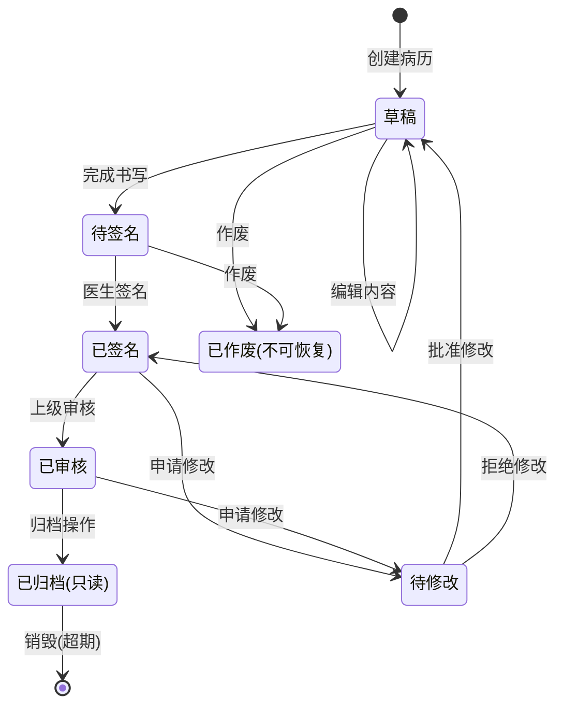

**状态转换形式化定义**

```text
病历文档状态机 M = (S, Σ, δ, s₀, F)

状态集 S = {
    DRAFT,          -- 草稿
    PENDING_SIGN,   -- 待签名
    SIGNED,         -- 已签名
    REVIEWED,       -- 已审核
    ARCHIVED,       -- 已归档
    PENDING_MOD,    -- 待修改
    VOID            -- 已作废
}

输入符号 Σ = {
    create,         -- 创建
    edit,           -- 编辑
    complete,       -- 完成
    sign,           -- 签名
    review,         -- 审核
    archive,        -- 归档
    request_mod,    -- 申请修改
    approve_mod,    -- 批准修改
    reject_mod,     -- 拒绝修改
    void            -- 作废
}

转移函数 δ:
    δ(DRAFT, edit) = DRAFT
    δ(DRAFT, complete) = PENDING_SIGN
    δ(PENDING_SIGN, sign) = SIGNED
    δ(SIGNED, review) = REVIEWED
    δ(REVIEWED, archive) = ARCHIVED
    δ(SIGNED, request_mod) = PENDING_MOD
    δ(REVIEWED, request_mod) = PENDING_MOD
    δ(PENDING_MOD, approve_mod) = DRAFT
    δ(PENDING_MOD, reject_mod) = SIGNED
    δ(DRAFT, void) = VOID
    δ(PENDING_SIGN, void) = VOID

初始状态 s₀ = DRAFT
终态集 F = {ARCHIVED, VOID}
```

### 1.2 医嘱状态机

**医嘱生命周期状态转换**

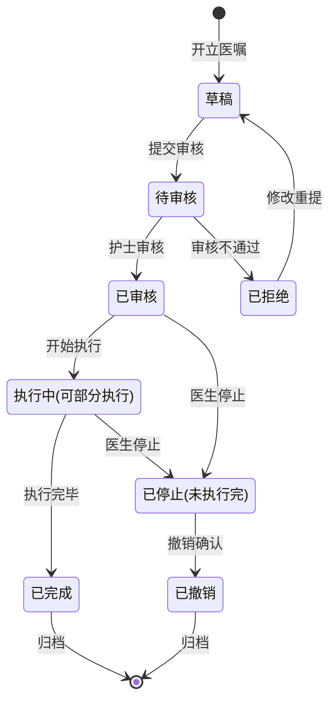

**医嘱状态形式化定义**

```text
医嘱状态机 O = (S_order, Σ_order, δ_order, o₀, F_order)

状态集 S_order = {
    ORDER_DRAFT,        -- 草稿
    ORDER_PENDING,      -- 待审核
    ORDER_VERIFIED,     -- 已审核
    ORDER_REJECTED,     -- 已拒绝
    ORDER_ACTIVE,       -- 执行中
    ORDER_COMPLETED,    -- 已完成
    ORDER_STOPPED,      -- 已停止
    ORDER_CANCELLED     -- 已撤销
}

状态转换规则:
    ORDER_DRAFT --submit--> ORDER_PENDING
    ORDER_PENDING --verify--> ORDER_VERIFIED
    ORDER_PENDING --reject--> ORDER_REJECTED
    ORDER_VERIFIED --activate--> ORDER_ACTIVE
    ORDER_ACTIVE --complete--> ORDER_COMPLETED
    ORDER_ACTIVE --stop--> ORDER_STOPPED
    ORDER_VERIFIED --stop--> ORDER_STOPPED
    ORDER_REJECTED --revise--> ORDER_DRAFT
    ORDER_STOPPED --cancel--> ORDER_CANCELLED

状态不变式:
    ∀o ∈ Order:
        o.status = ORDER_COMPLETED → |o.execution_records| > 0
        o.status = ORDER_ACTIVE → o.start_time ≠ ⊥
        o.status = ORDER_VERIFIED → o.verified_by ≠ ⊥
```

### 1.3 签名状态机

**电子签名状态转换**

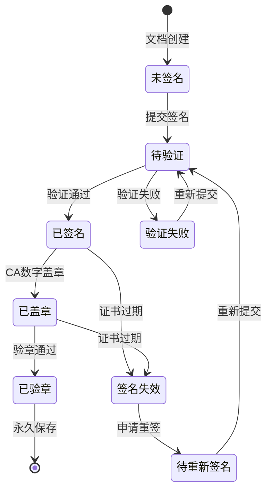

**签名状态形式化定义**

```text
签名状态机 Sig = (S_sig, Σ_sig, δ_sig, sig₀, F_sig)

状态集 S_sig = {
    UNSIGNED,           -- 未签名
    PENDING_VERIFY,     -- 待验证
    SIGNED,             -- 已签名
    VERIFY_FAILED,      -- 验证失败
    STAMPED,            -- 已盖章
    VERIFIED,           -- 已验章
    EXPIRED,            -- 签名失效
    PENDING_RESIGN      -- 待重新签名
}

签名规则约束:
    1. 签名者身份验证:
       ∀sig ∈ Signature:
           sig.status = SIGNED → authenticate(sig.signer_id) = true

    2. 时间戳约束:
       ∀sig ∈ Signature:
           sig.status = SIGNED → sig.timestamp ≤ current_time()

    3. 证书有效性:
       ∀sig ∈ Signature:
           sig.status ∈ {SIGNED, STAMPED, VERIFIED} →
               check_certificate(sig.certificate_id) = valid

    4. 签名与文档绑定:
       ∀doc ∈ Document, ∀sig ∈ doc.signatures:
           verify_binding(sig, doc.content_hash) = true
```

---

## 2. 时序图形式化

### 2.1 病历书写流程

**标准病历书写时序**

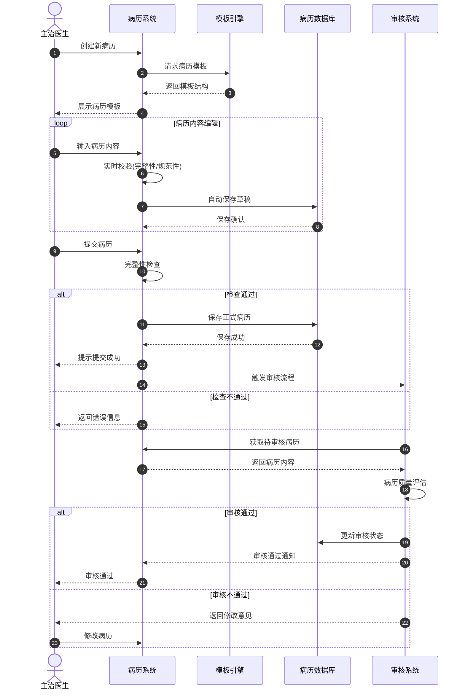

**病历书写形式化时序**

```text
病历书写流程 =
    CreateRecord(patient_id) →
    LoadTemplate(record_type) →
    repeat
        EditSection(section_id, content) →
        AutoSave(draft_data) →
        ValidateContent(content)
    until SubmitRecord() →
    FinalValidate() →
    if valid then
        SaveToDatabase(record_data) →
        TriggerReview()
    else
        ReturnError(errors)
    end →
    ReviewProcess()
```

### 2.2 医嘱下达与执行流程

**医嘱全生命周期时序**

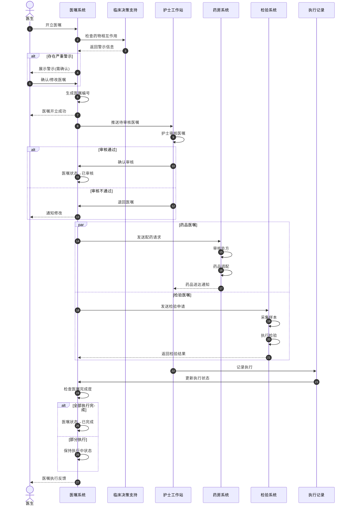

**医嘱执行形式化时序**

```text
医嘱执行流程 =
    CreateOrder(patient_id, order_items) →
    CheckContraindications(order_items) →
    if has_severe_warning then
        RequireConfirmation(doctor)
    end →
    GenerateOrderId() →
    SubmitForVerification() →
    NurseVerify(order_id) →
    if verified then
        parallel
            ProcessMedicationOrder() → Dispense() → Deliver()
            ProcessLabOrder() → CollectSample() → ExecuteTest() → ReturnResult()
            ProcessNursingOrder() → ScheduleExecution() → Execute()
        end →
        RecordExecution(execution_data) →
        UpdateOrderStatus() →
        if all_items_completed then
            SetStatus(COMPLETED)
        else
            SetStatus(ACTIVE)
        end
    else
        ReturnToDoctor(reason)
    end
```

### 2.3 病历归档流程

**病历归档时序**

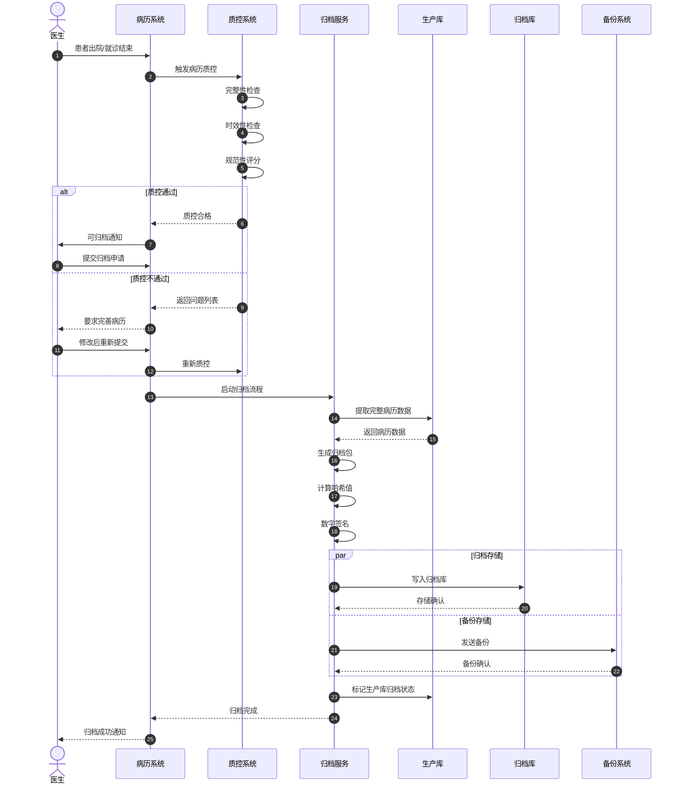

---

## 3. 数据流分析

### 3.1 病历数据在医生/护士/检验/药房间的流动

**跨部门病历数据流图**

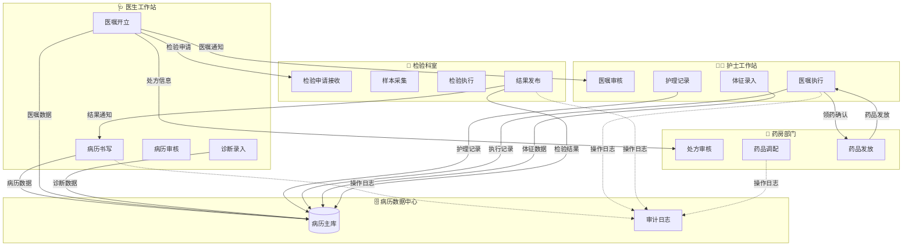

### 3.2 数据流形式化定义

**数据流动形式化模型**

```text
数据流系统 DFS = (Actors, DataTypes, Flows, Constraints)

参与者集 Actors = {
    DOCTOR,         -- 医生
    NURSE,          -- 护士
    LAB_TECH,       -- 检验技师
    PHARMACIST,     -- 药师
    EMR_SYSTEM      -- 病历系统
}

数据类型集 DataTypes = {
    MedicalRecord,      -- 病历数据
    MedicalOrder,       -- 医嘱数据
    Diagnosis,          -- 诊断数据
    LabResult,          -- 检验结果
    Prescription,       -- 处方数据
    NursingRecord,      -- 护理记录
    VitalSigns,         -- 生命体征
    ExecutionRecord     -- 执行记录
}

数据流 Flows ⊆ Actors × DataTypes × Actors

核心数据流:
    (DOCTOR, MedicalOrder, NURSE)           -- 医嘱下达
    (DOCTOR, MedicalOrder, LAB_TECH)        -- 检验申请
    (DOCTOR, MedicalOrder, PHARMACIST)      -- 药品处方
    (NURSE, ExecutionRecord, EMR_SYSTEM)    -- 执行记录
    (NURSE, NursingRecord, EMR_SYSTEM)      -- 护理记录
    (LAB_TECH, LabResult, EMR_SYSTEM)       -- 检验结果
    (LAB_TECH, LabResult, DOCTOR)           -- 结果反馈
    (PHARMACIST, Prescription, NURSE)       -- 药品发放
    (EMR_SYSTEM, MedicalRecord, *)          -- 病历查询

数据流约束 Constraints:
    1. 医嘱必须经护士审核后方可执行:
       ∀o ∈ MedicalOrder:
           flow(o, DOCTOR, NURSE) →
           ∃v ∈ Verification: v.order_id = o.id ∧ v.verified = true

    2. 检验结果必须关联申请单:
       ∀r ∈ LabResult:
           flow(r, LAB_TECH, EMR_SYSTEM) →
           ∃a ∈ LabApplication: r.application_id = a.id

    3. 执行记录必须关联医嘱:
       ∀e ∈ ExecutionRecord:
           flow(e, NURSE, EMR_SYSTEM) →
           ∃o ∈ MedicalOrder: e.order_id = o.id

    4. 数据完整性约束:
       ∀d ∈ DataTypes, ∀f ∈ flow(d, source, target):
           d.checksum = calculate_checksum(d.payload)
```

---

## 4. 实时性分析

### 4.1 病历保存响应时间

**响应时间要求与优化**

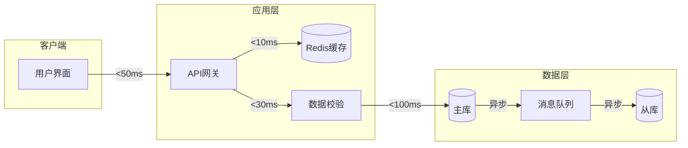

**响应时间形式化定义**

```text
病历保存响应时间模型:

T_total = T_network + T_validate + T_cache + T_database + T_commit

其中:
    T_network ≤ 50ms      -- 网络传输延迟
    T_validate ≤ 30ms     -- 数据校验时间
    T_cache ≤ 10ms        -- 缓存操作时间
    T_database ≤ 100ms    -- 数据库写入时间
    T_commit ≤ 20ms       -- 事务提交时间

总体要求: T_total ≤ 200ms

不同操作类型的响应时间要求:

┌──────────────────┬─────────────┬─────────────┐
│ 操作类型          │ 目标响应时间  │ 最大容忍时间 │
├──────────────────┼─────────────┼─────────────┤
│ 病历自动保存      │ ≤ 100ms     │ ≤ 500ms     │
│ 病历提交保存      │ ≤ 200ms     │ ≤ 1000ms    │
│ 病历查询加载      │ ≤ 300ms     │ ≤ 1500ms    │
│ 病历打印导出      │ ≤ 500ms     │ ≤ 2000ms    │
│ 批量病历导出      │ ≤ 2000ms    │ ≤ 10000ms   │
└──────────────────┴─────────────┴─────────────┘

实时性保证策略:
    1. 自动保存采用异步写入:
       auto_save(record) = async_write_to_cache(record) →
                          background_sync_to_database()

    2. 关键操作同步写入:
       critical_save(record) = sync_write_to_database(record) →
                              confirm_commit()

    3. 读操作优先从缓存:
       read_record(id) = cache.get(id) ?? database.query(id) → cache.put(id)
```

### 4.2 医嘱执行时效

**医嘱执行时效模型**

```mermaid
gantt
    title 医嘱执行时效要求
    dateFormat HH:mm
    axisFormat %H:%M

    section 紧急医嘱(STAT)
    医嘱开立      :a1, 00:00, 5m
    护士审核      :a2, after a1, 5m
    开始执行      :a3, after a2, 5m
    完成执行      :a4, after a3, 15m

    section 紧急医嘱(URGENT)
    医嘱开立      :b1, 00:00, 15m
    护士审核      :b2, after b1, 15m
    开始执行      :b3, after b2, 30m
    完成执行      :b4, after b3, 60m

    section 常规医嘱(ROUTINE)
    医嘱开立      :c1, 00:00, 30m
    护士审核      :c2, after c1, 30m
    开始执行      :c3, after c2, 120m
    完成执行      :c4, after c3, 240m
```

**医嘱执行时效形式化定义**

```text
医嘱执行时效模型:

医嘱优先级 P = {STAT, URGENT, TIMED, ROUTINE, PRN}

时效约束函数:
    T_verify: P → TimeLimit     -- 审核时限
    T_start: P → TimeLimit      -- 开始执行时限
    T_complete: P → TimeLimit   -- 完成时限

具体时效要求:
    T_verify(STAT) = 5 minutes
    T_verify(URGENT) = 15 minutes
    T_verify(TIMED) = 30 minutes
    T_verify(ROUTINE) = 60 minutes
    T_verify(PRN) = 30 minutes

    T_start(STAT) = 15 minutes
    T_start(URGENT) = 60 minutes
    T_start(TIMED) = timed_point - 30 minutes
    T_start(ROUTINE) = 240 minutes
    T_start(PRN) = 60 minutes

时效监控规则:
    ∀o ∈ MedicalOrder:
        let elapsed = current_time() - o.order_time
        in
        if o.priority = STAT ∧ elapsed > T_verify(STAT) then
            trigger_alert("STAT医嘱未及时审核", o)
        else if o.priority = URGENT ∧ elapsed > T_verify(URGENT) then
            trigger_alert("紧急医嘱未及时审核", o)
        else if o.status = VERIFIED ∧
                (current_time() - o.verify_time) > T_start(o.priority) then
            trigger_alert("医嘱未及时执行", o)

时效性指标:
    审核及时率 = |{o | o.verify_time - o.order_time ≤ T_verify(o.priority)}| / |{o}|
    执行及时率 = |{o | o.start_time - o.verify_time ≤ T_start(o.priority)}| / |{o}|

    目标: 审核及时率 ≥ 98%, 执行及时率 ≥ 95%
```

---

## 5. 异常处理

### 5.1 病历修改追溯

**病历修改追溯机制**

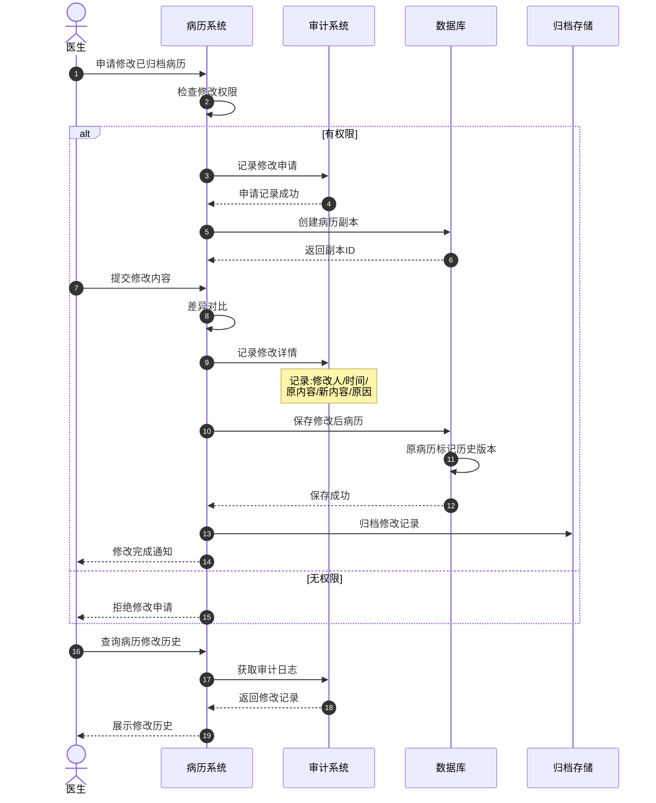

**修改追溯形式化定义**

```text
病历修改追溯系统:

修改记录结构:
    ModificationRecord = {
        record_id: RecordId,
        version: Integer,
        modifier_id: ProviderId,
        modify_time: DateTime,
        original_content: ContentHash,
        new_content: ContentHash,
        diff_content: Diff,
        modify_reason: String,
        approval_id: ApprovalId?
    }

追溯查询操作:
    get_modification_history(record_id) → List<ModificationRecord>
    get_version_at_time(record_id, timestamp) → RecordVersion
    compare_versions(record_id, version1, version2) → Diff
    get_modifier_stats(provider_id, time_range) → Statistics

不可篡改保证:
    ∀m ∈ ModificationRecord:
        hash(m) = stored_hash(m)  -- 哈希校验
        ∧ m stored_in append_only_storage  -- 仅追加存储

审计规则:
    1. 所有修改必须记录理由:
       ∀m ∈ ModificationRecord: length(m.modify_reason) > 10

    2. 已归档病历修改需审批:
       ∀m: m.record_status = ARCHIVED → m.approval_id ≠ ⊥

    3. 修改历史永久保留:
       ∀m: retention_period(m) = forever

    4. 修改通知相关方:
       notify(party) where party ∈ stakeholders(m.record_id)
```

### 5.2 医嘱撤销

**医嘱撤销流程**

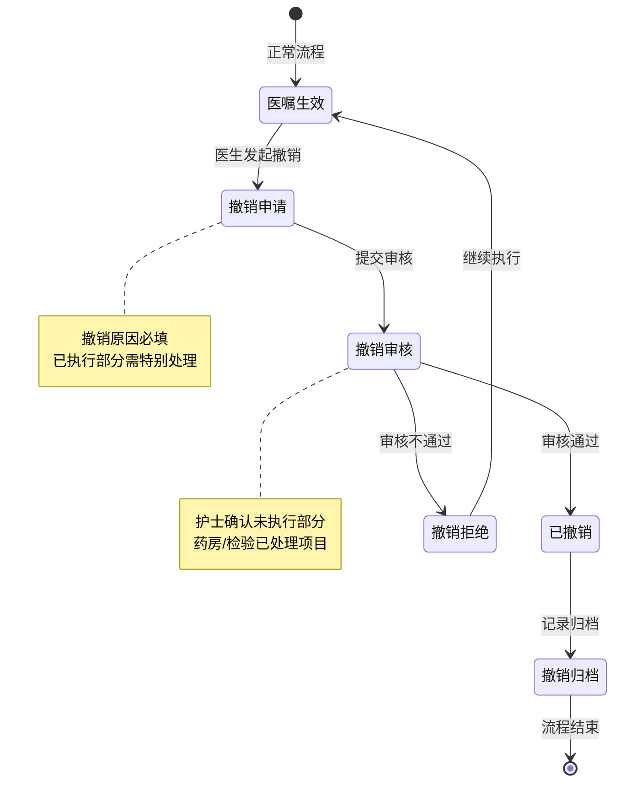

**医嘱撤销形式化定义**

```text
医嘱撤销系统:

撤销条件:
    can_cancel(order) =
        order.status ∈ {PENDING, VERIFIED, ACTIVE}
        ∧ has_permission(doctor, order, CANCEL)
        ∧ (order.status = ACTIVE → partial_executed(order) = false)

撤销类型:
    CANCEL_TYPE = {
        FULL_CANCEL,        -- 完全撤销(未执行)
        PARTIAL_CANCEL,     -- 部分撤销(部分执行)
        POST_EXEC_CANCEL    -- 执行后撤销(需特殊审批)
    }

撤销流程:
    cancel_order(order_id, reason, cancel_type) =
        let order = get_order(order_id)
        in
        if not can_cancel(order) then
            return Error("不符合撤销条件")
        else
            create_cancel_request(order_id, reason, cancel_type) →
            route_for_approval(cancel_type) →
            if approve(cancel_request) then
                execute_cancel(order_id, cancel_type) →
                notify_stakeholders(order_id) →
                archive_cancel_record(order_id, cancel_type)
            else
                return Error("撤销申请被拒绝")
            end
        end

撤销影响范围:
    ┌─────────────────┬───────────────┬───────────────┬───────────────┐
    │ 医嘱状态         │ 药房影响       │ 检验影响       │ 护理影响       │
    ├─────────────────┼───────────────┼───────────────┼───────────────┤
    │ PENDING         │ 无            │ 无            │ 无            │
    │ VERIFIED        │ 取消配药      │ 取消采集      │ 取消执行计划   │
    │ ACTIVE(未执行)   │ 退回药品      │ 取消申请      │ 移除执行单     │
    │ ACTIVE(部分执行) │ 部分退回      │ 部分取消      │ 停止后续执行   │
    │ COMPLETED       │ 不可撤销      │ 不可撤销      │ 不可撤销      │
    └─────────────────┴───────────────┴───────────────┴───────────────┘

撤销记录:
    CancelRecord = {
        cancel_id: CancelId,
        order_id: OrderId,
        requester: ProviderId,
        request_time: DateTime,
        cancel_reason: String,
        cancel_type: CANCEL_TYPE,
        approval_id: ApprovalId,
        affected_items: List<OrderItem>,
        notification_status: NotificationStatus
    }
```

### 5.3 病历锁定冲突

**病历锁定冲突处理机制**

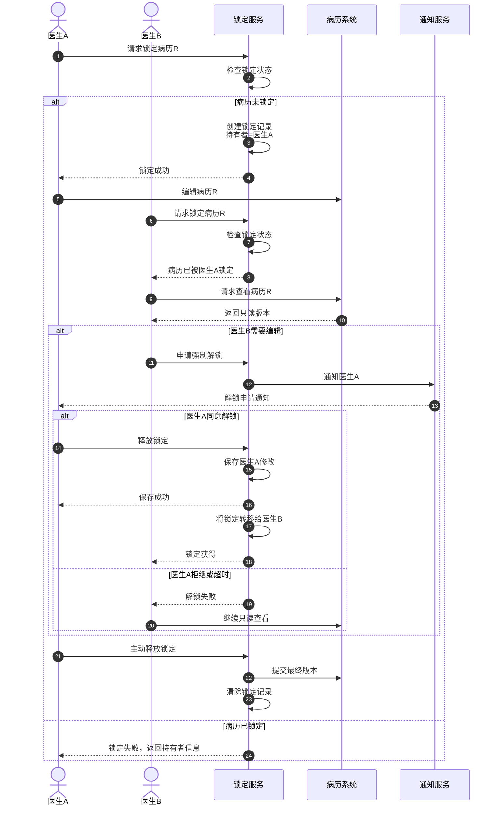

**锁定冲突形式化定义**

```text
病历锁定系统:

锁类型:
    LOCK_TYPE = {READ_LOCK, WRITE_LOCK, EXCLUSIVE_LOCK}

锁状态:
    LockState = {
        UNLOCKED,           -- 未锁定
        LOCKED_READ,        -- 读锁定(多用户)
        LOCKED_WRITE,       -- 写锁定(单用户)
        LOCKED_EXCLUSIVE    -- 独占锁定(管理员)
    }

锁定记录:
    LockRecord = {
        record_id: RecordId,
        lock_type: LOCK_TYPE,
        holder: ProviderId,
        lock_time: DateTime,
        expire_time: DateTime,
        session_id: SessionId,
        is_recursive: Boolean  -- 是否允许同会话重入
    }

锁定操作:
    acquire_lock(record_id, lock_type, holder) → Result<LockToken, LockError>
    release_lock(lock_token) → Result<(), LockError>
    extend_lock(lock_token, duration) → Result<(), LockError>
    force_unlock(record_id, admin_id, reason) → Result<(), LockError>

锁定兼容性矩阵:
    ┌─────────────────┬───────────┬───────────┬───────────┐
    │ 已有锁 ↓ 请求锁 → │ READ_LOCK │ WRITE_LOCK│ EXCLUSIVE │
    ├─────────────────┼───────────┼───────────┼───────────┤
    │ UNLOCKED        │ ✓         │ ✓         │ ✓         │
    │ READ_LOCK       │ ✓         │ ✗         │ ✗         │
    │ WRITE_LOCK      │ ✗         │ ✗         │ ✗         │
    │ EXCLUSIVE       │ ✗         │ ✗         │ ✗         │
    └─────────────────┴───────────┴───────────┴───────────┘

冲突解决策略:
    1. 等待策略:
       wait_for_lock(record_id, timeout) →
           if lock_released_within(timeout) then
               retry_acquire_lock()
           else
               return TimeoutError

    2. 抢占策略(需审批):
       preempt_lock(record_id, requester) →
           if has_priority(requester, current_holder) then
               notify(current_holder, "锁被抢占")
               release_lock(current_holder)
               grant_lock(requester)
           else
               return PriorityError

    3. 合并策略:
       merge_on_unlock(record_id) →
           when lock_released then
               if has_pending_changes() then
                   show_diff_dialog()
                   let user_resolve_conflicts()
               end

锁超时机制:
    lock_timeout = case lock_type of
        READ_LOCK → 30 minutes
        WRITE_LOCK → 15 minutes
        EXCLUSIVE_LOCK → 60 minutes

    heartbeat_interval = 5 minutes

    if (current_time - last_heartbeat) > heartbeat_interval then
        release_lock_due_to_timeout()
        notify_holder("锁定因超时释放")
```

---

**参考文档**：

- `01_Overview.md` - EMR Schema概述
- `02_Formal_Definition.md` - 形式化定义
- `06_Formal_Grammar_Semantics.md` - 形式语法与语义

**创建时间**：2026-02-15
**最后更新**：2026-02-15
