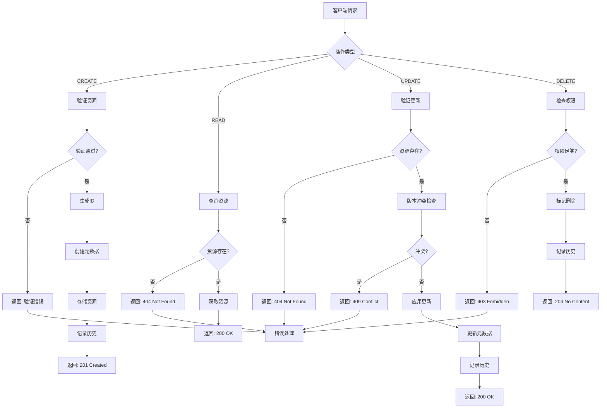
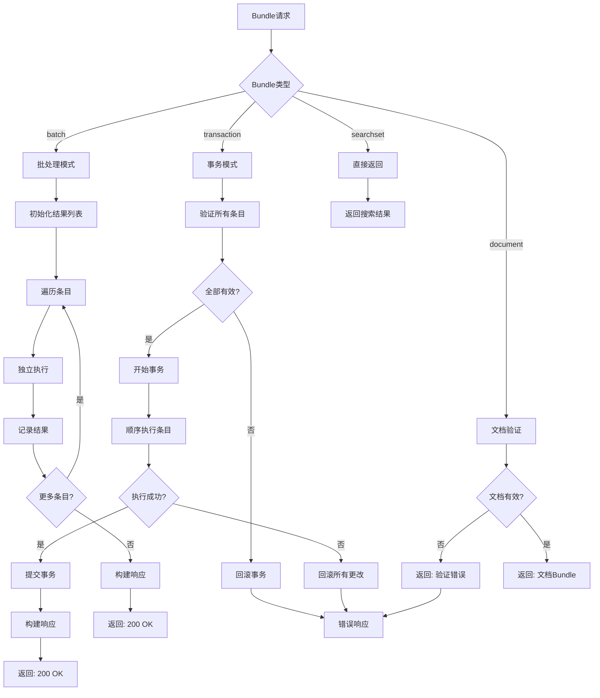
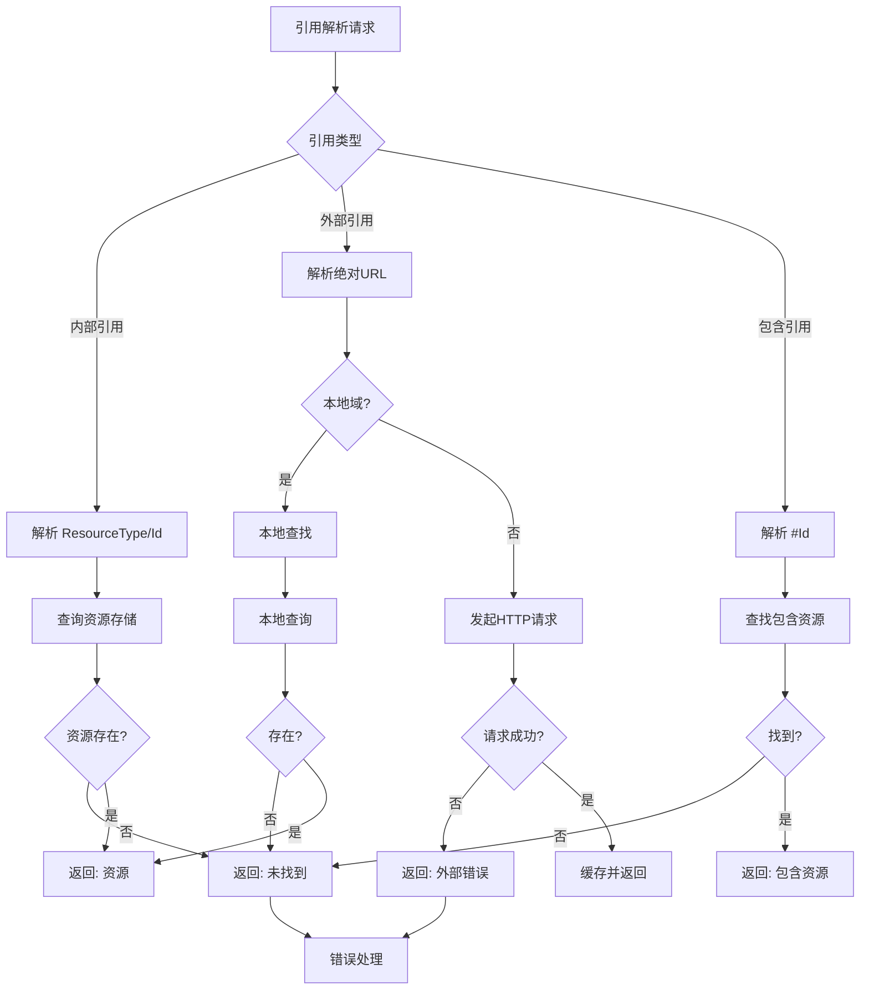
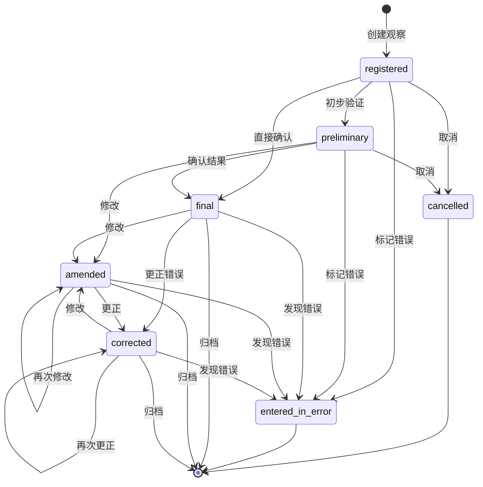
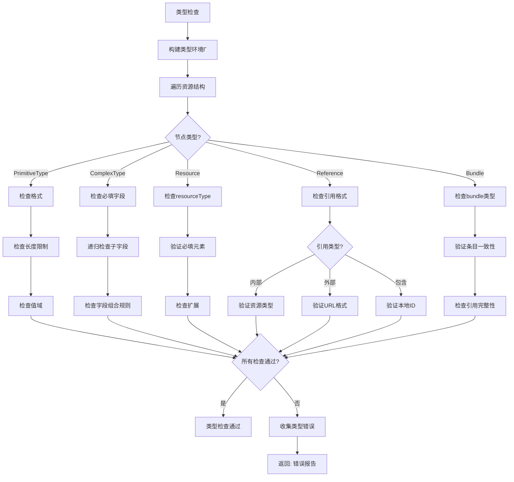
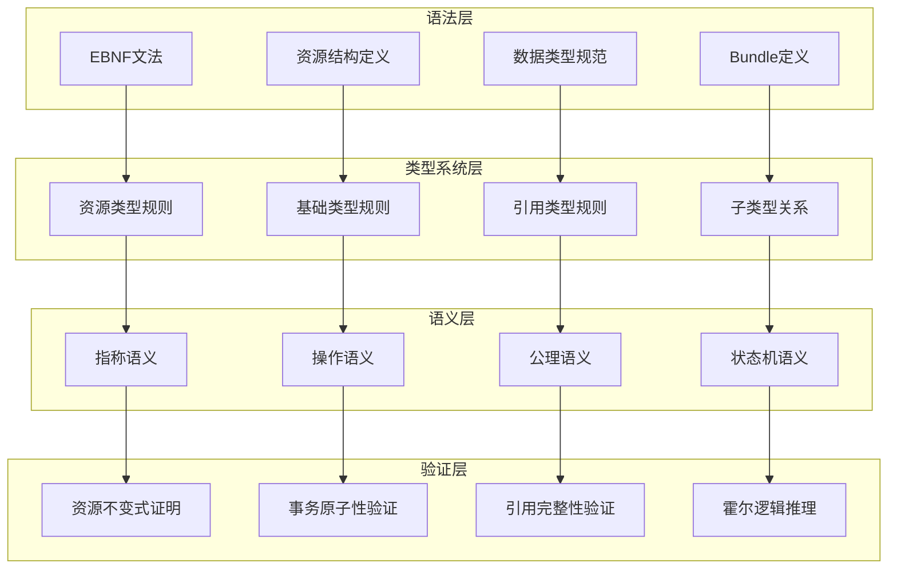

# FHIR Schema形式语法与语义分析视图

**版本**: v1.0
**创建日期**: 2026-02-15
**标准**: HL7 FHIR R4, FHIR R5 (草案), SMART on FHIR

---

## 📑 目录

- [FHIR Schema形式语法与语义分析视图](#fhir-schema形式语法与语义分析视图)
  - [📑 目录](#-目录)
  - [1. 形式文法定义](#1-形式文法定义)
    - [1.1 EBNF文法](#11-ebnf文法)
      - [1.1.1 资源结构文法](#111-资源结构文法)
      - [1.1.2 Patient资源文法](#112-patient资源文法)
      - [1.1.3 Observation资源文法](#113-observation资源文法)
      - [1.1.4 Encounter资源文法](#114-encounter资源文法)
      - [1.1.5 Condition资源文法](#115-condition资源文法)
      - [1.1.6 元素定义文法](#116-元素定义文法)
      - [1.1.7 扩展定义文法](#117-扩展定义文法)
      - [1.1.8 Bundle资源文法](#118-bundle资源文法)
    - [1.2 语法规则](#12-语法规则)
      - [1.2.1 资源结构规则](#121-资源结构规则)
      - [1.2.2 Patient资源规则](#122-patient资源规则)
      - [1.2.3 Observation资源规则](#123-observation资源规则)
      - [1.2.4 Encounter资源规则](#124-encounter资源规则)
      - [1.2.5 Condition资源规则](#125-condition资源规则)
      - [1.2.6 Bundle资源规则](#126-bundle资源规则)
  - [2. 形式语义定义](#2-形式语义定义)
    - [2.1 指称语义 (Denotational Semantics)](#21-指称语义-denotational-semantics)
      - [2.1.1 语义域定义](#211-语义域定义)
      - [2.1.2 资源CRUD语义](#212-资源crud语义)
      - [2.1.3 Bundle事务语义](#213-bundle事务语义)
      - [2.1.4 引用解析语义](#214-引用解析语义)
    - [2.2 操作语义 (Operational Semantics)](#22-操作语义-operational-semantics)
      - [2.2.1 大步语义 (Big-Step Semantics)](#221-大步语义-big-step-semantics)
      - [2.2.2 小步语义 (Small-Step Semantics)](#222-小步语义-small-step-semantics)
      - [2.2.3 资源状态机语义](#223-资源状态机语义)
    - [2.3 公理语义 (Axiomatic Semantics)](#23-公理语义-axiomatic-semantics)
      - [2.3.1 Hoare三元组](#231-hoare三元组)
      - [2.3.2 资源操作推理规则](#232-资源操作推理规则)
      - [2.3.3 Bundle事务霍尔三元组](#233-bundle事务霍尔三元组)
      - [2.3.4 资源不变式证明](#234-资源不变式证明)
      - [2.3.5 事务原子性证明](#235-事务原子性证明)
  - [3. 类型系统](#3-类型系统)
    - [3.1 类型规则](#31-类型规则)
    - [3.2 类型运算规则](#32-类型运算规则)
    - [3.3 子类型关系](#33-子类型关系)
    - [3.4 多态与类型约束](#34-多态与类型约束)
  - [4. 语义等价性](#4-语义等价性)
    - [4.1 程序等价定义](#41-程序等价定义)
    - [4.2 等价变换规则](#42-等价变换规则)
    - [4.3 资源状态转换等价](#43-资源状态转换等价)
  - [5. Mermaid可视化](#5-mermaid可视化)
    - [5.1 FHIR资源CRUD流程](#51-fhir资源crud流程)
    - [5.2 Bundle事务处理语义流程](#52-bundle事务处理语义流程)
    - [5.3 引用解析流程](#53-引用解析流程)
    - [5.4 Observation状态机](#54-observation状态机)
    - [5.5 类型检查流程](#55-类型检查流程)
    - [5.6 形式语义层级图](#56-形式语义层级图)

---

## 1. 形式文法定义

### 1.1 EBNF文法

#### 1.1.1 资源结构文法

```ebnf
(* FHIR R4资源核心结构 *)

Resource ::= DomainResource | Bundle | Parameters | Binary

DomainResource ::= '{'
    '"resourceType"' ':' ResourceType ','
    '"id"' ':' Id? ','
    '"meta"' ':' Meta? ','
    '"implicitRules"' ':' Uri? ','
    '"language"' ':' Code? ','
    '"text"' ':' Narrative? ','
    '"contained"' ':' '[' Resource* ']'? ','
    '"extension"' ':' '[' Extension* ']'? ','
    '"modifierExtension"' ':' '[' Extension* ']'?
    ResourceSpecificFields
'}'

ResourceType ::= 'Patient' | 'Observation' | 'Encounter' | 'Condition'
               | 'Procedure' | 'Medication' | 'MedicationRequest'
               | 'DiagnosticReport' | 'AllergyIntolerance' | 'Immunization'
               | 'Organization' | 'Practitioner' | 'Location'
               | 'Composition' | 'DocumentReference' | 'Bundle'
               | 'Questionnaire' | 'QuestionnaireResponse' | 'Task'
               | 'CarePlan' | 'CareTeam' | 'Goal' | 'RiskAssessment'
               | 'Specimen' | 'ServiceRequest' | 'RelatedPerson'
               | 'Coverage' | 'Claim' | 'ExplanationOfBenefit'
               | ...

ResourceSpecificFields ::= PatientFields | ObservationFields | EncounterFields
                         | ConditionFields | BundleFields | ...

(* 元数据 *)

Meta ::= '{'
    '"versionId"' ':' Id? ','
    '"lastUpdated"' ':' Instant? ','
    '"source"' ':' Uri? ','
    '"profile"' ':' '[' Canonical* ']'? ','
    '"security"' ':' '[' Coding* ']'? ','
    '"tag"' ':' '[' Coding* ']'
'}'

Narrative ::= '{'
    '"status"' ':' Code ','
    '"div"' ':' Xhtml
'}'

NarrativeStatus ::= 'generated' | 'extensions' | 'additional' | 'empty'
```

#### 1.1.2 Patient资源文法

```ebnf
(* Patient资源 - 患者信息 *)

PatientFields ::=
    '"identifier"' ':' '[' Identifier* ']'? ','
    '"active"' ':' Boolean? ','
    '"name"' ':' '[' HumanName* ']'? ','
    '"telecom"' ':' '[' ContactPoint* ']'? ','
    '"gender"' ':' Code? ','
    '"birthDate"' ':' Date? ','
    '"deceasedBoolean"' ':' Boolean? ','
    '"deceasedDateTime"' ':' DateTime? ','
    '"address"' ':' '[' Address* ']'? ','
    '"maritalStatus"' ':' CodeableConcept? ','
    '"multipleBirthBoolean"' ':' Boolean? ','
    '"multipleBirthInteger"' ':' Integer? ','
    '"photo"' ':' '[' Attachment* ']'? ','
    '"contact"' ':' '[' PatientContact* ']'? ','
    '"communication"' ':' '[' PatientCommunication* ']'? ','
    '"generalPractitioner"' ':' '[' Reference* ']'? ','
    '"managingOrganization"' ':' Reference? ','
    '"link"' ':' '[' PatientLink* ']'

PatientContact ::= '{'
    '"relationship"' ':' '[' CodeableConcept* ']'? ','
    '"name"' ':' HumanName? ','
    '"telecom"' ':' '[' ContactPoint* ']'? ','
    '"address"' ':' Address? ','
    '"gender"' ':' Code? ','
    '"organization"' ':' Reference? ','
    '"period"' ':' Period?
'}'

PatientCommunication ::= '{'
    '"language"' ':' CodeableConcept ','
    '"preferred"' ':' Boolean?
'}'

PatientLink ::= '{'
    '"other"' ':' Reference ','
    '"type"' ':' Code
'}'

LinkType ::= 'replaced-by' | 'replaces' | 'refer' | 'seealso'

AdministrativeGender ::= 'male' | 'female' | 'other' | 'unknown'
```

#### 1.1.3 Observation资源文法

```ebnf
(* Observation资源 - 观察与测量 *)

ObservationFields ::=
    '"identifier"' ':' '[' Identifier* ']'? ','
    '"basedOn"' ':' '[' Reference* ']'? ','
    '"partOf"' ':' '[' Reference* ']'? ','
    '"status"' ':' Code ','
    '"category"' ':' '[' CodeableConcept* ']'? ','
    '"code"' ':' CodeableConcept ','
    '"subject"' ':' Reference? ','
    '"focus"' ':' '[' Reference* ']'? ','
    '"encounter"' ':' Reference? ','
    '"effectiveDateTime"' ':' DateTime? ','
    '"effectivePeriod"' ':' Period? ','
    '"effectiveTiming"' ':' Timing? ','
    '"effectiveInstant"' ':' Instant? ','
    '"issued"' ':' Instant? ','
    '"performer"' ':' '[' Reference* ']'? ','
    '"valueQuantity"' ':' Quantity? ','
    '"valueCodeableConcept"' ':' CodeableConcept? ','
    '"valueString"' ':' String? ','
    '"valueBoolean"' ':' Boolean? ','
    '"valueInteger"' ':' Integer? ','
    '"valueRange"' ':' Range? ','
    '"valueRatio"' ':' Ratio? ','
    '"valueSampledData"' ':' SampledData? ','
    '"valueTime"' ':' Time? ','
    '"valueDateTime"' ':' DateTime? ','
    '"valuePeriod"' ':' Period? ','
    '"dataAbsentReason"' ':' CodeableConcept? ','
    '"interpretation"' ':' '[' CodeableConcept* ']'? ','
    '"note"' ':' '[' Annotation* ']'? ','
    '"bodySite"' ':' CodeableConcept? ','
    '"method"' ':' CodeableConcept? ','
    '"specimen"' ':' Reference? ','
    '"device"' ':' Reference? ','
    '"referenceRange"' ':' '[' ObservationReferenceRange* ']'? ','
    '"hasMember"' ':' '[' Reference* ']'? ','
    '"derivedFrom"' ':' '[' Reference* ']'? ','
    '"component"' ':' '[' ObservationComponent* ']'

ObservationStatus ::= 'registered' | 'preliminary' | 'final' | 'amended'
                    | 'corrected' | 'cancelled' | 'entered-in-error'
                    | 'unknown'

ObservationReferenceRange ::= '{'
    '"low"' ':' SimpleQuantity? ','
    '"high"' ':' SimpleQuantity? ','
    '"type"' ':' CodeableConcept? ','
    '"appliesTo"' ':' '[' CodeableConcept* ']'? ','
    '"age"' ':' Range? ','
    '"text"' ':' String?
'}'

ObservationComponent ::= '{'
    '"code"' ':' CodeableConcept ','
    '"valueQuantity"' ':' Quantity? ','
    '"valueCodeableConcept"' ':' CodeableConcept? ','
    '"valueString"' ':' String? ','
    '"valueBoolean"' ':' Boolean? ','
    '"valueInteger"' ':' Integer? ','
    '"valueRange"' ':' Range? ','
    '"valueRatio"' ':' Ratio? ','
    '"valueSampledData"' ':' SampledData? ','
    '"valueTime"' ':' Time? ','
    '"valueDateTime"' ':' DateTime? ','
    '"valuePeriod"' ':' Period? ','
    '"dataAbsentReason"' ':' CodeableConcept? ','
    '"interpretation"' ':' '[' CodeableConcept* ']'? ','
    '"referenceRange"' ':' '[' ObservationReferenceRange* ']'
'}'
```

#### 1.1.4 Encounter资源文法

```ebnf
(* Encounter资源 - 就诊/医疗接触 *)

EncounterFields ::=
    '"identifier"' ':' '[' Identifier* ']'? ','
    '"status"' ':' Code ','
    '"statusHistory"' ':' '[' EncounterStatusHistory* ']'? ','
    '"class"' ':' Coding ','
    '"classHistory"' ':' '[' EncounterClassHistory* ']'? ','
    '"type"' ':' '[' CodeableConcept* ']'? ','
    '"serviceType"' ':' CodeableConcept? ','
    '"priority"' ':' CodeableConcept? ','
    '"subject"' ':' Reference? ','
    '"episodeOfCare"' ':' '[' Reference* ']'? ','
    '"basedOn"' ':' '[' Reference* ']'? ','
    '"participant"' ':' '[' EncounterParticipant* ']'? ','
    '"appointment"' ':' '[' Reference* ']'? ','
    '"period"' ':' Period? ','
    '"length"' ':' Duration? ','
    '"reasonCode"' ':' '[' CodeableConcept* ']'? ','
    '"reasonReference"' ':' '[' Reference* ']'? ','
    '"diagnosis"' ':' '[' EncounterDiagnosis* ']'? ','
    '"account"' ':' '[' Reference* ']'? ','
    '"hospitalization"' ':' EncounterHospitalization? ','
    '"location"' ':' '[' EncounterLocation* ']'? ','
    '"serviceProvider"' ':' Reference? ','
    '"partOf"' ':' Reference?

EncounterStatus ::= 'planned' | 'arrived' | 'triaged' | 'in-progress'
                  | 'onleave' | 'finished' | 'cancelled' | 'entered-in-error'
                  | 'unknown'

EncounterStatusHistory ::= '{'
    '"status"' ':' Code ','
    '"period"' ':' Period
'}'

EncounterClassHistory ::= '{'
    '"class"' ':' Coding ','
    '"period"' ':' Period
'}'

EncounterParticipant ::= '{'
    '"type"' ':' '[' CodeableConcept* ']'? ','
    '"period"' ':' Period? ','
    '"individual"' ':' Reference?
'}'

EncounterDiagnosis ::= '{'
    '"condition"' ':' Reference ','
    '"use"' ':' CodeableConcept? ','
    '"rank"' ':' PositiveInt?
'}'

EncounterHospitalization ::= '{'
    '"preAdmissionIdentifier"' ':' Identifier? ','
    '"origin"' ':' Reference? ','
    '"admitSource"' ':' CodeableConcept? ','
    '"reAdmission"' ':' CodeableConcept? ','
    '"dietPreference"' ':' '[' CodeableConcept* ']'? ','
    '"specialCourtesy"' ':' '[' CodeableConcept* ']'? ','
    '"specialArrangement"' ':' '[' CodeableConcept* ']'? ','
    '"destination"' ':' Reference? ','
    '"dischargeDisposition"' ':' CodeableConcept?
'}'

EncounterLocation ::= '{'
    '"location"' ':' Reference ','
    '"status"' ':' Code? ','
    '"physicalType"' ':' CodeableConcept? ','
    '"period"' ':' Period?
'}'

EncounterLocationStatus ::= 'planned' | 'active' | 'reserved' | 'completed'
```

#### 1.1.5 Condition资源文法

```ebnf
(* Condition资源 - 病情/诊断 *)

ConditionFields ::=
    '"identifier"' ':' '[' Identifier* ']'? ','
    '"clinicalStatus"' ':' CodeableConcept ','
    '"verificationStatus"' ':' CodeableConcept ','
    '"category"' ':' '[' CodeableConcept* ']'? ','
    '"severity"' ':' CodeableConcept? ','
    '"code"' ':' CodeableConcept ','
    '"bodySite"' ':' '[' CodeableConcept* ']'? ','
    '"subject"' ':' Reference ','
    '"encounter"' ':' Reference? ','
    '"onsetDateTime"' ':' DateTime? ','
    '"onsetAge"' ':' Age? ','
    '"onsetPeriod"' ':' Period? ','
    '"onsetRange"' ':' Range? ','
    '"onsetString"' ':' String? ','
    '"abatementDateTime"' ':' DateTime? ','
    '"abatementAge"' ':' Age? ','
    '"abatementPeriod"' ':' Period? ','
    '"abatementRange"' ':' Range? ','
    '"abatementString"' ':' String? ','
    '"recordedDate"' ':' DateTime? ','
    '"recorder"' ':' Reference? ','
    '"asserter"' ':' Reference? ','
    '"stage"' ':' '[' ConditionStage* ']'? ','
    '"evidence"' ':' '[' ConditionEvidence* ']'

ClinicalStatus ::= 'active' | 'recurrence' | 'relapse' | 'inactive'
                 | 'remission' | 'resolved'

VerificationStatus ::= 'unconfirmed' | 'provisional' | 'differential'
                     | 'confirmed' | 'refuted' | 'entered-in-error'

ConditionStage ::= '{'
    '"summary"' ':' CodeableConcept? ','
    '"type"' ':' CodeableConcept? ','
    '"assessment"' ':' '[' Reference* ']'? ','
    '"referenceRange"' ':' CodeableConcept?
'}'

ConditionEvidence ::= '{'
    '"code"' ':' '[' CodeableConcept* ']'? ','
    '"detail"' ':' '[' Reference* ']'
'}'
```

#### 1.1.6 元素定义文法

```ebnf
(* FHIR基础数据类型 *)

(* 简单类型 *)
Boolean ::= 'true' | 'false'

Integer ::= ['-'] Digit+  (* 32位有符号整数 *)

Integer64 ::= ['-'] Digit+  (* 64位有符号整数 *)

String ::= '"' Char* '"'  (* UTF-8编码字符串 *)

Decimal ::= ['-'] Digit+ '.' Digit+  (* 高精度小数 *)

Uri ::= '"' UriChar* '"'  (* URI/URL *)

Url ::= '"' UrlChar* '"'  (* 绝对URL *)

Canonical ::= '"' CanonicalChar* '"'  (* 规范URL引用 *)

Base64Binary ::= '"' Base64Char* '"'  (* Base64编码二进制 *)

Instant ::= Date 'T' Time ('Z' | ('+'|'-') TimeZone)  (* 精确时间戳 *)

Date ::= Year ['-' Month ['-' Day]]

DateTime ::= Year ('-' Month ('-' Day ('T' Time)?)?)?

Time ::= Hour ':' Minute ':' Second ['.' Millisecond]

Code ::= '"' CodeChar+ '"'  (* 系统定义的代码 *)

Oid ::= '"' OidChar+ '"'  (* OID标识符 *)

Id ::= UpperLower Digit UpperLowerDigit*  (* 1-64字符内部ID *)

UnsignedInt ::= Digit+  (* 无符号32位整数 *)

PositiveInt ::= NonZeroDigit Digit*  (* 正整数 *)

Uuid ::= '"' UuidChar* '"'  (* UUID/GUID *)

(* 复杂类型 *)

Address ::= '{'
    '"use"' ':' Code? ','
    '"type"' ':' Code? ','
    '"text"' ':' String? ','
    '"line"' ':' '[' String* ']'? ','
    '"city"' ':' String? ','
    '"district"' ':' String? ','
    '"state"' ':' String? ','
    '"postalCode"' ':' String? ','
    '"country"' ':' String? ','
    '"period"' ':' Period?
'}'

Age ::= '{'
    '"value"' ':' Decimal? ','
    '"comparator"' ':' Code? ','
    '"unit"' ':' String? ','
    '"system"' ':' Uri? ','
    '"code"' ':' Code?
'}'

Annotation ::= '{'
    '"authorReference"' ':' Reference? ','
    '"authorString"' ':' String? ','
    '"time"' ':' DateTime? ','
    '"text"' ':' Markdown
'}'

Attachment ::= '{'
    '"contentType"' ':' Code? ','
    '"language"' ':' Code? ','
    '"data"' ':' Base64Binary? ','
    '"url"' ':' Url? ','
    '"size"' ':' UnsignedInt? ','
    '"hash"' ':' Base64Binary? ','
    '"title"' ':' String? ','
    '"creation"' ':' DateTime?
'}'

CodeableConcept ::= '{'
    '"coding"' ':' '[' Coding* ']'? ','
    '"text"' ':' String?
'}'

Coding ::= '{'
    '"system"' ':' Uri? ','
    '"version"' ':' String? ','
    '"code"' ':' Code? ','
    '"display"' ':' String? ','
    '"userSelected"' ':' Boolean?
'}'

ContactPoint ::= '{'
    '"system"' ':' Code? ','
    '"value"' ':' String? ','
    '"use"' ':' Code? ','
    '"rank"' ':' PositiveInt? ','
    '"period"' ':' Period?
'}'

HumanName ::= '{'
    '"use"' ':' Code? ','
    '"text"' ':' String? ','
    '"family"' ':' String? ','
    '"given"' ':' '[' String* ']'? ','
    '"prefix"' ':' '[' String* ']'? ','
    '"suffix"' ':' '[' String* ']'? ','
    '"period"' ':' Period?
'}'

Identifier ::= '{'
    '"use"' ':' Code? ','
    '"type"' ':' CodeableConcept? ','
    '"system"' ':' Uri? ','
    '"value"' ':' String? ','
    '"period"' ':' Period? ','
    '"assigner"' ':' Reference?
'}'

Period ::= '{'
    '"start"' ':' DateTime? ','
    '"end"' ':' DateTime?
'}'

Quantity ::= '{'
    '"value"' ':' Decimal? ','
    '"comparator"' ':' Code? ','
    '"unit"' ':' String? ','
    '"system"' ':' Uri? ','
    '"code"' ':' Code?
'}'

SimpleQuantity ::= '{'
    '"value"' ':' Decimal? ','
    '"unit"' ':' String? ','
    '"system"' ':' Uri? ','
    '"code"' ':' Code?
'}'

Range ::= '{'
    '"low"' ':' SimpleQuantity? ','
    '"high"' ':' SimpleQuantity?
'}'

Ratio ::= '{'
    '"numerator"' ':' Quantity? ','
    '"denominator"' ':' Quantity?
'}'

Reference ::= '{'
    '"reference"' ':' String? ','
    '"type"' ':' Uri? ','
    '"identifier"' ':' Identifier? ','
    '"display"' ':' String?
'}'

SampledData ::= '{'
    '"origin"' ':' SimpleQuantity ','
    '"period"' ':' Decimal ','
    '"factor"' ':' Decimal? ','
    '"lowerLimit"' ':' Decimal? ','
    '"upperLimit"' ':' Decimal? ','
    '"dimensions"' ':' PositiveInt ','
    '"data"' ':' String
'}'

Signature ::= '{'
    '"type"' ':' '[' Coding+ ']' ','
    '"when"' ':' Instant ','
    '"who"' ':' Reference ','
    '"onBehalfOf"' ':' Reference? ','
    '"targetFormat"' ':' Code? ','
    '"sigFormat"' ':' Code? ','
    '"data"' ':' Base64Binary?
'}'

Timing ::= '{'
    '"event"' ':' '[' DateTime* ']'? ','
    '"repeat"' ':' TimingRepeat? ','
    '"code"' ':' CodeableConcept?
'}'

TimingRepeat ::= '{'
    '"boundsDuration"' ':' Duration? ','
    '"boundsRange"' ':' Range? ','
    '"boundsPeriod"' ':' Period? ','
    '"count"' ':' PositiveInt? ','
    '"countMax"' ':' PositiveInt? ','
    '"duration"' ':' Decimal? ','
    '"durationMax"' ':' Decimal? ','
    '"durationUnit"' ':' Code? ','
    '"frequency"' ':' PositiveInt? ','
    '"frequencyMax"' ':' PositiveInt? ','
    '"period"' ':' Decimal? ','
    '"periodMax"' ':' Decimal? ','
    '"periodUnit"' ':' Code? ','
    '"dayOfWeek"' ':' '[' Code* ']'? ','
    '"timeOfDay"' ':' '[' Time* ']'? ','
    '"when"' ':' '[' Code* ']'? ','
    '"offset"' ':' UnsignedInt? ','
    '"count"' ':' PositiveInt?
'}'
```

#### 1.1.7 扩展定义文法

```ebnf
(* FHIR扩展机制 *)

Extension ::= '{'
    '"url"' ':' Canonical ','
    ExtensionValue
'}'

ExtensionValue ::=
    '"valueBase64Binary"' ':' Base64Binary?
  | '"valueBoolean"' ':' Boolean?
  | '"valueCanonical"' ':' Canonical?
  | '"valueCode"' ':' Code?
  | '"valueDate"' ':' Date?
  | '"valueDateTime"' ':' DateTime?
  | '"valueDecimal"' ':' Decimal?
  | '"valueId"' ':' Id?
  | '"valueInstant"' ':' Instant?
  | '"valueInteger"' ':' Integer?
  | '"valueMarkdown"' ':' Markdown?
  | '"valueOid"' ':' Oid?
  | '"valuePositiveInt"' ':' PositiveInt?
  | '"valueString"' ':' String?
  | '"valueTime"' ':' Time?
  | '"valueUnsignedInt"' ':' UnsignedInt?
  | '"valueUri"' ':' Uri?
  | '"valueUrl"' ':' Url?
  | '"valueUuid"' ':' Uuid?
  | '"valueAddress"' ':' Address?
  | '"valueAge"' ':' Age?
  | '"valueAnnotation"' ':' Annotation?
  | '"valueAttachment"' ':' Attachment?
  | '"valueCodeableConcept"' ':' CodeableConcept?
  | '"valueCoding"' ':' Coding?
  | '"valueContactPoint"' ':' ContactPoint?
  | '"valueCount"' ':' Count?
  | '"valueDistance"' ':' Distance?
  | '"valueDuration"' ':' Duration?
  | '"valueHumanName"' ':' HumanName?
  | '"valueIdentifier"' ':' Identifier?
  | '"valueMoney"' ':' Money?
  | '"valuePeriod"' ':' Period?
  | '"valueQuantity"' ':' Quantity?
  | '"valueRange"' ':' Range?
  | '"valueRatio"' ':' Ratio?
  | '"valueReference"' ':' Reference?
  | '"valueSampledData"' ':' SampledData?
  | '"valueSignature"' ':' Signature?
  | '"valueTiming"' ':' Timing?
  | '"valueContactDetail"' ':' ContactDetail?
  | '"valueContributor"' ':' Contributor?
  | '"valueDataRequirement"' ':' DataRequirement?
  | '"valueExpression"' ':' Expression?
  | '"valueParameterDefinition"' ':' ParameterDefinition?
  | '"valueRelatedArtifact"' ':' RelatedArtifact?
  | '"valueTriggerDefinition"' ':' TriggerDefinition?
  | '"valueUsageContext"' ':' UsageContext?
  | '"valueDosage"' ':' Dosage?
  | '"valueMeta"' ':' Meta?
  | ExtensionModifierValue

ExtensionModifierValue ::=
    '"valueInteger64"' ':' Integer64?
```

#### 1.1.8 Bundle资源文法

```ebnf
(* Bundle资源 - 资源包 *)

BundleFields ::=
    '"identifier"' ':' Identifier? ','
    '"type"' ':' Code ','
    '"timestamp"' ':' Instant? ','
    '"total"' ':' UnsignedInt? ','
    '"link"' ':' '[' BundleLink* ']'? ','
    '"entry"' ':' '[' BundleEntry* ']'? ','
    '"signature"' ':' Signature?

BundleType ::= 'document' | 'message' | 'transaction' | 'transaction-response'
             | 'batch' | 'batch-response' | 'history' | 'searchset'
             | 'collection'

BundleLink ::= '{'
    '"relation"' ':' String ','
    '"url"' ':' Uri
'}'

BundleEntry ::= '{'
    '"link"' ':' '[' BundleLink* ']'? ','
    '"fullUrl"' ':' Uri? ','
    '"resource"' ':' Resource? ','
    '"search"' ':' BundleEntrySearch? ','
    '"request"' ':' BundleEntryRequest? ','
    '"response"' ':' BundleEntryResponse?
'}'

BundleEntrySearch ::= '{'
    '"mode"' ':' Code? ','
    '"score"' ':' Decimal?
'}'

SearchEntryMode ::= 'match' | 'include' | 'outcome'

BundleEntryRequest ::= '{'
    '"method"' ':' Code ','
    '"url"' ':' Uri ','
    '"ifNoneMatch"' ':' String? ','
    '"ifModifiedSince"' ':' Instant? ','
    '"ifMatch"' ':' String? ','
    '"ifNoneExist"' ':' String?
'}'

HTTPVerb ::= 'GET' | 'HEAD' | 'POST' | 'PUT' | 'DELETE' | 'PATCH'

BundleEntryResponse ::= '{'
    '"status"' ':' String ','
    '"location"' ':' Uri? ','
    '"etag"' ':' String? ','
    '"lastModified"' ':' Instant? ','
    '"outcome"' ':' Resource?
'}'

(* 引用规则 *)

InternalReference ::= '"' ResourceType '/' Id '"'

ExternalReference ::= Url  (* 绝对URL *)

ContainedResourceReference ::= '"#' Id '"'

ReferenceFormat ::= InternalReference | ExternalReference | ContainedResourceReference
```

### 1.2 语法规则

#### 1.2.1 资源结构规则

```
约束1: 资源类型必须存在且有效
  ∀res ∈ Resource :
    resource_type(res) ≠ ⊥ ∧
    resource_type(res) ∈ ValidResourceTypes

约束2: 内部ID格式有效性
  ∀res ∈ Resource :
    id(res) ≠ ⊥ ⇒ id(res) 符合 [A-Za-z0-9\-\.]{1,64}

约束3: 元数据版本一致性
  ∀res ∈ Resource :
    meta.version_id(res) ≠ ⊥ ⇒
      last_updated(res) ≠ ⊥ ∧
      version_id_unique(res)

约束4: 叙述文本XHTML有效性
  ∀res ∈ Resource :
    text(res) ≠ ⊥ ⇒ text(res).div 符合 XHTML格式
```

#### 1.2.2 Patient资源规则

```
约束5: 患者标识符唯一性
  ∀pat ∈ Patient :
    ∀id₁, id₂ ∈ identifiers(pat) :
      id₁.system = id₂.system ∧ id₁.value = id₂.value ⇒ id₁ = id₂

约束6: 出生日期与死亡状态一致性
  ∀pat ∈ Patient :
    deceased_boolean(pat) = true ⇒
      deceased_date_time(pat) ≠ ⊥ ∨ birth_date(pat) < current_date()

约束7: 性别值有效性
  ∀pat ∈ Patient :
    gender(pat) ∈ {male, female, other, unknown}

约束8: 患者链接引用有效性
  ∀link ∈ patient_links(pat) :
    link.other 指向有效的 Patient 资源
```

#### 1.2.3 Observation资源规则

```
约束9: 状态值有效性
  ∀obs ∈ Observation :
    status(obs) ∈ {registered, preliminary, final, amended,
                   corrected, cancelled, entered-in-error, unknown}

约束10: 编码必须存在
  ∀obs ∈ Observation :
    code(obs) ≠ ⊥ ∧ code(obs).coding ≠ [] ∨ code(obs).text ≠ ⊥

约束11: 值类型排他性
  ∀obs ∈ Observation :
    count([value_quantity(obs), value_codeable_concept(obs),
           value_string(obs), value_boolean(obs), value_integer(obs),
           value_range(obs), value_ratio(obs), value_sampled_data(obs),
           value_time(obs), value_date_time(obs), value_period(obs)]) ≤ 1

约束12: 数据缺失原因与值互斥
  ∀obs ∈ Observation :
    value_any(obs) ≠ ⊥ ⇒ data_absent_reason(obs) = ⊥
```

#### 1.2.4 Encounter资源规则

```
约束13: 状态转换有效性
  ∀enc ∈ Encounter :
    status(enc) ∈ {planned, arrived, triaged, in-progress, onleave,
                   finished, cancelled, entered-in-error, unknown}

约束14: 就诊类别必须存在
  ∀enc ∈ Encounter :
    class(enc) ≠ ⊥

约束15: 开始结束时间一致性
  ∀enc ∈ Encounter :
    period(enc) ≠ ⊥ ⇒
      period_start(enc) ≤ period_end(enc) ∨ period_end(enc) = ⊥

约束16: 住院信息完整性
  ∀enc ∈ Encounter :
    hospitalization(enc) ≠ ⊥ ∧ admit_source(enc) ≠ ⊥ ⇒
      admit_source(enc) ∈ ValidAdmitSourceCodes
```

#### 1.2.5 Condition资源规则

```
约束17: 临床状态与验证状态必须存在
  ∀cond ∈ Condition :
    clinical_status(cond) ≠ ⊥ ∧ verification_status(cond) ≠ ⊥

约束18: 诊断编码必须存在
  ∀cond ∈ Condition :
    code(cond) ≠ ⊥

约束19: 发病与消退时间一致性
  ∀cond ∈ Condition :
    onset_date_time(cond) ≠ ⊥ ∧ abatement_date_time(cond) ≠ ⊥ ⇒
      onset_date_time(cond) ≤ abatement_date_time(cond)

约束20: 验证状态与临床状态一致性
  ∀cond ∈ Condition :
    verification_status(cond) = entered-in-error ⇒
      clinical_status(cond) ≠ active
```

#### 1.2.6 Bundle资源规则

```
约束21: Bundle类型与条目一致性
  ∀bundle ∈ Bundle :
    type(bundle) = transaction ⇒ ∀entry ∈ entries(bundle) : entry.request ≠ ⊥
    type(bundle) = batch ⇒ ∀entry ∈ entries(bundle) : entry.request ≠ ⊥
    type(bundle) = searchset ⇒ total(bundle) ≠ ⊥

约束22: 事务操作原子性
  ∀bundle ∈ Bundle :
    type(bundle) = transaction ⇒
      all_succeed(entries(bundle)) ∨ all_fail(entries(bundle))

约束23: 条目全URL唯一性
  ∀bundle ∈ Bundle :
    ∀e₁, e₂ ∈ entries(bundle) :
      e₁.fullUrl ≠ ⊥ ∧ e₂.fullUrl ≠ ⊥ ∧ e₁.fullUrl = e₂.fullUrl ⇒ e₁ = e₂

约束24: 内部引用解析
  ∀bundle ∈ Bundle :
    ∀ref ∈ references(bundle) :
      is_internal_ref(ref) ⇒ ∃entry ∈ entries(bundle) : matches(entry, ref)
```

---

## 2. 形式语义定义

### 2.1 指称语义 (Denotational Semantics)

#### 2.1.1 语义域定义

```
D[FHIRSystem] : Environment → State → State

State = ResourceState × BundleState × ReferenceState × ExtensionState × HistoryState

ResourceState = ResourceType × ResourceId → ResourceValue
ResourceValue = {
  resource_type: ResourceType,
  id: ResourceId,
  meta: MetaValue,
  content: ResourceContent,
  version: VersionId,
  timestamp: Instant,
  ...
}

BundleState = BundleId → BundleValue
BundleValue = {
  type: BundleType,
  entries: List<BundleEntry>,
  timestamp: Instant,
  total: UnsignedInt,
  links: List<BundleLink>
}

ReferenceState = ReferenceId → ReferenceTarget
ReferenceTarget = {
  type: ResourceType,
  id: ResourceId,
  resolved: Boolean,
  target_resource: Resource?,
  contained: Boolean
}

ExtensionState = ExtensionUrl → ExtensionDefinition
ExtensionDefinition = {
  url: Canonical,
  context: List<ResourceType>,
  type: List<ExtensionValueType>,
  cardinality: Cardinality
}

HistoryState = ResourceType × ResourceId → List<VersionedResource>
VersionedResource = {
  version_id: Id,
  resource: Resource,
  operation: OperationType,
  timestamp: Instant,
  requester: Reference?
}

OperationType = CREATE | READ | UPDATE | DELETE | PATCH | SEARCH
Cardinality = {min: UnsignedInt, max: '*' | UnsignedInt}
MetaValue = {
  version_id: Id,
  last_updated: Instant,
  source: Uri?,
  profiles: List<Canonical>,
  security: List<Coding>,
  tags: List<Coding>
}
```

#### 2.1.2 资源CRUD语义

```
(* 资源创建语义 *)
S[create_resource(res)] env sto =
  let res_type = resource_type(res) in
  let res_id = generate_id() in
  let meta = create_meta(now()) in
  let version_id = "1" in

  if validate_resource(res) = ok
  then
    let res' = res[id ↦ res_id, meta ↦ meta] in
    let sto' = sto[resource(res_type, res_id) ↦ res'] in
    let sto'' = sto'[history(res_type, res_id) ↦ [(version_id, res', CREATE, now())]] in
    (sto'', created(res_type, res_id))
  else error validation_failed(res)

(* 资源读取语义 *)
E[read_resource(type, id, version)] env sto =
  if version = ⊥
  then lookup_resource(sto, type, id)
  else lookup_version(sto, type, id, version)

(* 资源更新语义 *)
S[update_resource(type, id, new_content)] env sto =
  let current = lookup_resource(sto, type, id) in
  let new_version = increment_version(current.meta.version_id) in
  let new_meta = update_meta(current.meta, now(), new_version) in
  let new_res = new_content[id ↦ id, meta ↦ new_meta] in

  if validate_resource(new_res) = ok
  then
    let sto' = sto[resource(type, id) ↦ new_res] in
    let sto'' = sto'[history(type, id) ↦ append(sto.history(type, id),
                                               (new_version, new_res, UPDATE, now()))] in
    (sto'', updated(type, id, new_version))
  else error validation_failed(new_res)

(* 资源删除语义 *)
S[delete_resource(type, id)] env sto =
  let current = lookup_resource(sto, type, id) in
  let new_version = increment_version(current.meta.version_id) in

  let sto' = sto[resource(type, id) ↦ ⊥] in
  let sto'' = sto'[history(type, id) ↦ append(sto.history(type, id),
                                             (new_version, ⊥, DELETE, now()))] in
  (sto'', deleted(type, id))

(* 条件更新语义 *)
S[conditional_update(query, new_content)] env sto =
  let matches = search_resources(sto, query) in
  if length(matches) = 1
  then update_resource(type(head(matches)), id(head(matches)), new_content)
  else if length(matches) = 0
       then create_resource(new_content)
       else error multiple_matches(matches)
```

#### 2.1.3 Bundle事务语义

```
(* Bundle处理语义 *)
S[process_bundle(bundle)] env sto =
  match type(bundle) with
  | transaction → process_transaction(bundle, sto)
  | batch → process_batch(bundle, sto)
  | searchset → bundle  (* 已是结果 *)
  | history → bundle  (* 已是结果 *)
  | document → validate_document(bundle, sto)
  | message → process_message(bundle, sto)
  | collection → bundle

(* 事务处理语义 - 原子性 *)
S[process_transaction(bundle)] env sto =
  let entries = bundle.entries in
  let temp_sto = sto in

  (* 验证所有请求 *)
  let validation_results = map(validate_entry, entries) in

  if all_ok(validation_results)
  then
    (* 执行所有操作 *)
    let (sto', results) = foldl (fun (s, rs) entry →
      let (s', r) = execute_entry(entry, s) in
      (s', rs @ [r])
    ) (sto, []) entries in

    (* 构建响应Bundle *)
    (sto', build_response_bundle(results))
  else
    (* 事务失败，不提交任何更改 *)
    (sto, error_bundle(validation_results))

(* 批处理语义 - 非原子性 *)
S[process_batch(bundle)] env sto =
  let entries = bundle.entries in

  let (sto', results) = foldl (fun (s, rs) entry →
    let (s', r) = try_execute_entry(entry, s) in
    (s', rs @ [r])
  ) (sto, []) entries in

  (sto', build_response_bundle(results))

(* 搜索集语义 *)
E[execute_search(query)] env sto =
  let results = search_resources(sto, query) in
  let total = length(results) in
  let entries = map (fun r → create_search_entry(r, match)) results in

  {
    type = searchset,
    total = total,
    entry = entries,
    link = generate_pagination_links(query, total)
  }
```

#### 2.1.4 引用解析语义

```
(* 引用解析语义 *)
E[resolve_reference(ref)] env sto =
  match reference_type(ref) with
  | InternalRef(type, id) →
      lookup_resource(sto, type, id)
  | ExternalRef(url) →
      fetch_external_resource(url)
  | ContainedRef(id) →
      find_contained_resource(current_resource, id)

(* 内部引用检查 *)
E[check_reference(ref, resource_pool)] env sto =
  let target = resolve_reference(ref) in
  target ≠ ⊥ ∧ target.resource_type = expected_type(ref)

(* 循环引用检测 *)
E[detect_circular_refs(resource, visited)] env sto =
  let refs = extract_references(resource) in
  any (fun r → r in visited ∨ detect_circular_refs(r, visited ∪ {resource})) refs
```

### 2.2 操作语义 (Operational Semantics)

#### 2.2.1 大步语义 (Big-Step Semantics)

```
配置: ⟨Expression, State⟩ ⇓ Value
      ⟨Statement, State⟩ ⇓ State'

(* 资源创建 *)
⟨create(res), σ⟩ ⇓ σ[resource(type, id) ↦ res']            (S-Create)
  where type = resource_type(res) ∧
        id = generate_id() ∧
        res' = res[id ↦ id, meta ↦ create_meta(now())] ∧
        validate(res') = ok

(* 资源读取 *)
⟨read(type, id), σ⟩ ⇓ σ(type, id)                          (E-Read)
  where σ(type, id) ≠ ⊥

(* 资源更新 *)
⟨update(type, id, content), σ⟩ ⇓ σ[type, id ↦ res']        (S-Update)
  where old = σ(type, id) ∧
        res' = content[id ↦ id, meta ↦ update_meta(old.meta)] ∧
        validate(res') = ok

(* 资源删除 *)
⟨delete(type, id), σ⟩ ⇓ σ[type, id ↦ ⊥]                    (S-Delete)
  where σ(type, id) ≠ ⊥

(* 搜索 *)
⟨search(query), σ⟩ ⇓ results                               (E-Search)
  where results = filter(σ, matches_query(query))

(* Bundle事务处理 *)
⟨process_bundle(bundle), σ⟩ ⇓ σ'                           (S-Transaction)
  where type(bundle) = transaction ∧
        all_valid(bundle, σ) ∧
        σ' = execute_all(bundle.entries, σ)

(* Bundle批处理 *)
⟨process_bundle(bundle), σ⟩ ⇓ σ'                           (S-Batch)
  where type(bundle) = batch ∧
        σ' = fold_execute(bundle.entries, σ)
```

#### 2.2.2 小步语义 (Small-Step Semantics)

```
配置: ⟨Statement, State⟩ → ⟨Statement', State'⟩
      或 ⟨Statement, State⟩ → State'  (终止)

(* 资源处理步骤 *)
⟨process_resource(res), σ⟩ → ⟨validate(res) ; store(res), σ⟩  (S-ProcessStart)

(* 验证步骤 *)
⟨validate(res), σ⟩ → σ                                        (S-ValidateOk)
  where validate_resource(res) = ok

⟨validate(res), σ⟩ → error                                    (S-ValidateFail)
  where validate_resource(res) = error

(* Bundle处理步骤 *)
⟨process_entries(entries), σ⟩ → ⟨process(head(entries)) ; process_entries(tail(entries)), σ⟩  (S-EntriesProcess)
  where entries ≠ []

⟨process_entries([]), σ⟩ → σ                                  (S-EntriesProcessEmpty)

(* 事务回滚 *)
⟨rollback_transaction(bundle), σ⟩ → σ                         (S-Rollback)
  (* 状态恢复到事务开始前 *)

(* 引用解析 *)
⟨resolve(ref), σ⟩ → resource                                  (S-ResolveOk)
  where lookup_reference(σ, ref) = resource

⟨resolve(ref), σ⟩ → error                                     (S-ResolveFail)
  where lookup_reference(σ, ref) = ⊥
```

#### 2.2.3 资源状态机语义

```
(* Observation状态转移规则 *)

⟨obs.status, σ⟩ → ⟨registered, σ⟩                             (Obs-Init)

⟨validate(obs), σ⟩ → ⟨preliminary, σ⟩                        (Obs-Preliminary)
  where obs.status = registered

⟨finalize(obs), σ⟩ → ⟨final, σ⟩                              (Obs-Final)
  where obs.status ∈ {registered, preliminary}

⟨amend(obs), σ⟩ → ⟨amended, σ⟩                               (Obs-Amend)
  where obs.status = final

⟨correct(obs), σ⟩ → ⟨corrected, σ⟩                           (Obs-Correct)
  where obs.status ∈ {final, amended}

⟨cancel(obs), σ⟩ → ⟨cancelled, σ⟩                            (Obs-Cancel)
  where obs.status ∈ {registered, preliminary}

⟨mark_error(obs), σ⟩ → ⟨entered-in-error, σ⟩                 (Obs-Error)
  where obs.status ∈ {registered, preliminary, final, amended}

(* Encounter状态转移规则 *)

⟨encounter.status, σ⟩ → ⟨planned, σ⟩                          (Enc-Init)

⟨arrive(enc), σ⟩ → ⟨arrived, σ⟩                              (Enc-Arrive)
  where enc.status = planned

⟨triage(enc), σ⟩ → ⟨triaged, σ⟩                              (Enc-Triage)
  where enc.status ∈ {planned, arrived}

⟨start_encounter(enc), σ⟩ → ⟨in-progress, σ⟩                 (Enc-Start)
  where enc.status ∈ {planned, arrived, triaged}

⟨leave_temporarily(enc), σ⟩ → ⟨onleave, σ⟩                   (Enc-Leave)
  where enc.status = in-progress

⟨return_from_leave(enc), σ⟩ → ⟨in-progress, σ⟩               (Enc-Return)
  where enc.status = onleave

⟨finish(enc), σ⟩ → ⟨finished, σ⟩                             (Enc-Finish)
  where enc.status ∈ {in-progress, onleave}

⟨cancel(enc), σ⟩ → ⟨cancelled, σ⟩                            (Enc-Cancel)
  where enc.status ∈ {planned, arrived, triaged}
```

### 2.3 公理语义 (Axiomatic Semantics)

#### 2.3.1 Hoare三元组

```
{P} S {Q}

含义: 如果前置条件P在执行语句S前成立，
      且S终止，
      则后置条件Q在S执行后成立。
```

#### 2.3.2 资源操作推理规则

```
(* 资源创建公理 *)
{res.resource_type ≠ ⊥ ∧ res.id = ⊥}
  create(res)
{∃id: res'.id = id ∧ res'.meta.version_id = "1" ∧ res'.meta.last_updated = now()}
  (Axiom-Create)

(* 资源读取公理 *)
{σ(type, id) ≠ ⊥}
  read(type, id)
{result = σ(type, id)}
  (Axiom-Read)

(* 资源更新公理 *)
{σ(type, id) ≠ ⊥ ∧ new_content.resource_type = type}
  update(type, id, new_content)
{σ'(type, id).meta.version_id > σ(type, id).meta.version_id}
  (Axiom-Update)

(* 资源删除公理 *)
{σ(type, id) ≠ ⊥}
  delete(type, id)
{σ'(type, id) = ⊥}
  (Axiom-Delete)

(* 版本控制公理 *)
{σ(type, id) ≠ ⊥}
  read_version(type, id, version)
{result = find_version(σ.history(type, id), version)}
  (Axiom-ReadVersion)

(* 条件操作公理 *)
{query 返回唯一匹配}
  conditional_update(query, content)
{资源已更新}
  (Axiom-CondUpdate)

{query 返回无匹配}
  conditional_update(query, content)
{新资源已创建}
  (Axiom-CondUpdateCreate)
```

#### 2.3.3 Bundle事务霍尔三元组

```
(* 事务原子性公理 *)
{∀entry ∈ bundle.entries : validate(entry) = ok}
  process_transaction(bundle)
{∀entry : entry 执行成功}
  (Axiom-TransactionSuccess)

{∃entry ∈ bundle.entries : validate(entry) = error}
  process_transaction(bundle)
{状态无变化 ∧ 返回错误}
  (Axiom-TransactionFail)

(* 批处理非原子性公理 *)
{true}
  process_batch(bundle)
{∀entry : entry 独立执行，可能部分成功}
  (Axiom-Batch)

(* 事务完整性 *)
{∀r: σ(r) = S_r}
  process_transaction(bundle)
{∀r: σ'(r) = apply_changes(S_r, changes_for_r(bundle))}
  (Rule-TransactionIntegrity)

(* 引用完整性 *)
{∀ref ∈ bundle.references : ref.resolved = true}
  validate_bundle(bundle)
{所有内部引用可解析}
  (Rule-ReferenceIntegrity)
```

#### 2.3.4 资源不变式证明

```
不变式 I: resource.id ≠ ⊥ ∧
          resource.meta.version_id ≠ ⊥ ∧
          resource.meta.last_updated ≠ ⊥ ∧
          resource.resource_type ≠ ⊥

证明:

1. 初始状态:
   创建时自动生成 id, version_id = "1", last_updated = now()
   ⇒ I 成立

2. 保持性:

   情况1: update(resource)
   {id = I, version_id = V, last_updated = T}
   update(resource)
   {id = I, version_id = V + 1, last_updated = now()}

   验证:
   - id 保持不变
   - version_id 递增
   - last_updated 更新为当前时间
   - resource_type 保持不变

   情况2: delete(resource)
   资源被标记为删除，但历史记录保留
   历史记录中的版本仍然满足 I

   情况3: create(new_resource)
   创建新资源，自动生成所有必需字段
   ⇒ I 成立

3. 结论: I 是不变式 ∎
```

#### 2.3.5 事务原子性证明

```
定理: 所有事务Bundle处理满足原子性

∀bundle ∈ Bundle where bundle.type = transaction:
  process_transaction(bundle) 满足以下之一:
  a) 完全成功: 所有条目执行成功，所有更改提交
  b) 完全失败: 前置验证失败，无任何状态改变
  c) 成功回滚: 执行中失败，所有已执行操作回滚

证明:

设初始状态 σ, Bundle bundle = [entry₁, entry₂, ..., entryₙ]

情况1: 所有条目验证通过
   validate(entry₁) = ok
   validate(entry₂) = ok
   ...
   validate(entryₙ) = ok

   执行所有条目，所有更改提交到 σ'
   ⇒ 事务原子性满足 ✓

情况2: 至少一个条目验证失败
   ∃entryᵢ : validate(entryᵢ) = error

   事务在验证阶段终止，无任何状态改变
   ⇒ 事务原子性满足 ✓

情况3: 执行过程中失败 (假设场景)
   所有条目验证通过
   execute(entry₁) → ok
   execute(entry₂) → ok
   ...
   execute(entryₖ) → error  (k < n)

   根据操作语义规则 (S-TransactionFail):
   如果任一操作失败，执行回滚
   ⟨process_transaction(bundle), σ⟩ ⇓ σ[bundle.status ↔ error]
   所有已执行操作回滚，状态恢复为 σ
   ⇒ 事务原子性满足 ✓

因此，系统保证事务Bundle处理原子性。 ∎
```

---

## 3. 类型系统

### 3.1 类型规则

```
(* 基础类型 *)
Γ ⊢ b : Boolean          if b ∈ {true, false}                   (T-Boolean)

Γ ⊢ n : Integer          if n ∈ ℤ ∧ -2³¹ ≤ n < 2³¹             (T-Integer)

Γ ⊢ n : Integer64        if n ∈ ℤ ∧ -2⁶³ ≤ n < 2⁶³             (T-Integer64)

Γ ⊢ s : String           if s ∈ UTF8String ∧ |s| ≤ 1048576     (T-String)

Γ ⊢ d : Decimal          if d 符合高精度小数格式               (T-Decimal)

Γ ⊢ uri : Uri            if uri 符合 RFC 3986                  (T-Uri)

Γ ⊢ dt : Date            if dt 符合 YYYY[-MM[-DD]] 格式        (T-Date)

Γ ⊢ dtm : DateTime       if dtm 符合 ISO8601 格式              (T-DateTime)

Γ ⊢ inst : Instant       if inst 符合精确时间戳格式            (T-Instant)

Γ ⊢ code : Code          if code 符合代码值格式                (T-Code)

Γ ⊢ id : Id              if id 符合 [A-Za-z0-9\-\.]{1,64}      (T-Id)

(* 资源类型 *)
Γ ⊢ res : Patient        if res.resource_type = "Patient"       (T-Patient)

Γ ⊢ res : Observation    if res.resource_type = "Observation"   (T-Observation)

Γ ⊢ res : Encounter      if res.resource_type = "Encounter"     (T-Encounter)

Γ ⊢ res : Condition      if res.resource_type = "Condition"     (T-Condition)

Γ ⊢ res : Bundle         if res.resource_type = "Bundle"        (T-Bundle)

(* Bundle类型 *)
Γ ⊢ bundle : TransactionBundle   if bundle.type = "transaction" (T-TransBundle)

Γ ⊢ bundle : BatchBundle         if bundle.type = "batch"       (T-BatchBundle)

Γ ⊢ bundle : SearchBundle        if bundle.type = "searchset"   (T-SearchBundle)

Γ ⊢ bundle : DocumentBundle      if bundle.type = "document"    (T-DocBundle)

(* 状态类型 *)
Γ ⊢ s : ObservationStatus  if s ∈ {registered, preliminary, final,
                                    amended, corrected, cancelled,
                                    entered-in-error, unknown}      (T-ObsStatus)

Γ ⊢ s : EncounterStatus    if s ∈ {planned, arrived, triaged,
                                    in-progress, onleave, finished,
                                    cancelled, entered-in-error, unknown} (T-EncStatus)

Γ ⊢ s : ClinicalStatus     if s ∈ {active, recurrence, relapse,
                                    inactive, remission, resolved} (T-ClinStatus)

(* 引用类型 *)
Γ ⊢ ref : InternalReference    if ref 符合 ResourceType/Id 格式 (T-IntRef)

Γ ⊢ ref : ExternalReference    if ref 符合绝对URL格式           (T-ExtRef)

Γ ⊢ ref : ContainedReference   if ref 符合 #Id 格式             (T-ContRef)
```

### 3.2 类型运算规则

```
(* 编码系统一致性 *)
Γ ⊢ c1 : Coding  Γ ⊢ c2 : Coding  c1.system = c2.system          (T-SameSystem)
────────────────────────────────────────
Γ ⊢ compare_coding(c1, c2) : Boolean

(* CodeableConcept包含 *)
Γ ⊢ cc : CodeableConcept  Γ ⊢ c : Coding                        (T-ContainsCoding)
────────────────────────────────────────
Γ ⊢ contains(cc, c) : Boolean

(* 数量比较 *)
Γ ⊢ q1 : Quantity  Γ ⊢ q2 : Quantity  q1.system = q2.system      (T-QuantityCompare)
────────────────────────────────────────
Γ ⊢ compare_quantity(q1, q2) : Boolean

(* 引用解析 *)
Γ ⊢ ref : Reference                                             (T-ResolveRef)
────────────────────────────────────────
Γ ⊢ resolve(ref) : Resource?

(* Bundle条目提取 *)
Γ ⊢ bundle : Bundle                                             (T-GetEntry)
────────────────────────────────────────
Γ ⊢ get_entry(bundle, index) : BundleEntry

(* 资源验证 *)
Γ ⊢ res : Resource                                              (T-ValidateRes)
────────────────────────────────────────
Γ ⊢ validate(res) : ValidationResult

(* 搜索执行 *)
Γ ⊢ query : SearchQuery                                         (T-ExecuteSearch)
────────────────────────────────────────
Γ ⊢ search(query) : Bundle

(* 事务处理 *)
Γ ⊢ bundle : TransactionBundle                                  (T-ProcessTrans)
────────────────────────────────────────
Γ ⊢ process_transaction(bundle) : TransactionResult

(* 版本读取 *)
Γ ⊢ type : ResourceType  Γ ⊢ id : Id  Γ ⊢ vid : Id              (T-ReadVersion)
────────────────────────────────────────
Γ ⊢ read_version(type, id, vid) : Resource?
```

### 3.3 子类型关系

```
(* 资源类型层次 *)
Resource
├── Patient
├── Observation
│   ├── VitalSigns
│   ├── LaboratoryResult
│   ├── ImagingStudy
│   └── SurveyResult
├── Encounter
│   ├── AmbulatoryEncounter
│   ├── InpatientEncounter
│   ├── EmergencyEncounter
│   └── VirtualEncounter
├── Condition
│   ├── Diagnosis
│   ├── Problem
│   └── HealthConcern
├── Procedure
├── MedicationRequest
├── DiagnosticReport
├── Bundle
│   ├── DocumentBundle
│   ├── MessageBundle
│   ├── TransactionBundle
│   ├── BatchBundle
│   ├── SearchBundle
│   └── HistoryBundle
└── DomainResource
    ├── ClinicalResources
    ├── IdentificationResources
    ├── WorkflowResources
    └── FinancialResources

子类型规则:
VitalSigns ≤ Observation ≤ Resource
InpatientEncounter ≤ Encounter ≤ Resource
Diagnosis ≤ Condition ≤ Resource
TransactionBundle ≤ Bundle ≤ Resource

(* 数据类型层次 *)
Element
├── PrimitiveType
│   ├── Boolean
│   ├── Integer
│   ├── String
│   ├── Decimal
│   ├── Uri
│   ├── Base64Binary
│   ├── Instant
│   ├── Date
│   ├── DateTime
│   ├── Time
│   ├── Code
│   ├── Oid
│   ├── Id
│   ├── Markdown
│   └── UnsignedInt
├── ComplexType
│   ├── HumanName
│   ├── Address
│   ├── ContactPoint
│   ├── Identifier
│   ├── CodeableConcept
│   ├── Coding
│   ├── Period
│   ├── Quantity
│   ├── Range
│   ├── Ratio
│   ├── Attachment
│   ├── Annotation
│   ├── SampledData
│   ├── Timing
│   ├── Signature
│   └── Reference
└── BackboneElement
    ├── BundleEntry
    ├── BundleLink
    ├── PatientContact
    ├── ObservationComponent
    └── EncounterParticipant

子类型规则:
Integer ≤ PrimitiveType ≤ Element
HumanName ≤ ComplexType ≤ Element
BundleEntry ≤ BackboneElement ≤ Element

(* 引用类型层次 *)
Reference
├── LiteralReference
│   ├── InternalReference ("Patient/123")
│   ├── ExternalReference ("http://server/fhir/Patient/123")
│   └── ContainedReference ("#pid1")
└── LogicalReference
    └── IdentifierReference

子类型规则:
InternalReference ≤ LiteralReference ≤ Reference

(* 扩展类型层次 *)
Extension
├── SimpleExtension
│   ├── ValueExtension
│   └── CodeExtension
├── ComplexExtension
│   └── NestedExtension
└── ModifierExtension

子类型规则:
ValueExtension ≤ SimpleExtension ≤ Extension
ModifierExtension ≤ Extension
```

### 3.4 多态与类型约束

```
(* 通用资源操作 *)
∀α ≤ Resource. Γ ⊢ validate : α → ValidationResult

(* 通用引用解析 *)
∀α ≤ Reference. Γ ⊢ resolve : α → Resource?

(* 通用Bundle处理 *)
∀β ≤ Bundle. Γ ⊢ process_bundle : β → ProcessingResult

(* 资源标识约束 *)
Γ ⊢ res : Resource  where res.id ≠ ⊥ ∧ res.resource_type ≠ ⊥

(* 版本约束 *)
Γ ⊢ res : VersionedResource  where res.meta.version_id ≠ ⊥ ∧
                                 res.meta.last_updated ≠ ⊥

(* Bundle条目约束 *)
Γ ⊢ entry : BundleEntry  where entry.resource ≠ ⊥ ∨ entry.request ≠ ⊥ ∨
                              entry.response ≠ ⊥

(* 引用约束 *)
Γ ⊢ ref : ValidReference  where ref.reference ≠ ⊥ ∨ ref.identifier ≠ ⊥

(* 必填字段约束 *)
Γ ⊢ obs : ValidObservation  where obs.status ≠ ⊥ ∧ obs.code ≠ ⊥

Γ ⊢ enc : ValidEncounter  where enc.status ≠ ⊥ ∧ enc.class ≠ ⊥

Γ ⊢ cond : ValidCondition  where cond.clinical_status ≠ ⊥ ∧
                               cond.verification_status ≠ ⊥ ∧
                               cond.code ≠ ⊥
```

---

## 4. 语义等价性

### 4.1 程序等价定义

```
定义: 两个FHIR操作O₁和O₂语义等价 (O₁ ≡ O₂) 当且仅当:
∀σ, σ' : ⟨O₁, σ⟩ ⇓ σ' ⟺ ⟨O₂, σ⟩ ⇓ σ'

定义: 两个资源res₁和res₂观察等价 (res₁ ≈ res₂) 当且仅当:
∀queries : search(res₁, queries) = search(res₂, queries)

定义: 两个Bundle bundle₁和bundle₂效果等价 (bundle₁ ≈ bundle₂) 当且仅当:
∀σ : final_state(⟨process(bundle₁), σ⟩) = final_state(⟨process(bundle₂), σ⟩)
```

### 4.2 等价变换规则

```
(* 幂等性等价 *)
read(type, id) ; read(type, id) ≡ read(type, id)
  (连续读取同一资源 = 单次读取)

(* 创建后更新等价 *)
create(res) ; update(id, res') ≡ create(res')
  where res.id = ⊥ ∧ res'.id = ⊥
  (创建后更新 ≈ 直接创建最终版本)

(* 删除后读取等价 *)
delete(type, id) ; read(type, id) ≡ error
  (删除后读取返回错误)

(* 事务批处理等价 *)
process_bundle([create(r1), create(r2), ...])
≡
process_bundle([create(r1) ; create(r2) ; ...])
  (条目顺序在事务中无关)

(* 条件操作等价 *)
conditional_update(query, res)
≡
CASE length(search(query))
  WHEN 0 THEN create(res)
  WHEN 1 THEN update(id, res)
  ELSE error
END

(* 历史读取等价 *)
read_version(type, id, "1") ; read_version(type, id, "1")
≡
read_version(type, id, "1")
  (历史版本不可变)

(* Bundle转换等价 *)
transaction(entries) 当所有操作为独立时
≡
batch(entries)
  (独立操作的事务 = 批处理)

(* 搜索过滤等价 *)
search(query1) ; filter(results, query2)
≡
search(merge_queries(query1, query2))
  (先搜索后过滤 ≈ 合并条件搜索)
```

### 4.3 资源状态转换等价

```
(* 取消操作等价 *)
create(res) ; delete(type, res.id) ≡ skip
  (创建后立即删除 = 无变化)

update(id, res1) ; update(id, res2) ≡ update(id, res2)
  (两次更新，保留最后一次)

(* 状态恢复等价 *)
mark_error(obs) ; create(new_obs)
  where new_obs 是 obs 的正确版本
≡
amend(obs)  或  correct(obs)
  (标记错误后创建新版本 ≈ 修正)

(* Observation状态序列等价 *)
registered → preliminary → final
≡
registered → final
  (跳过中间状态)

(* Encounter状态序列等价 *)
planned → arrived → triaged → in-progress → finished
≡
planned → in-progress → finished
  (跳过中间状态)

(* 引用完整性恢复 *)
create(res_with_bad_ref) ; update(res_with_fixed_ref)
≡
create(res_with_fixed_ref)
  (创建时引用错误，更新修复 ≈ 直接正确创建)
```

---

## 5. Mermaid可视化

### 5.1 FHIR资源CRUD流程



### 5.2 Bundle事务处理语义流程



### 5.3 引用解析流程



### 5.4 Observation状态机



### 5.5 类型检查流程



### 5.6 形式语义层级图



---

**参考文档**:

- `02_Formal_Definition.md` - 形式化定义
- `03_Standards.md` - 标准对标
- `04_Transformation.md` - 转换体系
- `05_Case_Studies.md` - 实践案例
- HL7 FHIR R4 标准文档
- FHIR R5 草案规范
- SMART on FHIR 规范

**维护者**: DSL Schema研究团队
**标准**: HL7 FHIR R4, FHIR R5 (草案), SMART on FHIR
