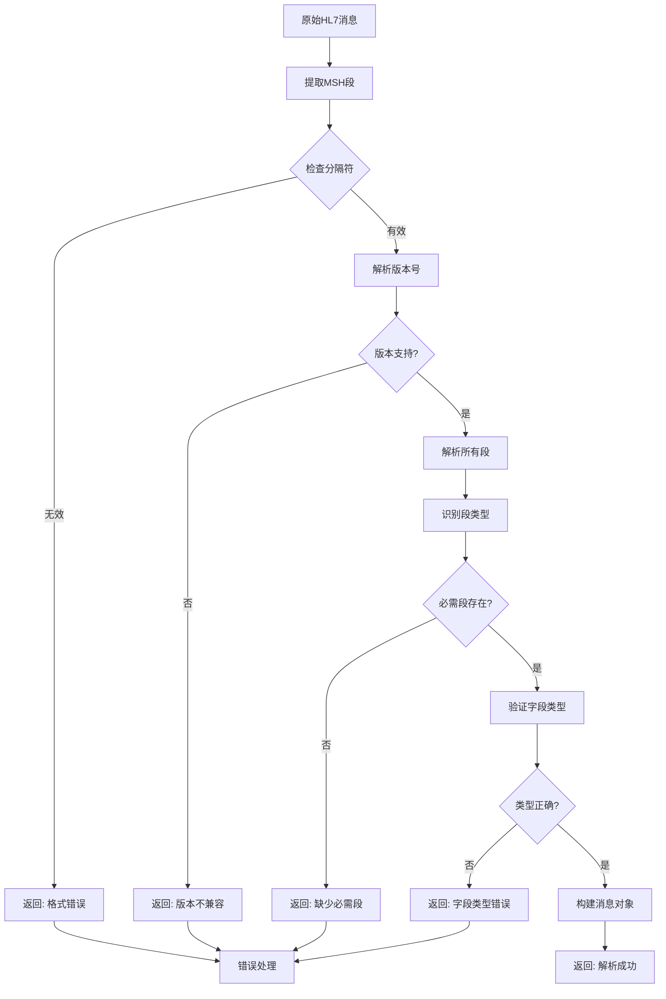
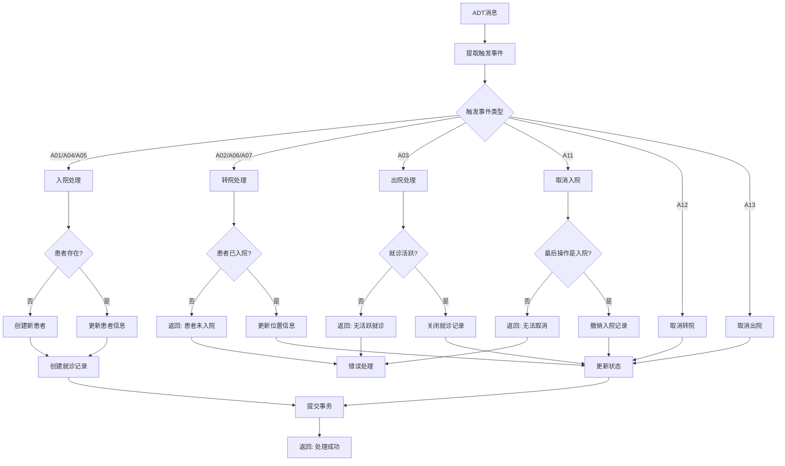
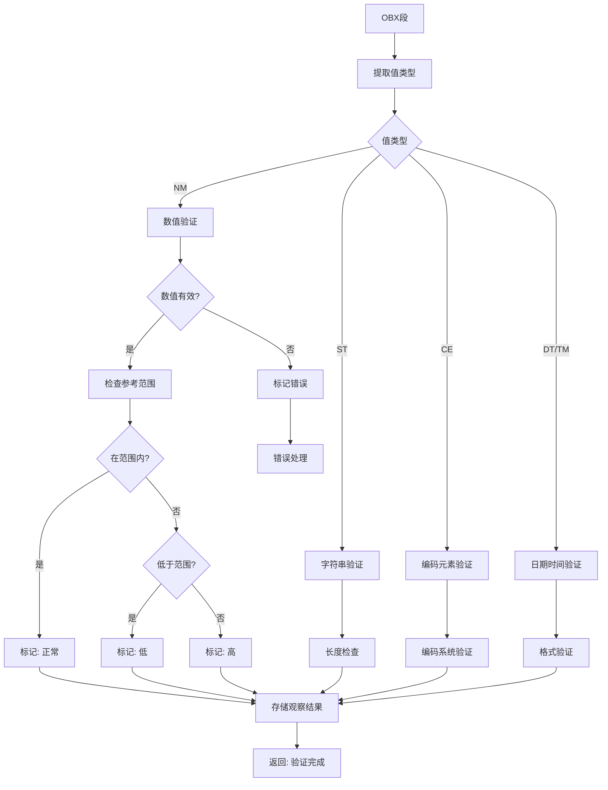
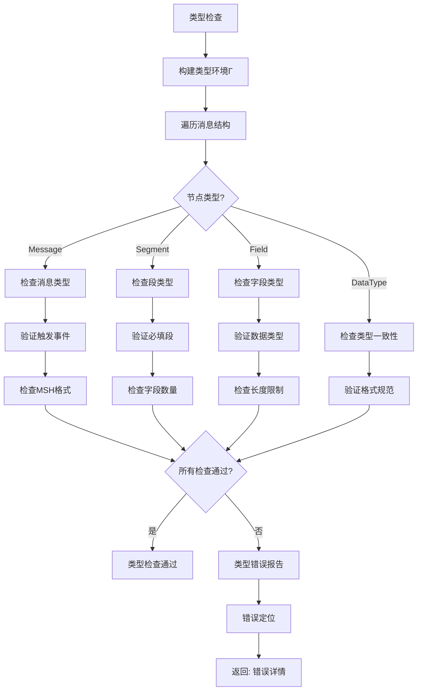
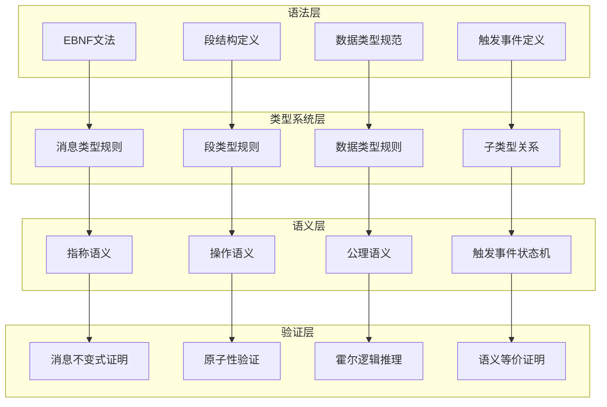

# HL7 Schema形式语法与语义分析视图

**版本**: v1.0
**创建日期**: 2026-02-15
**标准**: HL7 v2.9, HL7 v3.0, HL7 CDA

---

## 📑 目录

- [HL7 Schema形式语法与语义分析视图](#hl7-schema形式语法与语义分析视图)
  - [📑 目录](#-目录)
  - [1. 形式文法定义](#1-形式文法定义)
    - [1.1 EBNF文法](#11-ebnf文法)
      - [1.1.1 消息结构文法](#111-消息结构文法)
      - [1.1.2 核心段文法](#112-核心段文法)
      - [1.1.3 数据类型文法](#113-数据类型文法)
      - [1.1.4 触发事件文法](#114-触发事件文法)
    - [1.2 语法规则](#12-语法规则)
      - [1.2.1 消息头校验规则](#121-消息头校验规则)
      - [1.2.2 患者标识规则](#122-患者标识规则)
      - [1.2.3 观察结果规则](#123-观察结果规则)
      - [1.2.4 触发事件规则](#124-触发事件规则)
  - [2. 形式语义定义](#2-形式语义定义)
    - [2.1 指称语义 (Denotational Semantics)](#21-指称语义-denotational-semantics)
      - [2.1.1 语义域定义](#211-语义域定义)
      - [2.1.2 消息语义](#212-消息语义)
      - [2.1.3 患者管理语义](#213-患者管理语义)
      - [2.1.4 观察结果语义](#214-观察结果语义)
    - [2.2 操作语义 (Operational Semantics)](#22-操作语义-operational-semantics)
      - [2.2.1 大步语义 (Big-Step Semantics)](#221-大步语义-big-step-semantics)
      - [2.2.2 小步语义 (Small-Step Semantics)](#222-小步语义-small-step-semantics)
      - [2.2.3 触发事件状态机语义](#223-触发事件状态机语义)
    - [2.3 公理语义 (Axiomatic Semantics)](#23-公理语义-axiomatic-semantics)
      - [2.3.1 Hoare三元组](#231-hoare三元组)
      - [2.3.2 消息处理推理规则](#232-消息处理推理规则)
      - [2.3.3 观察结果霍尔三元组](#233-观察结果霍尔三元组)
      - [2.3.4 患者状态不变式证明](#234-患者状态不变式证明)
      - [2.3.5 消息原子性证明](#235-消息原子性证明)
  - [3. 类型系统](#3-类型系统)
    - [3.1 类型规则](#31-类型规则)
    - [3.2 类型运算规则](#32-类型运算规则)
    - [3.3 子类型关系](#33-子类型关系)
    - [3.4 多态与类型约束](#34-多态与类型约束)
  - [4. 语义等价性](#4-语义等价性)
    - [4.1 程序等价定义](#41-程序等价定义)
    - [4.2 等价变换规则](#42-等价变换规则)
    - [4.3 消息状态转换等价](#43-消息状态转换等价)
  - [5. Mermaid可视化](#5-mermaid可视化)
    - [5.1 HL7消息解析流程](#51-hl7消息解析流程)
    - [5.2 ADT消息处理语义流程](#52-adt消息处理语义流程)
    - [5.3 观察结果验证流程](#53-观察结果验证流程)
    - [5.4 类型检查流程](#54-类型检查流程)
    - [5.5 形式语义层级图](#55-形式语义层级图)

---

## 1. 形式文法定义

### 1.1 EBNF文法

#### 1.1.1 消息结构文法

```ebnf
(* HL7 v2消息核心结构 - MSH段与消息格式 *)

Message ::= MSHSegment Segment* [SegmentGroup*] Segment*

MSHSegment ::= 'MSH' FieldSeparator EncodingCharacters
               SendingApplication SendingFacility
               ReceivingApplication ReceivingFacility
               DateTimeOfMessage SecurityType
               MessageType MessageControlID ProcessingID VersionID

FieldSeparator ::= '|'

EncodingCharacters ::= '^' '~' '\\' '&'
  (* 组件分隔符、重复分隔符、转义字符、子组件分隔符 *)

Segment ::= SegmentIdentifier Field+ SegmentTerminator

SegmentIdentifier ::= UpperCase+ (2..3)

Field ::= Component (RepeatSeparator Component)*

Component ::= SubComponent (SubcomponentSeparator SubComponent)*

SubComponent ::= ST | TX | NM | DT | TM | CE | ...

RepeatSeparator ::= '~'

SubcomponentSeparator ::= '&'

SegmentTerminator ::= 'CR' | '\\r\\n' | '\\n'
```

#### 1.1.2 核心段文法

```ebnf
(* PID段 - 患者标识段 *)

PIDSegment ::= 'PID' FieldSeparator
               SetIDPID PatientID PatientIdentifierList
               AlternatePatientID PatientName MotherMaidenName
               DateTimeOfBirth Sex PatientAlias Race
               PatientAddress CountyCode PhoneNumberHome
               PhoneNumberBusiness PrimaryLanguage MaritalStatus
               Religion PatientAccountNumber SSNNumberPatient
               DriversLicenseNumber MothersIdentifier
               EthnicGroup BirthPlace MultipleBirthIndicator
               BirthOrder Citizenship VeteransMilitaryStatus
               Nationality PatientDeathDateAndTime
               PatientDeathIndicator IdentityUnknownIndicator
               IdentityReliabilityCode LastUpdateDateTime
               LastUpdateFacility Species Breed
               Strain ProductionClassCode

PatientName ::= FamilyName ComponentSeparator GivenName
                ComponentSeparator MiddleName ComponentSeparator
                Suffix ComponentSeparator Prefix ComponentSeparator
                Degree ComponentSeparator NameTypeCode

FamilyName ::= Surname [SubcomponentSeparator OwnSurnamePrefix]
               [SubcomponentSeparator OwnSurname]
               [SubcomponentSeparator SurnamePrefixFromPartner]
               [SubcomponentSeparator SurnameFromPartner]

(* PV1段 - 患者就诊段 *)

PV1Segment ::= 'PV1' FieldSeparator
               SetIDPV1 PatientClass AssignedPatientLocation
               AdmissionType PreadmitNumber PriorPatientLocation
               AttendingDoctor ReferringDoctor ConsultingDoctor
               HospitalService TemporaryLocation PreadmitTestIndicator
               ReAdmissionReason AdmittingDoctor PatientType
               VisitNumber FinancialClass ChargePriceIndicator
               CourtesyCode CreditRating ContractCode ContractEffectiveDate
               ContractAmount ContractPeriod InterestCode
               TransferToBadDebtCode TransferToBadDebtDate
               BadDebtAgencyCode BadDebtTransferAmount
               BadDebtRecoveryAmount DeleteAccountIndicator
               DeleteAccountDate DischargeDisposition
               DischargedToLocation DietType ServicingFacility
               BedStatus AccountStatus PendingLocation PriorTemporaryLocation
               AdmitDateTime DischargeDateTime CurrentPatientBalance
               ChargesTotalAccount ReadmissionIndicator
               ExpectedTransferDate ExpectedDischargeDate
               EstimatedLengthOfInpatientStay ActualLengthOfInpatientStay
               VisitDescription ReferralSourceCode PreviousServiceDate
               IllnessRelatedIndicator VisitIndicator
               OtherHealthcareProvider

PatientClass ::= 'E' | 'I' | 'O' | 'P' | 'R' | 'B' | 'C' | 'N' | 'U' | 'L'
  (* E=急诊 I=住院 O=门诊 P=新生儿 R=复发 B=产科 C=商业 N=不适用 U=未知 L=实验室 *)

(* OBR段 - 观察请求段 *)

OBRSegment ::= 'OBR' FieldSeparator
               SetIDOBR PlacerOrderNumber FillerOrderNumber
               UniversalServiceIdentifier Priority
               RequestedDateTime ObservationDateTime
               ObservationEndDateTime CollectionVolume CollectorIdentifier
               SpecimenActionCode DangerCode RelevantClinicalInformation
               SpecimenReceivedDateTime SpecimenSource
               OrderingProvider OrderCallbackPhoneNumber
               PlacerField1 PlacerField2 FillerField1 FillerField2
               ResultsRptStatusChngDateTime ChargeToPractice
               ScheduledDateTime ResultStatus ParentResult
               QuantityTiming ResultCopiesTo Parent
               TransportationMode ReasonForStudy PrincipalResultInterpreter
               AssistantResultInterpreter Technician
               Transcriptionist ScheduledDateTime
               NumberOfSampleContainers TransportLogisticsOfCollectedSample
               CollectorsComment TransportArrangementResponsibility
               EscortRequired PlannedPatientTransportComment
               ProcedureCode ProcedureCodeModifier
               PlacerSupplementalServiceInformation
               FillerSupplementalServiceInformation
               MedicallyNecessaryDuplicateProcedureReason
               ResultHandling

(* OBX段 - 观察结果段 *)

OBXSegment ::= 'OBX' FieldSeparator
               SetIDOBX ValueType ObservationIdentifier
               ObservationSubID ObservationValue Units
               ReferencesRange AbnormalFlags Probability
               NatureOfAbnormalTest ObservationResultStatus
               DateLastObservedValue NormalizersReference
               UserDefinedAccessChecks DateTimeOfTheObservation
               ProducersReference RequestedDateTime
               ObservationSite ObservationInstanceIdentifier
               MIMETypeObservationIdentifier ObservationMethod
               EquipmentInstanceIdentifier DateTimeOfAnalysis
               RequisitionSiteInformation
               ObservationSiteD Modifier
               ObservationSiteD MethodOfMeasurement
               EquipmentInstanceIdentifierD ObservationDistributingCenter
               ObservationSiteDC Extension

ValueType ::= 'ST' | 'TX' | 'NM' | 'DT' | 'TM' | 'CE' | 'CF' | 'CK'
            | 'CN' | 'CP' | 'CX' | 'DTM' | 'ED' | 'FT' | 'ID' | 'IS'
            | 'MA' | 'MO' | 'NA' | 'PL' | 'PN' | 'RP' | 'SI' | 'SN'
            | 'TN' | 'TS' | 'XAD' | 'XCN' | 'XON' | 'XPN' | 'XTN'
```

#### 1.1.3 数据类型文法

```ebnf
(* ST - 短字符串 *)
ST ::= PrintableCharacter*

(* TX - 长文本 *)
TX ::= PrintableCharacter (EscapeSequence | PrintableCharacter)*

(* NM - 数字 *)
NM ::= [Sign] Digit+ ['.' Digit+] ['E' [Sign] Digit+]

Sign ::= '+' | '-'
Digit ::= '0' | '1' | '2' | '3' | '4' | '5' | '6' | '7' | '8' | '9'

(* DT - 日期 *)
DT ::= Year [Month [Day]]
Year ::= Digit Digit Digit Digit
Month ::= '01' | '02' | '03' | '04' | '05' | '06' |
          '07' | '08' | '09' | '10' | '11' | '12'
Day ::= '01'..'31'

(* TM - 时间 *)
TM ::= Hour [Minute [Second [FractionOfSecond]]]
Hour ::= '00'..'23'
Minute ::= '00'..'59'
Second ::= '00'..'59'
FractionOfSecond ::= '.' Digit+

(* CE - 编码元素 *)
CE ::= Identifier ComponentSeparator Text ComponentSeparator
       NameOfCodingSystem ComponentSeparator AlternateIdentifier
       ComponentSeparator AlternateText ComponentSeparator
       NameOfAlternateCodingSystem

Identifier ::= ST
Text ::= ST
NameOfCodingSystem ::= 'ICD-10' | 'ICD-9' | 'LOINC' | 'SNOMED' | 'HL7'
```

#### 1.1.4 触发事件文法

```ebnf
(* ADT - 入院、出院、转院触发事件 *)

ADTMessage ::= 'ADT'^TriggerEvent

TriggerEvent ::=
    'A01' (* 患者入院 *)
  | 'A02' (* 患者转院 *)
  | 'A03' (* 患者出院 *)
  | 'A04' (* 患者登记 *)
  | 'A05' (* 患者预入院 *)
  | 'A06' (* 门诊转住院 *)
  | 'A07' (* 住院转门诊 *)
  | 'A08' (* 患者信息更新 *)
  | 'A09' (* 患者临时转院 *)
  | 'A10' (* 患者结束临时转院 *)
  | 'A11' (* 取消入院 *)
  | 'A12' (* 取消转院 *)
  | 'A13' (* 取消出院 *)
  | 'A14' (* 待入院患者信息 *)
  | 'A15' (* 待转院患者信息 *)
  | 'A16' (* 待出院患者信息 *)

(* ORM - 医嘱消息触发事件 *)

ORMMessage ::= 'ORM'^OrderTriggerEvent

OrderTriggerEvent ::=
    'O01' (* 通用医嘱消息 *)
  | 'O02' (* 通用医嘱响应 *)

(* ORU - 观察结果消息触发事件 *)

ORUMessage ::= 'ORU'^ResultTriggerEvent

ResultTriggerEvent ::=
    'R01' (* 观察结果-非请求 *)
  | 'R02' (* 查询响应 *)
  | 'R03' (* 显示响应 *)
  | 'R04' (* 观察结果更新 *)

(* MDM - 医疗文档消息触发事件 *)

MDMMessage ::= 'MDM'^DocumentTriggerEvent

DocumentTriggerEvent ::=
    'T01' (* 原始文档通知 *)
  | 'T02' (* 原始文档通知和内容 *)
  | 'T03' (* 文档状态变更通知 *)
  | 'T04' (* 文档状态变更通知和内容 *)
  | 'T05' (* 文档增删通知 *)
  | 'T06' (* 文档增删通知和内容 *)
  | 'T07' (* 文档编辑通知 *)
  | 'T08' (* 文档编辑通知和内容 *)
  | 'T09' (* 文档替换通知 *)
  | 'T10' (* 文档替换通知和内容 *)
  | 'T11' (* 删除文档 *)
```

### 1.2 语法规则

#### 1.2.1 消息头校验规则

```
约束1: MSH段必须存在且位于消息首部
  ∀msg ∈ Message :
    first_segment(msg) = MSH

约束2: 分隔符格式有效性
  ∀msh ∈ MSHSegment :
    field_separator(msh) = '|' ∧
    encoding_characters(msh) 符合 '^~\\&' 格式

约束3: 版本号有效性
  ∀msh ∈ MSHSegment :
    version_id(msh) ∈ {'2.1', '2.2', '2.3', '2.3.1', '2.4', '2.5',
                       '2.5.1', '2.6', '2.7', '2.7.1', '2.8', '2.8.1', '2.9'}

约束4: 消息控制ID唯一性
  ∀msh₁, msh₂ ∈ MSHSegment :
    message_control_id(msh₁) = message_control_id(msh₂) ⇒ msh₁ = msh₂
```

#### 1.2.2 患者标识规则

```
约束5: PID段必须存在
  ∀msg ∈ ADTMessage ∪ ORUMessage :
    ∃pid ∈ segments(msg) : segment_type(pid) = PID

约束6: 患者标识符唯一性
  ∀pid ∈ PIDSegment :
    patient_identifier_list(pid) ≠ ⊥ ∧
    ∀id ∈ patient_identifier_list(pid) : identifier_type_code(id) ≠ ⊥

约束7: 性别值有效性
  ∀pid ∈ PIDSegment :
    sex(pid) ∈ {'M', 'F', 'O', 'U', 'A', 'N'}
    (* M=男 F=女 O=其他 U=未知 A=未指明 N=不适用 *)

约束8: 出生日期格式
  ∀pid ∈ PIDSegment :
    date_time_of_birth(pid) 符合 YYYY[MM[DD]] 格式
```

#### 1.2.3 观察结果规则

```
约束9: OBX值类型一致性
  ∀obx ∈ OBXSegment :
    value_type(obx) = 'NM' ⇒ observation_value(obx) 是有效数字
    value_type(obx) = 'DT' ⇒ observation_value(obx) 符合日期格式
    value_type(obx) = 'CE' ⇒ observation_value(obx) 符合编码元素格式

约束10: 参考范围格式
  ∀obx ∈ OBXSegment :
    references_range(obx) 符合 RangeFormat
    RangeFormat ::= NM '-' NM | '<' NM | '>' NM

约束11: 异常标志有效性
  ∀obx ∈ OBXSegment :
    abnormal_flags(obx) ∈ {'L', 'H', 'LL', 'HH', '<', '>', 'N', 'A', 'U',
                           'D', 'B', 'W', '*', 'MS', 'VS'}
```

#### 1.2.4 触发事件规则

```
约束12: 消息类型与触发事件一致性
  ∀msg ∈ Message :
    let mt = message_type(msg) in
    let te = trigger_event(msg) in
    valid_trigger_event(mt, te) = true

约束13: ADT消息必含PV1段
  ∀msg ∈ ADTMessage :
    trigger_event(msg) ∉ {'A28', 'A31', 'A34', 'A40', 'A47', 'A49', 'A52', 'A54'} ⇒
      ∃pv1 ∈ segments(msg) : segment_type(pv1) = PV1

约束14: ORU消息必含OBR和OBX段
  ∀msg ∈ ORUMessage :
    ∃obr ∈ segments(msg) : segment_type(obr) = OBR ∧
    ∃obx ∈ segments(msg) : segment_type(obx) = OBX
```

---

## 2. 形式语义定义

### 2.1 指称语义 (Denotational Semantics)

#### 2.1.1 语义域定义

```
D[HL7System] : Environment → State → State

State = MessageState × SegmentState × PatientState × ObservationState

MessageState = MessageControlID → MessageValue
MessageValue = {
  message_type: MessageType,
  trigger_event: TriggerEvent,
  sending_application: ApplicationID,
  receiving_application: ApplicationID,
  timestamp: Timestamp,
  segments: List<Segment>,
  status: MessageStatus,
  ...
}

SegmentState = SegmentID → SegmentValue
SegmentValue = {
  segment_type: SegmentType,
  fields: List<Field>,
  sequence_number: Integer,
  required: Boolean,
  ...
}

PatientState = PatientID → PatientValue
PatientValue = {
  patient_identifiers: List<Identifier>,
  name: PersonName,
  date_of_birth: Date,
  sex: SexType,
  addresses: List<Address>,
  phone_numbers: List<Telecom>,
  visit_history: List<Visit>,
  ...
}

ObservationState = ObservationID → ObservationValue
ObservationValue = {
  observation_code: Code,
  value: Value,
  units: Unit,
  reference_range: Range,
  status: ObservationStatus,
  timestamp: Timestamp,
  ...
}

MessageType = {ADT, ORM, ORU, MDM, ACK, QRY, DFT, ...}
TriggerEvent = {A01, A02, A03, ..., O01, O02, ..., R01, R02, ...}
SegmentType = {MSH, PID, PV1, OBR, OBX, NK1, AL1, DG1, ...}
MessageStatus = {CREATED, SENT, RECEIVED, PROCESSED, ERROR}
ObservationStatus = {F, P, C, R, D, X, I, S, N}
Timestamp = ℕ  (* Unix时间戳 *)
```

#### 2.1.2 消息语义

```
(* 消息解析语义 *)
E[parse_message(raw)] env sto =
  let msh = extract_msh(raw) in
  let segments = parse_segments(raw) in
  {
    message_type = extract_message_type(msh),
    trigger_event = extract_trigger_event(msh),
    segments = segments,
    timestamp = now(),
    status = CREATED
  }

(* 消息路由语义 *)
E[route_message(msg)] env sto =
  let target = determine_target(msg.receiving_application) in
  if target_available(target)
  then send_to(msg, target)
  else queue_message(msg, target)

(* 消息验证语义 *)
S[validate_message(msg)] env sto =
  let checks = [
    validate_msh(msg),
    validate_required_segments(msg),
    validate_field_types(msg),
    validate_trigger_event(msg)
  ] in
  if all_passed(checks)
  then sto[msg ↦ msg[status ↦ PROCESSED]]
  else sto[msg ↦ msg[status ↦ ERROR, error_info ↦ failed_checks(checks)]]
```

#### 2.1.3 患者管理语义

```
(* 患者入院语义 *)
S[admit_patient(adt_msg)] env sto =
  let pid = extract_pid(adt_msg) in
  let pv1 = extract_pv1(adt_msg) in
  let patient_id = extract_patient_id(pid) in
  let visit = create_visit(pv1) in

  if patient_exists(sto, patient_id)
  then sto[patient_id ↦ update_patient(patient_id, pid, visit)]
  else sto[patient_id ↦ create_patient(pid, visit)]

(* 患者转院语义 *)
S[transfer_patient(adt_msg)] env sto =
  let pid = extract_pid(adt_msg) in
  let pv1 = extract_pv1(adt_msg) in
  let patient_id = extract_patient_id(pid) in
  let from_location = current_location(sto, patient_id) in
  let to_location = extract_location(pv1) in

  sto[patient_id ↦ update_location(patient_id, from_location, to_location)]

(* 患者出院语义 *)
S[discharge_patient(adt_msg)] env sto =
  let pid = extract_pid(adt_msg) in
  let pv1 = extract_pv1(adt_msg) in
  let patient_id = extract_patient_id(pid) in
  let discharge_info = extract_discharge_info(pv1) in

  sto[patient_id ↦ close_visit(patient_id, discharge_info)]
```

#### 2.1.4 观察结果语义

```
(* 观察结果存储语义 *)
S[store_observation(oru_msg)] env sto =
  let obr = extract_obr(oru_msg) in
  let obx_list = extract_obx_segments(oru_msg) in
  let patient_id = extract_patient_id(extract_pid(oru_msg)) in
  let order = create_order_reference(obr) in

  foldl (fun sto obx →
    let obs = create_observation(obx, order, patient_id) in
    sto[observation_id(obs) ↦ obs]
  ) sto obx_list

(* 异常标志解释语义 *)
E[interpret_abnormal_flag(flag)] env sto =
  match flag with
  | 'L'  → BELOW_NORMAL
  | 'H'  → ABOVE_NORMAL
  | 'LL' → CRITICALLY_LOW
  | 'HH' → CRITICALLY_HIGH
  | '<'  → BELOW_MEASUREMENT_RANGE
  | '>'  → ABOVE_MEASUREMENT_RANGE
  | 'N'  → NORMAL
  | _    → UNKNOWN

(* 参考范围检查语义 *)
E[check_reference_range(value, range)] env sto =
  let parsed_range = parse_range(range) in
  match parsed_range with
  | Range(low, high) → low ≤ value ≤ high
  | LessThan(max)    → value < max
  | GreaterThan(min) → value > min
```

### 2.2 操作语义 (Operational Semantics)

#### 2.2.1 大步语义 (Big-Step Semantics)

```
配置: ⟨Expression, State⟩ ⇓ Value
      ⟨Statement, State⟩ ⇓ State'

(* 消息解析 *)
⟨parse(raw), σ⟩ ⇓ msg                                      (E-Parse)
  where msg = parse_hl7_message(raw) ∧ msg ≠ error

(* 段提取 *)
⟨msg.get_segment(type), σ⟩ ⇓ seg                          (E-GetSegment)
  where seg ∈ msg.segments ∧ seg.segment_type = type

(* 字段提取 *)
⟨seg.get_field(n), σ⟩ ⇓ field                             (E-GetField)
  where field = seg.fields[n]

(* 患者入院 *)
⟨admit(adt_msg), σ⟩ ⇓ σ[patient_id ↦ patient]             (S-Admit)
  where patient = create_or_update_patient(adt_msg) ∧
        patient_id = patient.identifiers[0]

(* 患者转院 *)
⟨transfer(adt_msg), σ⟩ ⇓ σ[patient_id.location ↦ new_loc] (S-Transfer)
  where new_loc = extract_location(adt_msg.pv1) ∧
        patient_id = extract_patient_id(adt_msg)

(* 观察结果存储 *)
⟨store_obs(oru_msg), σ⟩ ⇓ σ'                              (S-StoreObs)
  where obs_list = extract_observations(oru_msg) ∧
        σ' = fold_insert_observations(σ, obs_list)

(* 消息确认 *)
⟨acknowledge(msg), σ⟩ ⇓ σ[msg.status ↦ ACKED]             (S-Ack)
  where msg.status ∈ {SENT, RECEIVED}
```

#### 2.2.2 小步语义 (Small-Step Semantics)

```
配置: ⟨Statement, State⟩ → ⟨Statement', State'⟩
      或 ⟨Statement, State⟩ → State'  (终止)

(* 消息处理步骤 *)
⟨process_msg(msg), σ⟩ → ⟨validate(msg) ; route(msg), σ⟩   (S-ProcessStart)

(* 验证步骤 *)
⟨validate(msg), σ⟩ → σ                                    (S-ValidateOk)
  where validate_msh(msg) = ok ∧
        validate_required_segments(msg) = ok ∧
        validate_field_types(msg) = ok

⟨validate(msg), σ⟩ → error                                (S-ValidateFail)
  where validate_msh(msg) = error ∨
        validate_required_segments(msg) = error ∨
        validate_field_types(msg) = error

(* 路由步骤 *)
⟨route(msg), σ⟩ → ⟨deliver(msg, target), σ⟩               (S-Route)
  where target = resolve_target(msg.receiving_application)

(* 段处理 *)
⟨process_segments(segs), σ⟩ → ⟨process(head(segs)) ; process_segments(tail(segs)), σ⟩  (S-SegProcess)
  where segs ≠ []

⟨process_segments([]), σ⟩ → σ                             (S-SegProcessEmpty)

(* 条件处理 *)
⟨IF msg.type = ADT THEN process_adt(msg) ELSE process_other(msg), σ⟩ → ⟨process_adt(msg), σ⟩  (S-IfADT)
  where msg.type = ADT

⟨IF msg.type = ADT THEN process_adt(msg) ELSE process_other(msg), σ⟩ → ⟨process_other(msg), σ⟩  (S-IfOther)
  where msg.type ≠ ADT
```

#### 2.2.3 触发事件状态机语义

```
(* ADT触发事件状态转移规则 *)

⟨patient.status, σ⟩ → ⟨NOT_ADMITTED, σ⟩                   (ADT-Init)

⟨admit(adt_a01), σ⟩ → ⟨ADMITTED, σ[patient.location ↦ loc]⟩  (ADT-Admit)
  where loc = extract_location(adt_a01)

⟨transfer(adt_a02), σ⟩ → ⟨TRANSFERRED, σ[patient.location ↦ new_loc]⟩  (ADT-Transfer)
  where new_loc = extract_location(adt_a02)

⟨discharge(adt_a03), σ⟩ → ⟨DISCHARGED, σ⟩                 (ADT-Discharge)
  where σ(patient).status = ADMITTED ∨ σ(patient).status = TRANSFERRED

⟨cancel_admit(adt_a11), σ⟩ → ⟨CANCELLED, σ⟩              (ADT-CancelAdmit)
  where σ(patient).status = ADMITTED

⟨cancel_transfer(adt_a12), σ⟩ → ⟨ADMITTED, σ[patient.location ↦ prev_loc]⟩  (ADT-CancelTransfer)
  where σ(patient).status = TRANSFERRED

⟨cancel_discharge(adt_a13), σ⟩ → ⟨ADMITTED, σ⟩           (ADT-CancelDischarge)
  where σ(patient).status = DISCHARGED
```

### 2.3 公理语义 (Axiomatic Semantics)

#### 2.3.1 Hoare三元组

```
{P} S {Q}

含义: 如果前置条件P在执行语句S前成立，
      且S终止，
      则后置条件Q在S执行后成立。
```

#### 2.3.2 消息处理推理规则

```
(* 消息解析公理 *)
{msg_raw 符合HL7格式}
  parse_message(msg_raw)
{msg.segments ≠ ⊥ ∧ msg.msh ≠ ⊥}
  (Axiom-Parse)

(* MSH验证公理 *)
{msg.msh.field_separator = '|'}
  validate_msh(msg)
{msg.msh.encoding_characters 符合 '^~\\&'}
  (Axiom-MSHValid)

(* 段存在性公理 *)
{msg.type = ADT ∧ msg.trigger_event = A01}
  validate_required_segments(msg)
{∃pid, pv1 ∈ msg.segments}
  (Axiom-RequiredSegments)

(* 患者创建公理 *)
{pid.segment_type = PID ∧ pid.patient_id ≠ ⊥}
  create_patient(pid)
{patient.identifiers[0] = pid.patient_id}
  (Axiom-PatientCreate)

(* 入院公理 *)
{patient.status = NOT_ADMITTED}
  admit_patient(adt_a01)
{patient.status = ADMITTED}
  (Axiom-Admit)

(* 转院公理 *)
{patient.status = ADMITTED ∧ patient.location = from_loc}
  transfer_patient(adt_a02, from_loc, to_loc)
{patient.status = TRANSFERRED ∧ patient.location = to_loc}
  (Axiom-Transfer)

(* 出院公理 *)
{patient.status ∈ {ADMITTED, TRANSFERRED}}
  discharge_patient(adt_a03)
{patient.status = DISCHARGED ∧ patient.discharge_time ≠ ⊥}
  (Axiom-Discharge)
```

#### 2.3.3 观察结果霍尔三元组

```
(* 观察结果存储公理 *)
{obx.value_type = 'NM' ∧ is_numeric(obx.value)}
  store_observation(obx)
{observation.value = numeric_value(obx.value)}
  (Axiom-NumericObs)

{obx.value_type = 'CE' ∧ obx.observation_identifier ≠ ⊥}
  store_observation(obx)
{observation.code = parse_ce(obx.observation_identifier)}
  (Axiom-CodedObs)

(* 参考范围验证公理 *)
{observation.value = v ∧ observation.reference_range = r ∧ v ∈ r}
  validate_observation(observation)
{observation.abnormal_flag = 'N'}
  (Axiom-NormalObs)

{observation.value = v ∧ observation.reference_range = r ∧ v < min(r)}
  validate_observation(observation)
{observation.abnormal_flag = 'L' ∨ observation.abnormal_flag = 'LL'}
  (Axiom-LowObs)

{observation.value = v ∧ observation.reference_range = r ∧ v > max(r)}
  validate_observation(observation)
{observation.abnormal_flag = 'H' ∨ observation.abnormal_flag = 'HH'}
  (Axiom-HighObs)

(* 事务完整性 *)
{∀obs: observation_state(obs) = S_obs}
  process_oru_message(oru)
{∀obs: observation_state(obs) = S_obs ∪ new_observations(oru)}
  (Rule-ObservationPreservation)
```

#### 2.3.4 患者状态不变式证明

```
不变式 I: patient.identifiers ≠ ⊥ ∧
          patient.identifiers[0] ≠ ⊥ ∧
          ∀id ∈ patient.identifiers : id.identifier_type ≠ ⊥ ∧
          patient.sex ∈ {M, F, O, U, A, N}

证明:

1. 初始状态:
   患者注册时 identifiers 包含至少一个主标识符，sex 已设定
   ⇒ I 成立

2. 保持性:

   情况1: update_patient(pid_update)
   {identifiers = I, sex = S}
   update_patient(pid_update)
   {identifiers = merge(I, pid_update.identifiers), sex = S}

   验证:
   - merge 操作保证 identifiers 非空
   - sex 值域检查保持不变
   - 新标识符必须经过类型验证

   情况2: admit_patient(adt)
   {status = NOT_ADMITTED, visit = ⊥}
   admit_patient(adt)
   {status = ADMITTED, visit = new_visit(adt)}

   验证:
   - 患者基本信息保持不变
   - I 继续成立

3. 结论: I 是不变式 ∎
```

#### 2.3.5 消息原子性证明

```
定理: 所有ADT消息处理满足原子性

∀adt ∈ ADTMessage:
  process_adt(adt) 满足以下之一:
  a) 完全成功: 患者状态完全更新
  b) 完全失败: 患者状态未改变
  c) 成功回滚: 如果部分失败，则回滚到初始状态

证明:

设初始状态 σ, ADT消息 adt

情况1: 消息有效 ∧ 患者存在
   ⟨update_patient(adt), σ⟩ ⇓ σ₁
   单个原子操作
   ⇒ 消息原子性满足 ✓

情况2: 消息有效 ∧ 患者不存在 ∧ 触发事件允许创建
   ⟨create_patient(adt) ; admit_patient(adt), σ⟩ ⇓ σ₁
   创建和入院作为原子事务
   ⇒ 消息原子性满足 ✓

情况3: 消息无效 ∨ 触发事件不允许
   前置检查失败
   没有任何状态改变
   ⇒ 消息原子性满足 ✓

情况4: 部分更新失败 (假设场景)
   根据操作语义规则 (S-TransactionFail):
   如果任一操作失败，则状态回滚
   ⟨process_adt(adt), σ⟩ ⇓ σ[adt.status ↦ ERROR]
   没有持久化状态改变
   ⇒ 消息原子性满足 ✓

因此，系统保证ADT消息处理原子性。 ∎
```

---

## 3. 类型系统

### 3.1 类型规则

```
(* 基础类型 *)
Γ ⊢ s : ST              if s ∈ PrintableCharacter* ∧ |s| ≤ 200  (T-ST)

Γ ⊢ t : TX              if t ∈ PrintableCharacter*             (T-TX)

Γ ⊢ n : NM              if n 符合数字格式规范                  (T-NM)

Γ ⊢ d : DT              if d 符合 YYYY[MM[DD]] 格式            (T-DT)

Γ ⊢ t : TM              if t 符合 HH[MM[SS[.S]]] 格式          (T-TM)

Γ ⊢ c : CE              if c 符合编码元素格式                   (T-CE)

(* 消息类型 *)
Γ ⊢ msg : ADTMessage    if msg.message_type = 'ADT'            (T-ADTMsg)

Γ ⊢ msg : ORMMessage    if msg.message_type = 'ORM'            (T-ORMMsg)

Γ ⊢ msg : ORUMessage    if msg.message_type = 'ORU'            (T-ORUMsg)

Γ ⊢ msg : MDMMessage    if msg.message_type = 'MDM'            (T-MDMMsg)

(* 段类型 *)
Γ ⊢ seg : MSHSegment    if seg.segment_type = 'MSH'            (T-MSHSeg)

Γ ⊢ seg : PIDSegment    if seg.segment_type = 'PID'            (T-PIDSeg)

Γ ⊢ seg : PV1Segment    if seg.segment_type = 'PV1'            (T-PV1Seg)

Γ ⊢ seg : OBRSegment    if seg.segment_type = 'OBR'            (T-OBRSeg)

Γ ⊢ seg : OBXSegment    if seg.segment_type = 'OBX'            (T-OBXSeg)

(* 触发事件类型 *)
Γ ⊢ te : AdmitEvent     if te ∈ {A01, A04, A05, A14}           (T-AdmitEvent)

Γ ⊢ te : TransferEvent  if te ∈ {A02, A06, A07, A09, A10, A15} (T-TransferEvent)

Γ ⊢ te : DischargeEvent if te ∈ {A03, A16}                     (T-DischargeEvent)

Γ ⊢ te : CancelEvent    if te ∈ {A11, A12, A13}                (T-CancelEvent)

(* 观察状态类型 *)
Γ ⊢ s : FinalStatus     if s = 'F'                             (T-FinalStatus)

Γ ⊢ s : PrelimStatus    if s = 'P'                             (T-PrelimStatus)

Γ ⊢ s : CorrectedStatus if s = 'C'                             (T-CorrectedStatus)
```

### 3.2 类型运算规则

```
(* 字符串拼接 *)
Γ ⊢ s1 : ST  Γ ⊢ s2 : ST                                (T-STConcat)
────────────────────────────────────────
Γ ⊢ s1 ^ s2 : ST

(* 数值运算 *)
Γ ⊢ n1 : NM  Γ ⊢ n2 : NM                                (T-NMAdd)
────────────────────────────────────────
Γ ⊢ n1 + n2 : NM

Γ ⊢ n1 : NM  Γ ⊢ n2 : NM                                (T-NMSub)
────────────────────────────────────────
Γ ⊢ n1 - n2 : NM

(* 日期时间运算 *)
Γ ⊢ d : DT  Γ ⊢ t : TM                                  (T-DTTMConcat)
────────────────────────────────────────
Γ ⊢ d @ t : DTM

(* 编码元素比较 *)
Γ ⊢ c1 : CE  Γ ⊢ c2 : CE  c1.code_system = c2.code_system  (T-CECompare)
────────────────────────────────────────
Γ ⊢ compare(c1, c2) : Boolean

(* 段提取 *)
Γ ⊢ msg : Message                                       (T-GetSegment)
────────────────────────────────────────
Γ ⊢ msg.get_segment(type) : Segment

(* 消息有效性检查 *)
Γ ⊢ msg : Message                                       (T-ValidateMsg)
────────────────────────────────────────
Γ ⊢ validate_message(msg) : ValidationResult

Γ ⊢ msg : Message  Γ ⊢ msg.msh : MSHSegment             (T-ParseMsg)
────────────────────────────────────────
Γ ⊢ parse_message(msg) : ParsedMessage
```

### 3.3 子类型关系

```
(* 消息类型层次 *)
Message
├── ADTMessage
│   ├── AdmitMessage
│   ├── TransferMessage
│   ├── DischargeMessage
│   └── UpdateMessage
├── ORMMessage
│   ├── OrderNewMessage
│   └── OrderResponseMessage
├── ORUMessage
│   ├── ResultUnsolicitedMessage
│   └── ResultResponseMessage
└── MDMMessage
    ├── DocumentNotificationMessage
    └── DocumentContentMessage

子类型规则:
AdmitMessage ≤ ADTMessage ≤ Message
TransferMessage ≤ ADTMessage ≤ Message
ResultUnsolicitedMessage ≤ ORUMessage ≤ Message
DocumentNotificationMessage ≤ MDMMessage ≤ Message

(* 段类型层次 *)
Segment
├── HeaderSegment (MSH)
├── PatientSegment (PID, NK1, PV1, PV2)
├── OrderSegment (OBR, ORC)
├── ResultSegment (OBX, NTE)
└── DiagnosisSegment (DG1, PR1)

子类型规则:
PIDSegment ≤ PatientSegment ≤ Segment
OBRSegment ≤ OrderSegment ≤ Segment
OBXSegment ≤ ResultSegment ≤ Segment

(* 触发事件层次 *)
ADTEvent
├── AdmitEvent {A01, A04, A05, A14}
├── TransferEvent {A02, A06, A07, A09, A10}
├── DischargeEvent {A03, A16}
├── UpdateEvent {A08, A28, A31}
└── CancelEvent {A11, A12, A13}

子类型规则:
AdmitEvent ≤ ADTEvent
TransferEvent ≤ ADTEvent
CancelEvent ≤ ADTEvent

(* 数据类型层次 *)
HL7DataType
├── SimpleType
│   ├── ST (String)
│   ├── TX (Text)
│   ├── NM (Numeric)
│   ├── DT (Date)
│   └── TM (Time)
├── CodedType
│   ├── CE (Coded Element)
│   ├── CF (Coded with Formatted Values)
│   └── CK (Composite ID with Check Digit)
├── PersonType
│   ├── PN (Person Name)
│   ├── XPN (Extended Person Name)
│   └── XCN (Extended Composite ID and Name)
└── ComplexType
    ├── AD (Address)
    ├── XAD (Extended Address)
    ├── TN (Telephone Number)
    └── XTN (Extended Telecommunication Number)

子类型规则:
ST ≤ SimpleType ≤ HL7DataType
CE ≤ CodedType ≤ HL7DataType
PN ≤ PersonType ≤ HL7DataType
```

### 3.4 多态与类型约束

```
(* 通用段提取 *)
∀α ≤ Segment. Γ ⊢ get_segment : Message × SegmentType → α

(* 通用消息处理 *)
∀μ ≤ Message. Γ ⊢ process_message : μ → ProcessingResult

(* 字段值约束 *)
Γ ⊢ f : Field  where f.value ≠ ⊥ ∧ f.value 符合 value_type(f)

(* 触发事件约束 *)
Γ ⊢ te : TriggerEvent  where te ∈ valid_events(msg.message_type)

(* 标识符约束 *)
Γ ⊢ id : Identifier  where id.value ≠ ⊥ ∧ id.identifier_type ≠ ⊥

(* 必填字段约束 *)
Γ ⊢ msg : ValidMessage  where ∀seg ∈ msg.segments :
  ∀field ∈ required_fields(seg) : field.value ≠ ⊥
```

---

## 4. 语义等价性

### 4.1 程序等价定义

```
定义: 两个HL7消息msg₁和msg₂语义等价 (msg₁ ≡ msg₂) 当且仅当:
∀σ, σ' : ⟨process(msg₁), σ⟩ ⇓ σ' ⟺ ⟨process(msg₂), σ⟩ ⇓ σ'

定义: 两个段序列seq₁和seq₂效果等价 (seq₁ ≈ seq₂) 当且仅当:
∀σ : final_state(⟨process_segments(seq₁), σ⟩) = final_state(⟨process_segments(seq₂), σ⟩)
```

### 4.2 等价变换规则

```
(* 段排序等价 (同类型段) *)
[PID1, PID2, PID3] ≡ [PID1, PID2, PID3]  (顺序依赖)
[OBX1, OBX2, OBX3] ≡ [OBX1, OBX2, OBX3]  (顺序依赖)

(* 可选段省略等价 *)
[MSH, PID, PV1, OBX] ≡ [MSH, PID, OBX]
  where PV1 在特定消息类型中为可选

(* 字段默认值等价 *)
field(value = "") ≡ field(value = ⊥)
  where field 允许空值

(* 取消操作等价 *)
process(ADT^A01) ; process(ADT^A11) ≡ skip
  (入院后取消入院 = 无变化)

process(ADT^A02) ; process(ADT^A12) ≡ skip
  (转院后取消转院 = 无变化)

process(ADT^A03) ; process(ADT^A13) ≡ skip
  (出院后取消出院 = 无变化)

(* 更新操作等价 *)
process(ADT^A08) ; process(ADT^A08) ≡ process(ADT^A08)
  (连续两次相同更新 = 一次更新)

(* 条件处理等价 *)
IF msg.type = ADT THEN process_adt(msg) ELSE process_other(msg)
≡
CASE msg.type
  WHEN 'ADT' THEN process_adt(msg)
  ELSE process_other(msg)
END

(* 并发消息等价性 *)
process(msg₁) || process(msg₂) ≡ process(msg₁) ; process(msg₂)
  (假设无冲突患者)
```

### 4.3 消息状态转换等价

```
(* 状态恢复等价 *)
admit(patient) ; discharge(patient) ≡ skip
  where patient 无其他未完成就诊

transfer(patient, loc1, loc2) ; transfer(patient, loc2, loc1) ≡ skip
  (两次互逆转院 = 无变化)

(* 结果更新等价 *)
process(ORU^R01) ; process(ORU^R04) ≡ process(ORU^R04)
  (原始结果后更新 = 直接接收更新)

(* 顺序无关操作 *)
update_patient_name(pid, name) ; update_patient_address(pid, addr)
≡
update_patient_address(pid, addr) ; update_patient_name(pid, name)
  (不同字段更新顺序无关)
```

---

## 5. Mermaid可视化

### 5.1 HL7消息解析流程



### 5.2 ADT消息处理语义流程



### 5.3 观察结果验证流程



### 5.4 类型检查流程



### 5.5 形式语义层级图



---

**参考文档**:

- `02_Formal_Definition.md` - 形式化定义
- `03_Standards.md` - 标准对标
- `04_Transformation.md` - 转换体系
- `05_Case_Studies.md` - 实践案例
- HL7 v2.9 标准文档
- HL7 v3.0 RIM模型规范

**维护者**: DSL Schema研究团队
**标准**: HL7 v2.9, HL7 v3.0, HL7 CDA
