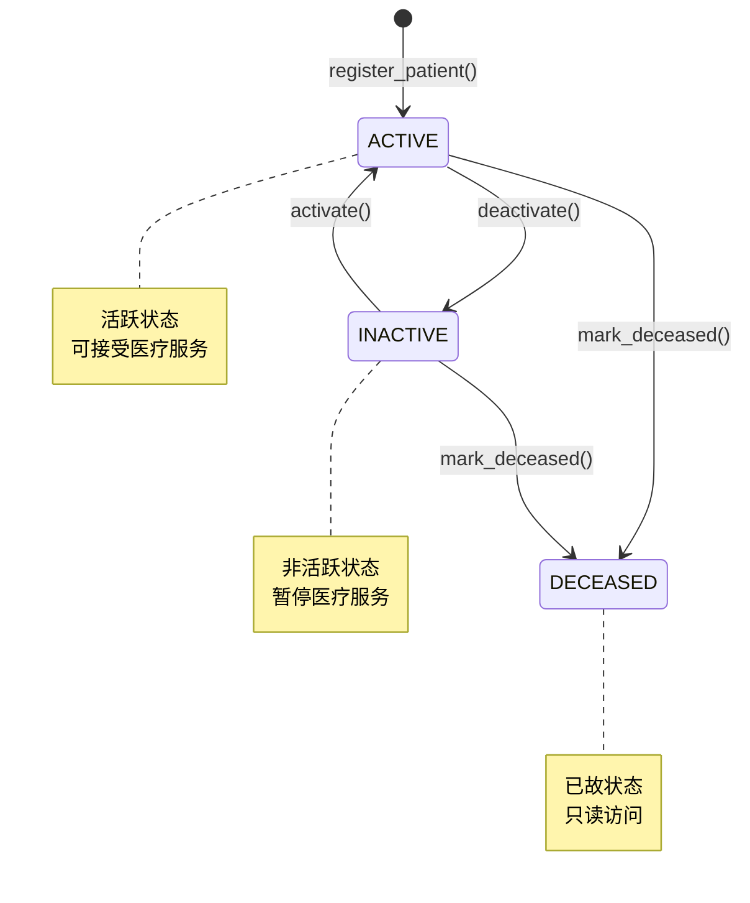
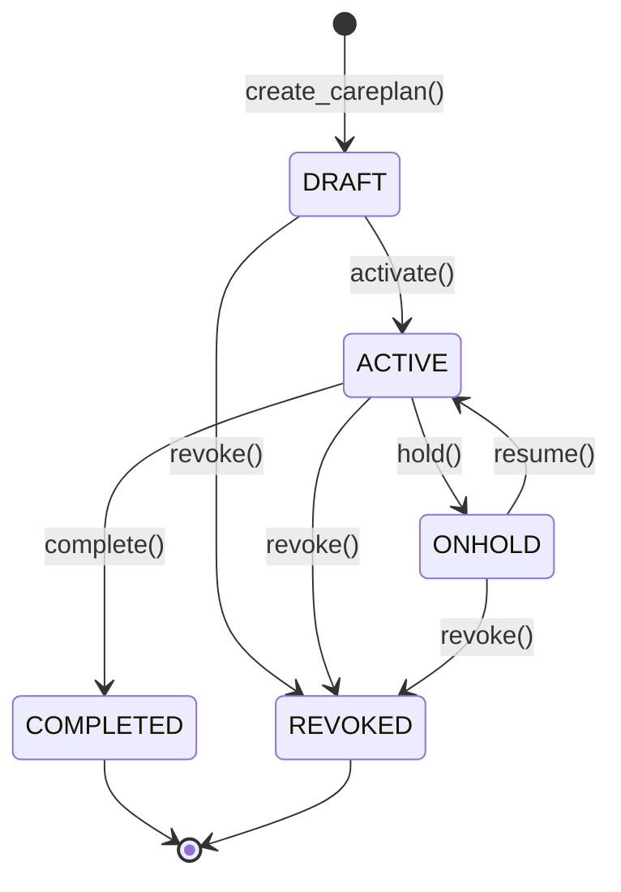
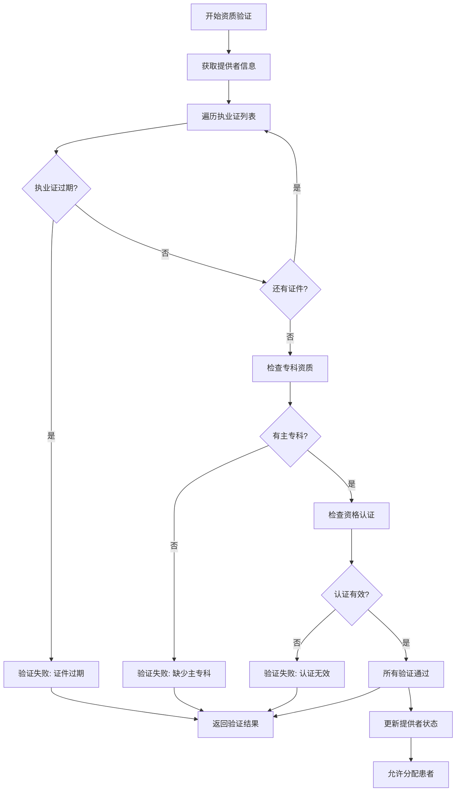
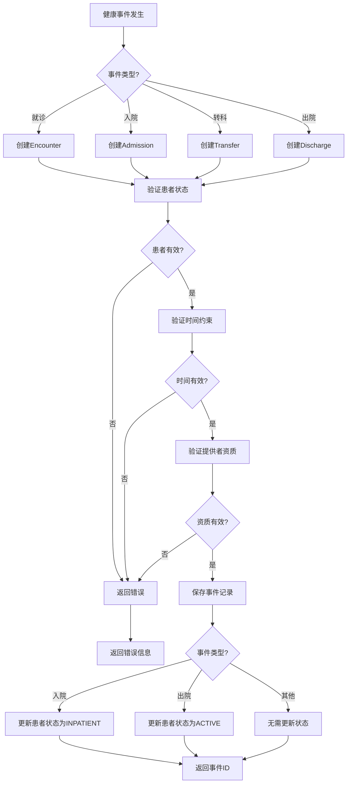
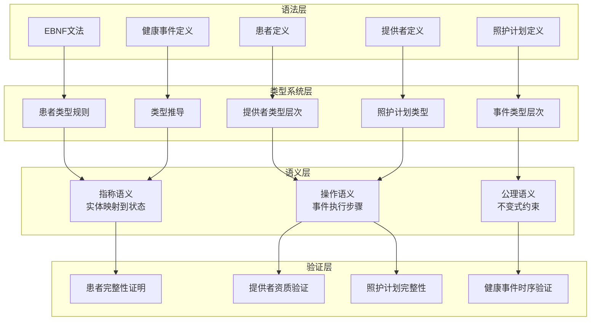
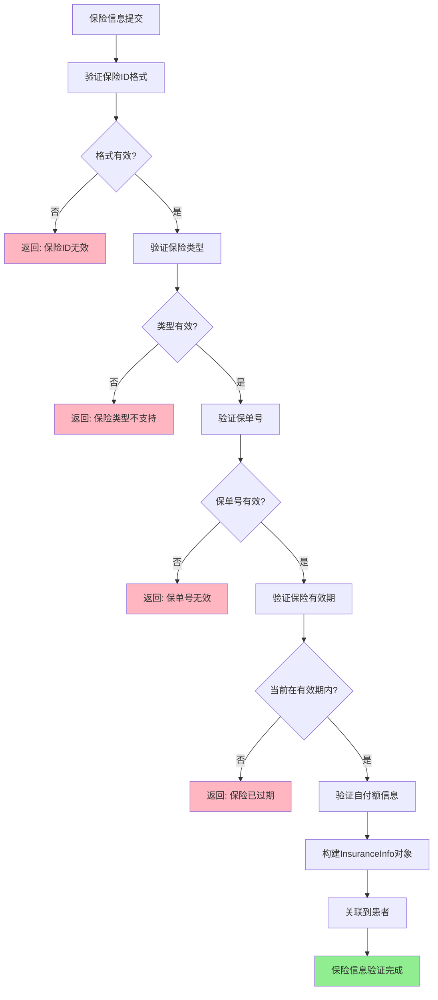

# 医疗健康Schema形式语法与语义分析视图

**版本**: v1.0
**创建日期**: 2026-02-15
**标准**: HL7 FHIR R5, ISO/TS 22220:2011, DICOM, IHE

---

## 📑 目录

- [医疗健康Schema形式语法与语义分析视图](#医疗健康schema形式语法与语义分析视图)
  - [📑 目录](#-目录)
  - [1. 形式文法定义](#1-形式文法定义)
    - [1.1 EBNF文法](#11-ebnf文法)
      - [1.1.1 患者实体文法](#111-患者实体文法)
      - [1.1.2 提供者实体文法](#112-提供者实体文法)
      - [1.1.3 照护计划实体文法](#113-照护计划实体文法)
      - [1.1.4 健康事件实体文法](#114-健康事件实体文法)
    - [1.2 语法规则](#12-语法规则)
      - [1.2.1 患者标识符校验规则](#121-患者标识符校验规则)
      - [1.2.2 提供者资质规则](#122-提供者资质规则)
      - [1.2.3 照护计划完整性规则](#123-照护计划完整性规则)
      - [1.2.4 健康事件时序规则](#124-健康事件时序规则)
  - [2. 形式语义定义](#2-形式语义定义)
    - [2.1 指称语义 (Denotational Semantics)](#21-指称语义-denotational-semantics)
      - [2.1.1 语义域定义](#211-语义域定义)
      - [2.1.2 患者语义](#212-患者语义)
      - [2.1.3 提供者语义](#213-提供者语义)
      - [2.1.4 照护计划语义](#214-照护计划语义)
      - [2.1.5 健康事件语义](#215-健康事件语义)
    - [2.2 操作语义 (Operational Semantics)](#22-操作语义-operational-semantics)
      - [2.2.1 大步语义 (Big-Step Semantics)](#221-大步语义-big-step-semantics)
      - [2.2.2 小步语义 (Small-Step Semantics)](#222-小步语义-small-step-semantics)
      - [2.2.3 健康事件状态机语义](#223-健康事件状态机语义)
    - [2.3 公理语义 (Axiomatic Semantics)](#23-公理语义-axiomatic-semantics)
      - [2.3.1 Hoare三元组](#231-hoare三元组)
      - [2.3.2 患者操作推理规则](#232-患者操作推理规则)
      - [2.3.3 照护计划完整性霍尔三元组](#233-照护计划完整性霍尔三元组)
      - [2.3.4 健康事件完整性证明](#234-健康事件完整性证明)
      - [2.3.5 提供者资质原子性证明](#235-提供者资质原子性证明)
  - [3. 类型系统](#3-类型系统)
    - [3.1 类型规则](#31-类型规则)
    - [3.2 类型运算规则](#32-类型运算规则)
    - [3.3 子类型关系](#33-子类型关系)
    - [3.4 多态与类型约束](#34-多态与类型约束)
  - [4. 语义等价性](#4-语义等价性)
    - [4.1 程序等价定义](#41-程序等价定义)
    - [4.2 等价变换规则](#42-等价变换规则)
    - [4.3 健康事件转换等价](#43-健康事件转换等价)
  - [5. Mermaid可视化](#5-mermaid可视化)
    - [5.1 患者状态转换流程](#51-患者状态转换流程)
    - [5.2 照护计划生命周期流程](#52-照护计划生命周期流程)
    - [5.3 提供者资质验证流程](#53-提供者资质验证流程)
    - [5.4 健康事件处理流程](#54-健康事件处理流程)
    - [5.5 医疗健康系统形式语义层级图](#55-医疗健康系统形式语义层级图)
    - [5.6 保险信息验证流程](#56-保险信息验证流程)

---

## 1. 形式文法定义

### 1.1 EBNF文法

#### 1.1.1 患者实体文法

```ebnf
(* 医疗健康核心实体 - 患者定义 *)

Patient ::= '{'
    '"patient_id"' ':' PatientId ','
    '"demographics"' ':' Demographics ','
    '"contact_info"' ':' ContactInfo ','
    '"emergency_contacts"' ':' EmergencyContactList ','
    '"insurance_info"' ':' InsuranceInfoList ','
    '"medical_record_number"' ':' MRN ','
    '"registration_date"' ':' Date ','
    '"status"' ':' PatientStatus
    ['"deceased_date"' ':' Date?]
'}'

Demographics ::= '{'
    '"name"' ':' HumanName ','
    '"gender"' ':' Gender ','
    '"birth_date"' ':' Date ','
    '"birth_place"' ':' Address? ','
    '"nationality"' ':' CountryCode ','
    '"ethnicity"' ':' Ethnicity? ','
    '"marital_status"' ':' MaritalStatus? ','
    '"occupation"' ':' String(100)? ','
    '"education_level"' ':' EducationLevel? ','
    '"preferred_language"' ':' LanguageCode?
'}'

HumanName ::= '{'
    '"use"' ':' NameUse ','
    '"family"' ':' String(100) ','
    '"given"' ':' StringList ','
    '"prefix"' ':' StringList? ','
    '"suffix"' ':' StringList?
'}'

ContactInfo ::= '{'
    '"telecom"' ':' ContactPointList ','
    '"address"' ':' Address ','
    '"preferred_contact_method"' ':' ContactMethod
'}'

ContactPoint ::= '{'
    '"system"' ':' ContactPointSystem ','
    '"value"' ':' String ','
    '"use"' ':' ContactPointUse ','
    '"rank"' ':' Integer?
'}'

Address ::= '{'
    '"use"' ':' AddressUse ','
    '"type"' ':' AddressType ','
    '"text"' ':' String ','
    '"line"' ':' StringList ','
    '"city"' ':' String ','
    '"district"' ':' String ','
    '"state"' ':' String ','
    '"postal_code"' ':' String ','
    '"country"' ':' CountryCode
'}'

EmergencyContact ::= '{'
    '"contact_id"' ':' ContactId ','
    '"relationship"' ':' RelationshipTypeList ','
    '"name"' ':' HumanName ','
    '"telecom"' ':' ContactPointList ','
    '"address"' ':' Address? ','
    '"priority"' ':' PriorityLevel
'}'

InsuranceInfo ::= '{'
    '"insurance_id"' ':' InsuranceId ','
    '"coverage_type"' ':' CoverageType ','
    '"insurance_org"' ':' OrganizationId ','
    '"policy_number"' ':' String ','
    '"member_id"' ':' String ','
    '"group_number"' ':' String? ','
    '"effective_period"' ':' Period ','
    '"copay_info"' ':' CopayInfo?
'}'

(* 标识符格式 *)
PatientId ::= '[A-Z0-9]{16}'
MRN ::= '[A-Z]{2}[0-9]{10}'  (* 机构代码(2) + 序号(10) *)
ContactId ::= '[EC][0-9]{10}'
InsuranceId ::= '[IN][0-9]{12}'

(* 枚举值 *)
Gender ::= 'MALE' | 'FEMALE' | 'OTHER' | 'UNKNOWN'
NameUse ::= 'USUAL' | 'OFFICIAL' | 'TEMP' | 'NICKNAME' | 'ANONYMOUS' | 'OLD' | 'MAIDEN'
ContactPointSystem ::= 'PHONE' | 'FAX' | 'EMAIL' | 'PAGER' | 'URL' | 'SMS' | 'OTHER'
ContactPointUse ::= 'HOME' | 'WORK' | 'TEMP' | 'OLD' | 'MOBILE'
AddressUse ::= 'HOME' | 'WORK' | 'TEMP' | 'OLD' | 'BILLING'
AddressType ::= 'POSTAL' | 'PHYSICAL' | 'BOTH'
RelationshipType ::= 'SPOUSE' | 'CHILD' | 'PARENT' | 'SIBLING' | 'FRIEND' | 'GUARDIAN' | 'OTHER'
CoverageType ::= 'PUBLIC' | 'PRIVATE' | 'MILITARY' | 'SELF_PAY' | 'OTHER'
PatientStatus ::= 'ACTIVE' | 'INACTIVE' | 'DECEASED' | 'UNKNOWN'
PriorityLevel ::= 'PRIMARY' | 'SECONDARY' | 'TERTIARY'
MaritalStatus ::= 'S' | 'M' | 'D' | 'W' | 'U'  (* 单身/已婚/离异/丧偶/未知 *)
EducationLevel ::= 'NONE' | 'PRIMARY' | 'SECONDARY' | 'UNDERGRADUATE' | 'GRADUATE' | 'OTHER'
```

#### 1.1.2 提供者实体文法

```ebnf
(* 医疗服务提供者定义 - 医生、护士、医疗机构 *)

Provider ::= Practitioner | Nurse | HealthcareOrganization

Practitioner ::= '{'
    '"provider_id"' ':' ProviderId ','
    '"provider_type"' ':' '"PRACTITIONER"' ','
    '"identifier"' ':' IdentifierList ','
    '"name"' ':' HumanName ','
    '"telecom"' ':' ContactPointList ','
    '"address"' ':' Address ','
    '"gender"' ':' Gender ','
    '"birth_date"' ':' Date? ','
    '"photo"' ':' Attachment? ','
    '"qualifications"' ':' QualificationList ','
    '"specialties"' ':' SpecialtyList ','
    '"licenses"' ':' LicenseList ','
    '"practicing_status"' ':' PracticingStatus ','
    '"communication"' ':' LanguageCodeList
'}'

Qualification ::= '{'
    '"qualification_id"' ':' QualificationId ','
    '"identifier"' ':' Identifier ','
    '"code"' ':' QualificationCode ','
    '"period"' ':' Period ','
    '"issuer"' ':' OrganizationId
'}'

Specialty ::= '{'
    '"specialty_code"' ':' SpecialtyCode ','
    '"specialty_name"' ':' String ','
    '"is_primary"' ':' Boolean ','
    '"certification_date"' ':' Date?
'}'

License ::= '{'
    '"license_number"' ':' String ','
    '"issuing_authority"' ':' String ','
    '"jurisdiction"' ':' String ','
    '"issue_date"' ':' Date ','
    '"expiry_date"' ':' Date
'}'

Nurse ::= '{'
    '"provider_id"' ':' ProviderId ','
    '"provider_type"' ':' '"NURSE"' ','
    '"identifier"' ':' IdentifierList ','
    '"name"' ':' HumanName ','
    '"telecom"' ':' ContactPointList ','
    '"nurse_level"' ':' NurseLevel ','
    '"qualifications"' ':' QualificationList ','
    '"department"' ':' DepartmentCode ','
    '"practicing_status"' ':' PracticingStatus
'}'

NurseLevel ::= 'N1' | 'N2' | 'N3' | 'N4' | 'N5' | 'N6'  (* 护士层级 *)

HealthcareOrganization ::= '{'
    '"organization_id"' ':' OrganizationId ','
    '"provider_type"' ':' '"ORGANIZATION"' ','
    '"identifier"' ':' IdentifierList ','
    '"active"' ':' Boolean ','
    '"type"' ':' OrganizationTypeList ','
    '"name"' ':' String ','
    '"alias"' ':' StringList ','
    '"telecom"' ':' ContactPointList ','
    '"address"' ':' AddressList ','
    '"part_of"' ':' OrganizationId? ','
    '"contact"' ':' OrganizationContactList ','
    '"accreditation"' ':' AccreditationList
'}'

OrganizationContact ::= '{'
    '"purpose"' ':' ContactPurpose ','
    '"name"' ':' HumanName ','
    '"telecom"' ':' ContactPointList ','
    '"address"' ':' Address?
'}'

Accreditation ::= '{'
    '"accreditation_body"' ':' String ','
    '"accreditation_type"' ':' AccreditationType ','
    '"accreditation_number"' ':' String ','
    '"effective_date"' ':' Date ','
    '"expiration_date"' ':' Date
'}'

(* 标识符格式 *)
ProviderId ::= '[PR][0-9]{10}'
OrganizationId ::= '[ORG][0-9]{8}'
QualificationId ::= '[QU][0-9]{8}'
DepartmentCode ::= '[A-Z]{3,6}'

(* 枚举值 *)
SpecialtyCode ::= 'FM' | 'IM' | 'SUR' | 'PED' | 'OBG' | 'ORT' | 'CAR' | 'NEU' | 'PSY' | 'RAD' | 'ANE' | 'EM' | 'OPH' | 'ENT' | 'DER' | 'URO' | 'OTH'
(* 专科代码: 全科/内科/外科/儿科/妇产/骨科/心血管/神经/精神/影像/麻醉/急诊/眼科/耳鼻喉/皮肤/泌尿/其他 *)
PracticingStatus ::= 'ACTIVE' | 'SUSPENDED' | 'RETIRED' | 'DECEASED'
OrganizationType ::= 'PROV' | 'DEPT' | 'TEAM' | 'GOVT' | 'INS' | 'PAY' | 'EDU' | 'RELI' | 'BUS' | 'OTHER'
(* 机构类型: 提供者/科室/团队/政府/保险/支付/教育/宗教/商业/其他 *)
ContactPurpose ::= 'BILL' | 'ADMIN' | 'HR' | 'PATINF' | 'PRESS'
AccreditationType ::= 'JCI' | 'ISO9001' | 'CAP' | 'HIMSS' | 'OTHER'
```

#### 1.1.3 照护计划实体文法

```ebnf
(* 照护计划定义 - 诊断、目标、干预、结果 *)

CarePlan ::= '{'
    '"care_plan_id"' ':' CarePlanId ','
    '"patient_id"' ':' PatientId ','
    '"status"' ':' CarePlanStatus ','
    '"intent"' ':' CarePlanIntent ','
    '"title"' ':' String ','
    '"description"' ':' String ','
    '"subject"' ':' PatientId ','
    '"period"' ':' Period ','
    '"created"' ':' DateTime ','
    '"author"' ':' ProviderId ','
    '"managing_organization"' ':' OrganizationId ','
    '"problems"' ':' ProblemList ','
    '"goals"' ':' GoalList ','
    '"activities"' ':' CarePlanActivityList ','
    '"note"' ':' AnnotationList?
'}'

Problem ::= '{'
    '"problem_id"' ':' ProblemId ','
    '"clinical_term"' ':' ClinicalTerm ','
    '"onset"' ':' DateTime ','
    '"severity"' ':' SeverityLevel ','
    '"status"' ':' ProblemStatus
'}'

Goal ::= '{'
    '"goal_id"' ':' GoalId ','
    '"status"' ':' GoalStatus ','
    '"category"' ':' GoalCategoryList ','
    '"priority"' ':' PriorityLevel ','
    '"description"' ':' String ','
    '"subject"' ':' PatientId ','
    '"start_date"' ':' Date ','
    '"target_date"' ':' Date? ','
    '"target"' ':' GoalTarget ','
    '"outcome"' ':' GoalOutcome? ','
    '"notes"' ':' AnnotationList?
'}'

GoalTarget ::= '{'
    '"measure"' ':' String ','
    '"detail_quantity"' ':' Quantity? ','
    '"detail_range"' ':' Range? ','
    '"detail_codeable_concept"' ':' CodeableConcept? ','
    '"due_date"' ':' Date?
'}'

GoalOutcome ::= '{'
    '"result_code"' ':' CodeableConcept ','
    '"result_value"' ':' Quantity? ','
    '"assessment_time"' ':' DateTime
'}'

CarePlanActivity ::= '{'
    '"activity_id"' ':' ActivityId ','
    '"outcome_codeable_concept"' ':' CodeableConceptList ','
    '"progress"' ':' AnnotationList ','
    '"reference"' ':' Reference ','
    '"detail"' ':' CarePlanActivityDetail
'}'

CarePlanActivityDetail ::= '{'
    '"kind"' ':' ActivityKind ','
    '"instantiates_canonical"' ':' CanonicalList ','
    '"instantiates_uri"' ':' URIList ','
    '"code"' ':' CodeableConcept ','
    '"reason_code"' ':' CodeableConceptList ','
    '"goal"' ':' GoalIdList ','
    '"status"' ':' CarePlanActivityStatus ','
    '"do_not_perform"' ':' Boolean ','
    '"scheduled_timing"' ':' Timing? ','
    '"scheduled_period"' ':' Period? ','
    '"scheduled_string"' ':' String? ','
    '"location"' ':' Location? ','
    '"performer"' ':' ProviderIdList ','
    '"product_codeable_concept"' ':' CodeableConcept? ','
    '"daily_amount"' ':' Quantity? ','
    '"quantity"' ':' Quantity? ','
    '"description"' ':' String?
'}'

(* 标识符格式 *)
CarePlanId ::= '[CP][0-9]{12}'
ProblemId ::= '[PB][0-9]{10}'
GoalId ::= '[GL][0-9]{10}'
ActivityId ::= '[AC][0-9]{10}'

(* 枚举值 *)
CarePlanStatus ::= 'DRAFT' | 'ACTIVE' | 'ONHOLD' | 'REVOKED' | 'COMPLETED' | 'ENTERED_IN_ERROR' | 'UNKNOWN'
CarePlanIntent ::= 'PROPOSAL' | 'PLAN' | 'ORDER' | 'OPTION'
GoalStatus ::= 'PROPOSED' | 'PLANNED' | 'ACCEPTED' | 'ACTIVE' | 'ONHOLD' | 'COMPLETED' | 'CANCELLED' | 'ENTERED_IN_ERROR' | 'REJECTED'
GoalCategory ::= 'DIETARY' | 'SAFETY' | 'BEHAVIORAL' | 'NURSING' | 'MOBILITY' | 'PHYSIOLOGICAL' | 'FAMILY' | 'COMMUNICATION' | 'FINANCIAL' | 'OTHER'
CarePlanActivityStatus ::= 'NOTSTARTED' | 'SCHEDULED' | 'INPROGRESS' | 'ONHOLD' | 'COMPLETED' | 'CANCELLED' | 'ENTERED_IN_ERROR' | 'UNKNOWN'
ActivityKind ::= 'Appointment' | 'CommunicationRequest' | 'DeviceRequest' | 'MedicationRequest' | 'NutritionOrder' | 'Task' | 'ServiceRequest' | 'VisionPrescription'
ProblemStatus ::= 'ACTIVE' | 'INACTIVE' | 'RESOLVED'
```

#### 1.1.4 健康事件实体文法

```ebnf
(* 健康事件定义 - 就诊、入院、转科、出院 *)

HealthEvent ::= Encounter | Admission | Transfer | Discharge

Encounter ::= '{'
    '"event_id"' ':' EventId ','
    '"event_type"' ':' '"ENCOUNTER"' ','
    '"patient_id"' ':' PatientId ','
    '"status"' ':' EncounterStatus ','
    '"class"' ':' EncounterClass ','
    '"type"' ':' CodeableConceptList ','
    '"service_type"' ':' CodeableConcept? ','
    '"priority"' ':' CodeableConcept? ','
    '"subject"' ':' PatientId ','
    '"episode_of_care"' ':' EpisodeOfCareIdList ','
    '"based_on"' ':' ServiceRequestIdList ','
    '"participant"' ':' ParticipantList ','
    '"appointment"' ':' AppointmentId? ','
    '"period"' ':' Period ','
    '"length"' ':' Duration? ','
    '"reason_code"' ':' CodeableConceptList ','
    '"diagnosis"' ':' DiagnosisList ','
    '"account"' ':' AccountIdList ','
    '"hospitalization"' ':' HospitalizationInfo? ','
    '"location"' ':' EncounterLocationList ','
    '"service_provider"' ':' OrganizationId
'}'

Participant ::= '{'
    '"type"' ':' CodeableConceptList ','
    '"period"' ':' Period ','
    '"individual"' ':' ProviderId
'}'

HospitalizationInfo ::= '{'
    '"pre_admission_identifier"' ':' Identifier? ','
    '"origin"' ':' LocationId? ','
    '"admit_source"' ':' CodeableConcept? ','
    '"re_admission"' '"CodeableConcept? ','
    '"diet_preference"' ':' CodeableConceptList ','
    '"special_courtesy"' ':' CodeableConceptList ','
    '"special_arrangement"' ':' CodeableConceptList ','
    '"destination"' ':' LocationId? ','
    '"discharge_disposition"' ':' CodeableConcept?
'}'

EncounterLocation ::= '{'
    '"location"' ':' LocationId ','
    '"status"' ':' LocationStatus ','
    '"physical_type"' ':' CodeableConcept? ','
    '"period"' ':' Period
'}'

Admission ::= '{'
    '"event_id"' ':' EventId ','
    '"event_type"' ':' '"ADMISSION"' ','
    '"patient_id"' ':' PatientId ','
    '"admission_number"' ':' AdmissionNumber ','
    '"admission_datetime"' ':' DateTime ','
    '"admitting_department"' ':' DepartmentCode ','
    '"admitting_source"' ':' AdmittingSource ','
    '"referring_provider"' ':' ProviderId? ','
    '"attending_provider"' ':' ProviderId ','
    '"admission_diagnosis"' ':' DiagnosisList ','
    '"bed_assignment"' ':' BedAssignment ','
    '"admission_status"' ':' AdmissionStatus
'}'

BedAssignment ::= '{'
    '"bed_id"' ':' BedId ','
    '"room_number"' ':' String ','
    '"ward"' ':' String ','
    '"bed_type"' ':' BedType
'}'

Transfer ::= '{'
    '"event_id"' ':' EventId ','
    '"event_type"' ':' '"TRANSFER"' ','
    '"patient_id"' ':' PatientId ','
    '"transfer_datetime"' ':' DateTime ','
    '"from_location"' ':' LocationTransfer ','
    '"to_location"' ':' LocationTransfer ','
    '"transfer_reason"' ':' String ','
    '"transfer_type"' ':' TransferType ','
    '"accompanying_provider"' ':' ProviderId? ','
    '"transport_mode"' ':' TransportMode
'}'

LocationTransfer ::= '{'
    '"location_id"' ':' LocationId ','
    '"location_type"' ':' LocationType ','
    '"department"' ':' DepartmentCode ','
    '"bed_id"' ':' BedId?
'}'

Discharge ::= '{'
    '"event_id"' ':' EventId ','
    '"event_type"' ':' '"DISCHARGE"' ','
    '"patient_id"' ':' PatientId ','
    '"admission_event_id"' ':' EventId ','
    '"discharge_datetime"' ':' DateTime ','
    '"discharge_department"' ':' DepartmentCode ','
    '"discharge_disposition"' ':' DischargeDisposition ','
    '"discharge_diagnosis"' ':' DiagnosisList ','
    '"discharge_condition"' ':' DischargeCondition ','
    '"follow_up_instructions"' ':' String? ','
    '"follow_up_appointments"' ':' AppointmentList? ','
    '"medications_on_discharge"' ':' MedicationList?
'}'

(* 标识符格式 *)
EventId ::= '[EV][0-9]{14}'
EpisodeOfCareId ::= '[EOC][0-9]{10}'
AdmissionNumber ::= '[A-Z]{2}[0-9]{8}'  (* 科室(2) + 日期(6) + 序号(2) *)
BedId ::= '[BED][0-9]{6}'
LocationId ::= '[LOC][0-9]{8}'

(* 枚举值 *)
EncounterStatus ::= 'PLANNED' | 'ARRIVED' | 'TRIAGED' | 'INPROGRESS' | 'ONLEAVE' | 'FINISHED' | 'CANCELLED' | 'ENTERED_IN_ERROR' | 'UNKNOWN'
EncounterClass ::= 'AMB' | 'EMER' | 'HH' | 'IMP' | 'ACUTE' | 'NONAC' | 'PRENC' | 'SS' | 'VR' | 'OTHER'
(* 就诊类别: 门诊/急诊/家庭住院/住院/急性/非急性/产前/短期住院/虚拟/其他 *)
LocationStatus ::= 'PLANNED' | 'ACTIVE' | 'RESERVED' | 'COMPLETED'
AdmittingSource ::= 'EMERGENCY' | 'OUTPATIENT' | 'REFERRAL' | 'TRANSFER' | 'NEWBORN' | 'OTHER'
AdmissionStatus ::= 'ADMITTED' | 'IN_TREATMENT' | 'DISCHARGE_PLANNED' | 'DISCHARGED'
TransferType ::= 'INTERNAL' | 'INTER_HOSPITAL' | 'EMERGENCY' | 'ELECTIVE'
TransportMode ::= 'WALK' | 'WHEELCHAIR' | 'STRETCHER' | 'AMBULANCE'
DischargeDisposition ::= 'HOME' | 'TRANSFER' | 'DECEASED' | 'LEFT_AGAINST_ADVICE' | 'HOSPICE' | 'REHABILITATION' | 'NURSING_HOME' | 'OTHER'
DischargeCondition ::= 'IMPROVED' | 'UNCHANGED' | 'DETERIORATED' | 'DECEASED'
BedType ::= 'STANDARD' | 'ICU' | 'ISOLATION' | 'MATERNITY' | 'PEDIATRIC' | 'BARRIER_FREE'
LocationType ::= 'WARD' | 'ICU' | 'ER' | 'OR' | 'CLINIC' | 'RADIOLOGY' | 'LAB' | 'PHARMACY'
```

### 1.2 语法规则

#### 1.2.1 患者标识符校验规则

```
约束1: 患者标识符格式有效性
  ∀p ∈ Patient :
    patient_id(p) ∈ [A-Z0-9]{16}

约束2: 病历号格式有效性
  ∀p ∈ Patient :
    medical_record_number(p) ∈ [A-Z]{2}[0-9]{10}

约束3: 出生日期有效性
  ∀p ∈ Patient :
    birth_date(p) ≤ current_date() ∧
    birth_date(p) ≥ '1900-01-01'

约束4: 患者状态一致性
  ∀p ∈ Patient :
    status(p) = DECEASED ⇒ deceased_date(p) ≠ ⊥ ∧
    deceased_date(p) ≤ current_date()
```

#### 1.2.2 提供者资质规则

```
约束5: 医师执业证有效期
  ∀pr ∈ Practitioner :
    ∀license ∈ licenses(pr) :
      expiry_date(license) ≥ current_date()

约束6: 专科资质要求
  ∀pr ∈ Practitioner :
    |specialties(pr)| ≥ 1 ∧
    is_primary(s) = true 恰好存在一个 s ∈ specialties(pr)

约束7: 护士层级有效性
  ∀n ∈ Nurse :
    nurse_level(n) ∈ {N1, N2, N3, N4, N5, N6}

约束8: 医疗机构认证有效期
  ∀org ∈ HealthcareOrganization :
    ∀acc ∈ accreditation(org) :
      expiration_date(acc) ≥ current_date()
```

#### 1.2.3 照护计划完整性规则

```
约束9: 照护计划状态转换有效性
  ∀cp ∈ CarePlan :
    status(cp) = ACTIVE ⇒ problems(cp) ≠ ⊥ ∧ |problems(cp)| > 0

约束10: 目标时间约束
  ∀cp ∈ CarePlan :
    ∀goal ∈ goals(cp) :
      start_date(goal) ≤ target_date(goal) ∨ target_date(goal) = ⊥

约束11: 活动与目标关联
  ∀cp ∈ CarePlan :
    ∀activity ∈ activities(cp) :
      detail(activity).goal ⊆ goal_ids(cp)

约束12: 活动状态一致性
  ∀cp ∈ CarePlan :
    ∀activity ∈ activities(cp) :
      detail(activity).status = COMPLETED ⇒ progress(activity) ≠ ⊥
```

#### 1.2.4 健康事件时序规则

```
约束13: 入院时间约束
  ∀adm ∈ Admission :
    admission_datetime(adm) ≤ current_datetime()

约束14: 转科时间约束
  ∀tr ∈ Transfer :
    transfer_datetime(tr) ≥ admission_datetime(adm) ∧
    transfer_datetime(tr) ≤ discharge_datetime(dc)
    where adm 是该患者的入院事件,
          dc 是该患者的出院事件

约束15: 出院时间约束
  ∀dc ∈ Discharge :
    discharge_datetime(dc) ≥ admission_datetime(adm)
    where adm 是该患者的入院事件

约束16: 就诊时段有效性
  ∀enc ∈ Encounter :
    period(enc).start ≤ period(enc).end ∨
    period(enc).end = ⊥
```

---

## 2. 形式语义定义

### 2.1 指称语义 (Denotational Semantics)

#### 2.1.1 语义域定义

```
D[HealthcareSystem] : Environment → State → State

State = PatientState × ProviderState × CarePlanState × EventState

PatientState = PatientId → PatientValue
PatientValue = {
  demographics: Demographics,
  contact_info: ContactInfo,
  insurance_info: InsuranceInfoList,
  medical_record_number: MRN,
  status: PatientStatus,
  ...
}

ProviderState = ProviderId → ProviderValue
ProviderValue = {
  provider_type: ProviderType,
  name: HumanName,
  qualifications: QualificationList,
  specialties: SpecialtyList,
  licenses: LicenseList,
  practicing_status: PracticingStatus,
  ...
}

CarePlanState = CarePlanId → CarePlanValue
CarePlanValue = {
  patient_id: PatientId,
  status: CarePlanStatus,
  problems: ProblemList,
  goals: GoalList,
  activities: CarePlanActivityList,
  ...
}

EventState = EventId → EventValue
EventValue = {
  event_type: EventType,
  patient_id: PatientId,
  status: EventStatus,
  period: Period,
  location: Location,
  ...
}

Demographics = {
  name: HumanName,
  gender: Gender,
  birth_date: Date,
  nationality: CountryCode,
  ...
}

Date = ℕ  (* 日期序数 *)
DateTime = ℕ  (* Unix时间戳 *)
```

#### 2.1.2 患者语义

```
(* 患者年龄计算语义 *)
E[patient.age] env sto =
  let p = lookup_patient(sto, env.patient_id) in
  calculate_age(p.demographics.birth_date, current_date())

(* 患者联系方式查询语义 *)
E[patient.contact_info] env sto =
  let p = lookup_patient(sto, env.patient_id) in
  p.contact_info

(* 患者状态转换语义 *)
S[patient.status := new_status] env sto =
  let p = lookup_patient(sto, env.patient_id) in
  if valid_patient_transition(p.status, new_status)
  then sto[patient ↦ p[status ↦ new_status]]
  else error "Invalid patient state transition"

(* 有效状态转换 *)
valid_patient_transition(s1, s2) =
  (s1 = ACTIVE ∧ s2 ∈ {INACTIVE, DECEASED}) ∨
  (s1 = INACTIVE ∧ s2 ∈ {ACTIVE, DECEASED}) ∨
  (s1 = s2)
```

#### 2.1.3 提供者语义

```
(* 提供者专科查询语义 *)
E[provider.specialties] env sto =
  let pr = lookup_provider(sto, env.provider_id) in
  filter(λs. s.is_primary = true, pr.specialties) @
  filter(λs. s.is_primary = false, pr.specialties)

(* 提供者执业资格验证语义 *)
E[validate_license(provider)] env sto =
  let pr = lookup_provider(sto, provider.provider_id) in
  all(λl. l.expiry_date ≥ current_date(), pr.licenses)

(* 提供者执业状态变更语义 *)
S[provider.practicing_status := new_status] env sto =
  let pr = lookup_provider(sto, env.provider_id) in
  if valid_provider_transition(pr.practicing_status, new_status)
  then sto[provider ↦ pr[practicing_status ↦ new_status]]
  else error "Invalid provider status transition"
```

#### 2.1.4 照护计划语义

```
(* 照护计划目标达成率语义 *)
E[careplan.goal_achievement_rate] env sto =
  let cp = lookup_careplan(sto, env.care_plan_id) in
  let completed_goals = count(λg. g.status = COMPLETED, cp.goals) in
  let total_goals = |cp.goals| in
  if total_goals > 0 then completed_goals / total_goals else 0

(* 照护计划状态转换语义 *)
S[careplan.status := new_status] env sto =
  let cp = lookup_careplan(sto, env.care_plan_id) in
  if valid_careplan_transition(cp.status, new_status)
  then sto[careplan ↦ cp[status ↦ new_status]]
  else error "Invalid care plan state transition"

(* 目标达成评估语义 *)
S[assess_goal(goal_id, outcome)] env sto =
  let cp = lookup_careplan(sto, env.care_plan_id) in
  let goal = find(λg. g.goal_id = goal_id, cp.goals) in
  let goal' = goal[outcome ↦ outcome, status ↦ COMPLETED] in
  let goals' = replace(cp.goals, goal, goal') in
  sto[careplan ↦ cp[goals ↦ goals']]
```

#### 2.1.5 健康事件语义

```
(* 事件持续时间计算语义 *)
E[event.duration] env sto =
  let ev = lookup_event(sto, env.event_id) in
  case ev.event_type of
    ENCOUNTER → calculate_duration(ev.period)
    ADMISSION → calculate_duration(ev.admission_datetime, ev.discharge_datetime)
    TRANSFER → 0
    DISCHARGE → 0

(* 入院事件创建语义 *)
S[create_admission(patient_id, dept, provider)] env sto =
  let new_id = generate_event_id() in
  let adm = {
    event_id: new_id,
    event_type: ADMISSION,
    patient_id: patient_id,
    admission_datetime: now(),
    admitting_department: dept,
    attending_provider: provider,
    admission_status: ADMITTED
  } in
  sto[event ↦ adm][patient ↦ update_patient_status(sto, patient_id, INPATIENT)]

(* 出院事件创建语义 *)
S[create_discharge(admission_id, disposition)] env sto =
  let adm = lookup_event(sto, admission_id) in
  let dc = {
    event_id: generate_event_id(),
    event_type: DISCHARGE,
    patient_id: adm.patient_id,
    admission_event_id: admission_id,
    discharge_datetime: now(),
    discharge_disposition: disposition
  } in
  let sto' = sto[event ↦ dc] in
  sto'[event ↦ update_admission_status(sto', admission_id, DISCHARGED)]
```

### 2.2 操作语义 (Operational Semantics)

#### 2.2.1 大步语义 (Big-Step Semantics)

```
配置: ⟨Expression, State⟩ ⇓ Value
      ⟨Statement, State⟩ ⇓ State'

(* 患者查询 *)
⟨patient.status, σ⟩ ⇓ σ(patient).status                          (E-PatientStatus)

⟨patient.age, σ⟩ ⇓ calculate_age(σ(patient).birth_date)          (E-PatientAge)

(* 患者状态更新 *)
⟨activate_patient(patient), σ⟩ ⇓ σ[patient.status ↦ ACTIVE]      (S-Activate)
  where σ(patient).status ∈ {INACTIVE}

⟨deactivate_patient(patient), σ⟩ ⇓ σ[patient.status ↦ INACTIVE]  (S-Deactivate)
  where σ(patient).status ∈ {ACTIVE}

(* 提供者查询 *)
⟨provider.practicing_status, σ⟩ ⇓ σ(provider).practicing_status  (E-ProviderStatus)

⟨validate_license(provider), σ⟩ ⇓ true                           (E-ValidLicense)
  where all(λl. l.expiry_date ≥ current_date(), σ(provider).licenses)

⟨validate_license(provider), σ⟩ ⇓ false                          (E-InvalidLicense)
  where exists(λl. l.expiry_date < current_date(), σ(provider).licenses)

(* 照护计划查询 *)
⟨careplan.status, σ⟩ ⇓ σ(careplan).status                        (E-CarePlanStatus)

⟨careplan.completion_rate, σ⟩ ⇓ completed / total                (E-CompletionRate)
  where completed = count(λg. g.status = COMPLETED, σ(careplan).goals)
        total = |σ(careplan).goals|

(* 照护计划激活 *)
⟨activate_careplan(cp), σ⟩ ⇓ σ[careplan.status ↦ ACTIVE]         (S-ActivateCarePlan)
  where σ(careplan).status = DRAFT ∧ σ(careplan).problems ≠ ⊥

(* 目标更新 *)
⟨update_goal(goal, new_status), σ⟩ ⇓ σ'                          (S-UpdateGoal)
  where σ' = σ[careplan.goals ↦ update_goal_list(σ(careplan).goals, goal, new_status)]

(* 健康事件查询 *)
⟨event.event_type, σ⟩ ⇓ σ(event).event_type                      (E-EventType)

⟨event.duration, σ⟩ ⇓ duration                                   (E-EventDuration)
  where duration = calculate_duration(σ(event).period)

(* 入院处理 *)
⟨process_admission(patient, dept, provider), σ⟩ ⇓ σ'             (S-Admission)
  where σ' = σ[event ↦ create_admission_event(patient, dept, provider)]

(* 转科处理 *)
⟨process_transfer(patient, from_loc, to_loc), σ⟩ ⇓ σ'            (S-Transfer)
  where σ' = σ[event ↦ create_transfer_event(patient, from_loc, to_loc)]

(* 出院处理 *)
⟨process_discharge(admission, disposition), σ⟩ ⇓ σ'              (S-Discharge)
  where σ' = σ[event ↦ create_discharge_event(admission, disposition)]
```

#### 2.2.2 小步语义 (Small-Step Semantics)

```
配置: ⟨Statement, State⟩ → ⟨Statement', State'⟩
      或 ⟨Statement, State⟩ → State'  (终止)

(* 患者状态转换 *)
⟨patient.status := ACTIVE, σ⟩ → σ[patient.status ↦ ACTIVE]       (S-SetActive)
  where σ(patient).status ∈ {INACTIVE}

⟨patient.status := INACTIVE, σ⟩ → σ[patient.status ↦ INACTIVE]   (S-SetInactive)
  where σ(patient).status ∈ {ACTIVE}

(* 照护计划处理流程 *)
⟨process_careplan(cp), σ⟩ → ⟨activate(cp) ; execute_activities(cp) ; assess_outcomes(cp), σ⟩  (S-ProcessStart)

⟨activate(cp), σ⟩ → σ                                            (S-ActivateOk)
  where σ(careplan).status = DRAFT ∧ valid_careplan(σ(careplan))

⟨activate(cp), σ⟩ → error                                        (S-ActivateFail)
  where σ(careplan).status ≠ DRAFT ∨ ¬valid_careplan(σ(careplan))

(* 活动执行 *)
⟨execute_activity(activity), σ⟩ → σ                              (S-ExecuteOk)
  where valid_activity(activity, σ)

⟨execute_activity(activity), σ⟩ → error                          (S-ExecuteFail)
  where ¬valid_activity(activity, σ)

(* 顺序执行 *)
⟨skip ; s, σ⟩ → ⟨s, σ⟩                                           (S-Seq-Skip)

⟨s1 ; s2, σ⟩ → ⟨s1' ; s2, σ'⟩                                    (S-Seq-Step)
  when ⟨s1, σ⟩ → ⟨s1', σ'⟩

⟨s1 ; s2, σ⟩ → ⟨s2, σ'⟩                                          (S-Seq-Done)
  when ⟨s1, σ⟩ → σ'

(* 条件执行 *)
⟨IF valid_provider(provider) THEN assign(provider, patient) ELSE reject, σ⟩ → ⟨assign(provider, patient), σ⟩  (S-IfValidProvider)
  when validate_license(provider, σ)

⟨IF valid_provider(provider) THEN assign(provider, patient) ELSE reject, σ⟩ → ⟨reject, σ⟩   (S-IfInvalidProvider)
  when ¬validate_license(provider, σ)
```

#### 2.2.3 健康事件状态机语义

```
(* 事件状态转移规则 *)

⟨event.status, σ⟩ → ⟨PLANNED, σ⟩                                 (Event-Init)

⟨schedule(event), σ⟩ → ⟨PLANNED, σ[event.scheduled_at ↦ now()]⟩ (Event-Schedule)

⟨start(event), σ⟩ → ⟨INPROGRESS, σ[event.period.start ↦ now()]⟩ (Event-Start)
  when σ(event).status ∈ {PLANNED, ARRIVED, TRIAGED}

⟨pause(event), σ⟩ → ⟨ONLEAVE, σ⟩                                 (Event-Pause)
  when σ(event).status = INPROGRESS

⟨resume(event), σ⟩ → ⟨INPROGRESS, σ⟩                             (Event-Resume)
  when σ(event).status = ONLEAVE

⟨finish(event), σ⟩ → ⟨FINISHED, σ[event.period.end ↦ now()]⟩    (Event-Finish)
  when σ(event).status ∈ {INPROGRESS, ONLEAVE}

⟨cancel(event), σ⟩ → ⟨CANCELLED, σ⟩                              (Event-Cancel)
  when σ(event).status ∈ {PLANNED, ARRIVED, TRIAGED}
```

### 2.3 公理语义 (Axiomatic Semantics)

#### 2.3.1 Hoare三元组

```
{P} S {Q}

含义: 如果前置条件P在执行语句S前成立，
      且S终止，
      则后置条件Q在S执行后成立。
```

#### 2.3.2 患者操作推理规则

```
(* 患者信息不变式 *)
{patient.patient_id = P ∧ patient.mrn = M}
  any_readonly_operation(patient)
{patient.patient_id = P ∧ patient.mrn = M}

(* 患者激活公理 *)
{patient.status = INACTIVE}
  activate_patient(patient)
{patient.status = ACTIVE}
  (Axiom-Activate)

(* 患者停用公理 *)
{patient.status = ACTIVE}
  deactivate_patient(patient)
{patient.status = INACTIVE}
  (Axiom-Deactivate)

(* 患者状态转换有效性公理 *)
{patient.status = S_old ∧ valid_patient_transition(S_old, S_new)}
  patient.status := S_new
{patient.status = S_new}
  (Axiom-PatientStatusChange)
```

#### 2.3.3 照护计划完整性霍尔三元组

```
(* 照护计划创建规则 *)
{patient.status = ACTIVE ∧ problems ≠ ⊥ ∧ |problems| > 0}
  create_careplan(patient, problems, goals)
{careplan.status = DRAFT ∧ careplan.patient_id = patient.patient_id}
  (Axiom-CreateCarePlan)

(* 照护计划激活规则 *)
{careplan.status = DRAFT ∧ valid_careplan(careplan)}
  activate_careplan(careplan)
{careplan.status = ACTIVE}
  (Axiom-ActivateCarePlan)

(* 目标达成评估规则 *)
{goal.status = ACTIVE ∧ outcome ≠ ⊥}
  assess_goal(goal, outcome)
{goal.status = COMPLETED ∧ goal.outcome = outcome}
  (Axiom-AssessGoal)

(* 活动执行原子性 *)
{P}
  execute_activity(activity)
{Q}
────────────────────────────────────────────────────────────  (Rule-ActivityAtomic)
{P}
  atomic { validate(activity) ; perform(activity) ; record_outcome(activity) }
{Q}

(* 照护计划一致性: 问题必存在 *)
{careplan.status ∈ {ACTIVE, COMPLETED}}
  check_problems(careplan)
{|careplan.problems| > 0}
  (Rule-ProblemsExist)
```

#### 2.3.4 健康事件完整性证明

```
不变式 I: ∀ev ∈ HealthEvent :
          ev.event_id ≠ ⊥ ∧
          ev.patient_id ≠ ⊥ ∧
          ev.event_type ∈ {ENCOUNTER, ADMISSION, TRANSFER, DISCHARGE} ∧
          (ev.event_type = ADMISSION ⇒ ev.admission_datetime ≤ current_datetime()) ∧
          (ev.event_type = DISCHARGE ⇒ ev.discharge_datetime ≥ admission_datetime)

证明:

1. 初始状态:
   创建事件 ev = create_event(event_type, patient_id)
   根据创建规则:
   - ev.event_id ≠ ⊥ (系统生成)
   - ev.patient_id ≠ ⊥ (传入参数)
   - ev.event_type ∈ 有效集合
   - ev.status 初始为 PLANNED

   ⇒ I 成立

2. 保持性:

   情况1: 入院事件
   {event_type = ADMISSION}
   create_admission(patient, dept, provider)
   {admission_datetime = now(), status = ADMITTED}

   验证:
   - now() ≤ current_datetime() ✓
   - 其他字段保持不变 ✓

   情况2: 转科事件
   {event_type = TRANSFER}
   create_transfer(patient, from_loc, to_loc)
   {transfer_datetime = now()}

   验证:
   - 转科时间有效性已在约束14中验证 ✓

   情况3: 出院事件
   {event_type = DISCHARGE}
   create_discharge(admission, disposition)
   {discharge_datetime = now(), admission_event_id = admission.event_id}

   验证:
   - discharge_datetime ≥ admission_datetime 在约束15中验证 ✓

3. 结论: I 是不变式 ∎
```

#### 2.3.5 提供者资质原子性证明

```
定理: 所有提供者资质验证满足原子性

∀pr ∈ Provider:
  validate_provider(pr) 满足以下之一:
  a) 完全有效: 所有执业证有效，所有资质符合要求
  b) 完全无效: 任一执业证过期或资质不符合要求

证明:

设初始状态 σ, 提供者 pr

情况1: 所有执业证有效 ∧ 所有资质符合
   ∀license ∈ pr.licenses: license.expiry_date ≥ current_date()
   ∀qual ∈ pr.qualifications: valid_qualification(qual, σ)
   验证通过
   ⇒ 资质原子性满足 ✓

情况2: 任一执业证过期
   ∃license ∈ pr.licenses: license.expiry_date < current_date()
   验证失败
   没有任何状态改变
   ⇒ 资质原子性满足 ✓

情况3: 任一资质不符合
   ∃qual ∈ pr.qualifications: ¬valid_qualification(qual, σ)
   验证失败
   没有任何状态改变
   ⇒ 资质原子性满足 ✓

因此，系统保证提供者资质验证的原子性。 ∎
```

---

## 3. 类型系统

### 3.1 类型规则

```
(* 基础类型 *)
Γ ⊢ id : PatientId       if id ∈ [A-Z0-9]{16}                    (T-PatientId)

Γ ⊢ mrn : MRN            if mrn ∈ [A-Z]{2}[0-9]{10}               (T-MRN)

Γ ⊢ pid : ProviderId     if pid ∈ [PR][0-9]{10}                   (T-ProviderId)

Γ ⊢ oid : OrganizationId if oid ∈ [ORG][0-9]{8}                   (T-OrgId)

Γ ⊢ cpid : CarePlanId    if cpid ∈ [CP][0-9]{12}                  (T-CarePlanId)

Γ ⊢ eid : EventId        if eid ∈ [EV][0-9]{14}                   (T-EventId)

Γ ⊢ dt : DateTime        if dt ≥ 0                                 (T-DateTime)

(* 患者类型 *)
Γ ⊢ p : Patient  if p.patient_id ≠ ⊥ ∧ p.demographics ≠ ⊥         (T-Patient)

(* 提供者类型 *)
Γ ⊢ pr : Practitioner  if pr.provider_type = PRACTITIONER          (T-Practitioner)

Γ ⊢ n : Nurse          if n.provider_type = NURSE                  (T-Nurse)

Γ ⊢ org : HealthcareOrganization if org.provider_type = ORGANIZATION  (T-Organization)

(* 照护计划类型 *)
Γ ⊢ cp : CarePlan  if cp.care_plan_id ≠ ⊥ ∧ cp.patient_id ≠ ⊥     (T-CarePlan)

(* 目标类型 *)
Γ ⊢ g : Goal  if g.goal_id ≠ ⊥ ∧ g.subject ≠ ⊥                    (T-Goal)

(* 健康事件类型 *)
Γ ⊢ ev : Encounter  if ev.event_type = ENCOUNTER                   (T-Encounter)

Γ ⊢ adm : Admission  if ev.event_type = ADMISSION                  (T-Admission)

Γ ⊢ tr : Transfer  if ev.event_type = TRANSFER                     (T-Transfer)

Γ ⊢ dc : Discharge  if ev.event_type = DISCHARGE                   (T-Discharge)
```

### 3.2 类型运算规则

```
(* 患者操作 *)
Γ ⊢ p : Patient                                               (T-GetAge)
────────────────────────────────────────
Γ ⊢ p.age : Integer

Γ ⊢ p : Patient                                               (T-GetStatus)
────────────────────────────────────────
Γ ⊢ p.status : PatientStatus

Γ ⊢ p : Patient  Γ ⊢ status : PatientStatus                   (T-SetStatus)
────────────────────────────────────────
Γ ⊢ set_status(p, status) : Patient

(* 提供者操作 *)
Γ ⊢ pr : Provider                                             (T-GetSpecialty)
────────────────────────────────────────
Γ ⊢ pr.specialties : List<Specialty>

Γ ⊢ pr : Practitioner                                         (T-ValidateLicense)
────────────────────────────────────────
Γ ⊢ validate_license(pr) : Boolean

(* 照护计划操作 *)
Γ ⊢ cp : CarePlan                                             (T-GetGoals)
────────────────────────────────────────
Γ ⊢ cp.goals : List<Goal>

Γ ⊢ cp : CarePlan  Γ ⊢ g : Goal                               (T-AddGoal)
────────────────────────────────────────
Γ ⊢ add_goal(cp, g) : CarePlan

Γ ⊢ cp : CarePlan                                             (T-CalculateCompletion)
────────────────────────────────────────
Γ ⊢ calculate_completion_rate(cp) : Decimal

(* 健康事件操作 *)
Γ ⊢ ev : HealthEvent                                          (T-GetEventType)
────────────────────────────────────────
Γ ⊢ ev.event_type : EventType

Γ ⊢ ev : Encounter                                            (T-GetDuration)
────────────────────────────────────────
Γ ⊢ calculate_duration(ev) : Duration

Γ ⊢ adm : Admission  Γ ⊢ disposition : DischargeDisposition   (T-CreateDischarge)
────────────────────────────────────────
Γ ⊢ create_discharge(adm, disposition) : Discharge
```

### 3.3 子类型关系

```
(* 患者类型层次 *)
Patient
├── AdultPatient
│   ├── AdultMalePatient
│   └── AdultFemalePatient
├── PediatricPatient
│   ├── InfantPatient
│   ├── ChildPatient
│   └── AdolescentPatient
├── MaternalPatient
└── GeriatricPatient

子类型规则:
AdultPatient ≤ Patient
PediatricPatient ≤ Patient
MaternalPatient ≤ Patient

(* 提供者类型层次 *)
Provider
├── Practitioner
│   ├── Physician
│   │   ├── PrimaryCarePhysician
│   │   └── Specialist
│   ├── Surgeon
│   ├── Anesthesiologist
│   └── Radiologist
├── Nurse
│   ├── RegisteredNurse
│   ├── NursePractitioner
│   └── LicensedPracticalNurse
└── HealthcareOrganization
    ├── Hospital
    ├── Clinic
    ├── NursingHome
    └── Laboratory

子类型规则:
Physician ≤ Practitioner ≤ Provider
RegisteredNurse ≤ Nurse ≤ Provider
Hospital ≤ HealthcareOrganization ≤ Provider

(* 照护计划类型层次 *)
CarePlan
├── DiseaseManagementPlan
│   ├── DiabetesManagementPlan
│   ├── HypertensionManagementPlan
│   └── HeartFailureManagementPlan
├── PostSurgicalCarePlan
├── MaternalCarePlan
├── PediatricCarePlan
└── PalliativeCarePlan

子类型规则:
DiabetesManagementPlan ≤ DiseaseManagementPlan ≤ CarePlan
PostSurgicalCarePlan ≤ CarePlan

(* 目标类型层次 *)
Goal
├── ClinicalGoal
│   ├── LaboratoryValueGoal
│   ├── VitalSignGoal
│   └── SymptomControlGoal
├── FunctionalGoal
│   ├── MobilityGoal
│   ├── ADLGoal
│   └── CommunicationGoal
└── QualityOfLifeGoal

子类型规则:
LaboratoryValueGoal ≤ ClinicalGoal ≤ Goal
MobilityGoal ≤ FunctionalGoal ≤ Goal

(* 健康事件类型层次 *)
HealthEvent
├── Encounter
│   ├── OutpatientEncounter
│   ├── EmergencyEncounter
│   ├── InpatientEncounter
│   └── VirtualEncounter
├── Admission
│   ├── PlannedAdmission
│   └── EmergencyAdmission
├── Transfer
│   ├── InterDepartmentTransfer
│   └── InterHospitalTransfer
└── Discharge
    ├── RoutineDischarge
    ├── TransferDischarge
    └── AgainstAdviceDischarge

子类型规则:
OutpatientEncounter ≤ Encounter ≤ HealthEvent
PlannedAdmission ≤ Admission ≤ HealthEvent
InterDepartmentTransfer ≤ Transfer ≤ HealthEvent
RoutineDischarge ≤ Discharge ≤ HealthEvent
```

### 3.4 多态与类型约束

```
(* 通用患者查询 *)
∀α ≤ Patient. Γ ⊢ get_demographics : α → Demographics

(* 通用提供者资质验证 *)
∀π ≤ Provider. Γ ⊢ validate_credentials : π → Boolean

(* 通用照护计划操作 *)
∀χ ≤ CarePlan. Γ ⊢ get_goals : χ → List<Goal>

(* 通用健康事件查询 *)
∀η ≤ HealthEvent. Γ ⊢ get_duration : η → Duration

(* 患者标识符约束 *)
Γ ⊢ id : PatientId  where valid_patient_id_format(id)

(* 日期时间约束 *)
Γ ⊢ dt : DateTime  where dt ≤ current_datetime()

(* 状态转换约束 *)
Γ ⊢ s1 : Status  Γ ⊢ s2 : Status  valid_transition(s1, s2)    (T-ValidTransition)
────────────────────────────────────────
Γ ⊢ transition(s1, s2) : Status
```

---

## 4. 语义等价性

### 4.1 程序等价定义

```
定义: 两个医疗业务操作O1和O2语义等价 (O1 ≡ O2) 当且仅当:
∀σ, σ' : ⟨O1, σ⟩ ⇓ σ' ⟺ ⟨O2, σ⟩ ⇓ σ'

定义: 两个健康事件查询Q1和Q2结果等价 (Q1 ≈ Q2) 当且仅当:
∀σ : result(⟨Q1, σ⟩) = result(⟨Q2, σ⟩)
```

### 4.2 等价变换规则

```
(* 患者信息获取等价 *)
get_patient_demographics(patient_id)
≡
lookup_patient(patient_id).demographics

(* 提供者专科查询等价 *)
get_primary_specialty(provider)
≡
filter(λs. s.is_primary = true, provider.specialties)[0]

(* 照护计划完成率计算等价 *)
calculate_completion_rate(careplan)
≡
let completed = count(λg. g.status = COMPLETED, careplan.goals) in
let total = |careplan.goals| in
if total > 0 then completed / total else 0

(* 事件持续时间计算等价 *)
calculate_duration(encounter)
≡
encounter.period.end - encounter.period.start

(* 患者状态转换等价 *)
activate_patient(p) ; deactivate_patient(p) ≡ skip
  (if valid_state_transitions)

(* 照护计划生命周期等价 *)
draft(cp) ; activate(cp) ; complete(cp)
≡
create_careplan(cp) ; execute_all_activities(cp) ; assess_all_goals(cp)

(* 并发事件等价性 *)
atomic { update_patient(p1) } || atomic { update_patient(p2) }
≡ atomic { update_patient(p1) ; update_patient(p2) } ∨ atomic { update_patient(p2) ; update_patient(p1) }
(假设 p1 ≠ p2)
```

### 4.3 健康事件转换等价

```
(* 入院出院序列等价 *)
admit(patient) ; discharge(admission) ≡ skip
  (if patient has no active encounters after discharge)

(* 转科等价 *)
transfer(patient, loc1, loc2) ; transfer(patient, loc2, loc3)
≡
transfer(patient, loc1, loc3)
  (if direct transfer allowed)

(* 事件合并条件 *)
merge_encounters(enc1, enc2) ≡ enc3
  where enc3.patient_id = enc1.patient_id = enc2.patient_id ∧
        enc3.period.start = min(enc1.period.start, enc2.period.start) ∧
        enc3.period.end = max(enc1.period.end, enc2.period.end)
```

---

## 5. Mermaid可视化

### 5.1 患者状态转换流程



### 5.2 照护计划生命周期流程



### 5.3 提供者资质验证流程



### 5.4 健康事件处理流程



### 5.5 医疗健康系统形式语义层级图



### 5.6 保险信息验证流程



---

**参考文档**:

- `02_Formal_Definition.md` - 形式化定义
- `03_Standards.md` - 标准对标
- `04_Transformation.md` - 转换体系
- HL7 FHIR R5 标准文档
- ISO/TS 22220:2011 标准
- DICOM 标准文档
- IHE 集成规范

**维护者**: DSL Schema研究团队
**标准**: HL7 FHIR R5, ISO/TS 22220:2011, DICOM, IHE
