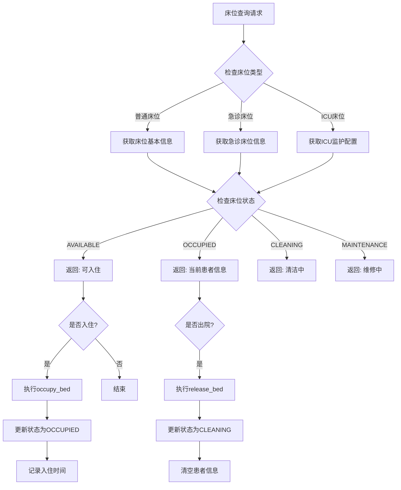
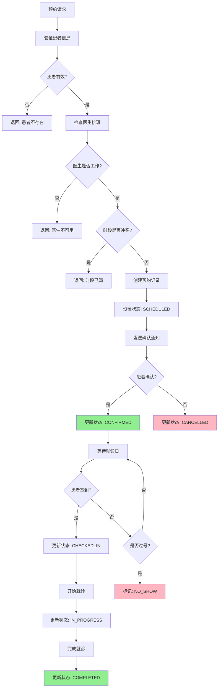
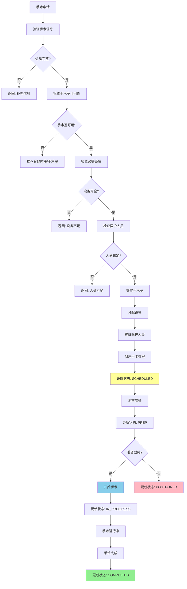
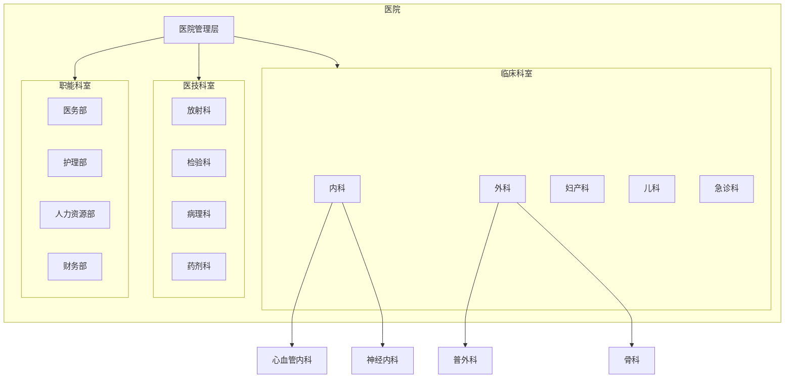
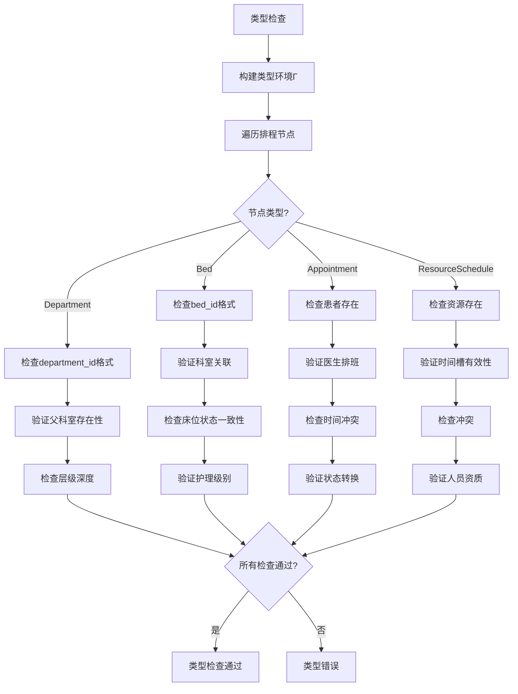
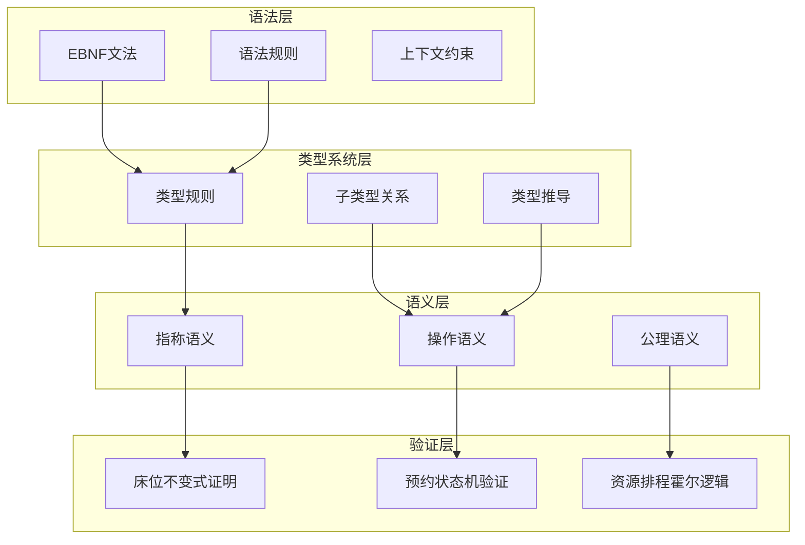

# 医院管理Schema形式语法与语义分析视图

**版本**: v1.0
**创建日期**: 2026-02-15
**标准**: HL7 FHIR R4, ISO 13606, GB/T 21715-2021

---

## 📑 目录

- [医院管理Schema形式语法与语义分析视图](#医院管理schema形式语法与语义分析视图)
  - [📑 目录](#-目录)
  - [1. 形式文法定义](#1-形式文法定义)
    - [1.1 EBNF文法](#11-ebnf文法)
      - [1.1.1 科室实体文法](#111-科室实体文法)
      - [1.1.2 床位实体文法](#112-床位实体文法)
      - [1.1.3 预约实体文法](#113-预约实体文法)
      - [1.1.4 资源排程实体文法](#114-资源排程实体文法)
    - [1.2 语法规则](#12-语法规则)
      - [1.2.1 科室层级约束规则](#121-科室层级约束规则)
      - [1.2.2 床位状态约束规则](#122-床位状态约束规则)
      - [1.2.3 预约约束规则](#123-预约约束规则)
      - [1.2.4 资源排程约束规则](#124-资源排程约束规则)
  - [2. 形式语义定义](#2-形式语义定义)
    - [2.1 指称语义 (Denotational Semantics)](#21-指称语义-denotational-semantics)
      - [2.1.1 语义域定义](#211-语义域定义)
      - [2.1.2 科室语义](#212-科室语义)
      - [2.1.3 床位语义](#213-床位语义)
      - [2.1.4 预约语义](#214-预约语义)
      - [2.1.5 资源排程语义](#215-资源排程语义)
    - [2.2 操作语义 (Operational Semantics)](#22-操作语义-operational-semantics)
      - [2.2.1 大步语义 (Big-Step Semantics)](#221-大步语义-big-step-semantics)
      - [2.2.2 小步语义 (Small-Step Semantics)](#222-小步语义-small-step-semantics)
      - [2.2.3 预约状态机语义](#223-预约状态机语义)
    - [2.3 公理语义 (Axiomatic Semantics)](#23-公理语义-axiomatic-semantics)
      - [2.3.1 Hoare三元组](#231-hoare三元组)
      - [2.3.2 床位操作推理规则](#232-床位操作推理规则)
      - [2.3.3 预约操作霍尔三元组](#233-预约操作霍尔三元组)
      - [2.3.4 床位状态不变式证明](#234-床位状态不变式证明)
      - [2.3.5 预约状态转换完整性证明](#235-预约状态转换完整性证明)
  - [3. 类型系统](#3-类型系统)
    - [3.1 类型规则](#31-类型规则)
    - [3.2 类型运算规则](#32-类型运算规则)
    - [3.3 子类型关系](#33-子类型关系)
    - [3.4 多态与类型约束](#34-多态与类型约束)
  - [4. 语义等价性](#4-语义等价性)
    - [4.1 程序等价定义](#41-程序等价定义)
    - [4.2 等价变换规则](#42-等价变换规则)
    - [4.3 资源排程等价](#43-资源排程等价)
  - [5. Mermaid可视化](#5-mermaid可视化)
    - [5.1 床位管理流程](#51-床位管理流程)
    - [5.2 预约处理语义流程](#52-预约处理语义流程)
    - [5.3 手术排程流程](#53-手术排程流程)
    - [5.4 科室层级结构](#54-科室层级结构)
    - [5.5 资源排程类型检查流程](#55-资源排程类型检查流程)
    - [5.6 形式语义层级图](#56-形式语义层级图)

---

## 1. 形式文法定义

### 1.1 EBNF文法

#### 1.1.1 科室实体文法

```ebnf
(* 医院管理核心实体 - 科室定义 *)

Department ::= ClinicalDepartment | MedicalTechDepartment | AdministrativeDepartment

ClinicalDepartment ::= '{'
    '"department_id"' ':' DepartmentId ','
    '"department_name"' ':' String(100) ','
    '"department_type"' ':' '"CLINICAL"' ','
    '"clinical_type"' ':' ClinicalType ','
    '"parent_department"' ':' DepartmentId? ','
    '"head_physician"' ':' PhysicianId ','
    '"bed_count"' ':' Integer ','
    '"location"' ':' Location ','
    '"contact_phone"' ':' PhoneNumber ','
    '"specialties"' ':' SpecialtyList ','
    '"status"' ':' DepartmentStatus ','
    '"operating_hours"' ':' OperatingHours
'}'

MedicalTechDepartment ::= '{'
    '"department_id"' ':' DepartmentId ','
    '"department_name"' ':' String(100) ','
    '"department_type"' ':' '"MEDICAL_TECH"' ','
    '"tech_type"' ':' TechType ','
    '"parent_department"' ':' DepartmentId? ','
    '"head_technician"' ':' StaffId ','
    '"equipment_count"' ':' Integer ','
    '"location"' ':' Location ','
    '"services"' ':' ServiceList ','
    '"status"' ':' DepartmentStatus ','
    '"turnaround_time"' ':' Duration
'}'

AdministrativeDepartment ::= '{'
    '"department_id"' ':' DepartmentId ','
    '"department_name"' ':' String(100) ','
    '"department_type"' ':' '"ADMINISTRATIVE"' ','
    '"admin_type"' ':' AdminType ','
    '"parent_department"' ':' DepartmentId? ','
    '"head_officer"' ':' StaffId ','
    '"location"' ':' Location ','
    '"contact_phone"' ':' PhoneNumber ','
    '"functions"' ':' FunctionList ','
    '"status"' ':' DepartmentStatus
'}'

(* 科室类型枚举 *)
ClinicalType ::= 'INTERNAL_MEDICINE' | 'SURGERY' | 'PEDIATRICS' | 'OBSTETRICS_GYNECOLOGY'
               | 'ORTHOPEDICS' | 'NEUROLOGY' | 'CARDIOLOGY' | 'ONCOLOGY' | 'EMERGENCY'
               | 'DERMATOLOGY' | 'OPHTHALMOLOGY' | 'ENT' | 'DENTISTRY' | 'PSYCHIATRY'

TechType ::= 'RADIOLOGY' | 'LABORATORY' | 'PATHOLOGY' | 'PHARMACY' | 'REHABILITATION'
           | 'ANESTHESIOLOGY' | 'NUTRITION' | 'BLOOD_BANK' | 'STERILIZATION'

AdminType ::= 'MEDICAL_AFFAIRS' | 'NURSING' | 'HUMAN_RESOURCES' | 'FINANCE'
            | 'INFORMATION_TECHNOLOGY' | 'GENERAL_AFFAIRS' | 'QUALITY_CONTROL'
            | 'PATIENT_SERVICES' | 'SECURITY'

DepartmentStatus ::= 'ACTIVE' | 'INACTIVE' | 'UNDER_CONSTRUCTION' | 'CLOSED'
SpecialtyList ::= List<Specialty>
ServiceList ::= List<String>
FunctionList ::= List<String>

(* 标识符格式 *)
DepartmentId ::= 'DEPT' [0-9]{6}
PhysicianId ::= 'PHY' [0-9]{8}
StaffId ::= 'STF' [0-9]{8}
Specialty ::= String(50)
Location ::= String(200)
OperatingHours ::= String(50)
Duration ::= [0-9]+ ('MIN' | 'HOUR' | 'DAY')
```

#### 1.1.2 床位实体文法

```ebnf
(* 床位管理定义 - 床位状态、类型、护理级别 *)

Bed ::= InpatientBed | EmergencyBed | ICUBed | ObservationBed

InpatientBed ::= '{'
    '"bed_id"' ':' BedId ','
    '"bed_number"' ':' String(10) ','
    '"department_id"' ':' DepartmentId ','
    '"ward_id"' ':' WardId ','
    '"room_id"' ':' RoomId ','
    '"bed_type"' ':' BedType ','
    '"bed_status"' ':' BedStatus ','
    '"care_level"' ':' CareLevel ','
    '"current_patient"' ':' PatientId? ','
    '"admission_date"' ':' DateTime? ','
    '"features"' ':' BedFeatureList ','
    '"daily_rate"' ':' MonetaryAmount
'}'

EmergencyBed ::= '{'
    '"bed_id"' ':' BedId ','
    '"bed_number"' ':' String(10) ','
    '"department_id"' ':' DepartmentId ','
    '"bed_type"' ':' '"EMERGENCY"' ','
    '"bed_status"' ':' EmergencyBedStatus ','
    '"priority_level"' ':' PriorityLevel ','
    '"current_patient"' ':' PatientId? ','
    '"arrival_time"' ':' DateTime? ','
    '"triage_category"' ':' TriageCategory? ','
    '"equipment"' ':' EmergencyEquipmentList
'}'

ICUBed ::= '{'
    '"bed_id"' ':' BedId ','
    '"bed_number"' ':' String(10) ','
    '"department_id"' ':' DepartmentId ','
    '"icu_type"' ':' ICUType ','
    '"bed_status"' ':' BedStatus ','
    '"care_level"' ':' '"CRITICAL"' ','
    '"current_patient"' ':' PatientId? ','
    '"monitoring_devices"' ':' DeviceList ','
    '"life_support"' ':' LifeSupportList ','
    '"is_isolation"' ':' Boolean
'}'

(* 床位类型枚举 *)
BedType ::= 'STANDARD' | 'PRIVATE' | 'SEMI_PRIVATE' | 'VIP' | 'ISOLATION'
          | 'MATERNITY' | 'PEDIATRIC' | 'BARRIER_FREE'

BedStatus ::= 'AVAILABLE' | 'OCCUPIED' | 'RESERVED' | 'MAINTENANCE'
            | 'CLEANING' | 'BLOCKED'

EmergencyBedStatus ::= 'AVAILABLE' | 'OCCUPIED' | 'STANDBY' | 'CLEANING'

CareLevel ::= 'GENERAL' | 'SECONDARY' | 'TERTIARY' | 'INTENSIVE' | 'CRITICAL'

PriorityLevel ::= 'URGENT' | 'HIGH' | 'MEDIUM' | 'LOW'
TriageCategory ::= 'RESUSCITATION' | 'EMERGENT' | 'URGENT' | 'LESS_URGENT' | 'NON_URGENT'
ICUType ::= 'GENERAL_ICU' | 'CARDIAC_ICU' | 'NEURO_ICU' | 'PEDS_ICU'
          | 'NEONATAL_ICU' | 'BURN_ICU' | 'SURGICAL_ICU'

(* 标识符和类型 *)
BedId ::= 'BED' [0-9]{8}
WardId ::= 'WRD' [0-9]{6}
RoomId ::= 'RM' [0-9]{6}
PatientId ::= 'PAT' [0-9]{10}
BedFeatureList ::= List<BedFeature>
BedFeature ::= 'OXYGEN' | 'SUCTION' | 'CALL_BUTTON' | 'ELECTRIC' | 'WEIGHING'
EmergencyEquipmentList ::= List<String>
DeviceList ::= List<DeviceId>
LifeSupportList ::= List<String>
DeviceId ::= 'DEV' [0-9]{8}
MonetaryAmount ::= '[0-9]+(\.[0-9]{2})?'
Boolean ::= 'true' | 'false'
```

#### 1.1.3 预约实体文法

```ebnf
(* 预约管理定义 - 门诊预约、检查预约、手术排程 *)

Appointment ::= OutpatientAppointment | ExaminationAppointment | SurgerySchedule

OutpatientAppointment ::= '{'
    '"appointment_id"' ':' AppointmentId ','
    '"appointment_type"' ':' '"OUTPATIENT"' ','
    '"patient_id"' ':' PatientId ','
    '"department_id"' ':' DepartmentId ','
    '"physician_id"' ':' PhysicianId ','
    '"appointment_date"' ':' Date ','
    '"time_slot"' ':' TimeSlot ','
    '"status"' ':' AppointmentStatus ','
    '"chief_complaint"' ':' String(500) ','
    '"priority"' ':' PriorityType ','
    '"created_at"' ':' DateTime ','
    ['"checked_in_at"' ':' DateTime?]
    ['"consultation_started_at"' ':' DateTime?]
    ['"consultation_ended_at"' ':' DateTime?]
    ['"follow_up_required"' ':' Boolean]
'}'

ExaminationAppointment ::= '{'
    '"appointment_id"' ':' AppointmentId ','
    '"appointment_type"' ':' '"EXAMINATION"' ','
    '"patient_id"' ':' PatientId ','
    '"referring_department"' ':' DepartmentId ','
    '"exam_department_id"' ':' DepartmentId ','
    '"exam_type"' ':' ExamType ','
    '"exam_items"' ':' ExamItemList ','
    '"scheduled_datetime"' ':' DateTime ','
    '"estimated_duration"' ':' Duration ','
    '"preparation_instructions"' ':' String(1000) ','
    '"status"' ':' AppointmentStatus ','
    '"fasting_required"' ':' Boolean ','
    '"contraindications"' ':' ContraindicationList?
'}'

SurgerySchedule ::= '{'
    '"schedule_id"' ':' ScheduleId ','
    '"surgery_type"' ':' SurgeryType ','
    '"patient_id"' ':' PatientId ','
    '"operating_room_id"' ':' RoomId ','
    '"scheduled_date"' ':' Date ','
    '"start_time"' ':' Time ','
    '"estimated_duration"' ':' Duration ','
    '"surgeon_id"' ':' PhysicianId ','
    '"assistant_surgeons"' ':' PhysicianIdList ','
    '"anesthesiologist_id"' ':' PhysicianId ','
    '"anesthesia_type"' ':' AnesthesiaType ','
    '"status"' ':' SurgeryStatus ','
    '"priority"' ':' SurgeryPriority ','
    '"pre_op_diagnosis"' ':' String(500) ','
    '"procedure_codes"' ': ProcedureCodeList ','
    ['"actual_start_time"' ':' DateTime?]
    ['"actual_end_time"' ':' DateTime?]
'}'

(* 预约状态枚举 *)
AppointmentStatus ::= 'SCHEDULED' | 'CONFIRMED' | 'CHECKED_IN' | 'IN_PROGRESS'
                    | 'COMPLETED' | 'CANCELLED' | 'NO_SHOW' | 'RESCHEDULED'

SurgeryStatus ::= 'SCHEDULED' | 'CONFIRMED' | 'PREP' | 'IN_PROGRESS'
                | 'COMPLETED' | 'CANCELLED' | 'POSTPONED'

PriorityType ::= 'ROUTINE' | 'URGENT' | 'EMERGENCY'
SurgeryPriority ::= 'ELECTIVE' | 'URGENT' | 'EMERGENT' | 'TRIAGE'

(* 检查类型 *)
ExamType ::= 'IMAGING' | 'LABORATORY' | 'ENDOSCOPY' | 'FUNCTIONAL' | 'PATHOLOGY'

(* 麻醉类型 *)
AnesthesiaType ::= 'GENERAL' | 'SPINAL' | 'EPIDURAL' | 'REGIONAL' | 'LOCAL' | 'SEDATION'

(* 时间槽 *)
TimeSlot ::= MorningSlot | AfternoonSlot | EveningSlot
MorningSlot ::= '08:00' | '08:30' | '09:00' | '09:30' | '10:00' | '10:30' | '11:00' | '11:30'
AfternoonSlot ::= '14:00' | '14:30' | '15:00' | '15:30' | '16:00' | '16:30' | '17:00'
EveningSlot ::= '18:00' | '18:30' | '19:00' | '19:30' | '20:00'

(* 标识符 *)
AppointmentId ::= 'APT' [0-9]{10}
ScheduleId ::= 'SCH' [0-9]{10}
ProcedureCode ::= '[A-Z][0-9]{2}\.[0-9]{1,2}'  (* ICD-9-CM 或 CPT 格式 *)
ExamItemList ::= List<ExamItem>
ExamItem ::= '{'
    '"item_code"' ':' String(20) ','
    '"item_name"' ':' String(100) ','
    '"body_site"' ':' String(50)? ','
    '"clinical_indication"' ':' String(200)?
'}'
PhysicianIdList ::= List<PhysicianId>
ProcedureCodeList ::= List<ProcedureCode>
ContraindicationList ::= List<String>
```

#### 1.1.4 资源排程实体文法

```ebnf
(* 资源排程定义 - 手术室、设备、人员排班 *)

ResourceSchedule ::= OperatingRoomSchedule | EquipmentSchedule | StaffSchedule

OperatingRoomSchedule ::= '{'
    '"schedule_id"' ':' ResourceScheduleId ','
    '"resource_type"' ':' '"OPERATING_ROOM"' ','
    '"resource_id"' ':' RoomId ','
    '"schedule_date"' ':' Date ','
    '"time_slots"' ':' ORTimeSlotList ','
    '"assigned_surgeries"' ':' SurgeryAssignmentList ','
    '"required_equipment"' ':' EquipmentRequirementList ','
    '"support_staff"' ':' StaffAssignmentList ','
    '"turnaround_time"' ':' Duration ','
    '"status"' ':' ResourceStatus
'}'

EquipmentSchedule ::= '{'
    '"schedule_id"' ':' ResourceScheduleId ','
    '"resource_type"' ':' '"EQUIPMENT"' ','
    '"equipment_id"' ':' EquipmentId ','
    '"equipment_type"' ':' EquipmentType ','
    '"department_id"' ':' DepartmentId ','
    '"schedule_date"' ':' Date ','
    '"time_slots"' ':' EquipmentTimeSlotList ','
    '"assigned_appointments"' ':' AppointmentAssignmentList ','
    '"maintenance_window"' ':' TimeWindow ','
    '"availability"' ':' AvailabilityStatus
'}'

StaffSchedule ::= '{'
    '"schedule_id"' ':' ResourceScheduleId ','
    '"resource_type"' ':' '"STAFF"' ','
    '"staff_id"' ':' StaffId ','
    '"staff_role"' ':' StaffRole ','
    '"department_id"' ':' DepartmentId ','
    '"schedule_date"' ':' Date ','
    '"shift_type"' ':' ShiftType ','
    '"shift_start"' ':' Time ','
    '"shift_end"' ':' Time ','
    '"assigned_duties"' ':' DutyAssignmentList ','
    '"break_times"' ':' TimeWindowList ','
    '"overtime_hours"' ':' Decimal ','
    '"status"' ':' ScheduleStatus
'}'

(* 手术室时间槽 *)
ORTimeSlot ::= '{'
    '"slot_id"' ':' String(20) ','
    '"start_time"' ':' Time ','
    '"end_time"' ':' Time ','
    '"status"' ':' SlotStatus ','
    '"assigned_surgery"' ':' ScheduleId?
'}'

(* 排程状态枚举 *)
ResourceStatus ::= 'FULLY_SCHEDULED' | 'PARTIALLY_AVAILABLE' | 'AVAILABLE' | 'MAINTENANCE'
AvailabilityStatus ::= 'AVAILABLE' | 'BOOKED' | 'MAINTENANCE' | 'OUT_OF_ORDER'
ScheduleStatus ::= 'CONFIRMED' | 'PENDING' | 'MODIFIED' | 'CANCELLED'
SlotStatus ::= 'AVAILABLE' | 'RESERVED' | 'OCCUPIED' | 'BLOCKED'

(* 设备类型 *)
EquipmentType ::= 'MRI' | 'CT' | 'XRAY' | 'ULTRASOUND' | 'MAMMOGRAPHY' | 'FLUOROSCOPY'
                | 'SURGICAL_LASER' | 'ROBOTIC_SYSTEM' | 'ANESTHESIA_MACHINE' | 'VENTILATOR'
                | 'DIALYSIS_MACHINE' | 'LINAC' | 'CATH_LAB'

(* 人员角色 *)
StaffRole ::= 'PHYSICIAN' | 'NURSE' | 'SURGEON' | 'ANESTHESIOLOGIST' | 'RADIOLOGIST'
            | 'TECHNICIAN' | 'PHARMACIST' | 'THERAPIST' | 'ADMINISTRATOR'

(* 班次类型 *)
ShiftType ::= 'DAY' | 'EVENING' | 'NIGHT' | 'ON_CALL' | 'WEEKEND' | 'HOLIDAY'

(* 标识符 *)
ResourceScheduleId ::= 'RSCH' [0-9]{10}
EquipmentId ::= 'EQP' [0-9]{8}
Time ::= '[0-9]{2}:[0-9]{2}'
TimeWindow ::= '{'
    '"start_time"' ':' Time ','
    '"end_time"' ':' Time
'}'
ORTimeSlotList ::= List<ORTimeSlot>
EquipmentTimeSlotList ::= List<TimeWindow>
SurgeryAssignmentList ::= List<ScheduleId>
EquipmentRequirementList ::= List<EquipmentId>
StaffAssignmentList ::= List<StaffId>
AppointmentAssignmentList ::= List<AppointmentId>
DutyAssignmentList ::= List<Duty>
Duty ::= 'SURGERY' | 'CONSULTATION' | 'EXAMINATION' | 'EMERGENCY' | 'ADMIN' | 'RESEARCH'
TimeWindowList ::= List<TimeWindow>
Decimal ::= '[0-9]+(\.[0-9]{1,2})?'
```

### 1.2 语法规则

#### 1.2.1 科室层级约束规则

```
约束1: 科室ID唯一性
  ∀d1, d2 ∈ Department :
    d1 ≠ d2 ⇒ department_id(d1) ≠ department_id(d2)

约束2: 父科室有效性
  ∀d ∈ Department :
    parent_department(d) ≠ ⊥ ⇒
      ∃p ∈ Department : department_id(p) = parent_department(d)

约束3: 科室层级深度限制
  ∀d ∈ Department :
    hierarchy_depth(d) ≤ 3

    where hierarchy_depth(d) =
      0 if parent_department(d) = ⊥
      1 + hierarchy_depth(parent(d)) otherwise

约束4: 临床科室床位数约束
  ∀d ∈ ClinicalDepartment :
    bed_count(d) ≥ 0 ∧ bed_count(d) ≤ MAX_BEDS_PER_DEPT
```

#### 1.2.2 床位状态约束规则

```
约束5: 床位状态一致性
  ∀b ∈ Bed :
    bed_status(b) = OCCUPIED ⇔ current_patient(b) ≠ ⊥

约束6: 床位占用时间有效性
  ∀b ∈ Bed :
    bed_status(b) = OCCUPIED ⇒
      admission_date(b) ≠ ⊥ ∧ admission_date(b) ≤ current_datetime()

约束7: ICU床位监护设备要求
  ∀b ∈ ICUBed :
    monitoring_devices(b) ≠ ∅ ∧ |monitoring_devices(b)| ≥ 3

约束8: 床位护理级别与科室匹配
  ∀b ∈ Bed, ∀d ∈ Department :
    department_id(b) = department_id(d) ∧
    d.department_type = 'ICU' ⇒
      care_level(b) ∈ {INTENSIVE, CRITICAL}
```

#### 1.2.3 预约约束规则

```
约束9: 预约时间唯一性
  ∀apt1, apt2 ∈ Appointment :
    apt1 ≠ apt2 ∧ physician_id(apt1) = physician_id(apt2) ⇒
      ¬time_overlap(apt1, apt2)

    where time_overlap(a1, a2) =
      a1.appointment_date = a2.appointment_date ∧
      a1.time_slot = a2.time_slot

约束10: 手术排程时间有效性
  ∀s ∈ SurgerySchedule :
    scheduled_date(s) ≥ current_date() ∧
    estimated_duration(s) > 0 ∧
    estimated_duration(s) ≤ MAX_SURGERY_DURATION

约束11: 检查预约准备时间
  ∀apt ∈ ExaminationAppointment :
    fasting_required(apt) = true ⇒
      scheduled_datetime(apt) - current_datetime() ≥ 8 hours

约束12: 预约状态转换有效性
  ∀apt ∈ Appointment :
    valid_transition(status(apt), new_status)

    where valid_transition 定义如下状态图：
    SCHEDULED → {CONFIRMED, CANCELLED}
    CONFIRMED → {CHECKED_IN, CANCELLED, NO_SHOW}
    CHECKED_IN → {IN_PROGRESS}
    IN_PROGRESS → {COMPLETED}
```

#### 1.2.4 资源排程约束规则

```
约束13: 手术室排程冲突检测
  ∀s1, s2 ∈ OperatingRoomSchedule :
    s1 ≠ s2 ∧ resource_id(s1) = resource_id(s2) ∧
    schedule_date(s1) = schedule_date(s2) ⇒
      ¬slot_overlap(s1.time_slots, s2.time_slots)

约束14: 人员排班工时限制
  ∀ss ∈ StaffSchedule :
    shift_duration(ss) ≤ MAX_SHIFT_HOURS ∧
    weekly_hours(staff_id(ss)) ≤ MAX_WEEKLY_HOURS

    where shift_duration(ss) = shift_end(ss) - shift_start(ss)

约束15: 设备维护窗口
  ∀es ∈ EquipmentSchedule :
    maintenance_window(es) ∩ assigned_time_slots(es) = ∅

约束16: 手术室必需人员配置
  ∀s ∈ SurgerySchedule :
    surgeon_id(s) ≠ ⊥ ∧ anesthesiologist_id(s) ≠ ⊥
```

---

## 2. 形式语义定义

### 2.1 指称语义 (Denotational Semantics)

#### 2.1.1 语义域定义

```
D[HospitalSystem] : Environment → State → State

State = DepartmentState × BedState × AppointmentState × ResourceScheduleState

DepartmentState = DepartmentId → DepartmentValue
DepartmentValue = {
  department_name: String,
  department_type: DepartmentType,
  parent_department: DepartmentId?,
  head_staff: StaffId,
  bed_count: Integer,
  location: Location,
  specialties: List<Specialty>,
  status: DepartmentStatus,
  children: List<DepartmentId>
}

BedState = BedId → BedValue
BedValue = {
  bed_number: String,
  department_id: DepartmentId,
  ward_id: WardId,
  room_id: RoomId,
  bed_type: BedType,
  bed_status: BedStatus,
  care_level: CareLevel,
  current_patient: PatientId?,
  admission_date: DateTime?,
  features: List<BedFeature>,
  daily_rate: Money
}

AppointmentState = AppointmentId → AppointmentValue
AppointmentValue = {
  appointment_type: AppointmentType,
  patient_id: PatientId,
  department_id: DepartmentId,
  physician_id: PhysicianId,
  appointment_date: Date,
  time_slot: TimeSlot,
  status: AppointmentStatus,
  priority: PriorityType,
  created_at: DateTime,
  checked_in_at: DateTime?,
  completed_at: DateTime?
}

ResourceScheduleState = ResourceScheduleId → ResourceScheduleValue
ResourceScheduleValue = {
  resource_type: ResourceType,
  resource_id: ResourceId,
  schedule_date: Date,
  time_slots: List<TimeSlot>,
  assignments: List<Assignment>,
  status: ResourceStatus
}

Money = Decimal(10,2)
Date = ℕ  (* 年月日编码 *)
DateTime = ℕ  (* Unix时间戳 *)
```

#### 2.1.2 科室语义

```
(* 科室层级查询语义 *)
E[dept.hierarchy_level] env sto =
  let d = lookup_department(sto, env.department_id) in
  calculate_hierarchy_level(d, sto)

(* 科室床位使用率语义 *)
E[dept.bed_occupancy_rate] env sto =
  let d = lookup_department(sto, env.department_id) in
  let total_beds = bed_count(d) in
  let occupied_beds = count_occupied_beds(sto, env.department_id) in
  occupied_beds / total_beds

(* 科室状态转换语义 *)
S[dept.status := new_status] env sto =
  let d = lookup_department(sto, env.department_id) in
  if valid_dept_status_transition(d.status, new_status)
  then sto[department ↦ d[status ↦ new_status]]
  else error "Invalid department status transition"
```

#### 2.1.3 床位语义

```
(* 床位可用性检查语义 *)
E[bed.is_available] env sto =
  let b = lookup_bed(sto, env.bed_id) in
  b.bed_status = AVAILABLE

(* 床位占用语义 *)
S[occupy_bed(bed, patient)] env sto =
  let b = lookup_bed(sto, bed.bed_id) in
  if b.bed_status = AVAILABLE
  then sto[bed ↦ b[bed_status ↦ OCCUPIED,
                   current_patient ↦ patient.patient_id,
                   admission_date ↦ now()]]
  else error "Bed not available"

(* 床位释放语义 *)
S[release_bed(bed)] env sto =
  let b = lookup_bed(sto, bed.bed_id) in
  if b.bed_status = OCCUPIED
  then sto[bed ↦ b[bed_status ↦ CLEANING,
                   current_patient ↦ ⊥,
                   admission_date ↦ ⊥]]
  else error "Bed not occupied"

(* 床位状态转换语义 *)
S[bed.status := new_status] env sto =
  let b = lookup_bed(sto, env.bed_id) in
  if valid_bed_status_transition(b.bed_status, new_status)
  then sto[bed ↦ b[bed_status ↦ new_status]]
  else error "Invalid bed status transition"
```

#### 2.1.4 预约语义

```
(* 预约时间有效性检查 *)
E[apt.is_valid_time] env sto =
  let apt = lookup_appointment(sto, env.appointment_id) in
  let dept = lookup_department(sto, apt.department_id) in
  let work_hours = get_operating_hours(dept, apt.appointment_date) in
  apt.time_slot ∈ work_hours

(* 预约创建语义 *)
S[create_appointment(apt)] env sto =
  let physician = lookup_physician(sto, apt.physician_id) in
  if has_schedule_conflict(sto, apt)
  then error "Schedule conflict detected"
  else if ¬is_working_day(apt.appointment_date, physician)
  then error "Not a working day for physician"
  else sto[appointment ↦ apt[status ↦ SCHEDULED, created_at ↦ now()]]

(* 预约确认语义 *)
S[confirm_appointment(apt_id)] env sto =
  let apt = lookup_appointment(sto, apt_id) in
  if apt.status = SCHEDULED
  then sto[appointment ↦ apt[status ↦ CONFIRMED]]
  else error "Cannot confirm appointment with status: " + apt.status

(* 预约签到语义 *)
S[check_in_appointment(apt_id)] env sto =
  let apt = lookup_appointment(sto, apt_id) in
  if apt.status = CONFIRMED ∧ apt.appointment_date = today()
  then sto[appointment ↦ apt[status ↦ CHECKED_IN, checked_in_at ↦ now()]]
  else error "Cannot check in appointment"
```

#### 2.1.5 资源排程语义

```
(* 资源可用性检查 *)
E[resource.is_available(time_slot)] env sto =
  let rs = lookup_resource_schedule(sto, env.schedule_id) in
  time_slot ∉ get_occupied_slots(rs)

(* 手术室排程语义 *)
S[schedule_surgery(or_schedule, surgery)] env sto =
  let ors = lookup_or_schedule(sto, or_schedule.schedule_id) in
  if has_or_conflict(ors, surgery)
  then error "Operating room conflict"
  else if ¬has_required_equipment(ors, surgery)
  then error "Required equipment not available"
  else sto[or_schedule ↦ add_surgery_assignment(ors, surgery)]

(* 人员排班语义 *)
S[assign_staff_shift(schedule)] env sto =
  let ss = lookup_staff_schedule(sto, schedule.schedule_id) in
  if exceeds_weekly_hours(staff_id(ss), shift_duration(ss))
  then error "Exceeds maximum weekly working hours"
  else if has_staff_conflict(sto, ss)
  then error "Staff schedule conflict"
  else sto[staff_schedule ↦ ss]
```

### 2.2 操作语义 (Operational Semantics)

#### 2.2.1 大步语义 (Big-Step Semantics)

```
配置: ⟨Expression, State⟩ ⇓ Value
      ⟨Statement, State⟩ ⇓ State'

(* 床位查询 *)
⟨bed.bed_status, σ⟩ ⇓ σ(bed).bed_status                          (E-BedStatus)

(* 床位可用性检查 *)
⟨bed.is_available, σ⟩ ⇓ true                                      (E-AvailableTrue)
  where σ(bed).bed_status = AVAILABLE

⟨bed.is_available, σ⟩ ⇓ false                                     (E-AvailableFalse)
  where σ(bed).bed_status ≠ AVAILABLE

(* 床位占用操作 *)
⟨occupy_bed(bed, patient), σ⟩ ⇓ σ[bed.bed_status ↦ OCCUPIED,
                                   bed.current_patient ↦ patient]   (S-OccupyBed)
  where σ(bed).bed_status = AVAILABLE

(* 床位释放操作 *)
⟨release_bed(bed), σ⟩ ⇓ σ[bed.bed_status ↦ CLEANING,
                          bed.current_patient ↦ ⊥]                (S-ReleaseBed)
  where σ(bed).bed_status = OCCUPIED

(* 床位状态转换 *)
⟨bed.status := CLEANING, σ⟩ ⇓ σ[bed.status ↦ CLEANING]           (S-SetCleaning)
  where σ(bed).status ∈ {OCCUPIED, MAINTENANCE}

⟨bed.status := AVAILABLE, σ⟩ ⇓ σ[bed.status ↦ AVAILABLE]         (S-SetAvailable)
  where σ(bed).status = CLEANING

(* 预约创建 *)
⟨create_appointment(apt), σ⟩ ⇓ σ[appointment ↦ apt]              (S-CreateApt)
  where ¬has_conflict(apt, σ)

(* 预约确认 *)
⟨confirm_appointment(apt), σ⟩ ⇓ σ[apt.status ↦ CONFIRMED]        (S-ConfirmApt)
  where σ(apt).status = SCHEDULED

(* 预约签到 *)
⟨check_in(apt), σ⟩ ⇓ σ[apt.status ↦ CHECKED_IN]                  (S-CheckIn)
  where σ(apt).status = CONFIRMED ∧ σ(apt).appointment_date = today()

(* 预约完成 *)
⟨complete_appointment(apt), σ⟩ ⇓ σ[apt.status ↦ COMPLETED,
                                   apt.completed_at ↦ now()]       (S-CompleteApt)
  where σ(apt).status = IN_PROGRESS
```

#### 2.2.2 小步语义 (Small-Step Semantics)

```
配置: ⟨Statement, State⟩ → ⟨Statement', State'⟩
      或 ⟨Statement, State⟩ → State'  (终止)

(* 科室状态转换 *)
⟨dept.status := ACTIVE, σ⟩ → σ[dept.status ↦ ACTIVE]             (S-DeptActive)

⟨dept.status := INACTIVE, σ⟩ → σ[dept.status ↦ INACTIVE]         (S-DeptInactive)
  where σ(dept).bed_occupancy = 0

(* 手术排程步骤 *)
⟨schedule_surgery(sch), σ⟩ → ⟨validate_surgery(sch) ; assign_or(sch) ; confirm_surgery(sch), σ⟩  (S-SurgeryStart)

⟨validate_surgery(sch), σ⟩ → σ                                    (S-ValidateSurgeryOk)
  where valid_patient(sch.patient) ∧ valid_surgeon(sch.surgeon)

⟨validate_surgery(sch), σ⟩ → error                                (S-ValidateSurgeryFail)
  where ¬valid_patient(sch.patient) ∨ ¬valid_surgeon(sch.surgeon)

(* 资源排程步骤 *)
⟨assign_equipment(eq, apt), σ⟩ → σ[equipment ↦ eq[assigned_appointments ↦ eq.assigned_appointments ∪ {apt}]]  (S-AssignEquip)
  where ¬has_equipment_conflict(eq, apt, σ)

(* 顺序执行 *)
⟨skip ; s, σ⟩ → ⟨s, σ⟩                                           (S-Seq-Skip)

⟨s1 ; s2, σ⟩ → ⟨s1' ; s2, σ'⟩                                    (S-Seq-Step)
  when ⟨s1, σ⟩ → ⟨s1', σ'⟩

(* 条件执行 *)
⟨IF bed.is_available THEN occupy ELSE reject, σ⟩ → ⟨occupy, σ⟩   (S-IfAvailable)
  when σ(bed).bed_status = AVAILABLE

⟨IF bed.is_available THEN occupy ELSE reject, σ⟩ → ⟨reject, σ⟩   (S-IfNotAvailable)
  when σ(bed).bed_status ≠ AVAILABLE
```

#### 2.2.3 预约状态机语义

```
(* 预约状态转移规则 *)

⟨apt.status, σ⟩ → ⟨SCHEDULED, σ⟩                                 (Apt-Init)

⟨create(apt), σ⟩ → ⟨SCHEDULED, σ[apt ↦ new_appointment]⟩        (Apt-Create)

⟨confirm(apt), σ⟩ → ⟨CONFIRMED, σ⟩                               (Apt-Confirm)
  when σ(apt).status = SCHEDULED

⟨check_in(apt), σ⟩ → ⟨CHECKED_IN, σ⟩                             (Apt-CheckIn)
  when σ(apt).status = CONFIRMED

⟨start_consultation(apt), σ⟩ → ⟨IN_PROGRESS, σ⟩                  (Apt-Start)
  when σ(apt).status = CHECKED_IN

⟨complete(apt), σ⟩ → ⟨COMPLETED, σ⟩                              (Apt-Complete)
  when σ(apt).status = IN_PROGRESS

⟨cancel(apt), σ⟩ → ⟨CANCELLED, σ⟩                                (Apt-Cancel)
  when σ(apt).status ∈ {SCHEDULED, CONFIRMED}

⟨no_show(apt), σ⟩ → ⟨NO_SHOW, σ⟩                                 (Apt-NoShow)
  when σ(apt).status = CONFIRMED ∧ current_time() > appointment_time(apt) + GRACE_PERIOD
```

### 2.3 公理语义 (Axiomatic Semantics)

#### 2.3.1 Hoare三元组

```
{P} S {Q}

含义: 如果前置条件P在执行语句S前成立，
      且S终止，
      则后置条件Q在S执行后成立。
```

#### 2.3.2 床位操作推理规则

```
(* 床位状态不变式 *)
{bed.bed_status = S ∧ bed.current_patient = P}
  any_readonly_operation(bed)
{bed.bed_status = S ∧ bed.current_patient = P}

(* 床位占用公理 *)
{bed.bed_status = AVAILABLE ∧ bed.current_patient = ⊥}
  occupy_bed(bed, patient)
{bed.bed_status = OCCUPIED ∧ bed.current_patient = patient.patient_id}
  (Axiom-OccupyBed)

(* 床位释放公理 *)
{bed.bed_status = OCCUPIED ∧ bed.current_patient = P}
  release_bed(bed)
{bed.bed_status = CLEANING ∧ bed.current_patient = ⊥}
  (Axiom-ReleaseBed)

(* 床位状态转换公理 *)
{bed.bed_status = S_old ∧ valid_bed_transition(S_old, S_new)}
  bed.status := S_new
{bed.bed_status = S_new}
  (Axiom-BedStatusChange)

(* 床位护理级别设置公理 *)
{bed.care_level = CL_old}
  set_care_level(bed, CL_new)
{bed.care_level = CL_new}
  (Axiom-SetCareLevel)
```

#### 2.3.3 预约操作霍尔三元组

```
(* 预约创建规则 *)
{¬has_conflict(apt, σ)}
  create_appointment(apt)
{appointment_exists(apt) ∧ apt.status = SCHEDULED}
  (Rule-CreateApt)

(* 预约确认规则 *)
{apt.status = SCHEDULED}
  confirm_appointment(apt)
{apt.status = CONFIRMED}
  (Rule-ConfirmApt)

(* 预约签到规则 *)
{apt.status = CONFIRMED ∧ apt.appointment_date = today()}
  check_in_appointment(apt)
{apt.status = CHECKED_IN ∧ apt.checked_in_at ≠ ⊥}
  (Rule-CheckInApt)

(* 预约完成规则 *)
{apt.status = IN_PROGRESS}
  complete_appointment(apt)
{apt.status = COMPLETED ∧ apt.completed_at ≠ ⊥}
  (Rule-CompleteApt)

(* 预约取消规则 *)
{apt.status ∈ {SCHEDULED, CONFIRMED}}
  cancel_appointment(apt)
{apt.status = CANCELLED}
  (Rule-CancelApt)
```

#### 2.3.4 床位状态不变式证明

```
不变式 I: bed.bed_status ∈ {AVAILABLE, OCCUPIED, RESERVED, MAINTENANCE, CLEANING, BLOCKED} ∧
          (bed.bed_status = OCCUPIED ↔ bed.current_patient ≠ ⊥) ∧
          (bed.bed_status = AVAILABLE → bed.current_patient = ⊥) ∧
          (bed.admission_date ≠ ⊥ → bed.bed_status = OCCUPIED)

证明:

1. 初始状态:
   新床位创建时 bed_status = AVAILABLE, current_patient = ⊥, admission_date = ⊥
   ⇒ I 成立

2. 保持性:

   情况1: occupy_bed(bed, patient)
   {bed_status = AVAILABLE, current_patient = ⊥}
   occupy_bed(bed, patient)
   {bed_status = OCCUPIED, current_patient = patient_id, admission_date = now()}

   验证:
   - bed_status ∈ 有效状态集合 ✓
   - bed_status = OCCUPIED ↔ current_patient ≠ ⊥  (patient_id ≠ ⊥) ✓
   - 其他条件保持 ✓

   情况2: release_bed(bed)
   {bed_status = OCCUPIED, current_patient = P, admission_date = T}
   release_bed(bed)
   {bed_status = CLEANING, current_patient = ⊥, admission_date = ⊥}

   验证:
   - bed_status ∈ 有效状态集合 ✓
   - bed_status ≠ OCCUPIED → current_patient = ⊥ ✓
   - 其他条件保持 ✓

   情况3: bed.status := AVAILABLE (从 CLEANING)
   {bed_status = CLEANING, current_patient = ⊥}
   bed.status := AVAILABLE
   {bed_status = AVAILABLE, current_patient = ⊥}

   验证:
   - bed_status ∈ 有效状态集合 ✓
   - bed_status = AVAILABLE → current_patient = ⊥ ✓

3. 结论: I 是不变式 ∎
```

#### 2.3.5 预约状态转换完整性证明

```
定理: 所有预约状态转换都满足有效状态机规则

∀apt ∈ Appointment:
  状态转换 transition(apt, new_status) 满足:
  valid_appointment_transition(current_status(apt), new_status) = true

证明:

有效状态转换定义:
  SCHEDULED → {CONFIRMED, CANCELLED}
  CONFIRMED → {CHECKED_IN, CANCELLED, NO_SHOW}
  CHECKED_IN → {IN_PROGRESS}
  IN_PROGRESS → {COMPLETED}
  COMPLETED → {}  (终态)
  CANCELLED → {}  (终态)
  NO_SHOW → {}    (终态)

对于每个操作:
1. create_appointment: SCHEDULED (初始状态) ✓
2. confirm_appointment: SCHEDULED → CONFIRMED ✓
3. check_in_appointment: CONFIRMED → CHECKED_IN ✓
4. start_consultation: CHECKED_IN → IN_PROGRESS ✓
5. complete_appointment: IN_PROGRESS → COMPLETED ✓
6. cancel_appointment: {SCHEDULED, CONFIRMED} → CANCELLED ✓
7. mark_no_show: CONFIRMED → NO_SHOW ✓

所有可能的状态转换都在有效转换集合内。
因此，系统保证预约状态转换的正确性。 ∎
```

---

## 3. 类型系统

### 3.1 类型规则

```
(* 基础类型 *)
Γ ⊢ id : DepartmentId    if id ∈ DEPT[0-9]{6}                    (T-DepartmentId)

Γ ⊢ id : BedId           if id ∈ BED[0-9]{8}                      (T-BedId)

Γ ⊢ id : PatientId       if id ∈ PAT[0-9]{10}                     (T-PatientId)

Γ ⊢ id : PhysicianId     if id ∈ PHY[0-9]{8}                      (T-PhysicianId)

Γ ⊢ n : Integer          if n ≥ 0 ∧ n ≤ MAX_BED_COUNT             (T-BedCount)

Γ ⊢ s : DepartmentStatus if s ∈ {ACTIVE, INACTIVE, UNDER_CONSTRUCTION, CLOSED}  (T-DeptStatus)

(* 科室类型 *)
Γ ⊢ d : ClinicalDepartment      if d.department_type = CLINICAL         (T-ClinicalDept)

Γ ⊢ d : MedicalTechDepartment   if d.department_type = MEDICAL_TECH     (T-TechDept)

Γ ⊢ d : AdministrativeDepartment if d.department_type = ADMINISTRATIVE  (T-AdminDept)

(* 床位类型 *)
Γ ⊢ b : InpatientBed    if b.bed_type ∈ {STANDARD, PRIVATE, SEMI_PRIVATE, VIP}  (T-InpatientBed)

Γ ⊢ b : EmergencyBed    if b.bed_type = EMERGENCY                      (T-EmergencyBed)

Γ ⊢ b : ICUBed          if b.icu_type ≠ ⊥                              (T-ICUBed)

(* 预约类型 *)
Γ ⊢ apt : OutpatientAppointment  if apt.appointment_type = OUTPATIENT   (T-OutpatientApt)

Γ ⊢ apt : ExaminationAppointment if apt.appointment_type = EXAMINATION  (T-ExamApt)

Γ ⊢ sch : SurgerySchedule        if sch.surgery_type ≠ ⊥                (T-SurgerySch)

(* 排程类型 *)
Γ ⊢ rs : OperatingRoomSchedule   if rs.resource_type = OPERATING_ROOM    (T-ORSchedule)

Γ ⊢ rs : EquipmentSchedule       if rs.resource_type = EQUIPMENT         (T-EquipSchedule)

Γ ⊢ rs : StaffSchedule           if rs.resource_type = STAFF             (T-StaffSchedule)
```

### 3.2 类型运算规则

```
(* 床位计数运算 *)
Γ ⊢ dept : ClinicalDepartment                                  (T-BedCount)
────────────────────────────────────────
Γ ⊢ dept.bed_count : Integer

(* 床位使用率计算 *)
Γ ⊢ dept : Department  Γ ⊢ occupied : Integer  Γ ⊢ total : Integer  (T-OccupancyRate)
────────────────────────────────────────
Γ ⊢ calculate_occupancy(occupied, total) : Percentage

(* 预约时间有效性检查 *)
Γ ⊢ apt : Appointment  Γ ⊢ date : Date  Γ ⊢ slot : TimeSlot      (T-ValidTime)
────────────────────────────────────────
Γ ⊢ is_valid_appointment_time(apt, date, slot) : Boolean

(* 科室层级检查 *)
Γ ⊢ dept : Department  Γ ⊢ parent : DepartmentId?                (T-Hierarchy)
────────────────────────────────────────
Γ ⊢ get_hierarchy_level(dept) : Integer

(* 资源冲突检查 *)
Γ ⊢ rs : ResourceSchedule  Γ ⊢ assignment : Assignment           (T-ConflictCheck)
────────────────────────────────────────
Γ ⊢ has_conflict(rs, assignment) : Boolean

(* 手术排程验证 *)
Γ ⊢ sch : SurgerySchedule                                        (T-ValidateSurgery)
────────────────────────────────────────
Γ ⊢ validate_surgery_schedule(sch) : ValidationResult
```

### 3.3 子类型关系

```
(* 科室类型层次 *)
Department
├── ClinicalDepartment
│   ├── InternalMedicine
│   ├── Surgery
│   ├── Pediatrics
│   ├── ObstetricsGynecology
│   ├── Cardiology
│   └── Neurology
├── MedicalTechDepartment
│   ├── Radiology
│   ├── Laboratory
│   ├── Pathology
│   └── Pharmacy
└── AdministrativeDepartment
    ├── MedicalAffairs
    ├── Nursing
    ├── HumanResources
    └── Finance

子类型规则:
InternalMedicine ≤ ClinicalDepartment ≤ Department
Radiology ≤ MedicalTechDepartment ≤ Department
MedicalAffairs ≤ AdministrativeDepartment ≤ Department

(* 床位类型层次 *)
Bed
├── InpatientBed
│   ├── StandardBed
│   ├── PrivateBed
│   └── VIPBed
├── EmergencyBed
├── ICUBed
│   ├── GeneralICU
│   ├── CardiacICU
│   └── NeuroICU
└── ObservationBed

子类型规则:
StandardBed ≤ InpatientBed ≤ Bed
GeneralICU ≤ ICUBed ≤ Bed

(* 预约类型层次 *)
Appointment
├── OutpatientAppointment
│   ├── RegularConsultation
│   ├── SpecialistConsultation
│   └── FollowUpConsultation
├── ExaminationAppointment
│   ├── ImagingAppointment
│   ├── LaboratoryAppointment
│   └── EndoscopyAppointment
└── SurgerySchedule
    ├── ElectiveSurgery
    ├── UrgentSurgery
    └── EmergencySurgery

子类型规则:
RegularConsultation ≤ OutpatientAppointment ≤ Appointment
ImagingAppointment ≤ ExaminationAppointment ≤ Appointment
ElectiveSurgery ≤ SurgerySchedule

(* 资源排程类型层次 *)
ResourceSchedule
├── OperatingRoomSchedule
├── EquipmentSchedule
│   ├── ImagingEquipmentSchedule
│   └── LabEquipmentSchedule
└── StaffSchedule
    ├── PhysicianSchedule
    ├── NurseSchedule
    └── TechnicianSchedule

子类型规则:
OperatingRoomSchedule ≤ ResourceSchedule
ImagingEquipmentSchedule ≤ EquipmentSchedule ≤ ResourceSchedule
PhysicianSchedule ≤ StaffSchedule ≤ ResourceSchedule
```

### 3.4 多态与类型约束

```
(* 通用床位查询 *)
∀β ≤ Bed. Γ ⊢ get_bed_status : β → BedStatus

(* 通用科室查询 *)
∀δ ≤ Department. Γ ⊢ get_bed_count : δ → Integer

(* 通用预约查询 *)
∀α ≤ Appointment. Γ ⊢ get_status : α → AppointmentStatus

(* 通用资源排程 *)
∀ρ ≤ ResourceSchedule. Γ ⊢ check_availability : ρ × TimeSlot → Boolean

(* 床位计数约束 *)
Γ ⊢ n : Integer  where 0 ≤ n ≤ MAX_BEDS_PER_DEPT

(* 护理级别约束 *)
Γ ⊢ cl : CareLevel  where cl ∈ {GENERAL, SECONDARY, TERTIARY, INTENSIVE, CRITICAL}

(* 排程时间约束 *)
Γ ⊢ t : Duration  where 0 < t ≤ MAX_SCHEDULE_DURATION

(* 人员工时约束 *)
Γ ⊢ hours : Decimal  where 0 ≤ hours ≤ MAX_WEEKLY_HOURS
```

---

## 4. 语义等价性

### 4.1 程序等价定义

```
定义: 两个医院管理操作O1和O2语义等价 (O1 ≡ O2) 当且仅当:
∀σ, σ' : ⟨O1, σ⟩ ⇓ σ' ⟺ ⟨O2, σ⟩ ⇓ σ'

定义: 两个排程序列S1和S2效果等价 (S1 ≈ S2) 当且仅当:
∀σ : final_state(⟨S1, σ⟩) = final_state(⟨S2, σ⟩)
```

### 4.2 等价变换规则

```
(* 床位状态转换等价 *)
occupy_bed(bed, patient) ; release_bed(bed)
≡
set_bed_status(bed, CLEANING)
  (if no other operations in between)

(* 床位可用性检查等价 *)
bed.bed_status = AVAILABLE
≡
bed.is_available = true
≡
bed.current_patient = ⊥

(* 预约创建等价 *)
create_appointment(apt) ; confirm_appointment(apt.id)
≡
create_confirmed_appointment(apt)
  (atomic operation)

(* 科室层级查询等价 *)
calculate_hierarchy_level(dept)
≡
count_parent_departments(dept)

(* 床位使用率计算等价 *)
calculate_occupancy_rate(dept)
≡
count_occupied_beds(dept) / dept.bed_count

(* 手术排程验证等价 *)
validate_surgery(sch) ; check_equipment(sch)
≡
comprehensive_surgery_validation(sch)

(* 并发执行等价性 *)
atomic { schedule_appointment(apt1) } || atomic { schedule_appointment(apt2) }
≡ atomic { schedule_appointment(apt1) ; schedule_appointment(apt2) }
∨ atomic { schedule_appointment(apt2) ; schedule_appointment(apt1) }
(假设无冲突资源)
```

### 4.3 资源排程等价

```
(* 排程取消恢复等价 *)
schedule_surgery(sch) ; cancel_surgery(sch.id) ≡ skip
  (if sch not yet started)

(* 人员换班等价 *)
assign_shift(staff1, shift) ; assign_shift(staff2, shift)
≡
assign_shift(staff2, shift) ; assign_shift(staff1, shift)
  (if staff1 ≠ staff2)

(* 设备维护窗口等价 *)
schedule_maintenance(eq) ; assign_appointment(eq, apt)
≡
error
  (if time_overlap(maintenance_window, apt.time_slot))

(* 手术室准备等价 *)
reserve_or(or) ; prepare_equipment(or) ; assign_staff(or)
≡
comprehensive_or_preparation(or)
```

---

## 5. Mermaid可视化

### 5.1 床位管理流程



### 5.2 预约处理语义流程



### 5.3 手术排程流程



### 5.4 科室层级结构



### 5.5 资源排程类型检查流程



### 5.6 形式语义层级图



---

**参考文档**:

- `02_Formal_Definition.md` - 形式化定义
- `03_Standards.md` - 标准对标
- `04_Transformation.md` - 转换体系
- HL7 FHIR R4 标准文档
- ISO 13606 电子健康记录通信标准
- GB/T 21715-2021 健康信息学标准

**维护者**: DSL Schema研究团队
**标准**: HL7 FHIR R4, ISO 13606, GB/T 21715-2021
