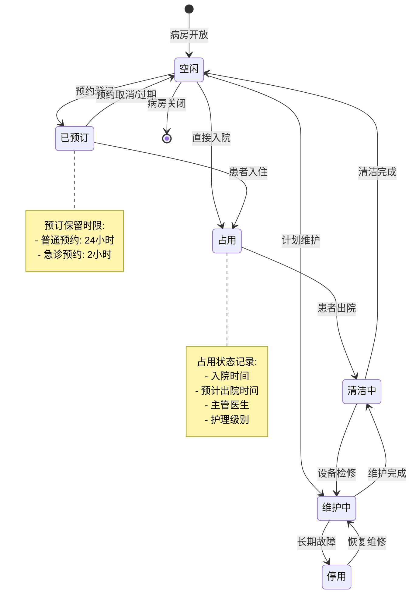
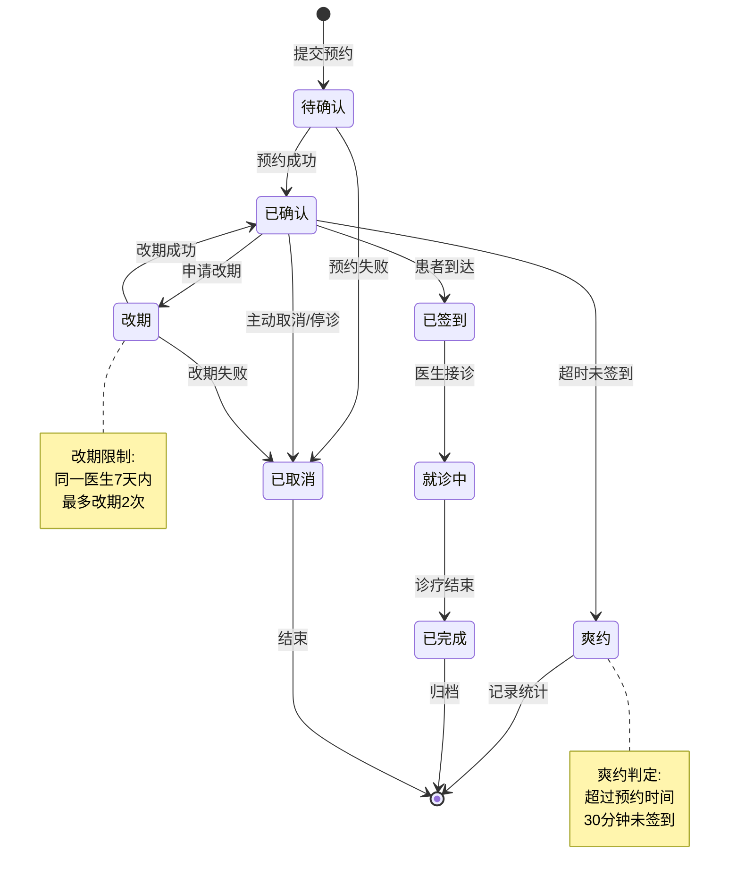
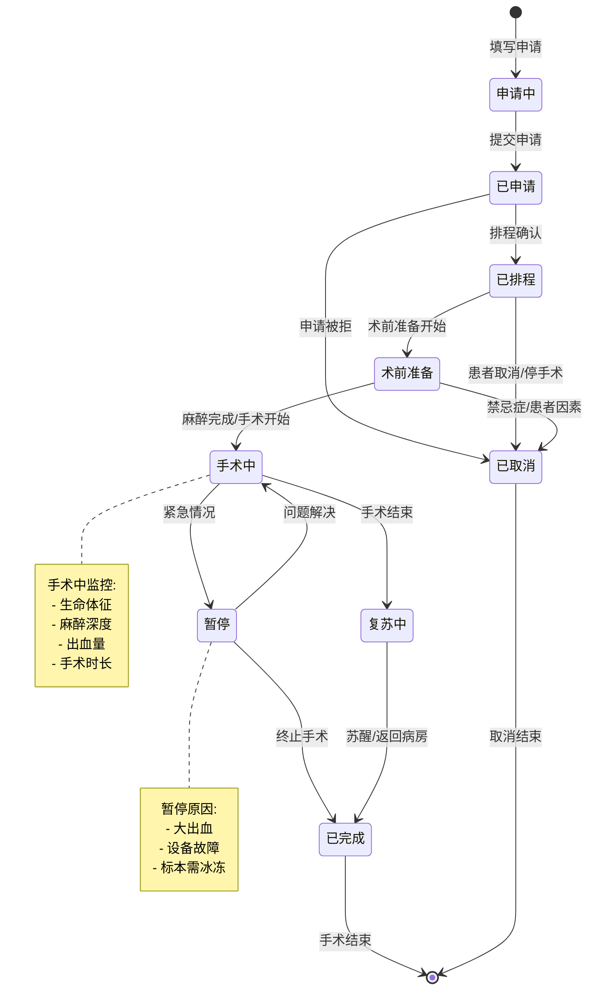
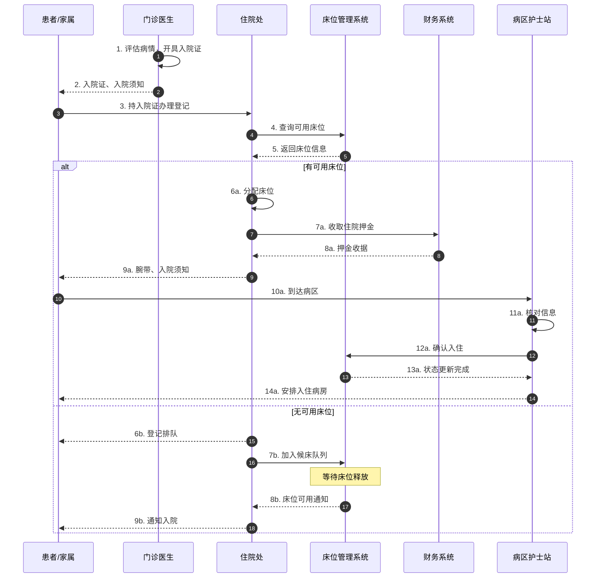
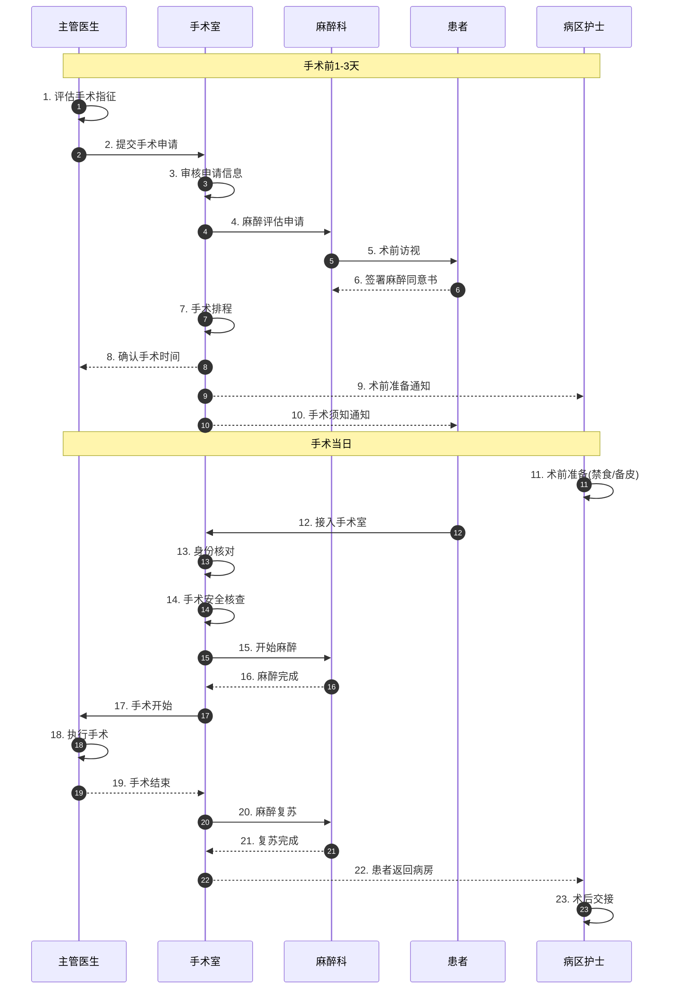
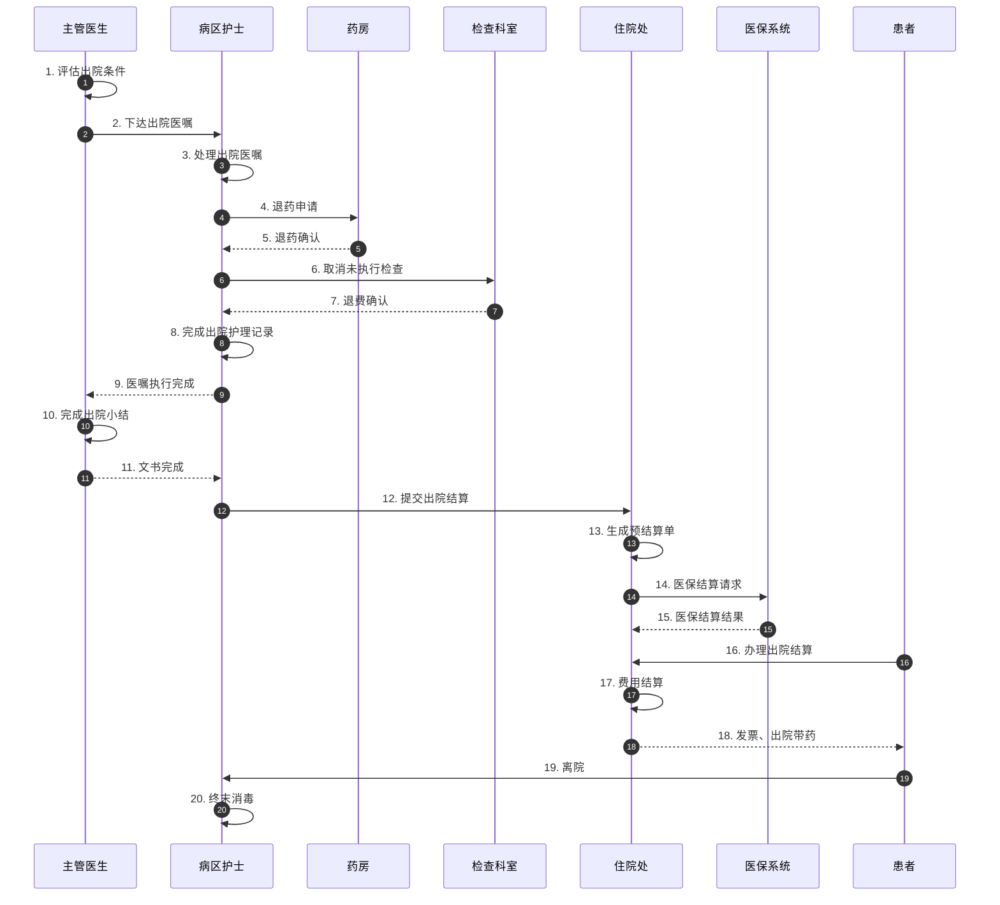
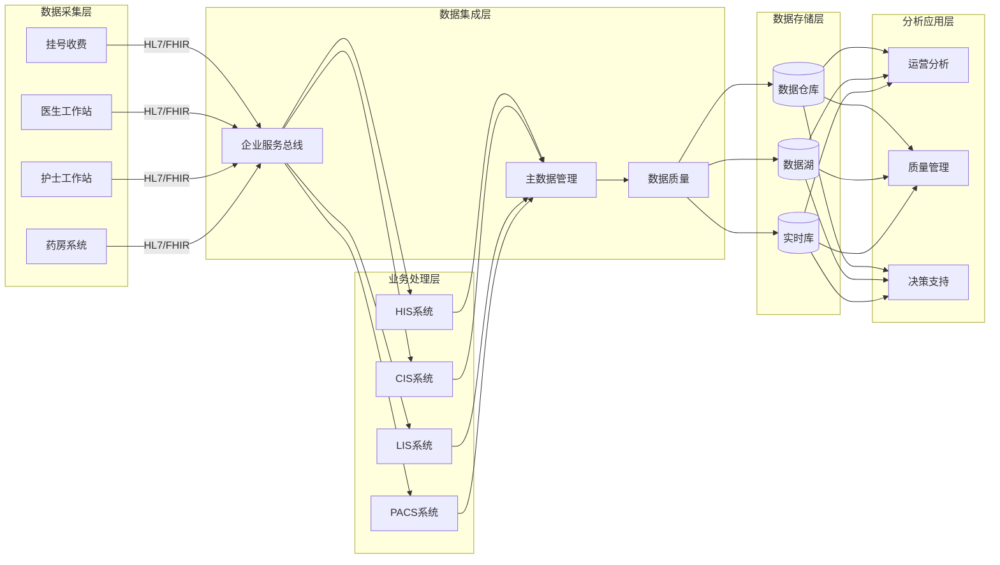
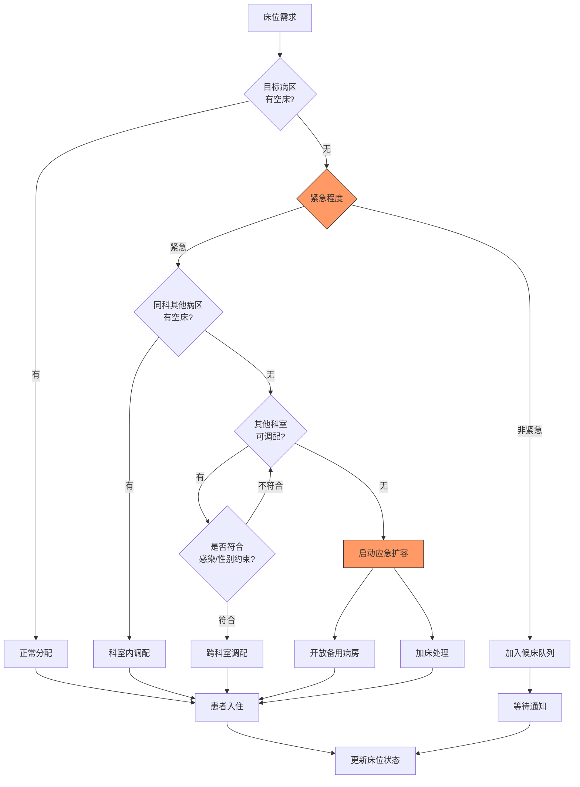
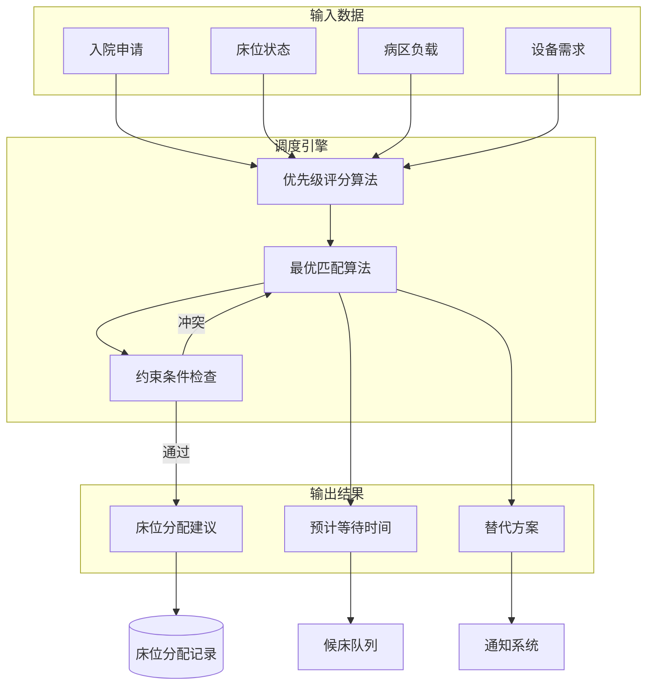
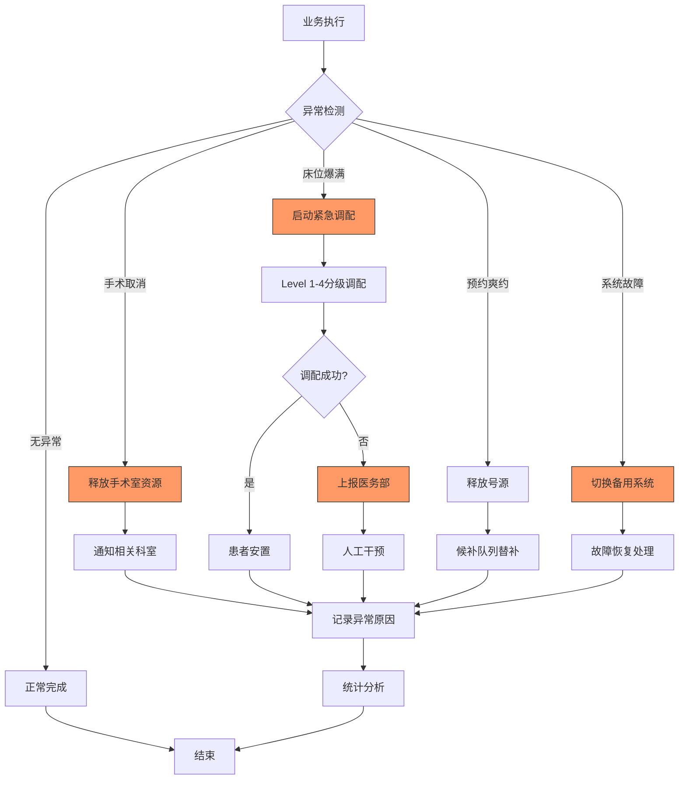

# 医院管理系统信息表征动态动作分析视图

**版本**: v1.0
**创建日期**: 2026-02-15
**标准**: HL7 FHIR R4, IHE框架, 中国医院信息互联互通标准化成熟度测评

---

## 📑 目录

- [医院管理系统信息表征动态动作分析视图](#医院管理系统信息表征动态动作分析视图)
  - [📑 目录](#-目录)
  - [1. 动态动作分析概述](#1-动态动作分析概述)
  - [2. 状态机形式化](#2-状态机形式化)
    - [2.1 床位状态机](#21-床位状态机)
    - [2.2 预约状态机](#22-预约状态机)
    - [2.3 手术排程状态机](#23-手术排程状态机)
  - [3. 时序交互分析](#3-时序交互分析)
    - [3.1 入院流程时序模型](#31-入院流程时序模型)
    - [3.2 手术排程流程时序](#32-手术排程流程时序)
    - [3.3 出院结算流程时序](#33-出院结算流程时序)
  - [4. 数据流分析](#4-数据流分析)
    - [4.1 医院运营数据流](#41-医院运营数据流)
    - [4.2 资源调度数据流](#42-资源调度数据流)
    - [4.3 数据流熵变分析](#43-数据流熵变分析)
  - [5. 实时性分析](#5-实时性分析)
    - [5.1 关键业务SLA要求](#51-关键业务sla要求)
    - [5.2 床位周转时间分析](#52-床位周转时间分析)
    - [5.3 手术室利用率分析](#53-手术室利用率分析)
    - [5.4 预约等待时间分析](#54-预约等待时间分析)
  - [6. 异常处理机制](#6-异常处理机制)
    - [6.1 手术取消处理](#61-手术取消处理)
    - [6.2 床位紧急调配](#62-床位紧急调配)
    - [6.3 预约爽约处理](#63-预约爽约处理)
    - [6.4 异常处理决策矩阵](#64-异常处理决策矩阵)
  - [7. Mermaid动态视图](#7-mermaid动态视图)
    - [7.1 床位状态机图](#71-床位状态机图)
    - [7.2 预约状态机图](#72-预约状态机图)
    - [7.3 手术排程状态机图](#73-手术排程状态机图)
    - [7.4 入院流程时序图](#74-入院流程时序图)
    - [7.5 手术排程流程时序图](#75-手术排程流程时序图)
    - [7.6 出院结算流程时序图](#76-出院结算流程时序图)
    - [7.7 医院运营数据流图](#77-医院运营数据流图)
    - [7.8 床位紧急调配流程图](#78-床位紧急调配流程图)
    - [7.9 资源调度数据流图](#79-资源调度数据流图)
    - [7.10 异常处理流程图](#710-异常处理流程图)

---

## 1. 动态动作分析概述

医院管理系统动态动作分析关注医疗业务流程在运行时的行为特征，包括：

- **状态转换**: 床位、预约、手术等资源在不同状态间的迁移
- **时序交互**: 医护人员、患者、系统之间的消息传递顺序和因果关系
- **数据流动**: 医疗业务数据在各系统组件间的传递路径
- **实时性能**: 满足临床服务要求的响应时间和资源利用率保障
- **异常恢复**: 紧急情况下的资源调配、取消处理和补偿机制

---

## 2. 状态机形式化

### 2.1 床位状态机

```
状态集合: B = {空闲, 已预订, 占用, 清洁中, 维护中, 停用}

状态转换函数:
δ(空闲) = 已预订      (预约登记)
δ(空闲) = 占用        (直接入院)
δ(已预订) = 占用      (患者入住)
δ(已预订) = 空闲      (预约取消/过期)
δ(占用) = 清洁中      (患者出院)
δ(清洁中) = 空闲      (清洁完成)
δ(清洁中) = 维护中    (设备检修)
δ(维护中) = 清洁中    (维护完成)
δ(空闲) = 维护中      (计划维护)
δ(维护中) = 停用      (长期故障)
δ(停用) = 维护中      (恢复维修)

状态不变式:
∀床位: 状态(床位) ∈ B
∀病区: Σ(占用床位) ≤ 总床位数 × 最大占用率(通常95%)
∀床位: 占用时长 ≤ 平均住院日 × 1.5 (异常检测阈值)
```

**床位状态转换矩阵:**

| 当前状态 | 预约登记 | 直接入院 | 患者入住 | 预约取消 | 患者出院 | 清洁完成 | 设备检修 | 维护完成 | 计划维护 | 长期故障 | 恢复维修 |
|---------|---------|---------|---------|---------|---------|---------|---------|---------|---------|---------|---------|
| **空闲** | 已预订 | 占用 | - | - | - | - | - | - | 维护中 | - | - |
| **已预订** | - | - | 占用 | 空闲 | - | - | - | - | - | - | - |
| **占用** | - | - | - | - | 清洁中 | - | - | - | - | - | - |
| **清洁中** | - | - | - | - | - | 空闲 | 维护中 | - | - | - | - |
| **维护中** | - | - | - | - | - | - | - | 清洁中 | - | 停用 | - |
| **停用** | - | - | - | - | - | - | - | - | - | - | 维护中 |

### 2.2 预约状态机

```
预约状态集合: A = {待确认, 已确认, 已签到, 就诊中, 已完成, 已取消, 爽约, 改期}

状态转换流程:
1. 预约创建阶段
   待确认 → 已确认  (预约成功)
   待确认 → 已取消  (预约失败/拒绝)

2. 就诊执行阶段
   已确认 → 已签到  (患者到达)
   已签到 → 就诊中  (医生接诊)
   就诊中 → 已完成  (诊疗结束)

3. 异常处理阶段
   已确认 → 爽约     (超过预约时间未签到)
   已确认 → 改期     (患者申请改期)
   改期 → 已确认     (改期成功)
   任意状态 → 已取消 (患者主动取消/医生停诊)

状态约束:
∀预约: 预约时间 ≥ 当前时间 (待确认/已确认状态)
∀预约: 签到时间 ≤ 预约时间 + 宽限期(通常30分钟)
∀医生: 同时就诊中患者数 ≤ 1 (一对一诊疗)
```

**预约状态转换条件:**

| 转换 | 触发条件 | 执行动作 | 时间限制 |
|-----|---------|---------|---------|
| 待确认→已确认 | 号源充足、时间有效 | 锁定号源、发送通知 | < 2s |
| 待确认→已取消 | 号源不足、时间冲突 | 释放号源、通知患者 | < 1s |
| 已确认→已签到 | 患者现场签到 | 更新候诊队列 | < 1s |
| 已签到→就诊中 | 医生呼叫患者 | 更新诊室状态 | < 1s |
| 就诊中→已完成 | 医生结束诊疗 | 生成病历、计费 | < 5s |
| 已确认→爽约 | 超时未签到 | 释放号源、记录爽约 | 预约后30分钟 |
| 已确认→改期 | 患者申请且新时间有效 | 释放原号源、锁定新号源 | < 2s |
| 任意→已取消 | 患者取消或医生停诊 | 释放号源、退费处理 | < 3s |

### 2.3 手术排程状态机

```
手术状态: S = {申请中, 已申请, 已排程, 术前准备, 手术中, 复苏中, 已完成, 已取消, 暂停}

状态转换规则:

申请中 → 已申请      (申请提交)
已申请 → 已排程      (排程确认)
已申请 → 已取消      (申请被拒绝)
已排程 → 术前准备    (术前准备开始)
术前准备 → 手术中    (患者入室、麻醉完成)
术前准备 → 已取消    (患者取消/禁忌症)
手术中 → 复苏中      (手术结束、麻醉苏醒)
手术中 → 暂停        (紧急情况暂停)
暂停 → 手术中        (问题解决继续)
暂停 → 已完成        (终止手术)
复苏中 → 已完成      (患者苏醒、返回病房)
已完成 → [*]: 手术结束
任意状态 → 已取消    (患者因素/不可抗力)

手术排程生命周期:
┌─────────┐   ┌─────────┐   ┌─────────┐   ┌─────────┐   ┌─────────┐
│ 申请中  │ → │ 已申请  │ → │ 已排程  │ → │术前准备 │ → │ 手术中  │
└─────────┘   └─────────┘   └─────────┘   └─────────┘   └─────────┘
      │             │             │             │             │
      ▼             ▼             ▼             ▼             ▼
┌─────────┐   ┌─────────┐   ┌─────────┐   ┌─────────┐   ┌─────────┐
│ 已取消  │   │ 已取消  │   │ 已取消  │   │ 已取消  │   │  暂停   │
└─────────┘   └─────────┘   └─────────┘   └─────────┘   └─────────┘
                                                              │
                                                              ▼
                                                        ┌─────────┐
                                                        │ 已完成  │
                                                        └─────────┘
```

---

## 3. 时序交互分析

### 3.1 入院流程时序模型

```
参与方:
- 患者/家属 (Patient)
- 门诊医生 (OP_Doctor)
- 住院处 (Admission_Office)
- 病区护士站 (Ward_Nurse)
- 床位管理系统 (Bed_Mgmt)
- 财务系统 (Finance)

时序流程:

T0: 门诊医生评估病情，开具入院证
T1 = T0 + Δt1: 患者持入院证至住院处登记
T2 = T1 + Δt2: 住院处查询床位管理系统
T3 = T2 + Δt3: 床位管理系统返回可用床位
T4 = T3 + Δt4: 住院处分配床位、登记信息
T5 = T4 + Δt5: 财务系统收取住院押金
T6 = T5 + Δt6: 打印腕带、入院须知
T7 = T6 + Δt7: 患者到达病区护士站
T8 = T7 + Δt8: 护士核对信息、安排入住
T9 = T8 + Δt9: 主管医生接诊、下达医嘱

总延迟: T_total = ΣΔti (i=1 to 9)
标准入院流程时间目标: < 30分钟
```

### 3.2 手术排程流程时序

```
手术排程时序模型:

阶段1: 手术申请 (D-1 至 D-3)
- 主管医生评估手术指征
- 填写手术申请单 (术式、麻醉方式、特殊需求)
- 提交至手术室排程系统
- 麻醉科医生术前访视评估

阶段2: 手术排程 (D-1)
- 手术室护士审核申请
- 根据优先级、术式时长、设备需求排程
- 通知相关科室准备
- 患者术前禁食禁水准备

阶段3: 手术执行 (手术日)
- 术前2h: 患者接入手术室等候区
- 术前1h: 麻醉准备、器械清点
- T0: 患者入室、身份核对
- T0+10min: 麻醉诱导
- T0+20min: 手术开始
- T0+20min+T_surgery: 手术结束
- 术后30min: 麻醉复苏
- 术后1h: 返回病房

阶段4: 术后管理
- 术后医嘱执行
- 手术记录归档
- 病理标本送检
- 费用结算

紧急手术时序 (急诊):
- 从申请到入室目标时间: < 30分钟 (危及生命)
- 从申请到入室目标时间: < 2小时 (紧急但非立即)
```

### 3.3 出院结算流程时序

```
出院结算时序模型:

参与方:
- 主管医生 (Attending)
- 病区护士 (Nurse)
- 药房 (Pharmacy)
- 检查科室 (Lab/Radiology)
- 住院处 (Admission)
- 医保系统 (Insurance)
- 患者 (Patient)

标准流程:

T0: 主管医生评估病情，下达出院医嘱
T1 = T0 + Δt1: 护士处理出院医嘱
T2 = T1 + Δt2: 停止所有长期医嘱
T3 = T2 + Δt3: 药房退药处理
T4 = T3 + Δt4: 检查科室完成所有预约退费
T5 = T4 + Δt5: 护士完成出院护理记录
T6 = T5 + Δt6: 医生完成出院小结、诊断证明
T7 = T6 + Δt7: 系统生成预结算单
T8 = T7 + Δt8: 医保系统实时结算
T9 = T8 + Δt9: 患者至住院处办理结算
T10 = T9 + Δt10: 费用结算、多退少补
T11 = T10 + Δt11: 打印发票、出院带药
T12 = T11 + Δt12: 患者离院

标准出院结算时间目标: < 2小时 (医嘱下达至离院)
```

---

## 4. 数据流分析

### 4.1 医院运营数据流

```
医院运营数据生命周期:

1. 数据采集层
   ┌─────────────────────────────────────────┐
   │ 业务前端: 挂号/收费/医嘱/护理记录         │
   │   - 患者基本信息采集                     │
   │   - 诊疗行为记录                         │
   │   - 费用发生记录                         │
   │   - 护理评估记录                         │
   └─────────────────────────────────────────┘
                    │
                    ▼ (HL7/FHIR)
2. 业务处理层
   ┌─────────────────────────────────────────┐
   │ 核心业务系统: HIS/CIS/LIS/PACS/RIS      │
   │   - 医嘱执行跟踪                         │
   │   - 检验检查结果回传                     │
   │   - 电子病历书写                         │
   │   - 费用累计计算                         │
   └─────────────────────────────────────────┘
                    │
                    ▼ (消息队列)
3. 数据集成层
   ┌─────────────────────────────────────────┐
   │ 集成平台/数据中心:                       │
   │   - 数据标准化转换                       │
   │   - 主数据管理                           │
   │   - 数据质量校验                         │
   │   - 实时数据同步                         │
   └─────────────────────────────────────────┘
                    │
                    ▼ (ETL/CDC)
4. 分析应用层
   ┌─────────────────────────────────────────┐
   │ 管理决策支持:                            │
   │   - 运营指标看板                         │
   │   - 医疗质量分析                         │
   │   - 资源利用分析                         │
   │   - 财务成本核算                         │
   └─────────────────────────────────────────┘
```

### 4.2 资源调度数据流

```
资源调度数据流分析:

床位调度:
┌─────────────────────────────────────────────────────────────┐
│ 数据源:                                                      │
│   - 入院申请 (科室、病情、性别要求)                           │
│   - 床位状态 (空闲/将出/清洁)                                │
│   - 病区负载 (当前占用率、护士配比)                           │
│   - 设备需求 (监护仪/呼吸机/特殊设备)                         │
└─────────────────────────────────────────────────────────────┘
                              │
                              ▼
┌─────────────────────────────────────────────────────────────┐
│ 调度算法:                                                    │
│   - 优先级评分 = 病情权重 × 0.4 + 等待时间 × 0.3 + 匹配度 × 0.3 │
│   - 最优匹配 = 最大化(优先级评分) 且 满足(约束条件)             │
│   - 约束条件: 性别隔离、感染控制、设备可用                      │
└─────────────────────────────────────────────────────────────┘
                              │
                              ▼
┌─────────────────────────────────────────────────────────────┐
│ 调度结果:                                                    │
│   - 床位分配建议                                             │
│   - 预计等待时间                                             │
│   - 替代方案推荐                                             │
└─────────────────────────────────────────────────────────────┘

手术排程调度:
┌─────────────────────────────────────────────────────────────┐
│ 输入数据:                                                    │
│   - 手术申请 (术式、预计时长、医生)                           │
│   - 手术室可用时段                                           │
│   - 麻醉资源 (麻醉师、麻醉设备)                               │
│   - 器械耗材库存                                             │
│   - 患者术前检查状态                                         │
└─────────────────────────────────────────────────────────────┘
                              │
                              ▼
┌─────────────────────────────────────────────────────────────┐
│ 排程优化目标:                                                │
│   - 最小化: 手术室空闲时间 + 手术延迟时间                      │
│   - 最大化: 手术室利用率 + 医生满意度                          │
│   - 约束: 医生不可冲突、设备不可超配、紧急优先                  │
└─────────────────────────────────────────────────────────────┘
```

### 4.3 数据流熵变分析

```
医疗数据在系统中的熵变:

原始医疗记录:    H ≈ 256 bits (非结构化临床描述)
     │
     │ 结构化提取
     ▼
标准化数据:      H ≈ 128 bits (ICD编码/LOINC代码)
     │
     │ 临床验证
     ▼
诊断结论:        H ≈ 32 bits (主要诊断代码)
     │
     │ 费用归类
     ▼
费用分类:        H ≈ 16 bits (收费项目类别)
     │
     │ 汇总分析
     ▼
统计指标:        H ≈ 8 bits (汇总数值)

信息保护点:
1. 患者隐私: 身份标识脱敏处理
2. 临床安全: 关键诊断多级审核
3. 数据质量: 必填项校验、逻辑校验
4. 审计追踪: 完整操作日志
```

---

## 5. 实时性分析

### 5.1 关键业务SLA要求

```
服务等级协议 (SLA) 指标:

业务场景           │ 响应时间   │ 可用性    │ 并发量        │ 错误率
──────────────────┼───────────┼──────────┼──────────────┼─────────
挂号登记          │ < 3s      │ 99.9%    │ 1,000 TPS    │ < 0.1%
床位查询          │ < 1s      │ 99.99%   │ 5,000 QPS    │ < 0.01%
医嘱处理          │ < 2s      │ 99.95%   │ 500 TPS      │ < 0.05%
检验申请          │ < 2s      │ 99.9%    │ 300 TPS      │ < 0.1%
检查预约          │ < 3s      │ 99.9%    │ 200 TPS      │ < 0.1%
手术排程          │ < 5s      │ 99.9%    │ 50 TPS       │ < 0.05%
出院结算          │ < 10s     │ 99.9%    │ 100 TPS      │ < 0.1%
床位状态更新      │ < 500ms   │ 99.99%   │ 实时流       │ < 0.01%

业务时段要求:
- 门诊高峰 (08:00-11:00): 挂号/收费系统最高负载
- 手术日 (工作日): 手术排程系统高可用要求
- 夜间急诊 (22:00-06:00): 值班人员减少，系统自动化要求高
```

### 5.2 床位周转时间分析

```
床位周转关键指标:

平均住院日 (ALOS):
- 计算公式: Σ(出院患者住院天数) / 出院患者数
- 三甲医院目标: 8-10天
- 专科医院目标: 5-7天

床位周转次数:
- 年周转次数 = 年出院人次 / 平均开放床位数
- 三甲医院目标: > 40次/年/床

床位使用率:
- 计算公式: 实际占用总床日数 / 实际开放总床日数 × 100%
- 合理区间: 85%-95%
- < 85%: 资源闲置，效率低下
- > 95%: 床位紧张，周转困难

床位周转时间分解:
总周转时间 = 出院处理时间 + 清洁消毒时间 + 新患者入院时间
           = 30min + 45min + 30min
           = 105min (目标: < 2小时)

各环节优化目标:
- 出院医嘱到离院: < 2小时
- 终末消毒: < 1小时
- 新患者入院: < 30分钟
```

### 5.3 手术室利用率分析

```
手术室资源利用率计算:

时间维度分析:
- 手术日可用时间: 08:00-18:00 = 10小时 = 600分钟
- 首台手术开台时间目标: 08:30 (延迟 < 30分钟)
- 连台手术衔接时间目标: < 30分钟
- 日手术量目标 = 600分钟 / (平均手术时长 + 衔接时间)

利用率指标:
1. 时间利用率 = 实际手术时间 / 可用时间 × 100%
   - 目标: > 70%

2. 台次利用率 = 实际手术台次 / 理论最大台次 × 100%
   - 目标: > 85%

3. 首台准时开台率 = 准时开台台次 / 总首台手术 × 100%
   - 目标: > 90%

效率优化杠杆:
- 术前准备充分性 (检查完成率 > 95%)
- 连台衔接流畅性 (平均衔接时间 < 20分钟)
- 手术时长预测准确性 (预测误差 < 15%)
```

### 5.4 预约等待时间分析

```
预约等待时间模型:

等待时间 = 预约日期 - 申请日期

不同科室等待时间目标:

科室类型       │ 常规预约 │ 急诊通道 │ 特需服务
───────────────┼─────────┼─────────┼─────────
普通内科/外科   │ 3-7天   │ 当日    │ 1-2天
专家门诊       │ 7-14天  │ 不适用   │ 3-5天
大型检查(CT/MR)│ 1-3天   │ 2小时内 │ 当日
手术排程       │ 3-7天   │ 6小时内 │ 1-2天

排队论模型应用:
患者到达率 λ (人/天)
服务率 μ (人/天)
服务器数量 c (医生数/设备数)

系统利用率 ρ = λ / (c × μ)

平均等待时间 Wq ≈ (ρ^√(2(c+1)) / (c × μ × (1-ρ))) × (平均服务时间)

优化策略:
1. 动态号源分配 (根据历史数据调整)
2. 爽约预测与替补机制
3. 分时段预约 (30分钟时段)
4. 双向转诊绿色通道
```

---

## 6. 异常处理机制

### 6.1 手术取消处理

```
手术取消分类处理:

取消类型          │ 触发条件              │ 处理流程                      │ 重新排程
─────────────────┼──────────────────────┼─────────────────────────────┼─────────
患者因素取消       │ 病情变化/患者意愿      │ 记录原因→释放资源→通知相关科室  │ 重新申请
医生因素取消       │ 医生临时不可用         │ 协调替代医生→患者沟通→确认取消  │ 优先排程
系统故障取消       │ 设备故障/系统宕机       │ 启动应急预案→转移患者→记录故障  │ 紧急优先
不可抗力取消       │ 停电/灾害/疫情         │ 全院应急→患者安全转移→上报      │ 视情况

取消时限与影响:
- 提前 > 24小时取消: 正常释放资源
- 提前 2-24小时取消: 标记为"晚期取消"，分析原因
- 提前 < 2小时取消: 标记为"当日取消"，影响利用率统计
- 术中取消: 记录为"术中终止"，单独分析

数据恢复:
1. 释放手术室时段
2. 通知麻醉科取消准备
3. 器械室停止准备
4. 病房调整接收准备
5. 记录取消原因用于分析
```

### 6.2 床位紧急调配

```
床位紧急调配机制:

触发条件:
1. 急诊患者需立即入院但目标病区满床
2. 危重患者需转ICU但ICU满床
3. 大规模事件导致患者激增
4. 病区暴发感染需腾空病房

调配策略:

Level 1 - 科室内调配:
- 优先: 同病区不同房间调整
- 操作: 护士站协调，5分钟内完成

Level 2 - 科室间调配:
- 优先: 相近专业病区 (如心内一↔心内二)
- 操作: 医务部协调，15分钟内完成
- 注意: 跨科护理能力评估

Level 3 - 全院调配:
- 优先: 借用其他科室空闲床位
- 操作: 医务部+护理部联合调度
- 措施: 临时增加护理人力

Level 4 - 应急扩容:
- 措施: 开放备用病房/加床
- 审批: 分管院长批准
- 资源: 调配应急物资和人员

约束条件:
- 感染患者不得调入非感染病区
- 性别隔离原则 (除非特殊情况)
- 护理能力匹配 (重症患者需ICU护理)
```

### 6.3 预约爽约处理

```
预约爽约管理策略:

爽约定义:
- 未提前取消且未按时签到
- 超过预约时间30分钟未到场

爽约分级:

爽约次数    │ 处理方式              │ 后续预约限制
───────────┼──────────────────────┼─────────────────────────
首次爽约    │ 记录警告              │ 无限制
二次爽约    │ 短信提醒+记录          │ 需电话确认
三次爽约    │ 人工审核              │ 限制网上预约，需现场挂号
多次爽约    │ 黑名单管理             │ 限制预约权限，需特别申请

爽约预测与干预:
```

爽约风险评分 = 历史爽约率 × 0.4 + 预约时段特征 × 0.3 + 患者特征 × 0.3

高风险特征:

- 历史爽约率 > 30%
- 预约时段为工作日早晨
- 首次就诊患者
- 预约与就诊间隔 > 14天

```

干预措施:
1. 预约确认短信 (就诊前1-3天)
2. AI语音确认电话 (高风险患者)
3. 候补队列自动替补 (爽约释放号源)
4. 弹性预约机制 (允许多选时段)

替补机制:
- 建立同科室候补队列
- 爽约后自动通知候补患者
- 候补确认时间窗口: 30分钟
```

### 6.4 异常处理决策矩阵

```
异常场景分类与处理:

异常类型          │ 检测方式       │ 自动处理       │ 人工介入      │ 通知方式
─────────────────┼───────────────┼───────────────┼──────────────┼──────────
手术临时取消       │ 系统标记      │ 释放资源       │ 原因确认       │ 多方通知
床位爆满          │ 实时监控      │ 启动调配       │ 调配决策       │ 紧急告警
预约爽约          │ 超时检测      │ 释放号源       │ 无需介入       │ 记录统计
设备故障          │ 状态监测      │ 切换备用       │ 维修调度       │ 紧急告警
系统宕机          │ 健康检查      │ 切换灾备       │ 故障恢复       │ 全员告警
医嘱异常          │ 规则引擎      │ 拦截提示       │ 医生确认       │ 界面提醒
费用超标          │ 实时计算      │ 预警通知       │ 审批确认       │ 消息推送
药品短缺          │ 库存监控      │ 替代推荐       │ 采购决策       │ 库存告警
```

---

## 7. Mermaid动态视图

### 7.1 床位状态机图



### 7.2 预约状态机图



### 7.3 手术排程状态机图



### 7.4 入院流程时序图



### 7.5 手术排程流程时序图



### 7.6 出院结算流程时序图



### 7.7 医院运营数据流图



### 7.8 床位紧急调配流程图



### 7.9 资源调度数据流图



### 7.10 异常处理流程图



---

**参考文档**:

- `01_Overview.md` - 医院管理系统概述
- `02_Formal_Definition.md` - 形式化定义
- `04_Transformation.md` - 模型转换
- `05_Case_Studies.md` - 案例研究
- HL7 FHIR R4 标准
- 中国医院信息互联互通标准化成熟度测评方案

**维护者**: DSL Schema研究团队
