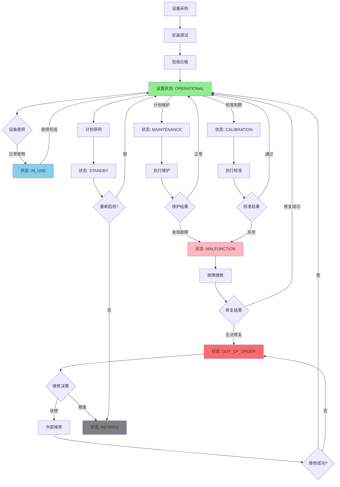
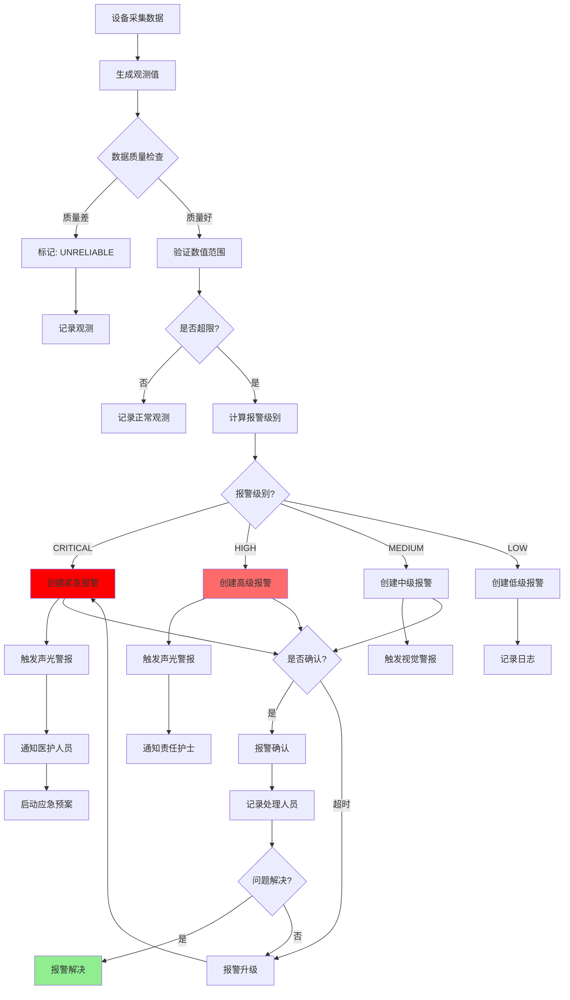
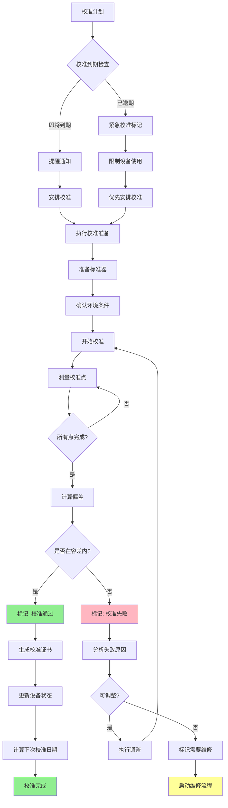
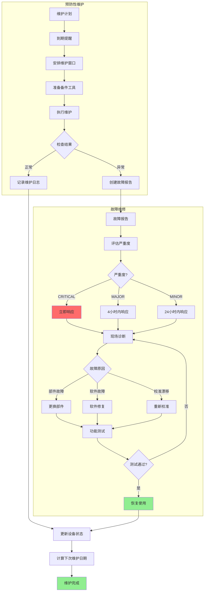
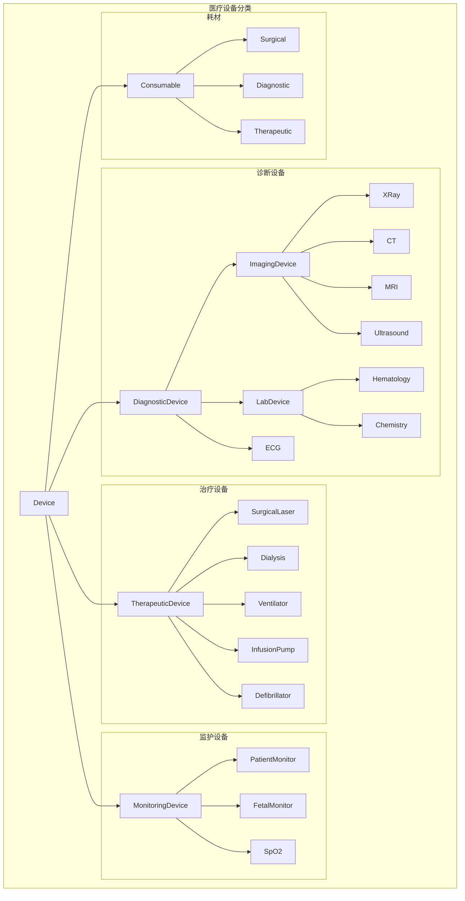
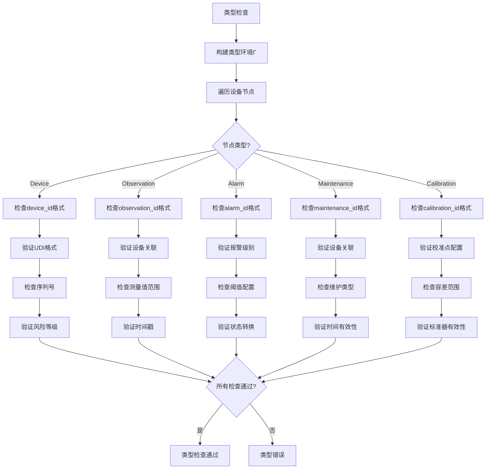
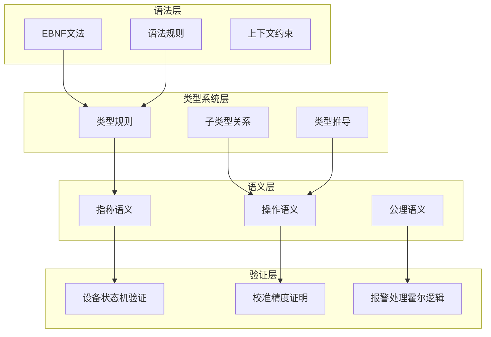

# 医疗设备Schema形式语法与语义分析视图

**版本**: v1.0  
**创建日期**: 2026-02-15  
**标准**: ISO 13485:2016, IEC 62304, HL7 FHIR, DICOM, ISO 14971

---

## 📑 目录

- [1. 形式文法定义](#1-形式文法定义)
  - [1.1 EBNF文法](#11-ebnf文法)
  - [1.2 语法规则](#12-语法规则)
- [2. 形式语义定义](#2-形式语义定义)
  - [2.1 指称语义](#21-指称语义)
  - [2.2 操作语义](#22-操作语义)
  - [2.3 公理语义](#23-公理语义)
- [3. 类型系统](#3-类型系统)
  - [3.1 类型规则](#31-类型规则)
  - [3.2 子类型关系](#32-子类型关系)
- [4. 语义等价性](#4-语义等价性)
- [5. Mermaid可视化](#5-mermaid可视化)

---

## 1. 形式文法定义

### 1.1 EBNF文法

#### 1.1.1 设备实体文法

```ebnf
(* 医疗设备核心实体 - 设备定义 *)

Device ::= DiagnosticDevice | TherapeuticDevice | MonitoringDevice | Consumable

DiagnosticDevice ::= '{'
    '"device_id"' ':' DeviceId ','
    '"device_name"' ':' String(100) ','
    '"device_category"' ':' '"DIAGNOSTIC"' ','
    '"diagnostic_type"' ':' DiagnosticType ','
    '"manufacturer"' ':' ManufacturerInfo ','
    '"model_number"' ':' String(50) ','
    '"serial_number"' ':' String(50) ','
    '"udi"' ':' UDI ','
    '"location"' ':' DeviceLocation ','
    '"department_id"' ':' DepartmentId ','
    '"installation_date"' ':' Date ','
    '"warranty_expiry"' ':' Date ','
    '"status"' ':' DeviceStatus ','
    '"calibration_status"' ':' CalibrationStatus ','
    '"last_calibration_date"' ':' Date? ','
    '"next_calibration_date"' ':' Date ','
    '"risk_class"' ':' RiskClassification ','
    '"technical_specs"' ':' TechnicalSpecs ','
    '"software_version"' ':' Version?
'}'

TherapeuticDevice ::= '{'
    '"device_id"' ':' DeviceId ','
    '"device_name"' ':' String(100) ','
    '"device_category"' ':' '"THERAPEUTIC"' ','
    '"therapeutic_type"' ':' TherapeuticType ','
    '"manufacturer"' ':' ManufacturerInfo ','
    '"model_number"' ':' String(50) ','
    '"serial_number"' ':' String(50) ','
    '"udi"' ':' UDI ','
    '"location"' ':' DeviceLocation ','
    '"department_id"' ':' DepartmentId ','
    '"installation_date"' ':' Date ','
    '"warranty_expiry"' ':' Date ','
    '"status"' ':' DeviceStatus ','
    '"treatment_parameters"' ':' ParameterList ','
    '"safety_interlocks"' ':' InterlockList ','
    '"risk_class"' ':' RiskClassification ','
    '"operator_training_required"' ':' Boolean ','
    '"technical_specs"' ':' TechnicalSpecs
'}'

MonitoringDevice ::= '{'
    '"device_id"' ':' DeviceId ','
    '"device_name"' ':' String(100) ','
    '"device_category"' ':' '"MONITORING"' ','
    '"monitoring_type"' ':' MonitoringType ','
    '"manufacturer"' ':' ManufacturerInfo ','
    '"model_number"' ':' String(50) ','
    '"serial_number"' ':' String(50) ','
    '"udi"' ':' UDI ','
    '"location"' ':' DeviceLocation ','
    '"department_id"' ':' DepartmentId ','
    '"installation_date"' ':' Date ','
    '"status"' ':' DeviceStatus ','
    '"measurement_capabilities"' ':' MeasurementList ','
    '"sampling_rate"' ':' Frequency ','
    '"alarm_settings"' ':' AlarmSettingList ','
    '"connectivity"' ':' ConnectivityInfo ','
    '"battery_backup"' ':' BatteryInfo?
'}'

Consumable ::= '{'
    '"consumable_id"' ':' ConsumableId ','
    '"consumable_name"' ':' String(100) ','
    '"device_category"' ':' '"CONSUMABLE"' ','
    '"consumable_type"' ':' ConsumableType ','
    '"manufacturer"' ':' ManufacturerInfo ','
    '"lot_number"' ':' String(50) ','
    '"catalog_number"' ':' String(50) ','
    '"udi"' ':' UDI ','
    '"storage_location"' ':' StorageLocation ','
    '"quantity_on_hand"' ':' Integer ','
    '"unit_of_measure"' ':' UOM ','
    '"expiration_date"' ':' Date ','
    '"reorder_level"' ':' Integer ','
    '"sterility_status"' ':' SterilityStatus ','
    '"biocompatibility"' ':' BiocompatibilityStatus
'}'

(* 设备类型枚举 *)
DiagnosticType ::= 'IMAGING' | 'LABORATORY' | 'ELECTROCARDIOGRAPH' | 'ELECTROENCEPHALOGRAPH'
                 | 'ENDOSCOPE' | 'ULTRASOUND' | 'MRI' | 'CT' | 'XRAY' | 'MAMMOGRAPHY'
                 | 'FLUOROSCOPY' | 'PET' | 'SPECT' | 'PATHOLOGY'

TherapeuticType ::= 'SURGICAL_LASER' | 'LITHOTRIPTER' | 'DIALYSIS' | 'INFUSION_PUMP'
                  | 'VENTILATOR' | 'DEFIBRILLATOR' | 'PACEMAKER' | 'RADIATION_THERAPY'
                  | 'PHYSIOTHERAPY' | 'ANESTHESIA' | 'ELECTROSURGICAL'

MonitoringType ::= 'PATIENT_MONITOR' | 'FETAL_MONITOR' | 'HEMODYNAMIC_MONITOR'
                 | 'NEUROLOGICAL_MONITOR' | 'RESPIRATORY_MONITOR' | 'TEMPERATURE_MONITOR'
                 | 'BLOOD_GLUCOSE' | 'PULSE_OXIMETER' | 'CAPNOGRAPH'

ConsumableType ::= 'SURGICAL_INSTRUMENT' | 'CATHETER' | 'SYRINGE' | 'NEEDLE' | 'SUTURE'
                 | 'GAUZE' | 'DRESSING' | 'IMPLANT' | 'STENT' | 'PROSTHESIS'
                 | 'BLOOD_BAG' | 'CONTRAST_MEDIA' | 'REAGENT' | 'TEST_KIT'

DeviceStatus ::= 'OPERATIONAL' | 'STANDBY' | 'IN_USE' | 'MAINTENANCE' | 'CALIBRATION'
               | 'MALFUNCTION' | 'OUT_OF_ORDER' | 'RETIRED'

CalibrationStatus ::= 'CALIBRATED' | 'DUE' | 'OVERDUE' | 'IN_PROGRESS'

RiskClassification ::= 'CLASS_I' | 'CLASS_IIa' | 'CLASS_IIb' | 'CLASS_III'

SterilityStatus ::= 'STERILE' | 'NON_STERILE' | 'STERILIZABLE'
BiocompatibilityStatus ::= 'ISO_10993_COMPLIANT' | 'CYTOTOXICITY_TESTED' | 'NOT_TESTED'

(* 标识符格式 *)
DeviceId ::= 'DEV' [0-9]{8}
ConsumableId ::= 'CON' [0-9]{8}
DepartmentId ::= 'DEPT' [0-9]{6}
UDI ::= '[0-9]{14}'  (* GS1 标准 *)
ManufacturerInfo ::= '{'
    '"name"' ':' String(100) ','
    '"address"' ':' String(200)? ','
    '"contact"' ':' String(50)? ','
    '"certifications"' ':' CertificationList
'}'
CertificationList ::= List<Certification>
Certification ::= 'ISO_13485' | 'CE_MARK' | 'FDA_510K' | 'FDA_PMA'
DeviceLocation ::= '{'
    '"building"' ':' String(50) ','
    '"floor"' ':' String(10) ','
    '"room"' ':' String(20) ','
    '"bed_side"' ':' String(10)?
'}'
StorageLocation ::= '{'
    '"warehouse"' ':' String(50) ','
    '"zone"' ':' String(20) ','
    '"shelf"' ':' String(20) ','
    '"temperature_controlled"' ':' Boolean
'}'
TechnicalSpecs ::= '{'
    '"power_requirements"' ':' PowerSpec ','
    '"dimensions"' ':' Dimensions ','
    '"weight"' ':' Weight ','
    '"environmental_requirements"' ':' EnvironmentalSpec
'}'
PowerSpec ::= '{'
    '"voltage"' ':' String(20) ','
    '"frequency"' ':' String(10) ','
    '"power_consumption"' ':' String(20)
'}'
Dimensions ::= '{'
    '"length"' ':' Decimal ','
    '"width"' ':' Decimal ','
    '"height"' ':' Decimal ','
    '"unit"' ':' LengthUnit
'}'
Weight ::= '{'
    '"value"' ':' Decimal ','
    '"unit"' ':' WeightUnit
'}'
EnvironmentalSpec ::= '{'
    '"temperature_range"' ':' Range ','
    '"humidity_range"' ':' Range ','
    '"atmospheric_pressure"' ':' Range?
'}'
Range ::= '{'
    '"min"' ':' Decimal ','
    '"max"' ':' Decimal ','
    '"unit"' ':' String(10)
'}'
ParameterList ::= List<Parameter>
Parameter ::= '{'
    '"name"' ':' String(50) ','
    '"value"' ':' Value ','
    '"unit"' ':' String(20) ','
    '"range"' ':' Range
'}'
InterlockList ::= List<Interlock>
Interlock ::= '{'
    '"type"' ':' String(50) ','
    '"condition"' ':' String(200) ','
    '"action"' ':' String(100)
'}'
MeasurementList ::= List<Measurement>
Measurement ::= '{'
    '"parameter"' ':' String(50) ','
    '"unit"' ':' String(20) ','
    '"accuracy"' ':' Decimal ','
    '"resolution"' ':' Decimal
'}'
Frequency ::= '[0-9]+' ('HZ' | 'KHZ' | 'MHZ')
AlarmSettingList ::= List<AlarmSetting>
AlarmSetting ::= '{'
    '"parameter"' ':' String(50) ','
    '"high_limit"' ':' Decimal? ','
    '"low_limit"' ':' Decimal? ','
    '"delay"' ':' Integer
'}'
ConnectivityInfo ::= '{'
    '"interface"' ':' InterfaceType ','
    '"protocol"' ':' ProtocolType ','
    '"network_address"' ':' String(50)?
'}'
InterfaceType ::= 'WIRED_ETHERNET' | 'WIFI' | 'BLUETOOTH' | 'USB' | 'RS232' | 'HL7'
ProtocolType ::= 'HL7_FHIR' | 'DICOM' | 'IEEE_11073' | 'MODBUS' | 'PROPRIETARY'
BatteryInfo ::= '{'
    '"capacity"' ':' String(20) ','
    '"backup_duration"' ':' Duration
'}'
UOM ::= 'PIECE' | 'BOX' | 'PACK' | 'ML' | 'L' | 'MG' | 'G' | 'KG'
LengthUnit ::= 'MM' | 'CM' | 'M'
WeightUnit ::= 'G' | 'KG'
Duration ::= '[0-9]+' ('MIN' | 'HOUR')
Version ::= '[0-9]+(\.[0-9]+)*'
```

#### 1.1.2 设备观测实体文法

```ebnf
(* 设备观测定义 - 生命体征、影像数据、检验结果 *)

DeviceObservation ::= VitalSignObservation | ImagingObservation | LabObservation

VitalSignObservation ::= '{'
    '"observation_id"' ':' ObservationId ','
    '"observation_type"' ':' '"VITAL_SIGN"' ','
    '"device_id"' ':' DeviceId ','
    '"patient_id"' ':' PatientId ','
    '"timestamp"' ':' DateTime ','
    '"vital_sign_type"' ':' VitalSignType ','
    '"measurement_value"' ':' MeasurementValue ','
    '"unit"' ':' String(20) ','
    '"site"' ':' MeasurementSite? ','
    '"position"' ':' PatientPosition? ','
    '"quality_flag"' ':' QualityFlag ','
    '"alarm_triggered"' ':' Boolean ','
    ['"operator_id"' ':' StaffId?]
'}'

ImagingObservation ::= '{'
    '"observation_id"' ':' ObservationId ','
    '"observation_type"' ':' '"IMAGING"' ','
    '"device_id"' ':' DeviceId ','
    '"patient_id"' ':' PatientId ','
    '"study_id"' ':' StudyId ','
    '"series_id"' ':' SeriesId ','
    '"timestamp"' ':' DateTime ','
    '"modality"' ':' Modality ','
    '"body_part"' ':' BodyPart ','
    '"view_position"' ':' ViewPosition? ','
    '"image_count"' ':' Integer ','
    '"dicom_tags"' ':' DICOMTagList ','
    '"image_quality"' ':' ImageQuality ','
    '"contrast_used"' ':' Boolean ','
    ['"radiologist_id"' ':' PhysicianId?]
    ['"report_status"' ':' ReportStatus?]
'}'

LabObservation ::= '{'
    '"observation_id"' ':' ObservationId ','
    '"observation_type"' ':' '"LABORATORY"' ','
    '"device_id"' ':' DeviceId ','
    '"patient_id"' ':' PatientId ','
    '"specimen_id"' ':' SpecimenId ','
    '"timestamp"' ':' DateTime ','
    '"test_panel"' ':' TestPanel ','
    '"test_results"' ':' TestResultList ','
    '"specimen_type"' ':' SpecimenType ','
    '"collection_time"' ':' DateTime ','
    '"received_time"' ':' DateTime ','
    '"result_status"' ':' ResultStatus ','
    ['"verified_by"' ':' StaffId?]
    ['"reference_ranges"' ':' ReferenceRangeList?]
'}'

(* 生命体征类型 *)
VitalSignType ::= 'HEART_RATE' | 'BLOOD_PRESSURE' | 'RESPIRATORY_RATE' | 'BODY_TEMPERATURE'
                | 'OXYGEN_SATURATION' | 'BLOOD_GLUCOSE' | 'WEIGHT' | 'HEIGHT'
                | 'BODY_MASS_INDEX' | 'PAIN_SCORE' | 'CONSCIOUSNESS_LEVEL'

MeasurementSite ::= 'ARM_RIGHT' | 'ARM_LEFT' | 'WRIST_RIGHT' | 'WRIST_LEFT'
                  | 'FINGER' | 'EAR' | 'FOREHEAD' | 'ORAL' | 'RECTAL' | 'AXILLARY'

PatientPosition ::= 'SUPINE' | 'PRONE' | 'SITTING' | 'STANDING' | 'LATERAL'

QualityFlag ::= 'EXCELLENT' | 'GOOD' | 'FAIR' | 'POOR' | 'UNRELIABLE'

(* 影像模态 *)
Modality ::= 'CR' | 'DX' | 'CT' | 'MR' | 'US' | 'RF' | 'MG' | 'XA' | 'NM' | 'PT'
           | 'PET' | 'US' | 'OCT' | 'OP' | 'SM' | 'SR'

BodyPart ::= 'HEAD' | 'NECK' | 'CHEST' | 'ABDOMEN' | 'PELVIS' | 'SPINE' | 'EXTREMITY'
           | 'SKULL' | 'SINUS' | 'ORBIT' | 'BRAIN' | 'HEART' | 'LUNG' | 'LIVER'
           | 'KIDNEY' | 'BREAST' | 'PROSTATE' | 'WHOLE_BODY'

ViewPosition ::= 'AP' | 'PA' | 'LATERAL' | 'OBLIQUE' | 'TANGENTIAL' | 'AXIAL'

ImageQuality ::= 'DIAGNOSTIC' | 'ACCEPTABLE' | 'SUBOPTIMAL' | 'NON_DIAGNOSTIC'

ReportStatus ::= 'PENDING' | 'DRAFT' | 'FINAL' | 'AMENDED' | 'CORRECTED'

(* 检验相关 *)
TestPanel ::= 'CBC' | 'BMP' | 'CMP' | 'LIPID' | 'TFT' | 'COAGULATION' | 'CARDIAC'
            | 'LIVER' | 'RENAL' | 'BLOOD_GAS' | 'URINALYSIS' | 'CULTURE'

SpecimenType ::= 'BLOOD' | 'SERUM' | 'PLASMA' | 'URINE' | 'CSF' | 'TISSUE' | 'SWAB'
               | 'SPUTUM' | 'STOOL' | 'BONE_MARROW'

ResultStatus ::= 'PRELIMINARY' | 'FINAL' | 'CORRECTED' | 'CANCELLED'

(* 测量值 *)
MeasurementValue ::= SingleValue | CompoundValue
SingleValue ::= Decimal
CompoundValue ::= '{'
    '"systolic"' ':' Decimal ','
    '"diastolic"' ':' Decimal ','
    '"mean"' ':' Decimal?
'}'

TestResult ::= '{'
    '"test_code"' ':' LOINCCode ','
    '"test_name"' ':' String(100) ','
    '"value"' ':' TestValue ','
    '"unit"' ':' String(20) ','
    '"reference_range"' ':' ReferenceRange? ','
    '"abnormal_flag"' ':' AbnormalFlag?
'}'
TestValue ::= Decimal | String | CodedValue
LOINCCode ::= '[0-9]{5}(-[0-9]{1})?'
AbnormalFlag ::= 'LOW' | 'HIGH' | 'CRITICAL_LOW' | 'CRITICAL_HIGH' | 'ABNORMAL'
ReferenceRange ::= '{'
    '"low"' ':' Decimal ','
    '"high"' ':' Decimal ','
    '"unit"' ':' String(20)
'}'

(* 标识符 *)
ObservationId ::= 'OBS' [0-9]{12}
StudyId ::= 'STU' [0-9]{10}
SeriesId ::= 'SER' [0-9]{10}
SpecimenId ::= 'SPC' [0-9]{10}
PatientId ::= 'PAT' [0-9]{10}
StaffId ::= 'STF' [0-9]{8}
PhysicianId ::= 'PHY' [0-9]{8}
DICOMTagList ::= List<DICOMTag>
DICOMTag ::= '{'
    '"tag"' ':' String(8) ','
    '"vr"' ':' String(2) ','
    '"value"' ':' String
'}'
TestResultList ::= List<TestResult>
ReferenceRangeList ::= List<ReferenceRange>
```

#### 1.1.3 报警实体文法

```ebnf
(* 报警定义 - 报警级别、报警原因、处理状态 *)

Alarm ::= '{'
    '"alarm_id"' ':' AlarmId ','
    '"device_id"' ':' DeviceId ','
    '"patient_id"' ':' PatientId? ','
    '"alarm_type"' ':' AlarmType ','
    '"alarm_level"' ':' AlarmLevel ','
    '"alarm_source"' ':' AlarmSource ','
    '"triggered_at"' ':' DateTime ','
    '"triggered_parameter"' ':' String(50) ','
    '"triggered_value"' ':' Decimal ','
    '"threshold_value"' ':' Decimal ','
    '"alarm_message"' ':' String(500) ','
    '"status"' ':' AlarmStatus ','
    ['"acknowledged_at"' ':' DateTime?]
    ['"acknowledged_by"' ':' StaffId?]
    ['"resolved_at"' ':' DateTime?]
    ['"resolution_action"' ':' String(200)?]
    ['"escalation_level"' ':' Integer?]
    '"audio_alert"' ':' Boolean ','
    '"visual_alert"' ':' Boolean ','
    '"remote_notification"' ':' Boolean
'}'

(* 报警类型 *)
AlarmType ::= 'HIGH_LIMIT' | 'LOW_LIMIT' | 'RATE_OF_CHANGE' | 'TECHNICAL'
            | 'SYSTEM' | 'NETWORK' | 'POWER' | 'BATTERY' | 'CALIBRATION_DUE'
            | 'MAINTENANCE_DUE' | 'OCCLUSION' | 'DISCONNECTION' | 'LEAK'

(* 报警级别 *)
AlarmLevel ::= 'CRITICAL' | 'HIGH' | 'MEDIUM' | 'LOW' | 'INFO'

(* 报警来源 *)
AlarmSource ::= 'PATIENT_MONITOR' | 'VENTILATOR' | 'INFUSION_PUMP' | 'DIALYSIS'
              | 'DEFIBRILLATOR' | 'ANALYZER' | 'IMAGING_SYSTEM' | 'NETWORK'
              | 'POWER_SYSTEM' | 'ENVIRONMENTAL'

(* 报警状态 *)
AlarmStatus ::= 'ACTIVE' | 'ACKNOWLEDGED' | 'RESOLVED' | 'SILENCED' | 'ESCALATED'

(* 标识符 *)
AlarmId ::= 'ALM' [0-9]{12}
CodedValue ::= '{'
    '"code"' ':' String(50) ','
    '"system"' ':' String(100) ','
    '"display"' ':' String(100)
'}'
```

#### 1.1.4 维护实体文法

```ebnf
(* 维护定义 - 预防性维护、故障维修、校准 *)

Maintenance ::= PreventiveMaintenance | CorrectiveMaintenance | Calibration

PreventiveMaintenance ::= '{'
    '"maintenance_id"' ':' MaintenanceId ','
    '"maintenance_type"' ':' '"PREVENTIVE"' ','
    '"device_id"' ':' DeviceId ','
    '"schedule_date"' ':' Date ','
    '"maintenance_procedure"' ':' ProcedureCode ','
    '"procedure_description"' ':' String(1000) ','
    '"estimated_duration"' ':' Duration ','
    '"required_parts"' ':' PartList ','
    '"required_tools"' ':' ToolList ','
    '"technician_id"' ':' StaffId ','
    '"status"' ':' MaintenanceStatus ','
    ['"started_at"' ':' DateTime?]
    ['"completed_at"' ':' DateTime?]
    ['"actual_duration"' ':' Duration?]
    ['"findings"' ':' String(1000)?]
    ['"actions_taken"' ':' String(1000)?]
    ['"next_due_date"' ':' Date?]
    '"compliance_standard"' ':' String(50)
'}'

CorrectiveMaintenance ::= '{'
    '"maintenance_id"' ':' MaintenanceId ','
    '"maintenance_type"' ':' '"CORRECTIVE"' ','
    '"device_id"' ':' DeviceId ','
    '"fault_reported_at"' ':' DateTime ','
    '"fault_description"' ':' String(1000) ','
    '"fault_category"' ':' FaultCategory ','
    '"severity"' ':' SeverityLevel ','
    '"reported_by"' ':' StaffId ','
    '"assigned_technician"' ':' StaffId ','
    '"status"' ':' MaintenanceStatus ','
    ['"started_at"' ':' DateTime?]
    ['"completed_at"' ':' DateTime?]
    ['"root_cause"' ':' String(500)?]
    ['"corrective_action"' ':' String(1000)?]
    ['"parts_replaced"' ':' PartList?]
    ['"test_results"' ':' TestResultList?]
    ['"downtime_duration"' ':' Duration?]
'}'

Calibration ::= '{'
    '"calibration_id"' ':' CalibrationId ','
    '"calibration_type"' ':' CalibrationType ','
    '"device_id"' ':' DeviceId ','
    '"scheduled_date"' ':' Date ','
    '"calibration_standard"' ':' StandardReference ','
    '"calibration_points"' ':' CalibrationPointList ','
    '"tolerance_limits"' ':' ToleranceSpec ','
    '"technician_id"' ':' StaffId ','
    '"status"' ':' CalibrationStatus ','
    ['"started_at"' ':' DateTime?]
    ['"completed_at"' ':' DateTime?]
    ['"measured_values"' ':' MeasuredValueList?]
    ['"deviations"' ':' DeviationList?]
    ['"adjustments_made"' ':' Boolean?]
    ['"calibration_certificate"' ':' CertificateId?]
    ['"next_calibration_date"' ':' Date?]
'}'

(* 维护状态 *)
MaintenanceStatus ::= 'SCHEDULED' | 'IN_PROGRESS' | 'COMPLETED' | 'CANCELLED' | 'DEFERRED'

CalibrationType ::= 'ROUTINE' | 'AFTER_REPAIR' | 'VERIFICATION' | 'TRACEABILITY'

FaultCategory ::= 'MECHANICAL' | 'ELECTRICAL' | 'SOFTWARE' | 'CALIBRATION_DRIFT'
                | 'WEAR_AND_TEAR' | 'USER_ERROR' | 'ENVIRONMENTAL' | 'UNKNOWN'

SeverityLevel ::= 'CRITICAL' | 'MAJOR' | 'MINOR'

StandardReference ::= '{'
    '"standard"' ':' String(50) ','
    '"certificate_number"' ':' String(50)? ','
    '"expiry_date"' ':' Date
'}'

CalibrationPoint ::= '{'
    '"point_id"' ':' Integer ','
    '"nominal_value"' ':' Decimal ','
    '"unit"' ':' String(20) ','
    '"measured_value"' ':' Decimal? ','
    '"deviation"' ':' Decimal? ','
    '"within_tolerance"' ':' Boolean?
'}'

ToleranceSpec ::= '{'
    '"type"' ':' ToleranceType ','
    '"value"' ':' Decimal ','
    '"unit"' ':' String(20)
'}'
ToleranceType ::= 'ABSOLUTE' | 'PERCENTAGE' | 'PPM'

(* 标识符 *)
MaintenanceId ::= 'MNT' [0-9]{10}
CalibrationId ::= 'CAL' [0-9]{10}
CertificateId ::= 'CERT' [0-9]{10}
ProcedureCode ::= String(20)
PartList ::= List<Part>
Part ::= '{'
    '"part_number"' ':' String(50) ','
    '"part_name"' ':' String(100) ','
    '"quantity"' ':' Integer ','
    '"unit_cost"' ':' MonetaryAmount?
'}'
ToolList ::= List<String>
CalibrationPointList ::= List<CalibrationPoint>
MeasuredValueList ::= List<Decimal>
DeviationList ::= List<Decimal>
MonetaryAmount ::= '[0-9]+(\.[0-9]{2})?'
```

### 1.2 语法规则

#### 1.2.1 设备唯一性约束规则

```
约束1: 设备ID唯一性
  ∀d1, d2 ∈ Device :
    d1 ≠ d2 ⇒ device_id(d1) ≠ device_id(d2)

约束2: UDI唯一性
  ∀d1, d2 ∈ Device ∪ Consumable :
    d1 ≠ d2 ⇒ udi(d1) ≠ udi(d2)

约束3: 序列号与厂商组合唯一
  ∀d1, d2 ∈ Device :
    d1 ≠ d2 ⇒ ¬(serial_number(d1) = serial_number(d2) ∧ 
                 manufacturer(d1) = manufacturer(d2))

约束4: 设备安装日期有效性
  ∀d ∈ Device :
    installation_date(d) ≤ warranty_expiry(d)
```

#### 1.2.2 设备观测约束规则

```
约束5: 观测时间戳有效性
  ∀obs ∈ DeviceObservation :
    timestamp(obs) ≤ current_datetime() ∧
    timestamp(obs) ≥ installation_date(device(obs))

约束6: 生命体征值范围有效性
  ∀obs ∈ VitalSignObservation :
    measurement_value(obs) ∈ valid_range(vital_sign_type(obs))

约束7: 影像研究关联一致性
  ∀obs ∈ ImagingObservation :
    ∀img ∈ images(obs) : study_id(img) = study_id(obs)

约束8: 检验结果时效性
  ∀obs ∈ LabObservation :
    received_time(obs) ≥ collection_time(obs) ∧
    timestamp(obs) ≥ received_time(obs)
```

#### 1.2.3 报警约束规则

```
约束9: 报警级别与阈值匹配
  ∀alm ∈ Alarm :
    alarm_level(alm) = CRITICAL ⟹
      triggered_value(alm) 超出正常范围 ≥ 20%

约束10: 报警响应时效性
  ∀alm ∈ Alarm :
    alarm_level(alm) = CRITICAL ⟹
      acknowledged_at(alm) - triggered_at(alm) ≤ 2 minutes

约束11: 报警状态转换有效性
  ∀alm ∈ Alarm :
    valid_alarm_transition(status(alm), new_status)
    
    其中有效状态转换：
    ACTIVE → {ACKNOWLEDGED, RESOLVED, ESCALATED}
    ACKNOWLEDGED → {RESOLVED, ESCALATED}
    ESCALATED → {ACKNOWLEDGED, RESOLVED}

约束12: 报警与设备状态关联
  ∀alm ∈ Alarm :
    alarm_source(alm) = PATIENT_MONITOR ⟹
      device_status(device(alm)) ∈ {OPERATIONAL, IN_USE}
```

#### 1.2.4 维护约束规则

```
约束13: 校准周期有效性
  ∀c ∈ Calibration :
    next_calibration_date(c) - completed_at(c) ≤ MAX_CALIBRATION_INTERVAL

约束14: 预防性维护计划性
  ∀pm ∈ PreventiveMaintenance :
    scheduled_date(pm) ≥ current_date() ∧
    (completed_at(pm) ≠ ⊥ ⟹ completed_at(pm) ≥ started_at(pm))

约束15: 故障维修时效性
  ∀cm ∈ CorrectiveMaintenance :
    severity(cm) = CRITICAL ⟹
      started_at(cm) - fault_reported_at(cm) ≤ 4 hours

约束16: 维护期间设备状态
  ∀m ∈ Maintenance, ∀d ∈ Device :
    device_id(m) = device_id(d) ∧ status(m) = IN_PROGRESS ⟹
      device_status(d) = MAINTENANCE
```

---

## 2. 形式语义定义

### 2.1 指称语义 (Denotational Semantics)

#### 2.1.1 语义域定义

```
D[MedicalDeviceSystem] : Environment → State → State

State = DeviceState × ObservationState × AlarmState × MaintenanceState

DeviceState = DeviceId → DeviceValue
DeviceValue = {
  device_name: String,
  device_category: DeviceCategory,
  manufacturer: ManufacturerInfo,
  model_number: String,
  serial_number: String,
  udi: UDI,
  location: DeviceLocation,
  department_id: DepartmentId,
  installation_date: Date,
  warranty_expiry: Date,
  status: DeviceStatus,
  risk_class: RiskClassification,
  technical_specs: TechnicalSpecs,
  calibration_status: CalibrationStatus,
  next_calibration_date: Date?
}

ObservationState = ObservationId → ObservationValue
ObservationValue = {
  observation_type: ObservationType,
  device_id: DeviceId,
  patient_id: PatientId,
  timestamp: DateTime,
  measurement_value: MeasurementValue,
  unit: String,
  quality_flag: QualityFlag,
  alarm_triggered: Boolean
}

AlarmState = AlarmId → AlarmValue
AlarmValue = {
  device_id: DeviceId,
  patient_id: PatientId?,
  alarm_type: AlarmType,
  alarm_level: AlarmLevel,
  alarm_source: AlarmSource,
  triggered_at: DateTime,
  triggered_parameter: String,
  triggered_value: Decimal,
  threshold_value: Decimal,
  status: AlarmStatus,
  acknowledged_at: DateTime?,
  acknowledged_by: StaffId?,
  resolved_at: DateTime?
}

MaintenanceState = MaintenanceId → MaintenanceValue
MaintenanceValue = {
  maintenance_type: MaintenanceType,
  device_id: DeviceId,
  scheduled_date: Date,
  status: MaintenanceStatus,
  technician_id: StaffId,
  started_at: DateTime?,
  completed_at: DateTime?,
  findings: String?,
  next_due_date: Date?
}

CalibrationState = CalibrationId → CalibrationValue
CalibrationValue = {
  device_id: DeviceId,
  calibration_type: CalibrationType,
  scheduled_date: Date,
  status: CalibrationStatus,
  technician_id: StaffId,
  calibration_points: List<CalibrationPoint>,
  measured_values: List<Decimal>?,
  deviations: List<Decimal>?,
  within_tolerance: Boolean?,
  next_calibration_date: Date?
}

UDI = String(14)  (* GS1 格式 *)
Date = ℕ  (* 年月日编码 *)
DateTime = ℕ  (* Unix时间戳 *)
```

#### 2.1.2 设备语义

```
(* 设备状态查询语义 *)
E[device.status] env sto =
  let dev = lookup_device(sto, env.device_id) in
  dev.status

(* 设备可用性检查语义 *)
E[device.is_operational] env sto =
  let dev = lookup_device(sto, env.device_id) in
  dev.status = OPERATIONAL ∨ dev.status = STANDBY

(* 设备校准状态检查语义 *)
E[device.calibration_due] env sto =
  let dev = lookup_device(sto, env.device_id) in
  dev.calibration_status ∈ {DUE, OVERDUE}

(* 设备状态转换语义 *)
S[device.status := new_status] env sto =
  let dev = lookup_device(sto, env.device_id) in
  if valid_device_status_transition(dev.status, new_status)
  then sto[device ↦ dev[status ↦ new_status]]
  else error "Invalid device status transition"

(* 设备校准更新语义 *)
S[update_calibration(device, calibration)] env sto =
  let dev = lookup_device(sto, device.device_id) in
  let cal = calibration in
  if cal.within_tolerance = true
  then sto[device ↦ dev[calibration_status ↦ CALIBRATED,
                        last_calibration_date ↦ cal.completed_at,
                        next_calibration_date ↦ cal.next_calibration_date]]
  else sto[device ↦ dev[calibration_status ↦ DUE]]
```

#### 2.1.3 设备观测语义

```
(* 观测值查询语义 *)
E[obs.value] env sto =
  let ob = lookup_observation(sto, env.observation_id) in
  ob.measurement_value

(* 观测质量检查语义 *)
E[obs.is_reliable] env sto =
  let ob = lookup_observation(sto, env.observation_id) in
  ob.quality_flag ∈ {EXCELLENT, GOOD}

(* 观测创建语义 *)
S[create_observation(obs)] env sto =
  let dev = lookup_device(sto, obs.device_id) in
  if dev.status ∈ {OPERATIONAL, IN_USE}
  then 
    let obs' = validate_observation(obs) in
    if obs'.alarm_triggered
    then 
      let alarm = create_alarm_from_observation(obs') in
      sto[observation ↦ obs', alarm ↦ alarm]
    else sto[observation ↦ obs']
  else error "Device not operational"

(* 阈值检查语义 *)
E[check_threshold(obs, threshold)] env sto =
  let ob = lookup_observation(sto, obs.observation_id) in
  compare_value(ob.measurement_value, threshold)
```

#### 2.1.4 报警语义

```
(* 报警级别计算语义 *)
E[calculate_alarm_level(obs, thresholds)] env sto =
  let value = obs.measurement_value in
  if value > thresholds.critical_high ∨ value < thresholds.critical_low
  then CRITICAL
  else if value > thresholds.high_limit ∨ value < thresholds.low_limit
  then HIGH
  else if value > thresholds.warning_high ∨ value < thresholds.warning_low
  then MEDIUM
  else LOW

(* 报警创建语义 *)
S[create_alarm(alarm)] env sto =
  let dev = lookup_device(sto, alarm.device_id) in
  let alarm' = alarm[triggered_at ↦ now(), status ↦ ACTIVE] in
  if alarm'.audio_alert ∨ alarm'.visual_alert
  then notify_personnel(alarm');
  sto[alarm ↦ alarm']

(* 报警确认语义 *)
S[acknowledge_alarm(alarm_id, staff)] env sto =
  let alm = lookup_alarm(sto, alarm_id) in
  if alm.status = ACTIVE
  then sto[alarm ↦ alm[status ↦ ACKNOWLEDGED,
                       acknowledged_at ↦ now(),
                       acknowledged_by ↦ staff.staff_id]]
  else error "Alarm not active"

(* 报警解决语义 *)
S[resolve_alarm(alarm_id, action)] env sto =
  let alm = lookup_alarm(sto, alarm_id) in
  if alm.status ∈ {ACTIVE, ACKNOWLEDGED, ESCALATED}
  then sto[alarm ↦ alm[status ↦ RESOLVED,
                       resolved_at ↦ now(),
                       resolution_action ↦ action]]
  else error "Cannot resolve alarm with status: " + alm.status
```

#### 2.1.5 维护语义

```
(* 维护计划查询语义 *)
E[device.next_maintenance] env sto =
  let dev = lookup_device(sto, env.device_id) in
  let maint = find_next_scheduled_maintenance(sto, env.device_id) in
  maint.scheduled_date

(* 预防性维护创建语义 *)
S[schedule_preventive_maintenance(pm)] env sto =
  let dev = lookup_device(sto, pm.device_id) in
  if pm.scheduled_date ≥ current_date()
  then sto[maintenance ↦ pm[status ↦ SCHEDULED]]
  else error "Scheduled date must be in the future"

(* 维护开始语义 *)
S[start_maintenance(maint_id)] env sto =
  let m = lookup_maintenance(sto, maint_id) in
  let dev = lookup_device(sto, m.device_id) in
  sto[maintenance ↦ m[status ↦ IN_PROGRESS, started_at ↦ now()],
      device ↦ dev[status ↦ MAINTENANCE]]

(* 维护完成语义 *)
S[complete_maintenance(maint_id, findings)] env sto =
  let m = lookup_maintenance(sto, maint_id) in
  let dev = lookup_device(sto, m.device_id) in
  let next_due = calculate_next_maintenance_date(m) in
  sto[maintenance ↦ m[status ↦ COMPLETED, 
                      completed_at ↦ now(),
                      findings ↦ findings,
                      next_due_date ↦ next_due],
      device ↦ dev[status ↦ determine_post_maintenance_status(m)]]

(* 校准执行语义 *)
S[perform_calibration(cal)] env sto =
  let dev = lookup_device(sto, cal.device_id) in
  let results = execute_calibration_procedure(cal) in
  let within_tol = all_within_tolerance(results, cal.tolerance_limits) in
  let next_cal = calculate_next_calibration_date(cal, within_tol) in
  sto[calibration ↦ cal[status ↦ COMPLETED,
                        measured_values ↦ results.measured,
                        deviations ↦ results.deviations,
                        within_tolerance ↦ within_tol,
                        next_calibration_date ↦ next_cal],
      device ↦ dev[calibration_status ↦ (if within_tol then CALIBRATED else DUE),
                   next_calibration_date ↦ next_cal]]
```

### 2.2 操作语义 (Operational Semantics)

#### 2.2.1 大步语义 (Big-Step Semantics)

```
配置: ⟨Expression, State⟩ ⇓ Value
      ⟨Statement, State⟩ ⇓ State'

(* 设备状态查询 *)
⟨device.status, σ⟩ ⇓ σ(device).status                            (E-DeviceStatus)

(* 设备可用性检查 *)
⟨device.is_operational, σ⟩ ⇓ true                                (E-OperationalTrue)
  where σ(device).status ∈ {OPERATIONAL, STANDBY}

⟨device.is_operational, σ⟩ ⇓ false                               (E-OperationalFalse)
  where σ(device).status ∉ {OPERATIONAL, STANDBY}

(* 设备校准检查 *)
⟨device.calibration_due, σ⟩ ⇓ true                               (E-CalDue)
  where σ(device).calibration_status ∈ {DUE, OVERDUE}

⟨device.calibration_due, σ⟩ ⇓ false                              (E-CalNotDue)
  where σ(device).calibration_status ∉ {DUE, OVERDUE}

(* 设备状态转换 *)
⟨device.status := STANDBY, σ⟩ ⇓ σ[device.status ↦ STANDBY]       (S-SetStandby)
  where σ(device).status = OPERATIONAL

⟨device.status := MAINTENANCE, σ⟩ ⇓ σ[device.status ↦ MAINTENANCE]  (S-SetMaintenance)
  where σ(device).status ∈ {OPERATIONAL, STANDBY}

(* 观测创建 *)
⟨create_observation(obs), σ⟩ ⇓ σ[observation ↦ obs]              (S-CreateObs)
  where σ(device(obs)).status ∈ {OPERATIONAL, IN_USE}

(* 报警创建 *)
⟨create_alarm(alarm), σ⟩ ⇓ σ[alarm ↦ alarm']                     (S-CreateAlarm)
  where alarm' = alarm[status ↦ ACTIVE, triggered_at ↦ now()]

(* 报警确认 *)
⟨acknowledge_alarm(alm, staff), σ⟩ ⇓ σ[alm.status ↦ ACKNOWLEDGED,
                                        alm.acknowledged_by ↦ staff]  (S-AckAlarm)
  where σ(alm).status = ACTIVE

(* 报警解决 *)
⟨resolve_alarm(alm, action), σ⟩ ⇓ σ[alm.status ↦ RESOLVED,
                                     alm.resolved_at ↦ now()]    (S-ResolveAlarm)
  where σ(alm).status ∈ {ACTIVE, ACKNOWLEDGED}

(* 维护开始 *)
⟨start_maintenance(maint), σ⟩ ⇓ σ[maint.status ↦ IN_PROGRESS,
                                   maint.started_at ↦ now(),
                                   device.status ↦ MAINTENANCE]  (S-StartMaint)
  where σ(maint).status = SCHEDULED

(* 维护完成 *)
⟨complete_maintenance(maint), σ⟩ ⇓ σ[maint.status ↦ COMPLETED,
                                      maint.completed_at ↦ now(),
                                      device.status ↦ OPERATIONAL]  (S-CompleteMaint)
  where σ(maint).status = IN_PROGRESS
```

#### 2.2.2 小步语义 (Small-Step Semantics)

```
配置: ⟨Statement, State⟩ → ⟨Statement', State'⟩
      或 ⟨Statement, State⟩ → State'  (终止)

(* 设备状态转换 *)
⟨device.status := OPERATIONAL, σ⟩ → σ[device.status ↦ OPERATIONAL]  (S-SetOperational)
  where σ(device).status ∈ {STANDBY, CALIBRATION, MAINTENANCE}

⟨device.status := MALFUNCTION, σ⟩ → σ[device.status ↦ MALFUNCTION]  (S-SetMalfunction)
  where fault_detected(device)

(* 观测处理步骤 *)
⟨process_observation(obs), σ⟩ → ⟨validate(obs) ; store(obs) ; check_alarm(obs), σ⟩  (S-ObsStart)

⟨validate(obs), σ⟩ → σ                                            (S-ValidateObsOk)
  where obs.value ∈ valid_range(obs.type)

⟨validate(obs), σ⟩ → error                                        (S-ValidateObsFail)
  where obs.value ∉ valid_range(obs.type)

⟨check_alarm(obs), σ⟩ → ⟨create_alarm(obs), σ⟩                    (S-TriggerAlarm)
  where obs.value outside_thresholds(obs)

⟨check_alarm(obs), σ⟩ → σ                                         (S-NoAlarm)
  where obs.value within_thresholds(obs)

(* 报警处理步骤 *)
⟨process_alarm(alm), σ⟩ → ⟨notify(alm) ; wait_ack(alm), σ⟩        (S-AlarmStart)

⟨notify(alm), σ⟩ → σ                                              (S-NotifySent)
  where notification_sent(alm)

⟨wait_ack(alm), σ⟩ → ⟨acknowledge_alarm(alm), σ⟩                  (S-AckReceived)
  when ack_received(alm)

⟨wait_ack(alm), σ⟩ → ⟨escalate_alarm(alm), σ⟩                     (S-EscalateAlarm)
  when timeout_reached(alm) ∧ alm.level = CRITICAL

(* 顺序执行 *)
⟨skip ; s, σ⟩ → ⟨s, σ⟩                                           (S-Seq-Skip)

⟨s1 ; s2, σ⟩ → ⟨s1' ; s2, σ'⟩                                    (S-Seq-Step)
  when ⟨s1, σ⟩ → ⟨s1', σ'⟩

(* 条件执行 *)
⟨IF device.calibration_due THEN schedule_calibration ELSE skip, σ⟩ → ⟨schedule_calibration, σ⟩  (S-IfCalDue)
  when σ(device).calibration_status ∈ {DUE, OVERDUE}

⟨IF device.calibration_due THEN schedule_calibration ELSE skip, σ⟩ → σ  (S-IfCalNotDue)
  when σ(device).calibration_status ∉ {DUE, OVERDUE}
```

#### 2.2.3 报警状态机语义

```
(* 报警状态转移规则 *)

⟨alm.status, σ⟩ → ⟨ACTIVE, σ⟩                                    (Alarm-Init)

⟨trigger(alm), σ⟩ → ⟨ACTIVE, σ[alm ↦ new_alarm]⟩                (Alarm-Trigger)

⟨acknowledge(alm, staff), σ⟩ → ⟨ACKNOWLEDGED, σ⟩                 (Alarm-Ack)
  when σ(alm).status = ACTIVE

⟨escalate(alm), σ⟩ → ⟨ESCALATED, σ⟩                              (Alarm-Escalate)
  when σ(alm).status ∈ {ACTIVE, ACKNOWLEDGED} ∧ escalation_timeout_reached

⟨resolve(alm), σ⟩ → ⟨RESOLVED, σ⟩                                (Alarm-Resolve)
  when σ(alm).status ∈ {ACTIVE, ACKNOWLEDGED, ESCALATED}

⟨silence(alm), σ⟩ → ⟨SILENCED, σ⟩                                (Alarm-Silence)
  when σ(alm).status = ACKNOWLEDGED

(* 维护状态机 *)
⟨maint.status, σ⟩ → ⟨SCHEDULED, σ⟩                               (Maint-Init)

⟨schedule(maint), σ⟩ → ⟨SCHEDULED, σ[maint ↦ new_maintenance]⟩   (Maint-Schedule)

⟨start(maint), σ⟩ → ⟨IN_PROGRESS, σ⟩                             (Maint-Start)
  when σ(maint).status = SCHEDULED

⟨complete(maint), σ⟩ → ⟨COMPLETED, σ⟩                            (Maint-Complete)
  when σ(maint).status = IN_PROGRESS

⟨cancel(maint), σ⟩ → ⟨CANCELLED, σ⟩                              (Maint-Cancel)
  when σ(maint).status = SCHEDULED
```

### 2.3 公理语义 (Axiomatic Semantics)

#### 2.3.1 Hoare三元组

```
{P} S {Q}

含义: 如果前置条件P在执行语句S前成立，
      且S终止，
      则后置条件Q在S执行后成立。
```

#### 2.3.2 设备操作推理规则

```
(* 设备状态不变式 *)
{device.status = S ∧ device.calibration_status = C}
  any_readonly_operation(device)
{device.status = S ∧ device.calibration_status = C}

(* 设备状态转换公理 *)
{device.status = S_old ∧ valid_device_transition(S_old, S_new)}
  device.status := S_new
{device.status = S_new}
  (Axiom-DeviceStatusChange)

(* 设备启动公理 *)
{device.status = STANDBY ∧ device.calibration_status = CALIBRATED}
  activate_device(device)
{device.status = OPERATIONAL}
  (Axiom-Activate)

(* 设备停用公理 *)
{device.status = OPERATIONAL ∧ ¬device.in_use}
  deactivate_device(device)
{device.status = STANDBY}
  (Axiom-Deactivate)

(* 设备维护公理 *)
{device.status = OPERATIONAL ∨ device.status = STANDBY}
  start_maintenance(device)
{device.status = MAINTENANCE}
  (Axiom-StartMaint)
```

#### 2.3.3 报警操作霍尔三元组

```
(* 报警创建规则 *)
{obs.value outside_thresholds ∧ device.status ∈ {OPERATIONAL, IN_USE}}
  create_alarm_from_observation(obs)
{alarm_exists ∧ alarm.status = ACTIVE}
  (Rule-CreateAlarm)

(* 报警确认规则 *)
{alarm.status = ACTIVE}
  acknowledge_alarm(alarm, staff)
{alarm.status = ACKNOWLEDGED ∧ alarm.acknowledged_by = staff}
  (Rule-AckAlarm)

(* 报警升级规则 *)
{alarm.status ∈ {ACTIVE, ACKNOWLEDGED} ∧ escalation_timeout_reached}
  escalate_alarm(alarm)
{alarm.status = ESCALATED}
  (Rule-EscalateAlarm)

(* 报警解决规则 *)
{alarm.status ∈ {ACTIVE, ACKNOWLEDGED, ESCALATED}}
  resolve_alarm(alarm, action)
{alarm.status = RESOLVED ∧ alarm.resolution_action = action}
  (Rule-ResolveAlarm)

(* 报警批量确认规则 *)
{∀a ∈ alarm_list : a.status = ACTIVE}
  acknowledge_all(alarm_list, staff)
{∀a ∈ alarm_list : a.status = ACKNOWLEDGED}
  (Rule-AckAll)
```

#### 2.3.4 校准精度不变式证明

```
不变式 I: calibration.within_tolerance = true ⟹
          ∀p ∈ calibration_points : |p.measured_value - p.nominal_value| ≤ tolerance

证明:

1. 初始状态:
   校准时创建，within_tolerance = ⊥ (未定义)
   ⇒ I 成立 (前提为假)

2. 保持性:
   
   情况1: perform_calibration(cal)
   {cal.status = IN_PROGRESS}
   perform_calibration(cal)
   {cal.status = COMPLETED, cal.measured_values = M, cal.within_tolerance = W}
   
   其中 W = all_within_tolerance(calibration_points, M, tolerance)
   
   根据all_within_tolerance定义:
   W = true ⟺ ∀p : |M[p] - p.nominal_value| ≤ tolerance
   
   验证:
   - W = true ⇒ 所有测量值在容差范围内 ✓
   - W = false ⇒ 前提为假，蕴涵式成立 ✓
   
   情况2: 其他操作(查询、只读操作)
   不改变calibration_points或measured_values
   ⇒ I 保持成立

3. 结论: I 是不变式 ∎
```

#### 2.3.5 设备状态转换完整性证明

```
定理: 所有设备状态转换都满足有效状态机规则

∀dev ∈ Device:
  状态转换 transition(dev, new_status) 满足:
  valid_device_transition(current_status(dev), new_status) = true

证明:

有效状态转换定义:
  OPERATIONAL → {STANDBY, IN_USE, MAINTENANCE, CALIBRATION, MALFUNCTION}
  STANDBY → {OPERATIONAL, MAINTENANCE, CALIBRATION, OUT_OF_ORDER}
  IN_USE → {OPERATIONAL}  (通过完成操作)
  MAINTENANCE → {OPERATIONAL, STANDBY, OUT_OF_ORDER}
  CALIBRATION → {OPERATIONAL, STANDBY}
  MALFUNCTION → {MAINTENANCE, OUT_OF_ORDER}
  OUT_OF_ORDER → {MAINTENANCE, RETIRED}
  RETIRED → {}  (终态)

对于每个操作:
1. activate_device: STANDBY → OPERATIONAL ✓
2. deactivate_device: OPERATIONAL → STANDBY ✓
3. start_use: OPERATIONAL → IN_USE ✓
4. complete_use: IN_USE → OPERATIONAL ✓
5. start_maintenance: {OPERATIONAL, STANDBY} → MAINTENANCE ✓
6. complete_maintenance: MAINTENANCE → {OPERATIONAL, STANDBY} ✓
7. start_calibration: {OPERATIONAL, STANDBY} → CALIBRATION ✓
8. complete_calibration: CALIBRATION → {OPERATIONAL, STANDBY} ✓
9. report_malfunction: OPERATIONAL → MALFUNCTION ✓
10. retire_device: OUT_OF_ORDER → RETIRED ✓

所有可能的状态转换都在有效转换集合内。
因此，系统保证设备状态转换的正确性。 ∎
```

---

## 3. 类型系统

### 3.1 类型规则

```
(* 基础类型 *)
Γ ⊢ id : DeviceId      if id ∈ DEV[0-9]{8}                     (T-DeviceId)

Γ ⊢ id : ConsumableId  if id ∈ CON[0-9]{8}                     (T-ConsumableId)

Γ ⊢ id : ObservationId if id ∈ OBS[0-9]{12}                    (T-ObservationId)

Γ ⊢ id : AlarmId       if id ∈ ALM[0-9]{12}                    (T-AlarmId)

Γ ⊢ udi : UDI          if udi ∈ [0-9]{14}                      (T-UDI)

Γ ⊢ s : DeviceStatus   if s ∈ {OPERATIONAL, STANDBY, IN_USE, MAINTENANCE,
                               CALIBRATION, MALFUNCTION, OUT_OF_ORDER, RETIRED}  (T-DeviceStatus)

Γ ⊢ c : CalibrationStatus if c ∈ {CALIBRATED, DUE, OVERDUE, IN_PROGRESS}  (T-CalStatus)

(* 设备类型 *)
Γ ⊢ d : DiagnosticDevice    if d.device_category = DIAGNOSTIC     (T-DiagnosticDev)

Γ ⊢ d : TherapeuticDevice   if d.device_category = THERAPEUTIC    (T-TherapeuticDev)

Γ ⊢ d : MonitoringDevice    if d.device_category = MONITORING     (T-MonitoringDev)

Γ ⊢ c : Consumable          if c.device_category = CONSUMABLE     (T-Consumable)

(* 观测类型 *)
Γ ⊢ obs : VitalSignObservation  if obs.observation_type = VITAL_SIGN  (T-VitalObs)

Γ ⊢ obs : ImagingObservation    if obs.observation_type = IMAGING     (T-ImagingObs)

Γ ⊢ obs : LabObservation        if obs.observation_type = LABORATORY  (T-LabObs)

(* 维护类型 *)
Γ ⊢ m : PreventiveMaintenance   if m.maintenance_type = PREVENTIVE   (T-PrevMaint)

Γ ⊢ m : CorrectiveMaintenance   if m.maintenance_type = CORRECTIVE   (T-CorrMaint)

Γ ⊢ c : Calibration             if c.calibration_type ≠ ⊥            (T-Calibration)

(* 报警类型 *)
Γ ⊢ alm : Alarm                 if alm.alarm_id ∈ ALM[0-9]{12}       (T-Alarm)
```

### 3.2 类型运算规则

```
(* 设备状态检查 *)
Γ ⊢ d : Device                                              (T-StatusCheck)
────────────────────────────────────────
Γ ⊢ get_device_status(d) : DeviceStatus

(* 校准状态检查 *)
Γ ⊢ d : Device                                              (T-CalCheck)
────────────────────────────────────────
Γ ⊢ get_calibration_status(d) : CalibrationStatus

(* 观测值获取 *)
Γ ⊢ obs : DeviceObservation                                 (T-ObsValue)
────────────────────────────────────────
Γ ⊢ get_observation_value(obs) : MeasurementValue

(* 报警级别检查 *)
Γ ⊢ alm : Alarm                                             (T-AlarmLevel)
────────────────────────────────────────
Γ ⊢ get_alarm_level(alm) : AlarmLevel

(* 维护计划查询 *)
Γ ⊢ d : Device                                              (T-MaintSchedule)
────────────────────────────────────────
Γ ⊢ get_next_maintenance(d) : Date

(* 设备可用性检查 *)
Γ ⊢ d : Device                                              (T-AvailableCheck)
────────────────────────────────────────
Γ ⊢ is_device_available(d) : Boolean

(* 校准精度验证 *)
Γ ⊢ cal : Calibration                                       (T-CalAccuracy)
────────────────────────────────────────
Γ ⊢ verify_calibration_accuracy(cal) : Boolean

(* 报警阈值检查 *)
Γ ⊢ obs : DeviceObservation  Γ ⊢ thresholds : ThresholdSpec  (T-ThresholdCheck)
────────────────────────────────────────
Γ ⊢ check_alarm_thresholds(obs, thresholds) : AlarmLevel?
```

### 3.3 子类型关系

```
(* 设备类型层次 *)
Device
├── DiagnosticDevice
│   ├── ImagingDevice
│   │   ├── XRayDevice
│   │   ├── CTScanner
│   │   ├── MRIScanner
│   │   └── UltrasoundDevice
│   ├── LaboratoryDevice
│   │   ├── HematologyAnalyzer
│   │   ├── ChemistryAnalyzer
│   │   └── ImmunoassayAnalyzer
│   └── CardiologyDevice
│       ├── ECGMachine
│       └── Echocardiograph
├── TherapeuticDevice
│   ├── SurgicalDevice
│   │   ├── SurgicalLaser
│   │   └── ElectrosurgicalUnit
│   ├── DialysisMachine
│   ├── Ventilator
│   └── InfusionPump
├── MonitoringDevice
│   ├── PatientMonitor
│   ├── FetalMonitor
│   └── BloodGlucoseMonitor
└── Consumable
    ├── SurgicalConsumable
    ├── DiagnosticConsumable
    └── TherapeuticConsumable

子类型规则:
XRayDevice ≤ ImagingDevice ≤ DiagnosticDevice ≤ Device
DialysisMachine ≤ TherapeuticDevice ≤ Device
PatientMonitor ≤ MonitoringDevice ≤ Device
SurgicalConsumable ≤ Consumable

(* 观测类型层次 *)
DeviceObservation
├── VitalSignObservation
│   ├── HeartRateObservation
│   ├── BloodPressureObservation
│   ├── TemperatureObservation
│   └── SpO2Observation
├── ImagingObservation
│   ├── XRayObservation
│   ├── CTObservation
│   ├── MRIObservation
│   └── UltrasoundObservation
└── LabObservation
    ├── HematologyResult
    ├── ChemistryResult
    └── MicrobiologyResult

子类型规则:
HeartRateObservation ≤ VitalSignObservation ≤ DeviceObservation
CTObservation ≤ ImagingObservation ≤ DeviceObservation
HematologyResult ≤ LabObservation ≤ DeviceObservation

(* 维护类型层次 *)
Maintenance
├── PreventiveMaintenance
│   ├── ScheduledInspection
│   ├── ComponentReplacement
│   └── SoftwareUpdate
├── CorrectiveMaintenance
│   ├── EmergencyRepair
│   ├── ComponentRepair
│   └── SystemRestoration
└── Calibration
    ├── RoutineCalibration
    ├── VerificationCalibration
    └── TraceabilityCalibration

子类型规则:
ScheduledInspection ≤ PreventiveMaintenance ≤ Maintenance
EmergencyRepair ≤ CorrectiveMaintenance ≤ Maintenance
RoutineCalibration ≤ Calibration

(* 报警类型层次 *)
Alarm
├── PatientAlarm
│   ├── VitalSignAlarm
│   │   ├── CriticalAlarm
│   │   ├── WarningAlarm
│   │   └── AdvisoryAlarm
│   └── TechnicalAlarm
├── DeviceAlarm
│   ├── CalibrationAlarm
│   ├── MaintenanceAlarm
│   └── MalfunctionAlarm
└── SystemAlarm
    ├── NetworkAlarm
    └── PowerAlarm

子类型规则:
CriticalAlarm ≤ VitalSignAlarm ≤ PatientAlarm ≤ Alarm
CalibrationAlarm ≤ DeviceAlarm ≤ Alarm
NetworkAlarm ≤ SystemAlarm ≤ Alarm
```

### 3.4 多态与类型约束

```
(* 通用设备状态查询 *)
∀δ ≤ Device. Γ ⊢ get_status : δ → DeviceStatus

(* 通用观测值获取 *)
∀obs ≤ DeviceObservation. Γ ⊢ get_value : obs → MeasurementValue

(* 通用报警检查 *)
∀α ≤ Alarm. Γ ⊢ get_level : α → AlarmLevel

(* 通用维护查询 *)
∀m ≤ Maintenance. Γ ⊢ get_schedule : m → Date

(* 设备风险等级约束 *)
Γ ⊢ r : RiskClassification  where r ∈ {CLASS_I, CLASS_IIa, CLASS_IIb, CLASS_III}

(* 校准精度约束 *)
Γ ⊢ tol : ToleranceSpec  where tol.value > 0

(* 报警级别约束 *)
Γ ⊢ level : AlarmLevel  where level ∈ {CRITICAL, HIGH, MEDIUM, LOW, INFO}

(* 维护状态约束 *)
Γ ⊢ s : MaintenanceStatus  where s ∈ {SCHEDULED, IN_PROGRESS, COMPLETED, CANCELLED}

(* 观测质量约束 *)
Γ ⊢ q : QualityFlag  where q ∈ {EXCELLENT, GOOD, FAIR, POOR, UNRELIABLE}
```

---

## 4. 语义等价性

### 4.1 程序等价定义

```
定义: 两个医疗设备操作O1和O2语义等价 (O1 ≡ O2) 当且仅当:
∀σ, σ' : ⟨O1, σ⟩ ⇓ σ' ⟺ ⟨O2, σ⟩ ⇓ σ'

定义: 两个维护序列M1和M2效果等价 (M1 ≈ M2) 当且仅当:
∀σ : final_state(⟨M1, σ⟩) = final_state(⟨M2, σ⟩)
```

### 4.2 等价变换规则

```
(* 设备状态检查等价 *)
device.status = OPERATIONAL ∨ device.status = STANDBY
≡
device.is_operational = true

(* 校准状态检查等价 *)
device.calibration_status = CALIBRATED
≡
device.calibration_due = false

(* 观测创建等价 *)
create_observation(obs) ; check_alarm(obs)
≡
create_observation_with_alarm_check(obs)
  (atomic operation)

(* 报警处理等价 *)
create_alarm(alm) ; acknowledge_alarm(alm.id, staff)
≡
create_acknowledged_alarm(alm, staff)
  (if staff immediately acknowledges)

(* 维护计划等价 *)
schedule_preventive_maintenance(pm) ; start_maintenance(pm.id)
≡
immediate_maintenance(pm)
  (if pm.scheduled_date = today())

(* 校准执行等价 *)
start_calibration(cal) ; perform_calibration(cal) ; complete_calibration(cal)
≡
execute_calibration(cal)
  (atomic calibration procedure)

(* 批量报警确认等价 *)
acknowledge_alarm(alm1, staff) ; acknowledge_alarm(alm2, staff)
≡
acknowledge_all([alm1, alm2], staff)
  (if alm1, alm2 from same source)

(* 并发观测处理等价性 *)
atomic { create_observation(obs1) } || atomic { create_observation(obs2) }
≡ atomic { create_observation(obs1) ; create_observation(obs2) }
∨ atomic { create_observation(obs2) ; create_observation(obs1) }
(假设无冲突设备)
```

### 4.3 设备维护等价

```
(* 维护恢复等价 *)
start_maintenance(maint) ; complete_maintenance(maint.id) ≡ skip
  (if maint.findings = "无异常")

(* 设备重启等价 *)
deactivate_device(dev) ; activate_device(dev) ≡ restart_device(dev)

(* 校准重置等价 *)
mark_calibration_due(dev) ; perform_calibration(cal) ; cal.within_tolerance = true
≡
update_calibration_status(dev, CALIBRATED)

(* 故障修复等价 *)
report_malfunction(dev) ; start_corrective_maintenance(cm) ; complete_maintenance(cm)
≡
report_and_repair(dev, cm)

(* 预防性维护跳过等价 *)
schedule_preventive_maintenance(pm) ; cancel_maintenance(pm.id) ≡ skip
  (if pm not yet started)
```

---

## 5. Mermaid可视化

### 5.1 设备生命周期流程



### 5.2 设备观测与报警流程



### 5.3 校准管理流程



### 5.4 维护管理流程



### 5.5 设备类型层次结构



### 5.6 类型检查流程



### 5.7 形式语义层级图



---

**参考文档**:

- `02_Formal_Definition.md` - 形式化定义
- `03_Standards.md` - 标准对标
- `04_Transformation.md` - 转换体系
- ISO 13485:2016 医疗器械质量管理体系
- IEC 62304 医疗器械软件生命周期过程
- HL7 FHIR 医疗设备资源规范
- DICOM 医学数字成像和通信标准
- ISO 14971 医疗器械风险管理

**维护者**: DSL Schema研究团队  
**标准**: ISO 13485:2016, IEC 62304, HL7 FHIR, DICOM, ISO 14971
