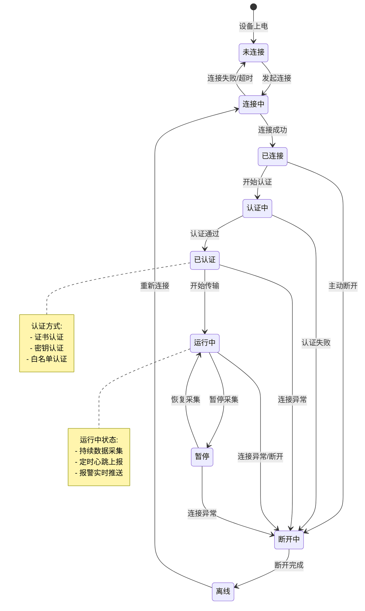
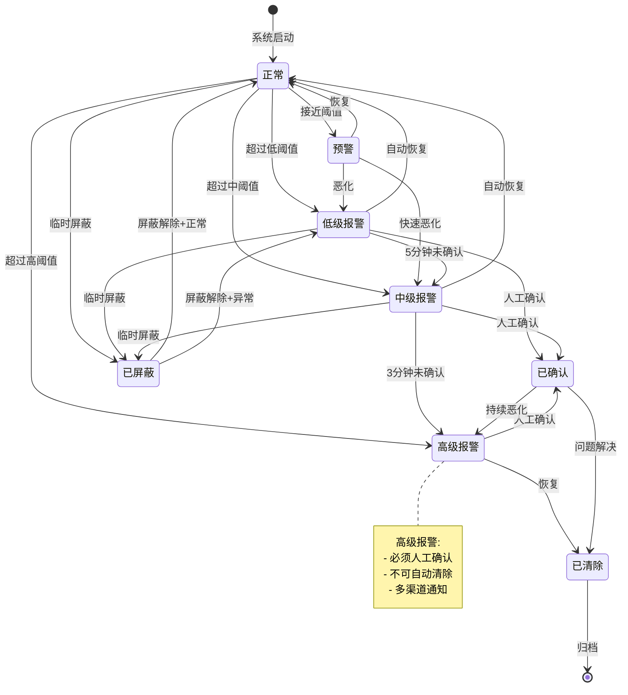
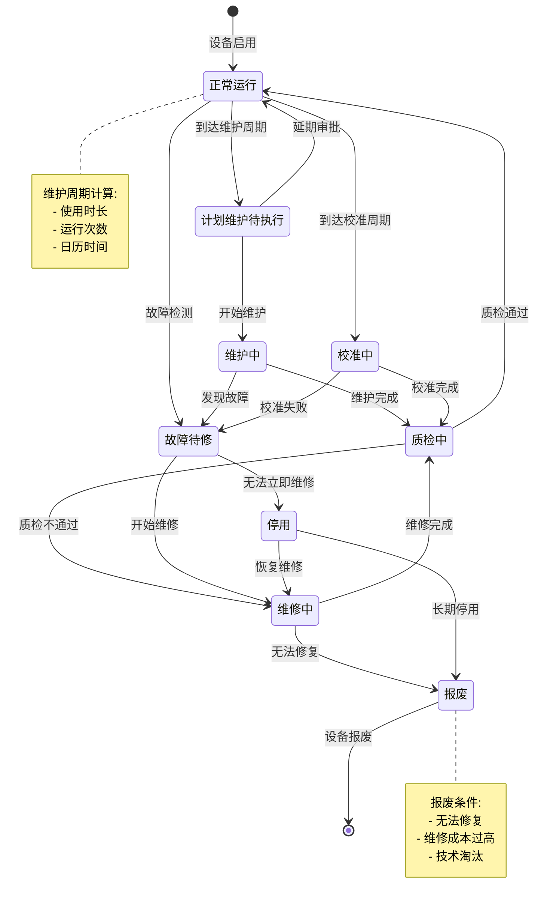
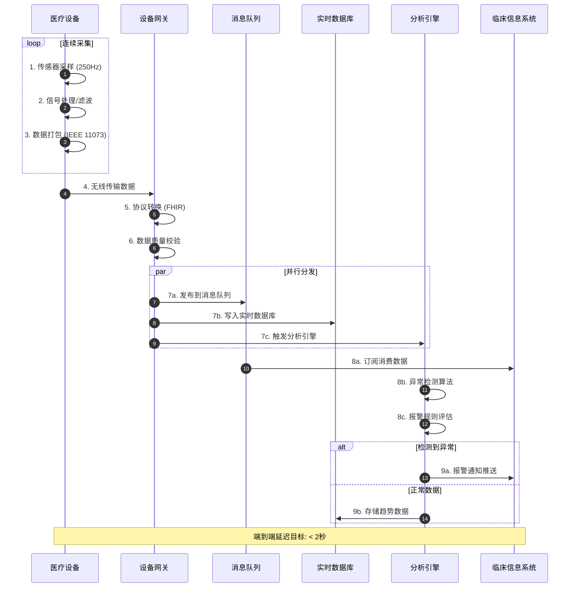
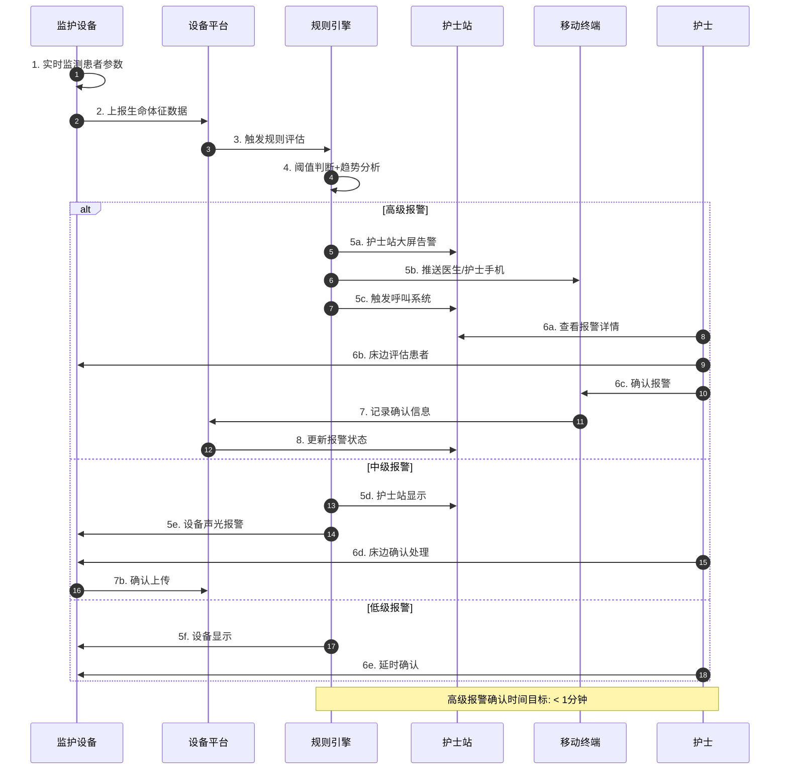
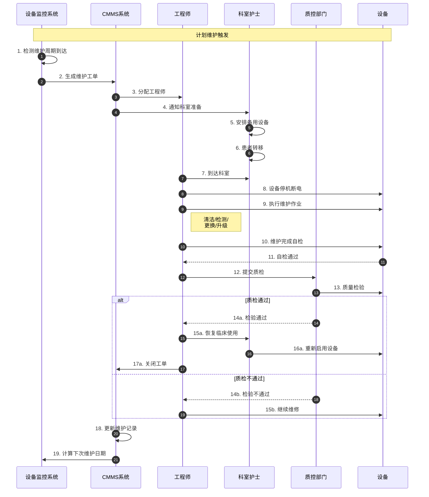
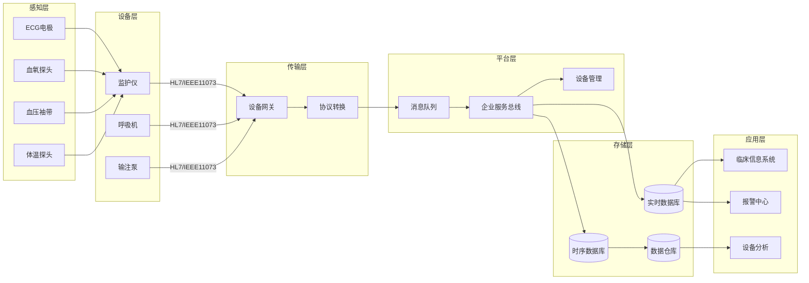
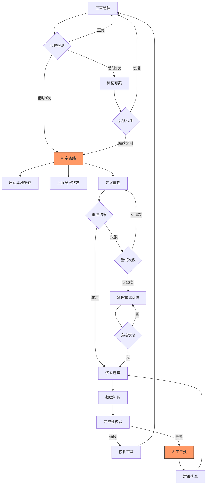
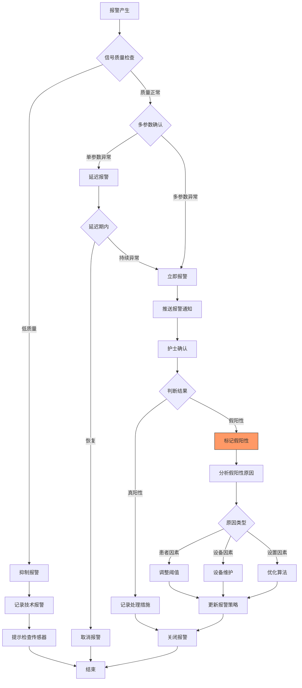
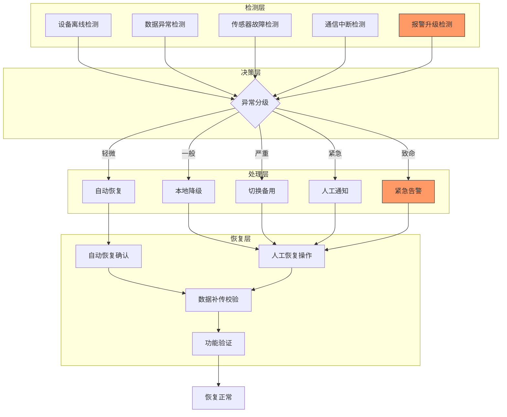

# 医疗设备系统信息表征动态动作分析视图

**版本**: v1.0  
**创建日期**: 2026-02-15  
**标准**: ISO/IEEE 11073, HL7 FHIR Device, IEC 60601, DICOM

---

## 📑 目录

- [1. 动态动作分析概述](#1-动态动作分析概述)
- [2. 状态机形式化](#2-状态机形式化)
- [3. 时序交互分析](#3-时序交互分析)
- [4. 数据流分析](#4-数据流分析)
- [5. 实时性分析](#5-实时性分析)
- [6. 异常处理机制](#6-异常处理机制)
- [7. Mermaid动态视图](#7-mermaid动态视图)

---

## 1. 动态动作分析概述

医疗设备系统动态动作分析关注医疗设备在运行时的行为特征，包括：

- **状态转换**: 设备连接、报警、维护等状态间的迁移
- **时序交互**: 设备、网关、服务器、医护人员之间的消息传递
- **数据流动**: 设备数据在各系统组件间的传递路径
- **实时性能**: 满足临床监护要求的采集频率和报警响应时间
- **异常恢复**: 设备故障、通信中断、假阳性报警的处理机制

---

## 2. 状态机形式化

### 2.1 设备连接状态机

```
状态集合: C = {未连接, 连接中, 已连接, 认证中, 已认证, 运行中, 暂停, 断开中, 离线}

状态转换函数:
δ(未连接) = 连接中      (发起连接请求)
δ(连接中) = 已连接      (TCP/蓝牙连接成功)
δ(连接中) = 未连接      (连接超时/失败)
δ(已连接) = 认证中      (开始设备认证)
δ(认证中) = 已认证      (证书/密钥验证通过)
δ(认证中) = 断开中      (认证失败)
δ(已认证) = 运行中      (开始数据传输)
δ(运行中) = 暂停        (临时停止采集)
δ(运行中) = 断开中      (连接异常/主动断开)
δ(暂停) = 运行中        (恢复采集)
δ(断开中) = 离线        (连接关闭完成)
δ(离线) = 连接中        (重新发起连接)

状态不变式:
∀设备: 状态(设备) ∈ C
∀运行中设备: 最后心跳时间 ≤ 当前时间 + 心跳超时阈值
∀已认证设备: 会话有效期 ≥ 当前时间
```

**设备连接状态转换矩阵:**

| 当前状态 | 发起连接 | 连接成功 | 连接失败 | 开始认证 | 认证通过 | 认证失败 | 开始传输 | 暂停采集 | 恢复采集 | 连接异常 | 主动断开 | 重连 |
|---------|---------|---------|---------|---------|---------|---------|---------|---------|---------|---------|---------|-----|
| **未连接** | 连接中 | - | - | - | - | - | - | - | - | - | - | - |
| **连接中** | - | 已连接 | 未连接 | - | - | - | - | - | - | - | - | - |
| **已连接** | - | - | - | 认证中 | - | - | - | - | - | - | 断开中 | - |
| **认证中** | - | - | - | - | 已认证 | 断开中 | - | - | - | - | - | - |
| **已认证** | - | - | - | - | - | - | 运行中 | - | - | - | 断开中 | - |
| **运行中** | - | - | - | - | - | - | - | 暂停 | - | 断开中 | 断开中 | - |
| **暂停** | - | - | - | - | - | - | - | - | 运行中 | 断开中 | 断开中 | - |
| **断开中** | - | - | - | - | - | - | - | - | - | - | - | 离线 |
| **离线** | - | - | - | - | - | - | - | - | - | - | - | 连接中 |

### 2.2 报警状态机

```
报警状态集合: A = {正常, 预警, 低级报警, 中级报警, 高级报警, 已确认, 已清除, 已屏蔽}

状态转换规则:

正常 → 预警         (监测值接近阈值)
正常 → 低级报警     (监测值超过低级阈值)
正常 → 中级报警     (监测值超过中级阈值)
正常 → 高级报警     (监测值超过高级阈值)

预警 → 正常         (监测值恢复正常)
预警 → 低级/中级/高级 (监测值继续恶化)

低级报警 → 已确认   (医护人员确认)
低级报警 → 已清除   (监测值自动恢复)
中级报警 → 已确认   (医护人员确认)
中级报警 → 已清除   (监测值自动恢复)
高级报警 → 已确认   (医护人员确认)
高级报警 → 已清除   (监测值自动恢复)

已确认 → 已清除     (问题解决)
已确认 → 报警级别   (问题持续/恶化)

任意报警状态 → 已屏蔽 (临时屏蔽报警)
已屏蔽 → 正常       (屏蔽解除且监测值正常)
已屏蔽 → 报警状态   (屏蔽解除且监测值异常)

报警升级机制:
低级报警持续 5分钟 未确认 → 自动升级为中级报警
中级报警持续 3分钟 未确认 → 自动升级为高级报警
高级报警必须人工确认，不可自动清除
```

**报警状态转换条件:**

| 转换 | 触发条件 | 执行动作 | 时间限制 |
|-----|---------|---------|---------|
| 正常→预警 | 监测值进入预警区间 | 记录日志 | < 1s |
| 正常→低级报警 | 超过低级阈值 | 声光报警、推送通知 | < 1s |
| 正常→中级报警 | 超过中级阈值 | 声光报警、推送护士站 | < 1s |
| 正常→高级报警 | 超过高级阈值 | 紧急报警、呼叫医生 | < 500ms |
| 报警→已确认 | 医护人员确认 | 停止声光、记录确认人 | < 1s |
| 报警→已清除 | 监测值恢复正常 | 记录恢复时间 | < 1s |
| 低级→中级(升级) | 持续未确认+恶化 | 升级报警级别 | 5分钟 |
| 中级→高级(升级) | 持续未确认+恶化 | 升级报警级别 | 3分钟 |
| 任意→已屏蔽 | 医护人员屏蔽 | 暂停报警输出 | < 1s |

### 2.3 维护状态机

```
维护状态: M = {正常运行, 计划维护待执行, 维护中, 校准中, 故障待修, 维修中, 质检中, 停用, 报废}

状态转换规则:

正常运行 → 计划维护待执行  (到达维护周期)
正常运行 → 故障待修        (设备故障检测)
正常运行 → 校准中          (到达校准周期)

计划维护待执行 → 维护中    (开始维护)
计划维护待执行 → 正常运行  (延期维护审批)

维护中 → 质检中           (维护完成)
维护中 → 故障待修         (发现故障)

校准中 → 质检中           (校准完成)
校准中 → 故障待修         (校准失败)

质检中 → 正常运行         (质检通过)
质检中 → 维修中           (质检不通过)

故障待修 → 维修中         (开始维修)
故障待修 → 停用           (无法立即维修)

维修中 → 质检中           (维修完成)
维修中 → 报废             (无法修复)

停用 → 维修中             (恢复维修)
停用 → 报废               (长期停用)

报废 → [*]                (设备报废)

维护周期计算:
计划维护日期 = 上次维护日期 + 维护间隔
维护间隔基于: 设备使用时长 / 运行次数 / 日历时间 (取最先到达)
```

---

## 3. 时序交互分析

### 3.1 设备数据采集流程

```
参与方:
- 医疗设备 (Device)
- 设备网关 (Gateway)
- 消息队列 (MQ)
- 数据存储 (Storage)
- 实时分析引擎 (Analytics)
- 临床信息系统 (CIS)

时序流程:

T0: 设备传感器采集生理信号 (采样频率: 250Hz-1000Hz)
T1 = T0 + Δt1: 设备内部信号处理 (滤波/放大/数字化)
T2 = T1 + Δt2: 设备端数据打包 (协议封装: ISO/IEEE 11073)
T3 = T2 + Δt3: 无线/有线传输至网关 (WiFi/BLE/5G)
T4 = T3 + Δt4: 网关协议转换 (设备协议 → FHIR/JSON)
T5 = T4 + Δt5: 数据质量校验 (完整性/合理性)

并行分发:
T6a = T5 + Δt6: 写入实时数据流 (Kafka/MQTT)
T6b = T5 + Δt6: 写入时序数据库 (InfluxDB/TDengine)
T6c = T5 + Δt6: 触发实时分析引擎

T7a = T6a + Δt7: CIS订阅消费数据
T7b = T6c + Δt7: 异常检测算法执行
T7c = T6c + Δt7: 报警规则评估

T8 = T7c + Δt8: 报警通知推送

总延迟目标: T_total = ΣΔti < 2s (从采集到展示)
```

### 3.2 报警响应流程

```
报警响应时序模型:

阶段1: 报警检测 (T0)
- 实时数据流进入规则引擎
- 多参数联合分析 (HR + SpO2 + BP)
- 趋势预测分析 (恶化趋势预警)

阶段2: 报警分级 (T0 + < 500ms)
- 根据阈值判定报警级别
- 根据患者病情调整报警敏感度
- 生成报警事件 (ID、时间、级别、参数)

阶段3: 报警分发 (T0 + < 1s)
- 高级报警: 护士站+医生手机+中央监护 (同步)
- 中级报警: 护士站+床边监护 (同步)
- 低级报警: 床边监护显示 (异步)

阶段4: 报警确认 (T0 + T_acknowledge)
- 护士/医生查看报警
- 评估患者状况
- 执行报警确认操作
- 记录确认时间和确认人

阶段5: 报警处理 (T0 + T_response)
- 根据报警原因采取措施
- 调整治疗参数
- 通知医生进一步处理
- 记录处理措施

阶段6: 报警关闭 (T0 + T_resolve)
- 监测参数恢复正常
- 报警自动清除
- 记录报警持续时间和处理结果

响应时间要求:
- 高级报警确认时间: < 1分钟
- 中级报警确认时间: < 2分钟
- 低级报警确认时间: < 5分钟
```

### 3.3 维护工单流程

```
维护工单时序模型:

参与方:
- 设备监控系统 (Monitor)
- 维护管理系统 (CMMS)
- 工程师 (Engineer)
- 科室护士 (Nurse)
- 质控部门 (QC)

阶段1: 维护触发
- T0: 到达计划维护日期
- T1 = T0 + Δt1: 系统自动生成维护工单
- T2 = T1 + Δt2: 分配工程师、通知科室

阶段2: 维护准备 (T1 + 1-2天)
- 科室护士: 安排备用设备
- 工程师: 准备维护工具、备件
- 患者: 转移至备用设备

阶段3: 维护执行
- T3: 工程师到达科室
- T4 = T3 + Δt4: 设备停机、断电
- T5 = T4 + Δt5: 执行维护作业
  - 清洁消毒
  - 功能检测
  - 易损件更换
  - 软件升级
- T6 = T5 + Δt6: 维护完成、自检

阶段4: 质量检验
- T7 = T6 + Δt7: 提交质检
- T8 = T7 + Δt8: 质控部门检验
- T9 = T8 + Δt9: 检验通过/不通过

阶段5: 恢复使用
- T10 = T9 + Δt10: 设备恢复临床使用
- T11 = T10 + Δt11: 更新维护记录
- T12 = T11 + Δt12: 计算下次维护日期

紧急维修流程 (故障触发):
- 从故障报告到工程师到场: < 2小时 (关键设备)
- 从故障报告到设备恢复: < 24小时 (关键设备)
```

---

## 4. 数据流分析

### 4.1 医疗设备数据流

```
医疗设备数据生命周期:

1. 感知层采集
   ┌─────────────────────────────────────────┐
   │ 传感器: ECG电极/血氧探头/血压袖带/体温探头 │
   │   - 生理信号采集 (模拟信号)               │
   │   - 采样率: 125Hz-1000Hz                 │
   │   - 分辨率: 12-24位                      │
   └─────────────────────────────────────────┘
                    │
                    ▼ (模拟信号)
2. 设备层处理
   ┌─────────────────────────────────────────┐
   │ 医疗设备: 监护仪/呼吸机/输注泵            │
   │   - 信号放大与滤波                        │
   │   - A/D转换                               │
   │   - 波形分析 (如: QRS检测)                │
   │   - 报警阈值判断                          │
   └─────────────────────────────────────────┘
                    │
                    ▼ (数字信号)
3. 传输层通信
   ┌─────────────────────────────────────────┐
   │ 通信协议: HL7 FHIR / IEEE 11073 / DICOM  │
   │   - 数据封装与编码                        │
   │   - 加密传输 (TLS)                        │
   │   - 网络传输 (WiFi/5G/有线)               │
   └─────────────────────────────────────────┘
                    │
                    ▼ (网络数据包)
4. 平台层处理
   ┌─────────────────────────────────────────┐
   │ 设备集成平台:                             │
   │   - 协议转换与标准化                      │
   │   - 数据路由与分发                        │
   │   - 设备管理与监控                        │
   └─────────────────────────────────────────┘
                    │
                    ▼ (标准化数据)
5. 应用层消费
   ┌─────────────────────────────────────────┐
   │ 临床应用:                                 │
   │   - 中央监护系统                          │
   │   - 电子病历集成                          │
   │   - 临床决策支持                          │
   │   - 科研数据分析                          │
   └─────────────────────────────────────────┘
```

### 4.2 报警数据流分析

```
报警数据流处理:

报警产生阶段:
┌─────────────────────────────────────────────────────────────┐
│ 设备端报警生成:                                              │
│   - 单参数阈值判断 (HR < 60 或 HR > 100)                      │
│   - 多参数联合判断 (HR↓ + BP↓ = 休克预警)                     │
│   - 技术报警 (导联脱落、传感器故障)                           │
└─────────────────────────────────────────────────────────────┘
                              │
                              ▼
报警传输阶段:
┌─────────────────────────────────────────────────────────────┐
│ 报警消息封装:                                                │
│   Header: 设备ID、患者ID、时间戳、优先级                       │
│   Body: 报警类型、参数值、阈值、持续时间                        │
│   Context: 患者位置、责任护士、主管医生                        │
└─────────────────────────────────────────────────────────────┘
                              │
                              ▼
报警处理阶段:
┌─────────────────────────────────────────────────────────────┐
│ 报警智能处理:                                                │
│   - 去重合并 (相同原因报警合并)                               │
│   - 优先级调整 (根据患者病情分级)                              │
│   - 路由决策 (根据报警级别分发)                               │
│   - 升级策略 (超时未确认自动升级)                              │
└─────────────────────────────────────────────────────────────┘
                              │
                              ▼
报警分发阶段:
┌─────────────────────────────────────────────────────────────┐
│ 多渠道通知:                                                  │
│   高级报警: 护士站大屏 + 床头设备 + 移动终端 + 呼叫系统         │
│   中级报警: 护士站大屏 + 床头设备                             │
│   低级报警: 床头设备显示                                      │
│   技术报警: 设备管理系统 + 维修工单                           │
└─────────────────────────────────────────────────────────────┘
```

### 4.3 数据流熵变分析

```
医疗设备数据在系统中的熵变:

原始生理信号:    H ≈ 2048 bits/s (高分辨率波形数据)
     │
     │ 信号处理
     ▼
提取特征值:      H ≈ 256 bits/s (HR/SpO2/BP数值)
     │
     │ 临床解读
     ▼
临床参数:        H ≈ 64 bits/s (生命体征数值)
     │
     │ 报警判断
     ▼
报警事件:        H ≈ 16 bits (报警类型+级别)
     │
     │ 汇总统计
     ▼
趋势指标:        H ≈ 8 bits (状态评估)

数据压缩策略:
1. 波形数据: 实时传输原始数据，历史存储压缩(10:1)
2. 趋势数据: 1分钟/5分钟/1小时多级汇总
3. 报警数据: 全量保存，用于质量分析

数据质量保证:
1. 信号质量指数 (SQI) 标记
2. 异常值检测与剔除
3. 数据连续性检查
4. 时间同步精度 < 10ms
```

---

## 5. 实时性分析

### 5.1 生命体征监测频率要求

```
监测参数采样频率标准:

参数           │ 临床需求    │ 设备采样率   │ 传输频率    │ 存储频率
───────────────┼────────────┼─────────────┼────────────┼──────────
心电(ECG)      │ 连续       │ 250-1000Hz  │ 实时流      │ 1-250Hz
心率(HR)       │ 连续       │ 由ECG导出    │ 1s         │ 1s
血氧(SpO2)     │ 连续       │ 100Hz       │ 1s         │ 1s
血压(NIBP)     │ 周期性      │ -           │ 测量时      │ 每次测量
有创血压(IBP)  │ 连续       │ 125-1000Hz  │ 实时流      │ 125Hz
体温(Temp)     │ 连续       │ 1Hz         │ 1min       │ 1min
呼吸(RESP)     │ 连续       │ 50Hz        │ 1s         │ 1s
呼末CO2(EtCO2) │ 连续       │ 100Hz       │ 1s         │ 1s

采样定理应用:
- 心电信号: 最高频率100Hz，采样率≥250Hz (2.5倍余量)
- 血氧波形: 最高频率20Hz，采样率≥100Hz (5倍余量)
- 有创血压: 最高频率50Hz，采样率≥125Hz (2.5倍余量)

数据传输延迟要求:
- 实时波形显示: < 500ms
- 生命体征数值: < 2s
- 报警传输延迟: < 1s
```

### 5.2 报警响应时间分析

```
报警响应时间分解:

总响应时间 = 检测延迟 + 传输延迟 + 处理延迟 + 通知延迟 + 人工响应

检测延迟 (T_detect):
- 数据采集周期: 1s (生命体征)
- 算法分析时间: 10-100ms
- 趋势预测窗口: 5-30s (预警)
- 小计: 1-30s

传输延迟 (T_transmit):
- 设备到网关: 10-50ms
- 网关到平台: 5-20ms
- 平台内传输: 1-5ms
- 小计: 16-75ms

处理延迟 (T_process):
- 规则引擎评估: 5-20ms
- 报警分级判断: 1-5ms
- 路由决策: 1-5ms
- 小计: 7-30ms

通知延迟 (T_notify):
- 消息推送: 50-200ms
- 网络到达: 50-500ms
- 设备唤醒: 100-500ms (移动端)
- 小计: 200ms-1.2s

人工响应 (T_human):
- 高级报警: 目标 < 1分钟 (99%)
- 中级报警: 目标 < 2分钟 (95%)
- 低级报警: 目标 < 5分钟 (90%)

端到端总延迟 (自动部分): < 2s
```

### 5.3 设备校准周期分析

```
设备校准要求:

设备类型       │ 校准项目           │ 校准周期    │ 校准时间    │ 精度要求
───────────────┼───────────────────┼────────────┼────────────┼─────────
多参数监护仪    │ ECG/SpO2/NIBP     │ 1年        │ 2-4小时    │ ±3%
呼吸机         │ 潮气量/气道压/氧浓度 │ 6个月      │ 4-8小时    │ ±5%
输注泵         │ 流速精度           │ 6个月      │ 1-2小时    │ ±2%
除颤监护仪      │ 除颤能量/ECG       │ 1年        │ 2-4小时    │ ±3%
血气分析仪      │ pH/PO2/PCO2        │ 每日质控    │ 30分钟     │ ±1%
超声诊断仪      │ 图像质量/测量精度   │ 1年        │ 4-8小时    ±5%

校准触发条件:
1. 计划校准: 按固定周期执行
2. 事件校准: 维修后、移动后、异常检测后
3. 法规校准: 计量法规要求 (强制检定)

校准数据管理:
- 校准前读数: 记录设备当前状态
- 校准后读数: 记录校准调整量
- 校准证书: 电子存档，可追溯
- 下次校准日期: 自动计算提醒

校准超期处理:
- 预警: 校准前7天提醒
- 警告: 校准当天限制部分功能
- 停用: 超期7天自动停用
```

### 5.4 系统吞吐量计算

```
系统容量规划:

数据量估算 (1000床三甲医院):

设备数量:
- 多参数监护仪: 800台
- 呼吸机: 150台
- 输注泵: 1000台
- 其他设备: 500台
- 总计: 2450台设备

数据吞吐:
- 每台监护仪: 250Hz × 4通道 = 1000点/秒
- 实时数据总量: 800 × 1000 = 800,000点/秒
- 加上其他设备数据: ≈ 1,000,000点/秒

报警事件:
- 每台设备平均报警: 50次/天
- 日报警总量: 2450 × 50 = 122,500次
- 峰值报警率: 10次/秒 (早晨交接班时段)

存储需求:
- 波形数据: 1TB/天 (压缩后)
- 报警数据: 10GB/天
- 趋势数据: 5GB/天
- 年存储总量: ≈ 400TB

网络带宽:
- 单台监护仪: 10KB/s
- 总带宽需求: 800 × 10KB = 8MB/s = 64Mbps
- 设计冗余 (3倍): 200Mbps
```

---

## 6. 异常处理机制

### 6.1 设备故障处理

```
设备故障分类处理:

故障级别       │ 故障类型              │ 检测方式       │ 处理流程                      │ 恢复时间
───────────────┼──────────────────────┼───────────────┼─────────────────────────────┼─────────
轻微故障       │ 单导联脱落/传感器松动   │ 自动检测       │ 提示护士重新连接              │ < 5分钟
一般故障       │ 测量异常/通信中断      │ 自动检测       │ 切换备用设备/重启设备          │ < 30分钟
严重故障       │ 设备宕机/硬件损坏      │ 自动+人工      │ 启用备用设备、报修             │ < 2小时
致命故障       │ 安全关键功能失效        │ 自动检测       │ 立即停用、患者转移、紧急维修    │ < 1小时

故障检测机制:
1. 心跳检测: 设备每5秒发送心跳，超时3次标记离线
2. 数据质量检测: 信号质量指数(SQI)低于阈值报警
3. 自检程序: 设备开机和执行周期性自检
4. 异常模式识别: AI检测异常波形/参数模式

故障恢复流程:
1. 故障检测 → 2. 故障分级 → 3. 报警通知 → 4. 应急响应
5. 故障记录 → 6. 维修工单 → 7. 维修执行 → 8. 质检恢复

降级运行策略:
- 部分传感器故障: 其他参数继续监测
- 通信故障: 本地存储，恢复后补传
- 显示故障: 核心监测功能继续运行
- 电源故障: 切换电池，启动低功耗模式
```

### 6.2 通信中断处理

```
通信中断处理机制:

中断类型       │ 检测方式              │ 自动处理       │ 人工介入      │ 恢复策略
───────────────┼──────────────────────┼───────────────┼──────────────┼─────────
网络抖动       │ 延迟检测             │ 缓冲重传       │ 无需介入       │ 自动恢复
网络中断       │ 连接超时             │ 本地缓存       │ 网络排查       │ 重连同步
网关故障       │ 健康检查             │ 切换备用网关    │ 网关维修       │ 自动切换
服务器故障     │ 心跳检测             │ 降级本地模式    │ 服务器恢复     │ 数据补传

数据完整性保障:
1. 本地缓存: 设备端缓存24小时数据
2. 断点续传: 恢复后自动补传缺失数据
3. 数据校验: MD5校验确保传输完整
4. 时序对齐: NTP时间同步确保数据时序

通信冗余设计:
- 双网卡: 有线网络 + WiFi备份
- 多网关: 至少2个接入网关
- 负载均衡: 自动分发到可用通道
- 优先级队列: 报警数据优先传输

中断恢复流程:
1. 检测中断 → 2. 标记离线 → 3. 本地缓存启动
4. 尝试重连 → 5. 连接恢复 → 6. 数据补传
7. 完整性校验 → 8. 恢复正常
```

### 6.3 假阳性报警处理

```
假阳性报警管理策略:

假阳性来源分析:
1. 患者因素: 运动干扰、体位改变、生理变异
2. 设备因素: 传感器接触不良、电磁干扰
3. 设置因素: 阈值设置过严、个体差异未调整
4. 算法因素: 算法敏感度、缺乏上下文理解

假阳性率目标:
- 总体假阳性率: < 10%
- 技术报警假阳性: < 5%
- 临床报警假阳性: < 15%

假阳性处理流程:
```
报警产生 → 护士确认 → 判断假阳性 → 记录原因 → 算法学习
```

减少假阳性策略:

1. 智能阈值调整:
   - 基于患者基线自动调整
   - 基于昼夜节律调整
   - 基于活动状态调整

2. 多参数联合确认:
   - 单参数异常 → 延迟报警
   - 多参数异常 → 立即报警
   - 上下文关联分析

3. 信号质量评估:
   - 低质量信号 → 抑制报警
   - 传感器脱落 → 技术报警
   - 运动检测 → 暂停报警

4. 机器学习优化:
   - 历史报警分析
   - 假阳性模式识别
   - 预测性报警调整

报警疲劳缓解:
- 分组报警: 同一原因合并通知
- 优先级排序: 重要报警优先显示
- 个性化设置: 根据科室特点定制
- 持续优化: 定期审查报警设置
```

### 6.4 异常处理决策矩阵

```
异常场景分类与处理:

异常类型          │ 检测方式       │ 自动处理       │ 人工介入      │ 通知方式
─────────────────┼───────────────┼───────────────┼──────────────┼──────────
设备离线          │ 心跳超时      │ 标记离线       │ 检查设备       │ 界面+日志
数据异常          │ 范围检查      │ 标记可疑       │ 确认数据       │ 界面提示
传感器脱落        │ 阻抗检测      │ 技术报警       │ 重新连接       │ 声光报警
通信中断          │ 连接检测      │ 本地缓存       │ 网络排查       │ 运维告警
报警升级          │ 超时检测      │ 自动升级       │ 紧急处理       │ 多渠道告警
设备故障          │ 自检异常      │ 停用设备       │ 维修调度       │ 紧急告警
假阳性报警        │ 模式识别      │ 抑制重复       │ 确认标记       │ 记录分析
校准超期          │ 日期检查      │ 功能限制       │ 安排校准       │ 提前提醒
电池低电量        │ 电量检测      │ 低功耗模式     │ 充电/换电      │ 界面提醒

异常恢复验证:
1. 自动恢复: 持续监控确认
2. 人工恢复: 操作确认流程
3. 数据验证: 补传数据校验
4. 功能验证: 自检通过后恢复
```

---

## 7. Mermaid动态视图

### 7.1 设备连接状态机图



### 7.2 报警状态机图



### 7.3 维护状态机图



### 7.4 设备数据采集流程时序图



### 7.5 报警响应流程时序图



### 7.6 维护工单流程时序图



### 7.7 医疗设备数据流图



### 7.8 通信中断处理流程图



### 7.9 假阳性报警处理流程图



### 7.10 异常处理总体流程图



---

**参考文档**:

- `01_Overview.md` - 医疗设备系统概述
- `02_Formal_Definition.md` - 形式化定义
- `04_Transformation.md` - 模型转换
- `05_Case_Studies.md` - 案例研究
- ISO/IEEE 11073 标准
- HL7 FHIR Device 资源规范
- IEC 60601 医用电气设备安全标准

**维护者**: DSL Schema研究团队
