# 医疗健康Schema思维导图

## 📑 目录

- [医疗健康Schema思维导图](#医疗健康schema思维导图)
  - [📑 目录](#-目录)
  - [1. 思维导图概述](#1-思维导图概述)
    - [1.1 导图结构](#11-导图结构)
    - [1.2 核心概念](#12-核心概念)
    - [1.3 关联主题](#13-关联主题)
  - [2. 完整思维导图](#2-完整思维导图)
  - [3. 主要分支详解](#3-主要分支详解)
    - [3.1 医院信息系统](#31-医院信息系统)
    - [3.2 临床系统](#32-临床系统)
    - [3.3 区域医疗](#33-区域医疗)
    - [3.4 医疗物联网](#34-医疗物联网)
    - [3.5 医疗AI](#35-医疗ai)
  - [4. Mermaid可视化](#4-mermaid可视化)
    - [4.1 思维导图Mermaid图](#41-思维导图mermaid图)
    - [4.2 关联主题图](#42-关联主题图)

---

## 1. 思维导图概述

本文档以思维导图的形式展示医疗健康Schema
的知识体系结构，帮助理解各个子领域之间的关系。

### 1.1 导图结构

思维导图分为以下主要分支：

1. **医院信息系统**: HIS系统, 电子病历EMR, LIS检验...
2. **临床系统**: CPOE医嘱, 临床路径, 护理系统...
3. **区域医疗**: 医联体, 分级诊疗, 远程医疗...
4. **医疗物联网**: 智能监护, 医疗设备, 药品管理...
5. **医疗AI**: 影像诊断, 辅助决策, 药物研发...

### 1.2 核心概念

医疗健康Schema的核心概念包括：

- **Schema定义**: 领域特定的数据结构和语义规范
- **标准化**: 遵循行业标准和最佳实践
- **互操作性**: 不同系统之间的数据交换能力
- **可扩展性**: 支持业务增长和变化的能力

### 1.3 关联主题

本主题与以下主题有关联：

- **08_Smart_City**: 智慧城市Schema
- **11_Food_Industry**: 食品工业Schema
- **32_Security_Compliance**: 安全合规Schema

---

## 2. 完整思维导图

```text
医疗健康Schema
│

├─ 1. 医院信息系统
│   ├─ HIS系统
│   ├─ 电子病历EMR
│   ├─ LIS检验
│   ├─ PACS影像

├─ 2. 临床系统
│   ├─ CPOE医嘱
│   ├─ 临床路径
│   ├─ 护理系统
│   ├─ 手术麻醉

├─ 3. 区域医疗
│   ├─ 医联体
│   ├─ 分级诊疗
│   ├─ 远程医疗
│   ├─ 健康档案

├─ 4. 医疗物联网
│   ├─ 智能监护
│   ├─ 医疗设备
│   ├─ 药品管理
│   ├─ 资产追踪

├─ 5. 医疗AI
│   ├─ 影像诊断
│   ├─ 辅助决策
│   ├─ 药物研发
│   ├─ 智能导诊
│
└─ 标准体系
    ├─ 国际标准
    │   ├─ ISO系列标准
    │   └─ IEC系列标准
    ├─ 行业标准
    │   ├─ 行业协会标准
    │   └─ 事实标准
    └─ 技术规范
        ├─ API规范
        ├─ 数据格式
        └─ 协议规范

├─ 技术架构
    │
    ├─ 数据层
    │   ├─ 数据模型
    │   ├─ 存储方案
    │   └─ 数据治理
    │
    ├─ 服务层
    │   ├─ 业务服务
    │   ├─ 集成服务
    │   └─ 公共服务
    │
    ├─ 应用层
    │   ├─ 业务应用
    │   ├─ 移动应用
    │   └─ 分析应用
    │
    └─ 接入层
        ├─ API网关
        ├─ 消息总线
        └─ 文件交换

├─ 集成模式
    │
    ├─ 系统间集成
    │   ├─ ESB总线
    │   ├─ API集成
    │   └─ 消息队列
    │
    ├─ 数据集成
    │   ├─ ETL流程
    │   ├─ 数据同步
    │   └─ 主数据管理
    │
    └─ 流程集成
        ├─ BPM编排
        ├─ 事件驱动
        └─ 微服务编排

├─ 安全体系
    │
    ├─ 身份认证
    │   ├─ 单点登录
    │   ├─ 多因素认证
    │   └─ 零信任架构
    │
    ├─ 访问控制
    │   ├─ 基于角色RBAC
    │   ├─ 基于属性ABAC
    │   └─ 最小权限原则
    │
    ├─ 数据安全
    │   ├─ 加密存储
    │   ├─ 传输加密
    │   └─ 数据脱敏
    │
    └─ 合规审计
        ├─ 日志记录
        ├─ 合规检查
        └─ 风险评估

└─ 实施方法
    │
    ├─ 方法论
    │   ├─ 敏捷开发
    │   ├─ DevOps
    │   └─ 领域驱动设计
    │
    ├─ 工具链
    │   ├─ 建模工具
    │   ├─ 开发框架
    │   └─ 测试工具
    │
    └─ 最佳实践
        ├─ 设计模式
        ├─ 代码规范
        └─ 运维规范
```

---

## 3. 主要分支详解

### 3.1 医院信息系统

```text
医院信息系统
    ├─ HIS系统
    ├─ 电子病历EMR
    ├─ LIS检验
    ├─ PACS影像
```

### 3.2 临床系统

```text
临床系统
    ├─ CPOE医嘱
    ├─ 临床路径
    ├─ 护理系统
    ├─ 手术麻醉
```

### 3.3 区域医疗

```text
区域医疗
    ├─ 医联体
    ├─ 分级诊疗
    ├─ 远程医疗
    ├─ 健康档案
```

### 3.4 医疗物联网

```text
医疗物联网
    ├─ 智能监护
    ├─ 医疗设备
    ├─ 药品管理
    ├─ 资产追踪
```

### 3.5 医疗AI

```text
医疗AI
    ├─ 影像诊断
    ├─ 辅助决策
    ├─ 药物研发
    ├─ 智能导诊
```


---

## 4. Mermaid可视化

### 4.1 思维导图Mermaid图

```mermaid
mindmap
  root((医疗健康Schema))
      医院信息系统
        HIS系统
        电子病历EMR
        LIS检验
      临床系统
        CPOE医嘱
        临床路径
        护理系统
      区域医疗
        医联体
        分级诊疗
        远程医疗
      医疗物联网
        智能监护
        医疗设备
        药品管理
      医疗AI
        影像诊断
        辅助决策
        药物研发

    标准体系
      国际标准
      行业标准
      技术规范
    技术架构
      数据层
      服务层
      应用层
    安全体系
      身份认证
      访问控制
      数据安全
    关联主题
      08 Smart City
      11 Food Industry
      32 Security Compliance

```



### 4.2 关联主题图

```mermaid
graph LR
    A[医疗健康Schema] --> B[核心技术]
    A --> C[应用领域]
    A --> D[标准规范]

    A -.-> E[08 Smart City]
    A -.-> F[11 Food Industry]
    A -.-> G[32 Security Compliance]

    style A fill:#e1f5ff,stroke:#01579b,stroke-width:2px
```



---

**参考文档**：

- `../README.md` - 主题总览
- `Knowledge_Matrix.md` - 多维知识矩阵

**创建时间**：2026-02-16
**最后更新**：2026-02-16
