# 食品工业Schema思维导图

## 📑 目录

- [食品工业Schema思维导图](#食品工业schema思维导图)
  - [📑 目录](#-目录)
  - [1. 思维导图概述](#1-思维导图概述)
    - [1.1 导图结构](#11-导图结构)
    - [1.2 核心概念](#12-核心概念)
    - [1.3 关联主题](#13-关联主题)
  - [2. 完整思维导图](#2-完整思维导图)
  - [3. 主要分支详解](#3-主要分支详解)
    - [3.1 生产管理](#31-生产管理)
    - [3.2 食品安全](#32-食品安全)
    - [3.3 供应链](#33-供应链)
    - [3.4 智能加工](#34-智能加工)
    - [3.5 营养健康](#35-营养健康)
  - [4. Mermaid可视化](#4-mermaid可视化)
    - [4.1 思维导图Mermaid图](#41-思维导图mermaid图)
    - [4.2 关联主题图](#42-关联主题图)

---

## 1. 思维导图概述

本文档以思维导图的形式展示食品工业Schema
的知识体系结构，帮助理解各个子领域之间的关系。

### 1.1 导图结构

思维导图分为以下主要分支：

1. **生产管理**: 配方管理, 生产排程, 质量检测...
2. **食品安全**: HACCP体系, ISO 22000, 过敏原管理...
3. **供应链**: 原料采购, 冷链物流, 库存管理...
4. **智能加工**: 自动化产线, 机器人包装, 智能分拣...
5. **营养健康**: 营养成分, 功能性食品, 有机食品...

### 1.2 核心概念

食品工业Schema的核心概念包括：

- **Schema定义**: 领域特定的数据结构和语义规范
- **标准化**: 遵循行业标准和最佳实践
- **互操作性**: 不同系统之间的数据交换能力
- **可扩展性**: 支持业务增长和变化的能力

### 1.3 关联主题

本主题与以下主题有关联：

- **10_Healthcare**: 医疗健康Schema
- **22_Agriculture**: 农业Schema
- **07_Logistics_Supply_Chain**: 物流供应链Schema

---

## 2. 完整思维导图

```text
食品工业Schema
│

├─ 1. 生产管理
│   ├─ 配方管理
│   ├─ 生产排程
│   ├─ 质量检测
│   ├─ 批次追溯

├─ 2. 食品安全
│   ├─ HACCP体系
│   ├─ ISO 22000
│   ├─ 过敏原管理
│   ├─ 召回管理

├─ 3. 供应链
│   ├─ 原料采购
│   ├─ 冷链物流
│   ├─ 库存管理
│   ├─ 分销网络

├─ 4. 智能加工
│   ├─ 自动化产线
│   ├─ 机器人包装
│   ├─ 智能分拣
│   ├─ 无菌灌装

├─ 5. 营养健康
│   ├─ 营养成分
│   ├─ 功能性食品
│   ├─ 有机食品
│   ├─ 个性化营养
│
└─ 标准体系
    ├─ 国际标准
    │   ├─ ISO系列标准
    │   └─ IEC系列标准
    ├─ 行业标准
    │   ├─ 行业协会标准
    │   └─ 事实标准
    └─ 技术规范
        ├─ API规范
        ├─ 数据格式
        └─ 协议规范

├─ 技术架构
    │
    ├─ 数据层
    │   ├─ 数据模型
    │   ├─ 存储方案
    │   └─ 数据治理
    │
    ├─ 服务层
    │   ├─ 业务服务
    │   ├─ 集成服务
    │   └─ 公共服务
    │
    ├─ 应用层
    │   ├─ 业务应用
    │   ├─ 移动应用
    │   └─ 分析应用
    │
    └─ 接入层
        ├─ API网关
        ├─ 消息总线
        └─ 文件交换

├─ 集成模式
    │
    ├─ 系统间集成
    │   ├─ ESB总线
    │   ├─ API集成
    │   └─ 消息队列
    │
    ├─ 数据集成
    │   ├─ ETL流程
    │   ├─ 数据同步
    │   └─ 主数据管理
    │
    └─ 流程集成
        ├─ BPM编排
        ├─ 事件驱动
        └─ 微服务编排

├─ 安全体系
    │
    ├─ 身份认证
    │   ├─ 单点登录
    │   ├─ 多因素认证
    │   └─ 零信任架构
    │
    ├─ 访问控制
    │   ├─ 基于角色RBAC
    │   ├─ 基于属性ABAC
    │   └─ 最小权限原则
    │
    ├─ 数据安全
    │   ├─ 加密存储
    │   ├─ 传输加密
    │   └─ 数据脱敏
    │
    └─ 合规审计
        ├─ 日志记录
        ├─ 合规检查
        └─ 风险评估

└─ 实施方法
    │
    ├─ 方法论
    │   ├─ 敏捷开发
    │   ├─ DevOps
    │   └─ 领域驱动设计
    │
    ├─ 工具链
    │   ├─ 建模工具
    │   ├─ 开发框架
    │   └─ 测试工具
    │
    └─ 最佳实践
        ├─ 设计模式
        ├─ 代码规范
        └─ 运维规范
```

---

## 3. 主要分支详解

### 3.1 生产管理

```text
生产管理
    ├─ 配方管理
    ├─ 生产排程
    ├─ 质量检测
    ├─ 批次追溯
```

### 3.2 食品安全

```text
食品安全
    ├─ HACCP体系
    ├─ ISO 22000
    ├─ 过敏原管理
    ├─ 召回管理
```

### 3.3 供应链

```text
供应链
    ├─ 原料采购
    ├─ 冷链物流
    ├─ 库存管理
    ├─ 分销网络
```

### 3.4 智能加工

```text
智能加工
    ├─ 自动化产线
    ├─ 机器人包装
    ├─ 智能分拣
    ├─ 无菌灌装
```

### 3.5 营养健康

```text
营养健康
    ├─ 营养成分
    ├─ 功能性食品
    ├─ 有机食品
    ├─ 个性化营养
```


---

## 4. Mermaid可视化

### 4.1 思维导图Mermaid图

```mermaid
mindmap
  root((食品工业Schema))
      生产管理
        配方管理
        生产排程
        质量检测
      食品安全
        HACCP体系
        ISO 22000
        过敏原管理
      供应链
        原料采购
        冷链物流
        库存管理
      智能加工
        自动化产线
        机器人包装
        智能分拣
      营养健康
        营养成分
        功能性食品
        有机食品

    标准体系
      国际标准
      行业标准
      技术规范
    技术架构
      数据层
      服务层
      应用层
    安全体系
      身份认证
      访问控制
      数据安全
    关联主题
      10 Healthcare
      22 Agriculture
      07 Logistics Supply Chain

```



### 4.2 关联主题图

```mermaid
graph LR
    A[食品工业Schema] --> B[核心技术]
    A --> C[应用领域]
    A --> D[标准规范]

    A -.-> E[10 Healthcare]
    A -.-> F[22 Agriculture]
    A -.-> G[07 Logistics Supply Chain]

    style A fill:#e1f5ff,stroke:#01579b,stroke-width:2px
```



---

**参考文档**：

- `../README.md` - 主题总览
- `Knowledge_Matrix.md` - 多维知识矩阵

**创建时间**：2026-02-16
**最后更新**：2026-02-16
