# 智能家居Schema思维导图

## 📑 目录

- [智能家居Schema思维导图](#智能家居schema思维导图)
  - [📑 目录](#-目录)
  - [1. 思维导图概述](#1-思维导图概述)
    - [1.1 导图结构](#11-导图结构)
    - [1.2 核心概念](#12-核心概念)
    - [1.3 关联主题](#13-关联主题)
  - [2. 完整思维导图](#2-完整思维导图)
  - [3. 主要分支详解](#3-主要分支详解)
    - [3.1 智能照明](#31-智能照明)
    - [3.2 环境控制](#32-环境控制)
    - [3.3 安防系统](#33-安防系统)
    - [3.4 家电控制](#34-家电控制)
    - [3.5 协议标准](#35-协议标准)
  - [4. Mermaid可视化](#4-mermaid可视化)
    - [4.1 思维导图Mermaid图](#41-思维导图mermaid图)
    - [4.2 关联主题图](#42-关联主题图)

---

## 1. 思维导图概述

本文档以思维导图的形式展示智能家居Schema
的知识体系结构，帮助理解各个子领域之间的关系。

### 1.1 导图结构

思维导图分为以下主要分支：

1. **智能照明**: 场景控制, 调光系统, 人体感应...
2. **环境控制**: 智能空调, 新风系统, 温湿度控制...
3. **安防系统**: 智能门锁, 视频监控, 入侵检测...
4. **家电控制**: 语音控制, 远程控制, 能耗管理...
5. **协议标准**: Zigbee, Z-Wave, Matter...

### 1.2 核心概念

智能家居Schema的核心概念包括：

- **Schema定义**: 领域特定的数据结构和语义规范
- **标准化**: 遵循行业标准和最佳实践
- **互操作性**: 不同系统之间的数据交换能力
- **可扩展性**: 支持业务增长和变化的能力

### 1.3 关联主题

本主题与以下主题有关联：

- **08_Smart_City**: 智慧城市Schema
- **31_Emerging_Technologies**: 新兴技术Schema

---

## 2. 完整思维导图

```text
智能家居Schema
│

├─ 1. 智能照明
│   ├─ 场景控制
│   ├─ 调光系统
│   ├─ 人体感应
│   ├─ 自然光调节

├─ 2. 环境控制
│   ├─ 智能空调
│   ├─ 新风系统
│   ├─ 温湿度控制
│   ├─ 空气净化

├─ 3. 安防系统
│   ├─ 智能门锁
│   ├─ 视频监控
│   ├─ 入侵检测
│   ├─ 烟雾报警

├─ 4. 家电控制
│   ├─ 语音控制
│   ├─ 远程控制
│   ├─ 能耗管理
│   ├─ 设备联动

├─ 5. 协议标准
│   ├─ Zigbee
│   ├─ Z-Wave
│   ├─ Matter
│   ├─ HomeKit
│
└─ 标准体系
    ├─ 国际标准
    │   ├─ ISO系列标准
    │   └─ IEC系列标准
    ├─ 行业标准
    │   ├─ 行业协会标准
    │   └─ 事实标准
    └─ 技术规范
        ├─ API规范
        ├─ 数据格式
        └─ 协议规范

├─ 技术架构
    │
    ├─ 数据层
    │   ├─ 数据模型
    │   ├─ 存储方案
    │   └─ 数据治理
    │
    ├─ 服务层
    │   ├─ 业务服务
    │   ├─ 集成服务
    │   └─ 公共服务
    │
    ├─ 应用层
    │   ├─ 业务应用
    │   ├─ 移动应用
    │   └─ 分析应用
    │
    └─ 接入层
        ├─ API网关
        ├─ 消息总线
        └─ 文件交换

├─ 集成模式
    │
    ├─ 系统间集成
    │   ├─ ESB总线
    │   ├─ API集成
    │   └─ 消息队列
    │
    ├─ 数据集成
    │   ├─ ETL流程
    │   ├─ 数据同步
    │   └─ 主数据管理
    │
    └─ 流程集成
        ├─ BPM编排
        ├─ 事件驱动
        └─ 微服务编排

├─ 安全体系
    │
    ├─ 身份认证
    │   ├─ 单点登录
    │   ├─ 多因素认证
    │   └─ 零信任架构
    │
    ├─ 访问控制
    │   ├─ 基于角色RBAC
    │   ├─ 基于属性ABAC
    │   └─ 最小权限原则
    │
    ├─ 数据安全
    │   ├─ 加密存储
    │   ├─ 传输加密
    │   └─ 数据脱敏
    │
    └─ 合规审计
        ├─ 日志记录
        ├─ 合规检查
        └─ 风险评估

└─ 实施方法
    │
    ├─ 方法论
    │   ├─ 敏捷开发
    │   ├─ DevOps
    │   └─ 领域驱动设计
    │
    ├─ 工具链
    │   ├─ 建模工具
    │   ├─ 开发框架
    │   └─ 测试工具
    │
    └─ 最佳实践
        ├─ 设计模式
        ├─ 代码规范
        └─ 运维规范
```

---

## 3. 主要分支详解

### 3.1 智能照明

```text
智能照明
    ├─ 场景控制
    ├─ 调光系统
    ├─ 人体感应
    ├─ 自然光调节
```

### 3.2 环境控制

```text
环境控制
    ├─ 智能空调
    ├─ 新风系统
    ├─ 温湿度控制
    ├─ 空气净化
```

### 3.3 安防系统

```text
安防系统
    ├─ 智能门锁
    ├─ 视频监控
    ├─ 入侵检测
    ├─ 烟雾报警
```

### 3.4 家电控制

```text
家电控制
    ├─ 语音控制
    ├─ 远程控制
    ├─ 能耗管理
    ├─ 设备联动
```

### 3.5 协议标准

```text
协议标准
    ├─ Zigbee
    ├─ Z-Wave
    ├─ Matter
    ├─ HomeKit
```


---

## 4. Mermaid可视化

### 4.1 思维导图Mermaid图

```mermaid
mindmap
  root((智能家居Schema))
      智能照明
        场景控制
        调光系统
        人体感应
      环境控制
        智能空调
        新风系统
        温湿度控制
      安防系统
        智能门锁
        视频监控
        入侵检测
      家电控制
        语音控制
        远程控制
        能耗管理
      协议标准
        Zigbee
        Z-Wave
        Matter

    标准体系
      国际标准
      行业标准
      技术规范
    技术架构
      数据层
      服务层
      应用层
    安全体系
      身份认证
      访问控制
      数据安全
    关联主题
      08 Smart City
      31 Emerging Technologies

```



### 4.2 关联主题图

```mermaid
graph LR
    A[智能家居Schema] --> B[核心技术]
    A --> C[应用领域]
    A --> D[标准规范]

    A -.-> E[08 Smart City]
    A -.-> F[31 Emerging Technologies]

    style A fill:#e1f5ff,stroke:#01579b,stroke-width:2px
```



---

**参考文档**：

- `../README.md` - 主题总览
- `Knowledge_Matrix.md` - 多维知识矩阵

**创建时间**：2026-02-16
**最后更新**：2026-02-16
