# ERP系统Schema思维导图

## 📑 目录

- [ERP系统Schema思维导图](#erp系统schema思维导图)
  - [📑 目录](#-目录)
  - [1. 思维导图概述](#1-思维导图概述)
    - [1.1 导图结构](#11-导图结构)
    - [1.2 核心概念](#12-核心概念)
    - [1.3 关联主题](#13-关联主题)
  - [2. 完整思维导图](#2-完整思维导图)
  - [3. 主要分支详解](#3-主要分支详解)
    - [3.1 财务管理](#31-财务管理)
    - [3.2 供应链管理](#32-供应链管理)
    - [3.3 生产制造](#33-生产制造)
    - [3.4 人力资源](#34-人力资源)
    - [3.5 主流ERP](#35-主流erp)
  - [4. Mermaid可视化](#4-mermaid可视化)
    - [4.1 思维导图Mermaid图](#41-思维导图mermaid图)
    - [4.2 关联主题图](#42-关联主题图)

---

## 1. 思维导图概述

本文档以思维导图的形式展示ERP系统Schema
的知识体系结构，帮助理解各个子领域之间的关系。

### 1.1 导图结构

思维导图分为以下主要分支：

1. **财务管理**: 总账, 应收应付, 固定资产...
2. **供应链管理**: 采购管理, 销售管理, 库存管理...
3. **生产制造**: MRP物料需求, MPS主计划, 车间管理...
4. **人力资源**: 组织架构, 薪酬管理, 考勤管理...
5. **主流ERP**: SAP, Oracle, 用友...

### 1.2 核心概念

ERP系统Schema的核心概念包括：

- **Schema定义**: 领域特定的数据结构和语义规范
- **标准化**: 遵循行业标准和最佳实践
- **互操作性**: 不同系统之间的数据交换能力
- **可扩展性**: 支持业务增长和变化的能力

### 1.3 关联主题

本主题与以下主题有关联：

- **26_Enterprise_Finance**: 企业财务Schema
- **17_Manufacturing**: 制造业Schema
- **18_Retail_Industry**: 零售行业Schema
- **14_Workflow_BPM**: 工作流BPM Schema

---

## 2. 完整思维导图

```text
ERP系统Schema
│

├─ 1. 财务管理
│   ├─ 总账
│   ├─ 应收应付
│   ├─ 固定资产
│   ├─ 成本核算

├─ 2. 供应链管理
│   ├─ 采购管理
│   ├─ 销售管理
│   ├─ 库存管理
│   ├─ 物流管理

├─ 3. 生产制造
│   ├─ MRP物料需求
│   ├─ MPS主计划
│   ├─ 车间管理
│   ├─ 质量管理

├─ 4. 人力资源
│   ├─ 组织架构
│   ├─ 薪酬管理
│   ├─ 考勤管理
│   ├─ 绩效管理

├─ 5. 主流ERP
│   ├─ SAP
│   ├─ Oracle
│   ├─ 用友
│   ├─ 金蝶
│
└─ 标准体系
    ├─ 国际标准
    │   ├─ ISO系列标准
    │   └─ IEC系列标准
    ├─ 行业标准
    │   ├─ 行业协会标准
    │   └─ 事实标准
    └─ 技术规范
        ├─ API规范
        ├─ 数据格式
        └─ 协议规范

├─ 技术架构
    │
    ├─ 数据层
    │   ├─ 数据模型
    │   ├─ 存储方案
    │   └─ 数据治理
    │
    ├─ 服务层
    │   ├─ 业务服务
    │   ├─ 集成服务
    │   └─ 公共服务
    │
    ├─ 应用层
    │   ├─ 业务应用
    │   ├─ 移动应用
    │   └─ 分析应用
    │
    └─ 接入层
        ├─ API网关
        ├─ 消息总线
        └─ 文件交换

├─ 集成模式
    │
    ├─ 系统间集成
    │   ├─ ESB总线
    │   ├─ API集成
    │   └─ 消息队列
    │
    ├─ 数据集成
    │   ├─ ETL流程
    │   ├─ 数据同步
    │   └─ 主数据管理
    │
    └─ 流程集成
        ├─ BPM编排
        ├─ 事件驱动
        └─ 微服务编排

├─ 安全体系
    │
    ├─ 身份认证
    │   ├─ 单点登录
    │   ├─ 多因素认证
    │   └─ 零信任架构
    │
    ├─ 访问控制
    │   ├─ 基于角色RBAC
    │   ├─ 基于属性ABAC
    │   └─ 最小权限原则
    │
    ├─ 数据安全
    │   ├─ 加密存储
    │   ├─ 传输加密
    │   └─ 数据脱敏
    │
    └─ 合规审计
        ├─ 日志记录
        ├─ 合规检查
        └─ 风险评估

└─ 实施方法
    │
    ├─ 方法论
    │   ├─ 敏捷开发
    │   ├─ DevOps
    │   └─ 领域驱动设计
    │
    ├─ 工具链
    │   ├─ 建模工具
    │   ├─ 开发框架
    │   └─ 测试工具
    │
    └─ 最佳实践
        ├─ 设计模式
        ├─ 代码规范
        └─ 运维规范
```

---

## 3. 主要分支详解

### 3.1 财务管理

```text
财务管理
    ├─ 总账
    ├─ 应收应付
    ├─ 固定资产
    ├─ 成本核算
```

### 3.2 供应链管理

```text
供应链管理
    ├─ 采购管理
    ├─ 销售管理
    ├─ 库存管理
    ├─ 物流管理
```

### 3.3 生产制造

```text
生产制造
    ├─ MRP物料需求
    ├─ MPS主计划
    ├─ 车间管理
    ├─ 质量管理
```

### 3.4 人力资源

```text
人力资源
    ├─ 组织架构
    ├─ 薪酬管理
    ├─ 考勤管理
    ├─ 绩效管理
```

### 3.5 主流ERP

```text
主流ERP
    ├─ SAP
    ├─ Oracle
    ├─ 用友
    ├─ 金蝶
```


---

## 4. Mermaid可视化

### 4.1 思维导图Mermaid图

```mermaid
mindmap
  root((ERP系统Schema))
      财务管理
        总账
        应收应付
        固定资产
      供应链管理
        采购管理
        销售管理
        库存管理
      生产制造
        MRP物料需求
        MPS主计划
        车间管理
      人力资源
        组织架构
        薪酬管理
        考勤管理
      主流ERP
        SAP
        Oracle
        用友

    标准体系
      国际标准
      行业标准
      技术规范
    技术架构
      数据层
      服务层
      应用层
    安全体系
      身份认证
      访问控制
      数据安全
    关联主题
      26 Enterprise Finance
      17 Manufacturing
      18 Retail Industry
      14 Workflow BPM

```



### 4.2 关联主题图

```mermaid
graph LR
    A[ERP系统Schema] --> B[核心技术]
    A --> C[应用领域]
    A --> D[标准规范]

    A -.-> E[26 Enterprise Finance]
    A -.-> F[17 Manufacturing]
    A -.-> G[18 Retail Industry]
    A -.-> H[14 Workflow BPM]

    style A fill:#e1f5ff,stroke:#01579b,stroke-width:2px
```



---

**参考文档**：

- `../README.md` - 主题总览
- `Knowledge_Matrix.md` - 多维知识矩阵

**创建时间**：2026-02-16
**最后更新**：2026-02-16
