# 能源行业Schema思维导图

## 📑 目录

- [能源行业Schema思维导图](#能源行业schema思维导图)
  - [📑 目录](#-目录)
  - [1. 思维导图概述](#1-思维导图概述)
    - [1.1 导图结构](#11-导图结构)
    - [1.2 核心概念](#12-核心概念)
    - [1.3 关联主题](#13-关联主题)
  - [2. 完整思维导图](#2-完整思维导图)
  - [3. 主要分支详解](#3-主要分支详解)
    - [3.1 电力系统](#31-电力系统)
    - [3.2 石油天然气](#32-石油天然气)
    - [3.3 新能源](#33-新能源)
    - [3.4 能源管理](#34-能源管理)
    - [3.5 智能计量](#35-智能计量)
  - [4. Mermaid可视化](#4-mermaid可视化)
    - [4.1 思维导图Mermaid图](#41-思维导图mermaid图)
    - [4.2 关联主题图](#42-关联主题图)

---

## 1. 思维导图概述

本文档以思维导图的形式展示能源行业Schema
的知识体系结构，帮助理解各个子领域之间的关系。

### 1.1 导图结构

思维导图分为以下主要分支：

1. **电力系统**: 发电管理, 输配电, 智能电网...
2. **石油天然气**: 勘探开发, 管道运输, 炼化生产...
3. **新能源**: 光伏发电, 风力发电, 储能系统...
4. **能源管理**: EMS系统, 能耗监测, 能效分析...
5. **智能计量**: 智能电表, AMI系统, 需求响应...

### 1.2 核心概念

能源行业Schema的核心概念包括：

- **Schema定义**: 领域特定的数据结构和语义规范
- **标准化**: 遵循行业标准和最佳实践
- **互操作性**: 不同系统之间的数据交换能力
- **可扩展性**: 支持业务增长和变化的能力

### 1.3 关联主题

本主题与以下主题有关联：

- **17_Manufacturing**: 制造业Schema
- **20_Building_Construction**: 建筑工程Schema
- **31_Emerging_Technologies**: 新兴技术Schema

---

## 2. 完整思维导图

```text
能源行业Schema
│

├─ 1. 电力系统
│   ├─ 发电管理
│   ├─ 输配电
│   ├─ 智能电网
│   ├─ 电力交易

├─ 2. 石油天然气
│   ├─ 勘探开发
│   ├─ 管道运输
│   ├─ 炼化生产
│   ├─ 终端销售

├─ 3. 新能源
│   ├─ 光伏发电
│   ├─ 风力发电
│   ├─ 储能系统
│   ├─ 氢能

├─ 4. 能源管理
│   ├─ EMS系统
│   ├─ 能耗监测
│   ├─ 能效分析
│   ├─ 碳排放管理

├─ 5. 智能计量
│   ├─ 智能电表
│   ├─ AMI系统
│   ├─ 需求响应
│   ├─ 负荷预测
│
└─ 标准体系
    ├─ 国际标准
    │   ├─ ISO系列标准
    │   └─ IEC系列标准
    ├─ 行业标准
    │   ├─ 行业协会标准
    │   └─ 事实标准
    └─ 技术规范
        ├─ API规范
        ├─ 数据格式
        └─ 协议规范

├─ 技术架构
    │
    ├─ 数据层
    │   ├─ 数据模型
    │   ├─ 存储方案
    │   └─ 数据治理
    │
    ├─ 服务层
    │   ├─ 业务服务
    │   ├─ 集成服务
    │   └─ 公共服务
    │
    ├─ 应用层
    │   ├─ 业务应用
    │   ├─ 移动应用
    │   └─ 分析应用
    │
    └─ 接入层
        ├─ API网关
        ├─ 消息总线
        └─ 文件交换

├─ 集成模式
    │
    ├─ 系统间集成
    │   ├─ ESB总线
    │   ├─ API集成
    │   └─ 消息队列
    │
    ├─ 数据集成
    │   ├─ ETL流程
    │   ├─ 数据同步
    │   └─ 主数据管理
    │
    └─ 流程集成
        ├─ BPM编排
        ├─ 事件驱动
        └─ 微服务编排

├─ 安全体系
    │
    ├─ 身份认证
    │   ├─ 单点登录
    │   ├─ 多因素认证
    │   └─ 零信任架构
    │
    ├─ 访问控制
    │   ├─ 基于角色RBAC
    │   ├─ 基于属性ABAC
    │   └─ 最小权限原则
    │
    ├─ 数据安全
    │   ├─ 加密存储
    │   ├─ 传输加密
    │   └─ 数据脱敏
    │
    └─ 合规审计
        ├─ 日志记录
        ├─ 合规检查
        └─ 风险评估

└─ 实施方法
    │
    ├─ 方法论
    │   ├─ 敏捷开发
    │   ├─ DevOps
    │   └─ 领域驱动设计
    │
    ├─ 工具链
    │   ├─ 建模工具
    │   ├─ 开发框架
    │   └─ 测试工具
    │
    └─ 最佳实践
        ├─ 设计模式
        ├─ 代码规范
        └─ 运维规范
```

---

## 3. 主要分支详解

### 3.1 电力系统

```text
电力系统
    ├─ 发电管理
    ├─ 输配电
    ├─ 智能电网
    ├─ 电力交易
```

### 3.2 石油天然气

```text
石油天然气
    ├─ 勘探开发
    ├─ 管道运输
    ├─ 炼化生产
    ├─ 终端销售
```

### 3.3 新能源

```text
新能源
    ├─ 光伏发电
    ├─ 风力发电
    ├─ 储能系统
    ├─ 氢能
```

### 3.4 能源管理

```text
能源管理
    ├─ EMS系统
    ├─ 能耗监测
    ├─ 能效分析
    ├─ 碳排放管理
```

### 3.5 智能计量

```text
智能计量
    ├─ 智能电表
    ├─ AMI系统
    ├─ 需求响应
    ├─ 负荷预测
```


---

## 4. Mermaid可视化

### 4.1 思维导图Mermaid图

```mermaid
mindmap
  root((能源行业Schema))
      电力系统
        发电管理
        输配电
        智能电网
      石油天然气
        勘探开发
        管道运输
        炼化生产
      新能源
        光伏发电
        风力发电
        储能系统
      能源管理
        EMS系统
        能耗监测
        能效分析
      智能计量
        智能电表
        AMI系统
        需求响应

    标准体系
      国际标准
      行业标准
      技术规范
    技术架构
      数据层
      服务层
      应用层
    安全体系
      身份认证
      访问控制
      数据安全
    关联主题
      17 Manufacturing
      20 Building Construction
      31 Emerging Technologies

```



### 4.2 关联主题图

```mermaid
graph LR
    A[能源行业Schema] --> B[核心技术]
    A --> C[应用领域]
    A --> D[标准规范]

    A -.-> E[17 Manufacturing]
    A -.-> F[20 Building Construction]
    A -.-> G[31 Emerging Technologies]

    style A fill:#e1f5ff,stroke:#01579b,stroke-width:2px
```



---

**参考文档**：

- `../README.md` - 主题总览
- `Knowledge_Matrix.md` - 多维知识矩阵

**创建时间**：2026-02-16
**最后更新**：2026-02-16
