# 制造业Schema思维导图

## 📑 目录

- [制造业Schema思维导图](#制造业schema思维导图)
  - [📑 目录](#-目录)
  - [1. 思维导图概述](#1-思维导图概述)
    - [1.1 导图结构](#11-导图结构)
    - [1.2 核心概念](#12-核心概念)
    - [1.3 关联主题](#13-关联主题)
  - [2. 完整思维导图](#2-完整思维导图)
  - [3. 主要分支详解](#3-主要分支详解)
    - [3.1 生产计划](#31-生产计划)
    - [3.2 车间执行](#32-车间执行)
    - [3.3 设备管理](#33-设备管理)
    - [3.4 质量管理](#34-质量管理)
    - [3.5 智能制造](#35-智能制造)
  - [4. Mermaid可视化](#4-mermaid可视化)
    - [4.1 思维导图Mermaid图](#41-思维导图mermaid图)
    - [4.2 关联主题图](#42-关联主题图)

---

## 1. 思维导图概述

本文档以思维导图的形式展示制造业Schema
的知识体系结构，帮助理解各个子领域之间的关系。

### 1.1 导图结构

思维导图分为以下主要分支：

1. **生产计划**: APS排程, 工单管理, 产能规划...
2. **车间执行**: MES系统, 工序管理, 质量控制...
3. **设备管理**: TPM管理, 预测维护, 设备台账...
4. **质量管理**: SPC统计, 质量追溯, 不合格品...
5. **智能制造**: 数字孪生, 工业AI, 柔性制造...

### 1.2 核心概念

制造业Schema的核心概念包括：

- **Schema定义**: 领域特定的数据结构和语义规范
- **标准化**: 遵循行业标准和最佳实践
- **互操作性**: 不同系统之间的数据交换能力
- **可扩展性**: 支持业务增长和变化的能力

### 1.3 关联主题

本主题与以下主题有关联：

- **16_Energy_Industry**: 能源行业Schema
- **07_Logistics_Supply_Chain**: 物流供应链Schema
- **15_ERP_Systems**: ERP系统Schema
- **31_Emerging_Technologies**: 新兴技术Schema

---

## 2. 完整思维导图

```text
制造业Schema
│

├─ 1. 生产计划
│   ├─ APS排程
│   ├─ 工单管理
│   ├─ 产能规划
│   ├─ 物料齐套

├─ 2. 车间执行
│   ├─ MES系统
│   ├─ 工序管理
│   ├─ 质量控制
│   ├─ 设备OEE

├─ 3. 设备管理
│   ├─ TPM管理
│   ├─ 预测维护
│   ├─ 设备台账
│   ├─ 备件管理

├─ 4. 质量管理
│   ├─ SPC统计
│   ├─ 质量追溯
│   ├─ 不合格品
│   ├─ 供应商质量

├─ 5. 智能制造
│   ├─ 数字孪生
│   ├─ 工业AI
│   ├─ 柔性制造
│   ├─ 预测性维护
│
└─ 标准体系
    ├─ 国际标准
    │   ├─ ISO系列标准
    │   └─ IEC系列标准
    ├─ 行业标准
    │   ├─ 行业协会标准
    │   └─ 事实标准
    └─ 技术规范
        ├─ API规范
        ├─ 数据格式
        └─ 协议规范

├─ 技术架构
    │
    ├─ 数据层
    │   ├─ 数据模型
    │   ├─ 存储方案
    │   └─ 数据治理
    │
    ├─ 服务层
    │   ├─ 业务服务
    │   ├─ 集成服务
    │   └─ 公共服务
    │
    ├─ 应用层
    │   ├─ 业务应用
    │   ├─ 移动应用
    │   └─ 分析应用
    │
    └─ 接入层
        ├─ API网关
        ├─ 消息总线
        └─ 文件交换

├─ 集成模式
    │
    ├─ 系统间集成
    │   ├─ ESB总线
    │   ├─ API集成
    │   └─ 消息队列
    │
    ├─ 数据集成
    │   ├─ ETL流程
    │   ├─ 数据同步
    │   └─ 主数据管理
    │
    └─ 流程集成
        ├─ BPM编排
        ├─ 事件驱动
        └─ 微服务编排

├─ 安全体系
    │
    ├─ 身份认证
    │   ├─ 单点登录
    │   ├─ 多因素认证
    │   └─ 零信任架构
    │
    ├─ 访问控制
    │   ├─ 基于角色RBAC
    │   ├─ 基于属性ABAC
    │   └─ 最小权限原则
    │
    ├─ 数据安全
    │   ├─ 加密存储
    │   ├─ 传输加密
    │   └─ 数据脱敏
    │
    └─ 合规审计
        ├─ 日志记录
        ├─ 合规检查
        └─ 风险评估

└─ 实施方法
    │
    ├─ 方法论
    │   ├─ 敏捷开发
    │   ├─ DevOps
    │   └─ 领域驱动设计
    │
    ├─ 工具链
    │   ├─ 建模工具
    │   ├─ 开发框架
    │   └─ 测试工具
    │
    └─ 最佳实践
        ├─ 设计模式
        ├─ 代码规范
        └─ 运维规范
```

---

## 3. 主要分支详解

### 3.1 生产计划

```text
生产计划
    ├─ APS排程
    ├─ 工单管理
    ├─ 产能规划
    ├─ 物料齐套
```

### 3.2 车间执行

```text
车间执行
    ├─ MES系统
    ├─ 工序管理
    ├─ 质量控制
    ├─ 设备OEE
```

### 3.3 设备管理

```text
设备管理
    ├─ TPM管理
    ├─ 预测维护
    ├─ 设备台账
    ├─ 备件管理
```

### 3.4 质量管理

```text
质量管理
    ├─ SPC统计
    ├─ 质量追溯
    ├─ 不合格品
    ├─ 供应商质量
```

### 3.5 智能制造

```text
智能制造
    ├─ 数字孪生
    ├─ 工业AI
    ├─ 柔性制造
    ├─ 预测性维护
```


---

## 4. Mermaid可视化

### 4.1 思维导图Mermaid图

```mermaid
mindmap
  root((制造业Schema))
      生产计划
        APS排程
        工单管理
        产能规划
      车间执行
        MES系统
        工序管理
        质量控制
      设备管理
        TPM管理
        预测维护
        设备台账
      质量管理
        SPC统计
        质量追溯
        不合格品
      智能制造
        数字孪生
        工业AI
        柔性制造

    标准体系
      国际标准
      行业标准
      技术规范
    技术架构
      数据层
      服务层
      应用层
    安全体系
      身份认证
      访问控制
      数据安全
    关联主题
      16 Energy Industry
      07 Logistics Supply Chain
      15 ERP Systems
      31 Emerging Technologies

```



### 4.2 关联主题图

```mermaid
graph LR
    A[制造业Schema] --> B[核心技术]
    A --> C[应用领域]
    A --> D[标准规范]

    A -.-> E[16 Energy Industry]
    A -.-> F[07 Logistics Supply Chain]
    A -.-> G[15 ERP Systems]
    A -.-> H[31 Emerging Technologies]

    style A fill:#e1f5ff,stroke:#01579b,stroke-width:2px
```



---

**参考文档**：

- `../README.md` - 主题总览
- `Knowledge_Matrix.md` - 多维知识矩阵

**创建时间**：2026-02-16
**最后更新**：2026-02-16
