# 零售行业Schema思维导图

## 📑 目录

- [零售行业Schema思维导图](#零售行业schema思维导图)
  - [📑 目录](#-目录)
  - [1. 思维导图概述](#1-思维导图概述)
    - [1.1 导图结构](#11-导图结构)
    - [1.2 核心概念](#12-核心概念)
    - [1.3 关联主题](#13-关联主题)
  - [2. 完整思维导图](#2-完整思维导图)
  - [3. 主要分支详解](#3-主要分支详解)
    - [3.1 门店运营](#31-门店运营)
    - [3.2 电商系统](#32-电商系统)
    - [3.3 全渠道](#33-全渠道)
    - [3.4 供应链](#34-供应链)
    - [3.5 营销系统](#35-营销系统)
  - [4. Mermaid可视化](#4-mermaid可视化)
    - [4.1 思维导图Mermaid图](#41-思维导图mermaid图)
    - [4.2 关联主题图](#42-关联主题图)

---

## 1. 思维导图概述

本文档以思维导图的形式展示零售行业Schema
的知识体系结构，帮助理解各个子领域之间的关系。

### 1.1 导图结构

思维导图分为以下主要分支：

1. **门店运营**: POS系统, 收银管理, 库存管理...
2. **电商系统**: 电商平台, 购物车, 支付集成...
3. **全渠道**: O2O融合, 库存共享, 统一会员...
4. **供应链**: 采购管理, 配送中心, 补货优化...
5. **营销系统**: CRM系统, 促销活动, 精准营销...

### 1.2 核心概念

零售行业Schema的核心概念包括：

- **Schema定义**: 领域特定的数据结构和语义规范
- **标准化**: 遵循行业标准和最佳实践
- **互操作性**: 不同系统之间的数据交换能力
- **可扩展性**: 支持业务增长和变化的能力

### 1.3 关联主题

本主题与以下主题有关联：

- **15_ERP_Systems**: ERP系统Schema
- **07_Logistics_Supply_Chain**: 物流供应链Schema
- **19_Transportation**: 交通运输Schema

---

## 2. 完整思维导图

```text
零售行业Schema
│

├─ 1. 门店运营
│   ├─ POS系统
│   ├─ 收银管理
│   ├─ 库存管理
│   ├─ 会员管理

├─ 2. 电商系统
│   ├─ 电商平台
│   ├─ 购物车
│   ├─ 支付集成
│   ├─ 订单履约

├─ 3. 全渠道
│   ├─ O2O融合
│   ├─ 库存共享
│   ├─ 统一会员
│   ├─ 价格管理

├─ 4. 供应链
│   ├─ 采购管理
│   ├─ 配送中心
│   ├─ 补货优化
│   ├─ 供应商协同

├─ 5. 营销系统
│   ├─ CRM系统
│   ├─ 促销活动
│   ├─ 精准营销
│   ├─ 忠诚度计划
│
└─ 标准体系
    ├─ 国际标准
    │   ├─ ISO系列标准
    │   └─ IEC系列标准
    ├─ 行业标准
    │   ├─ 行业协会标准
    │   └─ 事实标准
    └─ 技术规范
        ├─ API规范
        ├─ 数据格式
        └─ 协议规范

├─ 技术架构
    │
    ├─ 数据层
    │   ├─ 数据模型
    │   ├─ 存储方案
    │   └─ 数据治理
    │
    ├─ 服务层
    │   ├─ 业务服务
    │   ├─ 集成服务
    │   └─ 公共服务
    │
    ├─ 应用层
    │   ├─ 业务应用
    │   ├─ 移动应用
    │   └─ 分析应用
    │
    └─ 接入层
        ├─ API网关
        ├─ 消息总线
        └─ 文件交换

├─ 集成模式
    │
    ├─ 系统间集成
    │   ├─ ESB总线
    │   ├─ API集成
    │   └─ 消息队列
    │
    ├─ 数据集成
    │   ├─ ETL流程
    │   ├─ 数据同步
    │   └─ 主数据管理
    │
    └─ 流程集成
        ├─ BPM编排
        ├─ 事件驱动
        └─ 微服务编排

├─ 安全体系
    │
    ├─ 身份认证
    │   ├─ 单点登录
    │   ├─ 多因素认证
    │   └─ 零信任架构
    │
    ├─ 访问控制
    │   ├─ 基于角色RBAC
    │   ├─ 基于属性ABAC
    │   └─ 最小权限原则
    │
    ├─ 数据安全
    │   ├─ 加密存储
    │   ├─ 传输加密
    │   └─ 数据脱敏
    │
    └─ 合规审计
        ├─ 日志记录
        ├─ 合规检查
        └─ 风险评估

└─ 实施方法
    │
    ├─ 方法论
    │   ├─ 敏捷开发
    │   ├─ DevOps
    │   └─ 领域驱动设计
    │
    ├─ 工具链
    │   ├─ 建模工具
    │   ├─ 开发框架
    │   └─ 测试工具
    │
    └─ 最佳实践
        ├─ 设计模式
        ├─ 代码规范
        └─ 运维规范
```

---

## 3. 主要分支详解

### 3.1 门店运营

```text
门店运营
    ├─ POS系统
    ├─ 收银管理
    ├─ 库存管理
    ├─ 会员管理
```

### 3.2 电商系统

```text
电商系统
    ├─ 电商平台
    ├─ 购物车
    ├─ 支付集成
    ├─ 订单履约
```

### 3.3 全渠道

```text
全渠道
    ├─ O2O融合
    ├─ 库存共享
    ├─ 统一会员
    ├─ 价格管理
```

### 3.4 供应链

```text
供应链
    ├─ 采购管理
    ├─ 配送中心
    ├─ 补货优化
    ├─ 供应商协同
```

### 3.5 营销系统

```text
营销系统
    ├─ CRM系统
    ├─ 促销活动
    ├─ 精准营销
    ├─ 忠诚度计划
```


---

## 4. Mermaid可视化

### 4.1 思维导图Mermaid图

```mermaid
mindmap
  root((零售行业Schema))
      门店运营
        POS系统
        收银管理
        库存管理
      电商系统
        电商平台
        购物车
        支付集成
      全渠道
        O2O融合
        库存共享
        统一会员
      供应链
        采购管理
        配送中心
        补货优化
      营销系统
        CRM系统
        促销活动
        精准营销

    标准体系
      国际标准
      行业标准
      技术规范
    技术架构
      数据层
      服务层
      应用层
    安全体系
      身份认证
      访问控制
      数据安全
    关联主题
      15 ERP Systems
      07 Logistics Supply Chain
      19 Transportation

```



### 4.2 关联主题图

```mermaid
graph LR
    A[零售行业Schema] --> B[核心技术]
    A --> C[应用领域]
    A --> D[标准规范]

    A -.-> E[15 ERP Systems]
    A -.-> F[07 Logistics Supply Chain]
    A -.-> G[19 Transportation]

    style A fill:#e1f5ff,stroke:#01579b,stroke-width:2px
```



---

**参考文档**：

- `../README.md` - 主题总览
- `Knowledge_Matrix.md` - 多维知识矩阵

**创建时间**：2026-02-16
**最后更新**：2026-02-16
