# 交通运输Schema思维导图

## 📑 目录

- [交通运输Schema思维导图](#交通运输schema思维导图)
  - [📑 目录](#-目录)
  - [1. 思维导图概述](#1-思维导图概述)
    - [1.1 导图结构](#11-导图结构)
    - [1.2 核心概念](#12-核心概念)
    - [1.3 关联主题](#13-关联主题)
  - [2. 完整思维导图](#2-完整思维导图)
  - [3. 主要分支详解](#3-主要分支详解)
    - [3.1 公共交通](#31-公共交通)
    - [3.2 物流运输](#32-物流运输)
    - [3.3 智慧公路](#33-智慧公路)
    - [3.4 航空运输](#34-航空运输)
    - [3.5 出行服务](#35-出行服务)
  - [4. Mermaid可视化](#4-mermaid可视化)
    - [4.1 思维导图Mermaid图](#41-思维导图mermaid图)
    - [4.2 关联主题图](#42-关联主题图)

---

## 1. 思维导图概述

本文档以思维导图的形式展示交通运输Schema
的知识体系结构，帮助理解各个子领域之间的关系。

### 1.1 导图结构

思维导图分为以下主要分支：

1. **公共交通**: 智能公交, 轨道交通, 共享出行...
2. **物流运输**: 货运管理, 配送优化, 车辆调度...
3. **智慧公路**: ETC系统, 路况监测, 电子标识...
4. **航空运输**: 航班管理, 行李追踪, 机场运营...
5. **出行服务**: 网约车, 共享单车, MaaS平台...

### 1.2 核心概念

交通运输Schema的核心概念包括：

- **Schema定义**: 领域特定的数据结构和语义规范
- **标准化**: 遵循行业标准和最佳实践
- **互操作性**: 不同系统之间的数据交换能力
- **可扩展性**: 支持业务增长和变化的能力

### 1.3 关联主题

本主题与以下主题有关联：

- **07_Logistics_Supply_Chain**: 物流供应链Schema
- **08_Maritime_Shipping**: 海事航运Schema
- **08_Smart_City**: 智慧城市Schema

---

## 2. 完整思维导图

```text
交通运输Schema
│

├─ 1. 公共交通
│   ├─ 智能公交
│   ├─ 轨道交通
│   ├─ 共享出行
│   ├─ 票务系统

├─ 2. 物流运输
│   ├─ 货运管理
│   ├─ 配送优化
│   ├─ 车辆调度
│   ├─ 多式联运

├─ 3. 智慧公路
│   ├─ ETC系统
│   ├─ 路况监测
│   ├─ 电子标识
│   ├─ 车路协同

├─ 4. 航空运输
│   ├─ 航班管理
│   ├─ 行李追踪
│   ├─ 机场运营
│   ├─ 航空物流

├─ 5. 出行服务
│   ├─ 网约车
│   ├─ 共享单车
│   ├─ MaaS平台
│   ├─ 导航服务
│
└─ 标准体系
    ├─ 国际标准
    │   ├─ ISO系列标准
    │   └─ IEC系列标准
    ├─ 行业标准
    │   ├─ 行业协会标准
    │   └─ 事实标准
    └─ 技术规范
        ├─ API规范
        ├─ 数据格式
        └─ 协议规范

├─ 技术架构
    │
    ├─ 数据层
    │   ├─ 数据模型
    │   ├─ 存储方案
    │   └─ 数据治理
    │
    ├─ 服务层
    │   ├─ 业务服务
    │   ├─ 集成服务
    │   └─ 公共服务
    │
    ├─ 应用层
    │   ├─ 业务应用
    │   ├─ 移动应用
    │   └─ 分析应用
    │
    └─ 接入层
        ├─ API网关
        ├─ 消息总线
        └─ 文件交换

├─ 集成模式
    │
    ├─ 系统间集成
    │   ├─ ESB总线
    │   ├─ API集成
    │   └─ 消息队列
    │
    ├─ 数据集成
    │   ├─ ETL流程
    │   ├─ 数据同步
    │   └─ 主数据管理
    │
    └─ 流程集成
        ├─ BPM编排
        ├─ 事件驱动
        └─ 微服务编排

├─ 安全体系
    │
    ├─ 身份认证
    │   ├─ 单点登录
    │   ├─ 多因素认证
    │   └─ 零信任架构
    │
    ├─ 访问控制
    │   ├─ 基于角色RBAC
    │   ├─ 基于属性ABAC
    │   └─ 最小权限原则
    │
    ├─ 数据安全
    │   ├─ 加密存储
    │   ├─ 传输加密
    │   └─ 数据脱敏
    │
    └─ 合规审计
        ├─ 日志记录
        ├─ 合规检查
        └─ 风险评估

└─ 实施方法
    │
    ├─ 方法论
    │   ├─ 敏捷开发
    │   ├─ DevOps
    │   └─ 领域驱动设计
    │
    ├─ 工具链
    │   ├─ 建模工具
    │   ├─ 开发框架
    │   └─ 测试工具
    │
    └─ 最佳实践
        ├─ 设计模式
        ├─ 代码规范
        └─ 运维规范
```

---

## 3. 主要分支详解

### 3.1 公共交通

```text
公共交通
    ├─ 智能公交
    ├─ 轨道交通
    ├─ 共享出行
    ├─ 票务系统
```

### 3.2 物流运输

```text
物流运输
    ├─ 货运管理
    ├─ 配送优化
    ├─ 车辆调度
    ├─ 多式联运
```

### 3.3 智慧公路

```text
智慧公路
    ├─ ETC系统
    ├─ 路况监测
    ├─ 电子标识
    ├─ 车路协同
```

### 3.4 航空运输

```text
航空运输
    ├─ 航班管理
    ├─ 行李追踪
    ├─ 机场运营
    ├─ 航空物流
```

### 3.5 出行服务

```text
出行服务
    ├─ 网约车
    ├─ 共享单车
    ├─ MaaS平台
    ├─ 导航服务
```


---

## 4. Mermaid可视化

### 4.1 思维导图Mermaid图

```mermaid
mindmap
  root((交通运输Schema))
      公共交通
        智能公交
        轨道交通
        共享出行
      物流运输
        货运管理
        配送优化
        车辆调度
      智慧公路
        ETC系统
        路况监测
        电子标识
      航空运输
        航班管理
        行李追踪
        机场运营
      出行服务
        网约车
        共享单车
        MaaS平台

    标准体系
      国际标准
      行业标准
      技术规范
    技术架构
      数据层
      服务层
      应用层
    安全体系
      身份认证
      访问控制
      数据安全
    关联主题
      07 Logistics Supply Chain
      08 Maritime Shipping
      08 Smart City

```

### 4.2 关联主题图

```mermaid
graph LR
    A[交通运输Schema] --> B[核心技术]
    A --> C[应用领域]
    A --> D[标准规范]

    A -.-> E[07 Logistics Supply Chain]
    A -.-> F[08 Maritime Shipping]
    A -.-> G[08 Smart City]

    style A fill:#e1f5ff,stroke:#01579b,stroke-width:2px
```



---

**参考文档**：

- `../README.md` - 主题总览
- `Knowledge_Matrix.md` - 多维知识矩阵

**创建时间**：2026-02-16
**最后更新**：2026-02-16
