# 教育行业Schema思维导图

## 📑 目录

- [教育行业Schema思维导图](#教育行业schema思维导图)
  - [📑 目录](#-目录)
  - [1. 思维导图概述](#1-思维导图概述)
    - [1.1 导图结构](#11-导图结构)
    - [1.2 核心概念](#12-核心概念)
    - [1.3 关联主题](#13-关联主题)
  - [2. 完整思维导图](#2-完整思维导图)
  - [3. 主要分支详解](#3-主要分支详解)
    - [3.1 教务管理](#31-教务管理)
    - [3.2 在线学习](#32-在线学习)
    - [3.3 智慧校园](#33-智慧校园)
    - [3.4 教育大数据](#34-教育大数据)
    - [3.5 职业教育](#35-职业教育)
  - [4. Mermaid可视化](#4-mermaid可视化)
    - [4.1 思维导图Mermaid图](#41-思维导图mermaid图)
    - [4.2 关联主题图](#42-关联主题图)

---

## 1. 思维导图概述

本文档以思维导图的形式展示教育行业Schema
的知识体系结构，帮助理解各个子领域之间的关系。

### 1.1 导图结构

思维导图分为以下主要分支：

1. **教务管理**: 学籍管理, 课程安排, 考试管理...
2. **在线学习**: LMS系统, MOOC平台, 直播课堂...
3. **智慧校园**: 一卡通, 门禁系统, 图书馆...
4. **教育大数据**: 学习分析, 学业预警, 个性化推荐...
5. **职业教育**: 技能培训, 实训系统, 证书管理...

### 1.2 核心概念

教育行业Schema的核心概念包括：

- **Schema定义**: 领域特定的数据结构和语义规范
- **标准化**: 遵循行业标准和最佳实践
- **互操作性**: 不同系统之间的数据交换能力
- **可扩展性**: 支持业务增长和变化的能力

### 1.3 关联主题

本主题与以下主题有关联：

- **08_Smart_City**: 智慧城市Schema
- **25_AI_Code_Integration**: AI代码集成Schema

---

## 2. 完整思维导图

```text
教育行业Schema
│

├─ 1. 教务管理
│   ├─ 学籍管理
│   ├─ 课程安排
│   ├─ 考试管理
│   ├─ 成绩管理

├─ 2. 在线学习
│   ├─ LMS系统
│   ├─ MOOC平台
│   ├─ 直播课堂
│   ├─ 自适应学习

├─ 3. 智慧校园
│   ├─ 一卡通
│   ├─ 门禁系统
│   ├─ 图书馆
│   ├─ 宿舍管理

├─ 4. 教育大数据
│   ├─ 学习分析
│   ├─ 学业预警
│   ├─ 个性化推荐
│   ├─ 教育质量评估

├─ 5. 职业教育
│   ├─ 技能培训
│   ├─ 实训系统
│   ├─ 证书管理
│   ├─ 就业服务
│
└─ 标准体系
    ├─ 国际标准
    │   ├─ ISO系列标准
    │   └─ IEC系列标准
    ├─ 行业标准
    │   ├─ 行业协会标准
    │   └─ 事实标准
    └─ 技术规范
        ├─ API规范
        ├─ 数据格式
        └─ 协议规范

├─ 技术架构
    │
    ├─ 数据层
    │   ├─ 数据模型
    │   ├─ 存储方案
    │   └─ 数据治理
    │
    ├─ 服务层
    │   ├─ 业务服务
    │   ├─ 集成服务
    │   └─ 公共服务
    │
    ├─ 应用层
    │   ├─ 业务应用
    │   ├─ 移动应用
    │   └─ 分析应用
    │
    └─ 接入层
        ├─ API网关
        ├─ 消息总线
        └─ 文件交换

├─ 集成模式
    │
    ├─ 系统间集成
    │   ├─ ESB总线
    │   ├─ API集成
    │   └─ 消息队列
    │
    ├─ 数据集成
    │   ├─ ETL流程
    │   ├─ 数据同步
    │   └─ 主数据管理
    │
    └─ 流程集成
        ├─ BPM编排
        ├─ 事件驱动
        └─ 微服务编排

├─ 安全体系
    │
    ├─ 身份认证
    │   ├─ 单点登录
    │   ├─ 多因素认证
    │   └─ 零信任架构
    │
    ├─ 访问控制
    │   ├─ 基于角色RBAC
    │   ├─ 基于属性ABAC
    │   └─ 最小权限原则
    │
    ├─ 数据安全
    │   ├─ 加密存储
    │   ├─ 传输加密
    │   └─ 数据脱敏
    │
    └─ 合规审计
        ├─ 日志记录
        ├─ 合规检查
        └─ 风险评估

└─ 实施方法
    │
    ├─ 方法论
    │   ├─ 敏捷开发
    │   ├─ DevOps
    │   └─ 领域驱动设计
    │
    ├─ 工具链
    │   ├─ 建模工具
    │   ├─ 开发框架
    │   └─ 测试工具
    │
    └─ 最佳实践
        ├─ 设计模式
        ├─ 代码规范
        └─ 运维规范
```

---

## 3. 主要分支详解

### 3.1 教务管理

```text
教务管理
    ├─ 学籍管理
    ├─ 课程安排
    ├─ 考试管理
    ├─ 成绩管理
```

### 3.2 在线学习

```text
在线学习
    ├─ LMS系统
    ├─ MOOC平台
    ├─ 直播课堂
    ├─ 自适应学习
```

### 3.3 智慧校园

```text
智慧校园
    ├─ 一卡通
    ├─ 门禁系统
    ├─ 图书馆
    ├─ 宿舍管理
```

### 3.4 教育大数据

```text
教育大数据
    ├─ 学习分析
    ├─ 学业预警
    ├─ 个性化推荐
    ├─ 教育质量评估
```

### 3.5 职业教育

```text
职业教育
    ├─ 技能培训
    ├─ 实训系统
    ├─ 证书管理
    ├─ 就业服务
```


---

## 4. Mermaid可视化

### 4.1 思维导图Mermaid图

```mermaid
mindmap
  root((教育行业Schema))
      教务管理
        学籍管理
        课程安排
        考试管理
      在线学习
        LMS系统
        MOOC平台
        直播课堂
      智慧校园
        一卡通
        门禁系统
        图书馆
      教育大数据
        学习分析
        学业预警
        个性化推荐
      职业教育
        技能培训
        实训系统
        证书管理

    标准体系
      国际标准
      行业标准
      技术规范
    技术架构
      数据层
      服务层
      应用层
    安全体系
      身份认证
      访问控制
      数据安全
    关联主题
      08 Smart City
      25 AI Code Integration

```



### 4.2 关联主题图

```mermaid
graph LR
    A[教育行业Schema] --> B[核心技术]
    A --> C[应用领域]
    A --> D[标准规范]

    A -.-> E[08 Smart City]
    A -.-> F[25 AI Code Integration]

    style A fill:#e1f5ff,stroke:#01579b,stroke-width:2px
```



---

**参考文档**：

- `../README.md` - 主题总览
- `Knowledge_Matrix.md` - 多维知识矩阵

**创建时间**：2026-02-16
**最后更新**：2026-02-16
