# 农业Schema思维导图

## 📑 目录

- [农业Schema思维导图](#农业schema思维导图)
  - [📑 目录](#-目录)
  - [1. 思维导图概述](#1-思维导图概述)
    - [1.1 导图结构](#11-导图结构)
    - [1.2 核心概念](#12-核心概念)
    - [1.3 关联主题](#13-关联主题)
  - [2. 完整思维导图](#2-完整思维导图)
  - [3. 主要分支详解](#3-主要分支详解)
    - [3.1 精准农业](#31-精准农业)
    - [3.2 智慧养殖](#32-智慧养殖)
    - [3.3 农业物联网](#33-农业物联网)
    - [3.4 农产品流通](#34-农产品流通)
    - [3.5 农业大数据](#35-农业大数据)
  - [4. Mermaid可视化](#4-mermaid可视化)
    - [4.1 思维导图Mermaid图](#41-思维导图mermaid图)
    - [4.2 关联主题图](#42-关联主题图)

---

## 1. 思维导图概述

本文档以思维导图的形式展示农业Schema
的知识体系结构，帮助理解各个子领域之间的关系。

### 1.1 导图结构

思维导图分为以下主要分支：

1. **精准农业**: 变量施肥, 精准灌溉, 无人机植保...
2. **智慧养殖**: 环境监测, 精准饲喂, 疫病防控...
3. **农业物联网**: 传感器网络, 数据采集, 智能控制...
4. **农产品流通**: 产地直采, 冷链物流, 农批市场...
5. **农业大数据**: 气象数据, 土壤数据, 产量预测...

### 1.2 核心概念

农业Schema的核心概念包括：

- **Schema定义**: 领域特定的数据结构和语义规范
- **标准化**: 遵循行业标准和最佳实践
- **互操作性**: 不同系统之间的数据交换能力
- **可扩展性**: 支持业务增长和变化的能力

### 1.3 关联主题

本主题与以下主题有关联：

- **11_Food_Industry**: 食品工业Schema
- **31_Emerging_Technologies**: 新兴技术Schema

---

## 2. 完整思维导图

```text
农业Schema
│

├─ 1. 精准农业
│   ├─ 变量施肥
│   ├─ 精准灌溉
│   ├─ 无人机植保
│   ├─ 卫星遥感

├─ 2. 智慧养殖
│   ├─ 环境监测
│   ├─ 精准饲喂
│   ├─ 疫病防控
│   ├─ 溯源管理

├─ 3. 农业物联网
│   ├─ 传感器网络
│   ├─ 数据采集
│   ├─ 智能控制
│   ├─ 边缘计算

├─ 4. 农产品流通
│   ├─ 产地直采
│   ├─ 冷链物流
│   ├─ 农批市场
│   ├─ 电商销售

├─ 5. 农业大数据
│   ├─ 气象数据
│   ├─ 土壤数据
│   ├─ 产量预测
│   ├─ 价格监测
│
└─ 标准体系
    ├─ 国际标准
    │   ├─ ISO系列标准
    │   └─ IEC系列标准
    ├─ 行业标准
    │   ├─ 行业协会标准
    │   └─ 事实标准
    └─ 技术规范
        ├─ API规范
        ├─ 数据格式
        └─ 协议规范

├─ 技术架构
    │
    ├─ 数据层
    │   ├─ 数据模型
    │   ├─ 存储方案
    │   └─ 数据治理
    │
    ├─ 服务层
    │   ├─ 业务服务
    │   ├─ 集成服务
    │   └─ 公共服务
    │
    ├─ 应用层
    │   ├─ 业务应用
    │   ├─ 移动应用
    │   └─ 分析应用
    │
    └─ 接入层
        ├─ API网关
        ├─ 消息总线
        └─ 文件交换

├─ 集成模式
    │
    ├─ 系统间集成
    │   ├─ ESB总线
    │   ├─ API集成
    │   └─ 消息队列
    │
    ├─ 数据集成
    │   ├─ ETL流程
    │   ├─ 数据同步
    │   └─ 主数据管理
    │
    └─ 流程集成
        ├─ BPM编排
        ├─ 事件驱动
        └─ 微服务编排

├─ 安全体系
    │
    ├─ 身份认证
    │   ├─ 单点登录
    │   ├─ 多因素认证
    │   └─ 零信任架构
    │
    ├─ 访问控制
    │   ├─ 基于角色RBAC
    │   ├─ 基于属性ABAC
    │   └─ 最小权限原则
    │
    ├─ 数据安全
    │   ├─ 加密存储
    │   ├─ 传输加密
    │   └─ 数据脱敏
    │
    └─ 合规审计
        ├─ 日志记录
        ├─ 合规检查
        └─ 风险评估

└─ 实施方法
    │
    ├─ 方法论
    │   ├─ 敏捷开发
    │   ├─ DevOps
    │   └─ 领域驱动设计
    │
    ├─ 工具链
    │   ├─ 建模工具
    │   ├─ 开发框架
    │   └─ 测试工具
    │
    └─ 最佳实践
        ├─ 设计模式
        ├─ 代码规范
        └─ 运维规范
```

---

## 3. 主要分支详解

### 3.1 精准农业

```text
精准农业
    ├─ 变量施肥
    ├─ 精准灌溉
    ├─ 无人机植保
    ├─ 卫星遥感
```

### 3.2 智慧养殖

```text
智慧养殖
    ├─ 环境监测
    ├─ 精准饲喂
    ├─ 疫病防控
    ├─ 溯源管理
```

### 3.3 农业物联网

```text
农业物联网
    ├─ 传感器网络
    ├─ 数据采集
    ├─ 智能控制
    ├─ 边缘计算
```

### 3.4 农产品流通

```text
农产品流通
    ├─ 产地直采
    ├─ 冷链物流
    ├─ 农批市场
    ├─ 电商销售
```

### 3.5 农业大数据

```text
农业大数据
    ├─ 气象数据
    ├─ 土壤数据
    ├─ 产量预测
    ├─ 价格监测
```


---

## 4. Mermaid可视化

### 4.1 思维导图Mermaid图

```mermaid
mindmap
  root((农业Schema))
      精准农业
        变量施肥
        精准灌溉
        无人机植保
      智慧养殖
        环境监测
        精准饲喂
        疫病防控
      农业物联网
        传感器网络
        数据采集
        智能控制
      农产品流通
        产地直采
        冷链物流
        农批市场
      农业大数据
        气象数据
        土壤数据
        产量预测

    标准体系
      国际标准
      行业标准
      技术规范
    技术架构
      数据层
      服务层
      应用层
    安全体系
      身份认证
      访问控制
      数据安全
    关联主题
      11 Food Industry
      31 Emerging Technologies

```



### 4.2 关联主题图

```mermaid
graph LR
    A[农业Schema] --> B[核心技术]
    A --> C[应用领域]
    A --> D[标准规范]

    A -.-> E[11 Food Industry]
    A -.-> F[31 Emerging Technologies]

    style A fill:#e1f5ff,stroke:#01579b,stroke-width:2px
```



---

**参考文档**：

- `../README.md` - 主题总览
- `Knowledge_Matrix.md` - 多维知识矩阵

**创建时间**：2026-02-16
**最后更新**：2026-02-16
