# 电信行业Schema思维导图

## 📑 目录

- [电信行业Schema思维导图](#电信行业schema思维导图)
  - [📑 目录](#-目录)
  - [1. 思维导图概述](#1-思维导图概述)
    - [1.1 导图结构](#11-导图结构)
    - [1.2 核心概念](#12-核心概念)
    - [1.3 关联主题](#13-关联主题)
  - [2. 完整思维导图](#2-完整思维导图)
  - [3. 主要分支详解](#3-主要分支详解)
    - [3.1 网络运营](#31-网络运营)
    - [3.2 业务支撑](#32-业务支撑)
    - [3.3 服务保障](#33-服务保障)
    - [3.4 数字服务](#34-数字服务)
    - [3.5 标准体系](#35-标准体系)
  - [4. Mermaid可视化](#4-mermaid可视化)
    - [4.1 思维导图Mermaid图](#41-思维导图mermaid图)
    - [4.2 关联主题图](#42-关联主题图)

---

## 1. 思维导图概述

本文档以思维导图的形式展示电信行业Schema
的知识体系结构，帮助理解各个子领域之间的关系。

### 1.1 导图结构

思维导图分为以下主要分支：

1. **网络运营**: 5G网络, 核心网, 传输网...
2. **业务支撑**: BSS计费, OSS运维, CRM系统...
3. **服务保障**: 故障管理, 性能管理, 配置管理...
4. **数字服务**: 云服务, IoT平台, 边缘计算...
5. **标准体系**: 3GPP, ETSI, TMF...

### 1.2 核心概念

电信行业Schema的核心概念包括：

- **Schema定义**: 领域特定的数据结构和语义规范
- **标准化**: 遵循行业标准和最佳实践
- **互操作性**: 不同系统之间的数据交换能力
- **可扩展性**: 支持业务增长和变化的能力

### 1.3 关联主题

本主题与以下主题有关联：

- **30_Cloud_Native_DevOps**: 云原生DevOps Schema
- **08_Smart_City**: 智慧城市Schema
- **31_Emerging_Technologies**: 新兴技术Schema

---

## 2. 完整思维导图

```text
电信行业Schema
│

├─ 1. 网络运营
│   ├─ 5G网络
│   ├─ 核心网
│   ├─ 传输网
│   ├─ 接入网

├─ 2. 业务支撑
│   ├─ BSS计费
│   ├─ OSS运维
│   ├─ CRM系统
│   ├─ 大数据平台

├─ 3. 服务保障
│   ├─ 故障管理
│   ├─ 性能管理
│   ├─ 配置管理
│   ├─ 资源管理

├─ 4. 数字服务
│   ├─ 云服务
│   ├─ IoT平台
│   ├─ 边缘计算
│   ├─ 网络安全

├─ 5. 标准体系
│   ├─ 3GPP
│   ├─ ETSI
│   ├─ TMF
│   ├─ ITU-T
│
└─ 标准体系
    ├─ 国际标准
    │   ├─ ISO系列标准
    │   └─ IEC系列标准
    ├─ 行业标准
    │   ├─ 行业协会标准
    │   └─ 事实标准
    └─ 技术规范
        ├─ API规范
        ├─ 数据格式
        └─ 协议规范

├─ 技术架构
    │
    ├─ 数据层
    │   ├─ 数据模型
    │   ├─ 存储方案
    │   └─ 数据治理
    │
    ├─ 服务层
    │   ├─ 业务服务
    │   ├─ 集成服务
    │   └─ 公共服务
    │
    ├─ 应用层
    │   ├─ 业务应用
    │   ├─ 移动应用
    │   └─ 分析应用
    │
    └─ 接入层
        ├─ API网关
        ├─ 消息总线
        └─ 文件交换

├─ 集成模式
    │
    ├─ 系统间集成
    │   ├─ ESB总线
    │   ├─ API集成
    │   └─ 消息队列
    │
    ├─ 数据集成
    │   ├─ ETL流程
    │   ├─ 数据同步
    │   └─ 主数据管理
    │
    └─ 流程集成
        ├─ BPM编排
        ├─ 事件驱动
        └─ 微服务编排

├─ 安全体系
    │
    ├─ 身份认证
    │   ├─ 单点登录
    │   ├─ 多因素认证
    │   └─ 零信任架构
    │
    ├─ 访问控制
    │   ├─ 基于角色RBAC
    │   ├─ 基于属性ABAC
    │   └─ 最小权限原则
    │
    ├─ 数据安全
    │   ├─ 加密存储
    │   ├─ 传输加密
    │   └─ 数据脱敏
    │
    └─ 合规审计
        ├─ 日志记录
        ├─ 合规检查
        └─ 风险评估

└─ 实施方法
    │
    ├─ 方法论
    │   ├─ 敏捷开发
    │   ├─ DevOps
    │   └─ 领域驱动设计
    │
    ├─ 工具链
    │   ├─ 建模工具
    │   ├─ 开发框架
    │   └─ 测试工具
    │
    └─ 最佳实践
        ├─ 设计模式
        ├─ 代码规范
        └─ 运维规范
```

---

## 3. 主要分支详解

### 3.1 网络运营

```text
网络运营
    ├─ 5G网络
    ├─ 核心网
    ├─ 传输网
    ├─ 接入网
```

### 3.2 业务支撑

```text
业务支撑
    ├─ BSS计费
    ├─ OSS运维
    ├─ CRM系统
    ├─ 大数据平台
```

### 3.3 服务保障

```text
服务保障
    ├─ 故障管理
    ├─ 性能管理
    ├─ 配置管理
    ├─ 资源管理
```

### 3.4 数字服务

```text
数字服务
    ├─ 云服务
    ├─ IoT平台
    ├─ 边缘计算
    ├─ 网络安全
```

### 3.5 标准体系

```text
标准体系
    ├─ 3GPP
    ├─ ETSI
    ├─ TMF
    ├─ ITU-T
```


---

## 4. Mermaid可视化

### 4.1 思维导图Mermaid图

```mermaid
mindmap
  root((电信行业Schema))
      网络运营
        5G网络
        核心网
        传输网
      业务支撑
        BSS计费
        OSS运维
        CRM系统
      服务保障
        故障管理
        性能管理
        配置管理
      数字服务
        云服务
        IoT平台
        边缘计算
      标准体系
        3GPP
        ETSI
        TMF

    标准体系
      国际标准
      行业标准
      技术规范
    技术架构
      数据层
      服务层
      应用层
    安全体系
      身份认证
      访问控制
      数据安全
    关联主题
      30 Cloud Native DevOps
      08 Smart City
      31 Emerging Technologies

```



### 4.2 关联主题图

```mermaid
graph LR
    A[电信行业Schema] --> B[核心技术]
    A --> C[应用领域]
    A --> D[标准规范]

    A -.-> E[30 Cloud Native DevOps]
    A -.-> F[08 Smart City]
    A -.-> G[31 Emerging Technologies]

    style A fill:#e1f5ff,stroke:#01579b,stroke-width:2px
```



---

**参考文档**：

- `../README.md` - 主题总览
- `Knowledge_Matrix.md` - 多维知识矩阵

**创建时间**：2026-02-16
**最后更新**：2026-02-16
