# 其他行业Schema思维导图

## 📑 目录

- [其他行业Schema思维导图](#其他行业schema思维导图)
  - [📑 目录](#-目录)
  - [1. 思维导图概述](#1-思维导图概述)
    - [1.1 导图结构](#11-导图结构)
    - [1.2 核心概念](#12-核心概念)
    - [1.3 关联主题](#13-关联主题)
  - [2. 完整思维导图](#2-完整思维导图)
  - [3. 主要分支详解](#3-主要分支详解)
    - [3.1 媒体出版](#31-媒体出版)
    - [3.2 文娱体育](#32-文娱体育)
    - [3.3 咨询服务](#33-咨询服务)
    - [3.4 公益慈善](#34-公益慈善)
    - [3.5 科研实验](#35-科研实验)
  - [4. Mermaid可视化](#4-mermaid可视化)
    - [4.1 思维导图Mermaid图](#41-思维导图mermaid图)
    - [4.2 关联主题图](#42-关联主题图)

---

## 1. 思维导图概述

本文档以思维导图的形式展示其他行业Schema
的知识体系结构，帮助理解各个子领域之间的关系。

### 1.1 导图结构

思维导图分为以下主要分支：

1. **媒体出版**: 内容管理, 数字出版, 版权管理...
2. **文娱体育**: 票务系统, 赛事管理, 场馆运营...
3. **咨询服务**: 项目管理, 知识管理, CRM系统...
4. **公益慈善**: 捐赠管理, 项目追踪, 志愿者管理...
5. **科研实验**: LIMS系统, 设备管理, 数据管理...

### 1.2 核心概念

其他行业Schema的核心概念包括：

- **Schema定义**: 领域特定的数据结构和语义规范
- **标准化**: 遵循行业标准和最佳实践
- **互操作性**: 不同系统之间的数据交换能力
- **可扩展性**: 支持业务增长和变化的能力

### 1.3 关联主题

本主题与以下主题有关联：

- **33_Industry_Deepening**: 行业深化Schema

---

## 2. 完整思维导图

```text
其他行业Schema
│

├─ 1. 媒体出版
│   ├─ 内容管理
│   ├─ 数字出版
│   ├─ 版权管理
│   ├─ 发行渠道

├─ 2. 文娱体育
│   ├─ 票务系统
│   ├─ 赛事管理
│   ├─ 场馆运营
│   ├─ 版权交易

├─ 3. 咨询服务
│   ├─ 项目管理
│   ├─ 知识管理
│   ├─ CRM系统
│   ├─ 计费系统

├─ 4. 公益慈善
│   ├─ 捐赠管理
│   ├─ 项目追踪
│   ├─ 志愿者管理
│   ├─ 透明度报告

├─ 5. 科研实验
│   ├─ LIMS系统
│   ├─ 设备管理
│   ├─ 数据管理
│   ├─ 成果管理
│
└─ 标准体系
    ├─ 国际标准
    │   ├─ ISO系列标准
    │   └─ IEC系列标准
    ├─ 行业标准
    │   ├─ 行业协会标准
    │   └─ 事实标准
    └─ 技术规范
        ├─ API规范
        ├─ 数据格式
        └─ 协议规范

├─ 技术架构
    │
    ├─ 数据层
    │   ├─ 数据模型
    │   ├─ 存储方案
    │   └─ 数据治理
    │
    ├─ 服务层
    │   ├─ 业务服务
    │   ├─ 集成服务
    │   └─ 公共服务
    │
    ├─ 应用层
    │   ├─ 业务应用
    │   ├─ 移动应用
    │   └─ 分析应用
    │
    └─ 接入层
        ├─ API网关
        ├─ 消息总线
        └─ 文件交换

├─ 集成模式
    │
    ├─ 系统间集成
    │   ├─ ESB总线
    │   ├─ API集成
    │   └─ 消息队列
    │
    ├─ 数据集成
    │   ├─ ETL流程
    │   ├─ 数据同步
    │   └─ 主数据管理
    │
    └─ 流程集成
        ├─ BPM编排
        ├─ 事件驱动
        └─ 微服务编排

├─ 安全体系
    │
    ├─ 身份认证
    │   ├─ 单点登录
    │   ├─ 多因素认证
    │   └─ 零信任架构
    │
    ├─ 访问控制
    │   ├─ 基于角色RBAC
    │   ├─ 基于属性ABAC
    │   └─ 最小权限原则
    │
    ├─ 数据安全
    │   ├─ 加密存储
    │   ├─ 传输加密
    │   └─ 数据脱敏
    │
    └─ 合规审计
        ├─ 日志记录
        ├─ 合规检查
        └─ 风险评估

└─ 实施方法
    │
    ├─ 方法论
    │   ├─ 敏捷开发
    │   ├─ DevOps
    │   └─ 领域驱动设计
    │
    ├─ 工具链
    │   ├─ 建模工具
    │   ├─ 开发框架
    │   └─ 测试工具
    │
    └─ 最佳实践
        ├─ 设计模式
        ├─ 代码规范
        └─ 运维规范
```

---

## 3. 主要分支详解

### 3.1 媒体出版

```text
媒体出版
    ├─ 内容管理
    ├─ 数字出版
    ├─ 版权管理
    ├─ 发行渠道
```

### 3.2 文娱体育

```text
文娱体育
    ├─ 票务系统
    ├─ 赛事管理
    ├─ 场馆运营
    ├─ 版权交易
```

### 3.3 咨询服务

```text
咨询服务
    ├─ 项目管理
    ├─ 知识管理
    ├─ CRM系统
    ├─ 计费系统
```

### 3.4 公益慈善

```text
公益慈善
    ├─ 捐赠管理
    ├─ 项目追踪
    ├─ 志愿者管理
    ├─ 透明度报告
```

### 3.5 科研实验

```text
科研实验
    ├─ LIMS系统
    ├─ 设备管理
    ├─ 数据管理
    ├─ 成果管理
```


---

## 4. Mermaid可视化

### 4.1 思维导图Mermaid图

```mermaid
mindmap
  root((其他行业Schema))
      媒体出版
        内容管理
        数字出版
        版权管理
      文娱体育
        票务系统
        赛事管理
        场馆运营
      咨询服务
        项目管理
        知识管理
        CRM系统
      公益慈善
        捐赠管理
        项目追踪
        志愿者管理
      科研实验
        LIMS系统
        设备管理
        数据管理

    标准体系
      国际标准
      行业标准
      技术规范
    技术架构
      数据层
      服务层
      应用层
    安全体系
      身份认证
      访问控制
      数据安全
    关联主题
      33 Industry Deepening

```



### 4.2 关联主题图

```mermaid
graph LR
    A[其他行业Schema] --> B[核心技术]
    A --> C[应用领域]
    A --> D[标准规范]

    A -.-> E[33 Industry Deepening]

    style A fill:#e1f5ff,stroke:#01579b,stroke-width:2px
```



---

**参考文档**：

- `../README.md` - 主题总览
- `Knowledge_Matrix.md` - 多维知识矩阵

**创建时间**：2026-02-16
**最后更新**：2026-02-16
