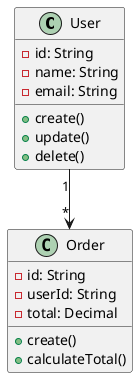

# DSL典型示例

## 📑 目录

- [DSL典型示例](#dsl典型示例)
  - [📑 目录](#-目录)
  - [1. 配置DSL示例](#1-配置dsl示例)
    - [1.1 YAML示例](#11-yaml示例)
    - [1.2 JSON Schema示例](#12-json-schema示例)
  - [2. 查询DSL示例](#2-查询dsl示例)
    - [2.1 SQL示例](#21-sql示例)
    - [2.2 GraphQL示例](#22-graphql示例)
  - [3. 建模DSL示例](#3-建模dsl示例)
    - [3.1 UML示例](#31-uml示例)
    - [3.2 BPMN示例](#32-bpmn示例)
  - [4. 领域DSL示例](#4-领域dsl示例)
    - [4.1 EDIFACT示例](#41-edifact示例)
    - [4.2 HL7示例](#42-hl7示例)
  - [5. 标准发展趋势](#5-标准发展趋势)
    - [5.1 2024-2025年趋势](#51-2024-2025年趋势)
    - [5.2 2025-2026年展望](#52-2025-2026年展望)

---

## 1. 配置DSL示例

### 1.1 YAML示例

```yaml
# 服务器配置
server:
  host: localhost
  port: 8080
  ssl:
    enabled: true
    certificate: /path/to/cert.pem

# 数据库配置
database:
  type: postgresql
  host: localhost
  port: 5432
  name: mydb
  credentials:
    username: admin
    password: secret
```

### 1.2 JSON Schema示例

```json
{
  "$schema": "http://json-schema.org/draft-07/schema#",
  "type": "object",
  "properties": {
    "name": {
      "type": "string",
      "minLength": 1,
      "maxLength": 100
    },
    "age": {
      "type": "integer",
      "minimum": 0,
      "maximum": 150
    }
  },
  "required": ["name"]
}
```

---

## 2. 查询DSL示例

### 2.1 SQL示例

```sql
SELECT u.name, o.total
FROM users u
JOIN orders o ON u.id = o.user_id
WHERE o.created_at >= '2025-01-01'
ORDER BY o.total DESC
LIMIT 10;
```

### 2.2 GraphQL示例

```graphql
query {
  user(id: "123") {
    name
    email
    orders {
      id
      total
      items {
        product {
          name
          price
        }
        quantity
      }
    }
  }
}
```

---

## 3. 建模DSL示例

### 3.1 UML示例



### 3.2 BPMN示例

```xml
<bpmn:process id="order_process">
  <bpmn:startEvent id="start"/>
  <bpmn:task id="validate_order"/>
  <bpmn:task id="process_payment"/>
  <bpmn:endEvent id="end"/>

  <bpmn:sequenceFlow sourceRef="start" targetRef="validate_order"/>
  <bpmn:sequenceFlow sourceRef="validate_order" targetRef="process_payment"/>
  <bpmn:sequenceFlow sourceRef="process_payment" targetRef="end"/>
</bpmn:process>
```

---

## 4. 领域DSL示例

### 4.1 EDIFACT示例

```text
UNH+1+ORDERS:D:96A:UN
BGM+220+12345+9
DTM+137:20250121:102
NAD+BY+++ABC Company
LIN+1++PRODUCT001:EN
QTY+21:10:EA
UNS+S
UNT+8+1
```

### 4.2 HL7示例

```text
MSH|^~\&|SendingApp|SendingFac|ReceivingApp|ReceivingFac|20250121120000||ADT^A01|12345|P|2.5
PID|1||123456^^^MRN||Doe^John||19900101|M|||123 Main St^^City^ST^12345
```

---

## 5. 标准发展趋势

### 5.1 2024-2025年趋势

**DSL分类标准发展趋势**：

1. **DSL标准化加速**
   - 领域特定语言标准化
   - 工具链完善
   - 互操作性提升

2. **AI辅助DSL设计**
   - AI生成DSL
   - 智能DSL推荐
   - 自动化DSL优化

3. **DSL生态系统成熟**
   - DSL工具链集成
   - 跨DSL转换
   - 统一DSL平台

### 5.2 2025-2026年展望

**未来发展方向**：

1. **统一DSL标准**
   - 跨领域DSL互操作
   - 统一DSL元模型
   - 标准化DSL工具

2. **智能化DSL**
   - AI驱动的DSL设计
   - 自动DSL生成
   - 智能DSL优化

3. **DSL即服务**
   - 云端DSL平台
   - DSL即服务模式
   - 低代码DSL开发

---

**参考文档**：

- `01_Overview.md` - 概述
- `02_Formal_Definition.md` - 分类体系
- `04_Transformation.md` - 最佳实践
- `05_Case_Studies.md` - 实践案例

**创建时间**：2025-01-21
**最后更新**：2025-01-21
