# AI代码集成Schema思维导图

## 📑 目录

- [AI代码集成Schema思维导图](#ai代码集成schema思维导图)
  - [📑 目录](#-目录)
  - [1. 思维导图概述](#1-思维导图概述)
    - [1.1 导图结构](#11-导图结构)
    - [1.2 核心概念](#12-核心概念)
    - [1.3 关联主题](#13-关联主题)
  - [2. 完整思维导图](#2-完整思维导图)
  - [3. 主要分支详解](#3-主要分支详解)
    - [3.1 代码生成](#31-代码生成)
    - [3.2 代码理解](#32-代码理解)
    - [3.3 代码转换](#33-代码转换)
    - [3.4 AI辅助开发](#34-ai辅助开发)
    - [3.5 模型集成](#35-模型集成)
  - [4. Mermaid可视化](#4-mermaid可视化)
    - [4.1 思维导图Mermaid图](#41-思维导图mermaid图)
    - [4.2 关联主题图](#42-关联主题图)

---

## 1. 思维导图概述

本文档以思维导图的形式展示AI代码集成Schema
的知识体系结构，帮助理解各个子领域之间的关系。

### 1.1 导图结构

思维导图分为以下主要分支：

1. **代码生成**: 自然语言转代码, 代码补全, 单元测试生成...
2. **代码理解**: 代码摘要, 语义搜索, 代码审查...
3. **代码转换**: 语言迁移, 重构建议, 性能优化...
4. **AI辅助开发**: 智能IDE, 对话式编程, 知识问答...
5. **模型集成**: LLM API, 本地部署, 微调训练...

### 1.2 核心概念

AI代码集成Schema的核心概念包括：

- **Schema定义**: 领域特定的数据结构和语义规范
- **标准化**: 遵循行业标准和最佳实践
- **互操作性**: 不同系统之间的数据交换能力
- **可扩展性**: 支持业务增长和变化的能力

### 1.3 关联主题

本主题与以下主题有关联：

- **30_Cloud_Native_DevOps**: 云原生DevOps Schema
- **31_Emerging_Technologies**: 新兴技术Schema
- **27_Enterprise_Data_Analytics**: 企业数据分析Schema

---

## 2. 完整思维导图

```text
AI代码集成Schema
│

├─ 1. 代码生成
│   ├─ 自然语言转代码
│   ├─ 代码补全
│   ├─ 单元测试生成
│   ├─ 文档生成

├─ 2. 代码理解
│   ├─ 代码摘要
│   ├─ 语义搜索
│   ├─ 代码审查
│   ├─ 漏洞检测

├─ 3. 代码转换
│   ├─ 语言迁移
│   ├─ 重构建议
│   ├─ 性能优化
│   ├─ 现代化改造

├─ 4. AI辅助开发
│   ├─ 智能IDE
│   ├─ 对话式编程
│   ├─ 知识问答
│   ├─ 错误诊断

├─ 5. 模型集成
│   ├─ LLM API
│   ├─ 本地部署
│   ├─ 微调训练
│   ├─ 提示工程
│
└─ 标准体系
    ├─ 国际标准
    │   ├─ ISO系列标准
    │   └─ IEC系列标准
    ├─ 行业标准
    │   ├─ 行业协会标准
    │   └─ 事实标准
    └─ 技术规范
        ├─ API规范
        ├─ 数据格式
        └─ 协议规范

├─ 技术架构
    │
    ├─ 数据层
    │   ├─ 数据模型
    │   ├─ 存储方案
    │   └─ 数据治理
    │
    ├─ 服务层
    │   ├─ 业务服务
    │   ├─ 集成服务
    │   └─ 公共服务
    │
    ├─ 应用层
    │   ├─ 业务应用
    │   ├─ 移动应用
    │   └─ 分析应用
    │
    └─ 接入层
        ├─ API网关
        ├─ 消息总线
        └─ 文件交换

├─ 集成模式
    │
    ├─ 系统间集成
    │   ├─ ESB总线
    │   ├─ API集成
    │   └─ 消息队列
    │
    ├─ 数据集成
    │   ├─ ETL流程
    │   ├─ 数据同步
    │   └─ 主数据管理
    │
    └─ 流程集成
        ├─ BPM编排
        ├─ 事件驱动
        └─ 微服务编排

├─ 安全体系
    │
    ├─ 身份认证
    │   ├─ 单点登录
    │   ├─ 多因素认证
    │   └─ 零信任架构
    │
    ├─ 访问控制
    │   ├─ 基于角色RBAC
    │   ├─ 基于属性ABAC
    │   └─ 最小权限原则
    │
    ├─ 数据安全
    │   ├─ 加密存储
    │   ├─ 传输加密
    │   └─ 数据脱敏
    │
    └─ 合规审计
        ├─ 日志记录
        ├─ 合规检查
        └─ 风险评估

└─ 实施方法
    │
    ├─ 方法论
    │   ├─ 敏捷开发
    │   ├─ DevOps
    │   └─ 领域驱动设计
    │
    ├─ 工具链
    │   ├─ 建模工具
    │   ├─ 开发框架
    │   └─ 测试工具
    │
    └─ 最佳实践
        ├─ 设计模式
        ├─ 代码规范
        └─ 运维规范
```

---

## 3. 主要分支详解

### 3.1 代码生成

```text
代码生成
    ├─ 自然语言转代码
    ├─ 代码补全
    ├─ 单元测试生成
    ├─ 文档生成
```

### 3.2 代码理解

```text
代码理解
    ├─ 代码摘要
    ├─ 语义搜索
    ├─ 代码审查
    ├─ 漏洞检测
```

### 3.3 代码转换

```text
代码转换
    ├─ 语言迁移
    ├─ 重构建议
    ├─ 性能优化
    ├─ 现代化改造
```

### 3.4 AI辅助开发

```text
AI辅助开发
    ├─ 智能IDE
    ├─ 对话式编程
    ├─ 知识问答
    ├─ 错误诊断
```

### 3.5 模型集成

```text
模型集成
    ├─ LLM API
    ├─ 本地部署
    ├─ 微调训练
    ├─ 提示工程
```


---

## 4. Mermaid可视化

### 4.1 思维导图Mermaid图

```mermaid
mindmap
  root((AI代码集成Schema))
      代码生成
        自然语言转代码
        代码补全
        单元测试生成
      代码理解
        代码摘要
        语义搜索
        代码审查
      代码转换
        语言迁移
        重构建议
        性能优化
      AI辅助开发
        智能IDE
        对话式编程
        知识问答
      模型集成
        LLM API
        本地部署
        微调训练

    标准体系
      国际标准
      行业标准
      技术规范
    技术架构
      数据层
      服务层
      应用层
    安全体系
      身份认证
      访问控制
      数据安全
    关联主题
      30 Cloud Native DevOps
      31 Emerging Technologies
      27 Enterprise Data Analytics

```



### 4.2 关联主题图

```mermaid
graph LR
    A[AI代码集成Schema] --> B[核心技术]
    A --> C[应用领域]
    A --> D[标准规范]

    A -.-> E[30 Cloud Native DevOps]
    A -.-> F[31 Emerging Technologies]
    A -.-> G[27 Enterprise Data Analytics]

    style A fill:#e1f5ff,stroke:#01579b,stroke-width:2px
```



---

**参考文档**：

- `../README.md` - 主题总览
- `Knowledge_Matrix.md` - 多维知识矩阵

**创建时间**：2026-02-16
**最后更新**：2026-02-16
