# 企业财务Schema思维导图

## 📑 目录

- [企业财务Schema思维导图](#企业财务schema思维导图)
  - [📑 目录](#-目录)
  - [1. 思维导图概述](#1-思维导图概述)
    - [1.1 导图结构](#11-导图结构)
    - [1.2 核心概念](#12-核心概念)
    - [1.3 关联主题](#13-关联主题)
  - [2. 完整思维导图](#2-完整思维导图)
  - [3. 主要分支详解](#3-主要分支详解)
    - [3.1 财务会计](#31-财务会计)
    - [3.2 管理会计](#32-管理会计)
    - [3.3 资金管理](#33-资金管理)
    - [3.4 税务管理](#34-税务管理)
    - [3.5 财务共享](#35-财务共享)
  - [4. Mermaid可视化](#4-mermaid可视化)
    - [4.1 思维导图Mermaid图](#41-思维导图mermaid图)
    - [4.2 关联主题图](#42-关联主题图)

---

## 1. 思维导图概述

本文档以思维导图的形式展示企业财务Schema
的知识体系结构，帮助理解各个子领域之间的关系。

### 1.1 导图结构

思维导图分为以下主要分支：

1. **财务会计**: 总账管理, 应收应付, 资产管理...
2. **管理会计**: 预算管理, 成本中心, 利润分析...
3. **资金管理**: 现金流管理, 银行对账, 融资管理...
4. **税务管理**: 发票管理, 纳税申报, 税务筹划...
5. **财务共享**: 共享中心, 流程标准化, 自动化处理...

### 1.2 核心概念

企业财务Schema的核心概念包括：

- **Schema定义**: 领域特定的数据结构和语义规范
- **标准化**: 遵循行业标准和最佳实践
- **互操作性**: 不同系统之间的数据交换能力
- **可扩展性**: 支持业务增长和变化的能力

### 1.3 关联主题

本主题与以下主题有关联：

- **15_ERP_Systems**: ERP系统Schema
- **27_Enterprise_Data_Analytics**: 企业数据分析Schema
- **28_Enterprise_Performance_Management**: 企业绩效管理Schema

---

## 2. 完整思维导图

```text
企业财务Schema
│

├─ 1. 财务会计
│   ├─ 总账管理
│   ├─ 应收应付
│   ├─ 资产管理
│   ├─ 报表分析

├─ 2. 管理会计
│   ├─ 预算管理
│   ├─ 成本中心
│   ├─ 利润分析
│   ├─ 投资评估

├─ 3. 资金管理
│   ├─ 现金流管理
│   ├─ 银行对账
│   ├─ 融资管理
│   ├─ 外汇管理

├─ 4. 税务管理
│   ├─ 发票管理
│   ├─ 纳税申报
│   ├─ 税务筹划
│   ├─ 转让定价

├─ 5. 财务共享
│   ├─ 共享中心
│   ├─ 流程标准化
│   ├─ 自动化处理
│   ├─ 数据集成
│
└─ 标准体系
    ├─ 国际标准
    │   ├─ ISO系列标准
    │   └─ IEC系列标准
    ├─ 行业标准
    │   ├─ 行业协会标准
    │   └─ 事实标准
    └─ 技术规范
        ├─ API规范
        ├─ 数据格式
        └─ 协议规范

├─ 技术架构
    │
    ├─ 数据层
    │   ├─ 数据模型
    │   ├─ 存储方案
    │   └─ 数据治理
    │
    ├─ 服务层
    │   ├─ 业务服务
    │   ├─ 集成服务
    │   └─ 公共服务
    │
    ├─ 应用层
    │   ├─ 业务应用
    │   ├─ 移动应用
    │   └─ 分析应用
    │
    └─ 接入层
        ├─ API网关
        ├─ 消息总线
        └─ 文件交换

├─ 集成模式
    │
    ├─ 系统间集成
    │   ├─ ESB总线
    │   ├─ API集成
    │   └─ 消息队列
    │
    ├─ 数据集成
    │   ├─ ETL流程
    │   ├─ 数据同步
    │   └─ 主数据管理
    │
    └─ 流程集成
        ├─ BPM编排
        ├─ 事件驱动
        └─ 微服务编排

├─ 安全体系
    │
    ├─ 身份认证
    │   ├─ 单点登录
    │   ├─ 多因素认证
    │   └─ 零信任架构
    │
    ├─ 访问控制
    │   ├─ 基于角色RBAC
    │   ├─ 基于属性ABAC
    │   └─ 最小权限原则
    │
    ├─ 数据安全
    │   ├─ 加密存储
    │   ├─ 传输加密
    │   └─ 数据脱敏
    │
    └─ 合规审计
        ├─ 日志记录
        ├─ 合规检查
        └─ 风险评估

└─ 实施方法
    │
    ├─ 方法论
    │   ├─ 敏捷开发
    │   ├─ DevOps
    │   └─ 领域驱动设计
    │
    ├─ 工具链
    │   ├─ 建模工具
    │   ├─ 开发框架
    │   └─ 测试工具
    │
    └─ 最佳实践
        ├─ 设计模式
        ├─ 代码规范
        └─ 运维规范
```

---

## 3. 主要分支详解

### 3.1 财务会计

```text
财务会计
    ├─ 总账管理
    ├─ 应收应付
    ├─ 资产管理
    ├─ 报表分析
```

### 3.2 管理会计

```text
管理会计
    ├─ 预算管理
    ├─ 成本中心
    ├─ 利润分析
    ├─ 投资评估
```

### 3.3 资金管理

```text
资金管理
    ├─ 现金流管理
    ├─ 银行对账
    ├─ 融资管理
    ├─ 外汇管理
```

### 3.4 税务管理

```text
税务管理
    ├─ 发票管理
    ├─ 纳税申报
    ├─ 税务筹划
    ├─ 转让定价
```

### 3.5 财务共享

```text
财务共享
    ├─ 共享中心
    ├─ 流程标准化
    ├─ 自动化处理
    ├─ 数据集成
```


---

## 4. Mermaid可视化

### 4.1 思维导图Mermaid图

```mermaid
mindmap
  root((企业财务Schema))
      财务会计
        总账管理
        应收应付
        资产管理
      管理会计
        预算管理
        成本中心
        利润分析
      资金管理
        现金流管理
        银行对账
        融资管理
      税务管理
        发票管理
        纳税申报
        税务筹划
      财务共享
        共享中心
        流程标准化
        自动化处理

    标准体系
      国际标准
      行业标准
      技术规范
    技术架构
      数据层
      服务层
      应用层
    安全体系
      身份认证
      访问控制
      数据安全
    关联主题
      15 ERP Systems
      27 Enterprise Data Analytics
      28 Enterprise Performance Management

```



### 4.2 关联主题图

```mermaid
graph LR
    A[企业财务Schema] --> B[核心技术]
    A --> C[应用领域]
    A --> D[标准规范]

    A -.-> E[15 ERP Systems]
    A -.-> F[27 Enterprise Data Analytics]
    A -.-> G[28 Enterprise Performance Management]

    style A fill:#e1f5ff,stroke:#01579b,stroke-width:2px
```



---

**参考文档**：

- `../README.md` - 主题总览
- `Knowledge_Matrix.md` - 多维知识矩阵

**创建时间**：2026-02-16
**最后更新**：2026-02-16
