# 企业数据分析Schema思维导图

## 📑 目录

- [企业数据分析Schema思维导图](#企业数据分析schema思维导图)
  - [📑 目录](#-目录)
  - [1. 思维导图概述](#1-思维导图概述)
    - [1.1 导图结构](#11-导图结构)
    - [1.2 核心概念](#12-核心概念)
    - [1.3 关联主题](#13-关联主题)
  - [2. 完整思维导图](#2-完整思维导图)
  - [3. 主要分支详解](#3-主要分支详解)
    - [3.1 数据仓库](#31-数据仓库)
    - [3.2 商业智能](#32-商业智能)
    - [3.3 高级分析](#33-高级分析)
    - [3.4 实时分析](#34-实时分析)
    - [3.5 数据平台](#35-数据平台)
  - [4. Mermaid可视化](#4-mermaid可视化)
    - [4.1 思维导图Mermaid图](#41-思维导图mermaid图)
    - [4.2 关联主题图](#42-关联主题图)

---

## 1. 思维导图概述

本文档以思维导图的形式展示企业数据分析Schema
的知识体系结构，帮助理解各个子领域之间的关系。

### 1.1 导图结构

思维导图分为以下主要分支：

1. **数据仓库**: ETL流程, 数据建模, 维度建模...
2. **商业智能**: 报表系统, 数据可视化, 自助分析...
3. **高级分析**: 预测分析, 机器学习, 文本分析...
4. **实时分析**: 流处理, 实时大屏, 异常检测...
5. **数据平台**: 数据湖, 数据中台, 湖仓一体...

### 1.2 核心概念

企业数据分析Schema的核心概念包括：

- **Schema定义**: 领域特定的数据结构和语义规范
- **标准化**: 遵循行业标准和最佳实践
- **互操作性**: 不同系统之间的数据交换能力
- **可扩展性**: 支持业务增长和变化的能力

### 1.3 关联主题

本主题与以下主题有关联：

- **26_Enterprise_Finance**: 企业财务Schema
- **28_Enterprise_Performance_Management**: 企业绩效管理Schema
- **25_AI_Code_Integration**: AI代码集成Schema

---

## 2. 完整思维导图

```text
企业数据分析Schema
│

├─ 1. 数据仓库
│   ├─ ETL流程
│   ├─ 数据建模
│   ├─ 维度建模
│   ├─ 数据治理

├─ 2. 商业智能
│   ├─ 报表系统
│   ├─ 数据可视化
│   ├─ 自助分析
│   ├─ 移动BI

├─ 3. 高级分析
│   ├─ 预测分析
│   ├─ 机器学习
│   ├─ 文本分析
│   ├─ 图分析

├─ 4. 实时分析
│   ├─ 流处理
│   ├─ 实时大屏
│   ├─ 异常检测
│   ├─ 预警系统

├─ 5. 数据平台
│   ├─ 数据湖
│   ├─ 数据中台
│   ├─ 湖仓一体
│   ├─ 数据编织
│
└─ 标准体系
    ├─ 国际标准
    │   ├─ ISO系列标准
    │   └─ IEC系列标准
    ├─ 行业标准
    │   ├─ 行业协会标准
    │   └─ 事实标准
    └─ 技术规范
        ├─ API规范
        ├─ 数据格式
        └─ 协议规范

├─ 技术架构
    │
    ├─ 数据层
    │   ├─ 数据模型
    │   ├─ 存储方案
    │   └─ 数据治理
    │
    ├─ 服务层
    │   ├─ 业务服务
    │   ├─ 集成服务
    │   └─ 公共服务
    │
    ├─ 应用层
    │   ├─ 业务应用
    │   ├─ 移动应用
    │   └─ 分析应用
    │
    └─ 接入层
        ├─ API网关
        ├─ 消息总线
        └─ 文件交换

├─ 集成模式
    │
    ├─ 系统间集成
    │   ├─ ESB总线
    │   ├─ API集成
    │   └─ 消息队列
    │
    ├─ 数据集成
    │   ├─ ETL流程
    │   ├─ 数据同步
    │   └─ 主数据管理
    │
    └─ 流程集成
        ├─ BPM编排
        ├─ 事件驱动
        └─ 微服务编排

├─ 安全体系
    │
    ├─ 身份认证
    │   ├─ 单点登录
    │   ├─ 多因素认证
    │   └─ 零信任架构
    │
    ├─ 访问控制
    │   ├─ 基于角色RBAC
    │   ├─ 基于属性ABAC
    │   └─ 最小权限原则
    │
    ├─ 数据安全
    │   ├─ 加密存储
    │   ├─ 传输加密
    │   └─ 数据脱敏
    │
    └─ 合规审计
        ├─ 日志记录
        ├─ 合规检查
        └─ 风险评估

└─ 实施方法
    │
    ├─ 方法论
    │   ├─ 敏捷开发
    │   ├─ DevOps
    │   └─ 领域驱动设计
    │
    ├─ 工具链
    │   ├─ 建模工具
    │   ├─ 开发框架
    │   └─ 测试工具
    │
    └─ 最佳实践
        ├─ 设计模式
        ├─ 代码规范
        └─ 运维规范
```

---

## 3. 主要分支详解

### 3.1 数据仓库

```text
数据仓库
    ├─ ETL流程
    ├─ 数据建模
    ├─ 维度建模
    ├─ 数据治理
```

### 3.2 商业智能

```text
商业智能
    ├─ 报表系统
    ├─ 数据可视化
    ├─ 自助分析
    ├─ 移动BI
```

### 3.3 高级分析

```text
高级分析
    ├─ 预测分析
    ├─ 机器学习
    ├─ 文本分析
    ├─ 图分析
```

### 3.4 实时分析

```text
实时分析
    ├─ 流处理
    ├─ 实时大屏
    ├─ 异常检测
    ├─ 预警系统
```

### 3.5 数据平台

```text
数据平台
    ├─ 数据湖
    ├─ 数据中台
    ├─ 湖仓一体
    ├─ 数据编织
```


---

## 4. Mermaid可视化

### 4.1 思维导图Mermaid图

```mermaid
mindmap
  root((企业数据分析Schema))
      数据仓库
        ETL流程
        数据建模
        维度建模
      商业智能
        报表系统
        数据可视化
        自助分析
      高级分析
        预测分析
        机器学习
        文本分析
      实时分析
        流处理
        实时大屏
        异常检测
      数据平台
        数据湖
        数据中台
        湖仓一体

    标准体系
      国际标准
      行业标准
      技术规范
    技术架构
      数据层
      服务层
      应用层
    安全体系
      身份认证
      访问控制
      数据安全
    关联主题
      26 Enterprise Finance
      28 Enterprise Performance Management
      25 AI Code Integration

```



### 4.2 关联主题图

```mermaid
graph LR
    A[企业数据分析Schema] --> B[核心技术]
    A --> C[应用领域]
    A --> D[标准规范]

    A -.-> E[26 Enterprise Finance]
    A -.-> F[28 Enterprise Performance Management]
    A -.-> G[25 AI Code Integration]

    style A fill:#e1f5ff,stroke:#01579b,stroke-width:2px
```



---

**参考文档**：

- `../README.md` - 主题总览
- `Knowledge_Matrix.md` - 多维知识矩阵

**创建时间**：2026-02-16
**最后更新**：2026-02-16
