# 企业绩效管理Schema思维导图

## 📑 目录

- [企业绩效管理Schema思维导图](#企业绩效管理schema思维导图)
  - [📑 目录](#-目录)
  - [1. 思维导图概述](#1-思维导图概述)
    - [1.1 导图结构](#11-导图结构)
    - [1.2 核心概念](#12-核心概念)
    - [1.3 关联主题](#13-关联主题)
  - [2. 完整思维导图](#2-完整思维导图)
  - [3. 主要分支详解](#3-主要分支详解)
    - [3.1 战略管理](#31-战略管理)
    - [3.2 绩效评估](#32-绩效评估)
    - [3.3 运营监控](#33-运营监控)
    - [3.4 目标管理](#34-目标管理)
    - [3.5 激励机制](#35-激励机制)
  - [4. Mermaid可视化](#4-mermaid可视化)
    - [4.1 思维导图Mermaid图](#41-思维导图mermaid图)
    - [4.2 关联主题图](#42-关联主题图)

---

## 1. 思维导图概述

本文档以思维导图的形式展示企业绩效管理Schema
的知识体系结构，帮助理解各个子领域之间的关系。

### 1.1 导图结构

思维导图分为以下主要分支：

1. **战略管理**: 战略地图, 平衡计分卡, OKR管理...
2. **绩效评估**: KPI体系, 360评估, 绩效面谈...
3. **运营监控**: 运营指标, 仪表盘, 预警机制...
4. **目标管理**: 目标分解, 目标对齐, 进度跟踪...
5. **激励机制**: 绩效薪酬, 股权激励, 奖金分配...

### 1.2 核心概念

企业绩效管理Schema的核心概念包括：

- **Schema定义**: 领域特定的数据结构和语义规范
- **标准化**: 遵循行业标准和最佳实践
- **互操作性**: 不同系统之间的数据交换能力
- **可扩展性**: 支持业务增长和变化的能力

### 1.3 关联主题

本主题与以下主题有关联：

- **26_Enterprise_Finance**: 企业财务Schema
- **27_Enterprise_Data_Analytics**: 企业数据分析Schema
- **15_ERP_Systems**: ERP系统Schema

---

## 2. 完整思维导图

```text
企业绩效管理Schema
│

├─ 1. 战略管理
│   ├─ 战略地图
│   ├─ 平衡计分卡
│   ├─ OKR管理
│   ├─ 战略解码

├─ 2. 绩效评估
│   ├─ KPI体系
│   ├─ 360评估
│   ├─ 绩效面谈
│   ├─ 绩效改进

├─ 3. 运营监控
│   ├─ 运营指标
│   ├─ 仪表盘
│   ├─ 预警机制
│   ├─ 复盘分析

├─ 4. 目标管理
│   ├─ 目标分解
│   ├─ 目标对齐
│   ├─ 进度跟踪
│   ├─ 结果评估

├─ 5. 激励机制
│   ├─ 绩效薪酬
│   ├─ 股权激励
│   ├─ 奖金分配
│   ├─ 晋升通道
│
└─ 标准体系
    ├─ 国际标准
    │   ├─ ISO系列标准
    │   └─ IEC系列标准
    ├─ 行业标准
    │   ├─ 行业协会标准
    │   └─ 事实标准
    └─ 技术规范
        ├─ API规范
        ├─ 数据格式
        └─ 协议规范

├─ 技术架构
    │
    ├─ 数据层
    │   ├─ 数据模型
    │   ├─ 存储方案
    │   └─ 数据治理
    │
    ├─ 服务层
    │   ├─ 业务服务
    │   ├─ 集成服务
    │   └─ 公共服务
    │
    ├─ 应用层
    │   ├─ 业务应用
    │   ├─ 移动应用
    │   └─ 分析应用
    │
    └─ 接入层
        ├─ API网关
        ├─ 消息总线
        └─ 文件交换

├─ 集成模式
    │
    ├─ 系统间集成
    │   ├─ ESB总线
    │   ├─ API集成
    │   └─ 消息队列
    │
    ├─ 数据集成
    │   ├─ ETL流程
    │   ├─ 数据同步
    │   └─ 主数据管理
    │
    └─ 流程集成
        ├─ BPM编排
        ├─ 事件驱动
        └─ 微服务编排

├─ 安全体系
    │
    ├─ 身份认证
    │   ├─ 单点登录
    │   ├─ 多因素认证
    │   └─ 零信任架构
    │
    ├─ 访问控制
    │   ├─ 基于角色RBAC
    │   ├─ 基于属性ABAC
    │   └─ 最小权限原则
    │
    ├─ 数据安全
    │   ├─ 加密存储
    │   ├─ 传输加密
    │   └─ 数据脱敏
    │
    └─ 合规审计
        ├─ 日志记录
        ├─ 合规检查
        └─ 风险评估

└─ 实施方法
    │
    ├─ 方法论
    │   ├─ 敏捷开发
    │   ├─ DevOps
    │   └─ 领域驱动设计
    │
    ├─ 工具链
    │   ├─ 建模工具
    │   ├─ 开发框架
    │   └─ 测试工具
    │
    └─ 最佳实践
        ├─ 设计模式
        ├─ 代码规范
        └─ 运维规范
```

---

## 3. 主要分支详解

### 3.1 战略管理

```text
战略管理
    ├─ 战略地图
    ├─ 平衡计分卡
    ├─ OKR管理
    ├─ 战略解码
```

### 3.2 绩效评估

```text
绩效评估
    ├─ KPI体系
    ├─ 360评估
    ├─ 绩效面谈
    ├─ 绩效改进
```

### 3.3 运营监控

```text
运营监控
    ├─ 运营指标
    ├─ 仪表盘
    ├─ 预警机制
    ├─ 复盘分析
```

### 3.4 目标管理

```text
目标管理
    ├─ 目标分解
    ├─ 目标对齐
    ├─ 进度跟踪
    ├─ 结果评估
```

### 3.5 激励机制

```text
激励机制
    ├─ 绩效薪酬
    ├─ 股权激励
    ├─ 奖金分配
    ├─ 晋升通道
```


---

## 4. Mermaid可视化

### 4.1 思维导图Mermaid图

```mermaid
mindmap
  root((企业绩效管理Schema))
      战略管理
        战略地图
        平衡计分卡
        OKR管理
      绩效评估
        KPI体系
        360评估
        绩效面谈
      运营监控
        运营指标
        仪表盘
        预警机制
      目标管理
        目标分解
        目标对齐
        进度跟踪
      激励机制
        绩效薪酬
        股权激励
        奖金分配

    标准体系
      国际标准
      行业标准
      技术规范
    技术架构
      数据层
      服务层
      应用层
    安全体系
      身份认证
      访问控制
      数据安全
    关联主题
      26 Enterprise Finance
      27 Enterprise Data Analytics
      15 ERP Systems

```



### 4.2 关联主题图

```mermaid
graph LR
    A[企业绩效管理Schema] --> B[核心技术]
    A --> C[应用领域]
    A --> D[标准规范]

    A -.-> E[26 Enterprise Finance]
    A -.-> F[27 Enterprise Data Analytics]
    A -.-> G[15 ERP Systems]

    style A fill:#e1f5ff,stroke:#01579b,stroke-width:2px
```



---

**参考文档**：

- `../README.md` - 主题总览
- `Knowledge_Matrix.md` - 多维知识矩阵

**创建时间**：2026-02-16
**最后更新**：2026-02-16
